[TOC]

# 一、go语言基础

## 1.环境与开发

**语言类型**

**go是静态类型，强类型，编译型语言**，变量的类型在编译时就决定了，不支持隐式类型转换

官网 https://go.dev/ 或 https://golang.google.cn/

**安装**

安装文档 https://golang.google.cn/doc/install https://go.dev/doc/install

从 https://go.dev/dl/ 或 https://golang.google.cn/dl/ 下载对应操作系统平台指定的版本即可。

```go
go env
set GO111MODULE=
set GOARCH=amd64
set GOENV=C:\Users\wayne\AppData\Roaming\go\env
set GOMODCACHE=C:\Users\wayne\go\pkg\mod
set GOOS=windows
set GOPATH=C:\Users\wayne\go
set GOPROXY=https://mirrors.aliyun.com/golang/,direct
set GOROOT=C:\Program Files\Go
set GOTOOLDIR=C:\Program Files\Go\pkg\tool\windows_amd64
set GOVERSION=go1.18.7
```

## 2.语法基础

### 2.1小规范

#### **注释**

```go
注释//，/*  */
// TODO: 将来完成，推荐
// NOTE: 请注意
// Deprecated: 告知已经过期，建议不要使用。未来某个版本可能移除
```

#### **命名规范**

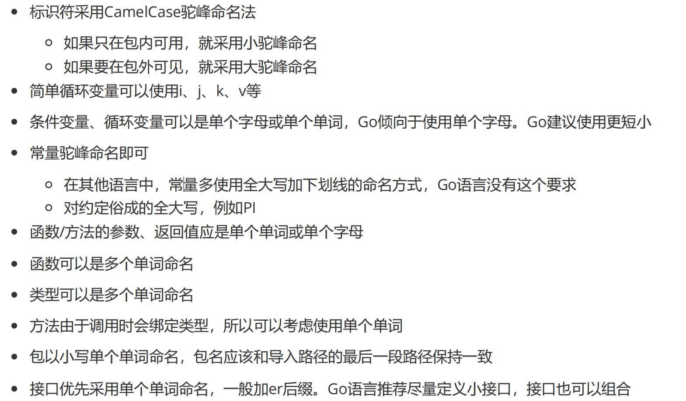

#### **关键字**

https://golang.google.cn/ref/spec

#### **预定义标识符**

https://golang.google.cn/ref/spec#Predeclared_identifier

#### **标识符**

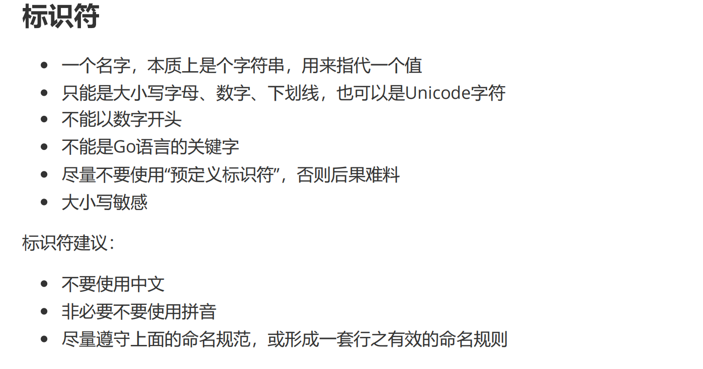

#### **字面常量**

它是值，不是标识符，但本身就是常量，不能被修改

Go语言中，boolean、rune、integer、float、complex、string都是**字面常量**。其中，rune、integer、float、complex常量被称为数值常量。

#### **常量**

**无类型**这个术语通常出现在讨论常量或字面量时，特别是在像 Go 这样的语言中。无类型的实体并不意味着没有类型，而是它们的类型依赖于上下文。

常量：使用const定义一个标识符，它所对应的值，不允许被修改。

```go
const a int = 100 // 指定类型定义并赋值
const (           // 以下为“无类型常量untyped constant”定义，推荐
    b = "abc"
    c = 12.3
    d = 'T'
)

fmt.Println(int(3.14)) // 错误，不允许无类型float常量转到int
```

Go语言的常量定义，必须是能在编译器就要完全确定其值，所以，值只能使用**字面常量**。

和其他语言不同！例如，在其他语言中，可以用常量标识符定义一个数组，因为常量标识符保证数组地址不变，而其内元素可以变化。但是Go根本不允许这样做。

#### **iota**（类似于枚举）

```go
// 单独写iota从0开始
const a = iota // 0
const b = iota // 0
```

```go
// 比较繁琐的写法，仅作测试
// 批量写iota从0开始，即使第一行没有写iota，iota也从第一行开始从0开始增加
const (
 a = iota // 0
 b        // 1
 c        // 2
 _        // 按道理是3，但是丢弃了
 d        // 4
 e = 10   // 10
 f        // 10
 g = iota // 6
 h        // 7
)
// 可以认为Go的const批量定义实现了一种重复上一行机制的能力
```

#### **变量**

```go
var a // 错误，无法推测类型
var b int // 正确，只声明，会自动赋为该类型的零值
var c, d int // 正确，声明连续的同类型变量，可以一并声明，会自动赋为该类型的零值
var b = 200 // 错误，b多次声明
```

```go
var a int, b string = 111, "abc" // 错误，多种类型不能这么写，语法不对
var (
    a int    = 111
    b string = "abc"
) // 正确，建议批量常量、变量都这么写
```

```go
// 短格式 Short variable declarations
// _ 空白标识符，或称为匿名变量
a := 100
b, c := 200, "xyz"
// 交换
b, c = c, b
d, _, f := func() (int, string, bool) { return 300, "ok", true }()
```

下划线和其他标识符使用方式一样，但它不会分配内存，不占名词空间

**为匿名变量赋值，其值会被抛弃，因此，后续代码中不能使用匿名变量的值，也不能使用匿名变量为其他变量赋值**

#### 短格式

使用 := 定义变量并立即初始化

只能用在函数中，**不能用来定义全局变量**

不能提供数据类型，由编译器来推断

#### **零值**

变量已经被声明，但是未被显式初始化，这是变量将会被设置为零值。

nt为0

float为0.0

bool为false

string为空串""（注意是双引号）

指针类型为nil

#### **标识符本质**

每一个标识符对应一个具有数据结构的值，但是这个值不方便直接访问，程序员就可以通过其对应的标识符来访问数据，标识符就是一个指代。一句话，标识符是给程序员编程使用的。

#### **变量可见性**

1、包级标识符

在Go语言中，在.go文件中的顶层代码中，定义的标识符称为**包级标识符**。如果首字母大写，可在包外可见。如果首字母小写，则包内可见。

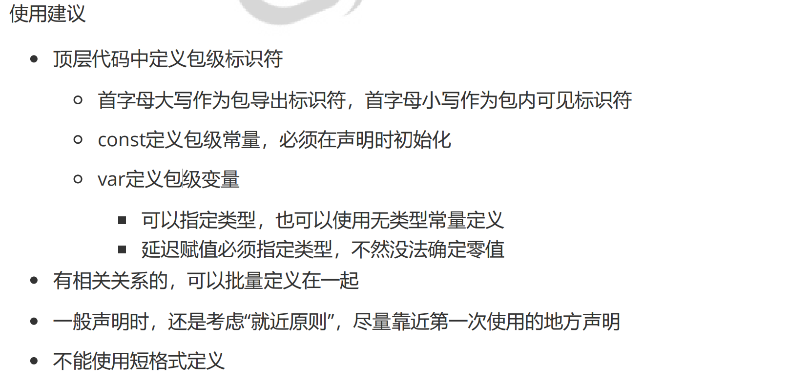

2、局部标识符

定义在函数中，包括main函数，这些标识符就是**局部标识符**。

### 2.2数据类型

#### **布尔型**

类型bool，定义了2个预定义常量，分别是true、false。

#### 数值型

https://golang.google.cn/ref/spec#Numeric_types

**复数**：complex64、complex128

**整型**：int8、int16（C语言short）、int32、int64（C语言long）

无符号：uint8、unit16、uint32、uint64

无符号数0~0xFF，即0到255，256种状态

有符号数，依然是256种状态，去掉最高位还剩7位，能够描述的最大正整数为127，那么负数最大就为-128。也就是说负数有128个，正整数有127个，加上0，共256种

**自动匹配平台**：int、uint

int类型它至少占用32位，但一定注意它不等同于int32，不是int32的别名。要看CPU，32位

就是4字节，64位就是8字节。但是也不是说int是8字节64位，就等同于int64，它们依然是不

同类型

**与其他语言不同，即使同是整型这个大类中，在Go中，也不能跨类型计算。如有必要，请强制类型转换**

#### **字符和整数**

字符表达，必须使用单引号引住一个字符。

```go
type rune = int32 // rune是int32的别名，4个字节，可以是Unicode字符
type byte = uint8 // byte是uint8的别名，1个字节
```

```go
var c rune = '中' // 字符用单引号
fmt.Printf("%T, %c, %d\n", c, c, c) // int32, 中, 20013
c = 'a'
fmt.Printf("%T, %c, %d\n", c, c, c) // int32, a, 97
var d byte = '中' // 错误，超出byte范围
var d byte = '\x61'
fmt.Printf("%T, %c, %d\n", d, d, d)
var e rune = 20013
fmt.Printf("%T, %c, %d\n", e, e, e)
```

特别注意：字符串在内存中使用utf-8，rune输出是unicode。

**浮点数**

float32：最大范围约为3.4e38，通过math.MaxFloat32查看

float64：最大范围约为1.8e308，通过math.MaxFloat64查看

#### **转义字符**

每一个都是一个字符，rune类型。可以作为单独字符使用，也可以作为字符串中的一个字符。

```go
\a   U+0007 alert or bell
\b   U+0008 backspace
\f   U+000C form feed
\n   U+000A line feed or newline
\r   U+000D carriage return
\t   U+0009 horizontal tab
\v   U+000B vertical tab
\\   U+005C backslash
\'   U+0027 single quote (valid escape only within rune literals)
\"   U+0022 double quote (valid escape only within string literals)
```

#### **字符串**

使用双引号或反引号引起来的任意个字符。它是字面常量

```go
"abc测试" // 不能换行，换行需要借助\n
"abc\n测试" // 换行
`abc
 测试` // 等价下面的字符串
"abc\n\t测试"
`json:"name"` // 字符串里面如果有双引号，使用反引号定义方便
"json:\"name\"" // 和上一行等价
"abc" + "xyz" // 拼接
```

#### **字符串格式化**

格式符参考fmt包帮助 https://pkg.go.dev/fmt

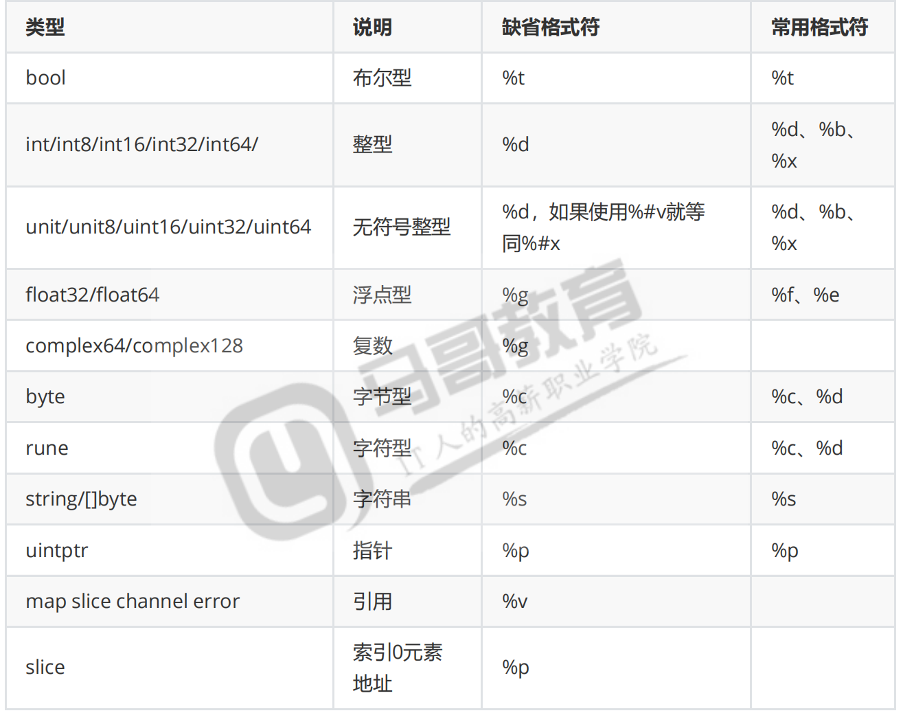

#### **特殊格式符写法**

```go
a, b, c, d := 100, 200, 300, 400
fmt.Printf("%d, %[2]v, %[1]d, %d", a, b, c, d)
```


#### **输出函数**

输出到标准输出

Print：使用缺省格式输出，空格分割

Println：使用缺省格式输出，空格分割，最后追加换行

Printf：按照指定的格式符输出

**输出到字符串，经常用来拼接字符串用**

Sprint：相当于Print，不过输出为string

Sprintln：相当于Println，不过输出为string

Sprintf：相当于Printf，不过输出为string

#### **常量计算问题**

常量分为typed类型化常量和untyped常量。

```go
var a int = 1
var b float32 = 2.3
fmt.Println(a * b) // 错误，int和float32类型不同，无法计算，除非强制类型转
var a = 1 // int
var b = 2.3 // float64
fmt.Println(a * b) // 错误，int和float61类型不同，无法计算，除非强制类型转换
fmt.Println(1 * 2.3) // 报错吗？
```

上面的常量被赋给了变量，这些变量就确定了类型，虽然他们指向的值是字面常量，但是计算使用变量，但变量的类型不一致，报错。

```go
var a = 1 * 2.3 // 不报错
```

右边使用的都是字面常量，而字面常量都是无类型常量untyped constant，它会在上下文中隐式转换。Go为了方便，不能过于死板，增加程序员转换类型的负担，在无类型常量上做了一些贴心操作

### 2.3运算符

**位运算符**

&位与、|位或、^异或、&^位清空、<<、>>

**比较运算符**

**逻辑运算符**

**赋值运算符**

**三元运算符**

Go 中**没有**三元运算符。

**运算符优先级**

单目 > 双目

算数 > 移位 > 比较 > 逻辑 > 赋值

**搞不清，用括号，避免产生歧义**

### 2.4**指针操作**

数据是放在内存中，内存是线性编址的。任何数据在内存中都可以通过一个地址来找到它。

& 取地址

*指针变量，表示通过指针取值

```go
a := 123
b := &a // &取地址
c := *b
fmt.Printf("%d, %p, %d\n", a, b, c)
// 请问，下面相等吗？
fmt.Println(a == c, b == &c, &c)
var d = a
fmt.Println(a == d, &a, &d) // &a == &d吗？
```

### 2.5流程控制

#### 2.5.1条件判断

**condition必须是一个bool类型，在Go中，不能使用其他类型等效为布尔值。 if 1 {} 是错误的**

**单分支**

```go
if condition {
    代码块
}
if 5 > 2 {
    fmt.Println("5 greater than 2")
}
```

**多分支**（还有嵌套）

```go
a :=6
if a < 0 {
 fmt.Println("negative")
} else if a > 0 { // 走到这里一定 a 不小于 0
 fmt.Println("positive")
} else { // 走到这里一定 a 不大于、也不小于 0
 fmt.Println("zero")
}
```

**特殊if**

```go
//99>90成立
if score, line := 99, 90; score > line {
 fmt.Println("perfect")
} else {
 fmt.Println("good")
} // score, line作用域只能是当前if语句
```

**switch**分支

```go
a := 20
switch a { // 待比较的是a          #switch a:=20;a {
case 10:
 fmt.Println("ten")
case 20:
 fmt.Println("twenty")
case 30, 40, 50: // 或关系
 fmt.Println(">=30 and <=50")
default:
 fmt.Println("other")
}


a := 20
switch { // 没有待比较变量，意味着表达式是true，是布尔型
case a > 0:
 fmt.Println("positive")
case a < 0:
 fmt.Println("negative")
default:
 fmt.Println("zero")
}
```

#### 2.5.2循环

**for循环**

```go
for i := 0; i < 10; i++ {
 fmt.Println(i)
} // 初始操作中的短格式定义的i的作用域只能在for中
```

```go
// 特殊写法
for i := 5; i < 10; {}
for i := 5; ; {} // 没条件就相当于true
for i < 10 {} // for condition {}，condition就是循环条件
for ;; {} // 死循环
// 死循环简写如下
for {} // 死循环 相对于 for true {}
```

**continue**

**中止**当前这一趟循环体的执行，直接执行“循环后操作”后，进入下一趟循环的条件判断

**break**

**终止**当前循环的执行，结束了。

**goto和label**

尘封这两关键字吧

**for range**

```go
for i, v := range "abcd测试" {
 fmt.Printf("%d, %[2]d, %[2]c, %#[2]x\n", i, v)
}
fmt.Println("\xe6\xb5\x8b\xe8\xaf\x95")

运行结果如下
0, 97, a, 0x61
1, 98, b, 0x62
2, 99, c, 0x63
3, 100, d, 0x64
4, 27979, 测, 0x6d4b
7, 35797, 试, 0x8bd5
测试
引就是字节偏移量，中文是utf-8编码，占3个字节。
%d 打印的是unicode值
%c 打印的是字符
```

```go
arr := [5]int{1, 3, 5, 7, 9}
for i, v := range arr {
 fmt.Println(i, v, arr[i])
}
for i := range arr {
 fmt.Println(i, arr[i])
}
for _, v := range arr {
 fmt.Println(v)
}
```

**随机数**

标准库"math/rand"

我们使用的是伪随机数，是内部写好的公式计算出来的。这个公式运行提供一个种子，有这个种子作为起始值开始计算。

src := rand.NewSource(100)，使用种子100创建一个随机数源

rand.New(rand.NewSource(time.Now().UnixNano())) ，利用当前时间的纳秒值做种子

r10 := rand.New(src)，使用源创建随机数生成器

r10.Intn(5)，返回[0, 5)的随机整数

```go
package main
import (
 "fmt"
 "math/rand"
)
func main() {
 src := rand.NewSource(10)
 r10 := rand.New(src)
 r1 := rand.New(rand.NewSource(1))
 for i := 0; i < 10; i++ {
 fmt.Printf("%d, %d, %d\n", rand.Intn(5), r1.Intn(5), r10.Intn(5))
 }
}
```

## 3.数据结构1

内存与编码的关系

**内存地址是存储数据的位置编号，如果是0x63就代表第99个内存地址，也就是第99个字节，而 ASCII、Unicode 和 UTF-8 是如何在这些地址上“表示”字符的方式。如内存中一个字节内容为0x63，可能为99也可能为’c‘。**

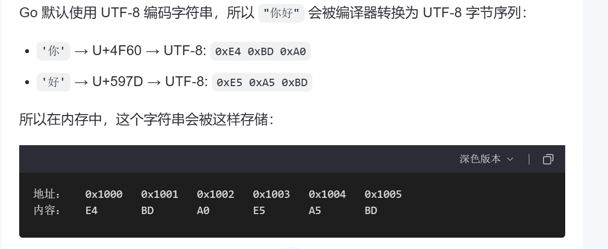

类型告诉编译器这个变量代表的数据结构和大小

编译器为把源代码翻译成机器码，并负责分配内存地址、处理类型、生成二进制可执行文件。

**不要深究内存机制，要深究先看完四大件，比如操作系统中地址总线什么的**


**理解**

底层而言：内存存储的仅仅是字节，字节本身没有意义

对于高级语言来说，内存存储的都是数据结构，而程序操作数据结构

### 3.1数值处理

**取整**

```go
fmt.Println(1/2, 3/2, 5/2)    //只取结果的整数部分
fmt.Println(-1/2, -3/2, -5/2)  
fmt.Println("~~~~~~~~~~~~~向上取整~~~~~~~~~~~~~~")
fmt.Println(math.Ceil(2.01), math.Ceil(2.5), math.Ceil(2.8))
fmt.Println(math.Ceil(-2.01), math.Ceil(-2.5), math.Ceil(-2.8))
fmt.Println("~~~~~~~~~~~~~向下取整~~~~~~~~~~~~~~")
fmt.Println(math.Floor(2.01), math.Floor(2.5), math.Floor(2.8))
fmt.Println("~~~~~~~~~~~~~~四舍五入~~~~~~~~~~~~~")
fmt.Println(math.Round(2.01), math.Round(2.5), math.Round(2.8))
fmt.Println(math.Round(-2.01), math.Round(-2.5), math.Round(-2.8))
fmt.Println(math.Round(0.5), math.Round(1.5), math.Round(2.5), 
math.Round(3.5))
```

**其它数值处理**

```go
fmt.Println(math.Abs(-2.7))                               // 绝对值
fmt.Println(math.E, math.Pi)                              // 常数
fmt.Println(math.MaxInt16, math.MinInt16)                 // 常量，极值
fmt.Println(math.Log10(100), math.Log2(8))                // 对数
fmt.Println(math.Max(1, 2), math.Min(-2, 3))              // 最大值、最小值
fmt.Println(math.Pow(2, 3), math.Pow10(3))                // 幂
fmt.Println(math.Mod(5, 2), 5%2)                          // 取模
fmt.Println(math.Sqrt(2), math.Sqrt(3), math.Pow(2, 0.5)) // 开方
```

**标准输入**

Scan：空白字符分割，回车提交。换行符当做空白字符

Scanf：读取输入，按照格式匹配解析。如果解析失败，立即报错，那么就会影响后面的Scanf。

```go
    var n int
	var err error
	var name string
	var age int
	fmt.Print("Plz input your name and age: ")
	n, err = fmt.Scanf("%s %d\n", &name, &age) // 这里要有\n以匹配回车
	if err != nil {
		panic(err)
	}
	fmt.Println(n, name, age)
	var weight, height int
	fmt.Print("weight and height: ")
	_, err = fmt.Scanf("%d %d", &weight, &height)
	if err != nil {
		panic(err)
	}
	fmt.Printf("%T %[1]d, %T %[2]d", weight, height)
```

### 3.2线性数据结构

#### 3.2.1数组

长度不可变
内容可变
可索引
值类型
顺序表

**一组连续的内存地址**

```go
// 注意下面2种区别
var a0 [3]int                   // 零值初始化3个元素的数组
var a1 = [3]int{}               // 零值初始化3个元素的数组
// [3]int是类型，[3]int{} 是字面量值


var a2 [3]int = [3]int{1, 3, 5} // 声明且初始化，不推荐，啰嗦
var a3 = [3]int{1, 3, 5}        // 声明且初始化，推荐


count := 3
a4 := [count] int{1,3,5} // 错误的长度类型，必须是常量，换成const
fmt.Println(a2, a3)


const count = 3
a4 := [count]int{1, 3, 5} // 正确
fmt.Println(a2, a3, a4)


a5 := [...]int {10, 30, 50} // ...让编译器确定当前数组大小

a6 := [5]int{100, 200}       // 顺序初始化前面的，其余用零值填充
a7 := [5]int{1: 300, 3: 400} // 指定索引位置初始化，其余用零值填充
// 二维数组
a8 := [2][3]int{{100}} // 两行三列 [[100 0 0] [0 0 0]]
// [[10 0 0] [11 12 0] [13 14 15] [16 0 0]]
// 多维数组，只有第一维才能用...推测
// 第一维有4个，第二维有3个。可以看做4行3列的表
a9 := [...][3]int{{10}, {11, 12}, {13, 14, 15}, {16}}
```

**长度和容量**

cap即capacity，容量，表示给数组分配的内存空间可以容纳多少**个**元素

len即length，长度，指的是容器中目前有几**个**元素

由于数组创建时就**必须确定**的元素个数，且不能改变长度，所以不需要预留多余的内存空间，因此cap和len对数组来说一样。

**索引**

Go语言不支持负索引。通过[index]来获取该位置上的值。索引范围就是[0, 长度-1]。

**遍历**

```go
//1、索引遍历
a5 := [...]int{10, 30, 50}
for i := 0; i < len(a5); i++ {
 fmt.Println(i, a5[i])
}

//for-range遍历
a5 := [...]int{10, 30, 50}
for i, v := range a5 {
 fmt.Println(i, v, a5[i])
}
```

**内存模型**

```go
var a [3]int // 内存开辟空间存放长度为3的数组，零值填充
for i := 0; i < len(a); i++ {
 fmt.Println(i, a[i], &a[i])
}
fmt.Printf("%p %p, %v\n", &a, &a[0], a)
a[0] = 1000
fmt.Printf("%p %p, %v\n", &a, &a[0], a)
```

所有元素一个接一个顺序存储在内存中

**元素的值可以改变，但是元素地址不变**

上面每个元素间隔8个字节，正好64位，符合int类型定义

**值类型**

```go
package main
import "fmt"
// 提前认识一下函数，不会就抄
func showAddr(arr [3]int) [3]int {
 fmt.Printf("%v, %p\n", arr, &arr)
    return arr
}
func main() {
 a1 := [...]int{10, 30, 50}
 fmt.Printf("%v, %p\n", a1, &a1)
 a2 := a1
 fmt.Printf("%v, %p\n", a2, &a2)
 fmt.Println("~~~~~~~~~~~~~~~~~~~~~~~~~~~")
 a3 := showAddr(a1)
 fmt.Printf("%v, %p\n", a3, &a3)
}
```

可以看出a1、a2、a3、a4的地址都不一样，最不可思议的是，a2 := a1后两个变量地址也不一样。这说明，Go语言在这些地方对数组进行了值拷贝，都生成了一份副本。


当你把一个值类型的变量赋值给另一个变量时，会复制整个数据内容到新的内存空间。

**对于引用类型，如切片、map 等，赋值操作不会复制底层数组或结构，而是复制指向它的指针。因此多个变量可以共享同一块数据。**

#### 3.2.2**切片**

引用类型

切片的底层是一个固定长度的数组，只不过在插入删除操作时，如果容量不够，将原数组的其他元素赋值到新定义的更长数组中，这样来动态调整大小

切片本质是对底层数组一个连续**片段**的引用。此片段可以是整个底层数组，也可以是由起始和终止索引标识的一些项的子集。


 https://github.com/golang/go/blob/master/src/runtime/slice.go

```go
type slice struct {
    array unsafe.Pointer
    len int
    cap int
}

a := []int{1, 3, 5, 7}
fmt.Printf("%v, %p, %p", a, &a, &a[0])
结果如下
[1 3 5 7], 0xc000004078, 0xc000012200
```

&a是切片结构体的地址，&a[0]是底层数组的地址。

##### **追加**

append：在切片的尾部追加元素，长度加1。

增加元素后，有可能超过当前容量，导致切片扩容。

**长度和容量**

```go
s1 := make([]int, 3, 5)
fmt.Printf("s1 %p, %p, l=%-2d, c=%-2d, %v\n", &s1, &s1[0], len(s1), cap(s1), s1)
s2 := append(s1, 1, 2) // append返回一个新的切片
fmt.Printf("s1 %p, %p, l=%-2d, c=%-2d, %v\n", &s1, &s1[0], len(s1), cap(s1), s1)
fmt.Printf("s2 %p, %p, l=%-2d, c=%-2d, %v\n", &s2, &s2[0], len(s2), cap(s2), s2)   //[0 0 0 1 2]
```

两个切片共用同一个底层数组

##### **扩容策略**

切片频繁扩容成本非常高，所以尽量早估算出使用的大小，一次性给够，建议使用make。常用make([]int, 0, 100) 。

**上面给的例子并未扩容，如果扩容，append超出底层数组容量，内存就会产生两个底层数组，而做内存优化，切片应该尽早估算出使用的大小，对同一组数据的切片，应该尽量只产生一个底层数组。**

其实这里还是值拷贝，不过拷贝的是切片的标头值（Header）（）。标头值内指针也被复制，刚复制完大家指向同一个底层数组罢了。但是仅仅知道这些不够，因为一旦操作切片时扩容了，或另一个切片增加元素，那么就不能简单归结为“切片是引用类型，拷贝了地址”这样简单的话来解释了。要具体问题，具体分析。

Go语言中全都是值传递，整型、数组这样的类型的值是完全复制，slice、map、channel、interface、function这样的引用类型也是值拷贝，不过复制的是标头值。

##### **截取子切片**

slice[start:end]，规则就是**前包后不包**。

```go
s4 := s1[1:] // 掐头，容量、长度都为4，首地址偏移1个元素，共用底层数组
```

start缺省，表示从索引0开始

end缺省，表示取到末尾，包含最后一个元素，特别注意这个值是len(slice)即切片长度**，**不是容量

切片刚产生时，和原序列（数组、切片）**开始**共用同一个底层数组，但是**每一个切片都自己独立保存着指针、cap和len**

一旦一个切片扩容，就和原来共用一个底层数组的序列分道扬镳，从此陌路

**数组也可以切片，会生成新的切片**

```go
s1 := [5]int{10, 30, 50, 70, 90} // 容量、长度为5，索引0、1、2、3、4
```

#### 3.2.3字符

ASCII码：单字节编码，UTF-8、GBK都兼容了ASCII

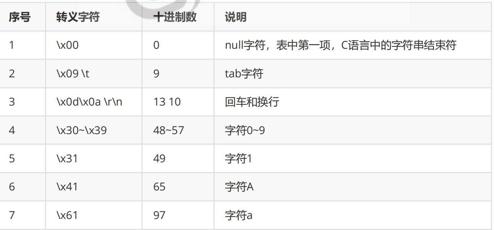

```go
"a\x09b\x0ac \x31\x41\x61" 表示什么？
'A' > 'a'  谁大？字符比较
"a" > "A"  谁大？字符串比较
"AA" > "Aa" # 谁大？ 逐个字符比较
```

需要多个字节表示一个字符，Go提供了rune类型

byte：兼容ASCII码的字符，是byte类型，即uint8别名，占用1个字节

rune：汉字等字符，unicode，是rune类型，即int32别名，占用4个字节

一个字符字面量使用单引号引起来

```go
s1 := "abc"
s2 := "测试"
fmt.Println(len(s1), len(s2)) // 3, 6 字节
// 强制类型转换 string => []byte; string => []rune
// 注意[]byte表示字节序列；[]rune表示rune序列
fmt.Println([]byte(s1))
fmt.Println([]rune(s1))
fmt.Println([]byte(s2)) // utf-8 bytes，长度为6即6个字节
fmt.Println([]rune(s2)) // unicode切片，长度为2，每个元素4字节
fmt.Printf("%x, %x", 27979, 35797)
fmt.Println("~~~~~~~~~~~~~~~~~~~~~~~~~~~")
// []byte => string
fmt.Println(string([]byte{49, 65, 97}))
// []rune => string
fmt.Println(string([]rune{27979, 35797}))
// rune使用unicode，但是字符串内部使用utf-8
fmt.Println(s2[0], s2[1], s2[2]) // 索引取到了什么？
fmt.Println(string([]byte{230, 181, 139})) // 打印什么？
```

string(整数)，强制类型转换一个整数，相当于把整数当unicode码，去查一个字符，最后返回字符串

string(整数序列)，强制类型转换一个整数序列，也是转成字符串

#### 3.2.4字符串

**字符串的底层实现本质上是一个只读的 `byte` 类型数组**，为什么不用rune，unicode编码，因为内存优化

字面常量，只读，不可变

线性数据结构，可以索引

值类型

utf-8编码

**长度**

使用内建函数len，返回字符串占用的字节数。时间复杂度为O(1)，字符串是字面常量，定义时已经知道长度，记录下来即可

**索引**

不支持负索引，索引范围[0, len(s)-1]。

即使是有中文，索引指的是按照**字节的偏移量**。

时间复杂度O(1)，使用索引计算该字符相对开头的偏移量即可。

对于顺序表来说，使用索引效率查找效率是最高的。

**遍历**

```go
//C风格使用索引遍历，相当于字节遍历
s := "magedu马哥教育"
for i := 0; i < len(s); i++ {
 fmt.Printf("%d, %T, %[2]d %[2]c\n", i, s[i])
}

//for-range遍历，安全地遍历字符
s := "magedu"
for i, v := range s {
 fmt.Printf("%d, %T: %[2]d %[2]c; %T: %[3]d %[3]c\n", i, s[i], v) // 注意i不连续。v是汉字的unicode
}
```

##### **strings库**

strings提供了大多数字符串操作函数，使用方便。

**注意：字符串是字面常量，不可修改，很多操作都是返回新的字符串**

**拼接**

Join：使用间隔符拼接字符串切片

Builder：推荐的字符串拼接方式

```go
s0 := "www.magedu.edu"
s1 := "马哥教育"
fmt.Printf("%s %p; %s %p\n", s0, &s0, s1, &s1)
s2 := s0 + "-" + s1
fmt.Printf("%s %p\n", s2, &s2)
s3 := strings.Join([]string{s0, s1}, "-")
fmt.Printf("%s %p\n", s3, &s3)

s4 := fmt.Sprintf("%s-%s", s0, s1)
fmt.Printf("%s %p\n", s4, &s4)
var b strings.Builder
b.WriteString(s0)
b.WriteByte('-')
b.WriteString(s1)
s5 := b.String()
fmt.Printf("%s %p\n", s5, &s5)
```

**查询**

```go
s := "www.magedu.com马哥教育"
fmt.Println('马', "马"[0])
fmt.Println(
 strings.Index(s, "马"),
 strings.IndexAny(s, "马"),
 strings.IndexByte(s, 233),
 strings.IndexRune(s, 39532),
 strings.Contains(s, "马"),
 strings.Count(s, "m"),
)
```

**大小写**

ToLower：转换为小写

ToUpper：转换为大写

**前后缀**

HasPrefix：是否以子串开头

HasSuffix：是否以子串结尾

**移除**

```go
fmt.Println(strings.TrimSpace("\v\n\r \tabc\txyz\t \v\r\n"))
fmt.Println(strings.TrimPrefix("www.magedu.edu-马哥教育", "www."))
fmt.Println(strings.TrimSuffix("www.magedu.edu-马哥教育", ".edu"))
fmt.Println(strings.TrimLeft("abcdddeabeccc", "abcd"))
fmt.Println(strings.TrimRight("abcdddeabeccc", "abcd"))
fmt.Println(strings.Trim("abcdddeabeccc", "abcd"))
```

**分割**

Split：按照给定的分割子串去分割，返回切割后的字符串切片。

```go
s0 := "www.magedu.edu"
s00 := strings.Split(s0, ".")            //会分出三个切片
fmt.Printf("%s", s00)
fmt.Printf("%s", s00[0])
```

SplitN(s, sep string, n int) []string

n == 0，返回空切片，切成0个子串

n > 0，返回切片元素的个数

n == 1，返回一个元素切片，元素为s，相当于Split的没有切到

n > 1，按照sep切割。返回多个元素的切片。按照sep切成的段数最多有x段，当n < x

时，会有部分剩余字符串未切；n == x时，字符串s正好从头到尾切完，返回所有段的切

片；n > x时，和n == x一样。n表示切割出来的子串的上限，即至多切片里面有n个元素

n < 0，等价Split，能切多少切出多少

```go
//第三个参数int类型代表返回切片的个数，返回一个切片，不需要切
	s000 := strings.SplitN(s0, ".", 0)
	s001 := strings.SplitN(s0, ".", 1)
	s002 := strings.SplitN(s0, ".", 2)
	s003 := strings.SplitN(s0, ".", -1)
	fmt.Printf("\n%s,\n%s,\n%s,\n%s", strings.SplitN(s0, ".", 0), s001, s002, s003)
```

SplitAfter和Split相似，就是不把sep切掉

SplitAfterN和SplitN相似，也不把sep切掉

```go
fmt.Printf("\n%v,\n%v,\n%v", strings.SplitAfterN(s0, ".", 2), s000, s002)
```

**替换**

Replace(s, old, new string, n int) string    ,n的作用与分割函数内一样

n < 0，等价ReplaceAll，全部替换

n == 0，或old == new，就返回s

n > 0，至多替换n次，如果n超过找到old子串的次数x，也就只能替换x次了

未找到替换处，就返回s

```go
	fmt.Printf("\n%v,\n%v,\n%v,\n%v",
		strings.Replace(s0, ".", ",", 0),
		strings.Replace(s0, ".", ",", 1),
		strings.Replace(s0, ".", ",", 2),
		strings.Replace(s0, ".", ",", -1))
```

**其他**

Repeat：使用给定的字符串重复n次拼接成一个新字符串。

Map：按照给定处理每个rune字符的函数依次处理每个字符后，拼接成字符串返回。注意Map是一对一的映射，不能减少元素个数。

```go
//函数式编程思想
fmt.Println(strings.Map(func(r rune) rune {
		if 'a' <= r && r <= 'z' {
			return r - 0x20 // 请问这是干什么？大小写转换
		}
		return r
}, s0))
```

#### 3.2.5类型转换

**数值类型转换**

低精度向高精度转换可以，高精度向低精度转换会损失精度

无符号向有符号转换，最高位是符号位

byte和int可以互相转换

float和int可以相互转换，float到int会丢失精度

**bool和int不能相互转换**

不同长度的int和float之间可以互相转换

如果不使用无类型常量，有类型的计算如果类型不一致要报错，因为Go是对类型要求非常严苛的语言，要强制类型转换。

**类型别名和类型定义**

**字符串转换**

在字符那一节，我们介绍过了字符串与[]byte、字符串与[]rune之间互转的例子，这里不再赘述。

#### 3.2.6哈希表

##### **映射**

映射Map，也有语言称为字典。

长度可变

存储的元素是key-value对（键值对），value可变

key无序不重复

不可索引，需要通过key来访问

**不支持零值可用**，也就是说，必须要用**make**或**字面常量构造**

引用类型

哈希表

##### **哈希算法**

哈希Hash算法特征

hash(x) 一定得到一个y值

输入可以是任意长度，输出是固定长度

hash函数一般设计的计算效率很高

由于输入空间（可以理解为取值范围）远远大于输出空间，有可能不同的x经过hash得到同样的y，这称为碰撞，也称冲突

不同的x计算出的y值应当在输出空间中分布均匀，减少碰撞

不能由y反推出x，hash算法不可逆

一个微小的变化，哪怕x是一个bit位的变化，也将引起结果y巨大的变化

**常见算法**

SHA（Secure Hash Algorithm）安全散列算法，包含一个系列算法，分别是SHA-1、SHA-224、SHA-256、SHA-384，和SHA-512。

数字签名防篡改

MD5（Message Digest Algorithm 5）信息摘要算法5，输出是128位。运算速度叫SHA-1快

用户密码存储

上传、下载文件完整性校验

大的数据的快速比对，例如字段很大，增加一个字段存储该字段的hash值，对比内容开是否修改

https://pkg.go.dev/crypto/sha256#example-New

https://pkg.go.dev/crypto/md5#example-New

```go
h := sha256.New()
h.Write([]byte("abc"))
 r := h.Sum(nil)
 s := fmt.Sprintf("%x", r)
fmt.Printf("%T %s %d\n", r, s, len(s))
```

```go
h := md5.New()
 h.Write([]byte("abc"))
 fmt.Printf("%T %[1]x\n", h.Sum(nil)) // []uint8 
900150983cd24fb0d6963f7d28e17f72
 h.Reset()
 h.Write([]byte("abd"))
 fmt.Printf("%T %[1]x\n", h.Sum(nil)) // []uint8 
4911e516e5aa21d327512e0c8b197616
```


##### **内存模型**

map采用哈希表实现。Go的map类型也是引用类型，有一个标头值hmap，指向一个底层的哈希表。

1. 哈希函数
当你向 map 中插入一个键值对时，Go 使用该键的哈希函数计算出一个哈希值（hash code）。这个哈希值决定了键值对在内部数组中的位置。

2. 解决冲突
由于不同的键可能产生相同的哈希值（哈希碰撞），Go 使用 链地址法 来处理这种情况。每个数组元素实际上是一个指向桶（bucket）的指针，每个桶可以存储多个键值对。

3. 扩容机制
当 map 中的元素数量接近其容量限制时，Go 会自动进行扩容操作。扩容时，会重新分配更大的内存，并重新计算所有键的哈希值以重新分布键值对。

##### **构造**

```go
var m1 map[string]int // nil，很危险。map不是零值可用
// 1 字面量
var m0 = map[string]int{} // 安全，没有一个键值对而已

var m1 = map[string]int{
 "a": 11,
 "b": 22,
 "c": 33,
}
// 2 make
m2 := make(map[int]string) // 一个较小的起始空间大小
m2[100] = "abc"
m3 := make(map[int]string, 100) // 容量100，长度为0，为了减少扩容，提前给合适的容量
```

##### 基本操作

```go
m["a"] = 11 // key不存在，则创建新的key和value对
m["a"] = 22 // key已经存在，则覆盖value

fmt.Println(m["a"]) // 存在返回22
len(m) // 返回kv对的个数

delete(m, "a") // 存在，删除kv对
```

##### 遍历

```go
for k, v := range m {
 fmt.Println(k, v)
}
```

注意：map的key是无序的，千万不要从遍历结果来推测其内部顺序

#### 3.2.7**排序**

Go的标准库提供了sort库，用来给线性数据结构排序、二分查找

```go
// 切片排序
a := []int{-1, 23, 5, 9, 7}
// sort.Sort(sort.IntSlice(a)) // 默认升序，有快捷写法Ints
sort.Ints(a)   // 就地修改原切片的底层数组
fmt.Println(a) // 默认升序
// 降序 sort.IntSlice(a)强制类型转换以施加接口方法
sort.Sort(sort.Reverse(sort.IntSlice(a)))
fmt.Println(a)

// 降序 sort.IntSlice(a)强制类型转换以施加接口方法
sort.Sort(sort.Reverse(sort.IntSlice(a)))
fmt.Println(a)

// 二分查找
a := []int{-1, 23, 5, 9, 7}
sort.Ints(a)
// 二分查找，必须是升序
// 二分查找的前提是 有序
i := sort.SearchInts(a, 7)
fmt.Println(i)
```

## 4.函数

函数的作用

结构化编程对代码的最基本的**封装**，一般按照功能组织一段代码

封装的目的为了**复用**，减少冗余代码

代码更加简洁美观、可读易懂

```go
func 函数名(参数列表) [(返回值列表)]{
   函数体（代码块）
   [return 返回值]
}
```

返回值列表可有可无，需要return语句配合，表示一个功能函数执行完返回的结果

Go语言中形参也被称为入参，返回值也被称为出参

#### **函数调用原理**

函数调用相当于运行一次函数定义好的代码，函数本来就是为了复用，试想你可以用加法函数，我也可以用加法函数，你加你的，我加我的，应该互不干扰的使用函数。为了实现这个目标，函数调用的一般实现，都是把函数压栈（LIFO），每一个函数调用都会在栈中分配专用的栈帧，本地变量、实参、返回值等数据都保存在这里。

首先调用main函数，main压栈，接着调用add(4, 5)时，add函数压栈，压在main的栈帧之上，add调用return，add栈帧消亡，回到main栈帧，将add返回值保存在main栈帧的本地变量out上。

返回多值

```go
// 返回多个值
func fn4() (int, bool) {
    a, b := 100, true
    return a, b
}

fmt.Println(fn4())
x, y := fn4() // 需要两个变量接收返回值

// 下面写法对吗？
func fn4() (i int, b bool) {
 return
}
```

```go
// 注意下面写法的错误
func fn5() (i int, err error) {
 if _, err := os.Open("o:/t"); err != nil {
        return // 错误，因为err被重新定义，只能在if中使用，返回值的err就被覆盖了，就是上一行:=的问题
        // return -1, err // 正确
 }
    return
}


func fn6(nums ...int) { // 可变形参
 fmt.Printf("%T %[1]v, %d, %d\n", nums, len(nums), cap(nums))
}
```

#### **可变参数**

可变参数收集实参到一个切片中

如果有可变参数，那它必须位于参数列表中最后。 func fn7(x, y int, nums ...int, z string){} 这是错误的

**切片分解**

也可以使用切片分解传递给可变参数，切片不能传递给非可变参数，这个功能和其他语言的参数解构很像，但是不一样

#### **作用域**

**语句块作用域**

**显式的块作用域**

在任何一个大括号中定义的标识符，其作用域只能在这对大括号中

**universe块**

宇宙块，意思就是全局块，不过是语言内建的。

**包块**

一个package包含该包所有源文件，形成的作用域。有时在包中顶层代码定义标识符，也称为全局标识符。

所有包内定义全局标识符，包内可见。包外需要大写首字母导出，使用时也要加上包名。

**函数块**

#### 递归函数

**斐波那契数列递归**

斐波那契数列Fibonacci number：1, 1, 2, 3, 5, 8, 13, 21, 34, 55, 89, 144, ...

如果设F(n）为该数列的第n项（n∈N*），那么这句话可以写成如下形式：F(n)=F(n-1)+F(n-2)，有F(0)=0，F(1)=1, F(n)=F(n-1)+F(n-2)

```go
//1. 采用递推公式
func fib(n int) int {
 // 递归公式版本。为了让同学们更加清晰的看清主干，这里简化switch
 if n < 3 {
 return 1
 }
 return fib(n-1) + fib(n-2)
}
fib(45)

//2. 循环层次变成递归函数层次
func fib(n, a, b int) int {
 if n < 3 {
 return b
 }
 return fib(n-1, b, a+b)
}
fib(45, 1, 1)
```

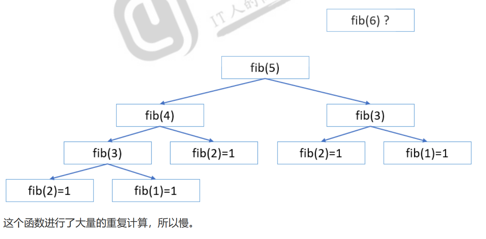

**递归要求**

递归一定要有退出条件，递归调用一定要执行到这个退出条件。没有退出条件的递归调用，就是无限调用

递归调用的深度不宜过深

Go语言不可能让函数无限调用，栈空间终会耗尽

goroutine stack exceeds 1000000000-byte limit

**递归效率**

以上3个斐波那契数列实现，请问那个效率高？递归效率一定低吗？哪个版本好？

递归版本1效率极低，是因为有大量重复计算。

递归版本2采用了递归函数调用层次代替循环层次，效率还不错，和循环版效率差不多。

那么递归版2和循环版谁好？

循环版好些，因为递归有深度限制，再一个函数调用开销较大。

**间接递归**

```go
func foo() {
 bar()
}
func bar() {
 foo()
}
foo()
```

绝大多数递归，都可以使用循环实现

**即使递归代码很简洁，但是能不用则不用递归**

#### 匿名函数

```go
package main
import "fmt"
func calc(a, b int, fn func(int, int) int) int {
 return fn(a, b)
}
func main() {
 fmt.Println(calc(4, 5, func(a, b int) int { return a + b })) // 加法
 fmt.Println(calc(4, 5, func(a, b int) int { return a * b })) // 乘法
}
```

但是Go语言没有lambda表达式，也没有类似JavaScript的箭头函数，匿名函数写起来还是较为繁琐，只能使用类型别名简化，但是并没有什么太大的作用。

#### 函数嵌套

outer中定义了另外一个函数inner，并且调用了inner。outer是包级变量，main可见，可以调用。而inner是outer中的局部变量，outer中可见。

#### **闭包**

就是一个概念，出现在嵌套函数中，指的是**内层函数引用到了外层函数的自由变量**，就形成了闭包。很多语言都有这个概念，最熟悉就是JavaScript。闭包是运行期动态的概念。

```go
func outer() func() {
 c := 99
 fmt.Printf("outer %d %p\n", c, &c)
 var inner = func() {
 fmt.Printf("inner %d %p\n", c, &c)
 }
 return inner
}
func main() {
 var fn = outer()
 fn()
}
```

在某个时刻，fn函数调用时，需要用到c，但是其内部没有定义c，它是outer的局部变量，如果这个c早已随着outer的调用而释放，那么fn函数调用一定出现错误，所以，这个outer的c不能释放，但是outer已经调用完成了，怎么办？闭包，让inner函数记住自由变量c（内存地址）

#### defer

同一个函数可以有多个defer语句，依次加入调用栈中（LIFO），函数返回或panic时，从栈顶依次执行defer后语句。执行的先后顺序和注册的顺序正好相反，也就是后注册的先执行

```go
func main() {
 count := 1
 fmt.Println("start")
 defer fmt.Println(count)
 count++
 defer fmt.Println(count)
 count++
 defer fmt.Println(count)
 fmt.Println("end")
}
```

结果是3 2 1。为什么？因为defer注册时就，就把其后语句的延迟执行的函数的参数准备好了，也就是**注册时计算**。

```go
func main() {
 count := 1
 fmt.Println("start")
 defer func() { fmt.Println(count) }() //    fmt.Println(count)
 count++
 defer fmt.Println(count)
 count++
 defer fmt.Println(count)
 fmt.Println("end")
}
```

结果是323，因为第8行注册时要确定实际参数，而这是个匿名无参函数，没法准备参数。延迟执行时，打印是才要用count，其外部作用域有一个count，目前是3。

## 5.结构体

### 5.1结构体初始化

```go
type User struct {
 id         int
 name, addr string // 多个字段类型相同可以合写
 score      float32
}

// 1 var声明，非常常用
var u1 User // 这种方式声明结构体变量很方便，所有字段都是零值
fmt.Println(u1)
fmt.Printf("%+v\n", u1) // 加上字段打印
fmt.Printf("%#v\n", u1) // 加上更多信息打印
// 2 字面量初始化，推荐
u2 := User{} // 字段为零值
fmt.Printf("%#v\n", u2)
// 3 字面量初始化，field: value为字段赋值
u3 := User{id: 100}
fmt.Printf("%+v\n", u3)
u4 := User{
 id: 102, score: 95.8,
 addr: "Nanjing", name: "Tom",
} // 名称对应无所谓顺序
u5 := User{103, "John", "Beijing", 98.5} // 无字段名称必须按照顺序给出全部字段值
fmt.Printf("%+v\n", u4)
fmt.Printf("%+v\n", u5)
```

| 场景                   | 推荐写法                   |
| ---------------------- | -------------------------- |
| 快速声明零值结构体     | `User{}`                   |
| 快速获得一个结构体指针 | `&User{}` ✅ 推荐           |
| 泛型场景或底层库构造   | `new(User)`                |
| 需要初始化字段并传指针 | `&User{Name: "xx"}` ✅ 推荐 |

依赖（对象、资源）注入（解耦的设计思想）

大多数依赖注入框架或容器，期望注入的是指针（对象的引用）。

### 5.2可见性

Go中大写字母开头标识符，跨package包可见，否则只能本包内可见

结构体名称以大写开头时，package内外皆可见，在此前提下，结构体中以大写开头的成员（属性、方法）在包外也可见

### 5.3成员方法

getName

```go
type User struct {
 id         int
 name, addr string
 score      float32
}
// u称为receiver
// 等价于 func (User) string
func (u User) getName() string {
 return u.name
}
func main() {
 u1 := User{103, "John", "Beijing", 98.5}
 fmt.Println(u1.getName())
}
```

### 5.4指针

结构体是**非引用类型**，使用的是值拷贝。传参或返回值如果使用结构体实例，将产生很多副本。如何避免过多副本，如何保证函数内外使用的是同一个结构体实例呢？使用指针。

仅针对操作同一实例。

### 5.5匿名结构体

匿名结构体，只是为了快速方便地得到**一个**结构体实例，而不是使用结构体创建N个实例。

就是结构体变量，上述是结构体类型。类比：学生，张三

```go
var Point struct {
 x, y int
} // 定义Point是后面匿名结构体类型的，用零值
fmt.Printf("%#v\n", Point) // 得到的是一个结构体实例
var message = struct {
 id   int
 data string
}{1, "OK"} // 不用零值，初始化
fmt.Printf("%#v\n", message)
student := struct {
 id   int
 name string
}{1, "Tom"} // 短格式定义并初始化
```

### 5.6匿名成员

个人不建议这么做，一般情况下，字段名还是应该见名知义，匿名不便于阅读。

### 5.7构造函数

Go语言并没有从语言层面为结构体提供什么构造器，但是有时候可以通过一个函数为结构体初始化提供属性值，从而方便得到一个结构体实例。习惯上，函数命名为 NewXxx 的形式。

```go
type Animal struct {
 name string
 age  int
}
func NewAnimal(name string, age int) Animal {
 a := Animal{name, age}
 fmt.Printf("%+v, %p\n", a, &a)
 return a
}
func main() {
 a := NewAnimal("Tom", 20)
 fmt.Printf("%+v, %p\n", a, &a)
}
```

上例中，NewAnimal的返回值使用了值拷贝，增加了内存开销，**习惯上返回值会采用指针类型**，避免实例的拷贝。

```go
func NewAnimal(name string, age int) *Animal {
 a := Animal{name, age}
 fmt.Printf("%+v, %p\n", a, &a)
 return &a
}
```

### 5.8父子关系构造

使用结构体嵌套实现类似面向对象父类子类继承（派生）的效果

子结构体使用匿名成员能简化调用父结构体成员

```go
package main
import "fmt"
type Animal struct {
 name string
 age  int
}
type Cat struct {
 Animal // 匿名成员，可以使用类型名作为访问的属性名
 color  string
}
func main() {
 var cat = new(Cat) // Cat实例化，Animal同时被实例化
 fmt.Printf("%#v\n", cat)
 cat.color = "black"     // 子结构体属性
 cat.Animal.name = "Tom" // 完整属性访问
 cat.age = 20            // 简化写法，只有匿名成员才有这种效果
 fmt.Printf("%#v\n", cat)
}
```

### 5.9指针类型receiver

Go语言中，可以为任意类型包括结构体增加方法，形式是 

func Receiver 方法名 签名 {函数体} 

这个receiver类似其他语言中的this或self。

receiver必须是一个类型T实例或者类型T的指针，T不能是指针或接口。

```go
type Point struct {
 x, y int
}
func (p Point) getX() int { // getX方法绑定到结构体类型Point
 fmt.Println("instance")
 return p.x
}

func (p *Point) getY() int {
 fmt.Println("pointer")	
 return p.y
}
func main() {
 p := Point{4, 5}
 fmt.Println(p)
 fmt.Println(p.getX(), (&p).getX())
 fmt.Println("~~~~~~~~~~~~~~~~~~~~~~~~~~~")
 fmt.Println(p.getY(), (&p).getY())
}
```

```go
func (Point) Comment() {
 fmt.Println("这是个点")
}
```

如果是非指针接收器方法调用有值拷贝，操作的是副本，而指针接收器方法调用操作的是同一个内存的同一个实例。

如果是操作大内存对象时，且操作同一个实例时，一定要采用指针接收器的方法。

### 5.10深浅拷贝

shadow copy 影子拷贝，也叫浅拷贝。遇到引用类型数据，仅仅复制一个引用而已

deep copy 深拷贝，往往会递归复制一定深度

Go语言中，引用类型实际上拷贝的是标头值，这也是值拷贝，并没有通过标头值中对底层数据结构的指针指向的内容进行复制，这就是浅拷贝。非引用类型的复制就是值拷贝，也就是再造一个副本，这也是浅拷贝。因为你不能说对一个整数值在内存中复制出一个副本，就是深的拷贝。像整数类型这样的基本类型就是一个单独的值，没法深入拷贝，根本没法去讲深入的事儿。

简单讲，大家可以用拷贝文件是否对软链接跟进来理解。直接复制软链接就是浅拷贝，钻进软链接里面复制其内容就是深拷贝。复杂数据结构，往往会有嵌套，有时嵌套很深，如果都采用深拷贝，那代价很高，所以，浅拷贝才是语言普遍采用的方案。

## 6.接口

接口interface，和Java类似，是一组**行为规范**的集合，就是定义一组未实现的函数声明。**谁使用接口就是参照接口的方法定义实现它们**。

接口命名习惯在接口名后面加上er后缀

参数列表、返回值列表参数名可以不写

如果要在包外使用接口，接口名应该首字母大写，方法要在包外使用，方法名首字母也要大写

接口中的方法应该设计合理，不要太多

### 6.1接口实现

如果一个结构体实现了一个接口声明的**所有方法**，就说结构体实现了该接口。

```go
type Person struct {
 name string
 age  int
}
type Sport interface {
 run()
 jump()
}
func (*Person) run() {
 fmt.Println("Run~~~")
}
func (*Person) jump() {
 fmt.Println("Jump~~~")
}
func (*Person) swim() {
 fmt.Println("Swim~~~")
}
func main() {
 p := new(Person)
 p.run()
 p.jump()
 p.swim()
 var s Sport = p // 不报错，Person实现了Sport接口
 s.run()
 s.jump()
 s.swim() // 报错，接口没有该方法
}
```

### 6.2接口嵌入

除了结构体可以嵌套，接口也可以。接口嵌套组合成了新接口。

ReadCloser接口是Reader、Closer接口组合而成，也就是说它拥有Read、Close方法声明。

```go
type Reader interface {
 Read(p []byte) (n int, err error)
}
type Closer interface {
 Close() error
}
type ReadCloser interface {
 Reader
 Closer
}
```

### 6.3空接口

空接口，实际上是空接口类型，写作 interface {} 。为了方便使用，Go语言为它定义一个别名any类型，即 type any = interface{}

```go
var a = 500
var b interface{} // 空接口类型可以适合接收任意类型的值
b = a
fmt.Printf("%v, %[1]T; %v, %[2]T\n", a, b)
var c = "abcd"
b = c // 可以接收任意类型
fmt.Printf("%v, %[1]T; %v, %[2]T\n", c, b)
b = []interface{}{100, "xyz", [3]int{1, 2, 3}} // interface{}看做一个整体。切片元素类型任意
fmt.Printf("%v, %[1]T\n", b)
```

### 6.4接口类型断言

**接口**类型断言（Type Assertions）可以将接口转换成另外一种接口，也可以将接口转换成另外的类型。接口类型断言格式 t := i.(T)

i代表接口变量

T表示转换目标类型

t代表转换后的变量

断言失败，也就是说 i 没有实现T接口的方法则panic

t, ok := i.(T) ，则断言失败不panic，通过ok是true或false判断i是否是T类型接口

```go
var b interface{} = 500
if s, ok := b.(string); ok {
 fmt.Println("转换成功，值是", s)
} else {
 fmt.Println("转换失败")
}
```

```go
var i interface{} = 500
switch i.(type) {
case nil:
 fmt.Println("nil")
case string:
 fmt.Println("字符串")
case int:
 fmt.Println("整型")
default:
 fmt.Println("其他类型")
}
```

空接口转为了整型接口，转为整型之后不再是空接口，之后就只能赋值整型字面量

### 6.5输出格式接口

我们使用fmt.Print等函数时，对任意一个值都有一个缺省打印格式。本质上就是实现打印相关的接口。

```go
// 普通的Print
type Stringer interface {
 String() string
}
// %#v format
type GoStringer interface {
 GoString() string
}
```

```go
// fmt.Stringer
func (*Person) String() string {
 return "abc"
}
// fmt.GoStringer
func (*Person) GoString() string {
 return "xyz"
}
func main() {
 p := &Person{"Tom", 20}
 fmt.Println(p)
 fmt.Printf("%+v\n", p)
 fmt.Printf("%#v\n", p)
}
```

结果是abc,abc,xyz

### 6.6异常处理

Go的设计者认为其它语言异常处理太过消耗资源，且设计和处理复杂，导致使用者不能很好的处理错误，甚至觉得处理麻烦而忽视、忽略错误，导致程序崩溃。

为了解决这些问题，Go将错误处理设计的非常简单

函数调用，返回值可以返回多值，一般最后一个值可以是error接口类型的值

​        如果调用产生错误，则这个值是一个error接口类型的错误

​        如果调用成功，则该值是nil

检查函数返回值中的错误是否是nil，如果不是nil，进行必要的错误处理

```go
type error interface {
    Error() string
}
```

所有实现 Error() string 签名的方法，都可以实现错误接口。用Error()方法返回错误的具体描述

**自定义****error**

通过errors包的New方法返回一个error接口类型的错误实例， errors.New("错误描述")

errors包

```go
type errorString struct {
 s string
}

func (e *errorString) Error() string {
 return e.s
}

func New(text string) error {
 return &errorString{text}
}
```

可以看出New方法返回一个实现了Error接口的结构体实例的指针

```go
package main
import (
 "errors"
 "fmt"
)
var ErrDivisionByZero = errors.New("division by zero") // 构造一个错误实例，建议Err前缀

func div(a, b int) (int, error) {
 if b == 0 {
 return 0, ErrDivisionByZero
 }
 return a / b, nil
}
func main() {
 if r, err := div(5, 0); err != nil {
 // fmt.Println(err)
 fmt.Println(err.Error())
 } else {
 fmt.Println(r)
 }
}
```

### 6.7panic

panic有人翻译成宕机。

panic是不好的，因为它发生时，往往会造成程序崩溃、服务终止等后果，所以没人希望它发生。但是，如果在错误发生时，不及时panic而终止程序运行，继续运行程序恐怕造成更大的损失，付出更加惨痛的代价。所以，有时候，panic导致的程序崩溃实际上可以及时止损，只能两害相权取其轻。

panic虽然不好，体验很差，但也是万不得已，可以马上暴露问题，及时发现和纠正问题。

**panic产生**

runtime运行时错误导致抛出panic，比如数组越界、除零

主动手动调用panic(reason)，这个reason可以是任意类型

**panic执行**

逆序执行当前已经注册过的goroutine的defer链（recover从这里介入）

打印错误信息和调用堆栈

调用exit(2)结束整个进程

```go
func div(a, b int) int {
 defer fmt.Println("start")
 defer fmt.Println(a, b)
 r := a / b // 这一行有可能panic
 fmt.Println("end")
 return r
}
func main() {
 fmt.Println(div(5, 0))
}
```

```go
5 0
start
panic: runtime error: integer divide by zero

goroutine 1 [running]:下面是调用栈，div压着main
main.div(0x5, 0x0)
       O:/pros/main.go:13 +0x1bf 出错的行号
main.main()
       O:/pros/main.go:19 +0x25
exit status 2
```

**recover**

recover即恢复，defer和recover结合起来，在defer中调用recover来实现对错误的捕获和恢复，让代码在发生panic后通过处理能够继续运行。类似其它语言中try/catch。

err := recover() ，v就是 panic(reason) 中的reason，reason可以是任意类型

以观察到panic和recover有如下

有panic，但没有recover，就没有地方处理错误，程序崩溃

有painc，有recover来捕获，相当于错误被处理掉了，当前函数defer执行完后，退出当前函数，从当前函数之后继续执行

```go
import (
    "errors"
    "fmt"
    "io/fs"
    "os"
)

var ErrDivisionByZero = errors.New("division by zero") // 构造一个错误实例
func div(a, b int) int {
    defer func() {
       err := recover()
       fmt.Println(1, err, "@@@@")
    }()
    defer fmt.Println("start")
    defer fmt.Println(a, b)
    defer func() {
       fmt.Println("错误捕获")
       err := recover()    // 一旦recover了，就相当处理过了错误
       switch err.(type) { // 类型断言
       case *fs.PathError:
          fmt.Println("文件不存在", err)
       case []int:
          fmt.Println("切片", err)
       }
       fmt.Println("离开")
    }()
    if f, err := os.Open("o:/tttt"); err != nil {
       panic(err)
    } else {
       fmt.Println(f)
    }
    r := a / b // 这一行有可能panic
    // panic([]int{1, 3, 5}) // 手动panic
    fmt.Println("end")
    return r
}
func main() {
    fmt.Println(div(5, 0), "!!!") // 有返回值吗？如果有是什么？
    fmt.Println("main exit")
}
```

可以观察到panic和recover有如下

有panic，但没有recover，就没有地方处理错误，程序崩溃

有painc，有recover来捕获，相当于错误被处理掉了，当前函数defer执行完后，退出当前函数，从当前函数之后继续执行

如果我们在函数中需要拦截某些特定错误，就可以使用defer func定义一个延时函数，在其中对某些类型错误进行处理，不要把这些错误抛出函数外。

## 7.面向对象和泛型

封装：将属性（数据）和方法（操作）封装，提供访问控制，隐藏实现细节，暴露该暴露的

继承：子类可以从父类直接获得属性和方法，减少重复定义。子类中如果与父类不同，可以自己定义新的属性和方法，也可以覆盖同名的属性和方法

多态：前提是继承和覆盖，使得子类中虽然使用同一个方法，但是不同子类表现不同，就是不同的态

实现了以上特征的语言，才能成为面向对象编程范式语言。

严格意义来说，Go语言就是不想实现面向对象编程范式。但是面向对象又有一些不错的特性，Go语言通过组合的方式实现了类似的功能。

只能说，Go语言实现了一种非常有自我特征的面向对象。

### 7.1封装

通过结构体，可以把数据字段封装在内，还可以为结构体提供方法。

访问控制：

属性、方法标识符首字母大写，实现了包外可见的访问控制

属性、方法标识符首字母小写，包内可见

这些一定程度上实现了public、private的访问控制

### 7.2构造函数

Go没有提供类似C++、Java一样的构造函数、析构函数。在Go中，用构造结构体实例的函数，这个函数没有特别的要求，只要返回结构体实例或其指针即可（建议返回指针，不然返回值会拷贝）。习惯上，构造函数命名是New或new开头。如果有多个构造函数，可以使用不同命名函数，因为Go也没有函数重载。

### 7.3继承

结构体嵌套

Go语言没有提供继承的语法，实际上需要通过匿名结构体嵌入（组合）来实现类似效果。

```go
package main
import "fmt"
type Animal struct {
 name string
 age  int
}
func (*Animal) run() {
 fmt.Println("Animal run~~~")
}
type Cat struct {
 Animal // 匿名结构体嵌入
 color  string
}
func main() {
 cat := new(Cat)
 cat.run()
    cat.Animal.run()
}
```

### 7.4覆盖（重写）

覆盖override，也称重写。注意不是重载overload。

```go
func (*Cat) run() {
 fmt.Println("Cat run+++")
}

func main() {
	cat := new(Cat)
	cat.run()
	cat.Animal.run()
}
```

### 7.5多态

Go语言不能像Java语言一样使用多态。可以通过引入interface接口来解决。

使用同一个类型的同一个接口却表现不同，这就是多态。

```go
type Runner interface {
 run()
}
type Animal struct {
 name string
 age  int
}
func (*Animal) run() {
 fmt.Println("Animal run~~~")
}
type Cat struct {
 Animal // 匿名结构体嵌入
 color  string
}
func (c *Cat) run() {
 c.Animal.run()
 fmt.Println("Cat run+++")
}
type Dog struct {
 Animal // 匿名结构体嵌入
 color  string
}
func (d *Dog) run() {
 d.Animal.run()
 fmt.Println("Dog run+++")
}
func test(a Runner) { // 多态
 a.run()
}
func main() {
 d := new(Dog)
 d.name = "snoopy"
 test(d)
 c := new(Cat)
 c.name = "Garfield"
 test(c)
}
```

### 7.6结构体排序

```go
func Ints(x []int) { Sort(IntSlice(x)) } 观察这个方法，它依赖下面的定义
// IntSlice attaches the methods of Interface to []int, sorting in increasing 
order.
type IntSlice []int
func (x IntSlice) Len() int           { return len(x) }
func (x IntSlice) Less(i, j int) bool { return x[i] < x[j] }
func (x IntSlice) Swap(i, j int)     { x[i], x[j] = x[j], x[i] }
```


```go
type Student struct {
 Name string
 Age  int
}
type StudentSlice []Student
func (x StudentSlice) Len() int           { return len(x) }
func (x StudentSlice) Less(i, j int) bool { return x[i].Age < x[j].Age }
func (x StudentSlice) Swap(i, j int)     { x[i], x[j] = x[j], x[i] }
func main() {
 // 随机生成学生数据
 r := rand.New(rand.NewSource(time.Now().UnixNano()))
 students := make([]Student, 0, 5)
 for i := 0; i < 5; i++ {
 name := "Tom" + strconv.Itoa(i)
 age := r.Intn(30) + 20
 students = append(students, Student{name, age})
 }
 fmt.Printf("%+v, %[1]T\n", students)
 fmt.Println("~~~~~~~~~~~~~~~~~~~~~~~~~~~")
 sort.Sort(StudentSlice(students))
 // 强制类型转化为StudentSlice后就可以应用接口方法排序了
 fmt.Printf("%+v, %[1]T\n", students)
}
```

### 7.7切片排序简化

上例中，对于切片来说，Len、Swap实现其实都这么写，切片中元素排序，就是某种类型的元素之间如何比较大小不知道，能否只提出这一部分的逻辑单独提供？从而简化切片的排序。这就要靠**sort.Slice(待排序切片，less函数)** 了。

```go
func main() {
 // 随机生成学生数据
 r := rand.New(rand.NewSource(time.Now().UnixNano()))
 students := make([]Student, 0, 5)
 for i := 0; i < 5; i++ {
 name := "Tom" + strconv.Itoa(i)
 age := r.Intn(30) + 20
 students = append(students, Student{name, age})
 }
 fmt.Printf("%+v, %[1]T\n", students)
 fmt.Println("~~~~~~~~~~~~~~~~~~~~~~~~~~~")
 sort.Slice(students, func(i, j int) bool {
 return students[i].Age < students[j].Age
 })
 fmt.Printf("%+v, %[1]T\n", students)
}
```

### 7.8map的排序

map是键值对的集合，是无序的hash表。但是排序输出是序列，也就是排序所需的键或值要存入序列中，然后才能排序。

假设123456分别计算出hash值654321，原本遍历会按654321的顺序取模后取对应的bucket,但加入了遍历随机化因素导致每次遍历的顺序都不一样

**key排序**

就是把遍历把key取出来

```go
func main() {
    // To create a map as input
    m := make(map[int]string)
    m[1] = "a"
    m[2] = "c"
    m[0] = "b"
    // To store the keys in slice in sorted order
    var keys []int
    for k := range m {
        keys = append(keys, k)
   }
    sort.Ints(keys)
    // To perform the opertion you want
    for _, k := range keys {
        fmt.Println("Key:", k, "Value:", m[k])
   }
}
```

**value排序**

不能使用key排序思路，想象每一个键值对就是一个{key:xxx, value:yyy}的结构体实例，就转换成了结构体序列排序了。

```go
type Entry struct {
 Key   int
 Value string
}
func main() {
 m := make(map[int]string)
 m[1] = "a"
 m[2] = "c"
 m[0] = "b"
 p := make([]Entry, len(m))
 i := 0
 for k, v := range m {
 p[i] = Entry{k, v}
 i++
 }
 fmt.Println(p)
 sort.Slice(p, func(i, j int) bool {
 return p[i].Value < p[j].Value
 })
 fmt.Println(p)
}
```

### 7.9泛型

没有泛型，同一种类型需要用重载overload完成，虽然Go没有重载，但可以另一种形式实现（就是换个函数名），但是这样会导致大量的重复代码，这时候泛型就很重要

```go
func add[T int | float64 | string](a, b T) T { return a + b }
```

1.T**类型形参**（type parameter），只是一个类型的占位符

2.int | float64 | string称为**类型约束**（type constraint），| 表示或

3.T int | float64 | string称为**类型参数列表**，目前只有一个类型形参T

​       [T int | string, P any]，多个类型参数使用逗号分隔

4.add[T]就是新定义的**泛型函数**

5.add[int]中int就是**类型实参**，传入int给泛型函数的过程称为**实例化**

​            `add[int](4, 5)` 可以写作 add(4, 5) ，因为可以根据函数的实参推断出来

可以看到上面是在函数名后面跟着类型参数列表，所以，**匿名函数不可以定义成泛型函数**，但可以使用定义好的类型形参T

```go
type Runner interface {
	run() // 注意，这里不应该看做普通接口，而应该看做约束，要求这一类都要实现这个方法
}

// 表示该map的key被约束为int或string类型，value被约束为实现Runner接口的类型
type MyMap[K string | int, V Runner] map[K]V
type MyString string

func (ms MyString) run() {
	fmt.Println("run", ms)
}
func main() {
	// var d MyMap[int, MyString] = make(MyMap[int, MyString])
	var d = make(MyMap[int, MyString]) // 相当于于map[int]MyString{}
	fmt.Printf("%T, %v\n", d, d)
	d[100] = "abc"
	fmt.Println(d)
	fmt.Println("~~~~~~~~~~~~~~~~~~~~~~~~~~~")
	d[100].run()
}
```

Go内置了2个约束

any 表示任意类型

comparable 表示类型的值应该可以使用==和!=比较

## 8.常用标准库

### 8.1时间

时间是非常重要的，离开了时间，几乎没有那个生产环境数据能够有意义。

在Go语言中，时间定义为Time结构体。

```go
var t = time.Now()
fmt.Printf("%T, %[1]v\n", t)
// time.Time, 2022-10-06 19:35:00.1963422 +0800 CST m=+0.001534601
fmt.Printf("%T, %[1]v\n", t.UTC()) // UTC时间
// time.Time, 2022-10-06 11:35:00.1963422 +0000 UTC
```

m=+0.001530201为单调时间，利用的是晶体振荡器的间隔时间，很多时间函数计算都舍弃了它。如果不是非常精准的时间间隔计算，请忽略它。

**时间格式化**

记住一个字符串"010203040506pm-0700"，即 1月2日下午3点4分5秒06年西7区 ，改成我们习惯的格式符 2006/01/02 15:04:05 -0700 ，也不是特别好记，那就背吧。

```go
var t = time.Now()
fmt.Printf("%T, %[1]v\n", t)
fmt.Println(t.Format("2006/01/02 15:04:05 -0700")) // 带时区
fmt.Println(t.UTC().Format("2006/01/02 15:04:05.123456 +0800")) // 不带时区
```

**时间属性**

```go
if t, err := time.Parse(
 "2006/01/02 15:04:05 -0700", // 格式字符串
 "2008/09/08 20:36:50 +0800", // 时间字符串
); err == nil {
// 时间戳，10,13,16,19位
 fmt.Println(t.Unix(), t.UnixMilli(), t.UnixMicro(), t.UnixNano())

// 年月日
 fmt.Println(
 t.Year(), t.Month(), t.Month().String(), // 英文月份，默认走String方法
 int(t.Month()),       // 数字月份 9
 t.Day(), t.YearDay(), // YearDay本年的第几天
     
 t.Weekday(),
 )
 // 时分秒
 fmt.Println(t.Hour(), t.Minute(), t.Second(), t.Nanosecond()) // 
Nanosecond纳秒
 // 星期
 fmt.Println(t.Weekday(), int(t.Weekday())) // Weekday
 fmt.Println(t.ISOWeek())                   // 年的第几周
}
```

**时区**

```go
if t, err := time.Parse(
 "2006/01/02 15:04:05", // 格式字符串
 "2008/09/08 20:36:50", // 时间字符串
); err == nil {
 fmt.Println(t)         // 2008-09-08 20:36:50 +0000 UTC
 fmt.Println(t.Local()) // 2008-09-09 04:36:50 +0800 CST
}
```

如果没有时区，表示UTC，可以简单认为是零时区时间。

注意，这里可能导致时间错误，给出的时间，心里想的是东八区的时间，但是Go语言却认为是零时区的，如果再转换到东八区，就差了8个小时了。

**时间运算**

```go
tz, _ := time.LoadLocation("Asia/Shanghai") // 使用名字
s1 := "2022/09/08 20:36:50"
s2 := "2022/09/08 21:40:51"
t1, _ := time.ParseInLocation("2006/01/02 15:04:05", s1, tz)
t2, _ := time.ParseInLocation("2006/01/02 15:04:05", s2, tz)
fmt.Println(t1)
fmt.Println(t2)
// 时间差
delta := t2.Sub(t1) // t2 - t1
fmt.Printf("delta: %v, %[1]T\n", delta) // Duration类型
fmt.Println(delta.Seconds()) // 共差多少秒
// 构造Duration
ns3 := time.Duration(3)              // 3纳秒
s3 := time.Duration(3 * time.Second) // 3秒
h3 := time.Duration(3 * time.Hour)   // 3小时
fmt.Println(ns3, s3, h3)
// 时间偏移
t3 := t2.Add(h3)
fmt.Println(t3)
t4 := t2.Add(-h3)
fmt.Println(t4)
fmt.Println(t3.After(t4)) // t3是否在t4之后吗？true
```

### 8.2文件IO

#### 8.2.1读取文件

打开文件主要使用os模块的 Open 和 OpenFile 。

```go
package main
import (
 "fmt"
 "os"
)
func main() {
 filename := "o:/test.txt"
 // Open为快捷的只读打开
 if f, err := os.Open(filename); err == nil {
 fmt.Printf("%T, %[1]v\n", f) // *os.File, &{0xc00011c780}
 // 可以读取内容了
f.Close() // 用完一定要关闭
 } else {
 fmt.Println(err)
 // open o:/test.txt: The system cannot find the file specified.
 }
}
```

打开后可以得到一个文件操作句柄，这里是os.File类型的指针，使用它就可以操作文件了。

```go
// 读取文件内容
filename := "o:/test.txt"
// Open为快捷的只读打开
if f, err := os.Open(filename); err == nil {
 defer f.Close()
 fmt.Printf("%T, %[1]v\n", f) // *os.File, &{0xc00011c780}
 // 可以读取内容了
 buffer := make([]byte, 2)
 for {
 // 为了测试每次读2个字节，直到读到文件末尾
 // 注意每次buffer未清空，根据n来判断
 n, err := f.Read(buffer)
 fmt.Println(n, err)
 if n == 0 {
 break // 什么都没有读取到，说明读到了文件的结尾EOF
 }
 fmt.Println(buffer[:n], string(buffer[:n]))
 }
 // f.Close() // 用完一定要关闭，如何保证一定关闭？
}
```


#### 8.2.2定位

Seek(offset int64, whence int) 的whence

whence=0 相对于开头，offset 只能正，负报错

whence=1 相对于当前，offset 可正可负，但是负指针不能超左边界

whence=2 相对于结尾，offset 可正可负，但是负指针不能超左边界

Seek到右边界外，再读取就是长度为0，读不到内容了

```go
func main() {
 // 读取文件内容
 filename := "o:/test.txt" // 内容为0123456789
 // Open为快捷的只读打开
 if f, err := os.Open(filename); err == nil {
 defer f.Close()
 buffer := make([]byte, 5)
 var n int
 // 指定位置，从头向后偏移3字节开始读取长度5
 n, _ = f.ReadAt(buffer, 3)
 fmt.Println(n, f.Fd(), f.Name())
 fmt.Println(buffer, len(buffer), cap(buffer), string(buffer[:n]))
 // 从头读，从索引0开始读。Read三次，请问每次打印什么？
 n, _ = f.Read(buffer)
 fmt.Println(n, f.Fd(), f.Name())
 fmt.Println(buffer, len(buffer), cap(buffer), string(buffer[:n]))
        
 n, _ = f.Read(buffer)
 fmt.Println(n, f.Fd(), f.Name())
 fmt.Println(buffer, len(buffer), cap(buffer), string(buffer[:n]))
 n, _ = f.Read(buffer)
 fmt.Println(n, f.Fd(), f.Name())
 fmt.Println(buffer, len(buffer), cap(buffer), string(buffer[:n]))
        
 // 定位，调整Seek的参数看看效果，观察e是否有错误
 off, e := f.Seek(60, 1)
 if e == nil {
 fmt.Println(off, "@@@")
 buffer = make([]byte, 5)
 n, _ = f.Read(buffer)
 fmt.Println(n, buffer)
 } else {
     fmt.Println(e)
 }
 }
}
```

#### 8.2.3缓冲读写

**带缓冲读写的优点**

1. **减少系统调用次数**
   - 当你直接使用 `Read` 或 `Write` 方法时，每次调用都会导致一次系统调用。系统调用相对昂贵，因为它们涉及到从用户空间到内核空间的上下文切换。
   - 使用 `bufio.Reader` 和 `bufio.Writer` 可以减少实际发生的系统调用次数。数据首先被读入或写出到一个内存中的缓冲区，只有当缓冲区满或需要刷新时才会执行实际的 I/O 操作。
2. **提高效率**
   - 对于频繁的小规模读写操作，比如逐字符或逐行处理文本文件，使用缓冲可以显著提高效率。例如，`bufio.Scanner` 或 `bufio.Reader.ReadString('\n')` 提供了方便的方法来按行读取文件内容，而无需手动维护读取逻辑。
3. **提供额外的功能**
   - `bufio` 包提供了诸如 `ReadString`, `ReadBytes`, `ReadLine` 等方法，使得读取特定格式的数据更加容易。
   - 同样地，`bufio.Writer` 提供了 `WriteString` 方法，可以直接写入字符串而不是字节切片。
4. **更精确的控制**
   - 你可以通过 `bufio.Writer.Flush()` 手动控制何时将缓冲区的内容真正写入底层的 io.Writer 中。这对于确保所有数据都被正确写入尤其重要，比如在网络编程中发送消息后立即调用 `Flush()`。

**直接使用 `Read` 和 `Write` 的场景**

- **实时性要求高的场合**：如果你的应用程序对实时性有严格的要求，并且不希望由于缓冲而导致延迟，则可能更适合直接使用 `Read` 和 `Write`。不过这种情况比较少见。
- **简单的 I/O 操作**：对于非常简单的一次性读写操作，直接使用 `Read` 和 `Write` 可能会更加直接和清晰。
- **资源受限环境**：在某些极端情况下，如果内存资源极其有限，避免额外的缓冲可能会是更好的选择。

任何写入存储设备的数据都是序列化后的序列，都可以看做一个大的字节数组。读取操作实际上从是获得字节数组上部分或全部内容。读取时，似乎有一个针指向某个位置，这个针随着读取向后移动。那么这个针，可以随意移动吗？

要对文件使用带buffer的方式读取， func NewReader(rd io.Reader) *Reader ，io.Reader接口要求只要实现Read方法就行，os.File实现了该接口的Read方法。默认是4096字节

1.reader.ReadByte() (byte, error)，成功返回一个字节，失败返回错误

2.reader.Read(p []byte) (n int, err error)

成功则将读取到的数据写入p，并返回数据长度n

读取到文件结尾时，n为0且err为io.EOF

3.reader.ReadBytes(delim byte) ([]byte, error)

成功则将读取到的数据写入字节切片中，切片中最后一个元素就是分隔符

读取到文件结尾时，err为io.EOF

4.reader.ReadString(delim byte) (string, error)

成功则将返回字符串中，字符串中最后一个字符就是分隔符

读取到文件结尾时，err为io.EOF

```go
func main() {
	// 读取文件内容
	filename := "D:\\a.txt" // 内容为0123456789\nabc\nxyz
	// Open为快捷的只读打开，f是*os.File,
	if f, err := os.Open(filename); err == nil {
		defer f.Close()
		reader := bufio.NewReader(f) // File实现了Read方法
		// reader可以按照字节或字符读取
		b1, err := reader.ReadBytes('5')
		fmt.Println(string(b1), err) // 012345 nil 尾部带分隔符
		b2 := make([]byte, 3)
		n, err := reader.Read(b2)
		fmt.Println(n, b2, string(b2[:n]), err) // 3 [54 55 56] 678 nil
		// 特别注意文件指针的移动
		b3, err := reader.ReadBytes('\n')
		fmt.Println(b3, string(b3), err) // [57 10] 9\n nil
		b4, err := reader.ReadSlice('\n')
		fmt.Println(b4, string(b4), err) // [97 98 99 10] abc\n <nil>
		line, err := reader.ReadString('\n')
		fmt.Println(line, err) // xyz EOF，意思是读到了文件末尾EOF还没有找到\n
		fmt.Println(
			strings.TrimRight(line, "\n"), // 移除右边的换行符
		)
	}
}
```

#### 8.2.4flag

```go
func main() {
 filename := "o:/t1.txt"
 flag := os.O_WRONLY              // 文件必须存在
 flag = os.O_WRONLY | os.O_CREATE // 文件不存在就创建后写入，文件存在就写入，从头写覆盖
 flag = os.O_CREATE               // 相当于os.O_WRONLY | os.O_CREATE
    flag = os.O_CREATE | os.O_TRUNC  // 文件不存在创建新文件从，从头写；文件存在清空文件，从头写
 flag = os.O_WRONLY | os.O_APPEND // 文件末尾追加写，但是文件得存在
 flag = os.O_APPEND               // 相当于os.O_WRONLY | os.O_APPEND
 flag = os.O_APPEND | os.O_CREATE // 文件不存在则创建新文件，文件末尾追加写
 flag = os.O_EXCL                 // 不要单独使用
 flag = os.O_EXCL | os.O_CREATE   // 文件存在报错，不存在创建新文件，从头开始写
    flag = os.O_RDWR                 // 既能读又能写，从头开始，要求文件存在
 if f, err := os.OpenFile(filename, flag, 0o640); err == nil {
 defer f.Close()
 fmt.Println(f)
 f.WriteString("abcd")
 } else {
 fmt.Println(err, "!!!")
 }
}
```

```go
func main() {
 filename := "o:/t1.txt"
 flag := os.O_RDWR | os.O_CREATE | os.O_TRUNC // 文件不存在创建，文件存在则清空，可读可写，从头开始
 if f, err := os.OpenFile(filename, flag, os.ModePerm); err == nil {
 defer f.Close()
     r := bufio.NewReader(f)
 w := bufio.NewWriter(f)
 w.WriteString("0123456789\n")
 w.WriteString("abc\n")
 w.Flush() // 写入文件
 fmt.Println("~~~~~~~~~~~~~~")
 f.Seek(0, 0) // 底层共用同一个f，指针已经指到了EOF，拉回到开始
 fmt.Println(r.ReadString('\n'))
 fmt.Println(r.ReadString('\n'))
 } else {
 fmt.Println(err, "!!!")
 }
}
```

#### 8.2.5目录

路径分解

```go
p1 := "/a/b/c/d/f/main.ini"
dir, file := filepath.Split(p1)
fmt.Println(dir, file) // dir, basename
fmt.Println("~~~~~~~~~~~~~~~~~~~~~~~~~~~")
fmt.Println(filepath.Dir(p1))  // dir
fmt.Println(filepath.Base(p1)) // basename
fmt.Println(filepath.Ext(p1))  // 扩展名.ini
```

**目录**

os.UserHomeDir()，家目录

os.Getwd()，当前工作目录

os.Mkdir(name string, perm FileMode) error，要求父路径都已经存在，才能创建目录成功，否则报错

os.MkdirAll(path string, perm FileMode) error，相当于mkdir -p

**存在性**

使用os.IsExist(err)容易让人疑惑，建议使用os.IsNotExist(err)。

**stat**

stat返回目录或文件的信息。如果是符号链接，stat会跟踪。如果不想跟踪，请使用Lstat。

os.stat(p)

**绝对路劲**

```go
p1 := "/a/b/c/d/f/main.ini"
fmt.Println(filepath.IsAbs(p1))               // 是否是绝对路径
fmt.Println(filepath.Abs(p1))                 // 取绝对路径
fmt.Println(filepath.Abs("a/b"))              // os.Getwd()下的a/b
fmt.Println(os.Getwd())                       // 当前工作路径
fmt.Println(filepath.Rel("/a/b", "/a/b/c/d")) // 计算相对路径
```

**遍历**

filepath.WalkDir和filepath.Walk

**递归**遍历目录树

ioutil.ReadDir(path) 不递归遍历当前目录。

```go
func main() {
 p1 := "/a"
 // WalkDir() 和 Walk遍历递归遍历，包含自身
 filepath.WalkDir(p1, func(path string, d fs.DirEntry, err error) error {
 fmt.Println(path, d.IsDir(), d.Name(), err) // 递归读出目录和文件
 // fmt.Println(d.Info())
 return err
 })
 fmt.Println("~~~~~~~~~~~~~~~~~~~~~~~~~~~")
 //
 filepath.Walk(p1, func(path string, info fs.FileInfo, err error) error {
 fmt.Println(path, info.IsDir(), info.Name(), err) // 递归读出每一个目录和文件
 // fmt.Println(info)
 return err
 })
 // 不递归遍历当前目录
 fi, err := ioutil.ReadDir(p1)
 if err != nil {
 fmt.Println(err)
 return
 }
 for i, v := range fi {
 fmt.Println(i, v.IsDir(), v.Name(), v.Mode())
 fmt.Println(filepath.Join(p1, v.Name()))
 }
}
```

## 9.序列化和反序列化

### 9.1定义

serialization 序列化：将内存中对象存储下来，把它变成一个个字节。转为 二进制 数据

deserialization 反序列化：将文件的一个个字节恢复成内存中对象。从 二进制 数据中恢复序列化保存到文件就是持久化。

可以将数据序列化后持久化，或者网络传输；也可以将从文件中或者网络接收到的字节序列反序列化。

我们可以把数据和二进制序列之间的相互转换称为二进制序列化、反序列化，把数据和字符序列之间的相互转换称为字符序列化、反序列化。

字符序列化：JSON、XML等

二进制序列化：Protocol Buffers、MessagePack等

### 9.2json包

JSON是字符串，是文本。JavaScript引擎可以将这种字符串解析为某类型的数据。

Go标准库中提供了 encoding/json 包，内部使用了反射技术，效率较为低下。参看 https://go.dev/blog/json

json.Marshal(v any) ([]byte, error)，将v序列化成字符序列（本质上也是字节序列），这个过程称为Encode

json.Unmarshal(data []byte, v any) error，将字符序列data反序列化为v，这个过程称为Decode

```go
func main() {
// 序列化
var data = []any{
100, 20.5, true, false, nil, "aabb", // 基本类型
[3]int{97, 98, 99}, // Go array => js array
 []int{65, 66, 67},  // Go slice => js array
map[string]int{"abc": 49, "aa": 50}, // Go map => js object
 }
var target = make([][]byte, 0, len(data))
for i, v := range data { // 一个一个单独序列化，看变化
b, err := json.Marshal(v)
if err != nil {
continue
 }
fmt.Printf("%d %T: %[2]v => %T %[3]v %s\n", i, v, b, string(b))
target = append(target, b)
 }
// fmt.Println(target)
// 问题，json.Marshal(data)可以吗？可以

    b, _ := json.Marshal(data)
    fmt.Println(string(b))
    fmt.Println("~~~~~~~~~~~~~~~~~~~~~~~~~~~")
// 反序列化
for i, v := range target { // 一个一个单独反序列化，看变化
var t any
err := json.Unmarshal(v, &t)
if err != nil {
continue
 }
fmt.Printf("%d %T: %[2]v => %T %[3]v\n", i, v, t)
 }
}
```

JSON序列化的Go实现效率较低，由此社区和某些公司提供大量开源的实现，例如easyjson、jsoniter、sonic等。对于各个Json序列化包的性能对比这里不列出来了，有兴趣的同学自己查看。基本使用方式兼容官方实现。

### 9.3MessagePack

MessagePack是一个基于**二进制**高效的对象序列化类库，可用于跨语言通信。 它可以像JSON那样，在许多种语言之间交换结构对象。但是它比JSON更快速也更轻巧。 支持Python、Ruby、Java、C/C++、Go等众多语言。宣称比Google Protocol Buffers还要快4倍。

https://msgpack.org/

文档 https://msgpack.uptrace.dev/

go get github.com/vmihailenco/msgpack/v5

```go
type Person struct {
	Name string `json:"name" msgpack:"myname"`
	Age int `json:"age" msgpack:"myage"`
}
func main() {
	// 序列化
	var data = []Person{
		{Name: "Tom", Age: 16},
		{Name: "Jerry", Age: 32},
	}
	b, err := msgpack.Marshal(data) // 方法都和json兼容
	if err != nil {
		panic(err)
	}
	fmt.Println(b, len(b), string(b)) // 二进制
	// 反序列化
	// 知道目标类型
	var j []Person
	err = msgpack.Unmarshal(b, &j)
	if err != nil {
		fmt.Println(err)
		return
	}
	fmt.Printf("%T: %+[1]v\n", j)
}
```

### 9.4Base64

## 10.日志

**命令调用**

exec包运行外部命令

LookPath在PATH环境变量的目录中搜索命令名称

Command执行命令返回结构体，通过结构体的Output()方法获取输出

```go
import (
 "fmt"
 "os/exec"
)
func main() {
 s, err := exec.LookPath("vue") // 通过PATH找命令
 if err != nil {
 fmt.Println(err)
 return
 }
 fmt.Printf("%s\n", s) // 返回绝对路径字符串
 // 执行命令，可以跟命令参数
 cmd := exec.Command(s, "-V")
 b, err := cmd.Output() // 获取输出
 if err != nil {
 fmt.Println(err)
 return
 }
 fmt.Println("~~~~~~~~~~~~~~~~~~~~~~~~~~~")
 fmt.Println(string(b))
 fmt.Println("~~~~~~~~~~~~~~~~~~~~~~~~~~~")
}
```

### 10.1log包

### 10.2zerolog

log模块太简陋了，实际使用并不方便。

logrus有日志级别、Hook机制、日志格式输出，很好用

zap是Uber的开源高性能日志库

zerolog更注重开发体验，高性能、有日志级别、链式API，json格式日志记录，号称0内存分配

官网 https://zerolog.io/

安装 go get -u github.com/rs/zerolog/log

```go
import (
	"errors"
	"fmt"
	"github.com/rs/zerolog"
	"github.com/rs/zerolog/log"
	"os"
)

/*
注意：stderr（红色）是立刻输出，而stdout（白色）有缓冲，所以控制台输出与代码顺序不一致，
但debug会让这些流都立刻处理
*/

//log级别
//panic (zerolog.PanicLevel, 5)，异常处理机制
//fatal (zerolog.FatalLevel, 4)，直接结束进程
//error (zerolog.ErrorLevel, 3)
//warn (zerolog.WarnLevel, 2)
//info (zerolog.InfoLevel, 1)
//debug (zerolog.DebugLevel, 0)
//trace (zerolog.TraceLevel, -1)

// 全局Logger定义如下
var Logger = zerolog.New(os.Stderr).With().Timestamp().Logger()

func main() {
	fmt.Println("全局级别为", zerolog.GlobalLevel())
	fmt.Println("缺省(默认)logger级别为", log.Logger.GetLevel())
	log1 := log.Level(zerolog.WarnLevel) //创建一个子logger，
	//消息级别 < log1级别，所以消 息不能输出。log1.Warn()、log1.Error()产生warn、error消息消息，消息级别 ≥ log1级别，因此可以输 出。
	fmt.Println("log1级别为", log1.GetLevel())
	log.Trace().Msg("缺省logger输出trace级别消息")
	log.Info().Msg("缺省logger输出Info级别消息")
	log.Warn().Msg("缺省logger输出warn级别消息")
	log.Error().Msg("缺省logger输出error级别消息")
	log1.Debug().Msg("log1输出debug级别消息")
	log1.Warn().Msg("log1输出warn级别消息")
	log1.Error().Msg("log1输出error级别消息")

	//zerolog.Disabled 为7，没有消息级别可以大于等于7，
	//相当于禁用所有Logger，自然不能输出日志了
	//zerolog.SetGlobalLevel(zerolog.Disabled)，注意，zerolog.SetGlobalLevel()设置的是全局变量gLevel，它影响所有Logger。
	zerolog.SetGlobalLevel(-1)

	log2 := log.Level(zerolog.InfoLevel)
	//要符合json格式
	log2.Info().Bool("Success", false).Str("Rea son", "File Not Found").Msg("文件没找到")
	log2.Info().Str("Name", "Tom").Floats32("Scores", []float32{87.5, 90,
		59}).Send()

	//自定义日志格式为时间戳
	zerolog.TimeFieldFormat = zerolog.TimeFormatUnix
	//zerolog.ErrorFieldName = "err" 修改json日志中错误默认字段名，没必要这样做
	err := errors.New("自定义错误")
	log.Error(). // 错误级别消息
			Err(err). // err字段，错误消息内容
			Send()    // 有错误消息了，message可以省略
	//log.Fatal(). // fatal级别,调用os.Exit(1)终止程序
	//		Err(err).
	//		Send()
	// With()创建一个全局Logger的子logger
	log.Logger = log.With().Str("School", "Magedu").Logger() // 覆盖了全局Logger
	log.Info().Send()                                        // {"level":"info","School":"Magedu","time":1223947070}

	//自定义Logger
	logger := log.With(). // With()返回基于全局Logger的子logger
				Str("School", "Magedu").
				Caller(). // 增加日志调用的位置信息字段
				Logger()  // 返回Logger
	logger.Info().Send() // {"level":"info","School":"Magedu","time":1223947070}
	log.Info().Send()    // {"level":"info","time":1223947070} 全局Logger

	logger2 := zerolog.New(os.Stdout). // 不基于全局Logger，重新构造了一个Logger
						With().Str("School", "Magedu").
						Caller().                 // 调用者信息：增加日志函数调用的位置信息字段
						Logger().                 // 返回Logger
						Level(zerolog.ErrorLevel) // 重新定义Logger级别为3 error， 返回Logger
	fmt.Println(logger2.GetLevel())
	logger2.Info().Send() // {"level":"info","School":"Magedu","time":1223947070} 看颜色区别
	logger2.Error().Send()
	log.Info().Send() // {"level":"info","time":1223947070} 全局Logger

	//写日志
	os.MkdirAll("D:\\log", os.ModePerm)
	f, err := os.OpenFile("D:\\log\\log_example.log", os.O_CREATE|os.O_APPEND, os.ModePerm)

	if err != nil {
		log.Panic().Err(err).Send()
	}
	defer f.Close()
	//如果只输出到文件可以使用 zerolog.New(f).With().Timestamp().Logger()
	multi := zerolog.MultiLevelWriter(f, os.Stdout, os.Stderr)
	logger3 := zerolog.New(multi).With().Timestamp().Logger()
	logger3.Info().Msg("日志记录成功")
}
```

## 11.反射

何为反射？在**运行期**，语言提供可以获取对象的类型、内存结构等信息的能力。就如同照镜子一样，通过反射看到自身的特征。

反射的弊端

代码难以阅读，难以维护

编译期间不能发现类型错误，覆盖测试难度很大，有些Bug需要线上运行时才可能发现，并造成严重后果

反射性能很差，通常比正常代码慢一到两个数量级。如果性能要求高时，或反复调用的代码块里建议不要使用反射

**反射主要应用场合就是写库或框架，一般用不到，再一个面试时候极低概率被问到。**

对于业务场景：应该抛弃反射，禁用反射。

## 12.加密解密系统

通常一个密钥加密解密系统应该包括以下部分

消息空间M（Message），就是未加密的数据空间

密文空间C（Ciphertext），加密后得到的数据空间

密钥空间K（Key），可以使用的各种密码

加密算法E（Encryption Algorithm）

解密算法D（Decryption Algorithm）

加密过程：消息空间中的某一个消息M1（明文）使用密钥空间中的摸一个密钥K1，通过加密算法E加密后得到密文C1，记作Ek1(M1) = C1。

解密过程：将密文C1使用解密密钥K2通过解密算法D解密后得到原始的明文，记作Dk2（C1）= M1。

### 12.1对称加密

也称单密钥加密

算法公开、计算量小、加密速度快、加密效率高，适合大量数据的场合

加密、解密双方，如果一方密钥泄露，数据就不安全了

常见加密算法：DES、AES

**DES**

DES（Data Encryption Standard）数据加密标准，是目前最流行的加密算法之一。

**AES**

AES（Advanced Encryption Standard）高级加密标准，主要是为了取代DES算法。

**块填充**

分组加密时，要求分组（块）大小必须是固定大小，例如为16字节，如果明文长度正好不是16字节的倍数，就需要补齐为16字节。

**库**

Go语言提供了标准库 https://pkg.go.dev/crypto，包含了DES、AES、MD5、SHA1等常用加密解密算法库。

CBC例子参考 https://pkg.go.dev/crypto/cipher#example-NewCBCEncrypter

国人写的库 https://github.com/golang-module/dongle/blob/main/README.cn.md

```go
func main() {
	// 为了让大家理解算法，就没有封装成函数
	password := "6368616e676520746869732070617373" // 密码,32个字符
	plainText := []byte("exampleplaintext")        // 明文，16
	fmt.Println(password, len(password))
	// key密钥，自定义，可以是16、24、32字节
	key, _ := hex.DecodeString(password) // 按照16进制理解password
	fmt.Println(key, len(key))
	fmt.Printf("明文长度=%d字节，密钥长度%d字节\n", len(plainText), len(key)) // 16 16
	// 块必须为指定大小，不够就补齐
	// 本次采用PKCS7Padding方式
	blockSize := aes.BlockSize
	fmt.Printf("默认分组大小为 %d字节\n", blockSize)
	r := len(plainText) % blockSize // 余数
	n := blockSize - r              // 待填充字节数
	if n == blockSize {
		// 正好满足分组字节要求，追加一个块，每个字节填充块大小
		fmt.Printf("正好满足分组块大小要求，追加一个块（%d个字节）\n", n)
	} else {
		fmt.Printf("不满足块大小要求，需要补充%d字节\n", n)
	}
	padding := bytes.Repeat([]byte{byte(n)}, n)
	fmt.Printf("%d, %v\n", len(padding), padding)
	paddingText := append(plainText, padding...) // 补完后去加密
	fmt.Printf("%d, %v\n", len(paddingText), paddingText)
	block, err := aes.NewCipher(key)
	if err != nil {
		panic(err)
	}
	// 加密
	// CBC模式需要提供一个与第一分组计算的初始向量iv, iv字节数为块大小，这里取16字节
	iv := []byte("abcdef0123456789")
	enMode := cipher.NewCBCEncrypter(block, iv)
	cipherText := make([]byte, len(paddingText))
	enMode.CryptBlocks(cipherText, paddingText)
	fmt.Printf("密文：%x\n", cipherText)
	// 解密，使用密文cipherText解密
	deMode := cipher.NewCBCDecrypter(block, iv)
	text := make([]byte, len(cipherText))
	deMode.CryptBlocks(text, cipherText)
	padding1 := text[len(text)-1] // text中最后一个字节一定是补充的字节数
	fmt.Printf("明文：%x, %[1]s\n", text[:len(text)-int(padding1)])
}
```

### 12.2非对称加密

非对称加密：加密和解密密钥不同且其中一个密钥不能通过另一个密钥推算出来。这种算法需要2个密钥，公开密钥和私有密钥。如果公钥对数据加密，就只能使用私钥才能解密；如果使用私钥对数据加密，也只能使用公钥解密。这就是非对称加密方式。

**RSA密码系统**

RAS密钥系统的安全性基于大数分解的困难性。计算一对大素数的乘积很容易，但是要对这个乘积进行因式分解则非常困难。因此，把一对大素数的乘积公开作为公钥，把素数作为私钥，那么从公钥和密文中恢复出（暴力破解）明文的难度等价于大素数乘积的质因数分解。

只要密钥长度足够长，用RSA加密的信息实际上是不能被破解的。

RSA目前推荐长度至少2048位，相对安全，据称目前使用超级计算机破解也需要80年。但是，有研究表示使用了量子计算机破解2048位只需要数小时。

**数字签名**

在计算机系统中，当接收者接收到一个消息时，往往需要验证消息在传输过程中是否有被篡改过，也要确定消息发送者的身份，这就需要数字签名技术来实现。

1、签名

消息是公开的，使用哈希函数对消息哈希后得到哈希值，再使用私钥对哈希值进行加密得到签名。

2、校验

对消息再次哈希得到哈希值h1。使用公钥对签名解密得到哈希值h2。比对h1、h2是否相同，如果不同，则被篡改过，否则没被篡改过，是可信的。

可以看出，整个方案都是以RSA算法为基础，是以RSA算法难以破解为前提的。

## 13.数据结构2

还是看pdf吧

### 13.1链表

链表和数组、切片一样，都是容器，也就是它就是个盒子，盒子里面装着各种元素的节点。

所以在设计时，需要设计容器和元素。

Go语言标准库"container/list"中的List实现了双向链表。

### 13.2栈

栈stack，一种仅在表尾进行插入、删除的线性表。先压入的数据被压在栈底，最后进入的数据压在栈顶。弹出数据时，要从栈顶弹出数据。插入数据称为进栈、压栈、入栈，弹出数据称为退栈、出栈。栈的特点就是后进先出LIFO

"container/list"中的List实现了双向链表，可以用链表作为底层数据结构来实现实现栈。

### 13.3队列

先进先出

### 13.4树

**二叉树**

**概念**

每个结点最多2棵子树

二叉树不存在度数大于2的结点

它是有序树，左子树、右子树是顺序的，不能交换次序

即使某个结点只有一棵子树，也要确定它是左子树还是右子树

**二叉树的五种基本形态**

空二叉树

只有一个根结点

根结点只有左子树

根结点只有右子树

根结点有左子树和右子树

**斜树**

左斜树，所有结点都只有左子树；右斜树，所有节点都只有右子树

**满二叉树**

一棵二叉树的所有分支结点都存在左子树和右子树，并且所有叶子结点只存在在最下面一层

同样深度二叉树中，满二叉树结点最多

k为深度（1≤k≤n），则结点总数为2^k-1

如下图，一个深度为4的15个结点的满二叉树

**完全二叉树**

完全二叉树Complete Binary Tree

若二叉树的深度为k，二叉树的层数从1到k-1层的结点数都达到了最大个数，**在第k层的所有结点都集中在最左边，这就是完全二叉树**，除掉最后一层就是满二叉树，叶子结点必须从左到右连续

**序号**

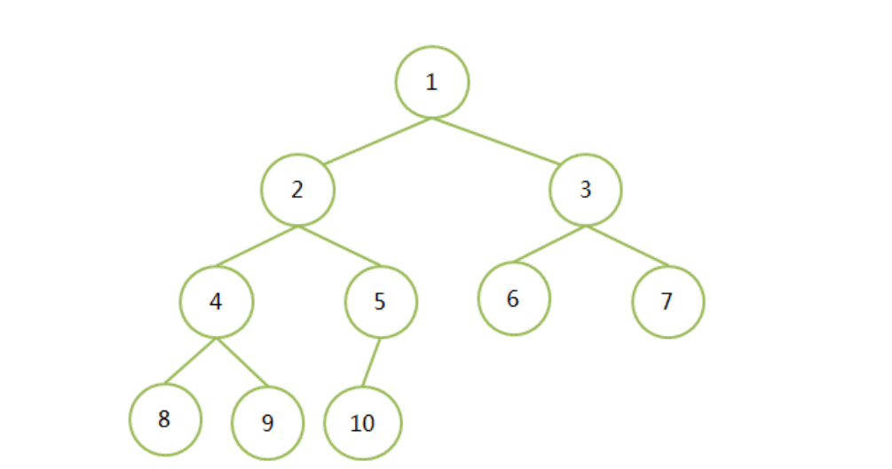

### 13.5堆heap

**堆是一个完全二叉树**

**每个非叶子结点都要大于或者等于其左右孩子结点的值称为大顶堆**

**每个非叶子结点都要小于或者等于其左右孩子结点的值称为小顶堆**

**根结点一定是大顶堆中的最大值，一定是小顶堆中的最小值**


**应用**

**堆排序**

**取集合中最大的N个元素**

先从集合中取前N个元素构建小顶堆，假设它们就是最大的N个元素

逐个遍历剩余其它元素，如果比堆顶元素小则直接丢弃（因为要最大的N个元素），否则替换

堆顶，并向下调整

## 14.进程与线程（python）

### 14.1并发与并行

并发Concurrency：一段时间内发生了很多事情。

并行parallelism：多个事件同时发生，强调同一时刻（多核CPU）

### 14.2进程与线程

在实现了线程的操作系统中，线程是操作系统能够进行运算调度的最小单位。它被包含在进程之中，是进程中的实际运作单位。一个程序的执行实例就是一个进程。

进程（Process）是计算机中的程序关于某数据集合上的一次运行活动，是系统进行资源分配和调度的基本单位，是操作系统结构的基础。进程与线程

进程和程序的关系：程序是源代码编译后的文件，而这些文件存放在硬盘上。当程序被操作系统加载到内存中，就是进程，进程中存放着指令和数据（资源），它也是线程的容器。

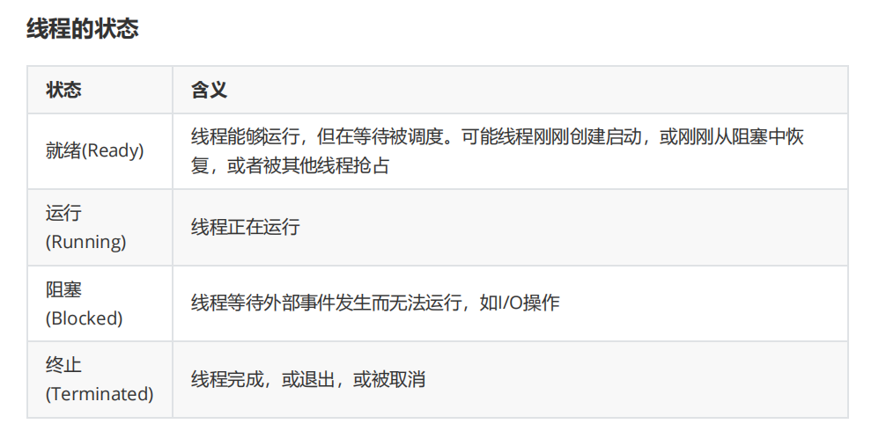

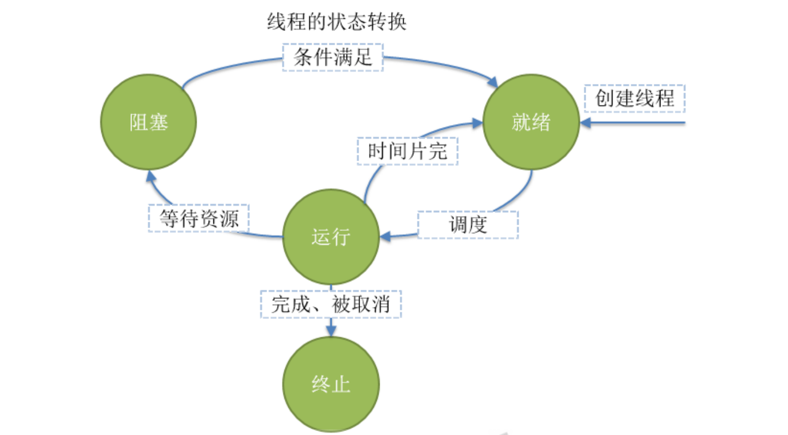

**Python中的进程和线程**

运行程序会启动一个解释器进程，线程共享一个解释器进程。

**Python的线程开发**

Python的线程开发使用标准库threading。

进程靠线程执行代码，进程中至少有一个**主线程**，其它线程称为工作线程。 主线程是第一个启动的线程。

父线程：如果线程A中启动了一个线程B，A称为B的父线程。 子线程：B称为A的子线程。

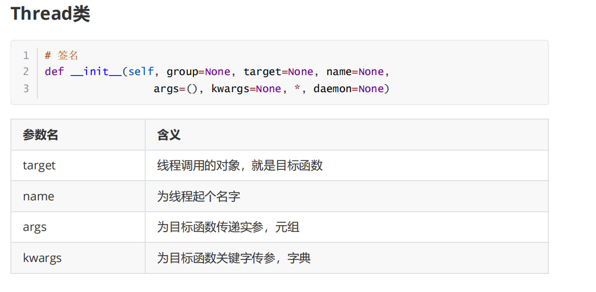

```python
import threading
# 最简单的线程程序
def worker(x, y):
    s = "{} + {} = {}".format(x, y, x + y)
    print(s, threading.currentThread().ident)
t1 = threading.Thread(target=worker, name='worker', args=(4, 5))
t1.start()
time.sleep(2) # 线程对象
# target=worker方式为关键字传参，按名称对应
# Python中还有按照位置对应传参，按照顺序依次对应
```

通过threading.Thread创建一个线程对象，target是目标函数，可以使用name为线程指定名称。 但是线程没有启动，需要调用start方法。

线程之所以执行函数，是因为线程中就是要执行代码的，而最简单的代码封装就是函数，所以还是函数调用。 函数执行完，线程也就退出了。 那么，如果不让线程退出，或者让线程一直工作怎么办呢？

```python
import threading
import time
def worker():
    while True: # for i in range(5):
        time.sleep(1)
        print("I'm working")
    print('Fineshed')
t = threading.Thread(target=worker, name='worker') # 线程对象
t.start() # 启动
```

**线程退出**

Python没有提供线程退出的方法，线程在下面情况时退出 1、线程函数内语句执行完毕 2、线程函数中抛出未处理的异常

**多线程编程**

顾名思义，多个线程，一个进程中如果有多个线程运行，就是多线程，实现一种并发。

```go
import string
import threading
import time
def count():
    c = 1
    while True:
        time.sleep(1)
        print("count = ", c)
        c += 1
def char():
    s = string.ascii_lowercase
    for c in s:
        time.sleep(2)
        print("char = ", c)
t1 = threading.Thread(target=count, name="count")
t2 = threading.Thread(target=char, name="char")
t1.start()
t2.start()
```

3个线程在运行，count、char、主线程。

## 15.锁

### 15.1互斥锁

确保：一个协程在执行逻辑的时候另外的协程不执行,效率较低

sync.Mutex

```go
var lock sync.Mutex
func add(){
        defer wg.Done()
        for i := 0 ;i < 100000;i++{
                //加锁
                lock.Lock()
                totalNum = totalNum + 1
                //解锁：
                lock.Unlock()
        }
}
func sub(){
        defer wg.Done()
        for i := 0 ;i < 100000;i++{
                //加锁
                lock.Lock()
                totalNum = totalNum - 1
                //解锁：
                lock.Unlock()
        }
}
func main(){
        wg.Add(2)
        //启动协程
        go add()
        go sub()
        wg.Wait()
        fmt.Println(totalNum)
}
```


### 15.2读写锁

sync.RWMutex

RWMutex是一个读写锁，其经常用于读次数远远多于写次数的场景．

在读的时候，数据之间不产生影响，   **写和读之间才会产生影响**

```go
var wg sync.WaitGroup //只定义无需赋值
//加入读写锁：
var lock sync.RWMutex
func read(){
        defer wg.Done()
        lock.RLock()//如果只是读数据，那么这个锁不产生影响，但是读写同时发生的时候，就会有影响
        fmt.Println("开始读取数据")
        time.Sleep(time.Second)
        fmt.Println("读取数据成功")
        lock.RUnlock()
}
func write(){
        defer wg.Done()
        lock.Lock()
        fmt.Println("开始修改数据")
        time.Sleep(time.Second * 10)
        fmt.Println("修改数据成功")
        lock.Unlock()
}
func main(){
        wg.Add(6)
        //启动协程 ---> 场合：读多写少
        for i := 0;i < 5;i++ {
                go read()
        }
        go write()
        wg.Wait()
}
```


# 二.网络编程

## 1.socket编程

Python中提供了socket标准库，非常底层的接口库。 Socket是一种通用的网络编程接口，和网络层次没有一一对应的关系。

**协议族** AF表示Address Family，用于socket()第一个参数

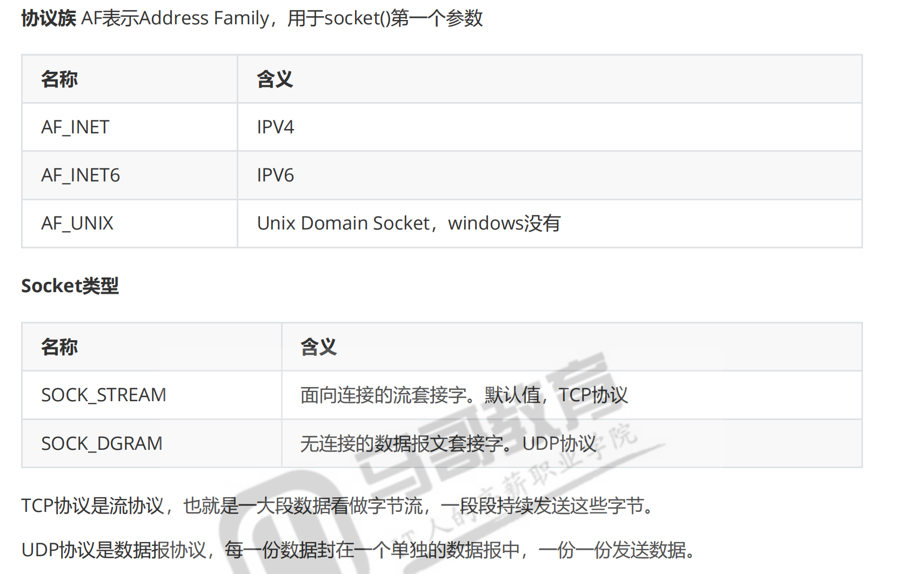

Socket 是“抽象的网络通信端点”

| 类型            | 表示内容                 |
| --------------- | ------------------------ |
| 普通文件        | `/etc/passwd` 等数据文件 |
| 管道            | 进程间通信               |
| 设备文件        | 硬盘、串口等             |
| **Socket 文件** | 网络通信接口（TCP/UDP）  |

| socket 对象                 | 用途                                                         |
| --------------------------- | ------------------------------------------------------------ |
| **监听 socket（listener）** | 用于监听端口，等待客户端连接，只需要一个                     |
| **连接 socket（conn）**     | 每接入一个客户端，服务端会新建一个 socket 和它通信，可以有很多个 |

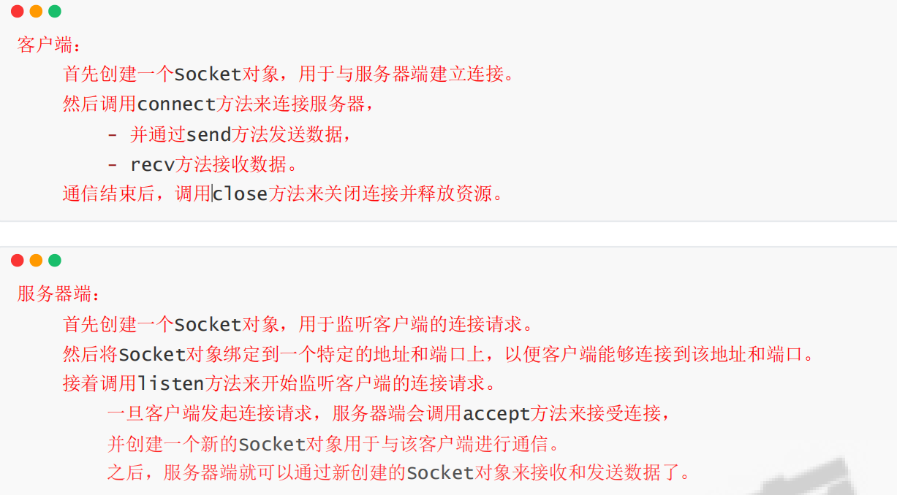

## 2.CS编程

Socket编程，是完成一端和另一端通信的，注意一般来说这两端分别处在不同的进程中，也就是说网络

通信是一个进程发消息到另外一个进程。

我们写代码的时候，每一个socket对象只表示了其中的一端。

从业务角度来说，这两端从角色上分为：

​        主动发送请求的一端，称为客户端Client

​        被动接受请求并回应的一端，称为服务端Server

这种编程模式也称为C/S编程

## 3.IO模型

---

#### 1. **阻塞IO（Blocking IO）**
- **特点：等！等！等！**
- 应用程序发起IO请求后，就停下来等结果，啥也不干。
- 数据准备好、读写完成之后才继续往下走。
- 👍 简单  
- 👎 效率低，一次只能处理一个IO

📌 比如你去餐厅点饭，站着等厨师做完再端走。

---

#### 2. **非阻塞IO（Non-blocking IO）**
- **特点：问！问！问！**
- 发起IO请求后不等，马上返回“还没好”。
- 应用不断轮询问：“好了吗？好了吗？”
- 数据准备好了再读。
- 👍 不卡主线程  
- 👎 CPU 轮询浪费资源

📌 比如你点完饭自己去忙别的，每秒回来问一次：“做好了吗？”

---

#### 3. **IO多路复用（IO Multiplexing）**
- **特点：监听多个连接，统一处理**
- 用 `select` / `poll` / `epoll` 等机制同时监听多个IO；
- 哪个IO准备好了，就处理哪个；
- 👍 可以同时处理多个连接  
- 👎 还是需要主动去查谁好了

📌 比如你是服务员，同时看几桌人，哪桌点了菜你就去服务。

---

#### 4. **信号驱动IO（Signal-driven IO）**
- **特点：通知我！**
- 发起IO请求后继续干活；
- 数据准备好时系统发个信号给你；
- 收到信号再去读取数据；
- 👍 异步通知，效率更高  
- 👎 实现复杂，不太常用

📌 比如你点完饭去做别的事，饭好了服务员喊你一声。

---

#### 5. **异步IO（Asynchronous IO）**
- **特点：全托管！**
- 发起IO请求后完全不管了，继续执行后续代码；
- 数据读完、处理完之后系统通知你结果；
- 👍 真正异步非阻塞，效率最高  
- 👎 实现复杂，依赖操作系统支持

📌 比如你点完饭直接回家，饭做好后送到你家门。

---

#### 6.🧠 总结对比表：

| IO模型     | 是否等待 | 是否立即返回 | 是否真正异步 | 举例说明                 |
| ---------- | -------- | ------------ | ------------ | ------------------------ |
| 阻塞IO     | ✅ 是     | ❌ 否         | ❌ 否         | 站着等饭做熟             |
| 非阻塞IO   | ❌ 否     | ✅ 是         | ❌ 否         | 每秒问一遍饭好了没       |
| IO多路复用 | ✅ 是     | ❌ 否（要查） | ❌ 否         | 服务员看多桌客人         |
| 信号驱动IO | ❌ 否     | ✅ 是         | ❌ 否         | 饭好了有人叫你           |
| 异步IO     | ❌ 否     | ✅ 是         | ✅ 是         | 点饭后直接回家，饭送上门 |

---

如果你在写网络服务器、高并发程序时，**IO多路复用** 和 **异步IO** 是最常用的两种模型。Python 的 `asyncio`、Go 的 goroutine 默认使用的就是高效的异步IO模型。

#### 7.操作系统管理IO（看一看，不用深究）

在操作系统中，多个进程可能同时发起 I/O 请求，而这些请求最终都是由内核来处理的。为了确保每个进程能够正确地获取属于自己的 I/O 结果，操作系统采用了一系列机制来管理和区分不同的 I/O 操作。以下是几个关键概念和机制，帮助解释进程是如何知道某个 I/O 操作是属于自己的：

1. **文件描述符（File Descriptor）**

- 每当一个进程打开一个文件、网络连接或其他I/O资源时，操作系统会返回一个唯一的**文件描述符**给该进程。
- 文件描述符是进程与内核之间的一个抽象接口，用于标识特定的I/O通道。
- 进程通过这个文件描述符来进行读写操作，并且操作系统根据文件描述符来区分不同进程的I/O请求。

2. **进程控制块（Process Control Block, PCB）**

- 每个进程都有一个对应的PCB，它存储了进程的状态信息，包括打开的文件描述符表。
- 当进程发起I/O请求时，相关的文件描述符会被记录在其PCB中。
- 内核使用PCB中的信息来管理I/O操作及其结果，确保数据返回给正确的进程。

3. **上下文切换（Context Switching）**

- 在多任务环境中，CPU会在不同进程间快速切换执行，这称为上下文切换。
- 切换过程中，当前进程的状态被保存，包括其寄存器状态、程序计数器等。
- 当进程再次获得CPU时间片时，恢复之前保存的状态继续执行，这样即使I/O操作跨越了多次上下文切换，也能保证逻辑上的连续性。

4. **中断处理机制**

- 硬件设备完成I/O操作后通常会产生一个中断信号通知CPU。
- 中断处理程序会根据中断向量定位到相应的设备驱动程序，然后由驱动程序将数据传递给正确的进程。
- 设备驱动程序利用文件描述符和其他上下文信息确定哪个进程应该接收此次I/O的结果。

5. **同步与异步I/O模型**

- 在**同步I/O模型**下，进程调用系统调用（如`read()`或`write()`）时会被阻塞直到I/O操作完成，此时操作系统直接将结果返回给调用者。
- 在**异步I/O模型**下，进程可以立即返回去做其他事情，待I/O完成后通过回调函数或者事件通知的方式告知进程结果。

实际例子：

假设你有两个进程A和B，它们都打开了同一个文件但有不同的文件描述符fd_A和fd_B。当A调用`read(fd_A)`时，尽管两个进程都在访问同一文件，但由于它们使用的文件描述符不同，内核能准确地区分出这是来自进程A的请求，并将结果返回给A而不是B。

综上所述，通过文件描述符、进程控制块、上下文切换以及中断处理机制等手段，操作系统能够有效地管理和区分各个进程的I/O请求，从而确保每个进程都能正确地接收到属于自己的I/O结果。

## 4.TCP服务端编程（python）

1.创建Socket对象

2.绑定IP地址Address和端口Port。bind()方法 IPv4地址为一个二元组('IP地址字符串', Port)

3.开始监听，将在指定的IP的端口上监听

​        listen([backlog])方法。未完成连接队列和完成连接队列长度不能超过backlog，如果accept不拿走就满了，就会直接拒绝连接请求。backlog可以不写，默认为5

5.获取用于传送数据的**新的**Socket对象 socket.accept() -> (socket object, address info) accept方法阻塞等待客户端建立连接，返回一个新的Socket对象和客户端地址的二元组 地址是远程客户端的地址，IPv4中它是一个二元组(clientaddr, port)

接收数据 recv(bufsize[, flags]) 使用缓冲区接收数据

发送数据 send(bytes)发送数据

```go
Server端开发
socket对象 --> bind((IP, PORT)) --> listen --> accept --> close
                                            |--> recv or send --> close
```

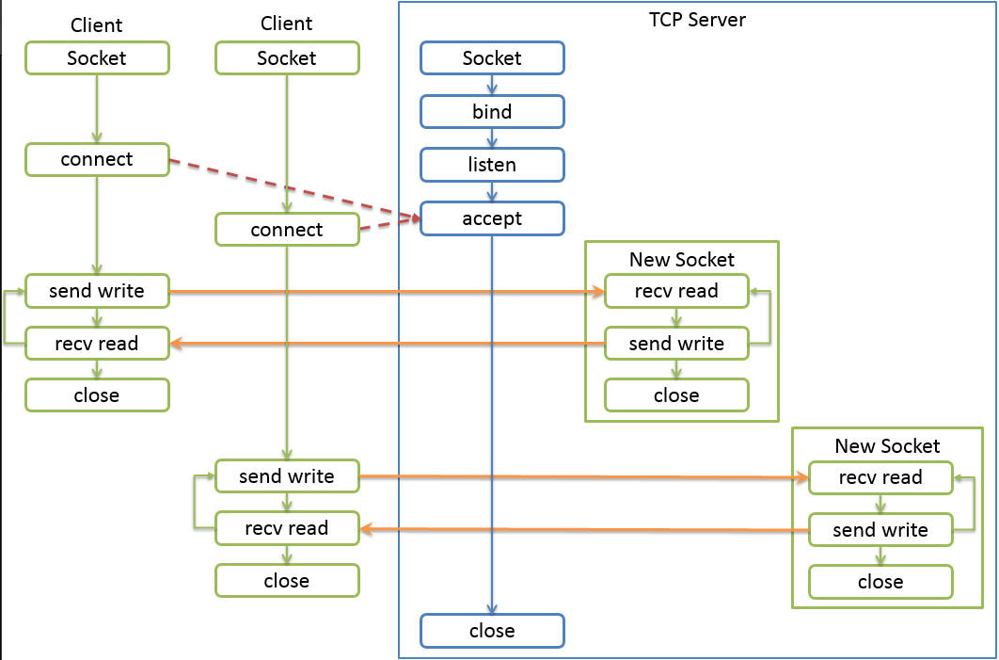

```python
# 最简单的服务器例子
import socket
# TCP服务端编程
server = socket.socket()  # 创建socket对象
laddr = ('0.0.0.0', 9999)  # 地址和端口的元组
server.bind(laddr)  # 绑定
server.listen(1024)  # 监听,未完成连接队列和完成连接队列长度最大值
# 等待建立连接的客户端
conn, raddr = server.accept() # 阻塞
data = conn.recv(4096)  # 接收客户端信息，最大为4096字节
print(conn.getpeername(), data)
conn.send(b"Hello magedu.com")  # 回应客户端
conn.close()
server.close()
```

### 4.1多线程阻塞版

```python
import threading
import time
import socket
html = """\
<!DOCTYPE html>
<html lang="en">
<head>
   <meta charset="UTF-8">
   <title>magedu</title>
</head>
<body>
   <h1>马哥教育www.magedu.com -- Multithread + Blocking IO</h1>
</body>
</html>\
"""
response = """\
HTTP/1.1 200 OK
Date: Mon, 24 Oct 2022 20:04:23 GMT
Content-Type: text/html
Content-Length: {}
Connection: keep-alive
Server: wayne.magedu.com
{}""".format(len(html), html).encode()
def accept(server):
    i = 1
    while True:
        conn, raddr = server.accept()
        threading.Thread(target=recv, name="recv-{}".format(i), args=(conn, 
raddr)).start()
        i += 1
def recv(conn: socket.socket, raddr):
    try:
        data = conn.recv(4096)
        if not data:
            print(raddr, 'bye~~~~')
            return
        # print(data)
        conn.send(response)
    except Exception as e:
        print(e, '~~~~~~~~~~~~~')
if __name__ == '__main__':
    server = socket.socket()
    laddr = ('0.0.0.0', 9999)
    server.bind(laddr)
    server.listen(1024)
    threading.Thread(target=accept, name="accept", args=(server,), 
daemon=True).start()
    while True:
        time.sleep(60)
        print(threading.active_count())
```

阻塞的IO导致该线程进入阻塞态，就该让出CPU，这对性能影响不大。此多线程程序最大的问题在于，当高并发到来，连接非常多，多线程的频繁地创建和销毁。频繁创建销毁开销过大。

### 4.2线程池版

**线程池的基本工作原理**

1. **核心线程数(Core Pool Size)**：这是线程池中保持活动状态的最小线程数，即使它们空闲。
2. **最大线程数(Maximum Pool Size)**：线程池允许的最大线程数。如果当前正在执行的任务数量超过了核心线程数，但尚未达到最大线程数，则会创建新的线程来处理任务。
3. **队列(Queue)**：当所有线程都在忙碌且已达到最大线程数时，新来的任务会被放入队列等待处理。

**线程的创建与销毁**

- **创建**：当有新任务到达，并且当前线程数少于核心线程数或（在某些实现中）少于最大线程数时，线程池会创建新线程。
- 销毁：
  - **闲置超时(Keep Alive Time)**：对于超出核心线程数的那些线程，如果它们处于空闲状态超过了一定时间（由`keepAliveTime`指定），它们可能会被终止以节省资源。
  - **关闭操作**：当你显式地关闭线程池（通过调用`shutdown()`或者`shutdownNow()`方法），线程池中的所有线程将停止接受新任务，并在完成当前任务后结束。

以下案例只包含了最大线程数

```python
from concurrent.futures import ThreadPoolExecutor
count = 10

#
executor = ThreadPoolExecutor(count)
# executor = ThreadPoolExecutor(max_workers=count)
def accept(server):
    # i = 1
    while True:
        conn, raddr = server.accept()
        # threading.Thread(target=recv, name="recv-{}".format(i), args=
(conn, raddr)).start()
        # i += 1
        executor.submit(recv, conn, raddr)
def recv(conn: socket.socket, raddr):
    try:
        data = conn.recv(4096)
        if not data:
            print(raddr, 'bye~~~~')
            return
        # print(data)
        conn.send(response)
    except Exception as e:
        print(e, '~~~~~~~~~~~~~')
if __name__ == '__main__':
    server = socket.socket()
    laddr = ('0.0.0.0', 9999)
    server.bind(laddr)
    server.listen(1024)
    # threading.Thread(target=accept, name="accept", args=(server,), daemon=True).start()
    executor.submit(accept, server)
    while True:
        time.sleep(60)
        print(threading.active_count())
```

## 5.协程Coroutine

### 5.1迭代器

没有线程，线程是thread.newthread这种来创建的，默认单线程执行

```python
def count():
    c = 1
    for i in range(5):
        print(c)
        yield c
        print("###")
        c += 1
def char():
    s = string.ascii_lowercase
    for c in s:
        print(c)
        yield c
t1 = count() # 迭代器对象
t2 = char() # 迭代器对象
next(t1)
next(t1)
next(t1)
next(t2)
print("@@@")
```

可以看出代码在yield出暂停，通过next来驱动各个函数执行，可以由程序员在合适的地方通过yield来暂停一个函数执行，让另外一个函数执行。

**暂停**是一种非常重要的能力，以前函数正常要执行到return后，现在可以由开发者控制暂停执行的时机。而线程时间片用完导致的函数切换对开发人员来说是不可控的，而且线程控制能力是内核的功能，是在内核态完成的，而上例（协程）的控制是在用户态完成的。

**交替进行任务**

```python
import string
import time
def count():
    c = 1
    for i in range(5):
        print(c)
        yield c
        print("###")
        c += 1
def char():
    s = string.ascii_lowercase
    for c in s:
        print(c)
        yield c
t1 = count()  # 迭代器对象
t2 = char()  # 迭代器对象
tasks = [t1, t2]
while True:
    pops = [] # 待移除的已经完成的任务
    for i, task in enumerate(tasks):
        if next(task, None) is None: # 如果迭代到头了，返回给定的缺省值
            print("task {} finished.".format(task))
            pops.append(i) # 记住索引
    for i in reversed(pops):
        tasks.pop(i)
    print(len(tasks), tasks)
    if len(tasks) == 0:
        time.sleep(1) # 如果任务列表为0，就等待
print("@@@")
```

上例中，交替执行任务是可以由程序员在一个线程内完成，这个任务如果再被按照Python语法封装后就是Python的协程。核心点是，在适当的时候要暂停一个正在运行的任务，让出来去执行另外一个任务。

### 5.2go协程（重点）

**协程是用户态的任务调度，线程是操作系统内核态的任务调度。**

**协程弊端**

​        一旦一个协程阻塞，阻塞了什么？阻塞当前所在线程？那么该线程代码被阻塞不能向下继续执行了

​        协程必须主动让出，才能轮到该线程中另外一个协程运行

能否让协程自由的在不同线程中移动，这样就不会阻塞某一个线程到导致线程中其他协程得不到执行？

**Go语言对Coroutine做了非常多的优化，提出了Goroutine。**

##### **GMP模型**

Go语言协程中，非常重要的就是协程调度器scheduler和网络轮询器netpoller。

Go协程调度中，有三个重要角色：

1. M：Machine Thread，对系统线程抽象、封装。所有代码最终都要在系统线程上运行，协程最终也是代码，也不例外

2. G：Goroutine，Go协程。存储了协程的执行栈信息、状态和任务函数等。初始栈大小约为2~4k，理论上开启百万个Goroutine不是问题

3. P：Go1.1版本引入，Processor，虚拟处理器

   - 可以通过环境变量GOMAXPROCS或runtime.GOMAXPROCS()设置，默认为CPU核心数

   - P的数量决定着最大可并行的G的数量

   - P有自己的队列（长度256），里面放着待执行的G

   - M和P需要绑定在一起，这样P队列中的G才能真正在线程上执行

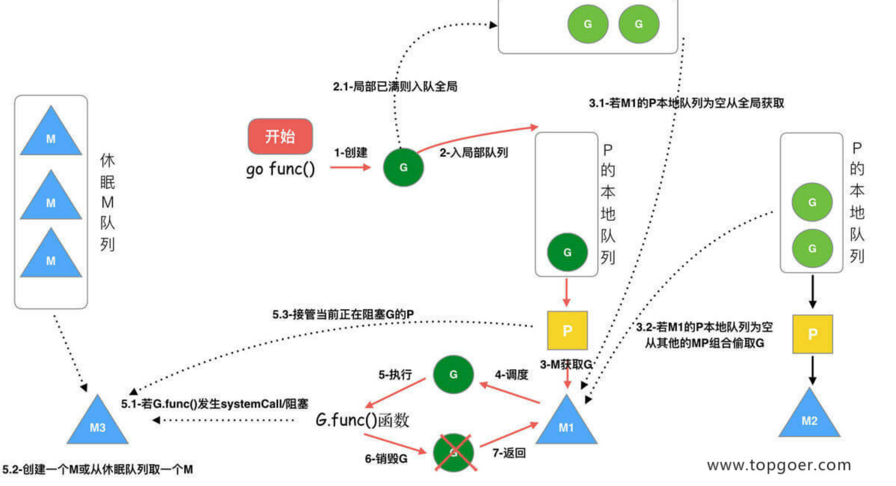

比如我是8核cpu,P默认为8，同时可并行8个G，但是M也是8个，只有当其中M的任务发生阻塞时，对应的P才会与之解绑，go会动态新建一个M绑定该P，被阻塞的 M 保留着（可能进入 M 的等待队列）

**M 是对系统线程的封装，本身不是瓶颈，瓶颈通常在于系统内核资源（线程数、内存）**。
Go 会智能调度，尽量避免大量阻塞导致系统资源耗尽，但如果你滥用阻塞操作，M 还是可能成为资源瓶颈的“导火索”。

**注意：异步网络IO调用时，如下**

网络IO代码会被Go在底层变成非阻塞IO，这样就可以使用IO多路复用了。

m1执行g1，执行过程中发生了非阻塞IO调用（读/写）时，g1和m1解绑，g1会被网络轮询器Netpoller接手。m1再从p1的LRQ中获取下一个Goroutine g2执行。注意，m1和p1不解绑。

g1等待的IO就绪后，g1从网络轮询器移回P的LRQ（本地运行队列）或全局GRQ中，重新进入可执行状态。

就大致相当于网络轮询器Netpoller内部就是使用了IO多路复用和非阻塞IO，类似python中的select的循环。GO对不同操作系统MAC（kqueue）、Linux（epoll）、Windows（iocp）提供了支持。

问题：如果GOMAXPROCS为1，说明什么

##### IO与进程的区别

**进程是操作系统中对计算资源的调度单位，而 I/O 是系统中对输入/输出资源的管理与调度。两者都属于内核资源管理的对象，但本质角色不同。**

网络 I/O 过程：

1. 用户进程调用 `read(conn)` 发起网络读取
2. 内核将其注册到 `epoll` 等 I/O 等待队列
3. 网卡收到数据后触发 **硬件中断**
4. 内核的中断处理函数响应（在内核线程或软中断中执行）
5. 数据被写入内核缓冲区
6. `epoll_wait` 返回，通知用户进程：“可以读了”

## 6. Goroutine

### 6.1.协程创建

```go
func add(x, y int) int {
 var c int
 defer fmt.Printf("1 return %d\n", c)              // 打印的c是什么？
 defer func() { fmt.Printf("2 return %d\n", c) }() // 打印的c是什么？
 fmt.Printf("add called: x=%d, y=%d\n", x, y)
 c = x + y
 return c
}
func main() {
 fmt.Println(runtime.NumGoroutine())
 fmt.Println("main start")
 go add(4, 5) // 协程
 fmt.Println(runtime.NumGoroutine())
 // time.Sleep(2 * time.Second) // 放开这一句，看看效果
 fmt.Println("main end")
 fmt.Println(runtime.NumGoroutine())
}
```

```go
//如果没有 time.Sleep(2) ，结果如下
1
main start
2
main end
2
```

放开了 time.Sleep(2) ，结果如下

```go
1
main start
2
add called: x=4, y=5
2 return 9
1 return 0
main end
1 注意这里是1了      
```

**注意：Gmain结束之前Gadd就结束了，上面是Gadd还没开始Gmain就结束了**


### 6.2.等待组

sync.WaitGroup

```go
func add(x, y int, wg *sync.WaitGroup) int {
 defer wg.Done() // add执行完后计数器减1
 var c int
 defer fmt.Printf("1 return %d\n", c)              // 打印的c是什么？
 defer func() { fmt.Printf("2 return %d\n", c) }() // 打印的c是什么？
 fmt.Printf("add called: x=%d, y=%d\n", x, y)
 c = x + y
 fmt.Printf("add called: c=%d\n", c)
 return c
}
func main() {
 var wg sync.WaitGroup // 定义等待组
 fmt.Println(runtime.NumGoroutine())
 fmt.Println("main start")
 wg.Add(1)         // 计数加1
 go add(4, 5, &wg) // 协程
 fmt.Println(runtime.NumGoroutine())
 // time.Sleep(2 * time.Second) // 这一句不需要了
 wg.Wait() // 阻塞到wg的计数为0
 fmt.Println("main end")
 fmt.Println(runtime.NumGoroutine())
}
```


### 6.3.父子协程

父协程结束执行，子协程不会有任何影响。当然子协程结束执行，也不会对父协程有什么影响。父子协程没有什么特别的依赖关系，各自独立运行。

只有主协程特殊，它结束程序结束。

```go
func main() {
 var wg sync.WaitGroup // 定义等待组
 fmt.Println("main start")
 count := 6
 wg.Add(count)
 go func() {
 fmt.Println("父协程开始，准备启动子协程")
 defer func() {
 wg.Done() // 注意wg的作用域
 fmt.Println("父协程结束了~~~~")
 }()
 for i := 0; i < count-1; i++ {
 go func(id int) {
 defer wg.Done()
 fmt.Printf("子协程 %d 运行中\n", id)
 time.Sleep(5 * time.Second)
 fmt.Printf("子协程 %d 结束\n", id)
 }(i)
 }
 }()
 wg.Wait() // 阻塞到wg的计数为0
 fmt.Println("main end")
}
// 注：上例协程最好协程独立的函数，而不是这样嵌套，只是为了演示。
```

### **6.4实战：实现WEB服务器——Goroutine版**

```go
// response 是一个字符串，表示要返回给客户端的内容
// 它使用 fmt.Sprintf 格式化生成
var response = fmt.Sprintf(head, len(html), html)

func main() {
	//解析本地地址，绑定到所有网卡 IP（0.0.0.0）和端口 9999
	//使用 IPv4 协议
	laddr, err := net.ResolveTCPAddr("tcp4", "0.0.0.0:9999") // 解析地址
	if err != nil {
		log.Panicln(err) // Panicln会打印异常，程序退出
	}
	//开始监听 TCP 端口
	//
	//得到一个 TCPListener 类型的对象 server
	server, err := net.ListenTCP("tcp4", laddr)
	if err != nil {
		log.Panicln(err)
	}

	//程序退出前关闭监听器，释放端口资源
	defer server.Close() // 保证一定关闭
	for {
		conn, err := server.Accept() // 接收连接，分配socket
		if err != nil {
			log.Panicln(err)
		}
		go func() {
			defer conn.Close()           // 保证一定关闭
			buffer := make([]byte, 4096) // 设置缓冲区
			n, err := conn.Read(buffer)  // 成功返回接收了多少字节
			if n == 0 {
				log.Printf("客户端%s主动断开", conn.RemoteAddr().String())
				return
			}
			if err != nil {
				log.Println(err)
				return
			}
			conn.Write([]byte(response))
		}()
	}
}

// 大家可以自行抽取成协程函数
```

上述代码是goroutine per connection模式，看似使用的同步方式开发，这大大减少了开发人员的心智负担。

## 7.Channel通道


### 7.1通道构造

源码runtime/chan.go/makechan

```go
var c1 chan int
fmt.Printf("c1: %d, %d, %v\n", len(c1), cap(c1), c1) // c1: 0, 0, <nil>
c1 <- 111 // 阻塞，不报错。由于没有初始化容器，111塞不进去
<- c1 // 也阻塞，不报错，什么都拿不出
```

**chan零值是nil，即可以理解未被初始化通道这个容器。nil通道可以认为是一个只要操作就阻塞当前协程的容器。这种通道不要创建和使用，阻塞后无法解除，底层源码中写明了无法解除**

更多的时候，使用make来创建channel。

```go
// 容量为0的非缓冲通道
c2 := make(chan int, 0)
fmt.Printf("c2: %d, %d, %v\n", len(c2), cap(c2), c2)
c3 := make(chan int)
fmt.Printf("c3: %d, %d, %v\n", len(c3), cap(c3), c3)
```

**非缓冲通道**：容量为0的通道，也叫同步通道。这种通道发送第一个元素时，如果没有接收操作就立即阻塞，直到被接收。同样接收时，如果没有数据被发送就立即阻塞，直到有数据发送。

**缓冲通道**：容量不为0的通道。通道已满，发送操作会被阻塞；通道为空，接收操作会被阻塞。

```go
 var c1 chan int
 fmt.Printf("c1: %d, %d, %v\n", len(c1), cap(c1), c1)
 fmt.Println("准备发送数据111")
 c1 <- 111 // 往c1里面发送，阻塞在这一句，死锁，因为本例子无人接收
 fmt.Println("发送数据111结束")
 c4 := make(chan int, 8) // 缓冲通道，容量为8，长度为0
 fmt.Printf("c4: %d, %d, %v\n", len(c4), cap(c4), c4)
 // 发送数据
 c4 <- 111
 c4 <- 222
 fmt.Printf("c4: %d, %d, %v\n", len(c4), cap(c4), c4) // len 2
 // 接收
 <-c4
 t := <-c4
 fmt.Printf("%T %[1]v\n", t)
```

### 7.2单向通道

<- chan type 这种定义表示只从一个channel里面拿，说明这是只读的

chan <- type 这种定义表示只往一个channel里面写，说明这是只写的

```go
func produce(ch chan<- int) { // 生产，只写。只要该通道具有写能力就行
 for {
 ch <- rand.Intn(10)
 time.Sleep(1 * time.Second)
 }
}
func consume(ch <-chan int) { // 消费，只读。只要该通道具有读能力就行
 for {
 t := <-ch
 fmt.Println("消费，从只读通道接收", t)
 }
}
func main() {
 var wg sync.WaitGroup
 wg.Add(1)
 c := make(chan int) // 创建可读/写非缓冲通道
 go produce(c)
 go consume(c)
 wg.Wait()               //一直阻塞
}
```

### 7.3通道关闭

1、nil通道

发送、接收、遍历都**阻塞**

2、缓冲的、未关闭的通道

相当于一个无限元素的通道，迭代不完，**阻塞**在等下一个元素到达。

3、缓冲的、关闭的通道

关闭后，通道不能在进入新的元素，那么相当于遍历有限个元素容器，遍历完就结束了。

4、非缓冲、未关闭通道

相当于一个无限元素的通道，迭代不完，**阻塞**在等下一个元素到达。

5、非缓冲、关闭通道

关闭后，通道不能在进入新的元素，那么相当于遍历有限个元素容器，遍历完就结束了。

总结：除nil通道外

未关闭通道，如同一个无限的容器，将一直迭代通道内元素，没有元素就阻塞

已关闭通道，将不能加入新的元素，迭代完当前通道内的元素，哪怕是0个元素，然后结束迭代

### 7.4定时器

```go
 t := time.NewTicker(2 * time.Second)
 for {
 fmt.Println(<-t.C) // 通道每阻塞2秒就接收一次
 }
 
 t := time.NewTimer(5 * time.Second)
 for {
 fmt.Println(<-t.C) // 通道阻塞5秒后只能接受一次
 }
 
```

### 7.5通道死锁

channel满了，就阻塞写；channel空了，就阻塞读。容量为0的通道可以理解为有个元素都满了。

阻塞了当前协程之后会交出CPU，去执行其他协程，希望其他协程帮助自己解除阻塞。

main函数结束了，整个进程结束了。

如果在main协程中，执行语句阻塞时，环顾四周，如果已经没有其他子协程可以执行，只剩主协程自己，解锁无望了，就自己把自己杀掉，报一个fatal error deadlock

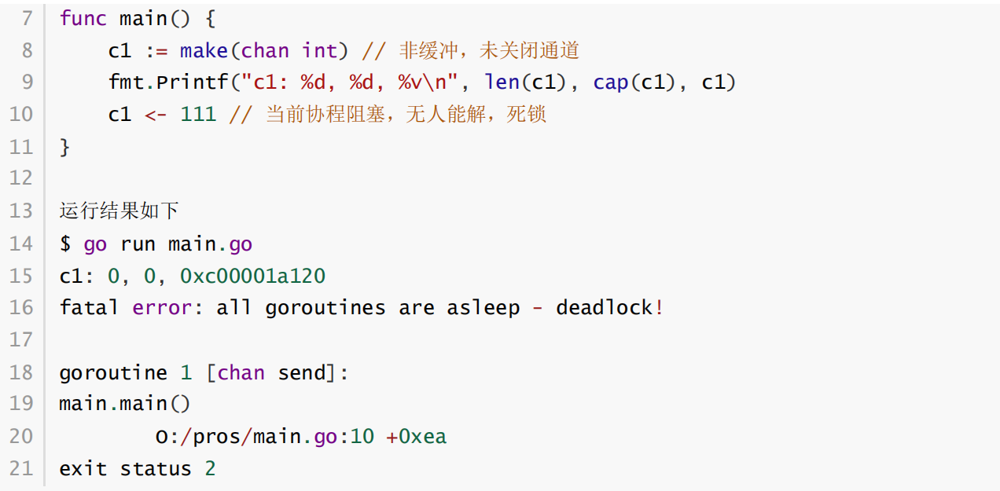

如果通道阻塞不在main协程中发生，而是发生在子协程中，子协程会继续阻塞着，也可能发生死锁。但是由于至少main协程是一个值得等待的希望，编译器不能帮你识别出死锁。如果真的无任何协程帮助该

协程解除阻塞状态，那么事实上该子协程解锁无望，已经死锁了。

死锁的危害可能会导致进程活着，但实际上某些协程未真正工作而阻塞，应该有良好的编码习惯，来减少死锁的出现。

### 7.6struct{}型通道

定义结构体时struct{}部分才是类型本身。如果一个结构体类型就是struct{}，说明该结构体的实例没有数据成员，也就是实例内存占用为0

这种类型数据构成的通道，非常节约内存，仅仅是为了传递一个信号标志。

```go
func main() {
 flag := make(chan struct{}) // 比 chan bool省内存
 go func() {
 time.Sleep(3 * time.Second)
 flag <- struct{}{} // 无数据成员的结构体实例
 }()
 fmt.Printf("终于等到了信号, %T, %[1]v", <-flag)
}
```

### 7.7通道多路复用

Go语言提供了select来监听多个channel。

主动轮询浪费资源，轮询10000次，没准备好还是没准备好，对方告诉你我准备好了，只需要交流一次。

`select` 的底层机制是：

**将所有 `case` 监听的 channel 注册到等待队列中，然后阻塞当前 goroutine，直到某个 channel 就绪，由 runtime 唤醒对应 case。**

也就是说：

- select 会把每个 case 注册成“事件监听”
- runtime 会阻塞等待这些事件（有点像 epoll/kqueue）
- 某个 channel 一旦就绪，就唤醒 select，进入对应 case

```go
// 永远阻塞
select {} //在某些场景中“优雅阻塞”（比 for {} 更省资源）
```

```go
//它就像是 switch 语句，但不是匹配变量值，而是匹配哪个 channel 可以读写了。
func main() {
	count := make(chan int, 4)
	fin := make(chan bool)
	global := 1000
	t1 := time.NewTicker(time.Second)
	t2 := time.NewTicker(5 * time.Second)
	go func() {
		defer func() { fin <- true }()
		for i := 0; i < 4; i++ {
			count <- i
			// time.Sleep(1 * time.Second)
		}
	}()
	time.Sleep(1 * time.Second)
	fmt.Println(len(count), "~~~~@@@")
	for {
		select { // 监听多路通道
		case <-t1.C:
			fmt.Println("每隔一秒看看长度", len(count))
		case <-t2.C:
			fmt.Println("每隔5秒取一次", <-count)
		case count <- global: // 发送数据成功进入通道执行该case
			global++
			fmt.Println("~~~~~~~~~~~~~~~~~~~~~~~~~~~")
		}
	}
}
```

### 7.8通道并发

Go语言采用并发同步模型叫做Communication Sequential Process通讯顺序进程，这是一种消息传递模型，在goroutine间传递消息， 而不是对数据进行加锁来实现同步访问。在goroutine之间使用channel来同步和传递数据。

1. 多个协程之间通讯的管道
2. 一端推入数据，一端拿走数据
3. 同一时间，只有一个协程可以访问通道的数据
4. 协调协程的执行顺序

如果多个线程都使用了同一个数据，就会出现竞争问题。因为线程的切换不会听从程序员的意志，时间片用完就切换了。解决办法往往需要加锁，让其他线程不能共享数据进行修改，从而保证逻辑正确。但锁的引入严重影响并行效率。

**锁适用场景举例**

| 场景                        | 示例                           |
| --------------------------- | ------------------------------ |
| 并发写 map / slice / struct | 用 `sync.Mutex` 保护           |
| 缓存更新                    | 加锁读写缓存 map               |
| 原子统计计数器              | 用 `sync.Mutex` 或 `atomic` 包 |

**协程管道适用场景举例**

| 场景              | 示例                                  |
| ----------------- | ------------------------------------- |
| 任务管道/流水线   | 每个阶段用 goroutine + channel 串起来 |
| 生产者-消费者模型 | 用 channel 实现缓冲池                 |
| 事件驱动/异步通知 | 一个协程等多个通道输入，select 控制   |

### 7.9协程泄露

原因

协程阻塞，未能如期结束，之后就会大量累积

协程阻塞最常见的原因都跟通道有关

由于每个协程都要占用内存，所以协程泄露也会导致内存泄露

**因此，如果你不知道你创建的协程何时能够结束，就不要使用它。否则可能协程泄露。**


## 8TCP客户端编程

1. 创建socket对象
2. 随机选择端口即可以向服务器端发起连接
3. 连接成功后，就可以收发操作
4. 关闭

```go
func catchErr(err error) {
	if err != nil {
		log.Fatalln(err)
	}
}
func main() {
	raddr, err := net.ResolveTCPAddr("tcp", "127.0.0.1:9999")
	catchErr(err)
	// 1 创建socket 2 发起对服务器端的连接
	conn, err := net.DialTCP("tcp", nil, raddr)
	catchErr(err)
	fmt.Println(conn.LocalAddr()) // 看看客户端的端口
	// 4 关闭
	defer conn.Close()
	exit := make(chan struct{})
	// 3 收发数据，客户端一般主动发数据
	go func() {
		buffer := make([]byte, 1024)
		for {
			conn.SetReadDeadline(time.Now().Add(time.Second)) // 每次等1秒就超 时
			n, err := conn.Read(buffer)
			if err != nil {
				if _, ok := err.(*net.OpError); !ok {
					exit <- struct{}{} // 退出，如果不是超时错误就退出
					return             // 协程结束
				}
				continue
			}
			fmt.Println(buffer[:n])
		}
	}()
	go func() {
		var input string
		for {
			fmt.Scanln(&input)
			if input == "exit" {
				exit <- struct{}{}
				return
			}
			_, err = conn.Write([]byte(input))
			if err != nil {
				log.Println(err)
				continue
			}
		}
	}()
	t := time.NewTicker(3 * time.Second)
	for {
		select {
		case <-exit:
			goto EXIT
		case <-t.C:
			fmt.Println(runtime.NumGoroutine(), "@@@")
		}
	}
EXIT:
	fmt.Println("~~~~~~~~~~~~~~~~~~~~~~~~~~~")
}
```

## 9UDP编程

### 9.1服务端

1.创建socket对象。socket.SOCK_DGRAM

2.绑定IP和Port，bind()方法

3.传输数据

- 接收数据，socket.recvfrom(bufsize[, flags])，获得一个二元组(string, address)
- 发送数据，socket.sendto(string, address) 发给某地址某信息

4.释放资源

```go
// 异常处理，打印错误并退出
func catchErr(err error) {
	if err != nil {
		log.Fatalln(err)
	}
}
func main() {
	//地址解析，UDP 地址字符串 → UDP 地址结构体，分析出是ipv4
	laddr, err := net.ResolveUDPAddr("udp", "127.0.0.1:9999")
	catchErr(err)
	fmt.Println(laddr)
	// 1 socket 2 bind
	server, err := net.ListenUDP("udp", laddr)
	catchErr(err)
	defer server.Close()
	// 不需要accept
	// 3 收发
	buffer := make([]byte, 1024)
	exit := make(chan struct{})
	go func() {
		for {
			server.SetReadDeadline(time.Now().Add(time.Second))
			n, raddr, err := server.ReadFromUDP(buffer)
			fmt.Printf("%T, %[1]v\n", err)
			if err != nil {
				if _, ok := err.(*net.OpError); !ok {
					exit <- struct{}{}
					return
				}
				continue
			}
			msg := fmt.Sprintf("Client=%v, data=%s", raddr,
				string(buffer[:n]))
			fmt.Println(msg)
			server.WriteToUDP([]byte(msg), raddr)
		}
	}()
	t := time.NewTicker(3 * time.Second)
	for {
		select {
		case <-exit:
			goto EXIT
		case <-t.C:
			fmt.Println(runtime.NumGoroutine(), "@@@")
		}
	}
EXIT:
	fmt.Println("~~~~~~~~~~~~~~~~~~~~~~~~~~~")
}
```

### 9.2客户端编程

创建socket对象。socket.SOCK_DGRAM

传输数据

- 接收数据，socket.recvfrom(bufsize[, flags])，获得一个二元组(string, address)
- 发送数据，socket.sendto(string, address) 发给某地址某信息

释放资源

```go
func main() {
	raddr, err := net.ResolveUDPAddr("udp", "127.0.0.1:9999")
	catchErr(err)
	// 1 socket
	conn, err := net.DialUDP("udp", nil, raddr)
	catchErr(err)
	defer conn.Close()
	// 不需要accept
	// 2 收发
	exit := make(chan struct{})
	go func() {
		buffer := make([]byte, 1024)
		for {
			conn.SetReadDeadline(time.Now().Add(time.Second))
			n, _, err := conn.ReadFromUDP(buffer)
			if err != nil {
				//如果不是 *net.OpError 类型（即不是“网络超时、连接重置等网络操作错误”）
				if _, ok := err.(*net.OpError); !ok {
					exit <- struct{}{}
					return
				}
				continue
			}
			fmt.Println(buffer[:n])
		}
	}()
	go func() {
		var input string
		for {
			fmt.Scanln(&input)
			if input == "exit" {
				exit <- struct{}{}
				return
			}
			i, err2 := conn.Write([]byte(input)) // 要用Write，因为DialUDP已经 知道了对端
			fmt.Println(i, err2)
		}
	}()
	t := time.NewTicker(3 * time.Second)
	for {
		select {
		case <-exit:
			goto EXIT
		case <-t.C:
			fmt.Println(runtime.NumGoroutine(), "@@@")
		}
	}
EXIT:
	fmt.Println("~~~~~~~~~~~~~~~~~~~~~~~~~~~")
}
```

## 10WebSocket

HTTP协议，必须由客户端主动发起请求，服务器端收到请求后被动响应请求返回信息给客户端，而且底层建立的TCP连接用完即断，并不维持很久。但有些场景下，例如服务器端需要为某些客户端主动发送请求，HTTP协议做不到，解决方案只能定时发起请求来轮询服务器，效率低下。例如客户端需要快速刷新数据，依然需要连续地和服务器端建立连接，HTTP协议会频繁建立、断开TCP连接，成本很高。HTTP每一次发起请求的请求报文或响应的响应报文，都需要携带请求头或响应头，两端通信也存在很多冗余数据。

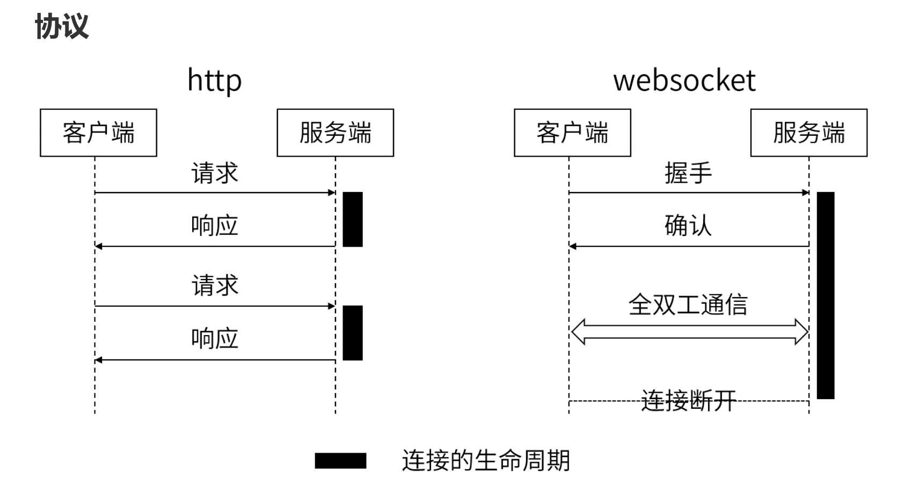

应用层协议，底层采用TCP协议

因为需要在浏览器中使用，使用HTTP协议完成一次握手

全双工通信通道

应用场景

1. 聊天室
2. 在线协同编辑
3. 实时数据更新
4. 弹幕
5. 股票等数据实时报价

**Socket** 是网络通信的底层抽象；
**WebSocket** 是构建在 Socket 之上的一种应用层协议，专为 **浏览器和服务器之间的双向通信** 设计。

| 项目             | **Socket**                           | **WebSocket**                             |
| ---------------- | ------------------------------------ | ----------------------------------------- |
| 📚 是什么         | 网络通信的底层机制（TCP/UDP 的抽象） | 一种基于 TCP 的 **应用层协议**            |
| 📡 协议层级       | 传输层                               | 应用层（建立在 TCP 之上）                 |
| 🔁 通信方式       | 支持双向，但客户端必须先发起         | 建立后支持浏览器和服务端 **双向实时通信** |
| 🌐 是否支持浏览器 | ❌ 不直接支持                         | ✅ 专为浏览器设计，支持 JS 调用            |
| 📦 使用端口       | 任意端口（常见 80/443）              | 通常是 HTTP/HTTPS 相同端口                |
| 🔐 安全支持       | 自己实现                             | WebSocket over TLS（wss://）原生支持加密  |
| 📜 协议标准       | 无统一标准（自己定）                 | 有标准：RFC 6455                          |
| 🔄 长连接支持     | 可以实现（但复杂）                   | 默认就是长连接，易用                      |
| 🔌 使用场景       | 游戏、IoT、底层服务通信              | 聊天室、实时通知、直播、协作系统          |

### 10.1服务器端实现

Gorilla WebSocket，Go实现的快速且应用较广泛的WebSocket库。

参考：https://github.com/gorilla/websocket/tree/master/examples/echo

server参考：https://github.com/gorilla/websocket/blob/master/examples/echo/server.go

下例，先使用http库完成WEB Server实现

由于HTML内容较为复杂，这里使用文件IO读取一个HTML文件。

index.html，网页浏览器端代码参考MDN https://developer.mozilla.org/zh-CN/docs/Web/API/WebSocket

```go
<!DOCTYPE html>
<html lang="en">
<head>
    <meta charset="UTF-8" />
    <meta http-equiv="X-UA-Compatible" content="IE=edge" />
    <meta name="viewport" content="width=device-width, initial-scale=1.0" />
    <title>magedu</title>
</head>
<body>
<h1>马哥教育 www.magedu.com -- http库、WebSocket 使用</h1>
<br />
WebSocket 测试 ws://127.0.0.1:9999/wsecho
</body>
<script>
    // 建立 WebSocket 连接
    const ws = new WebSocket("ws://127.0.0.1:9999/wsecho");

    // 连接建立时发送消息
    ws.addEventListener("open", function () {
        ws.send("Hello Server!");
    });

    // 接收服务器消息
    ws.addEventListener("message", function (event) {
        console.log("Message from server:", event.data);
    });

    // 连接出错
    ws.addEventListener("error", (event) => {
        console.log("连接错误：", event);
    });

    // 连接关闭
    ws.onclose = () => {
        console.log("连接关闭");
    };
</script>
</html>
```


```go
// 1.初始化WebSocket 协议升级器
// websocket.Upgrader 是一个结构体，用于将普通 HTTP 连接升级为 WebSocket 连接。
// 默认配置即可，实际应用中可设置跨域校验（如 CheckOrigin）、读写缓冲等参数。
var upgrader = websocket.Upgrader{} // 使用缺省选项

// HTTP 路由：主页处理函数
func home(w http.ResponseWriter, request *http.Request) {
	// fmt.Printf("请求=%v\n", request)
	w.Header().Add("X-Server", "magedu.com") // 响应头
	http.ServeFile(w, request, "index.html") // 响应的内容
}
func wsecho(w http.ResponseWriter, request *http.Request) {
	// fmt.Printf("请求=%v\n", request)
	// https://github.com/gorilla/websocket/blob/master/examples/echo/server.go/ech o
	//Upgrade() 将连接从 HTTP 切换到 WebSocket 协议。
	//返回的 c 是 WebSocket 的连接对象。
	c, err := upgrader.Upgrade(w, request, nil)
	if err != nil {
		log.Print("upgrade:", err)
		return
	}
	defer c.Close()
	//ReadMessage()：读取客户端消息（mt 是消息类型，比如文本或二进制）。
	//WriteMessage()：把收到的消息再写回客户端，实现“Echo”效果。
	for {
		mt, message, err := c.ReadMessage()
		if err != nil {
			log.Println("read:", err)
			break
		}
		log.Printf("recv: %s", message)
		err = c.WriteMessage(mt, message)
		if err != nil {
			log.Println("write:", err)
			break
		}
	}
}
func main() {
	// URL映射到handler，handler函数2个参数一进一出
	http.HandleFunc("/", home)               // HTTP协议处理
	http.HandleFunc("/wsecho", wsecho)       // ws协议处理
	http.ListenAndServe("0.0.0.0:9999", nil) // http协议监听9999端口
}
```

### 10.2客户端实现

客户端参考：https://github.com/gorilla/websocket/blob/master/examples/echo/client.go

客户端代码大家可以参考以上链接，但多数情况下，更多是使用浏览器作为客户端

### 10.3聊天室实现

https://github.com/gorilla/websocket/tree/master/examples/chat

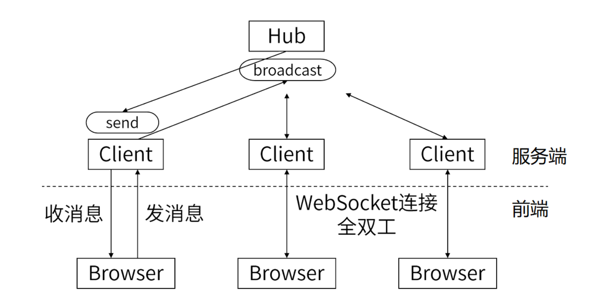


[Client Browser A]    	  	 [Client Browser B]     		  [Client Browser C]
     │                  				 	      │                        		 │
     │                     				   	 │                     		    │
     └─────▶ HTTP Upgrade ─────┴──────────────┬─────────┘
                     │                      						  │
                     ▼                    						    ▼
          ┌────────────────────────────────────────┐
          │        				   WebSocket Server            		 │
          │   			 (Gorilla + HTTP HandleFunc + Hub)  		 │
          └────────────────────────────────────────┘
                           │
         ┌─────────────────┴──────────────────┐
         │                                  								 │
         ▼                                  							       ▼
 ┌────────────────┐               ┌────────────────┐
 │    Client A                           │                │    Client B                          │  ← 每个客户端连接
 │ ┌──────────────┐ │               │ ┌──────────────┐ │
 │ │ readPump()  	       │ │               │ │ readPump()                │ │ ← 读取 WebSocket 消息
 │ └──────────────┘ │               │ └──────────────┘ │
 │ ┌──────────────┐ │               │ ┌──────────────┐ │
 │ │ writePump()                │ │               │ │ writePump()                │ │ ← 写 WebSocket 消息
 │ └──────────────┘ │               │ └──────────────┘ │
 │     send chan     │────────────▶│     send chan     │
 └──────────────────┘               └──────────────────┘
         │
         ▼
 ┌────────────────────────────┐
 │            Hub             │  ← 中央调度器
 │ ┌────────────────────────┐ │
 │ │    register chan       │ │ ← 注册新客户端
 │ │    unregister chan     │ │ ← 注销客户端
 │ │    broadcast chan      │ │ ← 接收消息广播
 │ └────────────────────────┘ │
 └────────────────────────────┘
         ▲
         │
  客户端readPump发送消息到Hub.broadcast

#### 

# 三、数据库驱动及ORM

## 1.ORM框架gorm

**安装**

gorm.io/driver/mysql依赖github.com/go-sql-driver/mysql，可以认为它是对驱动的再封装。

```go
$ go get -u github.com/go-sql-driver/mysql
$ go get -u gorm.io/gorm
$ go get -u gorm.io/driver/mysql
```

英文 https://gorm.io/docs/

中文 https://gorm.io/zh_CN/docs/index.html

### 1.1模型定义

https://gorm.io/zh_CN/docs/models.html

GORM 倾向于约定优于配置，如果不遵从约定就要写自定义配置

```go
// 不符合约定的定义，很多都需要配置，直接用不行
type Emp struct { // 默认表名emps
 emp_no     int    // 不是ID为主键，需要配置
 first_name string // 首字母未大写，也需要配置
 last_name  string
 gender     byte
 birth_date string
}
// 符合约定的定义如下
type student struct { // 默认表名students
 ID   int    // Id也可以
 Name string // 字段首字母要大写
 Age  int
}
```

### 1.2自定义配置

```go
var db *gorm.DB
func init() {
	dsn := "wayne:wayne@tcp(localhost:3306)/test?charset=utf8mb4"
	var err error
	db, err = gorm.Open(mysql.Open(dsn), &gorm.Config{
		Logger: logger.Default.LogMode(logger.Info),
	}) // 不要用:=
	if err != nil {
		log.Fatalln(err)
	}
	fmt.Println(db)
}
type Emp struct { // 默认表名emps
	EmpNo 	 	 int 	 	`gorm:"primaryKey"` // 不是ID为主键
	FirstName string // 首字母大写，对应字段first_name
	LastName 	string
	Gender 	 	byte
	BirthDate string
}
// 表名并没有遵守约定
func (Emp) TableName() string {
	return "employees"
}
func main() {
	var e Emp
	row := db.Take(&e) // 等价于Limit 1，取1条
	fmt.Println(row)
	fmt.Println(row.Error)
	fmt.Println(e)
}
```

```go
BirthDate string `gorm:"column:birth_date"` // 字段名可以不符合约定，但字段名首字母
一定要大写
Xyz string `gorm:"column:birth_date"` // 可以
```

### 1.3基本操作

**迁移**

https://gorm.io/zh_CN/docs/migration.html#%E8%A1%A8

**新增**

参考 https://gorm.io/zh_CN/docs/create.html#%E5%88%9B%E5%BB%BA%E8%AE%B0%E5%BD%9

```go
// 新增一条
n := time.Now()
s := Student{Name: "Tom", Age: 20, Birthday: &n}
fmt.Println(s)
result := db.Create(&s) // 新增，传入指针
fmt.Println(s) // 注意前后ID的变化
fmt.Println(result.Error)
fmt.Println(result.RowsAffected)

// 新增多条
n := time.Now()
s := Student{Name: "Tom", Age: 20, Birthday: &n}
fmt.Println(s)
result := db.Create([]*Student{&s, &s, &s}) // 传入指针的切片
fmt.Println(s)
fmt.Println(result.Error)
fmt.Println(result.RowsAffected)
```

四、Gin框架

