[TOC]

# Linux

## 1.基础入门(不重要)

### 1.1终端

**物理设备，硬件，通过终端与主机进行交互**

控制台终端： /dev/console 

串行终端：/dev/ttyS# 

虚拟终端：tty：teletypewriters， /dev/tty#，tty 可有n个，Ctrl+Alt+F# 

伪终端：pty：pseudo-tty ， /dev/pts/# 如：SSH远程连接

图形终端：startx, xwindows

### 1.2交互式接口

一种图形的，一种命令行（一般是一个shell程序）

shell也被称为LINUX的命令解释器

### 1.3bash shell

/bin/bash

```
显示当前使用的 shell
echo ${SHELL}
显示当前系统使用的所有shell
cat /etc/shells
```

### 1.4设置主机名

修改hostname 需要root权限

```bash
#临时生效
hostname NAME
#持久生效,支持CentOS7和Ubuntu18.04以上版本
hostnamectl set-hostname NAME
```

### 1.5命令提示符prompt

**PS1更多设置自行搜索**

```
echo $PS1 #查看当前命令提示符
[\u@\h \W]\$

#PS1中的值要单引号引用,如果是双引号，则某些替换符不会被解析
PS1='\e[31m[\u@\h \W]\$\e[0m'

#如果要永久保存，则要写文件
echo "PS1='\e[31;1m[\u@\h \W]\\$ \e[0m'">/etc/profile.d/env.sh
source /etc/profile.d/env.sh
```

### 1.6执行命令

内部命令：由shell自带的，而且通过某命令形式提供，用户登录后自动加载并常驻内存中

外部命令：在文件系统路径下有对应的可执行程序文件，当执行命令时才从磁盘加载至内存中，执行完毕后从内存中删除

```bash
type ls #区分是内部命令还是外部命令
type -t echo #简写，只给出类型，builtin｜alias｜file|keyword
type -a echo #列出所有，有可能是内部命令，也同时会是外部命令
bash -c help #查看bash中所有内容（不仅仅是内部命令）
help #查看bash中所有内容（不仅仅是内部命令）
enable #查看bash中所有内置命令
help echo #查看内部命令帮助
```

```bash
查看是否存在对应内部和外部命令
root@ubuntu2204:~# type echo
echo is a shell builtin

root@ubuntu2204:~# type -a echo
echo is a shell builtin
echo is /usr/bin/echo
echo is /bin/echo
```

输入命令后回车，提请shell程序找到键入命令所对应的可执行程序或代码，并由其分析后提交给内核分配资源将其运行起来

有内部命令，又有外部命令，因为不是所有主机都使用标准shell，所以常用内部命令会有一个外部命令的备份，防止内部命令执行失败。

在命令执行时，shell 先判断是否是内部命令，如果是，则执行内部命令，如果不是，则去特定目录下寻找外部命令。

bash shell 自身就是一个程序，里面有很多小工具，有用户通过终端连接主机，则该终端就有一个bash在后台运行着。

#### 内部命令

```
help #查看所有内部命令及帮助
enable   #查看所有启用的内部命令
enable cmd #启用 cmd 命令
enable -n cmd   #禁用内部 cmd 命令
enable -n   #查看所有禁用的内部命令
```

#### 外部命令

```
which  -a |--skip-alias 
whereis
```

```bash
[root@rokcy8 ~]# which ls
alias ls='ls --color=auto'
/usr/bin/ls

#查看path
[root@rokcy8 ~]# echo $PATH
/usr/local/sbin:/usr/local/bin:/usr/sbin:/usr/bin:/root/bin

#创建root下的 bin 目录
[root@rokcy8 ~]# mkdir bin
#拷贝 echo 命令到 /root/bin/ 目录下
[root@rokcy8 ~]# cp /usr/bin/echo /root/bin/
#再次查看
[root@rokcy8 ~]# which echo
/usr/bin/echo
[root@rokcy8 ~]# which -a echo
/usr/bin/echo
/root/bin/echo
```

**Hash缓存表**

系统初始hash表为空，当外部命令执行时，默认会从PATH路径下寻找该命令，找到后会将这条命令的路径记录到hash表中，当再次使用该命令时，shell解释器首先会查看hash表，存在将执行之，如果不存在，将会去PATH路径下寻找，利用hash缓存表可大大提高命令的调用速率

hash 只对当前用户的当前终端进程有效，是一组临时数据

```bash
root@ubuntu2204:~# hash
hits command
   1 /usr/bin/mesg
   2 /usr/bin/which
   1 /usr/bin/su
   3 /usr/bin/ls
   
root@ubuntu2204:~# hash -l
builtin hash -p /usr/bin/mesg mesg
builtin hash -p /usr/bin/which which
builtin hash -p /usr/bin/su su
builtin hash -p /usr/bin/ls ls
```

### 1.7别名

仅对当前用户：~/.bashrc 

对所有用户有效：/etc/bashrc， /etc/bash.bashrc(ubuntu)

```
alias cdnet='cd /etc/systemd/network'

编辑配置文件新加的别名不会立即生效，要退出重新登录或在当前进程中重新读取配置文件
source /path/to/config_file
. /path/to/config_file
```

### **1.8常见命令**

#### 1.8.1查看硬件信息

```bash
111111111.查看cpu信息
[root@ubuntu2204 ~]# lscpu
[root@ubuntu2204 ~]# cat /proc/cpuinfo

2222222222.查看内存大小
[root@ubuntu2204 ~]# free
[root@ubuntu2204 ~]# cat /proc/meminfo
补充
total #系统总的可用物理内存大小
used #已被使用的物理内存大小
free #还有多少物理内存可用
shared #被共享使用的物理内存大小
buff/cache #被 buffer 和 cache 使用的物理内存大小
available #还可以被 应用程序 使用的物理内存大小
#free 是真正尚未被使用的物理内存数量。
#available 是应用程序认为可用内存数量，available = free + buffer + cache (大概的计算方法)

333333333333333333333.查看硬盘和分区情况
[root@centos8 ~]# lsblk
[root@centos8 ~]# cat /proc/partitions
dm是lvm设备
```

#### 1.8.2查看系统版本信息

```bash
查看系统架构
[root@ubuntu2204 ~]# arch

查看内核版本
[root@rocky8 ~]# uname -r

看操作系统发行版本，自己搜
cat /etc/redhat-release
```

#### 1.8.3日期和时间

```bash
date

#设置时区 
[root@ubuntu2204 ~]# timedatectl list-timezones
[root@ubuntu2204 ~]# timedatectl set-timezone Asia/Shanghai
[root@ubuntu2204 ~]# timedatectl status

[root@ubuntu2204 ~]# ll /etc/localtime
[root@ubuntu2204 ~]# cat /etc/timezone

#日历
[root@ubuntu2204 ~]# cal 9 1752
```

#### 1.8.4关机重启

```bash
#关机
halt
poweroff
init 0
shutdown -h now
shutdown +10 #10分钟后关机

#重启
reboot
init 6
shutdown -r now

#取消关机重启
[root@ubuntu2204 ~]# shutdown -c
```

#### 1.8.5用户登录信息查看命令

```
whoami
who am i
who
w
```

#### 1.8.6文本编辑

创建登录提示文件 /etc/motd

#### 1.8.7会话管理

```
screen
tmux
Tmux 是一个终端复用器（terminal multiplexer），类似 screen，但是更易用，也更强大
```

#### 1.8.8语言环境

```bash
[root@centos7 ~]#echo $LANG

#临时修改
[root@centos7 ~]#LANG=zh_CN.UTF-8
```

#### 1.8.9获取帮助

whereis 可以列出命令或系统文件路径，以及其对应的man 手册中的文档路径

```bash
[root@ubuntu2204 ~]# whereis ls
ls: /usr/bin/ls /usr/share/man/man1/ls.1.gz
```

```
help COMMAND 内部命令
ls --help    外部命令
date -h

man bash 内部命令

info ls
```

### 1.9命令行与括号扩展

#### 1.9.1引号

变量 

双引号，弱引用，可以解析内容

单引号，强引用，原样输出

```bash
[root@ubuntu2204 ~]# echo "echo $HOSTNAME"
echo ubuntu2204
[root@ubuntu2204 ~]# echo 'echo $HOSTNAME'
echo $HOSTNAME
[root@ubuntu2204 ~]# echo `echo $HOSTNAME`
ubuntu2204
```

#### 1.9.2括号扩展：{}

关闭和启用自行搜索，默认启用

```bash
echo file{1,3,5} 结果为：file1 file3 file5 
rm -f file{1,3,5}
echo {1..10}
echo {a..z}
echo {1..10..2}
000 002 004 006 008 010 012 014 016 018 020
echo {000..20..2}

[root@ubuntu2204 ~]# echo {a..z} {A..Z}
a b c d e f g h i j k l m n o p q r s t u v w x y z A B C D E F G H I J K L M N O P Q R S T U V W X Y Z

[root@ubuntu2204 ~]# echo {a..z}{1..3}
a1 a2 a3 b1 b2 b3 c1 c2 c3 d1 d2 d3 e1 e2 e3 f1 f2 f3 g1 g2 g3 h1 h2 h3 i1 i2 i3 j1 j2 j3 k1 k2 k3 l1 l2 l3 m1 m2 m3 n1 n2 n3 o1 o2 o3 p1 p2 p3 q1 q2 q3 r1 r2 r3 s1 s2 s3 t1 t2 t3 u1 u2 u3 v1 v2 v3 w1 w2 w3 x1 x2 x3 y1 y2 y3 z1 z2 z3
```

#### 1.9.3命令补全路径补全

#### 1.9.4bash快捷键

```bash
Ctrl + l #清屏，相当于clear命令
Ctrl + a #光标移到命令行首，相当于Home
Ctrl + e #光标移到命令行尾，相当于End
Ctrl + u #从光标处删除至命令行首
Ctrl + k #从光标处删除至命令行尾
```

## 2.文件管理与IO重定向

```
打开/下两层目录树形结构
tree / -d -L 2
```

### 2.1常见文件目录功能

```bash
/boot #引导文件存放目录，内核文件(vmlinuz)、引导加载器(bootloader, grub)都存放
于此目录
/bin #所有用户使用的基本命令；不能关联至独立分区，OS启动即会用到的程序
/sbin #管理类的基本命令；不能关联至独立分区，OS启动即会用到的程序      
/lib #启动时程序依赖的基本共享库文件以及内核模块文件(/lib/modules)
/lib64 #专用于x86_64系统上的辅助共享库文件存放位置
/etc #配置文件目录
/home/USERNAME #普通用户家目录
/root #管理员的家目录
/media #便携式移动设备挂载点
/mnt #临时文件系统挂载点
/dev #设备文件及特殊文件存储位置, b:block device，随机访问,c:character 
device，线性访问
/opt #第三方应用程序的安装位置
/srv #系统上运行的服务用到的数据
/tmp #临时文件存储位置
/usr #universal shared, read-only data
/usr/bin #保证系统拥有完整功能而提供的应用程序
/usr/sbin #同上
/usr/lib #32位使用
/usr/lib64 #只存在64位系统
/usr/include #C程序的头文件(header files)
/usr/share #结构化独立的数据，例如doc, man等
/var #variable data files,可变数据目录
/var/cache #应用程序缓存数据目录
/var/lib #应用程序状态信息数据
/var/local #专用于为/usr/local下的应用程序存储可变数据
/var/lock #锁文件
/var/log #日志目录及文件
/var/opt #专用于为/opt下的应用程序存储可变数据
/var/run #运行中的进程相关数据,通常用于存储进程pid文件
/var/spool #应用程序数据池
/var/tmp #保存系统两次重启之间产生的临时数据
/proc #用于输出内核与进程信息相关的虚拟文件系统
/sys #用于输出当前系统上硬件设备相关信息虚拟文件系统
```

### 2.2文件类型

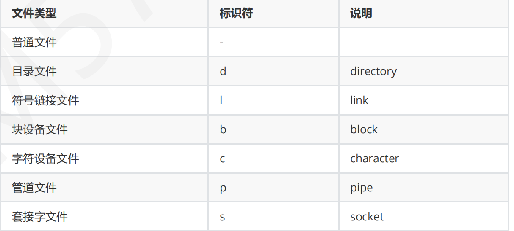

**管道文件**
所谓管道，是指用于连接一个读进程和一个写进程，以实现它们之间通信的共享文件，又称 pipe 文件。

**套接字文件**
Socket本身有“插座”的意思，在Unix/Linux环境下，用于表示进程间网络通信的特殊文件类型。本质为内核借助缓冲区形成的伪文件。

### 2.3文件操作命令

```bash
#显示当前工作目录
pwd [-LP]
#常用选项
-P #显示真实物理路径
-L #显示链接路径（默认）

基名：basename，只取文件名而不要路径
目录名：dirname，只取路径，不要文件名

cd - #切换到上一个目录

ls

stat #查看文件状态，类似于windows查看文件属性（元数据，和文件数据保存在不同块）
#目录也是一个文件
[root@ubuntu2204 ~]# stat /boot/
 File: /boot/
 Size: 4096     Blocks: 8         IO Block: 4096   directory
Device: 802h/2050d Inode: 2           Links: 4
Access: (0755/drwxr-xr-x) Uid: (    0/   root)   Gid: (    0/   root)
Access: 2023-05-08 08:29:56.450195175 +0800
Modify: 2023-05-04 17:01:30.850115156 +0800
Change: 2023-05-04 17:01:30.850115156 +0800
 Birth: 2023-05-04 17:00:21.000000000 +0800
#查看文件所在分区的信息
[root@ubuntu2204 ~]# stat -f /etc/fstab 
 File: "/etc/fstab"
   ID: 55a3efb585efc96c Namelen: 255     Type: ext2/ext3
Block size: 4096       Fundamental block size: 4096
Blocks: Total: 25397502   Free: 23933766   Available: 22632109
Inodes: Total: 6488064   Free: 6395997
#权限-inode-文件名
[root@ubuntu2204 ~]# stat -c "%a-%i-%n" /etc/fstab 
644-3277488-/etc/fstab

file#确定文件类型

#将Windows的文本格式转换成的Linux文本格式
[root@ubuntu2204 ~]# dos2unix win.txt 
dos2unix: converting file win.txt to Unix format...
[root@ubuntu2204 ~]# file win.txt 
win.txt: ASCII text
#将Linux的文本格式转换成Windows的文本格式
[root@ubuntu2204 ~]# unix2dos win.txt 
unix2dos: converting file win.txt to DOS format...
[root@ubuntu2204 ~]# file win.txt 
win.txt: ASCII text, with CRLF line terminators

touch#创建空文件和刷新时间

cp 
#常用选项
-i|--interactive #如果目标文件己存在，则提示是否覆盖
-n|--no-clobber #如果目标文件己存在，则跳过此文件复制
-R|-r|--recursive #递归复制，可用于目录的复制
-b #先备份再覆盖

mv #移动和重命名文件

#为所有的f开头包含conf的文件加上.bak后缀
[root@rocky86 ~]# rename 'conf'   'conf.bak'   f* 
#去掉所有的bak后缀
[root@rocky86 ~]# rename '.bak' '' *.bak

tree
#常用选项
-a #显示所有，包括隐藏目录和文件
-d #只显示目录
-f #显示所有内容的完整路径
-L n #只显示n层目录

mkdir
rmdir#删除空目录

df -Th #查看文件系统类型 磁盘等
cat /etc/fstab

#查看分区inode
df -i
df -h
inode编号耗尽 & 磁盘打满
echo test-{1..523977}.txt | xargs touch #创建大量空文件耗尽inode号
cp /dev/zero /tmp/ #创真实大文件把硬盘打满
```

### 2.4文件通配符

常见的通配符如下：

```bash
* #匹配零个或多个字符，但不匹配 "." 开头的文件，即隐藏文件
? #匹配任何单个字符,一个汉字也算一个字符，
~ #当前用户家目录
. #当前工作目录
~+ #当前工作目录
~-   #前一个工作目录
~mage #用户mage家目录
[0-9] #匹配数字范围
[a-z] #一个字母
[A-Z] #一个字母
[wang] #匹配列表中的任何的一个字符
[^wang] #匹配列表中的所有字符以外的字符
[^a-z] #匹配列表中的所有字符以外的字符
```

其他字符类表示法        要用[[]]

```bash
[:digit:] #任意数字，相当于0-9
[:lower:] #任意小写字母,表示 a-z
[:upper:] #任意大写字母,表示 A-Z 
[:alpha:] #任意大小写字母
[:alnum:] #任意数字或字母a-zA-Z0-9
[:blank:] #水平空白字符
[:space:] #水平或垂直空白字符
[:punct:] #标点符号
[:print:] #可打印字符
[:cntrl:] #控制（非打印）字符
[:graph:] #图形字符
[:xdigit:] #十六进制字符
```

### 2.5文件元数据和节点表结构

#### 2.5.1inode 表结构

一个文件元数据和其具体内容数据，在磁盘分区上，是分开存放的。
这种存储文件元数据的区域就叫 inode，中文译作 "索引节点"（指针）

每一个inode表记录对应的保存了以下信息：
inode number（索引节点编号）
文件类型
权限
属主属组
链接数
文件大小

各时间戳
指向具体数据块的指针
有关文件的其他数据


目录
目录是个特殊文件，目录文件的内容保存了此目录中文件的列表及inode number对应关系

文件引用一个是 inode号
人是通过文件名来引用一个文件
一个目录是目录下的文件名和文件inode号之间的映射

#### 2.5.2硬链接与软链接

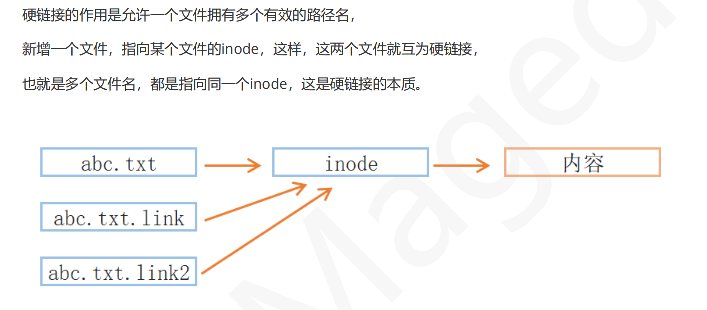

目录不能创建硬链接，不能跨分区

```bash
# . 表示当前目录，目录名也表示当前目录，所以是有2次引用
# .. 表示上级目录，上级目录名引用一次，上级目录中的 . 引用一次，子目录中的 .. 引用一次，所是是
3次引用
[root@ubuntu2204 dira]# ll -ai
total 8
395371 drwxr-xr-x 2 root root 4096 May  9 14:34 ./
395370 drwxr-xr-x 3 root root 4096 May  9 14:34 ../
```

```bash
ln filename linkname

ln -s filename linkname
```

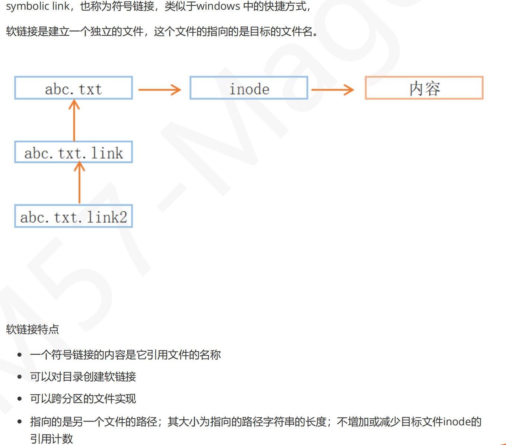

软链接如果使用相对路径，是相对于源文件的路径，而非相对于当前目录
删除软链接本身,不会删除源目录内容
删除源目录的文件,不会删除链接文件


#### 案例

案例1：提示空间满 No space left on device，但 df 可以看到空间很多

Inodes耗尽

案例2：提示空间快满，使用 rm 删除了很大的无用文件后，df 仍然看到空间不足

文件仍被进程占用

### 2.6IO重定向与管道(*）

#### 2.6.1标准输入输出

Linux 系统中有三个最基本的IO设备
1. 标准输入设备(stdin)：对应终端键盘
2. 标准输出设备(stdout)：对应终端的显示器

3. 标准错误输出设备(stderr)：对应终端的显示器

在虚拟终端中，标准输入输出设备都是当前的终端窗口

```bash
[root@ubuntu2204 ~]# ll /dev/std*
lrwxrwxrwx 1 root root 15 May  9 14:11 /dev/stderr -> /proc/self/fd/2
lrwxrwxrwx 1 root root 15 May  9 14:11 /dev/stdin -> /proc/self/fd/0
lrwxrwxrwx 1 root root 15 May  9 14:11 /dev/stdout -> /proc/self/fd/1

[root@ubuntu2204 ~]# ll /proc/self/fd/
total 0
lrwx------ 1 root root 64 Jul 12 17:47 0 -> /dev/pts/1
lrwx------ 1 root root 64 Jul 12 17:47 1 -> /dev/pts/1
lrwx------ 1 root root 64 Jul 12 17:47 2 -> /dev/pts/1

[root@ubuntu2204 ~]# tty
/dev/pts/0
```

#### 2.6.2IO重定向

I/O重定向：将默认的输入，输出或错误对应的设备改变，指向新的目标

##### 标准输出重定向

```bash
#覆盖操作符，如果文件存在，会被覆盖
> #把STDOUT重定向到文件
1>     #同上
2> #把STDERR重定向到文件
&> #把标准输出和错误都重定向
>& #和上面功能一样，建议使用上面方式
#追加操作符，在原有文件的基础上追加内容
>> #追加标准输出重定向至文件
1>> #同上
2>> #追加标准错误重定向至文件
&>>
[root@ubuntu2204 ~]# ls fstab null > out.log 2> err.log
ls fstab null &> out.log
```


##### 标准输入重定向

tr 命令
**用于转换字符、删除字符和压缩重复的字符**。它从标准输入读取数据并将结果输出到标准输出

```bash
[root@ubuntu2204 ~]# tr a-z A-Z
123abcd
123ABCD
[root@ubuntu2204 ~]# tr [:lower:] [:upper:]
123abc
123ABC
#非123就替换成x
[root@ubuntu2204 ~]# tr -c 123 x 
13579
13xxxx
#非2-5的内容替换成 x
[root@ubuntu2204 ~]# tr -c '2-5' x 
123456789
x2345xxxxx
#删除2-5
[root@ubuntu2204 ~]# tr -d '2-5' 
1234567
167
#删除大写字母
[root@ubuntu2204 ~]# tr -d [:upper:]
123abcABC456 
123abc456

#将issue文件中的小写字母换成大写，然后重定向输出到文件
[root@ubuntu2204 ~]# tr [:lower:] [:upper:] </etc/issue > tr.tx

#命令重定向
[root@ubuntu2204 ~]# tr -s ' ' <<<`df`
#同上
[root@ubuntu2204 ~]# tr -s ' ' < <(df)

tr -s ' ' <<< df的意思是：先执行df命令获取磁盘使用情况的输出，然后将这个输出作为字符串传递给tr 命令，tr 会压缩其中的所有多空格序列，使得每个字段之间只保留一个空格。
df | tr -s ' '
```


```bash
[root@ubuntu2204 ~]# cat a.txt 
1+2+3+4+5+6+7+8+9+10
#标准输入重定向
[root@ubuntu2204 ~]# bc < a.txt 
55
#标准输入输出重定向
[root@ubuntu2204 ~]# bc < a.txt > rs.txt
[root@ubuntu2204 ~]# cat rs.txt 
55
#多行执行
[root@ubuntu2204 ~]# seq -s + 10 > a.txt;bc<a.txt>rs.txt
[root@ubuntu2204 ~]# cat rs.txt 
55
#等价于 cat a.txt
[root@ubuntu2204 ~]# cat < a.txt 
1+2+3+4+5+6+7+8+9+10

#标准输入多行重定向
[root@ubuntu2204 ~]# cat > abc.txt <<EOF
> 123
> 456
> 789
> EOF
```

#### 高级重定向

cmd <<< "string"
含义是 here-string ，表示传给给cmd的stdin的内容从这里开始是一个字符串。

cmd1 < <(cmd2)
名称为 Process substitution ,是由两个部分组成
<(cmd2) 表示把cmd2的输出写入一个临时文件, 注意：< 符号 与（ 符号之间没有空格
cmd1 < 这是一个标准的stdin重定向
把两个合起来，就是把cmd2的输出stdout传递给cmd1作为输入stdin, 中间通过临时文件做传递

### 2.7管道（*）

```
COMMAND1|COMMAND2|COMMAND3|
```

将命令1的STDOUT发送给命令2的STDIN，命令2的STDOUT发送到命令3的STDIN 
所有命令会在当前shell进程的子shell进程中执行
组合多种工具的功能

#### 2.7.1实现邮件服务

```bash
[root@rocky86 ~]# vim /etc/mail.rc
set from=1701785325@qq.com
set smtp=smtp.qq.com
set smtp-auth-user=1701785325@qq.com
set smtp-auth-password=meenopnxjawzbfcc
set smtp-auth=login
set ssl-verify=ignore
echo "test email" | mail  -s "test" 123456@qq.com
```

```bash
[root@rocky86 ~]# echo magedu | passwd --stdin jose &> /dev/null
#ubuntu 中 passwd 函数没有 --stdin 选项
[root@ubuntu2204 ~]# echo -e "123456\n123456" | passwd jose
```

#### 2.7.2tee

将标准输入复制到每个指定文件，并显示到标准输出

```bash
#接受标准输入，在标准输出上打印，并写文件
[root@ubuntu2204 ~]# tee tee.log
#管道重定向
[root@ubuntu2204 ~]# echo hello | tee tee.log
hello
#tee.log 里面是hello,终端输出是HELLO
[root@ubuntu2204 ~]# echo hello | tee tee.log | tr 'a-z' 'A-Z'
HELLO
#tee.log 和终端输出都是大写
[root@ubuntu2204 ~]# echo hello | tr 'a-z' 'A-Z' | tee tee.log
HELLO
#追加
[root@ubuntu2204 ~]# echo hello | tr 'a-z' 'A-Z' | tee -a tee.log
HELLO
```

### 2.8文件查找与打包压缩

#### 2.8.1文件查找

**locate**

locate 查询系统上预建的文件索引数据库 /var/lib/mlocate/mlocate.db

索引的构建是在系统较为空闲时自动进行(周期任务)，执行updatedb可以更新数据库

索引构建过程需要遍历整个根文件系统，很消耗资源

locate和update命令来自于mlocate包

```bash
非实时查找(数据库查找)：locate
实时查找：find

#rehl系列
yum install -y mlocate
#ubuntu
apt install -y Plocate

[root@ubuntu2204 ~]# touch test.log
[root@ubuntu2204 ~]# locate test.log
#更新数据库之后再查找
[root@ubuntu2204 ~]# updatedb
[root@ubuntu2204 ~]# locate test.log
/root/test.log
#文件被删除，还能查到
[root@ubuntu2204 ~]# rm -f test.log
[root@ubuntu2204 ~]# locate test.log
/root/test.log
```

- 使用 `which` 当你需要快速确定某个命令对应的可执行文件的确切路径时非常有用。
- 使用 `whereis` 当你不仅需要知道命令的可执行文件位置，还想了解其源代码位置、手册页等内容时更加合适。

**find**

```bash
-maxdepth N #最大搜索目录深度,指定目录下的文件为第1级
-mindepth N #最小搜索目录深度

-name name #支持使用glob，如：*, ?, [], [^],通配符要加双引号引起来
-iname name #不区分字母大小写

-inum number #按inode号查找
-samefile name #相同inode号的文件

-type TYPE #指定文件类型
f #普通文件
d #目录文件
l #符号链接文件
s #套接字文件
b #块设备文件
c #字符设备文件
p #管道文件

-reg

-empty #空文件或空目录

#-a并 -o或 !非
[root@ubuntu2204 ~]# find -name "test*log" -o -name "test*txt"

#排除 dir1 目录中的 txt 文件，但还是会输出 dir1
[root@ubuntu2204 ~]# find -path './dir1' -prune -o -name "*.txt"

-size [+|-]N UNIT # N为数字，UNIT为常用单位 k, M, G, c(byte) 等
#解释
10k #表示(9k,10k],大于9k 且小于或等于10k
-10k #表示[0k,9k],大于等于0k 且小于或等于9k
+10k #表示(10k,∞)，大于10k

#以天为单位
-atime [+|-]N
-mtime [+|-]N
-ctime [+|-]N
#以分钟为单位
-amin [+|-]N
-mmin [+|-]N
-cmin [+|-]N

-perm  #权限匹配

-exec COMMAND {} \; #对查找到的每个文件执行由COMMAND指定的命令
{} #用于引用查找到的文件名称自身
#备份以log结尾的文件
[root@ubuntu2204 ~]# find -name "*log" -exec cp {} {}.bak \;
```

#### 2.8.2参数替换xargs

由于很多命令不支持管道|来传递参数，为了使用更灵活的参数，我们就城要用 xargs 产生命令参数，

**xargs 可以读入 stdin 的数据，并且以空格符或回车符将 stdin 的数据分隔，使其成为另一个命令的参数，另外，许多命令不能接受过多参数，命令执行可能会失败，xargs 也可以解决此问题；**

```bash
#一次创建1w个
[root@ubuntu2204 test]# echo f-{1..130752}.txt | xargs -n 10000 touch
```

#### 2.8.3压缩和解压缩

```
gzip
gunzip

zip
unzip

bzip2
bunzip2

xz
unxz

zcat 来源于 "zip cat" 的缩写，见字知义
其功能是在不解压的情况下查看压缩文件内容
```

#### 2.8.4打包解包

**tar本身是归档，没有压缩的功能**

c打包，v显示过程，f指定归档文件，x提取，t查看压缩文件列表但不提取，z使用gzip压缩，j使用bz2压缩

```bash
#只打包，不压缩，
[root@ubuntu2204 0510]# tar -cvf test.tar f1.txt f2.txt 
f1.txt
f2.txt
#递归打包目录
[root@ubuntu2204 0510]# tar -cvf log.tar /var/log

#只打包目录内的文件，不所括目录本身
[root@ubuntu2204 etc]# tar -cf etc.tar *

#打包并压缩
[root@ubuntu2204 0510]# tar -zcvf etc.tar.gz /etc/
[root@ubuntu2204 0510]# tar -jcvf etc.tar.bz2 /etc/
[root@ubuntu2204 0510]# tar -Jcvf etc.tar.xz /etc/
------------------------------------------------------------解包
#指定目录解压，x提取
[root@ubuntu2204 0510]# tar -xf log.tar -C /tmp

[root@ubuntu2204 0510]# tar -xf etc.tar.gz -C /tmp/etc-gz/
[root@ubuntu2204 0510]# tar -xf etc.tar.bz2 -C /tmp/etc-bz2/
[root@ubuntu2204 0510]# tar -xf etc.tar.xz -C /tmp/etc-xz/

-t #查看不提取
```

split命令可以分割一个文件为多个文件

```bash
#将test.txt 以6行为单位进行切切割成以 x 为前缀名称的小文件
[root@ubuntu2204 0510]# split -l 6 test.txt 
#同上
[root@ubuntu2204 0510]# split -6 test.txt
#以1M大小为单位切割，小文件以数字为后缀，etc.part 开头
[root@ubuntu2204 0510]# split -b 1M etc.tar.gz -d etc.part
#显示过程
[root@ubuntu2204 0510]# split --verbose -b 1M etc.tar.gz -d etc.part
#合并回去
[root@ubuntu2204 0510]# cat etc.part* > etc.tar.gz
```


## 3.权限管理

用户登录审计日志：cat /var/log/secure

```
[root@rocky8 ~]# cat /var/log/secure
[root@ubuntu2204 ~]# tail /var/log/auth.log
```

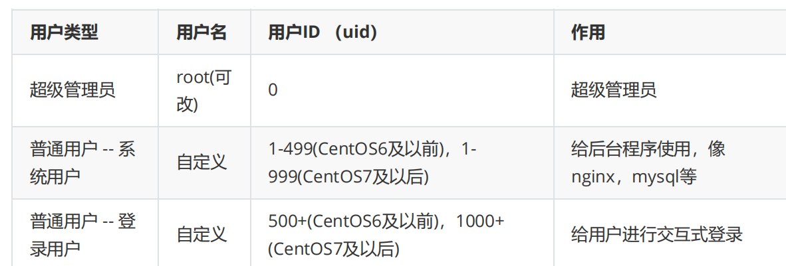

用户组也一样

### 3.1用户与用户组

一个用户至少有一个组，也可以有多个组；

一个组至少有0个用户，也可以有多个用户；

用户的主要组(primary group)：又称私有组，一个用户必须属于且只有一个主组，创建用户时，

默认会创建与其同名的组作为主组；

用户的附加组(supplementary group)：又称辅助组，一个用户可以属于0个或多个附加组；

使用组，可以对用户进行批量管理，比如对一个组授权，则该组下所有的用户能能继承这个组的权

限；

```bash
[root@rocky8 ~]# id postfix
uid=89(postfix) gid=89(postfix) groups=89(postfix),12(mail)
```

#### 3.1.1配置

/etc/passwd：用户及其属性信息(名称、UID、主组ID等）

/etc/shadow：用户密码及其相关属性

/etc/group：组及其属性信息

/etc/gshadow：组密码及其相关属性

#### 3.1.2命令

```bash
useradd
userdel
usermod #修改用户属性，如所属组
passwd Username
chpasswd

groupadd
groupmod 组属性修改
groupdel 可以删除组
gpasswd GROUP
groupmems 可以管理附加组的成员关系
newgrp mage #切换之后创建的文件属组就是mage


su #切换用户
su UserName #非登录式切换，即不会读取目标用户的配置文件，不改变当前工作目录，即不完全切换
su - UserName #登录式切换，会读取目标用户的配置文件，切换至自已的家目录，即完全切换，exit 退回至旧的用户身份，不要再用 su 切换至旧用户，否则会生成很多的bash子进程，环境可能会混乱。
说明：root su至其他用户无须密码；非root用户切换时需要密码

#不切换用户
[root@ubuntu2204 ~]# su - jose -c "touch jose-2.txt"


#修改用户密码策略
chage #可以修改用户密码策略  ，比如密码有效期
```


### 3.2程序，进程，用户

**什么是程序**

一个程序或一个命令，本质上也是一个可执行的二进制文件或一个可执行的脚本文件；

在服务器上有很多文件，只有那些特定的，可以被执行的二进制文件，才能被称为程序；

**什么是进程**

运行中的程序，就是进程；

**程序，进程，用户之间的关系是怎样的**

只有可以被执行的文件，才能叫作程序；

对于同一个程序，也不是所有用户都可以运行的，这要取决于当前用户对该程序有没有可执行权限

**进程的访问资源**（重要）

一个进程能不能访问某些资源，是由进程发起者决定的（跟进程本身的程序文件无关），比如某进程要

读写某个文件，则要看该进程发起者有没有权限读取该文件；

### 3.3.文件权限

u所有者g所属组o其他用户            rwx

user group other all

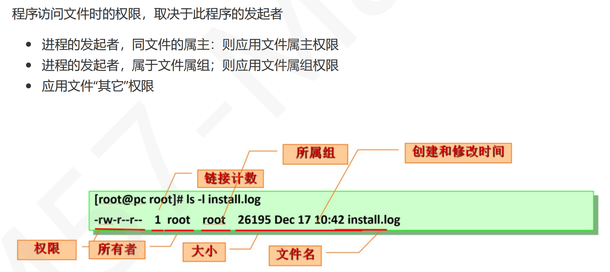

#### 3.3.1命令

```bash
chown    #修改文件属主，属组
#修改属主
[root@ubuntu2204 0509]# chown jose a1.txt #只修改属主
[root@ubuntu2204 0509]# chown jose. a2.txt #同时修改属主和属组
[root@ubuntu2204 0509]# chown jose: a3.txt #同时修改属主和属组

chgrp      #只修改文件属组

chmod
[root@ubuntu2204 0509]# chmod a= f1
[root@ubuntu2204 0509]# chmod u=r,g=w,o=x f2
[root@ubuntu2204 0509]# chmod u+w,g-x,o-r f3
[root@ubuntu2204 0509]# chmod a=rwx f4
#递归
[root@ubuntu2204 0509]# chmod o+rwx -R dir1/
644 读写 读 读
755 rwx rx rx

#新建文件：666-umask，按位对应相减，如果所得结果某位存在执行（奇数）权限，则该位+1；
#新建目录：777-umask；
umask
[root@ubuntu2204 ~]# umask
0022
[root@ubuntu2204 ~]# umask -p
umask 0022
[root@ubuntu2204 ~]# umask -S
u=rwx,g=rx,o=rx
[root@ubuntu2204 ~]# umask 123  #全局设置： /etc/bashrc , /etc/bash.bashrc（ubuntu）用户设置：~/.bashrc
```

执行 cp /etc/issue /data/dir/ 所需要的最小权限？

/bin/cp 需要x权限

/etc/ 需要x权限

/etc/issue 需要r权限

/data 需要x权限

/data/dir 需要w,x权限

#### 3.3.2特殊权限

s s t

4 2 1

**特殊权限SUID**

前提：进程有属主和属组；文件有属主和属组

任何一个可执行程序文件能不能启动为进程，取决发起者对程序文件是否拥有执行权限

**启动为进程之后，其进程的属主为发起者，进程的属组为发起者所属的组**

进程访问文件时的权限，取决于进程的发起者

二进制的可执行文件上**SUID**权限功能：

任何一个可执行程序文件能不能启动为进程：取决发起者对程序文件是否拥有执行权限

**启动为进程之后，其进程的属主为原程序文件的属主**

SUID只对二进制可执行程序有效

SUID设置在目录上无意义

```
chmod u+s File
```

**特殊权限SGID**

二进制的可执行文件上SGID权限功能：

任何一个可执行程序文件能不能启动为进程：取决发起者对程序文件是否拥有执行权限

**启动为进程之后，其进程的属组为原程序文件的属组**

```
chmod g+s FILE
```

**特殊权限** **Sticky** **位**

具有写权限的目录通常用户可以删除该目录中的任何文件，无论该文件的权限或拥有权

在目录设置Sticky 位，只有文件的所有者或 root 可以删除该文件

sticky 设置在文件上无意义

```
chmod o+t DIR
```

#### 3.3.3设定文件特殊属性

```bash
lsattr #显示文件特殊属性
chattr #设置
+i    #对文件：不可被删除不可被修改不可重命名；对目录：可修改查看目录中的文件，不可新建文件，不可删除文件
+a    #对文件：可追加内容，不可被删除，不可被修改，不可被重命名；对目录，可新建，修改文件，但不可删除文件
```

### 3.4访问控制表ACL

rwx 权限体系中，仅仅只能将用户分成三种角色，如果要对单独用户设置额外的权限，则无法完成；

而ACL可以单独对指定的用户设定各不相同的权限；提供颗粒度更细的权限控制；

CentOS7 之后默认创建的xfs和ext4文件系统具有ACL功能

#### 3.4.1ACL相关命令

setfacl 可设置ACL权限

getfacl 可查看设置的ACL权限

```bash
setfacl
setfacl -m u:jose:rw f1
getfacl f1

复制ACL
[root@ubuntu2204 tmp]# getfacl f1 f2
[root@ubuntu2204 tmp]# getfacl f1 | setfacl --set-file=- f2 #复制f1的ACL到f2
```

## 4.文本处理工具和正则表达式

### 4.1vim

#### 4.1.1末行模式

地址界定

```bash
N #具体第N行，例如2表示第2行
M,N #从左侧M表示起始行，到右侧N表示结尾行
M,+N #从左侧M表示起始行，右侧表示从光标所在行开始，再往后+N行结束
M,-N #从左侧M表示起始行，右侧表示从光标所在行开始，-N所在的行行结束

地址定界后跟一个编辑命令
p #输出
d #删除
y #复制

w file #将当前文件内容写入另一个文件
r file #读文件内容到当前文件中
t行号         #将前面指定的行复制到N行后
m行号         #将前面指定的行移动到N行后


   :2d #删除第2行
    :2,4d #删除第2到第4行
    :2;+3y #复制第2到第5行，总共4行
    p #将复制的4张粘贴
    :2;+4w test #将第2到第6行，总共5行内容写入新文件
    :5r /etc/issue #将/etc/issue 文件读取到第5行的下一行
    :t2 #将光标所在行复制到第2行的下一行
    :2;+3t10 #将第2到第5行，总共4行内容复制到第10行之后
    :.d #删除光标所在行
    :$y #复制最后一行
```

```bash
:s/要查找的内容/替换为的内容/g  #查找替换

set nu     #显示行号
set nonu #取消显示行号

#Tab用指定空格的个数代替    
:set tabstop=N|set ts=N #指定N个空格代替Tab

:set ignorecase|set ic #忽略字符大小写
:set noignorecase|set noic #不忽略

:set autoindent|set ai #启用自动缩进
:set noautoindent|set noai #禁用自动缩进
```

#### 4.1.2命令模式

进去的那个模式

```bash
^ #跳转至行首的第一个非空白字符
0 #跳转至行首
$ #跳转至行尾

G #最后一行
gg|1G #第一行

dgg   #删除光标所在的行到文件开始
dd   #删除光标所在行
Ndd #从当前行开始，删N行，N表示正整数，2dd表示从当前行开始，总共删2行

yy|Y #复制整行,yy前面加数字，表示从当前处往后复制多少行； 3yy 表示往下复制3行
Nyy #从当前处往后复制N行, N表示正整数，2yy表示从当前行开始，总共复制2行

p  #粘贴

u  #撤销上一个动作
```

#### 4.1.3可视化模式

在文件指定行的行首插入#

```
1、先将光标移动到指定的第一行的行首
2、输入ctrl+v 进入可视化模式
3、向下移动光标，选中希望操作的每一行的第一个字符
4、输入大写字母 I 切换至插入模式
5、输入 # 
6、按 ESC 键

v(小写) 面向字符
V(大写) 面向整行  
ctrl-v(小写) 面向块
```

指定区域插入任何

```go
、光标定位到要操作的地方
2、CTRL+v 进入“可视块”模式，选取这一列操作多少行
3、SHIFT+i(I)
4、输入要插入的内容
5、按 ESC 键【两次】
```

### 4.2文本常见处理工具

```bash
cat
tac #逆向显示
rev  #将同一行的内容逆向显示，同一行倒序

nl   #显示行号，相当于cat -n

hexdump  #查看非文本文件内容

more
less -N

head
tail

cut #cut 命令可以提取文本文件或STDIN数据的指定列
-d|--delimiter=DELIM   #指定分割符，默认是tab
-f|--fields=LIST       #要显示的列，-f1, -f1,2,3, -f 1-3,4

wc -l #统计

sort
-n|--numeric-sort         #以数字大小排序
-r|-reverse               #倒序
-t|--field-separator=SEP   #指定列分割符
-k|--key=KEYDEF           #指定排序列
-u|--unique               #去重
[root@ubuntu2204 ~]# cut -d: -f1,3 /etc/passwd|sort -t: -k2 -nr |head -n3
nobody:65534
jerry:1003
tom:1002
#统计日志访问量
[root@ubuntu2204 ~]# cut -d" " -f1 /var/log/nginx/access_log |sort -u|wc -l
201

uniq -c  #行去重并显示每行出现的次数，只能处理连续重复行，所以要先排序
#统计日志访问量最多的前三名的请求
[root@ubuntu2204 ~]# lastb | head -n $(echo `lastb | wc -l`-2 | bc) | tr -s ' ' | cut -d " " -f3 | sort | uniq -c | sort -nr | head -3
      5 183.136.225.32
      2 47.101.154.149
      1 64.62.197.96
      
diff #比较文件

vimdiff f1.txt f2.txt #vim打开比较两个文件
```

### 4.3正则表达式

通配符

```go
.：匹配任意一个字符
*：匹配任意内容
?：匹配任意一个内容
[]：匹配中括号中的一个字符
```

通配符与基本正则的使用场景：shell解析，通配符使用在文件名匹配，正则则是文本匹配

#### 4.3.1基本正则

**单字符匹配**

```bash
 .   匹配任意单个字符，当然包括汉字的匹配
 []  匹配指定范围内的任意单个字符
 - 示例：[shuji]、[0-9]、[a-z]、[a-zA-Z]
 [^] 匹配指定范围外的任意单个字符
 - 示例：[^shuji] 
 |  匹配管道符左侧或者右侧的内容
```

匹配次数

```bash
* #匹配前面的字符任意次，包括0次，贪婪模式：尽可能长的匹配
.* #任意长度的任意字符
\? #匹配其前面的字符出现0次或1次,即:可有可无
\+ #匹配其前面的字符出现最少1次,即:肯定有且 >=1 次
\{n\} #匹配前面的字符n次
\{m,n\} #匹配前面的字符至少m次，至多n次
\{,n\} #匹配前面的字符至多n次,<=n
\{n,\} #匹配前面的字符至少n次
```

位置锚定

```bash
^ #行首锚定, 用于模式的最左侧
$ #行尾锚定，用于模式的最右侧
^PATTERN$ #用于模式匹配整行
^$ #空行
^[[:space:]]*$ #空白行
\<PATTERN\>       #匹配整个单词
```

分组

```bash
    - 每一个匹配的内容都会在一个独立的()范围中
    - 按照匹配的先后顺序，为每个()划分编号
    - 第一个()里的内容，用 \1代替，第二个()里的内容，用\2代替，依次类推
    - \0 代表正则表达式匹配到的所有内容
#匹配abcabcabc
[root@ubuntu2204 ~]# echo abc-def-abcabcabc | grep "^\(abc\)-\(def\)-\1\{3\}"
abc-def-abcabcabc
```

或者

```bash
a\|b #a或b  
C\|cat #C或cat   
\(C\|c\)at #Cat或cat
```

#### 4.3.1扩展正则

匹配次数

```bash
*   #匹配前面字符任意次
? #0或1次
+ #1次或多次
{n} #匹配n次
{m,n} #至少m，至多n次
```

### 4.4**文本处理三剑客**

grep 命令主要对文本的（正则表达式）行基于模式进行过滤

sed：stream editor，文本编辑工具

awk：Linux上的实现gawk，文本报告生成器

#### 4.4.1grep

```bash
-m 3 #取前三行
-v  #取反
-i  #不区分大小写
-n   #显示行号
-o   #仅显示匹配的内容
-A -B -C       #-C包含前后
-E


#递归匹配
#不处理链接
[root@ubuntu2204 ~]# grep -r root /etc/*
#处理链接
[root@ubuntu2204 ~]# grep -R root /etc/*

#显示内容来自于哪个文件
grep -H root /etc/passwd /etc/sudoers /etc/my.cnf

#取cpu核数
[root@ubuntu2204 ~]# grep -c processor /proc/cpuinfo
2
```

#### 4.4.2sed

匹配/过滤/输出打印/替换/插入/\

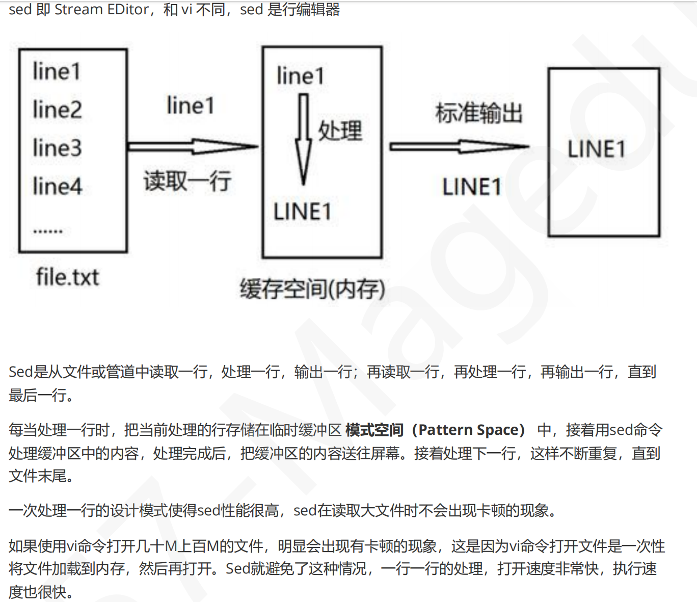


命令

```bash
p #打印当前模式空间内容，追加到默认输出之后
Ip #忽略大小写输出
d #删除模式空间匹配的行，并立即启用下一轮循环
a [\]text   #在指定行后面追加文本，支持使用\n实现多行追加
i [\]text   #在行前面插入文本
c [\]text   #替换行为单行或多行文本
w file #保存模式匹配的行至指定文件
r file #读取指定文件的文本至模式空间中匹配到的行后
= #为模式空间中的行打印行号
! #模式空间中匹配行取反处理
q           #结束或退出sed
```

基本用法


```bash
-n|--quiet|--silent #不输出模式空间内容到屏幕，即不自动打印
--------------------------------打印
#等待标准输入,script为空，默认是直接输出
[root@ubuntu2204 ~]# sed ''
123
123
#script为空，默认输出内容
[root@ubuntu2204 ~]# sed '' /etc/issue
Ubuntu 22.04 LTS \n \l
#script 中执行p命令，再加上默认输出，所有每行都显示了两次
[root@ubuntu2204 ~]# sed 'p' /etc/issue                  #p,print
Ubuntu 22.04 LTS \n \l
Ubuntu 22.04 LTS \n \l
#输出第一行
[root@ubuntu2204 ~]# sed -n '1p' /etc/passwd
#输出最后一行
[root@ubuntu2204 ~]# sed -n '$p' /etc/passwd

----------------------------------------------匹配
#正则匹配，输出包含root的行
[root@rocky86 ~]# sed -n '/root/p' /etc/passwd
#正则匹配行首#，显示注释行行号
[root@rocky86 0723]# sed -n '/^#/=' /etc/fstab
#行号开始，正则结束
[root@rocky86 0723]# sed -n '8,/root/p' /etc/passwd
------------------------------------------------插入
#bbb后插入
[root@ubuntu2204 ~]# sed '/bbb/a\---' test.txt
#2-4行前插入
[root@ubuntu2204 ~]# sed '2,4i\---' test.txt
#举一反三行尾插入用替换行尾符
sed '/final/s/$/---/g' data.txt
---------------------------------------------替换
#搜索替换
[root@rocky86 0723]# sed -n 's/root/ROOT/gp' /etc/passwd
------------------------------------------------追加\
# \ 的作用
[root@ubuntu2204 ~]# sed '2a   *******' test.txt 
aaa
bbb
*******
[root@ubuntu2204 ~]# sed '2a\   *******' test.txt 
aaa
bbb
   *******

----------------------------------------------#或
#-e 多个script
[root@ubuntu2204 ~]# #sed -e '2d' -e '4d' seq.log
[root@ubuntu2204 ~]# sed '2d;4d' seq.log

------------------------------------------------修改文件
[root@ubuntu2204 ~]# sed -i '2,7d' 10.txt

```

混合用法（基本用法扩展）

```bash
#打印倒数第二行
sed -n "$(echo $[`cat /etc/passwd|wc -l`-1])p" /etc/passwd

#只显示非#开头的行
[root@ubuntu2204 ~]# sed -n '/^#/!p' /etc/fstab

#不显示注释行和空行
[root@ubuntu2204 ~]# sed '/^$/d;/^#/d' fstab

#替换，&表示引用前面的r..t
[root@rocky86 0723]# sed -n 's/r..t/&er/gp' /etc/passwd

#删除非1|3|5|7
[root@ubuntu2204 ~]# rm -f `ls | grep -Ev 'f-(1|3|5|7)\.txt'`
[root@ubuntu2204 ~]# rm -f `ls |sed -n '/f-[^1357]\.txt/p'

#获取分区利用率
[root@ubuntu2204 ~]# df | sed -En 's/^\/dev.* ([0-9]+)%.*/\1/p' | sort -nr

#取ip地址，先有信息再有操作会更简单，而不是根据结果过滤数据
[root@ubuntu2204 ~]# ifconfig ens33 |sed -nr "2s/[^0-9]+([0-9.]+).*/\1/p" 
10.0.0.206

#将非#开头的行加#，r支持扩展正则，与-E一样
[root@rocky86 0723]# sed -rn ‘s/^[^#]/#&/p’ fstab

#将#开头的行删除#，原内容备份
[root@rocky86 0723]# sed -ri.bak '/^#/s/^#//' fstab
```

##### **sed** 高级用法

sed 中除了模式空间，还另外还支持保持空间（Hold Space）,利用此空间，可以将模式空间中的数据，

临时保存至保持空间，从而后续接着处理，实现更为强大的功能。

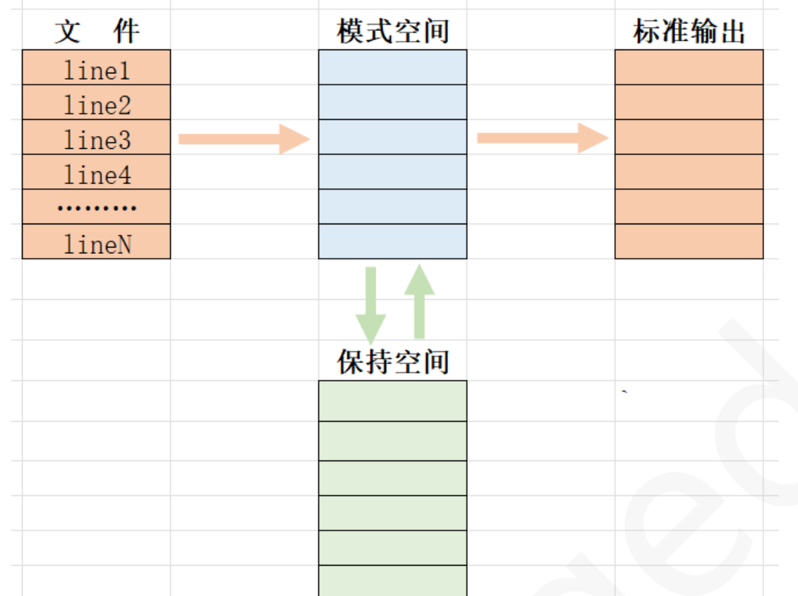

高级用法用到再补充

#### 4.4.3awk

1.执行BEGIN{action;… }语句块中的语句

2.从文件或标准输入(stdin)读取一行，然后执行pattern{ action;… }语句块，它逐行扫描文件，从第一行到最后一行重复这个过程，直到文件全部被读取完毕。

3.当读至输入流末尾时，执行END{action;…}语句块

BEGIN语句块在awk开始从输入流中读取行之前被执行，这是一个可选的语句块，比如变量初始化、打印输出表格的表头等语句通常可以写在BEGIN语句块中

END语句块在awk从输入流中读取完所有的行之后即被执行，比如打印所有行的分析结果这类信息汇总都是在END语句块中完成，它也是一个可选语句块

pattern语句块中的通用命令是最重要的部分，也是可选的。如果没有提供pattern语句块，则默认执行{ print }，即打印每一个读取到的行，awk读取的每一行都会执行该语句块

文件的每一行称为记录 record

记录可以由指定的分隔符分隔成多个字段（列 column，域 field），由$1，$2...$N 来标识每一个字段，$0 表示一整行

```bash
awk [options]   'program' var=value   file…
awk 
#常用选项
-f  #从文件中读入
-F  #指定分隔符，默认是空白符,可以指定多个
-v  设置变量
```

program

```bash
program 通常放在单引号中，由三部份组成，分别是BEGIN{}[pattern]{COMMAND}END{},这三部份可以没有或都有
awk '' /etc/issue
awk 'BEGIN{print "begin"}' /etc/issue
awk '{print $0}' /etc/issue
awk 'END{print "end"}' /etc/issue
awk 'BEGIN{print "begin"}{print $0}END{print "end"}' /etc/issue

pattern{action statements;..}
pattern #定义条件，只有符合条件的记录，才会执行后面的
action
action statements #处理数据的方式，常见如 print,printf等
```

内置变量


##### 范例

```bash
#begin中拿不到FILENAME
[root@ubuntu2204 ~]# awk 'BEGIN{print FILENAME}' /etc/issue
[root@ubuntu2204 ~]# awk 'BEGIN{print FILENAME}{print "test"}END{print FILENAME}' /etc/issue
test
test
/etc/issue
---------------------------------------FS
[root@ubuntu2204 ~]# awk -v FS=":" 'BEGIN{print FS}{print $1,$1}' /etc/passwd
:
root root
daemon daemon
[root@ubuntu2204 ~]# awk -v FS=":" 'BEGIN{print FS}{print $1FS$1}' /etc/passwd
:
root:root
daemon:daemon
#使用-F选项指定
[root@ubuntu2204 ~]# awk -F: 'BEGIN{print FS}{print $1FS$1}' /etc/passwd
:
root:root
daemon:daemon

#从shell变量中获取
[root@ubuntu2204 ~]# str=":";awk -v FS=$str 'BEGIN{print FS}{print $1FS$1}' /etc/passwd
:
root:root
daemon:daemon
#-F和FS变量功能一样，同时使用后面会覆盖前面的
[root@ubuntu2204 ~]# awk -v FS=":" -F";" 'BEGIN{print FS}' /etc/passwd
;
[root@ubuntu2204 ~]# awk -F";" -v FS=":" 'BEGIN{print FS}' /etc/passwd
:

#printf C语言写法
[root@ubuntu2204 ~]# awk -F: '{printf "%-20s %10d\n",$1,$3}' /etc/passwd

#支持赋值算数比较逻辑三目运算
[root@ubuntu2204 ~]# awk 'BEGIN{i=0;print ++i,++i}'
1 2
[root@ubuntu2204 ~]# awk -v i=0 'BEGIN{print !i}'
1
[root@ubuntu2204 ~]# awk -v i=-10 'BEGIN{print !i}'
0
[root@ubuntu2204 ~]# df|awk -F"[ %]+" '/^\/dev\/sd/{$(NF-1)>10?
disk="full":disk="OK";print $(NF-1),disk}'
26 full
3 OK
1 OK
13 full

#关系表达式关系表达式，结果为“真”才会被处理
awk '1' 
awk '0'

#读取输出第二行
[root@ubuntu2204 ~]# awk 'NR==2' /etc/passwd
daemon:x:1:1:daemon:/usr/sbin:/usr/sbin/nologin
[root@ubuntu2204 ~]# awk -F: '$3>=1000' /etc/passwd

------------------------------匹配
#包含root的行，用正则匹配，正则表达式需要用/ / 来锚定开始结束
[root@ubuntu2204 ~]# awk -F: '$0 ~ /root/{print $0}' /etc/passwd
[root@ubuntu2204 ~]# awk '/root/'   /etc/passwd
#不包含root的行
[root@ubuntu2204 ~]# awk '$0 !~ /root/' /etc/passwd

-------------------------------------行范围
[root@ubuntu2204 ~]# awk 'NR>=3 && NR<6{print NR,$0}' /etc/passwd
#sed 写法
[root@ubuntu2204 ~]# sed -n '3,5p' /etc/passwd
```

beginpatternend复杂用法

```bash
#流程控制
[root@ubuntu2204 ~]# awk -F: '{if($3<=100){print "<=100",$3}else if ($3<=1000) 
{print "<=1000",$3} else{print ">1000",$3}}' /etc/passwd

[root@ubuntu2204 ~]# awk -F: '{switch($3){case 0:print "root",$3;break; case 
/^[1-9][0-9]{0,2}$|1000/:print "sys user",$3;break;default:print "common 
user",$3;break;}}' /etc/passwd

[root@ubuntu2204 ~]# awk 'BEGIN{ total=0;i=1;while(i<=100){total+=i;i++};print 
total}'

[root@ubuntu2204 ~]# awk 'BEGIN{ total=0;i=101;do{ print total }while(i<=100);}' 0

#循环   continue break 
[root@ubuntu2204 ~]# awk 'BEGIN{sum=0;for(i=1;i<=100;i++){sum+=i};print sum}'
5050
#shell实现
[root@ubuntu2204 ~]# for((i=1,sum=0;i<=100;i++));do let sum+=i;done;echo $sum
[root@ubuntu2204 ~]# awk 'BEGIN{ arr[0]=123;arr[1]=456;for(i in arr){ print 
i"==>"arr[i] };}'
0==>123
1==>456

#next 可以提前结束对本行处理而直接进入下一行处理（awk自身循环）
[root@ubuntu2204 ~]# seq 10 |awk '{if($0%2!=0){next};{print $0}}'

#取出字符中的数字
[root@ubuntu2204 ~]# echo 'dsFUs34tg*fs5a%8ar%$#@' |awk -F "" '
> {
>   for(i=1;i<=NF;i++) 
> {  
>     if ($i ~ /[0-9]/)             
>   {
>       str=(str $i) #连字符，字符串拼接
>   }  
> } 
> print str
> }'
3458

#数组,还支持关联数组
[root@ubuntu2204 ~]# awk 'BEGIN{weekdays["mon"]="Monday";weekdays["tue"]="Tuesday";print weekdays["mon"]}'
Monday
```

文件abc.txt只有一行数字，计算其总和

```bash
[root@ubuntu2204 ~]# cat abc.txt |awk '{for(i=1;i<=NF;i++){sum+=$i};print sum}'
15
[root@ubuntu2204 ~]# cat abc.txt|tr ' ' + |bc
15
[root@ubuntu2204 ~]# sum=0;for i in `cat abc.txt`;do let sum+=i;done;echo $sum
15

#性能比较
time (awk 'BEGIN{ total=0;for(i=0;i<=10000;i++){total+=i;};print total;}')
time (total=0;for i in {1..10000};do total=$(($total+i));done;echo $total)
time (for ((i=0;i<=10000;i++));do let total+=i;done;echo $total)
time (seq -s"+" 10000|bc)
```

封掉查看访问日志中连接次数超过1000次的IP

```bash
[root@ubuntu2204 ~]# awk '{ip[$1]++}END{for(i in ip){if(ip[i]>=1000){system("iptables -A INPUT -s "i" -j REJECT")}}}' nginx.access.log-20200428
```

##### 函数

**数值处理**

```bash
rand() #返回0和1之间一个随机数
srand() #配合rand() 函数,生成随机数的种子
int() #返回整数
```

**字符串处理**

```bash
str1=(str2,str3) #连字符，字符串拼接
length([s]) #返回指定字符串的长度
sub(r,s,[t]) #在t中串搜索r匹配的内容，并将第一个匹配内容替换为s
gsub(r,s,[t]) #在t中串搜索r匹配的内容，并将匹配内容全部替换为s，即贪婪模式
split(s,array,[r]) #以r为分隔符，切割串s，并将结果保存至array数组中，索引值为1,2,…
```

```bash
#统计用户名的长度
[root@ubuntu2204 ~]# cut -d: -f1 /etc/passwd | awk '{print length()}'
[root@ubuntu2204 ~]# awk -F: '{print length($1)}' /etc/passwd

#替换
[root@ubuntu2204 ~]# echo "2008:08:08 08:08:08" | awk 'sub(/:/,"-",$1)'
2008-08:08 08:08:08
[root@ubuntu2204 ~]# echo "2008:08:08 08:08:08" | awk 'gsub(/:/,"-",$0)'
2008-08-08 08-08-08

```

调用shell

```bash
[root@ubuntu2204 ~]# awk 'BEGIN{system("hostname")}'
rocky86.m51.magedu.com
```

时间

```bash
[root@ubuntu2204 ~]# awk 'BEGIN{print systime();system("date +%s")}'
1661687319
1661687319

[root@ubuntu2204 ~]# awk 'BEGIN{print strftime("%Y-%m-%d %H:%M:%S");system("date \"+%Y-%m-%d %H:%M:%S\"")}'
2022-08-28 19:51:34
2022-08-28 19:51:34
```

自定义函数格式（C）

```bash
function name ( parameter, parameter, ... ) {
   statements
   return expression
}

[root@ubuntu2204 ~]# awk -F: 'function test(uname,uid){print uname" id is "uid}
{test($1,$3)}' /etc/passwd
root id is 0
bin id is 1
daemon id is 2

#把自定义的函数存起来，类似脚本
[root@ubuntu2204 ~]# cat func.awk
function max(x,y) {
 x>y?var=x:var=y
 return var
}
BEGIN{print max(a,b)}
[root@ubuntu2204 ~]# awk -v a=30 -v b=20 -f func.awk
30
```

## 5.shell脚本编程

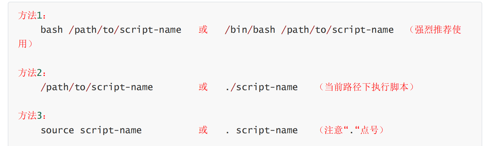

### 5.1配置vim注释信息

```bash
[root@ubuntu2204 ~]# vim .vimrc
" 基础设置
set ts=4
set shiftwidth=4
set expandtab
set number
syntax on
set background=dark
colorscheme desert

" 创建 shell 脚本模板
autocmd BufNewFile *.sh call SetTitle()

func! SetTitle()
    " 确保是 .sh 文件
    if expand("%:e") != 'sh'
        return
    endif

    " 写入头部信息
    call setline(1, "#!/bin/bash")
    call setline(2, "#")
    call setline(3, "#****************************************************")
    call setline(4, "#Author:         zhangzhihai")
    call setline(5, "#Date:           " . system("date +%Y-%m-%d"))
    call setline(6, "#FileName:       " . expand("%"))
    call setline(7, "#Description:    test")
    call setline(8, "#***************************************************")
    call setline(9, "") 
    call setline(10, "") 
    call setline(11, "") 
endfunc

" 新建文件时跳到末尾
autocmd BufNewFile * normal G
```

### 5.2基本用法

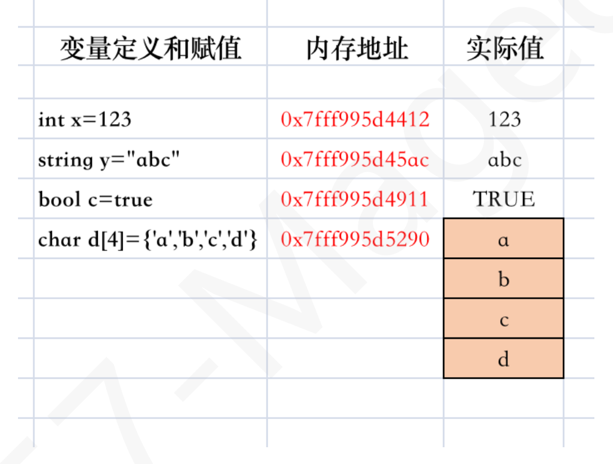

弱引用和强引用

```
"$name" 弱引用，其中的变量引用会被替换为变量值
'$name' 强引用，其中的变量引用不会被替换为变量值，而保持原字符串
```

当前进程与子进程

```
当前 . /test.sh
子进程./test.sh   
```

#### 5.2.1变量

显示删除变量

```bash
set显示所有已定义变量
unset <name> 删除
```

环境变量

```bash
#显示所有环境变量：
env
printenv
export
declare -x

#查看指定进程的环境变量
cat /proc/$PID/environ
```

只读变量

```bash
readonly name
declare -r name
```

位置变量

``` bash
$1,$2,... #对应第1个、第2个等参数，shift [n]换位置
$0 #命令本身,包括路径
$* #传递给脚本的所有参数，全部参数合为一个字符串
$@ #传递给脚本的所有参数，每个参数为独立字符串
$# #传递给脚本的参数的个数

set -- #清空位置变量
```

```bash
$?  #0代表成功,1-255代表失败。进程执行后，将使用变量 $? 保存状态码的相关数字，不同的值反应成功或失败，$?取值范例 0-255 

ping -c1 -W1 hostdown &> /dev/null 
echo $?
```

rm的安全实现

```bash
[root@ubuntu2204 ~]# cat /data/scripts/rm.sh 
#!/bin/bash
WARNING_COLOR="echo -e \E[1;31m"
END="\E[0m"
DIR=/tmp/`date +%F_%H-%M-%S`
mkdir $DIR
mv  $*  $DIR
${WARNING_COLOR}Move $* to $DIR $END
[root@ubuntu2204 ~]# chmod a+x /data/scripts/rm.sh
[root@ubuntu2204 ~]# alias rm='/data/scripts/rm.sh'
[root@ubuntu2204 ~]# touch {1..10}.txt
[root@ubuntu2204 ~]# rm *.txt
```

#### 5.2.2运算(类C)

```bash
[root@ubuntu2204 ~]# expr 10+20
10+20
[root@ubuntu2204 ~]# expr 10 + 20
30
```

#### 5.2.3条件

若真，则状态码变量 $? 返回0 

若假，则状态码变量 $? 返回1

```bash
-a FILE     #如果文件存在则为真
-b FILE     #如果文件为块特殊文件则为真
-c FILE     #如果文件为字符特殊文件则为真
-d FILE     #如果文件为目录则为真
-e FILE     #如果文件存在则为真
-f FILE     #如果文件存在且为常规文件则为真
-g FILE     #如果文件的组属性设置打开则为真
-h FILE     #如果文件为符号链接则为真
-L FILE     #如果文件为符号链接则为真
-k FILE     #如果文件的粘滞 (sticky) 位设定则为真
-p FILE     #如果文件为命名管道则为真
-r FILE     #如果当前用户对文件有可读权限为真
-s FILE     #如果文件存在且不为空则为真
-S FILE     #如果文件是套接字则为真
-t FD       #如果文件描述符在一个终端上打开则为真
-u FILE   #如果文件设置了SUID特殊权限则为真
-w FILE     #如果当前用户对文件有可写权限为真
-x FILE     #如果当前用户对文件有可执行权限为真
-O FILE     #如果当前用户是文件属主为真

-z STRING     #判断字符串是否为空，为空则为真
-n STRING #如果字符串不为空则为真
```

```bash
#文件是否不存在
[root@ubuntu2204 ~]# [ -a /etc/nologin ] 
[root@ubuntu2204 ~]# echo $?
1

-e

#a并且 o  !
[root@ubuntu2204 ~]# [ -f $FILE -a -x $FILE ]
```

#### 5.2.4()和{}，[]和[[]]

( cmd1;cmd2;... ) 和 { cmd1;cmd2;...; } 都可以将多个命令组合在一起，批量执行

( list ) 会开启子shell,并且list中变量赋值及内部命令执行后,将不再影响后续的环境

{ list; } 不会开启子shell, 在当前shell中运行,会影响当前shell环境，左侧要有空格，右侧要有; 结束

[[]]为[]的增强版

脚本子shell会阻塞主进程，而后台子shell不会，后面+个&

```bash
[root@ubuntu2204 ~]# name=mage;(echo $name;name=wang;echo $name );echo $name
mage
wang
mage
[root@ubuntu2204 ~]# name=mage;{ echo $name;name=wang;echo $name; } ;echo $name
mage
wang
wang
```

#### 5.2.5read

使用read来把输入值分配给一个或多个shell变量，read从标准输入中读取值，给每个单词分配一个变量，所有剩余单词都被分配给最后一个变量，如果变量名没有指定，默认标准输入的值赋值给系统内置变量REPLY

```bash
-p   #指定要显示的提示

[root@ubuntu2204 ~]# read
M51

[root@ubuntu2204 ~]# read -p "Please input your name: " NAME
Please input your name: wang

[root@ubuntu2204 ~]# read NAME TITLE
wang cto
[root@ubuntu2204 ~]# echo $NAME
wang
[root@ubuntu2204 ~]# echo $TITLE
cto
```

```bash
[root@ubuntu2204 ~]# cat test.txt
1 2
[root@ubuntu2204 ~]# read i j < test.txt ; echo i=$i j=$j
i=1 j=2
[root@ubuntu2204 ~]# echo 1 2 | read x y ; echo x=$x y=$y
x= y=
[root@ubuntu2204 ~]# echo 1 2 | ( read x y ; echo x=$x y=$y )
x=1 y=2
[root@ubuntu2204 ~]# echo 1 2 | { read x y ; echo x=$x y=$y; }
x=1 y=2
```

### 5.3bash shell配置

全局配置：针对所有用户皆有效

```bash
/etc/profile
/etc/profile.d/*.sh
/etc/bashrc ------------------------ /etc/bash.bashrc #ubuntu
```

个人配置

```bash
~/.bash_profile
~/.bashrc
```

**注意：文件之间的调用关系，写在同一个文件的不同位置，将影响文件的执行顺序**

#### 5.3.1登录

**交互式**

直接通过终端输入账号密码登录

使用 su - UserName 切换的用户

**非交互式登录**

su UserName 

图形界面下打开的终端

执行脚本

任何其它的bash实例

### 5.4流程控制

```bash
if 条件;then 
elif 条件; then
else条件
fi

read -p "Do you agree(yes/no)? " INPUT
INPUT=`echo $INPUT | tr 'A-Z' 'a-z'`
case $INPUT in
y|yes)
    echo "You input is YES"
   ;;  
n|no)
    echo "You input is NO"
   ;;  
*)
    echo "Input fales,please input yes or no!"
   ;;  
esac
```

```bash
for 变量名  in 列表
do
循环体
done

while (( EXP2 )); do   
   COMMANDS
   (( EXP3 ))
   done
   
while read line; do
循环体
done < /PATH/FROM/SOMEFILE

until CONDITION; do
循环体
done

无限循环
until false; do
循环体
done

continue    break
```

```bash
PS3="请选择: "
select i in 备份数据库 清理日志 重启服务 退出; do
case $REPLY in
1)
 echo "开始备份数据库..."
 sleep 2
 echo "数据库备份完成"
 ;;
2)
 echo "开始清理日志..."
 sleep 2
 echo "清理完成"
 ;;
3) 
 echo "开始重启服务..."
 sleep 2
 echo "重启完成"
 ;;
4)
 break
 ;;
*)
 echo "选项错误"
 ;; 
esac
done
```

### 5.5函数

函数的调用方式

可在交互式环境下定义函数

可将函数放在脚本文件中作为它的一部分

可放在只包含函数的单独文件中

函数的生命周期：被调用时创建，返回时终止

**查看函数**

```bash
#查看当前已定义的函数名
declare -F
#查看当前已定义的函数定义
declare -f
#查看指定当前已定义的函数名
declare -f func_name 
#查看当前已定义的函数名定义
declare -F func_name

#删除
unset func_name
```

#### 5.5.1使用函数文件

```bash
#定义函数文件
[root@ubuntu2204 ~]# cat functions
#!/bin/bash
func1(){
 echo "functions-func1"
}
func2(){
 echo "functions-func2"
}

#命令行引入
[root@ubuntu2204 ~]# . functions

#这种写法也可以
[root@ubuntu2204 ~]# source functions

#函数调用
[root@ubuntu2204 ~]# func1;func2
functions-func1
functions-func2

#脚本文件中引用
[root@ubuntu2204 ~]# cat func3.sh 
#!/bin/bash
. functions
func1
func2
#执行
[root@ubuntu2204 ~]# bash func3.sh
functions-func1
functions-func2
```

#### 5.5.2函数返回值

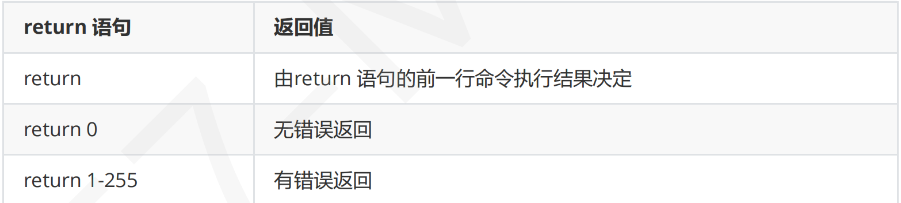

```bash
#默认返回值
var_func2(){
 echo "func2 ======="
 return
}
var_func3(){
 echo "func3 ======"
 errcmd
}
#自定义返回值，return 之后的语句将不会被执行
var_func4(){
 echo "func4 aaaaaaaaaaaaaa"
 return 123
 echo "func4 bbbbbbbbbb"
}
```

**return 和 exit 的区别**

return 只会中断函数执行，但exit 会中断整个脚本的执行

#### 5.5.3环境函数

```bash
定义环境函数：
export -f function_name 
declare -xf function_name
查看环境函数：
export -f
declare -xf
```

```bash
[root@ubuntu2204 ~]# cli_func1(){ echo "cli-func1"; }; cli_func2(){ echo "cli-func2"; };export -f cli_func2;
[root@ubuntu2204 ~]# export -f
cli_func2 () 
{ 
    echo "cli-func2"
}
declare -fx cli_func2
which () 
{ 
   ( alias;
   eval ${which_declare} ) | /usr/bin/which --tty-only --read-alias --read-functions --show-tilde --show-dot $@
}
declare -fx which
```

#### 5.5.4函数递归

递归特点: 

函数内部自已调用自已

必须有结束函数的出口语句，防止死循环


用递归实现阶乘

```bash
fac(){
 if [ $1 -gt 1 ];then
 echo $[$1 * $(fac $[$1-1])]
 else
 echo 1
 fi
}
fac $1
```


**斐波拉契数列**

```bash
fib(){
 if [ $1 -gt 1 ];then
 echo $[ $(fib $[$1-1]) + $(fib $[$1-2]) ]
 else
 echo $1
 fi
}
fib $1
```

### 5.6数组

```bash
#普通数组可以不事先声明,直接使用
declare -a ARRAY_NAME
#关联数组必须先声明,再使用
declare -A ARRAY_NAME

ARRAY_NAME=("VAL1" "VAL2" "VAL3" ...)

ARRAY_NAME=([0]="VAL1" [3]="VAL2" ...)

read -a ARRAY

#显示所有数组
declare -a

#引用数组所有元素
${ARRAY_NAME[*]}
${ARRAY_NAME[@]}

unset ARRAY
```

**数组切片**

```bash
${ARRAY[@]:offset:number}
${ARRAY[*]:offset:number}
offset #要跳过的元素个数
number #要取出的元素个数

[root@ubuntu2204 ~]# num=({0..10})
[root@ubuntu2204 ~]# echo ${num[*]}
0 1 2 3 4 5 6 7 8 9 10
[root@ubuntu2204 ~]# echo ${num[*]:2:3}
2 3 4
[root@ubuntu2204 ~]# echo ${num[*]:6}
6 7 8 9 10
```

**关联数组**

```bash
[root@ubuntu2204 ~]# declare -A studentList
[root@ubuntu2204 ~]# studentList=([stu1]=tom [stu2]=jerry)
[root@ubuntu2204 ~]# echo ${studentList[*]}
jerry tom
[root@ubuntu2204 ~]# echo ${!studentList[*]}
stu2 stu1
#根据下标遍历
[root@ubuntu2204 ~]# for i in ${!studentList[*]};do echo 
$i=${studentList[$i]};done
stu2=jerry
stu1=tom
```

### 5.7字符串处理

#### 5.7.1基于偏移量取字符串

```bash
#跟python类似
${#var} #返回字符串变量var的字符的长度,一个汉字算一个字符

${var:offset} #返回字符串变量var中从第offset个字符后（不包括第offset个字符）的字符开始，到最后的部分，offset的取值在0 到 ${#var}-1 之间(bash4.2后，允许为负值)

${var:offset:number} #返回字符串变量var中从第offset个字符后（不包括第offset个字符）的字符开始，长度为number的部分

${var: -length} #取字符串的最右侧几个字符, 注意：冒号后必须有一空白字符

${var:offset:-length} #从最左侧跳过offset字符，一直向右取到距离最右侧lengh个字符之前的内容,即:掐头去尾

${var: -length:-offset} #先从最右侧向左取到length个字符开始，再向右取到距离最右侧offset个字符之间的内容,注意：-length前空格,并且length必须大于offset
```

#### 5.7.2基于模式取子串

```bash
#其中word可以是指定的任意字符,自左而右，查找var变量所存储的字符串中，第一次出现的word, 删除字符串开头至第一次出现word字符串（含）之间的所有字符,即懒惰模式,以第一个word为界删左留右
${var#*word}
#从var变量的值中删除以word开头的部分
${var#word}
#同上，贪婪模式，不同的是，删除的是字符串开头至最后一次由word指定的字符之间的所有内容,即贪婪模式,以最后一个word为界删左留右
${var##*word}
${var##word
```

#### 5.7.3查找替换

```bash
#查找var所表示的字符串中，第一次被pattern所匹配到的字符串，以substr替换之，懒惰模式
${var/pattern/substr}
#查找var所表示的字符串中，所有能被pattern所匹配到的字符串，以substr替换之，贪婪模式
${var//pattern/substr}
#查找var所表示的字符串中，行首被pattern所匹配到的字符串，以substr替换之
${var/#pattern/substr}
#查找var所表示的字符串中，行尾被pattern所匹配到的字符串，以substr替换之
${var/%pattern/substr}
---------------------------------删除
#少了后面的/substr就是查找删除
```

#### 5.7.4大小写转换

```bash
#把var中的所有小写字母转换为大写
${var^^}
#把var中的所有大写字母转换为小写
${var,,}
```

#### 5.7.5变量扩展

```bash
#扩展以所有prefix开头的变量
${!prefix*}
${!prefix@}
```

```bash
#模糊匹配变量名
[root@ubuntu2204 ~]# file1=a;file2=b;file3=c
[root@ubuntu2204 ~]# echo ${!file*}
file1 file2 file3
[root@ubuntu2204 ~]# echo ${!file@}
file1 file2 file3
```

### 5.8高级变量

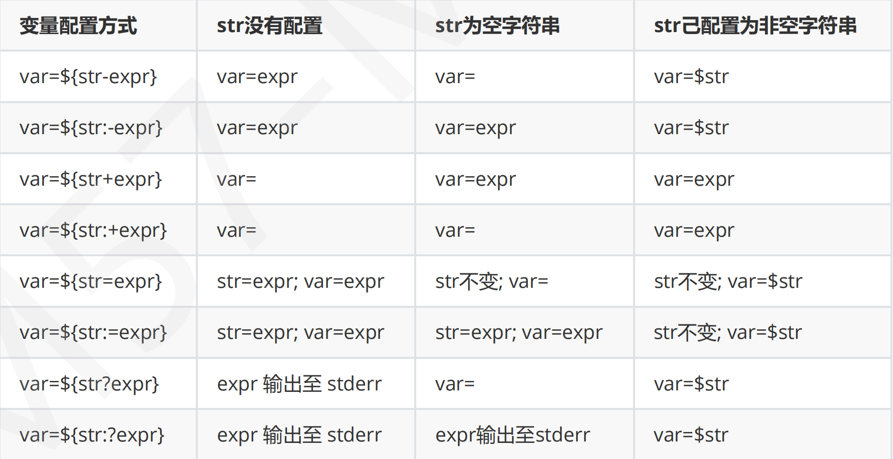

#### 5.8.1eval命令

eval命令将会首先扫描命令行进行所有的置换，然后再执行该命令。该命令适用于那些一次扫描无法实现其功能的变量,该命令对变量进行两次扫描

```bash
[root@ubuntu2204 ~]# CMD=whoami
[root@ubuntu2204 ~]# echo $CMD
whoami
[root@ubuntu2204 ~]# eval $CMD
root

[root@ubuntu2204 ~]# n1=6
[root@ubuntu2204 ~]# echo {1..$n1}
{1..6}
#两次展开
[root@ubuntu2204 ~]# eval echo {1..$n1}
1 2 3 4 5 6
[root@ubuntu2204 ~]# for i in `eval echo {1..$n1}`;do echo i=$i;done
i=1
i=2
i=3
i=4
i=5
i=6
```

#### 5.8.2变量间接引用

如果第一个变量的值是第二个变量的名字，从第一个变量引用第二个变量的值就称为间接变量引用

variable1的值是variable2，而variable2又是变量名，variable2的值为value，间接变量引用是指通过

variable1获得变量值value的行为

```
variable1=variable2
variable2=value
```

```bash
[root@ubuntu2204 ~]# var1=str
[root@ubuntu2204 ~]# str=abcd
[root@ubuntu2204 ~]# echo $var1
str
[root@ubuntu2204 ~]# echo \$$var1
$str
[root@ubuntu2204 ~]# eval echo \$$var1
abcd
```

bash Shell提供了两种格式实现间接变量引用

```bash
#方法1
#变量赋值
eval tempvar=\$$variable1
#显示值
eval echo \$$variable1
eval echo '$'$variable1
echo $tmpvar
#方法2
#变量赋值
tempvar=${!variable1}
#显示值
echo ${!variable1}
```


```bash
[root@ubuntu2204 ~]# ceo=name
[root@ubuntu2204 ~]# name=mage
[root@ubuntu2204 ~]# eval echo \$$ceo
mage
[root@ubuntu2204 ~]# eval tmp=\$$ceo
[root@ubuntu2204 ~]# echo $tmp
mage
[root@ubuntu2204 ~]# echo ${!ceo}
mage
[root@ubuntu2204 ~]# tmp2=${!ceo}
[root@ubuntu2204 ~]# echo $tmp2
mage
```


### 5.9案例

计算1+2+3+...+100 的结果

```bash
[root@ubuntu2204 ~]# sum=0;for i in {1..100};do let sum+=i;done ;echo $sum
sum=5050
[root@ubuntu2204 ~]# seq -s+ 100|bc
5050
[root@ubuntu2204 ~]# echo {1..100}|tr ' ' +|bc
5050
[root@ubuntu2204 ~]# seq 100|paste -sd +|bc
5050
```

100以内的奇数之和

```bash
[root@ubuntu2204 ~]# sum=0;for i in {1..100..2};do let sum+=i;done;echo sum=$sum
sum=2500
[root@ubuntu2204 ~]# seq -s+ 1 2 100| bc
2500
[root@ubuntu2204 ~]# echo {1..100..2}|tr ' ' + | bc
2500
```

九九乘法表

```bash
for j in {1..9};do
    for i in `seq $j`;do
        echo -e "\E[1;$[RANDOM%7+31]m${i}x${j}=$[i*j]\E[0m\t\c"
    done
    echo
done
echo
for((i=1;i<=9;i++));do
    for((j=1;j<=i;j++));do
       printf "\E[1;$[RANDOM%7+31]m${i}x${j}=$[i*j]\E[0m\t"
    done
   printf "\n"
done
```

倒状的九九乘法表

```bash
for i in {1..9};do
    for j in $(seq `echo $[10-$i]`);do
        echo -ne "${j}x`echo $[10-i]`=$(((10-i)*j))\t"
    done
    echo
done
```

要求将目录YYYY-MM-DD/中所有文件，移动到YYYY-MM/DD/下

```bash
[root@ubuntu2204 ~]# cat for_dir.sh 
#!/bin/bash
PDIR=/data/test
for i in {1..365};do 
  DIR=`date -d "-$i day" +%F`
  mkdir -pv $PDIR/$DIR
  cd $PDIR/$DIR
  for j in {1..10};do
  touch $RANDOM.log
  done
done
#2.将上面的目录移动到YYYY-MM/DD/下  
#!/bin/bash
#
DIR=/data/test
cd $DIR || {  echo 无法进入 $DIR;exit 1; }
for subdir in * ;do 
  YYYY_MM=`echo $subdir |cut -d"-" -f1,2`
  DD=`echo $subdir |cut -d"-" -f3`
  [ -d $YYYY_MM/$DD ] || mkdir -p $YYYY_MM/$DD &> /dev/null
  mv $subdir/*   $YYYY_MM/$DD
done
rm -rf $DIR/*-*-*
```

扫描一个网段：10.0.0.0/24判断此网段中主机在线状态，将在线的主机的IP打印出来

```bash
NET=10.0.0
for ID in {1..254}; do
   {
        ping -c1 -w1 $NET.$ID &>/dev/null && echo $NET.$ID is up | tee -a
host_list.log || echo $NET.$ID is down 
   }&
done
wait
```

生成10个随机数保存于数组中，并找出其最大值和最小值

```bash
[root@ubuntu2204 ~]# cat rand2.sh
#!/bin/bash
declare -a nums
for((i=0;i<10;i++));do
   nums[$i]=$RANDOM
   
done
min=`echo ${nums[*]} | tr ' ' '\n' | sort -n | head -n1`
max=`echo ${nums[*]} | tr ' ' '\n' | sort -nr | head -n1`
echo "All numbers are ${nums[*]}"
echo MAX $max
echo MIN $min
```


## 6.软件包管理

### 6.1rpm（了解）

只能管理一个包，包依赖不管，所以还是使用yum/dnf,apt包管理工具

```bash
-i|--install
-v|verbose #显示详细信息
-h #显示安装进度条
-q|--query
-a   #所有包

-U|--upgrade     #安装有旧版程序包，则“升级”，如果不存在旧版程序包，则“安装”
-F|--freshen     #安装有旧版程序包，则“升级”， 如果不存在旧版程序包，则不执行安装操作

#包校验，校验网上下载的包，然并卵
rpm -K|checksig rpmfile

#包更新日志
rpm -q --changelog packageName
```

```bash
#不需要依赖
[root@loaclhost Packages]$ rpm -ivh vsftpd-3.0.3-35.el8.x86_64.rpm

#需要依赖
[root@loaclhost Packages]$ rpm -ivh httpd-2.4.37-43.module_el8.5.0+1022+b541f3b1.x86_64.rpm

#查询安装脚本
[root@rocky86 h]# rpm -q --scripts postfix
#短路或，如果没有安装，就执行安装操作
[root@rocky86 v]# rpm -q vsftpd || rpm -ivh vsftpd-3.0.3-35.el8.x86_64.rpm
```

### 6.2yum和dnf

YUM: Yellowdog Update Modififier，rpm的前端程序，可解决软件包相关依赖性，可在多个库之间定位软件包，up2date的替代工具

CentOS 8 用dnf 代替了yum ，不过保留了和yum的兼容性，配置也是通用的

公共配置/etc/yum.conf

```bash
[root@rocky86 ~]# cat /etc/yum.conf 
[main]
gpgcheck=1 #安装包前要做包的合法和完整性校验,rpm -K
installonly_limit=3 #同时可以安装3个包，最小值为2，如设为0或1，为不限制
clean_requirements_on_remove=True #删除包时，是否将不再使用的包删除
best=True #升级时，自动选择安装最新版，即使缺少包的依赖
skip_if_unavailable=False #跳过不可用的
```

repo仓库配置/etc/yum.repos.d/*.repo

```bash
[repositoryID] 
name=Some name for this repository #仓库名称
baseurl=url://path/to/repository/ #仓库地址
mirrorlist=http://list/ #仓库地址列表，在这里写了多个 baseurl指向的地址，大概率不用写
enabled={1|0} #是否启用,默认值为1，启用
gpgcheck={1|0} #是否对包进行校验，默认值为1 
gpgkey={URL|file://FILENAME} #校验key的地址
enablegroups={1|0} #是否启用yum group,默认值为 1
failovermethod={roundrobin|priority} #有多个baseurl，此项决定访问规则，roundrobin 随机，priority:按顺序访问
cost=1000 #开销，或者是成本，YUM程序会根据此值来决定优先访问哪个源,默认为1000
```

国内源,源加速

https://developer.aliyun.com/mirror/rockylinux/?spm=a2c6h.25603864.0.0.1f73c3b3AnllsL

```
阿里云 https://mirrors.aliyun.com/rockylinux/
中国科学技术大学 http://mirrors.ustc.edu.cn/rocky/
南京大学 https://mirrors.nju.edu.cn/rocky/
上海交通大学 https://mirrors.sjtug.sjtu.edu.cn/rocky/
东软信息学院 http://mirrors.neusoft.edu.cn/rocky/
```

命令

```bash
#常用子命令
autoremove               #卸载包，同时卸载依赖
check-update             #检查可用更新
clean                     #清除本地缓存
downgrade                 #包降级
group                     #包组相关
help                     #显示帮助信息
history                   #显示history
info                     #显示包相关信息
install                   #包安装
list                     #列出所有包
makecache                 #重建缓存
reinstall                 #重装
remove                   #卸载
repolist                 #显示或解析repo源
search                   #包搜索，包括包名和描述
```

仓库缓存

```bash
[root@rocky86 ~]# yum clean all
[root@rocky86 ~]# yum makecache
```

```bash
#查看历史
[root@rocky86 yum.repos.d]# yum history
[root@rocky86 yum.repos.d]# yum history redis
```

```
yum localinstall|install [options] rpmfile1 [...] #安装本地RPM包
yum localupdate|update [options] rpmfile1 [...] #使用本地RPM包升级
```

#### **DNF** **介绍**

DNF，即 DaNdiFied，是新一代的RPM软件包管理器。DNF 发行日期是2015年5月11日，DNF 包管理

器采用Python 编写，发行许可为GPL v2，首先出现在Fedora 18 发行版中。在 RHEL 8.0 版本正式取代

了 YUM，DNF包管理器克服了YUM包管理器的一些瓶颈，提升了包括用户体验，内存占用，依赖分析，运行速度等；

```
#配置文件
/etc/dnf/dnf.conf
#仓库文件
/etc/yum.repos.d/ *.repo
#日志
/var/log/dnf.rpm.log 
/var/log/dnf.log
```

#### troubleshooting

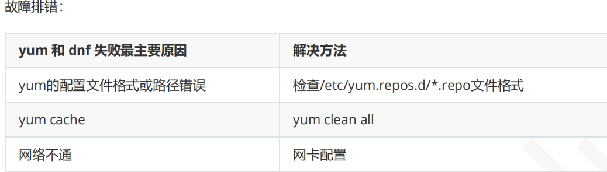


### 6.3实现私用yum仓库

服务端

```bash
#安装web服务
[root@rocky86 ~]# yum install -y httpd
#关闭防火墙
[root@rocky86 ~]# systemctl disabled --now firewalld.service
#开启web服务
[root@rocky86 ~]# systemctl enable --now httpd.service
#将阿里云的extras 源的相关数据下载到本地，给客户端使用
[root@rocky86 ~]# yum reposync --repoid=nju-extras --download-metadata -p /var/www/html/
#将本地光盘中的内容CP到web目录中，给客户端使用
[root@rocky86 ~]# mkdir /cdrom
[root@rocky86 ~]# mount /dev/sr0 /cdrom
[root@rocky86 ~]# cp -r /cdrom/BaseOS/* /var/www/html/BaseOS
```

客户端

```bash
[root@rocky86 ~]# cat /etc/yum.repos.d/private-extras.repo 
[private-extras]
name=private extras
baseurl=http://10.0.0.157/extras/
gpgcheck=0
[root@rocky86 ~]# cat /etc/yum.repos.d/private-baseos.repo 
[private-baseos]
name=private baseos
baseurl=http://10.0.0.157/BaseOS/
gpgcheck=0
```

### 6.4dpkg/apt(Ubuntu)

```bash
#查看是否已安装
root@ubuntu22:~# dpkg -V vim
root@ubuntu22:~# echo $?
0
root@ubuntu22:~# dpkg -V nginx
dpkg: package 'nginx' is not installed
root@ubuntu22:~# echo $?
1

#安装
root@ubuntu22:~# dpkg -i /cdrom/pool/restricted/f/firmware-sof/firmware-sof-signed_2.0-1ubuntu2_all.deb

#查询
root@ubuntu22:~# dpkg -l firmware-sof-signed

#卸载
root@ubuntu22:~# dpkg -r firmware-sof-signed
```

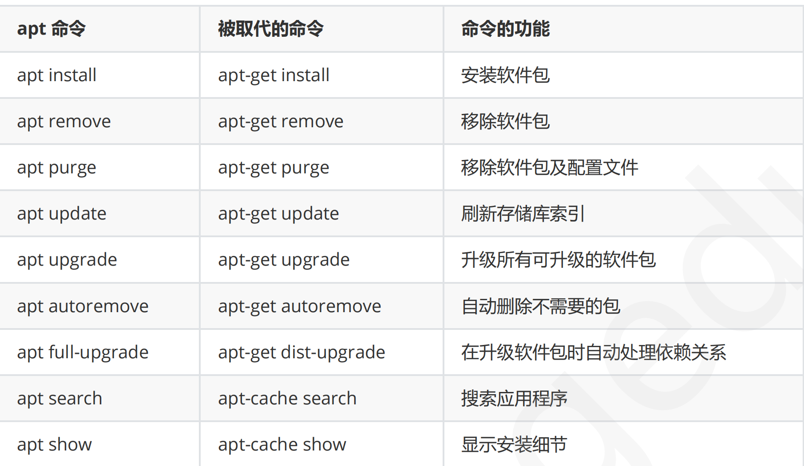

```go
apt purge删除软件包及配置文件
apt remove只删该软件
```

apt用法基本与yum一致

APT包索引配置文件

更新配置文件之后，要执行 apt update

```bash
/etc/apt/sources.list 
/etc/apt/sources.list.d/

deb URL section1 section2
#字段说明
deb #固定开头，表示是二进制包的仓库，如果deb-src开头，表示是源码库
URL #库所在的地址，可以是网络地址，也可以是本地镜像地址
section1 #Ubuntu版本的代号，可用 lsb_release -sc 命令查看，也可以用 cat 
/etc/os-release
section2 #软件分类，main完全自由软件 restricted不完全自由的软件，universe社区支持的软件，multiverse非自由软件
section1 #主仓
section1-backports #后备仓，该仓中的软件当前版本不一定支持
section1-security #修复仓，主要用来打补丁，有重大漏洞，需要在当前版本中修复时，会放此仓
section1-updates #非安全性更新仓，不影响系统安全的小版本迭代放此仓
section1-proposed #预更新仓，可理解为新版软件的测试放在此仓，测试一段时间后会移动到 updates仓或security仓，非专业人士勿用


root@ubuntu22:~# cat /etc/apt/sources.list
deb https://mirrors.aliyun.com/ubuntu jammy main restricted #表示使用主仓中的 main和 restricted 源
# deb-src https://mirrors.aliyun.com/ubuntu jammy main restricted
deb https://mirrors.aliyun.com/ubuntu jammy-updates main restricted
# deb-src https://mirrors.aliyun.com/ubuntu jammy-updates main restricted
```


```bash
#apt命令操作日志文件
/var/log/dpkg.log
```

### 6.5编译源码的项目工具

C、C++的源码编译：使用 make 项目管理器

configure脚本 --> Makefifile.in --> Makefile

相关开发工具：

autoconf: 生成confifigure脚本

automake：生成Makefifile.in

java的源码编译: 使用 maven


#### 6.5.1C语言源代码编译安装过程

```
./configure
make && make install
```

生产实践：基于最小化安装的系统建议安装下面相关依赖包

```
yum install gcc make gcc-c++ glibc glibc-devel pcre pcre-devel openssl openssl-devel systemd-devel zlib-devel vim lrzsz tree tmux lsof tcpdump wget net-tools iotop bc bzip2 zip unzip nfs-utils man-pages
```

#### 6.5.2**编译安装** nginx

```bash
#下载源码
[root@rocky86 src]# wget http://nginx.org/download/nginx-1.23.0.tar.gz

#解包
[root@rocky86 src]# tar xf nginx-1.23.0.tar.gz

#进入目录
[root@rocky86 src]# cd nginx-1.23.0/
[root@rocky86 nginx-1.23.0]# ls
auto CHANGES CHANGES.ru conf configure contrib html LICENSE man README 
src

#查看编译选项
[root@rocky86 nginx-1.23.0]# ./configure --help

#指定安装目录，开启ssl模块，开始编译
[root@rocky86 nginx-1.23.0]# ./configure --prefix=/lnmp/nginx --with-http_ssl_module
checking for OS
+ Linux 4.18.0-372.9.1.el8.x86_64 x86_64
checking for C compiler ... not found
./configure: error: C compiler cc is not found

#根据提示，安装C编译器
[root@rocky86 nginx-1.23.0]# yum install -y gcc

#再次编译
[root@rocky86 nginx-1.23.0]# ./configure --prefix=/lnmp/nginx --with-http_ssl_module
./configure: error: the HTTP rewrite module requires the PCRE library.
You can either disable the module by using --without-http_rewrite_module
option, or install the PCRE library into the system, or build the PCRE library
statically from the source with nginx by using --with-pcre=<path> option.

#搜索pcre包
[root@rocky86 nginx-1.23.0]# yum search pcre

#安装pcre包
[root@rocky86 nginx-1.23.0]# yum install -y pcre-devel

#再次编译
[root@rocky86 nginx-1.23.0]# ./configure --prefix=/lnmp/nginx --with-http_ssl_module
./configure: error: SSL modules require the OpenSSL library.
You can either do not enable the modules, or install the OpenSSL library
into the system, or build the OpenSSL library statically from the source
with nginx by using --with-openssl=<path> option.

#搜索openssl包
[root@rocky86 nginx-1.23.0]# yum search openssl

#安装openssl包
[root@rocky86 nginx-1.23.0]# yum install -y openssl-devel

#再次编译
[root@rocky86 nginx-1.23.0]# ./configure --prefix=/lnmp/nginx --with-http_ssl_module

#生成了Makefile文件
[root@rocky86 nginx-1.23.0]# ls
auto CHANGES CHANGES.ru conf configure contrib html LICENSE Makefile man 
objs README src

#执行make命令，先安装make
[root@rocky86 nginx-1.23.0]# make
bash: make: command not found...
Install package 'make' to provide command 'make'? [N/y] 

#执行make
[root@rocky86 nginx-1.23.0]# make

#执行make install
[root@rocky86 nginx-1.23.0]# make install

#查看
[root@rocky86 nginx-1.23.0]# tree /lnmp/

#启动nginx
[root@rocky86 nginx-1.23.0]# /lnmp/nginx/sbin/nginx

#查看版本信息
[root@rocky86 nginx-1.23.0]# /lnmp/nginx/sbin/nginx -V
nginx version: nginx/1.23.0
built by gcc 8.5.0 20210514 (Red Hat 8.5.0-10) (GCC) 
built with OpenSSL 1.1.1k FIPS 25 Mar 2021
TLS SNI support enabled
configure arguments: --prefix=/lnmp/nginx --with-http_ssl_module

#关闭防火墙 永久关闭 systemctl disable firewalld
[root@rocky86 nginx-1.23.0]# systemctl stop firewalld

#通过浏览器访问 http://10.0.0.158/
```


#### 6.5.3脚本安装nginx

```bash
#!/bin/bash
VERSION=1.23.0
wget http://nginx.org/download/nginx-${VERSION}.tar.gz
tar xf nginx-${VERSION}.tar.gz
cd nginx-${VERSION}
./configure --prefix=/lnmp/nginx --with-http_ssl_module
make && make install
if [ $? -eq 0 ];then
 /lnmp/nginx/sbin/nginx
 echo "<h1 style='color:red'>magedu</h1>" > /lnmp/nginx/html/index.html
else
 echo "nginx install fail"
fi
```

## 7.磁盘存储和文件系统

### 7.1磁盘结构

#### 7.1.1设备文件

Linux 哲学思想：一切皆文件

对于硬件设备，在Linux系统中，也是以文件的形式呈现出来的

**设备文件：关联至一个设备驱动程序，进而能够与之对应的硬件设备进行通信**

```bash
#设备文件          主设备号8，次设备号0
[root@ubuntu2204 ~]# ll /dev/sda
brw-rw---- 1 root disk 8, 0 Jul 29 08:51 /dev/sda
[root@ubuntu2204 ~]# ll /dev/tty0
crw--w---- 1 root tty 4, 0 Jul 29 08:51 /dev/tty0
```

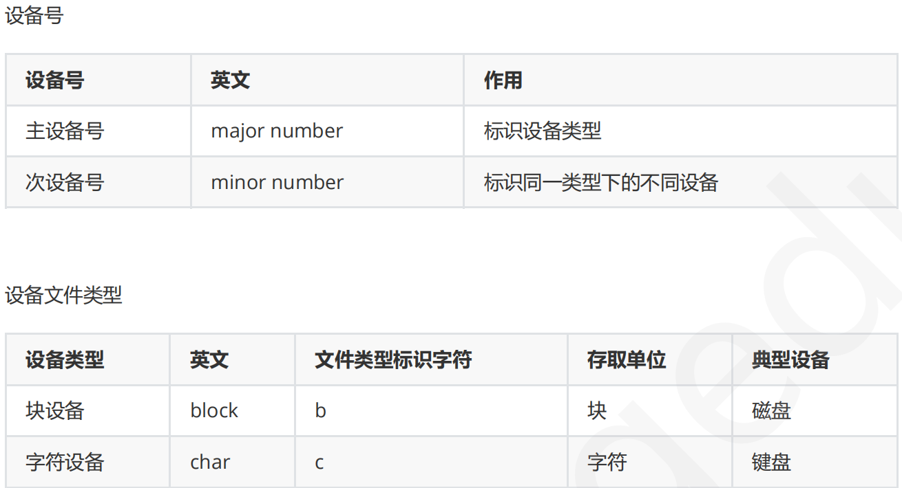

添加硬盘，不重启识别设备

此处是重新扫描 SCSI 总线来添加设备，之所以是 SCSI 总线，是因为我们添加的 SCSI 类型的硬盘

/sys 文件系统是和 /proc 一样，是一个内存文件系统 ，在磁盘上并没有对应的内容。通常称其为 sysfs, 

这是内核 “暴露” 给用户空间的一个 驱动模型层次结构的展现。因此，host0, host1 这些 “文件” 是内核

根据设备驱动程序 “发现” 的设备后在内存中创建的对应的 “文件” 和 "文件层次"。

```bash
#两种写法，1 循环遍历
[root@ubuntu2204 ~]# for i in `ls /sys/class/scsi_host/`;do echo '- - -' > 
/sys/class/scsi_host/$i/scan;done
#2 找出SPI总线对应的 host，只扫描该 host
[root@ubuntu2204 ~]# grep mptspi /sys/class/scsi_host/host*/proc_name
/sys/class/scsi_host/host32/proc_name:mptspi
[root@ubuntu2204 ~]# echo '- - -' > /sys/class/scsi_host/host32/scan
```

#### 7.1.2硬盘

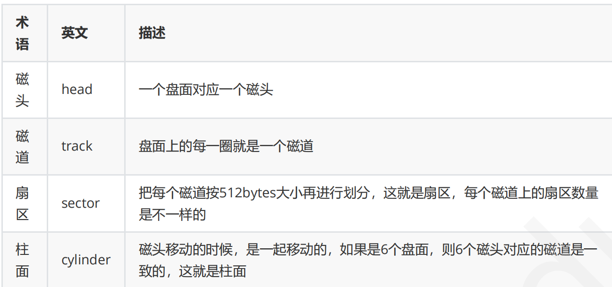

CentOS7之后，就只显示扇区信息了

查看CHS信息

```bash
[root@rocky86 ~]# fdisk -l /dev/sda
Disk /dev/sda: 200 GiB, 214748364800 bytes, 419430400 sectors
Units: sectors of 1 * 512 = 512 bytes
Sector size (logical/physical): 512 bytes / 512 bytes
I/O size (minimum/optimal): 512 bytes / 512 bytes
Disklabel type: dos
Disk identifier: 0x3475e2b0

Device     Boot   Start       End   Sectors Size Id Type
/dev/sda1 *       2048   2099199   2097152   1G 83 Linux
/dev/sda2       2099200 419430399 417331200 199G 8e Linux LVM
```

测速

```
[root@ubuntu2204 ~]# dd | hdparm -t /dev/sda 
/dev/sda:
 Timing buffered disk reads: 1854 MB in  3.00 seconds = 617.80 MB/sec
```

### 7.2管理存储

使用磁盘空间过程

1. 设备分区
2. 创建文件系统
3. 挂载新的文件系统

#### 7.2.1磁盘分区

优化I/O性能

实现磁盘空间配额限制

提高修复速度

隔离系统和程序

安装多个OS 

采用不同文件系统

**分区方式**

两种分区方式：MBR，GPT

##### MBR

MBR：Master Boot Record，1982年，使用32位表示扇区数，分区不超过2T

0磁道0扇区：512bytes

446bytes: boot loader 启动相关

64bytes：分区表，其中每16bytes标识一个分区

2bytes: 55AA，标识位

MBR分区中一块硬盘最多有4个主分区，也可以3主分区+1扩展(N个逻辑分区) 

MBR分区：主和扩展分区对应的1--4，/dev/sda3，逻辑分区从5开始，/dev/sda5

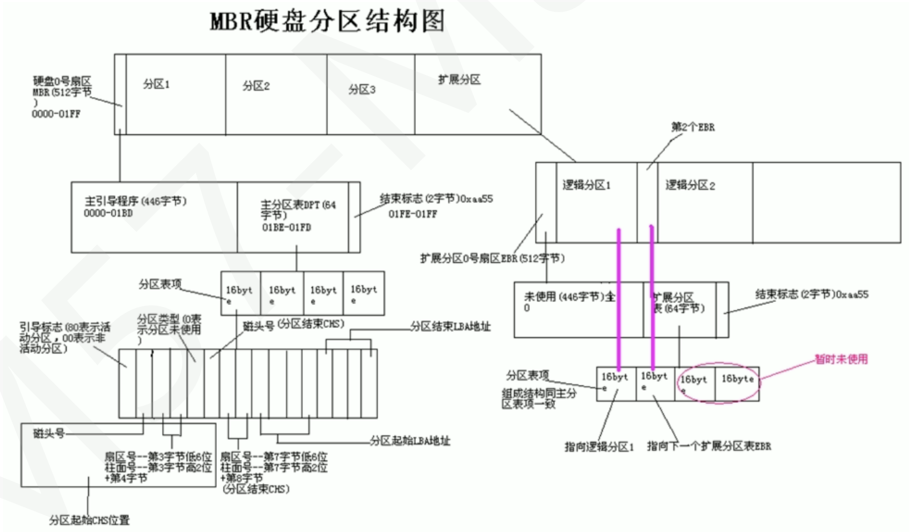

**为什么不能超过4个主分区？**

因为在0磁道0扇区上只留了64bytes空间存储分区表信息，而一个分区的关键信息要占用16个字节来存放

**为什么单分区不能超2T？**

一个分区信息占用16个字节，其中记录分区开始位置的空间为4个字节，记录分区结束位置的空间也是4个字节；

一个字节8位，4个字节是32位，则起始位最小值为32个0，结束位最大值为32个1，

所以一个分区，最大就是2的32次方个扇区，一个扇区512字节，则最大空间是 2^32*2^9 = 2^41 字节；

2^40是T，那2^41就表示不超过2T


备份MBR的分区表,并破坏后恢复

```bash
#备份MBR分区表
[root@rocky86 ~]# dd if=/dev/sda of=/data/dpt.img bs=1 count=64 skip=446
#64字节大小
[root@rocky86 ~]# ll /data/dpt.img 
-rw-r--r-- 1 root root 64 Jul 30 11:49 /tmp/dpt.img
#查看具体内容
[root@rocky86 ~]# hexdump -vC /data/dpt.img
#备份到远端
[root@rocky86 ~]# scp /tmp/dpt.img 10.0.0.157:
#破坏MBR分区表
[root@rocky86 ~]# dd if=/dev/zero of=/dev/sda bs=1 count=64 seek=446
64+0 records in
64+0 records out
64 bytes copied, 0.00248682 s, 25.7 kB/s
#再次查看前512字节
[root@rocky86 ~]# hexdump -vC -n 512 /dev/sda
#再次查看分区表，没有分区信息
[root@rocky86 ~]# fdisk -l /dev/sda
#但内存中还有相关信息
[root@rocky86 ~]# lsblk
#重启后无法进系统
[root@rocky86 ~]# reboot
#用光盘启动,进入Rescue mode,选第3项skip to shell
#配置网络
ifconfig ens160 10.0.0.158/24
#或 ip a 10.0.0.158/24 dev ens160
#从远端拿回分区表信息
scp 10.0.0.157:/root/dpt.img .
#恢复MBR分区表
dd if=dpt.img of=/dev/sda bs=1 seek=446
#重启
reboot
```

##### GPT

GPT：GUID（Globals Unique Identifiers） partition table 支持128个分区，使用64位，支持8Z

（ 512Byte/block ）64Z （ 4096Byte/block）

使用128位UUID(Universally Unique Identifier) 表示磁盘和分区，GPT分区表自动备份在头和尾两份， 并有CRC校验位

UEFI (Unified Extensible Firmware Interface 统一可扩展固件接口)硬件支持GPT，使得操作系统可以启动

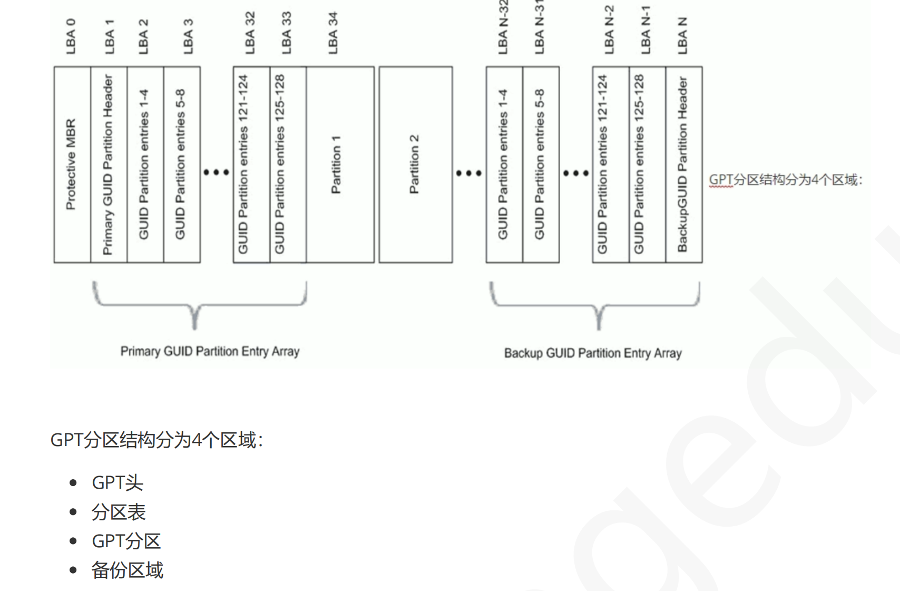


**BIOS和UEFI**

BIOS是固化在电脑主板上的程序，主要用于开机系统自检和引导操作系统。目前新式的电脑基本上都是UEFI启动

BIOS（Basic Input Output System 基本输入输出系统）主要完成系统硬件自检和引导操作系统，操作系统开始启动之后，BIOS的任务就完成了。系统硬件自检：如果系统硬件有故障，主板上的扬声器就会发出长短不同的“滴滴”音，可以简单的判断硬件故障，比如“1长1短”通常表示内存故障，“1长3短”通常表示显卡故障

BIOS在1975年就诞生了，使用汇编语言编写，当初只有16位，因此只能访问1M的内存，其中前640K称为基本内存，后384K内存留给开机和各类BIOS本身使用。BIOS只能识别到主引导记录（MBR）初始化的硬盘，最大支持2T的硬盘，4个主分区（逻辑分区中的扩展分区除外），而目前普遍实现了64位系统，传统的BIOS已经无法满足需求了，这时英特尔主导的EFI就诞生了

EFI（Extensible Firmware Interface）可扩展固件接口，是 Intel 为PC 固件的体系结构、接口和服务提出的建议标准。其主要目的是为了提供一组在 OS 加载之前（启动前）在所有平台上一致的、正确指定的启动服务，被看做是BIOS的继任者，或者理解为新版BIOS。

UEFI是由EFI1.10为基础发展起来的，它的所有者已不再是Intel，而是一个称作Unified EFI Form的国际组织 

UEFI(Unified Extensible Firmware Interface)统一的可扩展固件接口， 是一种详细描述类型接口的标准。UEFI相当于一个轻量化的操作系统，提供了硬件和操作系统之间的一个接口，提供了图形化的操作界面。最关键的是引入了GPT分区表，支持2T以上的硬盘，硬盘分区不受限制

##### BIOS和UEFI区别

BIOS采用了16位汇编语言编写，只能运行在实模式（内存寻址方式由16位段寄存器的内容乘以16(10H) 当做段基地址，加上16位偏移地址形成20位的物理地址）下，可访问的内存空间为1MB，只支持字符操作界面

UEFI采用32位或者64位的C语言编写，突破了实模式的限制，可以达到最大的寻址空间，支持图形操作界面，使用文件方式保存信息，支持GPT分区启动，适合和较新的系统和硬件的配合使用


##### 管理分区

```bash
#列出块设备
lsblk

#显示全路径
[root@rocky86 ~]# lsblk -p
#显示文件系统
[root@rocky86 ~]# lsblk -f
```

##### 创建分区

```bash
fdisk #管理MBR分区
gdisk #管理GPT分区
parted #高级分区操作，可以是交互或非交互方式
partprobe #重新设置内存中的内核分区表版本，适合于除了CentOS 6 以外的其它版本 5，7，8
```

##### parted 命令

注意：parted 的操作都是实时生效的，没有交互式确认

```bash
#显示所有分区信息
[root@ubuntu2204 ~]# parted -l

#显示指定磁盘设备分区信息,此磁盘无分区记录，新磁盘
[root@ubuntu2204 ~]# parted /dev/sdb print

#在磁盘上创建GPT分区
[root@ubuntu2204 ~]# parted /dev/sdb mklabel gpt

#再次查看
[root@ubuntu2204 ~]# parted /dev/sdb print

#创建分区
[root@ubuntu2204 ~]# parted /dev/sdb mkpart primary 1 1001

#再次查看
[root@ubuntu2204 ~]# parted /dev/sdb print

#再次创建
[root@ubuntu2204 ~]# parted /dev/sdb mkpart primary 1002 1102

#再次查看
[root@ubuntu2204 ~]# parted /dev/sdb print
Model: VMware, VMware Virtual S (scsi)
Disk /dev/sdb: 21.5GB
Sector size (logical/physical): 512B/512B
Partition Table: gpt
Disk Flags: 

Number Start   End     Size   File system Name     Flags
1     1049kB 1001MB 1000MB               primary
2     1002MB 1102MB  99.6MB               primary


#删除
[root@ubuntu2204 ~]# parted /dev/sdb rm 2
Information: You may need to update /etc/fstab.
#再次查看
[root@ubuntu2204 ~]# parted /dev/sdb print                                
Model: VMware, VMware Virtual S (scsi)
Disk /dev/sdb: 21.5GB
Sector size (logical/physical): 512B/512B
Partition Table: gpt

Disk Flags: 
Number Start   End     Size   File system Name     Flags
1     1049kB 1001MB  1000MB               primary
```

##### 分区工具fdisk和gdisk

```bash
#常用子命令
p #输出分区列表
t #更改分区类型
n #创建新分区
d #删除分区
v #校验分区
u #转换单位
w #保存并退出
q #不保存并退出
```

显示分区列表

```bash
#显示所有设备
[root@rocky86 ~]# fdisk -l
#显示指定设备
[root@rocky86 ~]# fdisk -l /dev/sda
```

显示指定列

```bash
[root@rocky86 ~]# fdisk -lo id,size,type /dev/sda
Disk /dev/sda: 200 GiB, 214748364800 bytes, 419430400 sectors
Units: sectors of 1 * 512 = 512 bytes
Sector size (logical/physical): 512 bytes / 512 bytes
I/O size (minimum/optimal): 512 bytes / 512 bytes
Disklabel type: dos

Disk identifier: 0x5b8e1003
Id Size Type
83   1G Linux
8e 199G Linux LVM
```

查看内核是否已经识别新的分区

```bash
[root@rocky86 ~]# cat /proc/partitions
```

CentOS 7,8 同步分区表

```bash
[root@rocky86 ~]# partprobe
```

非交互式创建分区

```bash
[root@rocky86 ~]# echo -e 'n\np\n\n\n+1G\nw' | fdisk /dev/sdb
[root@rocky86 ~]# fdisk /dev/sdb <<EOF 
n
p
+1G
w
EOF

[root@rocky86 ~]# lsblk /dev/sdb
NAME   MAJ:MIN RM SIZE RO TYPE MOUNTPOINT
sdb      8:16   0 20G  0 disk 
├─sdb1   8:17   0   1G  0 part 
└─sdb2   8:18   0   1G  0 part
```

交互式创建

```bash
fdisk /dev/sdb
```

#### 7.2.2文件系统

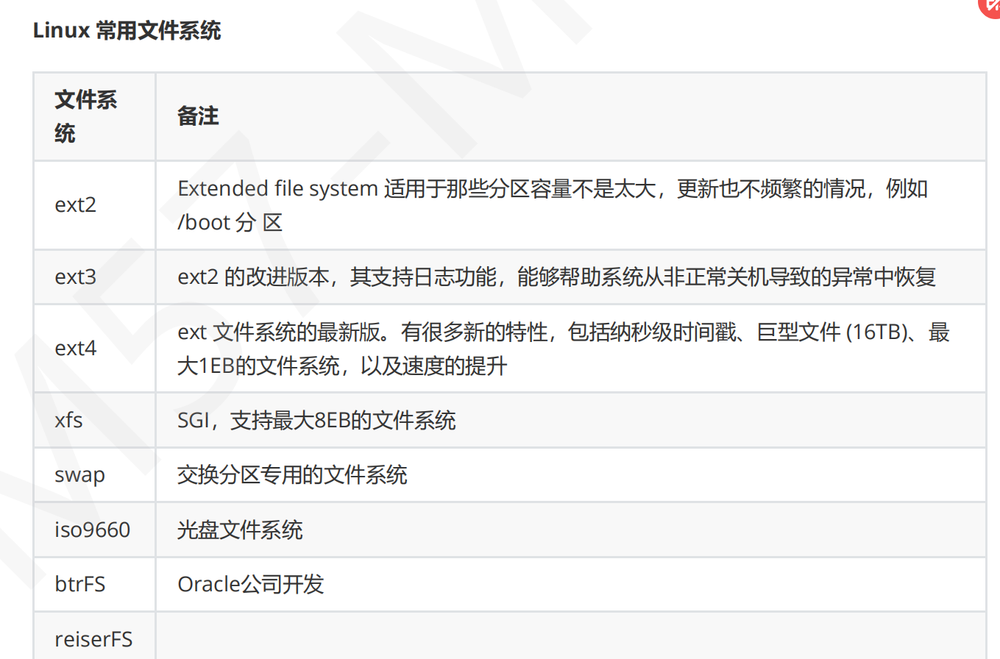

```bash
#查看当前内核支持的文件系统
[root@rocky86 ~]# ls /lib/modules/`uname -r`/kernel/fs

root@ubuntu22:~# ls /lib/modules/`uname -r`/kernel/fs

#查看当前系统可用的文件系统：
[root@rocky86 ~]# cat /proc/filesystems

root@ubuntu22:~# cat /proc/filesystems
```

创建文件系统

```bash
[root@ubuntu2204 ~]# mkfs.ext4 /dev/sdc1
#创建xfs文件系统
[root@ubuntu2204 ~]# mkfs.xfs /dev/sdc2
#查看指定设备
[root@ubuntu2204 ~]# lsblk -f /dev/sdc
NAME   FSTYPE FSVER LABEL UUID                                 FSAVAIL FSUSE% 
MOUNTPOINTS
sdc                                                                           
├─sdc1 ext4   1.0         e55d9611-63c5-43dd-a6b3-fe6409778834                
└─sdc2 xfs                b2d34757-f593-46ce-a8e6-d1009eb71fdc

#查看所有设备
[root@rocky86 ~]# lsblk -f

#df 只能查看己挂载的设备
[root@ubuntu2204 ~]# df -l
```

```bash
#显示所有，查看块设备属性信息
[root@ubuntu2204 ~]# blkid
/dev/sdc2: UUID="b2d34757-f593-46ce-a8e6-d1009eb71fdc" BLOCK_SIZE="512"
......

e2label
管理ext系列文件系统的LABEL

findfs
查找分区

tune2fs
重新设定ext系列文件系统可调整参数的值

dumpe2fs
显示ext文件系统信息，将磁盘块分组管理

xfs_info
显示已挂载的 xfs 文件系统信息
[root@ubuntu2204 ~]# xfs_info /dev/sdc2
```

##### **文件系统检测和修复**

文件系统故障常发生于死机或者非正常关机之后，挂载为文件系统标记为“no clean”

**注意：一定不要在挂载状态下执行下面命令修复**

```bash
fsck
#常用选项
-a #自动修复
-r #交互式修复错误

[root@ubuntu2204 ~]# fsck.ext4 /dev/sdc1 
e2fsck 1.46.5 (30-Dec-2021)
/dev/sdc1: clean, 11/131072 files, 26156/524288 blocks

[root@ubuntu2204 ~]# fsck -t ext4 /dev/sdc1 
fsck from util-linux 2.37.2
e2fsck 1.46.5 (30-Dec-2021)
/dev/sdc1: clean, 11/131072 files, 26156/524288 blocks

e2fsck
ext系列文件专用的检测修复工具

xfs_repair
xfs文件系统专用检测修复工具
```

#### 7.2.3挂载

挂载：将额外文件系统与根文件系统某现存的目录建立起关联关系，进而使得此目录做为其它文件访问入口的行为

**mountpoint**：挂载点目录必须事先存在，建议使用空目录

**挂载规则**

一个挂载点同一时间只能挂载一个设备

一个挂载点同一时间挂载了多个设备，只能看到最后一个设备的数据，其它设备上的数据将被隐藏

一个设备可以同时挂载到多个挂载点

通常挂载点一般是已存在空的目录

```bash
[root@ubuntu2204 ~]# mkdir /sdc{1,2}
[root@ubuntu2204 ~]# mount /dev/sdc1 /sdc1
#只读挂载
[root@ubuntu2204 ~]# mount --source /dev/sdc2 -o ro /sdc2
[root@ubuntu2204 ~]# lsblk /dev/sdc -f
NAME   FSTYPE FSVER LABEL UUID                                 FSAVAIL FSUSE% 
MOUNTPOINTS
sdc                                                                           
├─sdc1 ext4   1.0         e55d9611-63c5-43dd-a6b3-fe6409778834    1.8G     0% 
/sdc1
└─sdc2 xfs               b2d34757-f593-46ce-a8e6-d1009eb71fdc     3G     0% 
/sdc2
#写测试
[root@ubuntu2204 ~]# cp /etc/fstab /sdc1/
[root@ubuntu2204 ~]# cp /etc/fstab /sdc2/
cp: cannot create regular file '/sdc2/fstab': Read-only file system


#设备卸载
[root@ubuntu2204 ~]# umount /dev/sdc1
#挂载点卸载
[root@ubuntu2204 ~]# umount /sdc2
#再次查看挂载情况
[root@ubuntu2204 ~]# lsblk /dev/sdc -f
NAME   FSTYPE FSVER LABEL UUID                                 FSAVAIL FSUSE% 
MOUNTPOINTS
sdc                                                                           
├─sdc1 ext4   1.0         e55d9611-63c5-43dd-a6b3-fe6409778834                
└─sdc2 xfs               b2d34757-f593-46ce-a8e6-d1009eb71fdc


#查看挂载
mount #通过mount命令查看
cat /etc/mtab #通过查看/etc/mtab文件显示当前已挂载的所有设备
cat /proc/mounts   #查看内核追踪到的已挂载的所有设备

#查看正在访问指定文件系统的进程
lsof MOUNT_POINT
```

##### 持久挂载(*)

**将挂载保存到 /etc/fstab 中可以下次开机时，自动启用挂载**

转储频率：0 不做备份; 1 每天转储; 2 每隔一天转储

fsck检查的文件系统的顺序：0 不自检 ; 1 首先自检，一般只有rootfs才用；2 非rootfs使用 0

```bash
1.获取分区的 UUID
blkid

2.创建挂载点
mkdir -p /mnt/mynewpartition

3.编辑 /etc/fstab 文件，添加新条目
UUID=your-uuid-here  /mnt/mynewpartition  ext4  defaults  0  2
#0：这表示是否使用 dump 备份工具备份这个文件系统。0 表示不备份。
#2：这是 fsck（文件系统一致性检查）的检查顺序。根文件系统应该设置为 1，其他分区可以设置为 2 或更高，0 表示不检查。

4.使用 mount -a 命令尝试挂载所有条目

5.使用 df -h 或 mount 命令来检查新的分区是否已经正确挂载

```

如果 /etc/fstab 中的分区UUID出错，则会无法进系统

解决方案：

centos7,centos8 会自动进入 emergency 模式，输入root密码后，再修改 /etc/fstab，然后重启即可

centos6 中除了修改为正确之外，还可以将/etc/fstab 文件中错误行最后一项设置为0，即不检查


修改了/etc/fstab 文件中的挂载规则，无法通过 mount -a 生效，要重新执行挂载

```bash
mount -o remount MOUNTPOINT
```

#### 7.2.4交换分区

**swap** **介绍**

swap交换分区是系统RAM的补充，swap 分区支持虚拟内存。当没有足够的 RAM 保存系统处理的数据时会将数据写入 swap 分区，当系统缺乏 swap 空间时，内核会因 RAM 内存耗尽而终止进程。

配置过多 swap 空间会造成存储设备处于分配状态但闲置，造成浪费，过多 swap 空间还会掩盖内存泄露

注意：为优化性能，可以将swap 分布存放，或高性能磁盘存放

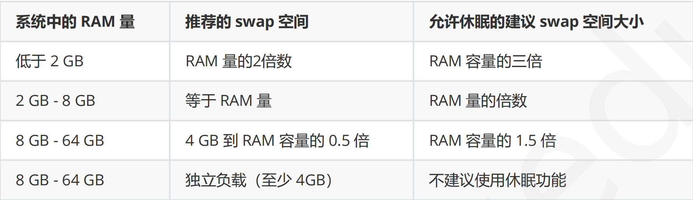

```bash
[root@ubuntu2204 ~]# free -h
               total       used       free     shared buff/cache   available
Mem:           1.9Gi       347Mi       896Mi       1.0Mi       697Mi       1.4Gi
Swap:          2.0Gi         0B       2.0Gi

[root@ubuntu2204 ~]# dd if=/dev/zero of=/dev/null bs=30G count=1
dd: memory exhausted by input buffer of size 32212254720 bytes (30 GiB)
#这里文件大小虽然超过了，但有SWAP空间，所以可以执行成功
[root@ubuntu2204 ~]# dd if=/dev/zero of=/dev/null bs=3G count=1
0+1 records in
0+1 records out
2147479552 bytes (2.1 GB, 2.0 GiB) copied, 7.40064 s, 290 MB/s

#启用禁用
swapon
swapoff
```

创建swap分区

```bash
1.列出磁盘
lsblk
sudo fdisk -l

2.启动 fdisk
sudo fdisk /dev/sdb

3.创建新分区：
输入 n 来创建一个新的分区。根据提示选择主分区或扩展分区，并指定分区号、起始扇区和结束扇区/大小。你可以按回车键接受默认值，或者指定具体的数值。

4.设置分区类型为 SWAP：
输入 t 来改变分区类型，然后输入你刚刚创建的分区号。接着，输入 82 将分区类型设置为 Linux swap (如果使用 GPT 分区表，可以使用 8200)。

5.写入更改并退出：
输入 w 以保存更改并退出 fdisk。

6.格式化为 SWAP： 使用 mkswap 命令来设置新分区为交换空间。
mkswap /dev/sdbX  # 将 sdbX 替换为你的实际分区标识符

7.sudo swapon /dev/sdbX  # 将 sdbX 替换为你的实际分区标识符

8.free -h

持久化：
9.blkid /dev/sdbX
10.vim /etc/fstab
11.使用 mount -a 或 swapon -a 命令尝试挂载所有条目
12.使用 free -m 或 swapon --show 来检查SWAP分区是否已经正确启用
```

查看swap分区

可以指定swap分区0到32767的优先级，值越大优先级越高

如果用户没有指定，那么核心会自动给swap指定一个优先级，这个优先级从-1开始，每加入一个新的没有用户指定优先级的swap，会给这个优先级减一

Priority越大，优先级越高，会被优先使用

```bash
[root@ubuntu2204 ~]# swapon -s
Filename Type Size Used Priority
/swap.img                               file 2097148 0 -2
/dev/sdc3                               partition 2097148 0 -3

[root@ubuntu2204 ~]# cat /proc/swaps 
Filename Type Size Used Priority
/swap.img                               file 2097148 0 -2
/dev/sdc3                               partition 2097148 0 -3


/etc/fstab
/dev/sdc3   none   swap   sw,pri=123  0  0
```

以文件作为swap分区

```bash
#创建文件
[root@rocky86 ~]# dd if=/dev/zero of=/swapfile bs=1G count=2
2+0 records in
2+0 records out
2147483648 bytes (2.1 GB, 2.0 GiB) copied, 4.72333 s, 455 MB/s

#创建文件系统
[root@rocky86 ~]# mkswap /swapfile 
mkswap: /swapfile: insecure permissions 0644, 0600 suggested.
Setting up swapspace version 1, size = 2 GiB (2147479552 bytes)
no label, UUID=b1edc27b-2f23-4991-b211-0d2c4bd6a85f
#查看
[root@rocky86 ~]# blkid /swapfile
/swapfile: UUID="b1edc27b-2f23-4991-b211-0d2c4bd6a85f" TYPE="swap"
#修改/etc/fstab，添加行
/swapfile   none   swap   sw  0  0
#启用
[root@ubuntu2204 ~]# swapon /swapfile
swapon: /swapfile: insecure permissions 0644, 0600 suggested.
#查看
[root@ubuntu2204 ~]# swapon -s
Filename Type Size Used Priority
/swap.img                               file 2097148 0 -2
/dev/sdc3                               partition 2097148 3352 123
/swapfile                               file 2097148 0 -3
```

**永久禁用**swap

```bash
#删除swap行
[root@ubuntu2204 ~]# sed -i.bak '/swap/d' /etc/fstab
#或注释swap行
[root@ubuntu2204 ~]# sed -i.bak '/swap/s@^@#@' /etc/fstab
#禁用swap，由于修改了配置文件，所以重启也不会有SWAP
[root@ubuntu2204 ~]# swapoff -a
```

**swap的使用策略**

/proc/sys/vm/swappiness 的值决定了当内存占用达到一定的百分比时，会启用swap分区的空间

```bash
#说明：CentOS7和8默认值为30，内存在使用到100-30=70%的时候，就开始出现有交换分区的使用
[root@centos8 ~]# cat /proc/sys/vm/swappiness

#修改
[root@rocky86 ~]# vim /etc/sysctl.conf
vm.swappiness=0
#生效
[root@rocky86 ~]# sysctl -p
vm.swappiness = 0
```

7.2.5移动介质

挂载意味着使外来的文件系统看起来如同是主目录树的一部分，所有移动介质也需要挂载，挂载点通常在/media 或/mnt下

访问前，介质必须被挂载

摘除时，介质必须被卸载

按照默认设置，非根用户只能挂载某些设备（光盘、DVD、软盘、USB等等）

### 7.3磁盘常见工具

**文件系统查看工具** df

```bash
df [OPTION]... [FILE]...
#常用选项
-a|--all             #显示所有
-B|--block-size=SIZE #显示时指定块大小
--direct         #将挂载点那一列标题显示为文件
-h|--human-readable #以方便阅读的方式显示
-H|--si             #以 1000为单位，而不是1024
-i|--inodes         #显示inode 信息而非块使用量
-k                   #同 --block-size=1K
-l|--local             #只显示本机的文件系统
--output[=FIELD_LIST]   #只显示指定字段
-P|--portability       #以Posix兼容的格式输出
--total           #最后加一行汇总数据
-t|--type=TYPE       #根据文件系统类型过滤
-T|--print-type     #显示文件系统类型
-x|--exclude-type=TYPE #根据文件系统类型反向过滤
```

**目录统计工具** **du**

**文件工具** **dd**

```bash
#常用格式
dd if=/PATH/FROM/SRC of=/PATH/TO/DEST  bs=N count=N

if=file #从所命名文件读取而不是从标准输入
of=file #写到所命名的文件而不是到标准输出
bs=size #指定块大小（既是是ibs也是obs)
count=n         #复制n个bs
```

### 7.4RAID磁盘阵列

RAID功能实现

提高IO能力，磁盘并行读写

提高耐用性，磁盘冗余算法来实现

RAID实现的方式

外接式磁盘阵列：通过扩展卡提供适配能力

内接式RAID：主板集成RAID控制器，安装OS前在BIOS里配置

软件RAID：通过OS实现，比如：群晖的NA

#### 7.4.1 RAID级别

参考链接: https://zh.wikipedia.org/wiki/RAID

**RAID-0**


RAID 0的速度是最快的。 但是RAID 0既没有冗余功能，也不具备容错能力，如果一个磁盘（物理)损坏，所有数据都会丢失

最少磁盘数：1+

**RAID-1**

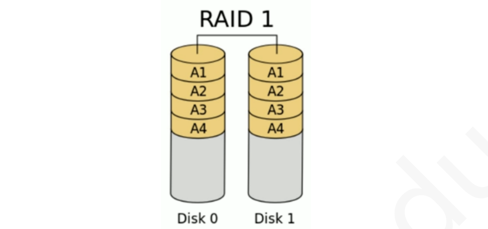

两组以上的N个磁盘相互作镜像，在一些多线程操作系统中能有很好的读取速度，理论上读取速度等于硬盘数量的倍数，与RAID 0相同。另外写入速度有微小的降低。

磁盘利用率 50% 

有冗余能力

最少磁盘数：2+

**RAID-5**

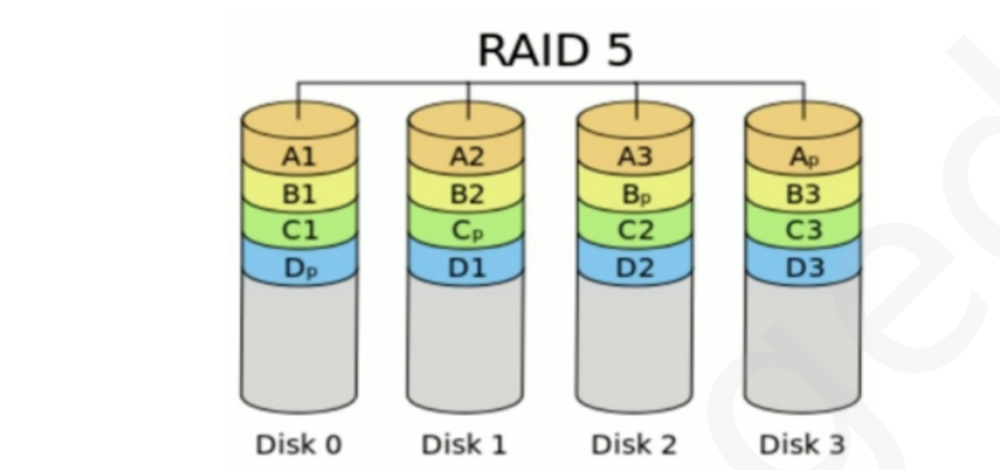

读性能接近RAID 0，写性能稍差但比RAID 1好。

有容错能力：允许最多1块磁盘损坏

最少磁盘数：3, 3+

**RAID-6**


双份校验位,算法更复杂

写性能更差：由于需要计算和维护两个奇偶校验值。

有容错能力：允许最多2块磁盘损坏

最少磁盘数：4, 4+

**RAID-10**


结合了RAID 0的速度优势和RAID 1的冗余特性。

先组raid1再组raid0

raid-01就是反着来

**RAID-50**

先组raid5再组raid0

**RAID-60**

先组RAID6再组RAID0

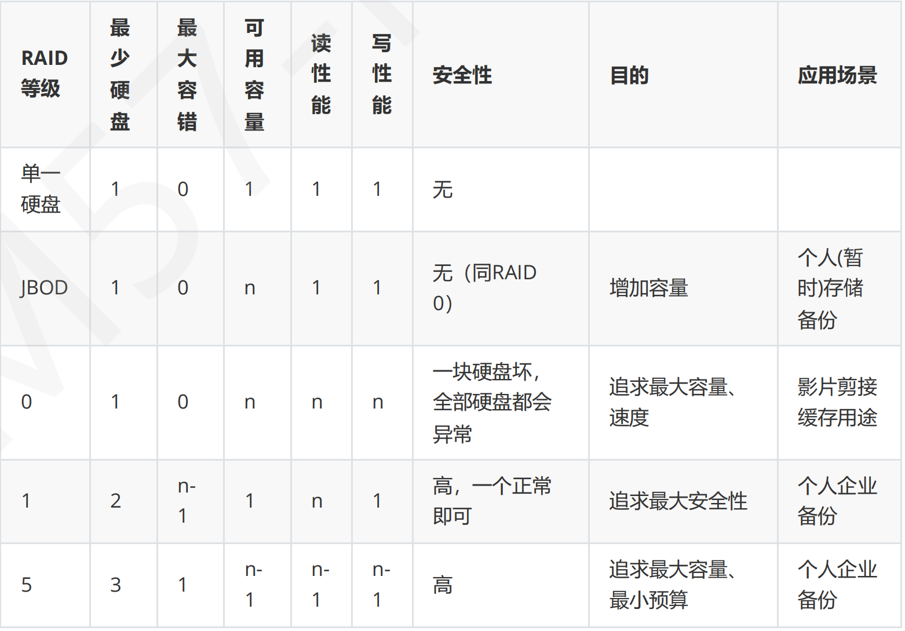

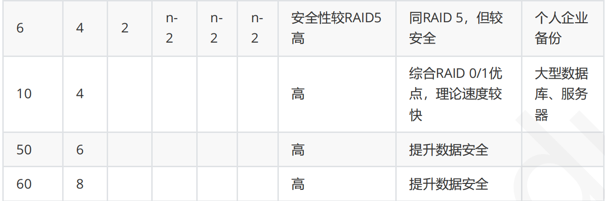

#### 7.4.2实现软raid

mdadm工具：为软RAID提供管理界面，为空余磁盘添加冗余，结合内核中的md(multi devices) RAID

设备可命名为/dev/md0、/dev/md1、/dev/md2、/dev/md3等

mdadm：模式化的工具,支持的RAID级别：LINEAR, RAID0, RAID1, RAID4, RAID5, RAID6, RAID10

```bash
mdadm [mode] <raiddevice> [options] <component-devices>
#常用选项
#mode
-C|--create #创建
-A|--assemble #装配
-F|--monitor #监控
-D|--detail #显示raid的详细信息
-f #标记指定磁盘为损坏
-r #移除磁盘
-a #添加磁盘

#options
-C
-n N #使用N个块设备来创建此RAID
-l N #指明要创建的RAID的级别
-a {yes|no} #自动创建目标RAID设备的设备文件
-c CHUNK_SIZE #指明块大小,单位k
-x N #指明空闲盘的个数
```

```bash
#使用mdadm创建并定义RAID设备
mdadm -C /dev/md0 -a yes -l 5 -n 3 -x 1 /dev/sd{b,c,d,e}1
#用文件系统对每个RAID设备进行格式化
mkfs.xfs /dev/md0
#使用mdadm检查RAID设备的状况
mdadm --detail|D /dev/md0
#增加新的成员
mdadm -G /dev/md0 -n4  -a /dev/sdf1
#模拟磁盘故障
mdadm /dev/md0  -f /dev/sda1
#移除磁盘
mdadm   /dev/md0 -r /dev/sda1
#在备用驱动器上重建分区
mdadm /dev/md0  -a /dev/sda1
#系统日志信息
cat /proc/mdstat
#生成配置文件
mdadm -D -s >> /etc/mdadm.conf
#停止设备
mdadm -S /dev/md0
#激活设备
mdadm -A -s /dev/md0
#强制启动
mdadm -R /dev/md0
#删除raid信息
dadm --zero-superblock /dev/sdb1
```

### 7.5逻辑卷管理

**实现过程**

将设备指定为物理卷

用一个或者多个物理卷来创建一个卷组，物理卷是用固定大小的物理区域（Physical Extent，PE）来定义的

在物理卷上创建的逻辑卷， 是由物理区域（PE）组成

可以在逻辑卷上创建文件系统并挂载


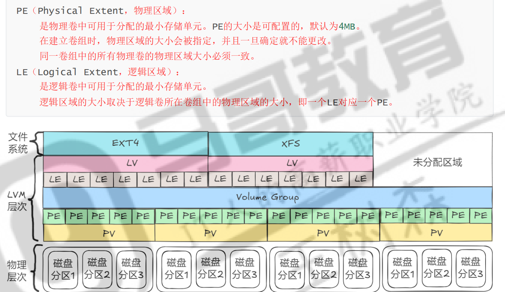

第一个逻辑卷对应设备名：/dev/dm-# 

dm: device mapper，将一个或多个底层块设备组织成一个逻辑设备的模块

软链接：

/dev/mapper/VG_NAME-LV_NAME 

/dev/VG_NAME/LV_NAME

```bash
[root@rocky86 ~]# ll /dev/mapper/rl* 
lrwxrwxrwx 1 root root 7 Aug  1 09:38 /dev/mapper/rl-home -> ../dm-2
lrwxrwxrwx 1 root root 7 Aug  1 09:38 /dev/mapper/rl-root -> ../dm-0
lrwxrwxrwx 1 root root 7 Aug  1 09:38 /dev/mapper/rl-swap -> ../dm-1

[root@ubuntu2204 ~]# ll /dev/mapper/*lv
lrwxrwxrwx 1 root root 7 May 14 12:11 /dev/mapper/ubuntu--vg-ubuntu--lv -> 
../dm-0
```

#### 7.5.1实现逻辑卷

```bash
[root@ubuntu2204 ~]# apt install lvm2
```

pv管理工具

将块设备创建为物理卷，**本质上就是给块设备打一个标签**，

块设备数量和物理卷数量是对应的，有几个块设备，就可以创建几个物理卷，

块设备容量大小不限，可以跨分区。

```bash
pvs #简要pv信息显示
pvdisplay #显示详细信息

pvcreate /dev/DEVICE  #创建pv
pvremove /dev/DEVICE  #删除pv
```

```bash
#创建pv
[root@ubuntu2204 ~]# pvcreate /dev/sdb1 /dev/sdc 
 Physical volume "/dev/sdb1" successfully created.
 Physical volume "/dev/sdc" successfully created.
  
#查看
[root@ubuntu2204 ~]# pvs
 PV         VG       Fmt Attr   PSize      PFree 
 /dev/sda3 ubuntu-vg lvm2 a-- <198.00g     99.00g
 /dev/sdb1           lvm2 ---    5.00g     5.00g
 /dev/sdc             lvm2 ---   20.00g    20.00g
 
 #查看指定PV
[root@ubuntu2204 ~]# pvdisplay /dev/sdc 
  "/dev/sdc" is a new physical volume of "20.00 GiB"
  --- NEW Physical volume ---
 PV Name               /dev/sdc
 VG Name               
 PV Size               20.00 GiB
 Allocatable           NO
 PE Size               0   
 Total PE              0
 Free PE               0
 Allocated PE          0
 PV UUID               sNIAGt-c68i-k8Bs-6Xnl-gpu9-hRDx-iffwbN
  
#移除
[root@ubuntu2204 ~]# pvremove /dev/sdc
 Labels on physical volume "/dev/sdc" successfully wiped.
```

vg管理工具

```bash
vgs
vgdisplay
```

```bash
#创建vg，-s指定PE大小
[root@ubuntu2204 ~]# vgcreate -s 16M testvg /dev/sdb1 /dev/sdc
 Volume group "testvg" successfully created
  
  
#查看vg
[root@ubuntu2204 ~]# vgs
 VG        #PV #LV #SN Attr   VSize   VFree  
 testvg      2   0   0 wz--n- <24.97g <24.97g
 ubuntu-vg   1   1   0 wz--n- <198.00g  99.00g
#查看vg 
[root@ubuntu2204 ~]# vgdisplay testvg 
  --- Volume group ---
 VG Name               testvg
 System ID             
 Format               lvm2
 Metadata Areas        2
 Metadata Sequence No  1
 VG Access             read/write
 VG Status             resizable
 MAX LV                0
 Cur LV                0
 Open LV               0
 Max PV                0
 Cur PV                2
 Act PV                2
 VG Size               <24.97 GiB #总大小
 PE Size               16.00 MiB #PE大小
 Total PE              1598 #总PE数量
 Alloc PE / Size       0 / 0   #己分配的PE
 Free PE / Size       1598 / <24.97 GiB #可用PE
 VG UUID               lm1nmp-0SS1-icze-jnWP-UHhb-VYma-AxOaJW
```

lv管理工具

```bash
lvs
Lvdisplay
```

```bash
lvcreate {-L N[mMgGtT]|-l N} -n NAME VolumeGroup
-L|--size N[mMgGtT] #指定大小 
-l|--extents N #指定PE个数,也可用百分比
-n Name #逻辑卷名称

fsadm [options] resize device [new_size[BKMGTEP]]
resize2fs [-f] [-F] [-M] [-P] [-p] lvname #只支持ext系列文件系统
xfs_growfs /mountpoint #只支持xfs 文件系统
```

```bash
#从 testvg 中创建lv1,大小为 100个PE
[root@ubuntu2204 ~]# lvcreate -l 100 -n lv1 testvg
 Logical volume "lv1" created.
#创建lv2，大小为5G
[root@ubuntu2204 ~]# lvcreate -L 5G -n lv2 testvg
 Logical volume "lv2" created.
#创建lv3,大小为剩下可用PE数量的 20%
[root@ubuntu2204 ~]# lvcreate -l 20%free -n lv3 testvg
 Logical volume "lv3" created.
  
  
#创建lv4,大小为指定vg的10%
[root@ubuntu2204 ~]# lvcreate -l 10%VG -n lv4 testvg
 Logical volume "lv4" created.
 
 #查看
[root@ubuntu2204 ~]# lvs /dev/testvg/lv*

#查看  
[root@ubuntu2204 ~]# lvdisplay /dev/testvg/lv1
```

**逻辑卷的使用跟硬盘分区使用一样，要先创建文件系统，再进行挂载**

#### 7.5.2扩展和缩减逻辑卷

**在线扩展逻辑卷**

扩展逻辑卷之前，要先保证卷组上还有空间

两步实现，先扩展逻辑卷，再扩容文件系统

```bash
#第一步实现逻辑卷的空间扩展
lvextend -L [+]N[mMgGtT] /dev/VG_NAME/LV_NAME
#第二步实现文件系统的扩展
#针对ext
resize2fs /dev/VG_NAME/LV_NAME
#针对xfs 
xfs_growfs MOUNTPOINT
```

一步实现容量和文件系统的扩展

```bash
lvresize -r -l +100%FREE /dev/VG_NAME/LV_NAME
```

**缩减逻辑卷**

**注意：缩减有数据损坏的风险，建议先备份再缩减，不支持在线缩减，要先取消挂载，xfs文件系统不支持缩减**

```bash
#取消挂载
umount /dev/VG_NAME/LV_NAME
#文件系统检测,e2fsck可写成fsck
e2fsck -f /dev/VG_NAME/LV_NAME
#缩减文件系统到指定大小
resize2fs /dev/VG_NAME/LV_NAME N[mMgGtT]
#缩减逻辑卷
lvreduce -L [-] N[mMgGtT] /dev/VG_NAME/LV_NAME
#重新挂载
mount /dev/VG_NAME/LV_NAME mountpoint
```

```bash
umount /dev/VG_NAME/LV_NAME
lvreduce  -L N[mMgGtT] -r /dev/VG_NAME/LV_NAME
mount /dev/VG_NAME/LV_NAME mountpoint
```

缩减XFS文件系统的逻辑卷

```bash
#因为XFS文件系统不支持缩减,可以用下面方式缩减
#先备份XFS文件系统数据
[root@ubuntu2204 ~]# apt install xfsdump
#备份/data挂载点对应的逻辑卷
#注意挂载点后面不要加/,否则会出错:xfsdump: ERROR: /data/ does not identify a file 
system
[root@ubuntu2204 ~]# xfsdump -f data.img /data
#卸载文件系统
[root@ubuntu2204 ~]# umount /data
#缩减逻辑卷
[root@ubuntu2204 ~]# lvreduce -L 10G /dev/vg0/lv0
#重新创建文件系统
[root@ubuntu2204 ~]# mkfs.xfs -f /dev/vg0/lv0
#重新挂载
[root@ubuntu2204 ~]# mount /dev/vg0/lv0 /data
#还原数据
[root@ubuntu2204 ~]# xfsrestore -f data.img /data
```

#### 7.5.3跨主机迁移卷组

源计算机上

1 在旧系统中，umount 所有卷组上的逻辑卷

2 禁用卷组

```bash
vgchange -a n vg0 
lvdisplay
```

3.导出卷组

```bash
vgexport vg0 
pvscan
vgdisplay
```

4 拆下旧硬盘在目标计算机上，并导入卷组：

```bash
vgimport vg0
```

5 启用

```bash
vgchange -ay vg0
```

6 mount 所有卷组上的逻辑卷

#### 7.5.4拆除制定PV存储设备

```bash
#把 testvg 上的某个 pv 拆除，前提是 testvg上还有足够多的空间，能容纳要拆除的 pv 上的数据

#把 pv 上的数据先移走
[root@ubuntu2204 ~]# pvmove /dev/sdb1 
 /dev/sdb1: Moved: 8.59%
 /dev/sdb1: Moved: 34.36%
 /dev/sdb1: Moved: 100.00%
 
 #再次查看 /dev/sdb1 上己经没有数据了
 [root@ubuntu2204 ~]# pvdisplay
 
 #从 vg 中拆除
[root@ubuntu2204 ~]# vgreduce testvg /dev/sdb1

[root@ubuntu2204 ~]# pvs

#删除 pv
[root@ubuntu2204 ~]# pvremove /dev/sdb1
```

#### 7.5.5逻辑卷快照

快照是特殊的逻辑卷，它是在生成快照时存在的逻辑卷的准确拷贝

逻辑卷快照工作原理

在生成快照时会分配给它一定的空间，但只有在原来的逻辑卷或者快照有所改变才会使用这些空间

当原来的逻辑卷中有所改变时，会将旧的数据复制到快照中

快照中只含有原来的逻辑卷中更改的数据或者自生成快照后的快照中更改的数据


快照特点：

备份速度快，瞬间完成

应用场景是测试环境，不能完全代替备份

快照后，逻辑卷的修改速度会一定有影响

**其实就是上一个版本，而备份通常是备份当前版本**

```bash
#创建文件系统
[root@ubuntu2204 ~]# mkfs.ext4 /dev/testvg/lv3
#创建目录
[root@ubuntu2204 ~]# mkdir /lv3{,_snapshot}
#挂载
[root@ubuntu2204 ~]# mount /dev/testvg/lv3 /lv3
#写文件
[root@ubuntu2204 ~]# cp /etc/fstab /lv3
[root@ubuntu2204 ~]# cp /var/log/syslog /lv3
[root@ubuntu2204 ~]# ls /lv3
fstab lost+found syslog
[root@ubuntu2204 ~]# lvs

#为逻辑卷创建快照,创建之前要保证 vg 上有足够的空间
#-s 表示快照
#-L 100M 表示大小，大小取决于你要修改多少文件
#-p r 表示该卷只读
[root@ubuntu2204 ~]# lvcreate -n lv3_snapshot -s -L 100M -p r /dev/testvg/lv3

#查看  
[root@ubuntu2204 ~]# lvdisplay /dev/testvg/lv3{,_snapshot}

#挂载快照
[root@ubuntu2204 ~]# mount /dev/testvg/lv3_snapshot /lv3_snapshot/
mount: /lv3_snapshot: WARNING: source write-protected, mounted read-only.
#内容一样，其实此时快照分区没有内容，看到的内容都来自源分区
[root@ubuntu2204 ~]# ll -i /lv3

[root@ubuntu2204 ~]# ll -i /lv3_snapshot/

#修改源
[root@ubuntu2204 ~]# echo "123" >> /lv3/fstab
[root@ubuntu2204 ~]# cp /etc/issue /lv3
[root@ubuntu2204 ~]# rm -f /lv3/syslog 
#再次查看
[root@ubuntu2204 ~]# ll -i /lv3{,_snapshot}
```

使用快照恢复

```bash
#先取消挂载
[root@ubuntu2204 ~]# umount /lv3; umount /lv3_snapshot
#从快照中恢复
[root@ubuntu2204 ~]# lvconvert --merge /dev/testvg/lv3_snapshot 
 Merging of volume testvg/lv3_snapshot started.
 testvg/lv3: Merged: 100.00%
#挂载回去  
[root@ubuntu2204 ~]# mount /dev/testvg/lv3 /lv3
#查看
[root@ubuntu2204 ~]# ll -i /lv3

#恢复之后快照就没有了，是一次性的  
[root@ubuntu2204 ~]# lvs
```

## 8.网络协议与通信(这一块看pdf)

tcp/ip三次握手四次挥手，osi七层模型每一层有什么东西

tcp/ip内容

### 8.1网络拓扑

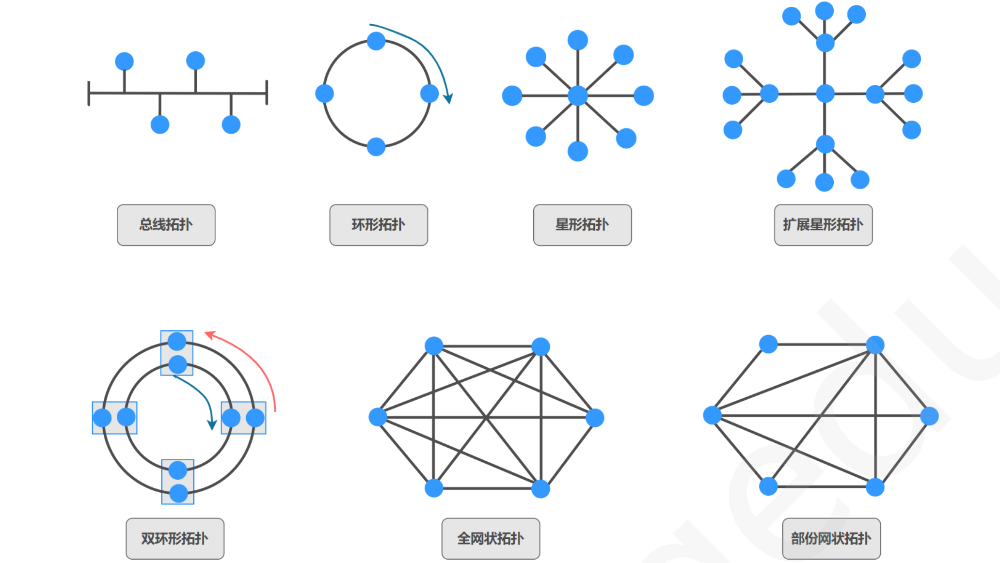

### 8.2OSI七层模型

**物数网传会表应**

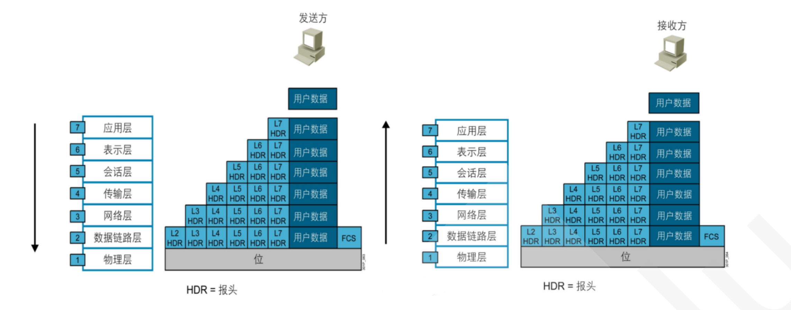

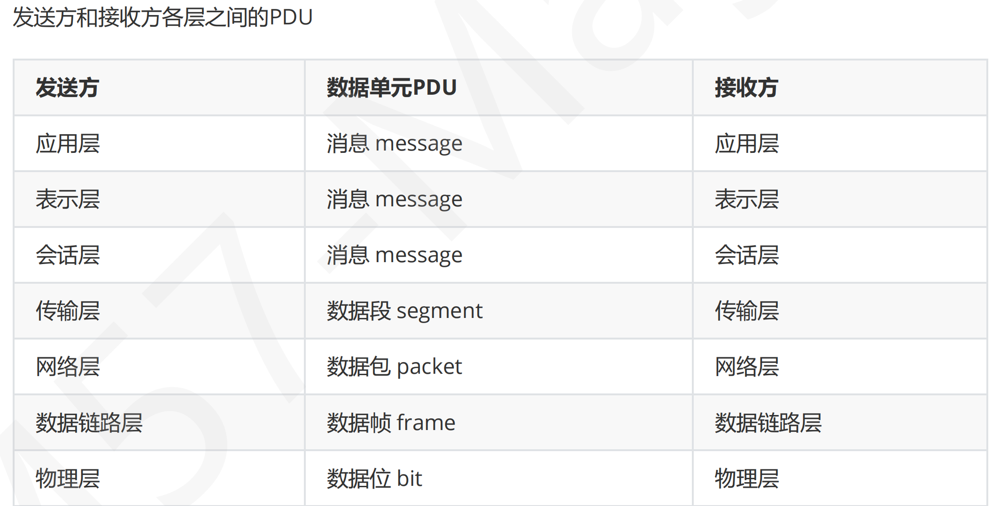

### 8.3交换机路由器与vlan

**交换机**是工作在OSI参考模型数据链路层的设备，外表和集线器相似

它通过判断数据帧的目的MAC地址，从而将数据帧从合适端口发送出去

交换机是通过MAC地址的学习和维护更新机制来实现数据帧的转发

工作原理

交换机根据收到数据帧中的源MAC地址建立该地址同交换机端口的映射，并将其写入MAC地址表中

交换机将数据帧中的目的MAC地址同已建立的MAC地址表进行比较，以决定由哪个端口进行转发

如数据帧中的目的MAC地址不在MAC地址表中，则向所有端口转发。这一过程称为泛洪（flood）

广播帧和组播帧向所有的端口转发


**路由**：把一个数据包从一个设备发送到不同网络里的另一个设备上去。这些工作依靠路由器来完成。路

由器只关心网络的状态和决定网络中的最佳路径。路由的实现依靠路由器中的路由表来完成。

路由器功能：

工作在网络层

分隔广播域和冲突域

选择路由表中到达目标最好的路径

维护和检查路由信息

连接广域网

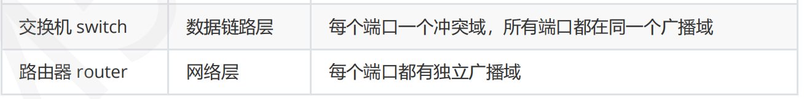


**VLAN**

优点

1. 更有效地共享网络资源。如果用交换机构成较大的局域网，大量的广播报文就会使网络性能下降。

VLAN能将广播报文限制在本VLAN范围内，从而提升了网络的效能

2. 简化网络管理。当结点物理位置发生变化时，如跨越多个局域网，通过逻辑上配置VLAN即可形成

网络设备的逻辑组，无需重新布线和改变IP地址等。这些逻辑组可以跨越一个或多个二层交换机

3. 提高网络的数据安全性。一个VLAN中的结点接收不到另一个VLAN中其他结点的帧

虚拟局域网的实现技术

1. 基于端口的VLAN
2. 基于MAC地址的VLAN
3. 基于协议的VLAN
4. 基于网络地址的VLAN

### 8.4TCP/IP协议

#### 8.4.1TCP/IP标准

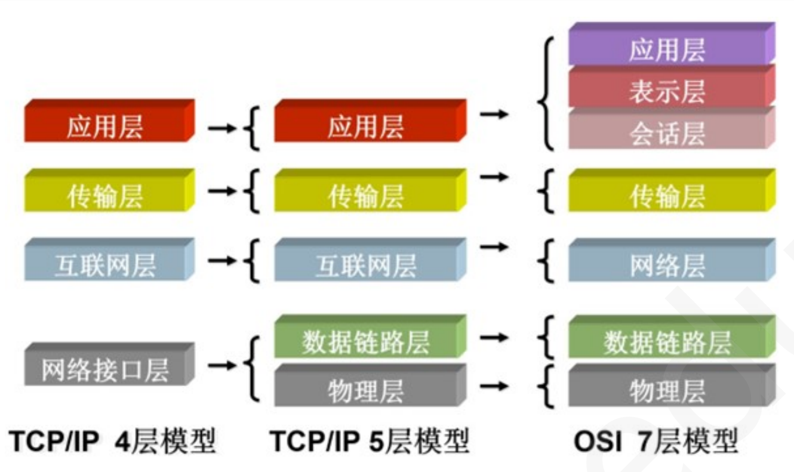

0-1023：

系统端口或特权端口(仅管理员可用) ，众所周知，永久的分配给固定的系统应用使用，

22/tcp(ssh), 80/tcp(http), 443/tcp(https)

1024-49151：

用户端口或注册端口，但要求并不严格，分配给程序注册为某应用使用，

1433/tcp(SqlServer),1521/tcp(oracle),3306/tcp(mysql),11211/tcp/udp (memcached)

49152-65535：

动态或私有端口，客户端随机使用端口，范围定义：/proc/sys/net/ipv4/ip_local_port_range


```bash
yum install -y nc
apt install -y netcat-openbsd
#查看所有己处于监听状态的tcp端口 t:tcp, l:listen, n:numeric
ss  -tnl
#在22 己被使用的情况下，用nc 监听22失败
[root@ubuntu2204 ~]# nc -l 22
nc: Address already in use
#用nc 监本机 222
[root@ubuntu2204 ~]# nc -l 222
#用远程主机连接本机222
root@ubuntu2204:~# nc 10.0.0.206 222
#再次查看本机tcp 连接状态，能看到有一个远程主机通过222连接本机
[root@ubuntu2204 ~]# ss -tn
```

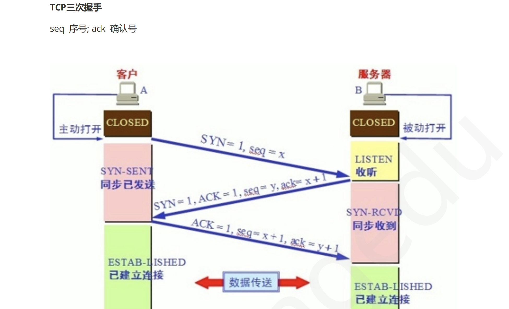

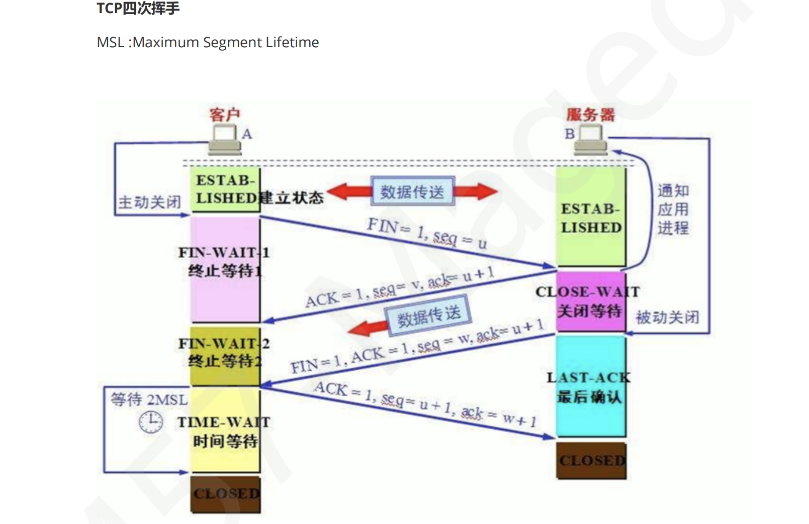

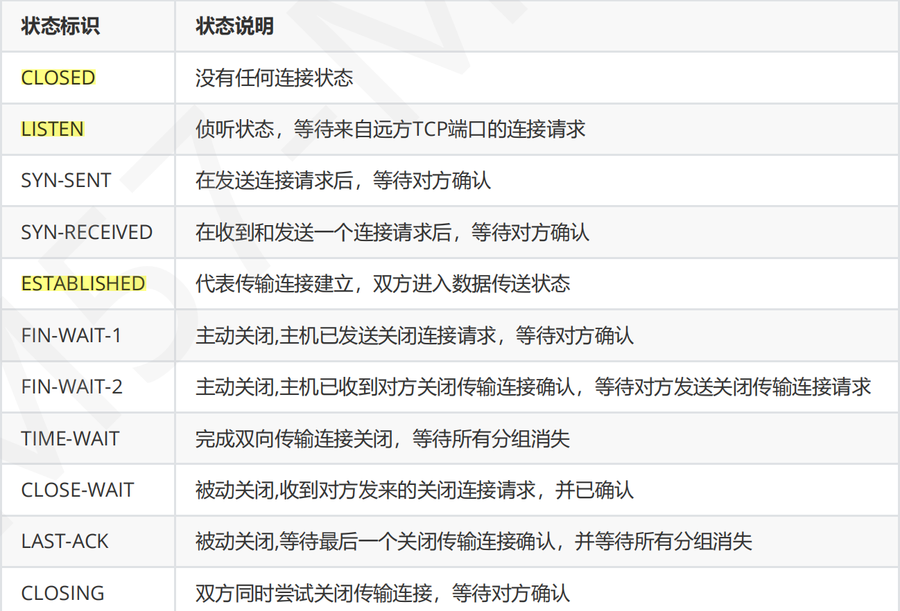


内核TCP参数优化

```bash
[root@ubuntu2204 ~]# vim /etc/sysctl.conf
net.ipv4.tcp_fin_timeout = 2
net.ipv4.tcp_tw_reuse = 1
net.ipv4.tcp_tw_recycle = 1
net.ipv4.tcp_syncookies = 1
net.ipv4.tcp_keepalive_time = 600
net.ipv4.ip_local_port_range = 2000 65000
net.ipv4.tcp_max_syn_backlog = 16384
net.ipv4.tcp_max_tw_buckets = 36000
net.ipv4.route.gc_timeout = 100
net.ipv4.tcp_syn_retries = 1
net.ipv4.tcp_synack_retries = 1
net.ipv4.tcp_max_orphans = 16384
net.core.somaxconn = 16384
net.core.netdev_max_backlog = 16384


#指定内核能接管的孤儿连接数目
[root@ubuntu2204 ~]# cat /proc/sys/net/ipv4/tcp_max_orphans
 8192
  #指定孤儿连接在内核中生存的时间
[root@ubuntu2204 ~]# cat /proc/sys/net/ipv4/tcp_fin_timeout
 60
```

**TCP超时重传**  

异常网络状况下（开始出现超时或丢包），TCP控制数据传输以保证其承诺的可靠服务TCP服务必须能够 重传超时时间内未收到确认的TCP报文段。

```bash
#指定在底层IP接管之前TCP最少执行的重传次数，默认值是
[root@ubuntu2204 ~]# cat /proc/sys/net/ipv4/tcp_retries1
 3
 #指定连接放弃前TCP最多可以执行的重传次数，默认值15 （一般对应13～30min）
[root@ubuntu2204 ~]# cat /proc/sys/net/ipv4/tcp_retries2
 15
```

**拥塞控制**

#### 8.4.2UDP

工作在传输层 提供不可靠的网络访问 非面向连接协议 有限的错误检查 传输性能高 无数据恢复特性

#### 8.4.3internet层

ICMP协议：ICMP（Internet Control Message Protocol）Internet控制报文协议。它是TCP/IP协议簇的一个子协议，用于在IP主机、路由器之间传递控制消息。控制消息是指网络通不通、主机是否可达、路由是否可用等网络本身的消息。这些控制消息虽然并不传输用户数据，但是对于用户数据的传递起着重要的作用。

```bash
[root@ubuntu2204 ~]# ping 114.114.114.114
 PING 114.114.114.114 (114.114.114.114) 56(84) bytes of data.
 64 bytes from 114.114.114.114: icmp_seq=1 ttl=128 time=4.92 ms
 64 bytes from 114.114.114.114: icmp_seq=2 ttl=128 time=5.94 ms
 ^C--- 114.114.114.114 ping statistics --
2 packets transmitted, 2 received, 0% packet loss, time 1001ms
 rtt min/avg/max/mdev = 4.916/5.427/5.938/0.511 ms
 
[root@ubuntu2204 ~]# ping -f -s 65508 10.0.0.208
 PING 10.0.0.208 (10.0.0.208) 65508(65536) bytes of data.
 EEEEEEEEEEEEEEEEEEEEEEEEEEE
#实时刷新网卡数据
[root@ubuntu2204 ~]# watch ifconfig eth0
```

ARP地址解析协议由互联网工程任务组(IETF)在1982年11月发布的RFC 826中描述制定，是根据IP地址获 取物理地址的一个TCP/IP协议。 主机发送信息时将包含目标IP地址的ARP请求广播到局域网络上的所有主机，并接收返回消息，以此确 定目标的物理地址；收到返回消息后将该IP地址和物理地址存入本机ARP缓存中并保留一定时间，下次 请求时直接查询ARP缓存以节约资源。地址解析协议是建立在网络中各个主机互相信任的基础上的，局 域网络上的主机可以自主发送ARP应答消息，其他主机收到应答报文时不会检测该报文的真实性就会将 其记入本机ARP缓存。

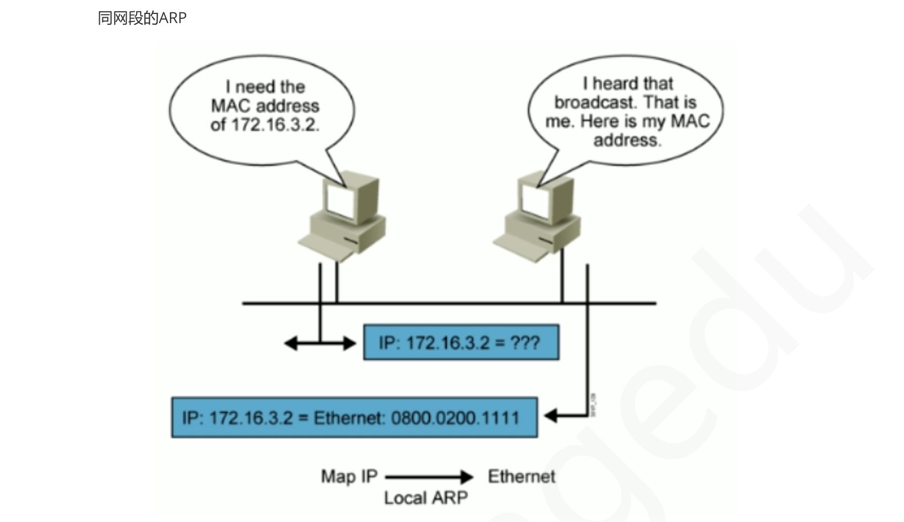

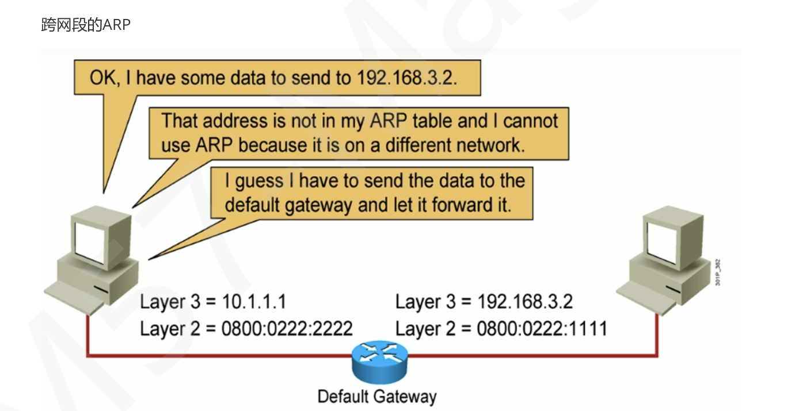

```bash
#查看ARP缓存
#win
arp -a
[root@ubuntu2204 ~]# arp -n
[root@ubuntu2204 ~]# ip neigh
#ARP静态绑定可以防止ARP欺骗
[root@ubuntu2204 ~]# arp -s 10.0.0.3 00:0c:29:32:80:38
[root@ubuntu2204 ~]# arp -n

#kali 系统实现 arp 欺骗上网流量劫持
#启动路由转发功能
[root@kali ~]# echo 1 > /proc/sys/net/ipv4/ip_forward
 #安装包
[root@kali ~]# apt-get install dsniff 
#欺骗目标主机，本机是网关
[root@kali ~]# arpspoof -i eth0 -t 被劫持的目标主机IP 网关IP
 #欺骗网关，本机是目标主机
[root@kali ~]# arpspoof -i eth0 -t 网关IP 被劫持的目标主机IP
```

RARP 反向ARP，即将MAC转换成IP

主机到主机的包传递完整过程

#### 8.4.4ip地址

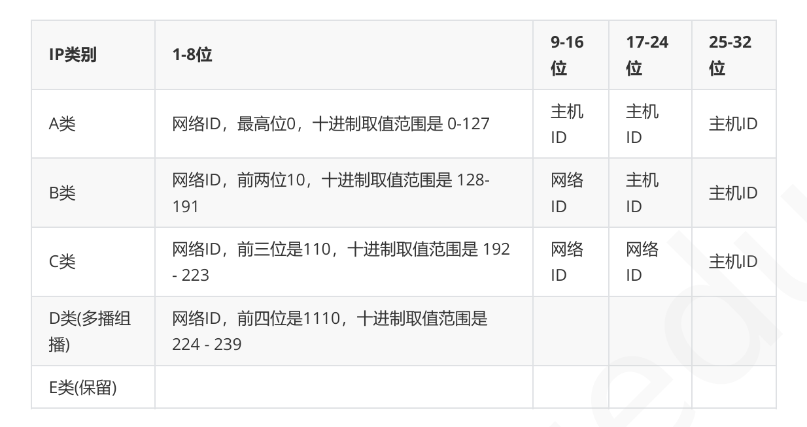

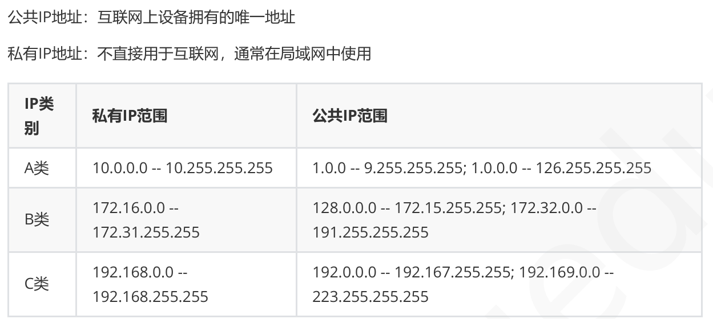

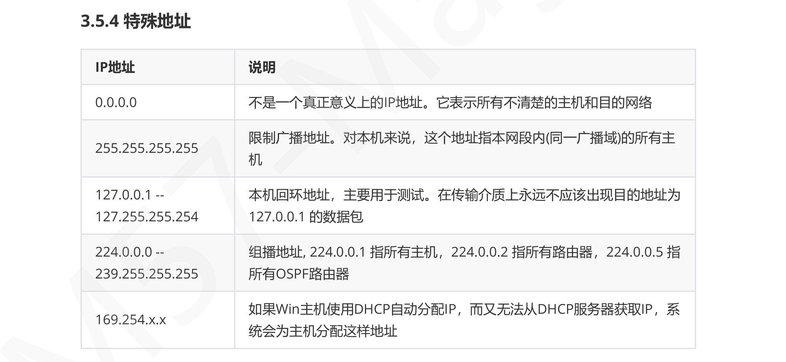

**划分子网**：将一个大的网络（主机数多）划分成多个小的网络（主机数少），主机ID位数变少，网络ID 位数变多，划分32个子网，则网络ID要向主机ID借5位， 2^5=32

**合并超网**：将多个小网络合并成一个大网，主机ID位向网络ID位借位，主要实现路由聚合功能


## 9.linux网络

### 9.1网络配置

| 模式           | 作用定位                       | 网络层级                       | 备注                                               |
| -------------- | ------------------------------ | ------------------------------ | -------------------------------------------------- |
| **桥接模式**   | 像真实主机一样加入物理网络     | 与宿主机同一层（L2）           | 虚拟机直接被路由器识别，适合服务器部署             |
| **NAT模式**    | 使用宿主机做“路由器+NAT”中转   | 虚拟机是宿主机的“私有下级网络” | 宿主可访问外网，虚拟机可访问外网，外部不可反向访问 |
| **仅主机模式** | 虚拟机与宿主私有通信，不走外网 | 虚拟机与宿主处于一个“隔离内网” | 默认不通外网，不通其他虚拟机除非共享此模式         |

```go
centos9之前网卡名字：
 /etc/sysconfig/network-scripts/ifcfg-IFACE
 
Cenos9之后的网卡名字
 /etc/NetworkManager/system-connections/IFACE.nmconnection
 
Ubuntu系统的网卡名字
 /etc/netplan/*.yaml
```

**静态指定：**

static，写在配置文件中，不会根据环境的改变而发生变化

**动态分配：**

 DHCP，Dynamic Host Configuration Protocol，根据动态主机配置协议生成相应的配置

```bash
[root@rocky86 ~]# ll /etc/sysconfig/network-scripts/
```

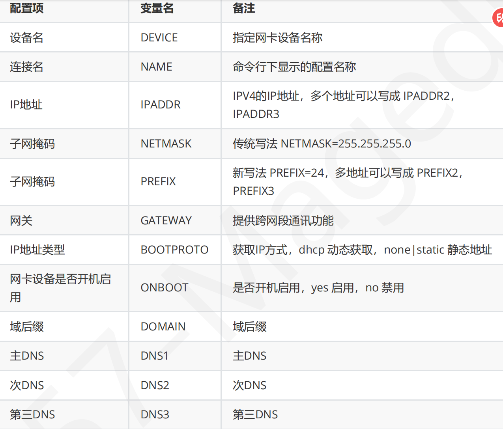

```bash
NetWorkmanager工具nmcli
#查看
[root@rocky86 network-scripts]# nmcli connection
NAME   UUID                                 TYPE     DEVICE 
eth0   5c093cad-84c9-4cfc-8b6f-e1041db357df ethernet eth0   
virbr0 77c5c6bc-b04f-4ae4-a8eb-16fdf62e9a70 bridge   virbr0
[root@rocky86 network-scripts]# nmcli connection reload
#仅centos7版本支持
systemctl restart network
#再次查看
[root@rocky86 network-scripts]# nmcli connection

查看DNS
[root@rocky86 network-scripts]# cat /etc/resolv.conf 
# Generated by NetworkManager
search localdomain
nameserver 10.0.0.2
nameserver 114.114.114.114
```

DNS域名解析

```bash
[root@rocky86 ~]# host www.baidu.com
www.baidu.com is an alias for www.a.shifen.com.
www.a.shifen.com has address 163.177.151.110
www.a.shifen.com has address 163.177.151.109
[root@rocky86 ~]# host www.baidu.com 114.114.114.114
Using domain server:
Name: 114.114.114.114
Address: 114.114.114.114#53
Aliases: 
www.baidu.com is an alias for www.a.shifen.com.
www.a.shifen.com has address 163.177.151.109
www.a.shifen.com has address 163.177.151.110
```

```bash
#ip 确认
ip a
ip a show device
ifconfig
ifconfig device
#路由确认
route -n
ip route
#DNS确认
cat /etc/resolv.conf
```

**Ubuntu** **系列网卡配置**

网卡配置文件存在于 /etc/netplan/ 目录中，以 XXX.yaml 的格式来命名

路径是固定的，文件命名规则也是固定的

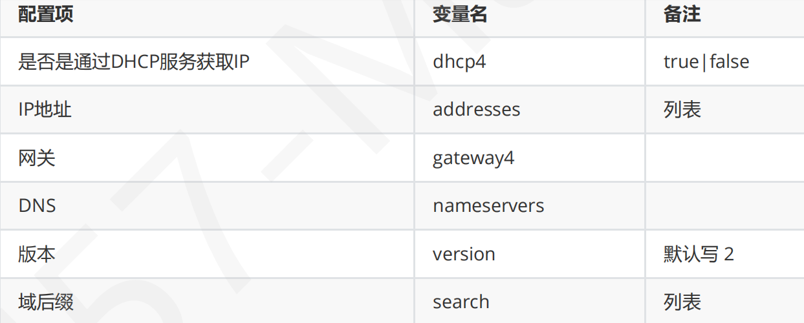

```bash
#新增网卡配置文件
root@ubuntu22:/etc/netplan# vim eth1.yaml
network:
 renderer: networkd
 ethernets:
   eth1:
     addresses: [10.0.0.6/24,10.0.0.66/24]
     nameservers:
       search: [magedu.com,magedu.org]
       addresses: [10.0.0.2,180.76.76.76]
 version: 2
 
#让网卡生效  
root@ubuntu22:/etc/netplan# netplan apply 
#查看
root@ubuntu22:/etc/netplan# ip a show eth1

#新增配置
root@ubuntu22:/etc/netplan# vim eth2.yaml
network:
 renderer: networkd
 ethernets:
   eth2:
     addresses:
        - 192.168.10.66/24
 version: 2
 
root@ubuntu22:/etc/netplan# apt install -y net-tools
root@ubuntu22:/etc/netplan# route -n
Kernel IP routing table
Destination     Gateway         Genmask         Flags Metric Ref   Use Iface
0.0.0.0         10.0.0.2        0.0.0.0         UG    100    0        0 eth0
10.0.0.0        0.0.0.0         255.255.255.0   U     0      0        0 eth1
10.0.0.0        0.0.0.0         255.255.255.0   U     100    0        0 eth0
10.0.0.2        0.0.0.0         255.255.255.255 UH    100    0        0 eth0
192.0.0.0       0.0.0.0         255.0.0.0       U     0      0        0 eth2

#查看dns
root@ubuntu22:~# resolvectl status
```

#### 命令

```bash
--------------------------------------主机名
#显示主机名
[root@ubuntu2204 ~]# hostname
ubuntu2204
#显示别名
[root@ubuntu2204 ~]# hostname -a
#显示IP地址,会卡一会儿，因为要通过DNS反解主机名
[root@ubuntu2204 ~]# hostname -i
10.0.0.206 fe80::20c:29ff:fe11:98d9
#显示所有IPV4地址
[root@test-name ~]# hostname -I
10.0.0.206
-----------------------------ip route
#添加
ip route add 20.0.0.0/24 dev eth0 via 10.0.0.123
#查看
ip route
ip route show
#删除
ip route del 20.0.0.0/24 dev eth0 via 10.0.0.123
p route add 192.168.0.0/24 via 172.16.0.1 
ip route add 192.168.1.100 via 172.16.0.1
 ip route add default via 172.16.0.1
 ip route flush dev eth0
 ip route get 8.8.8.8
-------------------------------------开启路由转发
#查看
cat /proc/sys/net/ipv4/ip_forward
 1
#生效
sysctl -p
-------------------------------------诊断
#抓包
tcpdump -i ens160 -nn icmp
 #跟踪路由
mtr 192.168.10.254 -n
```

route

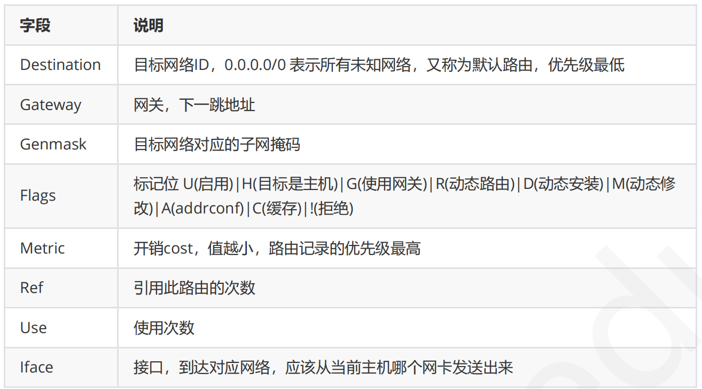

#### netstat

netstat 通过遍历 /proc来获取 socket信息，ss 使用 netlink与内核 tcp_diag 模块通信获取 socket 信息， ss性能好一些

```bash
-t|--tcp                                
-u|--udp 
-l|--listening   #显示处于监听状态的端口
-n|--numeric      #数字显示IP和端口
-p|--program        #显示相关进程及PID
```

```bash
#统计指定网卡数据
[root@Rocky86 ~]# netstat -I=eth0
#从内存中统计
[root@ubuntu ~]# cat /proc/net/dev
```

```bash
#如何查看是哪个程序在监听端口
root@ubuntu ~]# netstat -tunlp | grep ":22"
 [root@ubuntu ~]# ss -ntulp | grep ":22"
 [root@ubuntu ~]# lsof -i:22
```

#### ip命令

可用于代替ifconfig

建议 CentOS 6 关闭 NetworkManager 服务 网卡别名必须使用静态地址

```bash
[root@ubuntu ~]# ip a show eth1
------------------------------------ip link------------
#禁用网卡 
[root@ubuntu ~]# ip link set eth1 down
 #改名
[root@ubuntu ~]# ip link set eth1 name eth1-test
 #启用
[root@ubuntu ~]# ip link set eth1-test up
 #查看
[root@ubuntu ~]# ip link show eth1-test
---------------------------------------ip address----------
[root@ubuntu ~]# ip address show eth1
#向设备添加IP地址
[root@ubuntu ~]# ip address add 10.0.0.110/24 dev eth1
#ifconfig 只能看到一个IP
#添加别名，只是给网卡中的一个ip添加了别名
[root@ubuntu ~]# ip address add 10.0.0.114/24 dev eth1 label eth1:114
#删除IP       
[root@ubuntu ~]# ip a del 10.0.0.119/24 dev eth1
 #删除别名
[root@ubuntu ~]# ip a del 10.0.0.114/24 dev eth1 label eth1:114
#添加IP，30S生命周期
[root@ubuntu ~]# ip a change 10.0.0.137/24 dev eth1 preferred_lft 30 valid_lft 
30
#清除网卡上所有IP
 [root@ubuntu ~]# ip a flush dev eth1
```

```bash
[root@localhost ~]# vim /etc/sysconfig/network-scripts/ifcfg-ens224
 DEVICE=ens224
 NAME=ens224
 IPADDR=172.16.1.59
 PREFIX=24
 IPADDR2=172.16.1.49
 PREFIX2=24
 IPADDR3=172.16.1.39
 PREFIX3=24
 GATEWAY=172.16.1.254
 BOOTPROTO=static
 DNS1=8.8.8.8
 
 #新增别名文件的方法
[root@localhost network-scripts]# cp ifcfg-ens224 ifcfg-ens224:1
 [root@localhost network-scripts]# vim ifcfg-ens224:1
 DEVICE=ens224:1
 IPADDR=172.16.1.19
 PREFIX=24
 BOOTPROTO=static
 
 #重新生效
[root@localhost ~]# nmcli connection reload;nmcli connection up ens224

#如果想删除该配置，则直接删除文件即可
[root@localhost network-scripts]# rm ifcfg-ens224:1
```

```bash
#查看网络连接
nmcli con
 nmcli con show
 #查看active 状态的连接
nmcli con show --active
 #查看指定设备
nmcli con show eth1
 #显示设备状态
nmcli dev status 
#显示网络接口属性
nmcli dev show eth1
 #删除连接
nmcli con del con-eth1
 #启用
nmcli con up con-eth1
 #禁用
nmcli con down con-eth1
 #刷新
nmcli connection reload;

#新增，从dhcp 获取IP地址
nmcli con add con-name con-dhcp type ethernet ifname eth1
```

#### 主机名

```bash
/etc/hostname
#本地主机名和IP地址的映射
/etc/hosts
C:\Windows\System32\drivers\etc\hosts
```

#### 多网卡 bonding

**将多块网卡绑定同一IP地址对外提供服务，可以实现高可用或者负载均衡**。直接给两块网卡设置同一IP 地址是不可以的。通过 bonding，虚拟一块网卡对外提供连接，物理网卡的被修改为相同的MAC地址

#### 网络组 Network Teaming

网络组：是将多个网卡聚合在一起方法，从而实现冗错和提高吞吐量 网络组不同于旧版中bonding技术，提供更好的性能和扩展性 网络组由内核驱动和teamd守护进程实现 网络组特点 启动网络组接口不会自动启动网络组中的port接口 启动网络组接口中的port接口总会自动启动网络组接口 禁用网络组接口会自动禁用网络组中的port接口 没有port接口的网络组接口可以启动静态IP连接 启用DHCP连接时，没有port接口的网络组会等待port接口的加入

#### 网桥(交换机)

此处的网桥是逻辑上的网桥，说的是网络上的一个桥梁，打通网路，而不是硬件设备。 桥接：把一台机器上的若干个网络接口“连接”起来。其结果是，其中一个网口收到的报文会被复制给其 他网口并发送出去。以使得网口之间的报文能够互相转发。网桥就是这样一个设备，它有若干个网口， 并且这些网口是桥接起来的。与网桥相连的主机就能通过交换机的报文转发而互相通信。

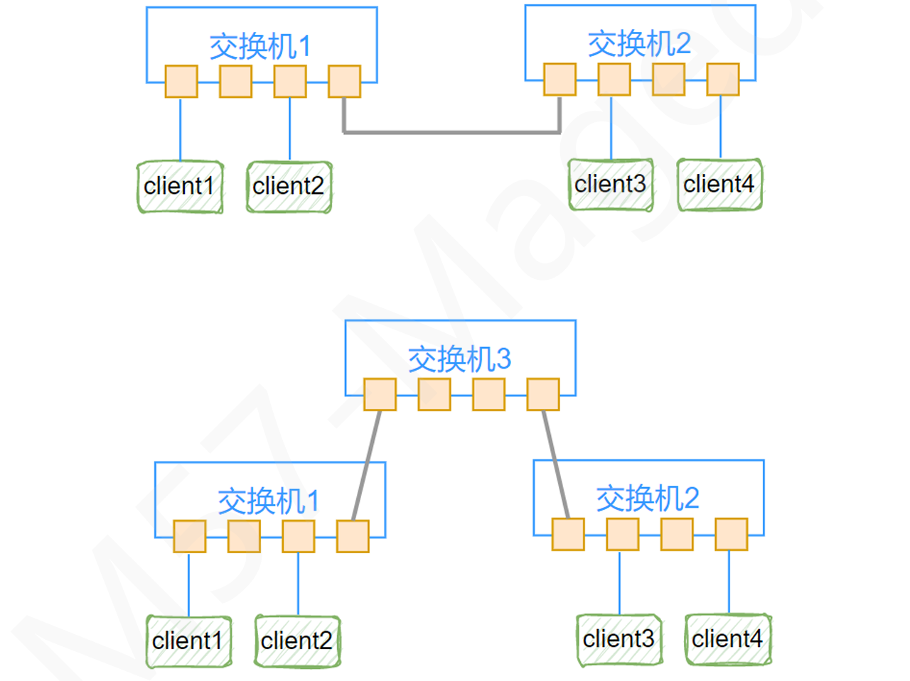

#### 网络测试诊断工具

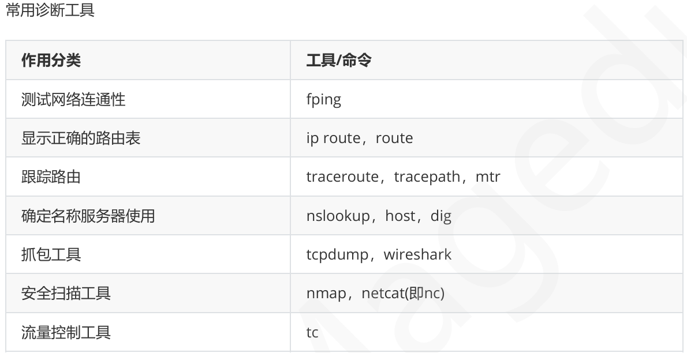

### 9.2软路由实践

软路由是一种基于软件实现的路由器技术，它利用标准的计算机硬件（如台式机或服务器）作为路由器，并通过安装特定的软件来达成路由器的功能。

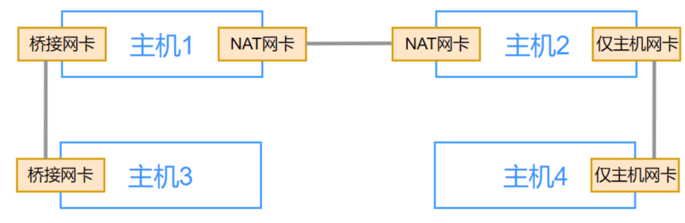

重点出错：网卡配置

主机1

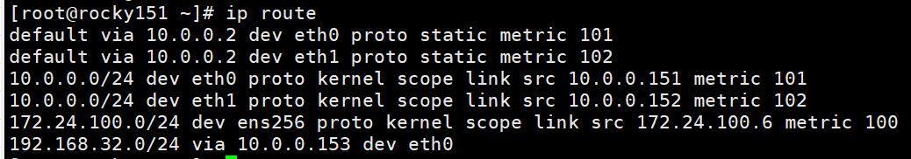

主机2

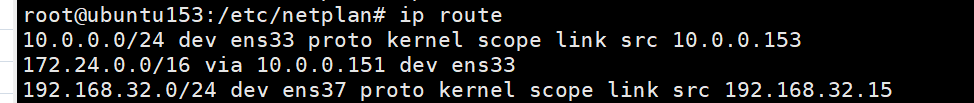

主机3


主机4


总结：有路由转发功能的设备可以作为其他设备的网关。

重点理解路由，网关

## 10.进程，系统性能和计划任务

### 10.1进程与内存管理

#### 进程

**进程与线程的区别** 进程是操作系统分配资源的最小单位； 线程是程序执行的CPU调度的最小单位； 一个进程由一个或多个线程组成，线程是一个进程中代码的不同执行路线； 进程之间相互独立，但同一进程下的各个线程之间共享程序的内存空间(包括代码段、数据集、堆等)及一 些进程级的资源(如打开文件和信号)，某进程内的线程在其它进程不可见； 调度和切换：线程上下文切换比进程上下文切换要快得多。

```bash
# 查看进程中的线程
grep -i threads /proc/PID/status
#查看进程的二进制文件
ll /proc/PID/exe
#查看进程打开的文件
/proc/PID/fd/
```

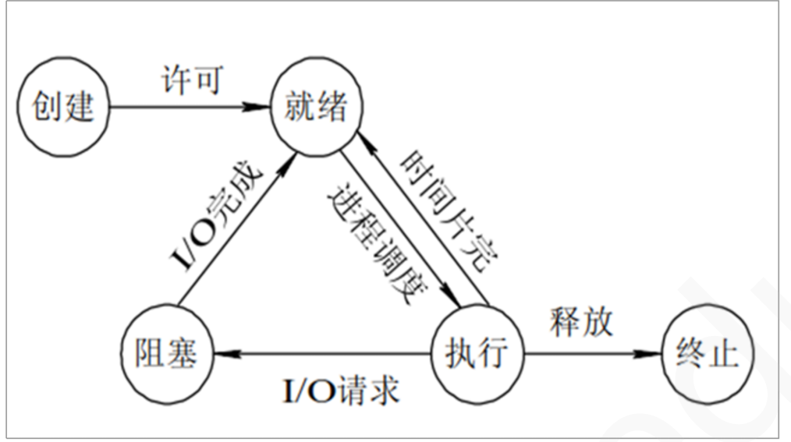

**僵尸进程**

进程终止，父进程尚未回收，子进程残留资源(PCB)存放于内核中，变成僵尸(zombie)进程。 这样就会导致 如果进程不调用wait()或waitpid()的话，那么保留的那段信息就不会释放，其进程号就会 一直被占用，但系统所能使用的进程号是有限的，如果大量产生僵尸进程，将因为没有可用进程号而导 致系统不能产生新的进程，此即为僵尸进程的危害。

**孤儿进程** 

如果在子进程在退出前，父进程先退出，这时子进程将成为孤儿进程，因为它的父进程已经死了。孤儿 进程会被PID=1的systemd进程收养，成为systemd的子进程。 注意，孤儿进程还会继续运行，而不会随父进程退出而终止，只不过其父进程发生了改变。

#### 进程使用内存问题

**内存泄漏**：Memory Leak  指程序中用malloc或new申请了一块内存，但是没有用free或delete将内存释放，导致这块内存一直处 于占用状态。

**内存溢出**：Memory Overflow  指程序申请了10M的空间，但是在这个空间写入10M以上字节的数据，就是溢出。

**内存不足**：OOM

当JVM因为没有足够的内存来为对象分配空间并且垃圾回收器也已经没有空间可回收时，就会抛出这个 error，（因为这个问题已经严重到不足以被应用处理）。


原因： 

给应用分配内存太少：比如虚拟机本身可使用的内存（一般通过启动时的VM参数指定）太少。    应用用的太多，并且用完没释放，浪费了。此时就会造成内存泄露或者内存溢出。

解决办法：

1. 限制java进程的max heap，并且降低java程序的worker数量，从而降低内存使用

2. 给系统增加swap空间

### 10.2进程管理和性能相关工具

#### 10.2.1进程树 pstree

```bash
#显示进程切换
[root@ubuntu ~]# pstree -u | grep jose
-sshd---sshd---bash---su---bash(jose)---passwd(root)
 #显示指定用户的进程        
[root@ubuntu ~]# pstree jose
 bash───passwd
 
#-p显示pid，-s显示父进程
[root@ubuntu ~]# pstree -sp 11916
systemd(1)───sshd(1146)───sshd(11860)───sshd(11864)───bash(11867)───passwd(11916)

#不显示线程
[root@ubuntu ~]# pstree -pT | grep httpd

#高亮显示当前进程
[root@ubuntu ~]# pstree -h
```

#### 10.2.2进程信息 ps

Linux系统各进程的相 关信息均保存在/proc/PID目录下的各文件中

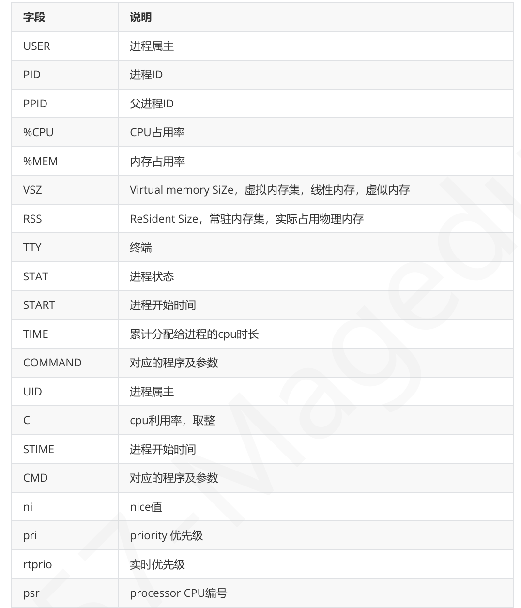

可中断睡眠和不可中断睡眠

可中断睡眠态的进程在睡眠状态下等待特定事件发生，即使特定事件没有产生，也可以通过其它手段唤醒该进 程，比如，发信号，释放某些资源等。 

不可中断睡眠态的进程在也是在睡眠状态下等待特定事件发生，但其只能被特定事件唤醒，发信号或其它方法 都无效 发送给不可中断睡眠状态的进程的信号会被丢弃 

打个比方 

可中断睡眠态的进程和不可中断睡眠态的进程是两位睡美人 

不可中断睡眠态的进程只能被王子叫醒 

可中断睡眠态的进程可以被王子叫醒，也可以被青蛙叫醒

```bash
#显示所有所有进程，并列出属主
ps aux
 #显示所有所有进程，并列出属主
ps -ef
 #详细格式显示所有进程
ps -eFH
 #显示指定列
ps -eo pid,tid,class,rtprio,ni,pri,psr,pcpu,stat,comm
 #显示指定列
ps axo pid,cmd,%mem,%cpu
 #查询你拥有的所有进程
ps -x
 #显示指定用户名(RUID)或用户ID的进程
ps -fU apache
 ps -fU 48
 #显示指定用户名(EUID)或用户ID的进程
ps -fu wang
 ps -fu 1000
 #查看以root用户权限（实际和有效ID）运行的每个进程
ps -U root -u root
```

```bash
#查看进程的父子关系
[root@ubuntu ~]# ps auxf

#按CPU利用率倒序排序
[root@ubuntu ~]# ps aux k -%cpu

#按内存倒序排序
[root@ubuntu ~]# ps axo pid,cmd,%cpu,%mem --sort -%mem
```

#### 10.2.3设置和调整进程优先级

linux2.6内核将任务优先级进行了一个划分，实时优先级范围是0到MAX_RT_PRIO-1(0-99)，而普通进程 的静态优先级范围是从MAX_RT_PRIO到MAX_PRIO-1(100-139)


进程优先级调整 

静态优先级：100-139 

进程默认启动时的nice值为0，优先级为120 

只有根用户才能降低nice值（提高优先性）

nice值：-20到19，可调整，对应系统优先级100-139

```bash
[root@ubuntu ~]# nice -n -10 ping 127.0.0.1
 #查看
[root@ubuntu ~]# ps axo pid,cmd,nice |grep ping
 7981 ping 127.0.0.1              -10
 7992 grep --color=auto ping        
```

renice命令 

可以调整正在执行中的进程的优先级

```bash
[root@ubuntu ~]# renice -n -20 7981
 7981 (process ID) old priority -10, new priority -20
 #查看
[root@ubuntu ~]# ps axo pid,cmd,nice |grep ping
 7981 ping 127.0.0.1              -20
 8082 grep --color=auto ping        
0
```

#### 10.2.4搜索进程

```bash
ps options | grep 'pattern'
[root@ubuntu ~]# pgrep -aU jose

#查看相关命令的进程
[root@ubuntu ~]# pidof bash
```

#### 10.2.5负载查询 uptime

```bash
[root@ubuntu ~]# uptime
 08:55:54 up 11:03,  3 users,  load average: 0.00, 0.01, 0.00
```

系统平均负载：指在特定时间间隔内运行队列中的平均进程数，通常每个CPU内核的当前活动进程数不 大于3，那么系统的性能良好。如果每个CPU内核的任务数大于5，那么此主机的性能有严重问题。

#### 10.2.6显示CPU相关统计 mpstat

```bash
#查看当前主机所有cpu运行情况
[root@ubuntu ~]# mpstat

#查看第一颗cpu运行情况
[root@ubuntu ~]# mpstat -P 0

#查看所有
[root@ubuntu ~]# mpstat -P ALL
```


#### 10.2.7查看进程实时状态 top 和 htop

```bash
#10s刷新一次
[root@ubuntu ~]# top -d 10
 #显示指定用户的进程统计
[root@ubuntu ~]# top -u jose
 #显示指定进程的线程
[root@ubuntu ~]# top -Hp 1444
 #显示进程的具体命令
[root@ubuntu ~]# top -p 1331 -c
```

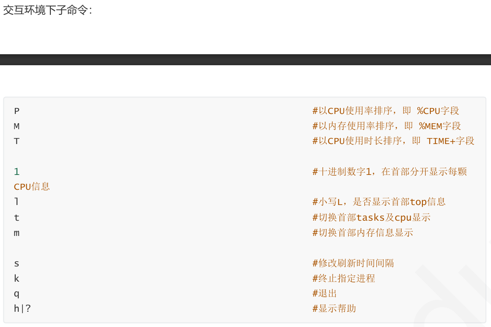


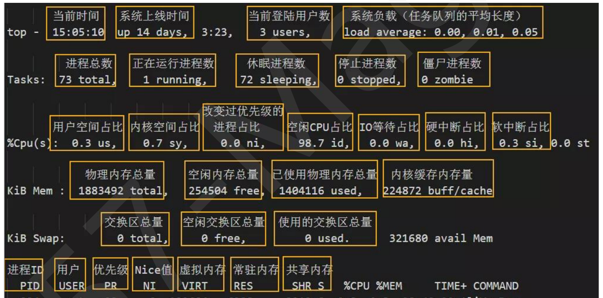


**htop** 是增强版的 top 命令，在 centos 中来自于 epel 源， ubuntu 中可以直接安装

#### 10.2.8内存空间 free


缓冲(buffers) 是指在写磁盘时，先把要写的数据放入一个缓冲区，然后再批量写，以减少磁盘碎片和硬 盘反复寻道，从而提高系统性能 buffers 主要用于硬盘与内存之间的数据交互

缓存(cached) 是指文件的内容要被多个进程使用的时候，则可以将内容放入缓存区，则后续就可以直接 从内存中读，而不用再消耗IO cached主要作用于CPU和内存之间的数据交互（本来要用IO读硬盘文件，现在变成了读内存）

向/proc/sys/vm/drop_caches中写入相应的修改值，会清理缓存。建议先执行sync（sync 命令将所有 未写的系统缓冲区写到磁盘中，包含已修改的 i-node、已延迟的块 I/O 和读写映射文件）。执行echo  1、2、3 至 /proc/sys/vm/drop_caches, 达到不同的清理目的。

#### 10.2.9虚拟内存信息 vmstat

虚拟内存 虚拟内存是操作系统提供的一种内存管理技术，操作系统会为每个进程分配一套独立的，连续的，私有 的内存空间，让每个程序都以为自己独享所有主存的错觉，这样做的目的是方便内存管理。 

程序所使用的内存是虚拟内存(Virtual Memory) 

CPU使用的内存是物理内存(Physical Memory)   MMU LTB 

虚拟内存地址和物理内存地址之间的映射和转换由CPU中的内存管理单元(MMU)进行管理

```bash
#显示当前时间点虚拟内存数据
[root@ubuntu ~]# vmstat

#每秒显示一次
[root@ubuntu ~]# vmstat 1

#显示统计数据
[root@ubuntu ~]# vmstat -s
```

#### 10.2.10统计CPU和设备IO信息 iostat

```bash
[root@ubuntu ~]# apt install -y sysstat
```

```bash
#显示当前时间节点磁盘数据
[root@ubuntu ~]# iostat
```

#### 10.2.11监视磁盘I/O iotop

iotop命令是一个用来监视磁盘I/O使用状况的top类工具iotop具有与top相似的UI，其中包括PID、用 户、I/O、进程等相关信息，可查看每个进程是如何使用IO

```bash
apt install iotop
```

#### 10.2.12显示网络带宽使用情况 iftop

```bash
apt install iftop
```

#### 10.2.13查看网络实时吞吐量 nload

```bash
[root@ubuntu ~]# apt install nload
```

```bash
#查看所有网络设备进出流量，第一页显于一个设备
[root@ubuntu ~]# nload
 #一屏显示所有设备流量
[root@ubuntu ~]# nload -m
 #显示指定设备流量
[root@ubuntu ~]# nload ens160
 #1000 毫秒刷新一次数据
[root@ubuntu ~]# nload -t 1000 ens160
```

#### 10.2.14查看进程网络带宽的使用情况 nethogs

```bash
#显示指定设备数据
[root@ubuntu ~]# nethogs ens160
```

#### 10.2.15系统资源统计 dstat

```bash
[root@ubuntu ~]# apt install dstat
```

#### 10.2.16查看进程打开文件 lsof

sof：list open files，查看当前系统文件的工具。在linux环境下，一切皆文件，用户通过文件不仅可以 访问常规数据，还可以访问网络连接和硬件如传输控制协议 (TCP) 和用户数据报协议 (UDP)套接字等， 系统在后台都为该应用程序分配了一个文件描述符

```bash
#列出所有打开文件
[root@ubuntu ~]# lsof | head
#查看当前哪个进程正在使用此文件
[root@ubuntu ~]# lsof /var/log/messages
#查看指定终端启动的进程
[root@ubuntu ~]# lsof /dev/pts/1
[root@ubuntu ~]# lsof `tty`

#查看指定进程打开的文件
[root@ubuntu ~]# lsof -p 1270

#查看指定程序打开的文件
[root@ubuntu ~]# lsof -c httpd

#查看指定用户打开的文件
[root@ubuntu ~]# lsof -u root | more

#查看指定目录下被打开的文件，参数+D为递归列出目录下被打开的文件，参数+d为列出目录下被打开的文件
[root@ubuntu ~]# lsof +D /var/log/ 
[root@ubuntu ~]# lsof +d /var/log/

#查看所有网络连接，通过参数-i查看网络连接的情况，包括连接的ip、端口等以及一些服务的连接情况，例如：sshd等。也可以通过指定ip查看该ip的网络连接情况
[root@ubuntu ~]# lsof -i –n      
[root@ubuntu ~]# lsof -i@127.0.0.1
 #查看端口连接情况，通过参数-i:端口可以查看端口的占用情况，-i参数还有查看协议，ip的连接情况等
[root@ubuntu ~]# lsof -i :80 -n
 #查看指定进程打开的网络连接，参数-i、-a、-p等，-i查看网络连接情况，-a查看存在的进程，-p指定进程
[root@ubuntu ~]# lsof -i –n -a -p 9527
```

从内存中恢复己删除的文件

```bash
#打开文件
[root@ubuntu ~]# tail -f /var/log/syslog 
#删除文件
[root@ubuntu ~]# rm -rf /var/log/syslog
 [root@ubuntu ~]# ls /var/log/syslog
 ls: cannot access '/var/log/syslog': No such file or directory
 #找出进程
[root@ubuntu ~]# ps aux | grep tail
 root        
6037  0.0  0.1 217128   976 pts/4    S+   02:29   0:00 tail -f /var/log/syslog
 #查看内存映射
[root@ubuntu ~]# ll /proc/6037/fd/
 total 0
 lrwx------ 1 root root 64 May 29 02:32 0 -> /dev/pts/4
 lrwx------ 1 root root 64 May 29 02:32 1 -> /dev/pts/4
 lrwx------ 1 root root 64 May 29 02:32 2 -> /dev/pts/4
 lr-x------ 1 root root 64 May 29 02:32 3 -> '/var/log/syslog (deleted)'
 lr-x------ 1 root root 64 May 29 02:32 4 -> anon_inode:inotify
 #打开，文件内容还在
[root@ubuntu ~]# cat /proc/6037/fd/3
 #恢复
[root@ubuntu ~]# cat /proc/6037/fd/3 > /var/log/syslog
 [root@ubuntu ~]# ll /var/log/syslog-rw-r--r-- 1 root root 1885719 May 29 02:38 /var/log/syslog
```

#### 10.2.17CentOS 8 新特性 cockpit

由cockpit包提供,当前Ubuntu和CentOS7也支持此工具 Cockpit 是CentOS 8 取入的新特性，是一个基于 Web 界面的应用，它提供了对系统的图形化管理

```bash
[root@localhost ~]# yum install -y cockpit
 [root@localhost ~]# systemctl enable --now cockpit.socket
 
https://172.16.1.44:9090/
```

#### 10.2.18信号发送 kill

kill：内部命令，可用来向进程发送控制信号，以实现对进程管理，每个信号对应一个数字，信号名称以 SIG开头（可省略），不区分大小写

```bash
常用信号：
1) SIGHUP 无须关闭进程而让其重读配置文件
2) SIGINT 中止正在运行的进程；相当于Ctrl+c
 3) SIGQUIT 相当于ctrl+\
 9) SIGKILL 强制杀死正在运行的进程,可能会导致数据丢失,慎用!
 15) SIGTERM 终止正在运行的进程，默认信号
18) SIGCONT 继续运行
19) SIGSTOP 后台休眠
```

```bash
#pkill 和 pgrep支持正则表达式
pkill '^p'

#关掉指定端口的进程
[root@ubuntu ~]# lsof -i:80
[root@ubuntu ~]# fuser -k -9 80/tcp
```

#### 10.2.19作业管理

让作业运行于后台 

运行中的作业： Ctrl+z 

尚未启动的作业： COMMAND &

后台作业虽然被送往后台运行，但其依然与终端相关；退出终端，将关闭后台作业。如果希望送往后台 后，剥离与终端的关系 

nohup COMMAND &>/dev/null &  

screen；COMMAND 

tmux；COMMAND

Ctrl+z 使占据终端的进程暂停，让出终端

```bash
[root@ubuntu ~]# jobs

fg [[%]JOB_NUM]        #把指定的后台作业调回前台                 
bg [[%]JOB_NUM]        #让送往后台的作业在后台继续运行            kill [%JOB_NUM]        #终止指定的作业                             
#把后台进程送往前台
[root@ubuntu ~]# fg
 ./a.sh 456
 #指定进程
[root@ubuntu ~]# fg 2
 ./a.sh 123

```

#### 10.2.20并行运行

```bash
cat all.sh
 f1.sh&
 f2.sh&
 f3.sh&
 wait
 
 f1.sh&f2.sh&f3.sh&
 wait
 
{ ping -c3 127.1; ping 127.2; }& { ping -c3 127.3 ;ping -c3 127.4; }&
```

### 10.3计划任务

#### 10.3.1一次性任务

at 工具

依赖与atd服务,需要启动才能实现at任务 

at队列存放在/var/spool/at目录中，ubuntu存放在/var/spool/cron/atjobs目录下 

执行任务时PATH变量的值和当前定义任务的用户身份一致

白名单：/etc/at.allow 默认不存在，只有该文件中的用户才能执行at命令 

黑名单：/etc/at.deny 默认存在，但内容为空，拒绝该文件中用户执行at命令，而没有在at.deny  文件中的使用者则可执行 

如果两个文件都不存在，只有 root 可以执行 at 命令 权限控制是allow的优先级更高，如果用户在allow 和 deny 中都存在，则是有权限执行的

```bash
[root@ubuntu ~]# apt install at
```

```bash
#添加今天0:05的定时任务
[root@ubuntu ~]# at 0:05
 warning: commands will be executed using /bin/sh
 at Sat May 20 00:05:00 2023
 at> touch /tmp/at-00-05
 at> echo "at success"
 at> <EOT>
 job 1 at Sat May 20 00:05:00 2023
 
 #列出任务
[root@ubuntu ~]# at -l

#查看任务具体内容
[root@ubuntu ~]# at -c 1

#任务保存在这个目录中
[root@ubuntu ~]# ls -l /var/spool/cron/atjobs/

#查看文件，就是上面输入的内容
[root@ubuntu ~]# cat /var/spool/at/a0000201ac6709
------------------------------------到时间查看执行结果
[root@ubuntu ~]# ll /tmp/at-00-05
#输出内容在邮件里面
[root@ubuntu ~]# mail
#原来生成的任务文件己经被删除了
[root@ubuntu ~]# ls -l /var/spool/cron/atjobs/
```

#### 10.3.2周期性任务计划

cron 依赖于crond服务，确保crond守护处于运行状态

```bash
#日志
[root@rocky86 ~]# ll /var/log/cron
#ubuntu 中的crontab 任务日志放在 /var/log/syslog 中

# 综合用法
*/5 1,3,5-8 * * 2,4   #每周2和每周4的第1时，第3时，第5到8时，每5分钟执行一次
```

```bash
#添加系统级的cron任务
[root@ubuntu ~]# cat /etc/crontab
/etc/crontab                                        
/etc/cron.d/                                        
/etc/cron.hourly/                                   
/etc/cron.daily/                                    
/etc/cron.weekly/                                   
/etc/cron.monthly/

#用户
[root@ubuntu ~]# crontab -e
```

每个用户都有专用的cron任务文件：/var/spool/cron/crontabs/USERNAME

cron 任务中的标准输入输出会发送邮件到用户邮箱，如果不想有邮件，则可以在定时任务中加上重定向，&>/dev/null

cron任务中不建议使用%，它有特殊用途，它表示换行的特殊意义，且第一个%后的所有字符串会被将 成当作命令的标准输入，如果在命令中要使用%，则需要用 \ 转义

注意：将%放置于单引号中是不支持的

```bash
30 2 * * * /bin/cp -a /etc/ /data/etc`date +\%F_\%T`
30 2 * * * /bin/cp -a /etc/ /data/etc`date +‘%F_%T’`#错误写法
```

11月每天的6-12点之间每隔2小时执行/app/bin/test.sh

```bash
#在6,8,10,12点整共4次分别执行test.sh
0 6-12/2 * 11 * /app/bin/test.sh
```

## 11.启动流程和内核管理

### 11.1 启动流程

**CentOS 6**

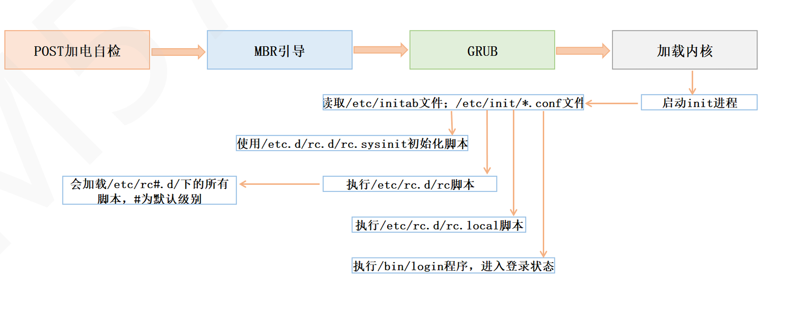

1. 加载BIOS的硬件信息，获取第一个启动设备 
2. 读取第一个启动设备MBR的引导加载程序(grub)的启动信息

3. 加载核心操作系统的核心信息，核心开始解压缩，并尝试驱动所有的硬件设备

4. 核心执行init程序，并获取默认的运行信息 
5. init程序执行/etc/rc.d/rc.sysinit文件，重新挂载根文件系统 
6. 启动核心的外挂模块 
7.  init执行运行的各个批处理文件(scripts) 
8. init执行/etc/rc.d/rc.local 
9. 执行/bin/login程序，等待用户登录 
10. 登录之后开始以Shell控制主机

**CentOS 7**

1. UEFi或BIOS初始化，运行POST开机自检 
2. 选择启动设备 
3. 引导装载程序， centos7是grub2，加载装载程序的配置文件： /etc/grub.d/，  /etc/default/grub ，/boot/grub2/grub.cfg 
4. 加载initramfs驱动模块（可以实现根文件系统的挂载） 
5. 加载虚拟根中的内核 
6. 虚拟根的内核初始化，Centos7使用systemd代替init，第一个进程 
7. 执行initrd.target 所有单元，包括挂载 /etc/fstab 
8. 从initramfs根文件系统切换到磁盘根目录 
9. systemd执行默认target配置，配置件/etc/systemd/system/default.target 
10. systemd执行sysinit.target初始化系统及basic.target准备操作系统 
11. systemd启动multi-user.target 下的本机与服务器服务 
12. systemd执行multi-user.target 下的/etc/rc.d/rc.local 
13. Systemd执行multi-user.target下的getty.target及登录服务 
14. systemd执行graphical需要的服务

### 11.2运行级别

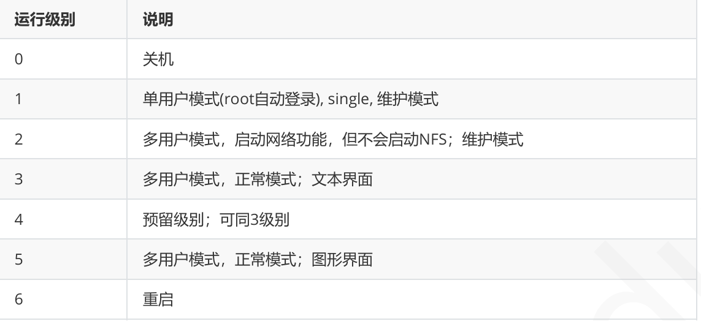

```bash
[root@c6 ~]# cat /etc/inittab
init N
```

centOS7开始，使用 target 来定义运行级别

```bash
#相当于查看之前的 /etc/inittab
 [root@rocky86 ~]# systemctl get-default
 graphical.target
```

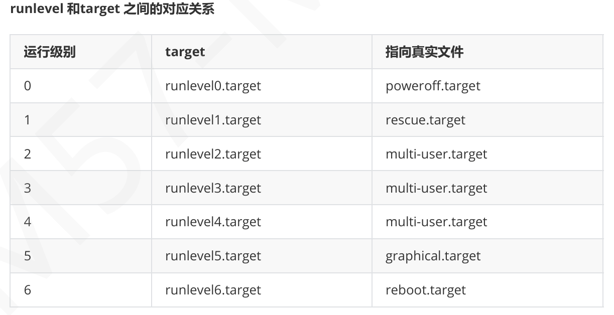

```bash
[root@ubuntu ~]# systemctl set-default multi-user.target
 Removed /etc/systemd/system/default.target.
 Created symlink /etc/systemd/system/default.target → 
/usr/lib/systemd/system/multi-user.target.
 [root@ubuntu ~]## ls -l /etc/systemd/system/default.target
 lrwxrwxrwx 1 root root 41 Sep  3 11:24 /etc/systemd/system/default.target -> 
/usr/lib/systemd/system/multi-user.target
 [root@ubuntu ~]# systemctl get-default
 multi-user.target
```

```bash
#切换至救援模式
systemctl rescue
 #切换至紧急模式
systemctl emergency
 #关机
systemctl halt
 systemctl poweroff
 #重启
systemctl reboot
 #挂起
systemctl suspend
#休眠
systemctl hibernate
 #休眠并挂起
systemctl hybrid-sleep
```


### 11.3开机启动文件rc.local

正常级别下，最后启动一个服务S99local没有链接至/etc/rc.d/init.d一个服务脚本，而是指向 了/etc/rc.d/rc.local脚本 不便或不需写为服务脚本放置于/etc/rc.d/init.d/目录，且又想开机时自动运行的命令，可直接放置 于/etc/rc.d/rc.local文件中 /etc/rc.d/rc.local在指定运行级别脚本后运行 注意：默认Ubuntu 无 /etc/rc.local 文件，需要手动创建并添加可执行权限，首行必须有shebang机制

### 11.4systemd

Systemd：从 CentOS 7 版本之后开始用 systemd 实现init进程，系统启动和服务器守护进程管理器， 负责在系统启动或运行时，激活系统资源，服务器进程和其它进程

11.4.1service 系统服务管理


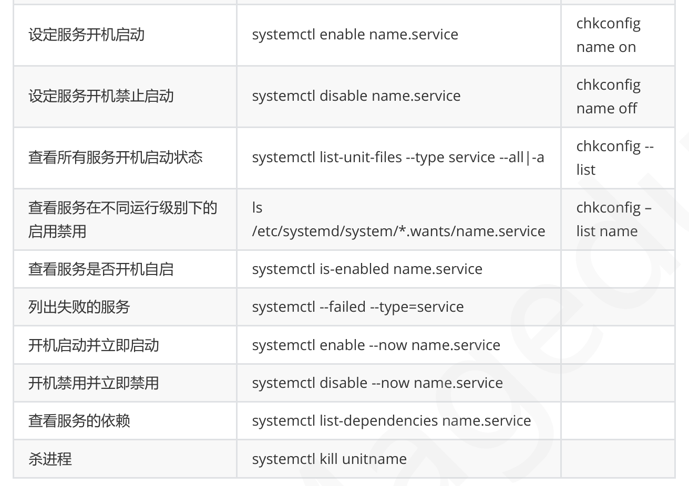

```bash
#reload
 [root@ubuntu ~]# systemctl daemon-reload
```

```bash
[root@ubuntu ~]# apt install nginx
 [root@ubuntu ~]# systemctl cat nginx.service 

[Service]
Type=forking
PIDFile=/run/nginx.pid
ExecStartPre=/usr/sbin/nginx -t -q -g 'daemon on; master_process on;'
ExecStart=/usr/sbin/nginx -g 'daemon on; master_process on;'
ExecReload=/usr/sbin/nginx -g 'daemon on; master_process on;' -s reload

ExecStop=-/sbin/start-stop-daemon --quiet --stop --retry QUIT/5 --pidfile 
/run/nginx.pid
 TimeoutStopSec=5
 KillMode=mixed
 [Install]
 WantedBy=multi-user.target
```

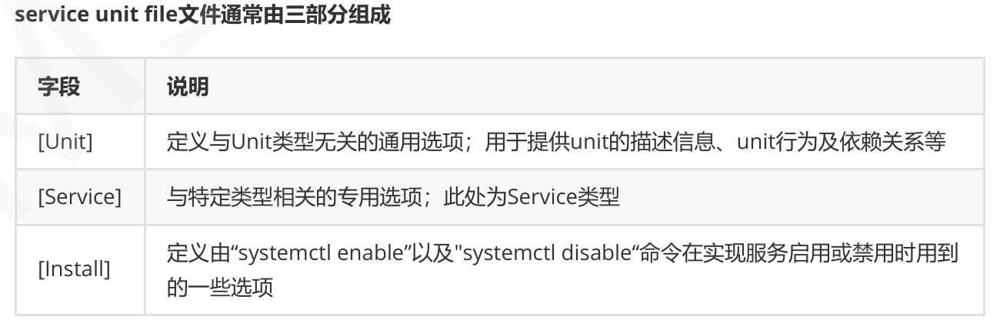

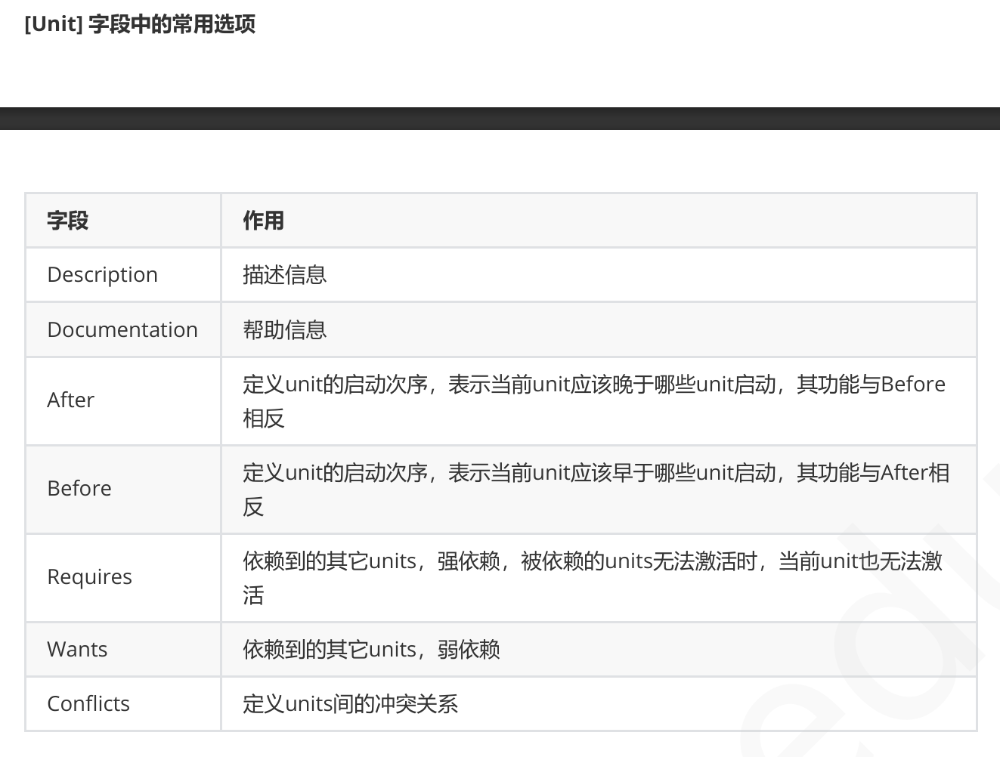

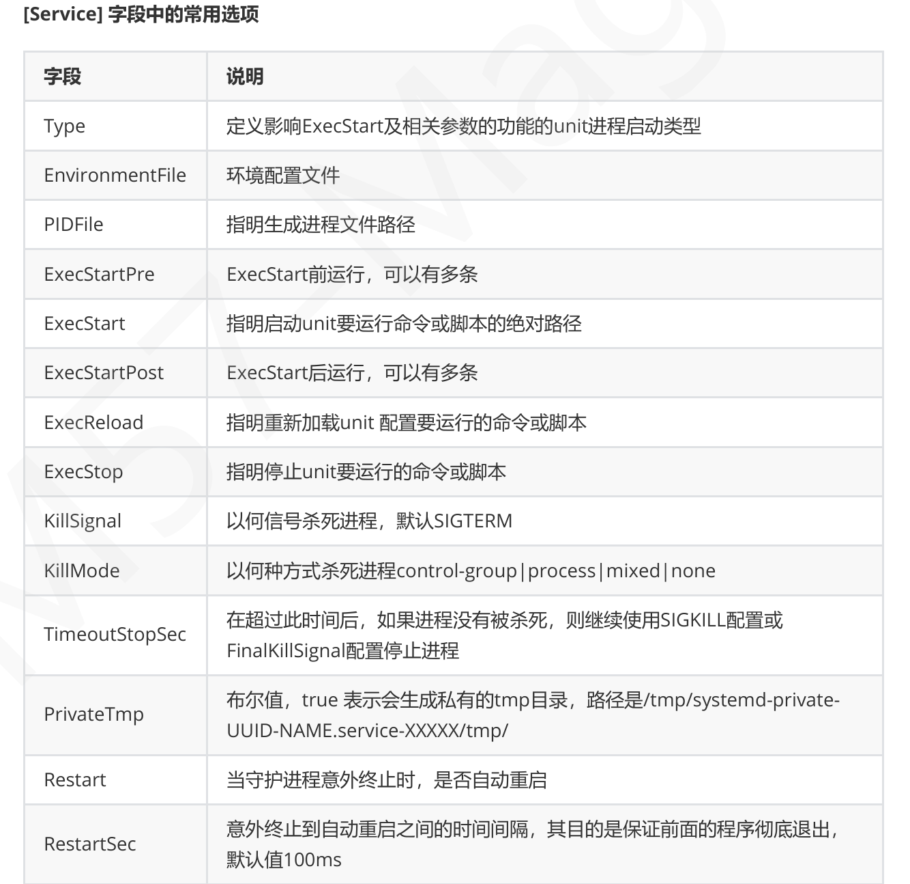

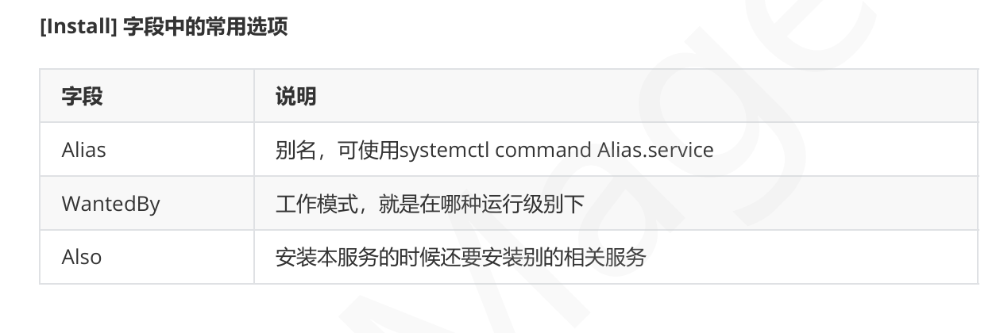

### 11.5内核参数管理

sysctl 命令用来配置linux 系统内核参数，这些参数以文件的形式显示在 /proc/sys/ 目录中， 配置项就是目录名加文件名，值就是该文件中的内容 注意：不是所有内核参数都是可以被修改的

```bash
#内核参数配置目录
[root@ubuntu ~]# ll /proc/sys
[root@ubuntu ~]# ll /proc/sys/net/ipv4/ip_forward
[root@ubuntu ~]# cat /proc/sys/net/ipv4/ip_forward
 0
```

```bash
[root@ubuntu ~]# sysctl -a | head

[root@ubuntu ~]# sysctl net.ipv4.ip_forward
 net.ipv4.ip_forward = 0
 #仅显示名称
[root@ubuntu ~]# sysctl -N net.ipv4.ip_forward
 net.ipv4.ip_forward
 #仅显示值
[root@ubuntu ~]# sysctl -n net.ipv4.ip_forward
 0
 #直接查看文件内容
[root@ubuntu ~]# cat /proc/sys/net/ipv4/ip_forward
 0
```

修改

```bash
[root@ubuntu ~]# sysctl -w net.ipv4.ip_forward=1
 net.ipv4.ip_forward = 1
 #查看
[root@ubuntu ~]# sysctl net.ipv4.ip_forward
 net.ipv4.ip_forward = 1
```

写配置文件，永久有效

```bash
[root@ubuntu ~]# vim /etc/sysctl.conf
 .....
 net.ipv4.ip_forward=0
 #还没有生效
[root@ubuntu ~]# sysctl net.ipv4.ip_forward
 net.ipv4.ip_forward = 1
 #重载生效
[root@ubuntu ~]# sysctl -p
 net.ipv4.ip_forward = 0
```

可用的配置文件 系统在启动时，会按下列顺序加载配置文件，读取参数值

```bash
/run/sysctl.d/*.conf  
/etc/sysctl.d/*.conf
 /usr/local/lib/sysctl.d/*.conf 
/usr/lib/sysctl.d/*.conf 
/lib/sysctl.d/*.conf
 /etc/sysctl.conf
```

#### 常用内核参数

```bash
net.ipv4.ip_forward #是否开启ipv4地址转发
net.ipv4.icmp_echo_ignore_all #是否禁用ping功能
net.ipv4.ip_nonlocal_bind   #允许应用程序可以监听本地不存在的IP
vm.drop_caches #缓存回收机制 3 回收所有 2 释放数据区和信息节点1 释放页面缓存
fs.file-max = 1020000 #内核可以支持的全局打开文件的最大数
vm.overcommit_memory = 0 #超分 0表示进程申请内存时会判断，不够则返回错
误，1表示内核允许分配所有的物理内存，而不管当前的内存状态如何，2表示内核允许分配超过所有物理内存
和交换空间总和的内存
vm.swappiness = 10           #使用swap空间时物量内存还有多少可用，10 表示物
理存只有10%时才使用swap
#禁用IPv6
net.ipv6.conf.all.disable_ipv6 = 1
net.ipv6.conf.default.disable_ipv6 = 1
```

对于网络接口的配置，则会在对应的网络接口出现的时候才会生效，具体来说就是 net.ipv4.conf，net.ipv6.conf，net.ipv4.neigh，net.ipv6.neigh 等参数。

有部份sysctl 参数仅在加载了相应的内核模块之后才可用，因为内核模块是按需动态加载的(例如加入了新的硬件或启动网络时)，所以在sysctl.conf 文件中无法设置的那些依赖于特定模块的参数。

## 12.DNS服务

### 12.1相关基础概念

**DNS** 就是负责维护主机IP地址和域名映射关系的服务，同时也提供域名解析服务，即人类通过域名访问某个主机或节点时，由DNS服务将人类可读的域名转换为机器可读的IP地址，再通过IP地址找到对应的主机。

**正向解析**：将域名解析成IP地址

**反向解析**：根据IP地址得到该IP地址指向的域名

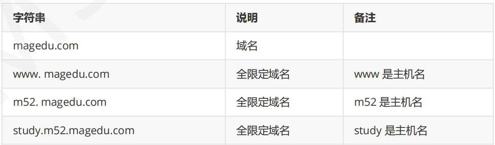

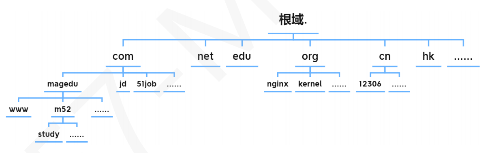

根域：全球共有13台IPV4根域名服务器，其中10台在美国，2台在欧洲，1台在亚洲

一级域名：又称顶级域名，可分为三类，一类代表国家和地区(cn，hk，......)，一类代表各类组织(com，edu，......)，以及反向域

二级域名：某个具体组织，单位，机构，商业公司或个人使用，需要向域名管理机构申请(付费)才能获得使用权

二级域名以下的域名，由使用该域名的组织自行分配

13台IPV4根域名服务器，并不是说只有13台服务器，而是指有13个IP地址向外提供一级域名的DNS解析服务，每个IP地址对应的，都是多机集群。

像根服务器这种公共DNS，一般都是使用任播(Anycast)技术来实现的。其原理比较复杂，简单来说，将多台服务器对外广播为同一个IP地址，然后网络上的主机在请求这个公共IP地址时，在路由过程中会被路径上最近的拥有该IP的服务器收到，如此，用户的请求总是会分配给最近的服务器。

**工作原理**：当用户使用主机 发送/接收 邮件，或浏览网页时，就是由主机上配置的DNS服务器地址负责将域名转换成对应的IP地址

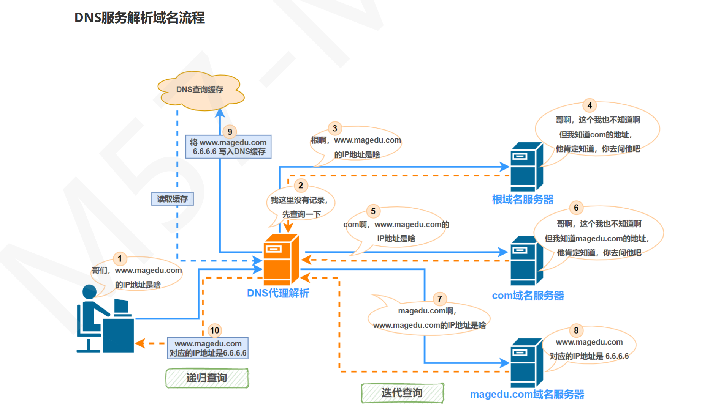

DNS服务只负责域名解析，也就是说，DNS服务，只负责返回与域名对应的IP地址，但该IP地址在网络上是否是可达的，并不由DNS决定

**递归查询**

是指DNS服务器在收到用户发起的请求时，必须向用户返回一个准确的查询结果。如果DNS服务器本地没有存储与之对应的信息，则该服务器需要询问其他服务器，并将返回的查询结果提交给用户。

**迭代查询**

是指DNS服务器在收到用户发起的请求时，并不直接回复查询结果，而是告诉另一台DNS服务器的地址，用户再向这台DNS服务器提交请求，这样依次反复，直到返回查询结果。

**DNS缓存**

DNS缓存是将解析数据存储在靠近发起请求的客户端的位置，也可以说DNS数据是可以缓存在任意位置，最终目的是以此减少递归查询过程，可以更快的让用户获得请求结果。

```bash
C:\Users\44301>ipconfig/displaydns
#刷新
C:\Users\44301>ipconfig/flushdns

[root@rocky86 ~]# nscd -g
#清空
[root@rocky86 ~]# nscd -i hosts

[root@ubuntu ~]# resolvectl statistics
[root@ubuntu ~]# resolvectl reset-statistics
```

**DNS配置及查看**

```bash
[root@rocky86 ~]# cat /etc/sysconfig/network-scripts/ifconfig-eth1
[root@rocky86 ~]# cat /etc/resolv.conf

[root@ubuntu ~]# cat /etc/netplan/00-installer-config.yaml
[root@ubuntu ~]# resolvectl status
```

**hosts文件**

```bash
C:\Windows\System32\drivers\etc\hosts

/etc/hosts
#在hosts文件中指定IP地址
[root@rocky86 ~]# vim /etc/hosts 
10.0.0.206 www.magedu.com
```

**完整的查询请求流程**

当主机请求一个域名时

1 先查询本地 hosts 文件，是否有对应IP地址，如果有，则直接访问该IP地址，域名解析服务结束；

2 如果本地 hosts 文件中没有对应IP地址，则查询本地DNS缓存，如果本地DNS缓存中有对应IP地址，则直接访问该IP地址，域名解析服务结束；

3 如果没有本地DNS缓存，或本地DNS缓存中没有该域名的IP地址，则请求主机配置的DNS服务器来解析该域名；

4 DNS服务器经过迭代查询，将查询结果返回给主机，主机根据返回结果访问对应IP地址；

解析记录的种类：

```powershell
A   ipv4     
AAAA ipv6
PTR    ip--->域名      #证明自己是安全的
NS     证明该ip地址是DNS服务器
SOA    证明自己是权威的
CNAME  别名记录
SRV     promethues
MX     邮件场景
```


### 12.2云上DNS

要在互联网上运行一个可以被访问的项目，我们至少需要一个域名，一个服务器，一个固定IP地址。

如果没有域名，可以先购买域名

如果没有主机，可以先购买主机


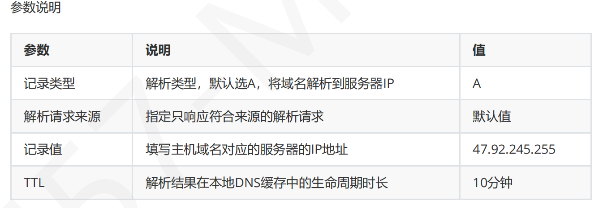

### 12.3DNS检测工具

#### **dig**

dig：(Domain Information Groper) 域名信息查询工具

dig 命令不会查询本地 hosts文件中定义的域名和IP对应关系

```bash
#安装
[root@ubuntu ~]# apt install bind9
#查询来源
root@ubuntu ~]# dpkg -S /usr/bin/dig
bind9-dnsutils: /usr/bin/dig

[root@ubuntu ~]# dig
[root@ubuntu ~]# dig www.jose-404.com

#指定DNS服务器，指定本机请求DNS服务的IP
[root@ubuntu ~]# dig @114.114.114.114 www.jose-404.com -b 10.0.0.206

#反向解析
[root@rocky86 ~]# dig -x 47.94.245.255 +nocmd

#短
[root@ubuntu ~]# dig www.jose-404.com +short
47.94.245.255

[root@ubuntu ~]# cat domain.txt 
www.baidu.com
www.jd.com
[root@ubuntu ~]# dig -f domain.txt +short
```

#### host

host 命令不会查询本地 hosts文件中定义的域名和IP对应关系

```bash
[root@ubuntu ~]# host www.magedu.com
www.magedu.com has address 10.0.0.206

[root@ubuntu ~]# host www.magedu.com 114.114.114.114
Using domain server:
Name: 114.114.114.114
Address: 114.114.114.114

#显示所有信息-a
```

#### nslookup

nslookup：(name server lookup)，一个命令行下的网络工具，主要用来查询DNS记录，查看域名解析是否正常，也可用来诊断网络问题

nslookup 命令不会查询本地 hosts文件中定义的域名和IP对应关系，也不能查询dns的递归或者迭代

```bash
[root@ubuntu ~]# nslookup www.magedu.com
[root@ubuntu ~]# nslookup
> www.magedu.com

C:\Users\44301>nslookup

[root@ubuntu ~]# nslookup www.magedu.com 114.114.114.114
[root@ubuntu ~]# nslookup -type=cname www.baidu.com
```

#### whois

whois 命令可以查询域名注册信息

```bash
[root@ubuntu ~]# whois jose-404.com|head
```


### 12.4自建DNS服务

#### 12.4.1bind安装配置

**bind自解析/主从/主从同步/重启同步(不更改序列号)/反向解析/子域/DNS转发**

主域，子域

```go
zone "magedu.com" {
    type master;
    file "/etc/bind/db.magedu.com";
};

zone "cc.magedu.com" {
    type master;
    file "/etc/bind/db.cc.magedu.com";
};
```

**根->一级->二级->子域，一级一级找，找完会有DNS缓存，下一次就直接访问到了**

能实现DNS功能的软件有很多，像 bind，powerdns，dnsmasq，unbound，coredns等

bind 是一款实现DNS服务的开放源码软件，由伯克利大学开发，能够提供双向解析，转发，子域授权，view 等功能，使用广泛，目前Internet上半数以上的DNS服务器都是由Bind来实现的。

```bash
[root@ubuntu ~]# apt install -y bind9
[root@ubuntu ~]# apt list bind* --installed
#服务端包

[root@ubuntu ~]# systemctl enable --now named.service
[root@ubuntu ~]# ss -tunlp | grep named
```

测试

```bash
#在网卡中配置
[root@ubuntu ~]# cat /etc/netplan/00-installer-config.yaml
network:
 renderer: NetworkManager
 ethernets:
   eth0:
      #dhcp4: true
     addresses: [10.0.0.206/24]
     gateway4: 10.0.0.2
     nameservers:
       search: [magedu.com,magedu.org]
       addresses: [127.0.0.1]
 version: 2
 
 #去掉全局配置，在该文件中注释掉DNS行
[root@ubuntu ~]# vim /etc/systemd/resolved.conf
[root@ubuntu ~]# netplan apply
[root@ubuntu ~]# systemctl restart systemd-resolved.service
#查看
[root@ubuntu ~]# cat /etc/resolv.conf
......
nameserver 127.0.0.1
search magedu.com magedu.org

#测试
[root@ubuntu ~]# nslookup www.magedu.com
```

bind己经内置了13个根域名服务器地址

将其它机器的DNS指向本机

```bash
[root@rocky ~]# cat /etc/resolv.conf 
# Generated by NetworkManager
search localdomain
nameserver 10.0.0.206
[root@rocky ~]# dig www.magedu.com
```

#### 相关配置文件

```bash
[root@ubuntu bind]# cat /etc/bind/named.conf
```

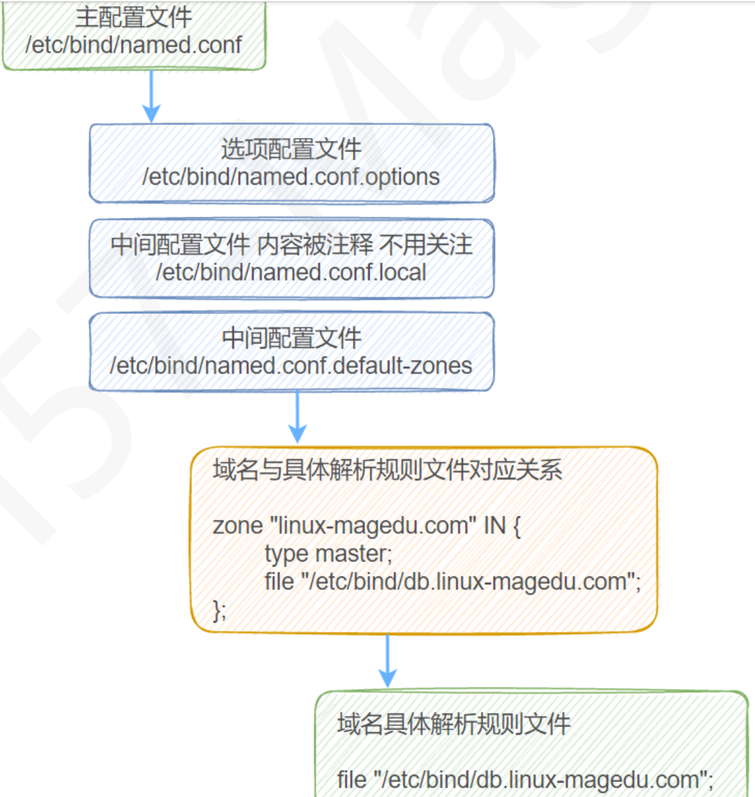

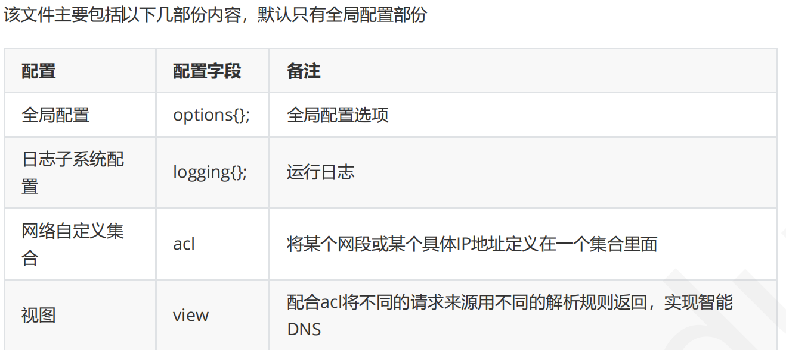

```bash
#常用全局配置选项
options {
 
 #此配置表示DNS服务只监听了本机127.0.0.1的53端口，如果对外提供DNS服务，可以将此行注释或值改成any
 listen-on port 53 { 127.0.0.1; }; 
 
 #监听IPV6的53端口，配置方法同上
 listen-on-v6 port 53 { ::1; };
 
 #监听本机所有IPV6地址，不想监听IPV6地址，可以将 any 改成 none
 listen-on-v6 { any; };
 
 #此配置表示仅本机可以使用DNS服务的解析查询功能，如果对外提供DNS服务，可以将此行注释或值改成any
 allow-query     { localhost; }; 
 #是否启用加密验证，在使用转发的时候，将此项改为 no
 dnssec-validation auto;
 #转发服务器
 forwarders { 10.0.0.207; }; 
    
    #转发策略,具体见后续章节
 forward first; 
};
```

**中间配置文件** **/etc/bind/named.conf.default-zones**

该文件中定义了要解析的域名与具体解析规则之间的对应关系

```bash
zone "ZONE_NAME" IN { #IN 可以省略不写
 type {master|slave|hint|forward}; #类型 master,slave 用于DNS主从,forward表示转发
 file "file_path"; #具体解析规则文件路径
};
```

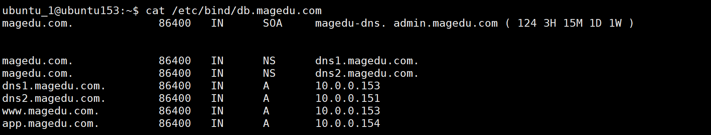


**allow** **访问控制指令**

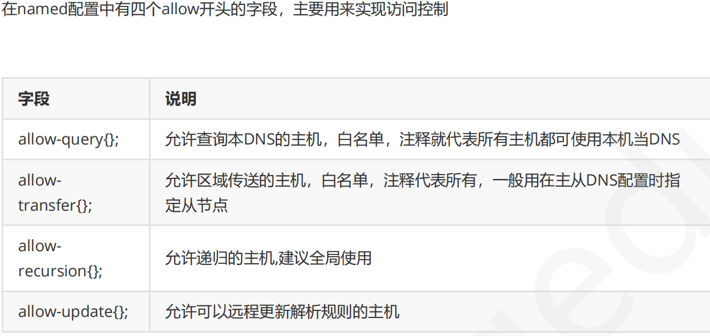

**acl** **地址集合**

**acl+view实现不同用户访问同一域名解析不同IP**

ACL：将一个或多个网段(或具体IP地址)定义在一个集合里面，并通过统一的名称进行调用。

ACL 只能先定义后调用，因此一般放在配置文件的最上面，在 options 之前定义。

```bash
acl ACL_NAME{
 IP;
 IP;
 NET/NETMAST;
 NET/NETMAST;
 ......
};
```

**view** **视图**

view：视图，将ACL和具体的解析规则对应起来，实现根据条件解析，实现智能DNS

每个view用来匹配一个ACL；

一个bind服务可以可以定义多个view，每个view 中可定义的一个或多个zone;

不同的view中可以对同一个域名进行解析，返回不同的解析结果；

如果定义了view，则所有的zone规则都要写在view中了，不能再直接写在 /etc/named.conf 中了；

客户端请求到达时，是自上而下检查每个view所对应的ACL的，也就是说，如果请求被命中了，就进入解析，不再向后匹配；

view格式

```bash
view VIEW_NAME{
 match-clients { acl_name; };
 zone "domain" IN {
 type mater;
 file "domain.zone";
 };
 include "/etc/named.rfc1912.zones.domain"
};
view prod_view{
 match-clients { prod_net; };
 include "/etc/named.rfc1912.zones";
 include "/etc/named.rfc1912.zones.prod";
};
```

**具体解析规则** **/etc/bind/db.\***

该文件定义域名的具体解析规则，该文件有多条资源记录组成，每一行都是一条资源记录，在RFC文档中，DNS解析记录被称为Resource Recode（资源记录），缩写为 RR

**Resource Recode** **定义**

NAME  TTL  CLASS  TYPE  VALUE

#### 实现自解析


```bash
#在DNS SERVER 上实域名解析

#新增 zones 记录
[root@ubuntu ~]# vim /etc/bind/named.conf.default-zones
......
zone "linux-magedu.com" IN { # IN 可以省略不写
 type master;
 file "/etc/bind/db.linux-magedu.com";
};

#设置具体解析规则
[root@ubuntu ~]# cat /etc/bind/db.linux-magedu.com
linux-magedu.com.       86400 IN SOA linux-magedu-dns. admin.linux-magedu.com. 
( 123 3H 15M 1D 1W )
linux-magedu.com.       86400 IN NS dns1.linux-magedu.com.
dns1.linux-magedu.com.  86400 IN A  10.0.0.206
www.linux-magedu.com.   86400 IN A 10.0.0.210

#修改权限，修改属主属组
[root@ubuntu ~]# chmod 644 /etc/bind/db.linux-magedu.com 
[root@ubuntu ~]# chown root.root /etc/bind/db.linux-magedu.com

[root@ubuntu ~]# ll /etc/bind/db.linux-magedu.com

#语法检查
[root@ubuntu ~]# named-checkzone linux-magedu.com /etc/bind/db.linux-magedu.com
#重载生效
[root@ubuntu ~]# rndc reload
```

在web服务主机上实现网站

### 12.5DNS转发

DNS转发可以分为**两种类型**：正向转发和反向转发。

 正向转发fi：当本地DNS服务器无法解析一个域名时，它将该请求转发给其他DNS服务器，并等待响应。一旦收到响应，本地DNS服务器将结果返回给客户端。

 反向转发only：当本地DNS服务器收到一个IP地址的查询请求时，它将该请求转发给其他DNS服务器，并等待响应。一旦收到响应，本地DNS服务器将结果返回给客户端。

**两种模式**

**First模式**适用于那些希望首先利用上游DNS服务器的解析能力，同时保留本地DNS服务器递归查询能力的网络环境。

**Only模式**，本地DNS只问上游

两种模式都是先问上游

```shell
root@ubuntu24:~# vim /etc/bind/named.conf.options
options {
 ......
 dnssec-validation no; #关闭加密验证 【很重要】
 forwarders { 10.0.0.14; }; #转发服务器
 forward first; #转发策略，如果间接DNS没有返回，则直接DNS再次向
根域请求解析
};
检查配置文件
root@ubuntu24:~# named-checkconf
root@ubuntu24:~# systemctl restart named
```

特定域转发

```go
zone "golang-magedu.com" IN {
  type forward;
  forward first;
  forwarders {10.0.0.14;};
};
```


### 12.6智能DNS解析介绍

我们前面使用bind中的视图，实现了基于不同来源的客户端IP，对同一个域名，返回不同的解析结果。

所谓智能DNS，也是根据不同的条件，对相同的域名解析不同的具体IP地址，但其实现，远比bind中用视图复杂得多。

目前很多DNS服务商都提供了智能DNS服务，智能DNS可以通过多种策略来将客户端需要访问的域名解

析到不同的数据中心或不同的运营商网路上，比如通过请求者的IP地址得到客户端的地理位置来判断用户的就近性，并结合健康检查策略，将请求解析到最近的服务器上。

#### 12.5.1GSLB 全局负载均衡

GSLB：Global Server Load Balance，全局负载均衡

GSLB 是在广域网上，对不同地域的服务器间的流量进行调度，通过判断服务器的负载，带宽的负载等，决定服务器的可用性，同时判断客户端与服务器之间的链路状况，选择与客户端最佳匹配的服务器，并将客户端请求调度到该服务器上。

GSLB 的实现有三种方式：基于DNS实现、基于重定向实现、基于路由协议实现，其中最通用的是基于DNS的实现。

GSLB 的使用范围：常用于有异地机房的WEB系统，或在CDN系统中作为核心的流量调度系统。

```bash
[root@ubuntu ~]# nslookup www.vip.com
Server: 127.0.0.1
Address: 127.0.0.1#53
#将 www.vip.com 的域名解析 cname 到 shop.vip.com.vipgslb.com
#由 shop.vip.com.vipgslb.com 在 DNS层面实现流量负载
Non-authoritative answer:
www.vip.com canonical name = shop.vip.com.vipgslb.com.
Name: shop.vip.com.vipgslb.com
Address: 14.215.62.24
```


#### 12.5.2CDN

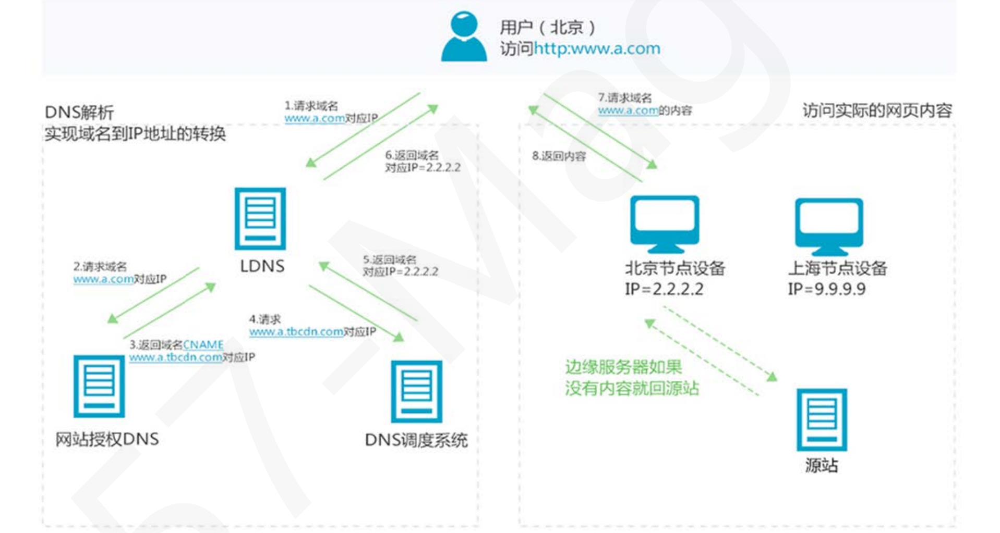

```bash
#在阿里云北京机房测试 www.baidu.com
root@jose-404:~# nslookup www.baidu.com
Server: 127.0.0.53
Address: 127.0.0.53#53
Non-authoritative answer:
www.baidu.com canonical name = www.a.shifen.com.
Name: www.a.shifen.com
Address: 110.242.68.3
Name: www.a.shifen.com
Address: 110.242.68.4
#在广州测试 www.baidu.com
[root@rocky86 ~]# nslookup www.baidu.com
Server: 10.0.0.2
Address: 10.0.0.2#53
Non-authoritative answer:
www.baidu.com canonical name = www.a.shifen.com.
Name: www.a.shifen.com
Address: 163.177.151.109
Name: www.a.shifen.com
Address: 163.177.151.110
```

百度将域名 cname 到 www.a.shifen.com，由www.a.shifen.com 负责解析，根据访问者地理位置，返回最近的CDN节点IP

**CDN服务商**

国内常用的 CDN 服务商包括 阿里，腾讯，蓝汛，网宿，帝联，七牛等

**CDN加速测试**

https://www.boce.com/

## 13.加密安全及时间同步

### 13.1安全机制

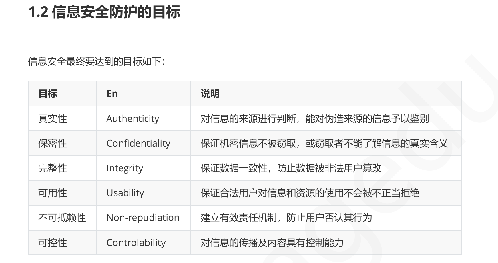

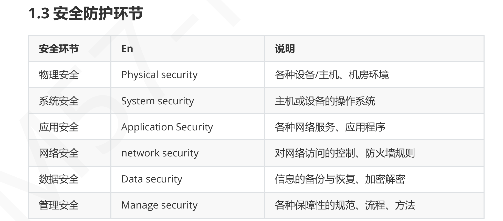

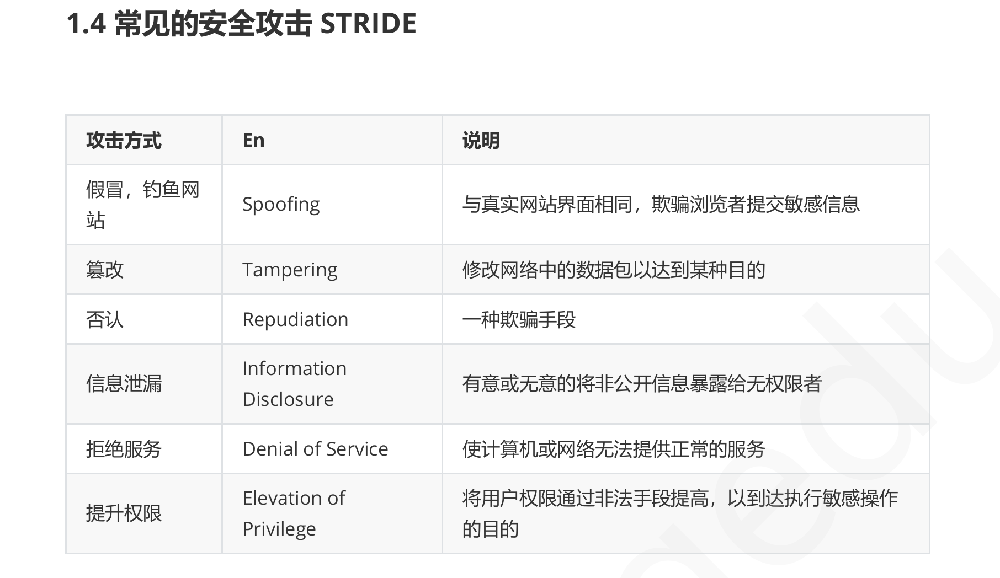

**安全设计基本原则**

使用成熟的安全系统 以小人之心度输入数据  外部系统是不安全的 最小授权  减少外部接口 缺省使用安全模式 安全不是似是而非 从STRIDE思考 在入口处检查 从管理上保护好你的系统

**常用安全技术**

认证 授权 审计 安全通信

#### 加密算法和协议

常用的加密算法包括：对称加密，非对称加密，单向加密

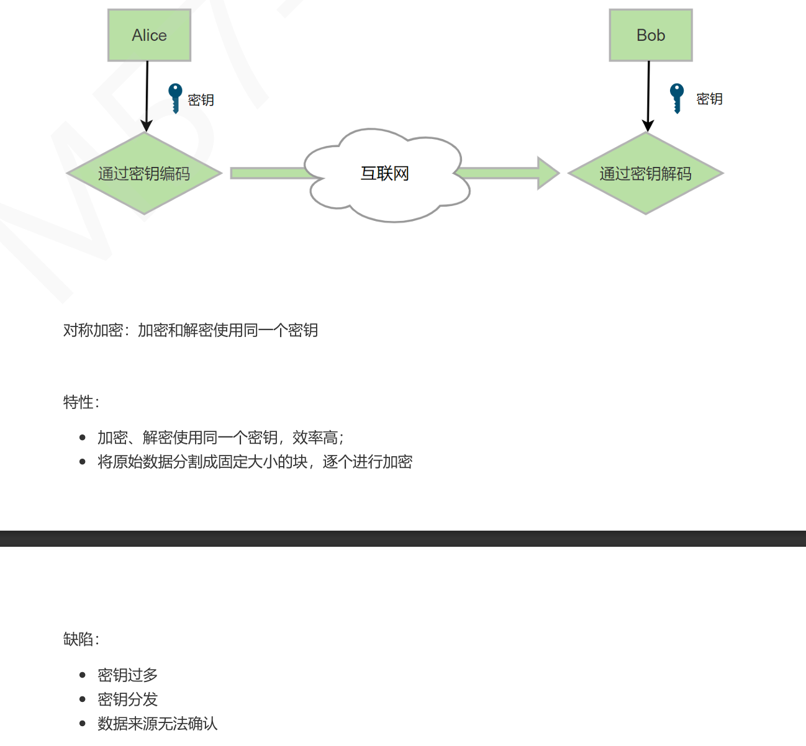

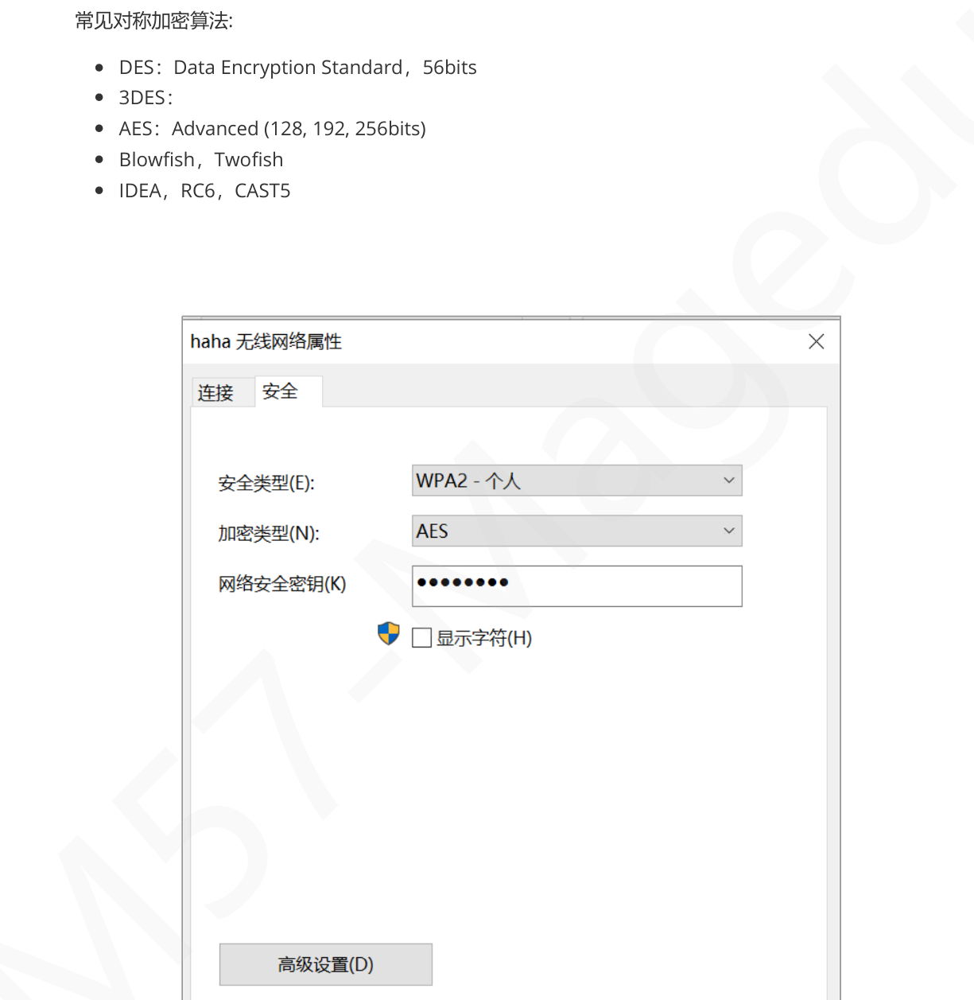

#### 非对称加密算法


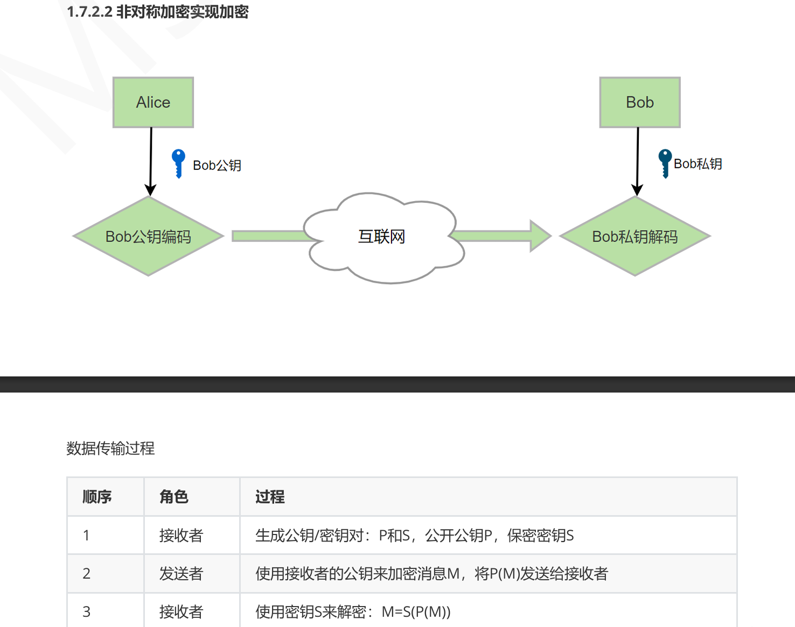

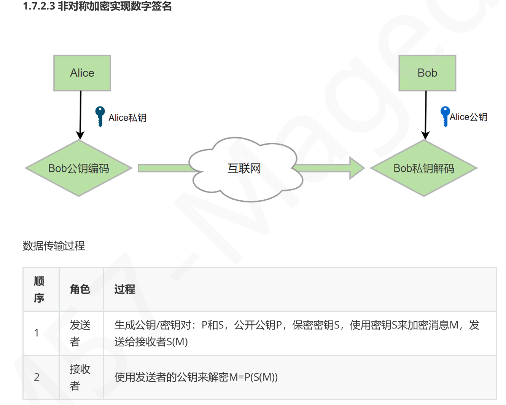

RSA：将两个大素数相乘十分容易，但那时想要对其乘积进行因式分解却极其困难，因此可以将乘积公开作为加密密钥

DSA (Digital Signature Algorithm)：DSA是基于整数有限域离散对数难题的，其安全性与RSA相比差不多。DSA只是一种算法，和RSA不同之处在于它 不能用作加密和解密，也不能进行密钥交换，只用于签名，它比RSA要快很多

#### 单向哈希算法

哈希算法：也称为散列算法，将任意数据缩小成固定大小的 “指纹”，称为digest，即摘要

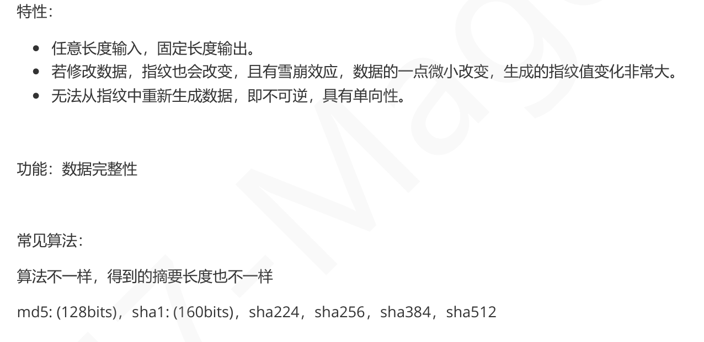

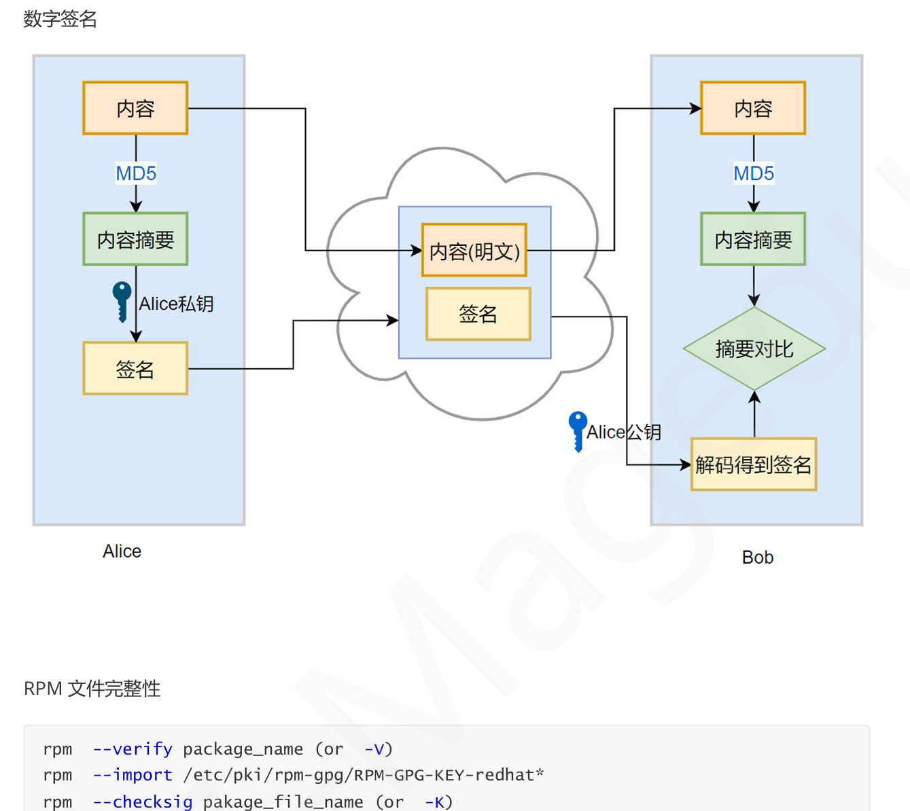

**综合加密和签名**

即实现数据加密，又可以保证数据来源的可靠性、数据的完整性和一致性

方法1：Pb{Sa[hash(data)]+data}

方法2：对称key{Sa[hash(data)]+data}+Pb(对称key)

#### CA和证书

**中间人攻击**


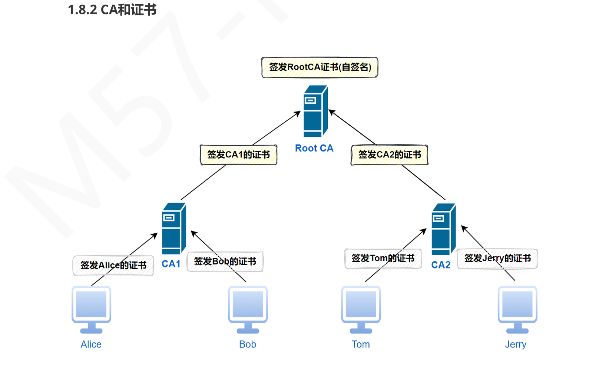

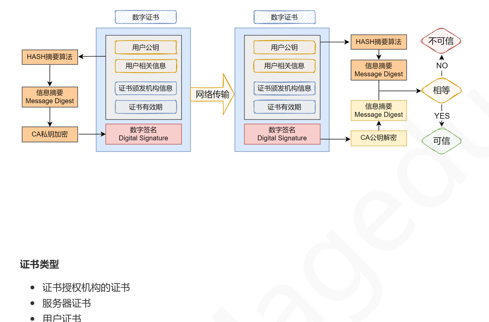

获取证书两种方法 自签名的证书： 自已签发自己的公钥 使用证书授权机构：1 生成证书请求 csr；2 将证书请求csr 发送给CA；3 CA 颁发签名证书

#### 安全协议 SSL/TLS

SSL：Secure Socket Layer，TLS: Transport Layer Security

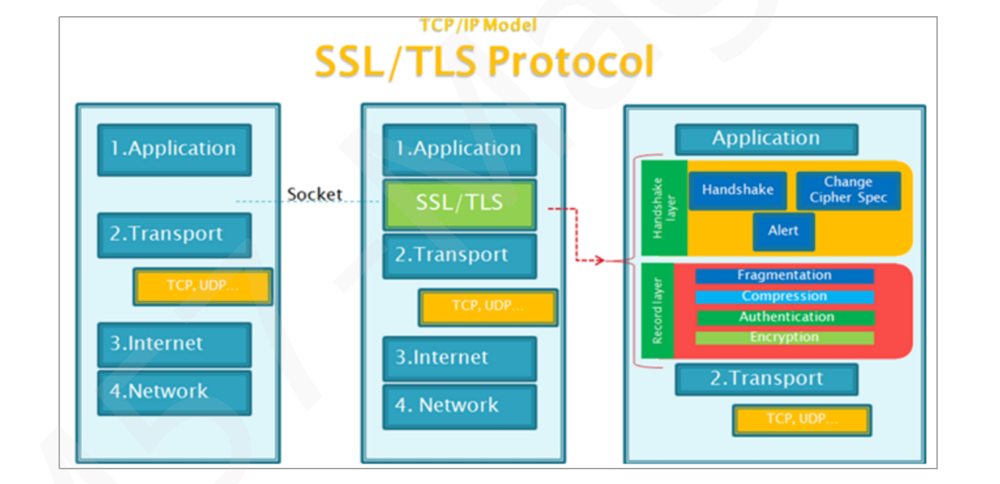

#### HTTPS

HTTPS 协议：就是“HTTP 协议”和“SSL/TLS 协议”的组合。HTTP over SSL 或 HTTP over TLS ，对http协议的文本数据进行加密处理后，成为二进制形式传输

1.客户端发起HTTPS请求 用户在浏览器里输入一个https网址，然后连接到服务器的443端口。

2.服务端的配置 采用HTTPS协议的服务器必须要有一套数字证书，可以自己制作，也可以向组织申请。区别就是 自己颁发的证书需要客户端验证通过，才可以继续访问，而使用受信任的公司申请的证书则不会弹 出提示页面。这套证书其实就是一对公钥和私钥。

3.传送服务器的证书给客户端 证书里其实就是公钥，并且还包含了很多信息，如证书的颁发机构，过期时间等等。

4.客户端解析验证服务器证书 这部分工作是由客户端的TLS来完成的，首先会验证公钥是否有效，比如：颁发机构，过期时间 等等，如果发现异常，则会弹出一个警告框，提示证书存在问题。如果证书没有问题，那么就生成 一个随机值。然后用证书中公钥对该随机值进行非对称加密。

5.客户端将加密信息传送服务器,这部分传送的是用证书加密后的随机值，目的就是让服务端得到这个随机值，以后客户端和服务 端的通信就可以通过这个随机值来进行加密解密了。

6.服务端解密信息 服务端将客户端发送过来的加密信息用服务器私钥解密后，得到了客户端传过来的随机值。这个 随机值，就是对称加密的密钥，至此，完成了对称加密密钥的协商。

7.服务器加密信息并发送信息 服务器将数据利用随机值进行对称加密，再发送给客户端。

8.客户端接收并解密信息 客户端用之前生成的随机值解密服务端传过来的数据，于是获取了解密后的内容。

### 13.2OpenSSL

Openssl功能主要包括对称加密（DES、3DES、AES等），非对称加密（RSA），散列（MD5、SHA1 等）以及证书的相关操作（创建、申请、颁发、吊销等）。

包括三个组件： libcrypto：用于实现加密和解密的库 libssl：用于实现ssl通信协议的安全库 openssl：多用途命令行工具

```bash
#rocky
[root@rocky ~]# openssl version

#列出所有标准命令
[root@ubuntu ~]# openssl list --commands
#查看所有摘要命令和摘要算法：
[root@ubuntu ~]# openssl list -digest-commands
```

```bash
[root@ubuntu ~]# openssl md5 /etc/shadow
 MD5(/etc/shadow)= 3edae07c5e4d49e08cae2e1eeb3bd258
 [root@ubuntu ~]# openssl dgst -md5 /etc/shadow
 MD5(/etc/shadow)= 3edae07c5e4d49e08cae2e1eeb3bd258
 [root@ubuntu ~]# md5sum /etc/shadow
 3edae07c5e4d49e08cae2e1eeb3bd258  /etc/shadow
 
 #默认 md5
 [root@ubuntu ~]# openssl passwd 123456
```

#### openssl 实现密钥对

```bash
#生成私钥
[root@ubuntu ~]# openssl genrsa -out test.key
 #从指定私钥提取出公钥
[root@ubuntu ~]# openssl rsa -in test.key -pubout -out test.pubkey
```

生成私钥时加密

```bash
#指定加密算法，指定口令
[root@ubuntu ~]# openssl genrsa -out test2.key -des3 -passout pass:"123456"
 #解密加密的私钥
[root@ubuntu ~]# openssl rsa -in test2.key -out test2.key2
 #提取公钥要求输入密码
[root@ubuntu ~]# openssl rsa -in test2.key -pubout -out test2.pubkey
```

#### 建立私有CA实现证书申请颁发

```bash
#安装包
[root@rocky86 ~]# yum install openssl-libs 
#查看配置文件
[root@rocky86 ~]# cat /etc/pki/tls/openssl.cnf

#安装包
[root@ubuntu ~]# apt install libssl-dev
 #查看配置文件
[root@ubuntu ~]# cat /etc/ssl/openssl.cnf
```

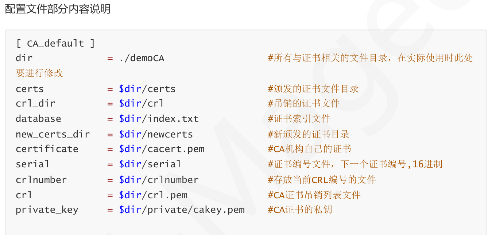

**创建私有CA**

1、创建CA所需要的文件

```bash
#创建相关目录
[root@ubuntu ~]# mkdir -pv /etc/pki/CA/{certs,crl,newcerts,private}
[root@ubuntu ~]# tree /etc/pki/CA/
```

2、 生成CA私钥

```bash
[root@ubuntu ~]# cd /etc/pki/CA/
[root@ubuntu CA]# openssl genrsa -out private/cakey.pem 2048
```

3、生成CA自签名证书

```bash
[root@ubuntu CA]# openssl req -new -x509 -key /etc/pki/CA/private/cakey.pem -days3650 -out /etc/pki/CA/cacert.pem
#查看证书
[root@ubuntu CA]# cat /etc/pki/CA/cacert.pem
#查看证书
[root@ubuntu CA]# openssl x509 -in /etc/pki/CA/cacert.pem -noout -text
```

4、查看证书中的信息

```bash
#根据编号查看状态
[root@ubuntu CA]# openssl ca -status 0F
```

如果证书申请文件中的配置项与CA机构的匹配规则不一致，将无法签发证书

#### 吊销证书

在客户端获取要吊销的证书的 serial

```bash
[root@ubuntu CA]# openssl x509 -in /etc/pki/CA/certs/test.crt -noout -serial -subject
```

在CA上，根据客户提交的 serial 与 subject 信息，对比检验是否与 index.txt 文件中的信息一致，吊销证书

```bash
[root@ubuntu CA]# openssl ca -revoke /etc/pki/CA/certs/test.crt
[root@ubuntu CA]# cat /etc/pki/CA/index.txt
#指定第一个吊销证书的编号，注意：第一次更新证书吊销列表前，才需要执行
[root@ubuntu CA]# echo 01 > /etc/pki/CA/crlnumber
#更新证书吊销列表
[root@ubuntu CA]# openssl ca -gencrl -out /etc/pki/CA/crl.pem
 Using configuration from /usr/lib/ssl/openssl.cnf
```

#### CentOS7 创建自签名证书

```bash
[root@centos7 certs]# cd /etc/pki/tls/certs
 [root@centos7 certs]# make
 [root@centos7 certs]# cat Makefile
```

#### Ubuntu上实现私有CA和证书申请

```bash
[root@ubuntu ~]# mkdir -pv /etc/pki/CA/{certs,crl,newcerts,private}
 [root@ubuntu ~]# tree /etc/pki/CA/
 [root@ubuntu ~]# touch /etc/pki/CA/index.txt
 [root@ubuntu ~]# echo 0F > /etc/pki/CA/serial
```

创建CA的私钥

```bash
[root@ubuntu ~]# cd /etc/pki/CA/
 [root@ubuntu CA]# openssl genrsa -out private/cakey.pem 2048
 [root@ubuntu CA]# tree
 [root@ubuntu CA]# ls -l private/
 [root@ubuntu CA]# cat private/cakey.pem
```

给CA颁发自签名证书

```bash
[root@ubuntu CA]# openssl req -new -x509 -key /etc/pki/CA/private/cakey.pem -days 3650 -out /etc/pki/CA/cacert.pem
[root@ubuntu CA]# tree /etc/pki/CA/
#查看
[root@ubuntu CA]# cat /etc/pki/CA/cacert.pem
 #查看
[root@ubuntu CA]# openssl x509 -in /etc/pki/CA/cacert.pem -noout -text
 #将文件cacert.pem传到windows上，修改文件名为cacert.pem.crt，双击查看
[root@ubuntu CA]# sz /etc/pki/CA/cacert.pem 
```

用户生成私钥和证书申请

```bash
[root@ubuntu ~]# mkdir /data/app1
 #生成私钥文件
[root@ubuntu ~]# openssl genrsa -out /data/app1/app1.key 2048
 [root@ubuntu ~]# cat /data/app1/app1.key
 #生成证书申请文件
[root@ubuntu CA]# openssl req -new -key /data/app1/app1.key -out /data/app1/app1.csr
[root@ubuntu ~]# ls -l /data/app1/
```

CA颁发证书

```bash
[root@ubuntu CA]# openssl ca -in /data/app1/app1.csr -out /etc/pki/CA/certs/app1.crt -days 1000
```

查看证书

```bash
[root@ubuntu CA]# cat /etc/pki/CA/certs/app1.crt
[root@ubuntu CA]# openssl x509 -in /etc/pki/CA/certs/app1.crt -noout -issuer
[root@ubuntu CA]# openssl x509 -in /etc/pki/CA/certs/app1.crt -noout -issuer
[root@ubuntu CA]# openssl x509 -in /etc/pki/CA/certs/app1.crt -noout -dates
[root@ubuntu CA]# openssl x509 -in /etc/pki/CA/certs/app1.crt -noout -serial
#验证指定编号对应证书的有效性
[root@ubuntu CA]# openssl ca -status 0F
[root@ubuntu CA]# cat /etc/pki/CA/index.txt

[root@ubuntu CA]# cat /etc/pki/CA/index.txt.old
 [root@ubuntu CA]# cat /etc/pki/CA/serial
 [root@ubuntu CA]# cat /etc/pki/CA/serial.old
```

将证书相关文件发送到用户端使用

```bash
[root@ubuntu CA]# cp /etc/pki/CA/certs/app1.crt /data/app1/
 [root@ubuntu CA]# tree /data/app1/
```

证书的信任

浏览器设置-->证书管理-->导入

证书的吊销

```bash
[root@ubuntu CA]# openssl ca -revoke /etc/pki/CA/newcerts/0F.pem
[root@ubuntu CA]# openssl ca -status 0F
[root@ubuntu CA]# cat /etc/pki/CA/index.txt
```

生成证书吊销列表文件

```bash
[root@ubuntu CA]# echo 01 > /etc/pki/CA/crlnumber
 [root@ubuntu CA]# openssl ca -gencrl -out /etc/pki/CA/crl.pem
 [root@ubuntu CA]# cat /etc/pki/CA/crlnumber
 [root@ubuntu CA]# cat /etc/pki/CA/crl.pem
 [root@ubuntu CA]# openssl crl -in /etc/pki/CA/crl.pem -noout -text
```

### 13.3ssh服务

SSH：Secure Shell Protocol ，安全的shell协议

SSH服务默认使用TCP的22端口

OpenSSH：ssh协议的开源实现，CentOS 默认安装

v2：双方主机协议选择安全的MAC方式，基于DH算法做密钥交换，基于RSA或DSA实现身份认证

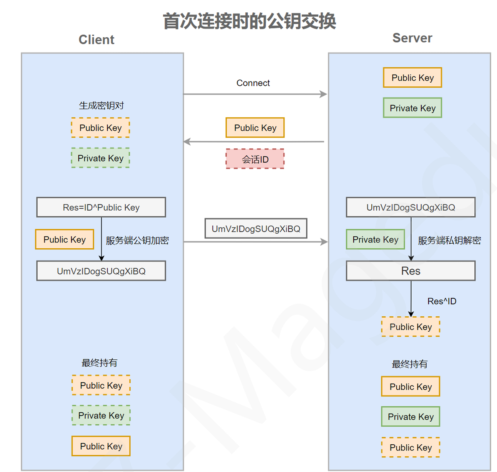

1. 客户端发起链接请求  
2. 服务端返回自己的公钥，以及一个会话ID（这一步客户端得到服务端公钥）  
3. 客户端生成密钥对 ----- 没有实体文件 
4. 客户端用自己的公钥异或会话ID，计算出一个值Res，并用服务端的公钥加密  
5. 客户端发送加密后的值到服务端，服务端用私钥解密，得到Res  
6. 服务端用解密后的值Res异或会话ID，计算出客户端的公钥（这一步服务端得到客户端公钥） 
7. 最终：**双方各自持有三个秘钥，分别为自己的一对公、私钥，以及对方的公钥，之后的所有通讯都 会被加密**

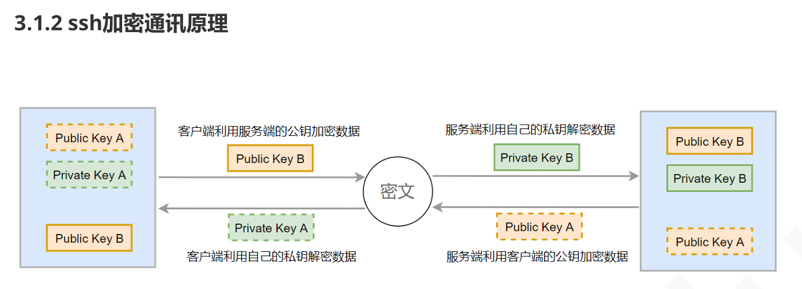

客户端ssh命令

```bash
#首次连接，会显示目标主机的指纹信息，并提示是否继续
#敲yes后会将目标主机的公钥保存在当前用户的~/.ssh/know_hosts 文件中
root@ubuntu2204:~# ssh root@10.0.0.206
```

**客户端scp命令**

scp 命令利用ssh协议在两台主机之间复制文件

```bash
#将远程主机文件复制到本地
[root@rocky86 ~]# scp root@10.0.0.157:/home/jose/test.sh .

#源和目标都不是本机
[root@rocky86 ~]# scp jose@10.0.0.157:test.sh root@10.0.0.154:

#复制目录
[root@ubuntu ~]# scp -r /var/log/ root@10.0.0.161:/tmp/
```

**rsync命令**

scp 命令在复制文件时是全量复制，不管文件有没有改动，都是复制，速度慢，消耗资源

rsync工具可以基于ssh和rsync协议实现高效率的远程系统之间复制文件，使用安全的shell连接做为传 输方式，比scp更快，基于增量数据同步，即只复制两方不同的文件，此工具来自于rsync包

通信两端主机都需要安装 rsync 软件

```bash
[root@ubuntu ~]# rsync -av /root/0525 root@10.0.0.161:/tmp/

#这次只复制了新增的syslog 文件
[root@ubuntu ~]# rsync -av /root/0525 root@10.0.0.161:/tmp/

#只复制目录下的文件，不复制目录
[root@ubuntu ~]# rsync -av /root/0525/ root@10.0.0.161:/tmp/dira/
```

**实现基于密钥的登录方式**

在客户端生成密钥对

```bash
ssh-keygen -t rsa [-P 'password'] [-f “~/.ssh/id_rsa"]
```

```bash
[root@ubuntu ~]# ls .ssh/
[root@ubuntu ~]# ssh-keygen
[root@ubuntu ~]# ls .ssh/
```

把公钥文件传输至远程服务器对应用户的家目录

```bash
#将本机公钥上传给远程主机
[root@ubuntu ~]# ssh-copy-id root@10.0.0.161

#再次查看目标主机,
 root@ubuntu:~# ls -l .ssh/
 #测试免密登录
[root@ubuntu ~]# ssh root@10.0.0.161
```


### 13.4sudo

sudo特性 1. sudo能够授权指定用户在指定主机上运行某些命令。如果未授权用户尝试使用 sudo，会提示联系 管理员 2. sudo提供了丰富的日志，详细地记录了每个用户干了什么。它能够将日志传到中心主机或者日志服 务器 3. sudo使用时间戳文件来执行类似的“检票”系统。当用户调用sudo并且输入它的密码时，用户获得 了一张存活期为5分钟的票 4. sudo的配置文件是sudoers文件，它允许系统管理员集中的管理用户的使用权限和使用的主机。它 所存放的位置默认是在/etc/sudoers，属性必须为0440

sudo 生命周期采用的是续命机制，如果认证有效期是2分钟，则只要在2分钟内执行一次 sudo 命令，就 可以一直不用输入密码。

配置文件

```bash
#主配置文件
/etc/sudo.conf
 #授权规则配置文件
/etc/sudoers
 /etc/sudoers.d/*
```

审计文件

```bash
/var/db/sudo
 /var/log/auth.log
```

工具命令

```bash
#安全编辑授权规则文件和语法检查工具
/usr/sbin/visudo
 #授权编辑规则文件的工具
/usr/bin/sudoedit
 #执行授权命令
/usr/bin/sudo
 #范例，语法检查
visudo -c
visudo -f /etc/sudoers.d/test


```

### 13.5PAM认证

### 13.6时间服务

```bash
[root@c7 ~]# date +"%F %T"
 2022-10-01 09:18:14
 
 #时间打乱
[root@c7 ~]# date -s '-1 year'
 Fri Oct  1 09:18:27 EDT 2021
 #对钟
[root@c7 ~]# ntpdate ntp.aliyun.com
 1 Oct 09:20:34 ntpdate[1733]: step time server 203.107.6.88 offset 
31536000.002912 sec

[root@c7 ~]# crontab -e
 */10 * * * * /usr/sbin/ntpdate ntp.aliyun.com
```

#### ntp

centos8之后就没了，已经不怎么用了

#### chrony

chrony 的优势： 更快的同步只需要数分钟而非数小时时间，从而最大程度减少了时间和频率误差，对于并非全天 24 小 时运行的虚拟计算机而言非常有用  能够更好地响应时钟频率的快速变化，对于具备不稳定时钟的虚拟机或导致时钟频率发生变化的节能技 术而言非常有用  在初始同步后，它不会停止时钟，以防对需要系统时间保持单调的应用程序造成影响 在应对临时非对称延迟时（例如，在大规模下载造成链接饱和时）提供了更好的稳定性 无需对服务器进行定期轮询，因此具备间歇性网络连接的系统仍然可以快速同步时钟

#### 时间工具

timedatectl ：时间查看和设置工具

```bash
[root@ubuntu ~]# timedatectl set-time "2042-10-15 00:00:00"

[root@ubuntu ~]# timedatectl show -a
```

#### 实现私有时间服务

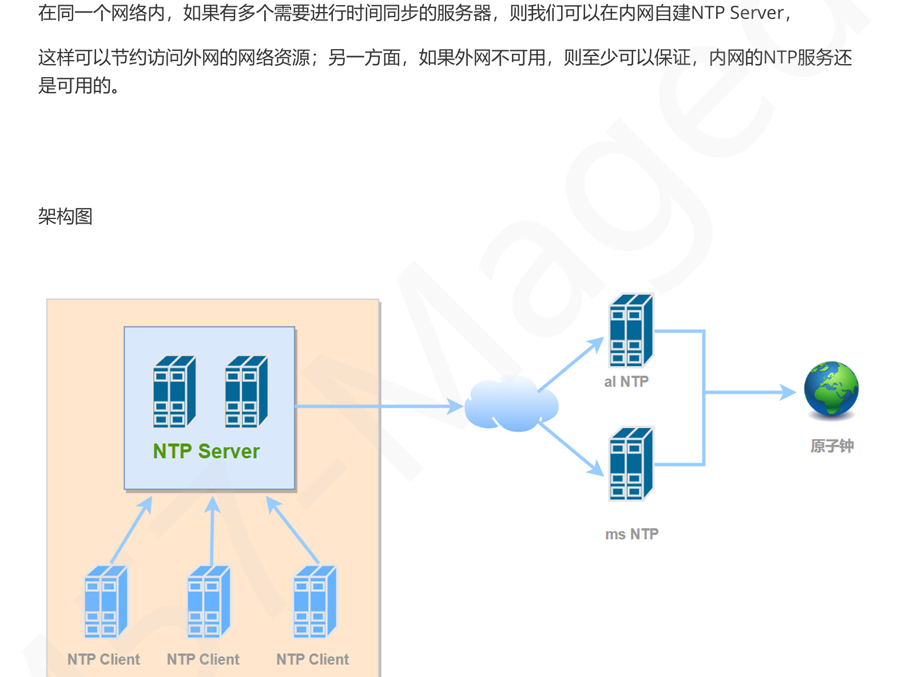

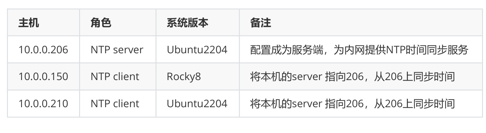服务端配置

```bash
[root@ubuntu ~]# vim /etc/chrony/chrony.conf
 allow 10.0.0.0/24                #允许10.0.0 网段的主机将本机作为时间同步服务器 
local stratum 10               #允许本机在不能与外网同步的情况下，还能提供服务     

#重启服务
[root@ubuntu ~]# systemctl restart chrony.service
 
#关闭防火墙
[root@rocky86 ~]# systemctl stop firewalld.service
```

Rocky8客户端配置

```bash
#添加 server，生产环境下至少两台，保证高可用
[root@rocky ~]# vim /etc/chrony.conf
 server 10.0.0.206 iburst
 #重启服务
[root@rocky ~]# systemctl restart chronyd.service
 [root@rocky ~]# chronyc -n sources
```

Ubuntu客户端配置

```bash
#添加 server，生产环境下至少两台，保证高可用
root@ubuntu22:~# vim /etc/chrony/chrony.conf

#重启服务
root@ubuntu22:~# systemctl restart chrony.service

#查看
root@ubuntu2204:~# chronyc -n sourcestats

#服务器上查看
[root@ubuntu ~]# chronyc clients
```

## 14.日志服务管理

### 14.1系统日志管理

#### 14.1.1rsyslog 系统日志服务

https://www.rsyslog.com/

rsyslog 是 CentOS6 以后的版本中使用的日志管理程序，是一个默认安装的服务，并且默认开机启动。

**rsyslog** **特性**

支持输出日志到各种数据库，如 MySQL，PostgreSQL，MongoDB ElasticSearch，实现使用第三方服务对日志进行存储和分析；

精细的输出格式控制以及对日志内容的强大过滤能力，可实现过滤记录日志信息中的指定部份；

通过 RELP + TCP 实现数据的可靠传输

支持数据的加密和压缩传输等

**rsyslog** **日志服务与** **ELK** **日志服务的区别：**

rsyslog 主要用于单机日志管理，ELK 主要用于分布式集群环境中的日志管理。

```bash
#syslog 内置优先级分类，从高到低，如果在记录日志时，设置了优先级，则只会记录设定的优先级和高于设定优先级的日志
LOG_EMERG #emerg/panic 紧急，致命错误
LOG_ALERT #alert 告警，当前状态必须立即进行纠正
LOG_CRIT #crit 关键状态的警告，例如 硬件故障
LOG_ERR #err/error 其它错误
LOG_WARNING #warning/warn 警告级别的信息
LOG_NOTICE #notice 通知级别的信息
LOG_INFO #info 通告级别的信息
LOG_DEBUG #debug 调试程序时的信息
* #所有级别的日志
none #不需要任何日志
```

```bash
[root@ubuntu ~]# tail /var/log/syslog
[root@ubuntu ~]# tail -n 3 /var/log/auth.log

[root@rocky ~]# tail /var/log/messages
[root@rocky ~]# tail /var/log/secure
```

**rule** **配置规则**（自行搜索）

日志内容由 template 决定，如果没有显式指定，默认使用 RSYSLOG_TraditionalFileFormat，其具体内容如下

```bash
template(name="RSYSLOG_TraditionalFileFormat" type="string"
     string="%TIMESTAMP% %HOSTNAME% %syslogtag%%msg:::sp-if-no-1st-sp%%msg:::drop-last-lf%\n")
```

##### 常见日志及相关工具

```bash
[root@rocky ~]# cat /etc/rsyslog.conf | grep -Ev "^#|^$"
```

```bash
[root@ubuntu ~]# cat /etc/rsyslog.d/*conf | grep -Ev "^#|^$"
```

**dmesg** **命令**

dmesg 命令用来查看主机硬件相关日志

**logger** **命令**

logger 命令可以手动生成相关日志

#### 14.1.2使用网络转发日志

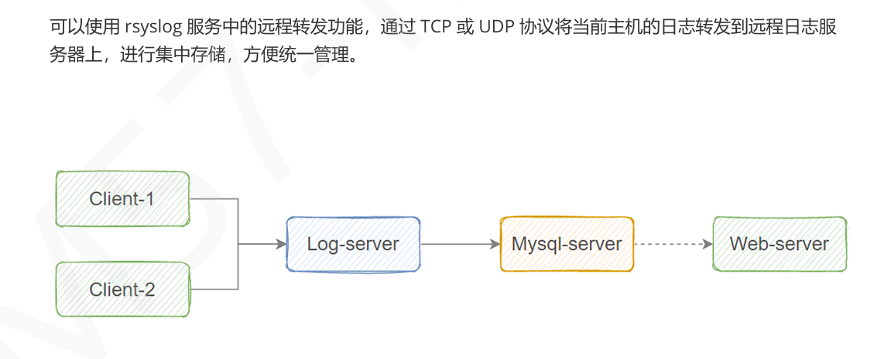

### 14.2服务日志管理工具 journalctl

```bash
#配置文件
[root@log-server ~]# cat /etc/systemd/journald.conf
 #日志数据存储目录，非文本文件，无法用文本工具打开
[root@log-server ~]# tree /var/log/journal/

```

```bash
#默认显示所有日志
[root@log-server ~]# journalctl 
[root@log-server ~]# ll /var/log/syslog*
#内容和 syslog 中一样
[root@log-server ~]# head -1 /var/log/syslog.1 

#但删除掉 syslog ，journalctl 还是能查看
[root@log-server ~]# mv /var/log/syslog.1 /tmp/


#查看内核日志
[root@log-server ~]# journalctl -k
```

```bash
#根据服务或程序查看
[root@log-server ~]# journalctl -u nginx.service
 [root@log-server ~]# journalctl -u ssh.service
 [root@log-server ~]# journalctl /usr/sbin/sshd
 [root@log-server ~]# journalctl /usr/bin/bash
 
 #
 [root@log-server ~]# journalctl _PID=1
 [root@log-server ~]# journalctl _UID=0
 [root@log-server ~]# journalctl -p warning
 [root@log-server ~]# journalctl -p 4
```

### 14.3Logrotate 日志转储

logrotate 程序是一个日志文件管理工具。用来把旧的日志文件删除，并创建新的日志文件，称为日志转储或滚动。可以根据日志文件的大小，也可以根据其天数来转储，这个过程一般通过cron程序来执行。(linux默认安装)

工作原理：系统计划任务每天执行一次脚本文件，在脚本中再执行  /usr/sbin/logrotate  /etc/logrotate.conf ，即调用 logrotate 程序再配合定义好的转储规则对日志文件进行转储。

```bash
#主配置文件
[root@log-server ~]# cat /etc/logrotate.conf
#每个服务单独的配置文件，如果在单独配置文件中没有定义的配置项，则使用主配置文件中的配置项或默认配置
[root@log-server ~]# ls /etc/logrotate.d/

```

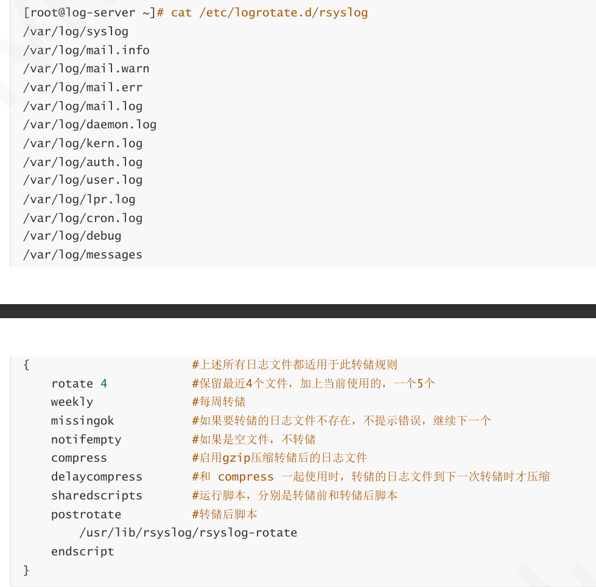

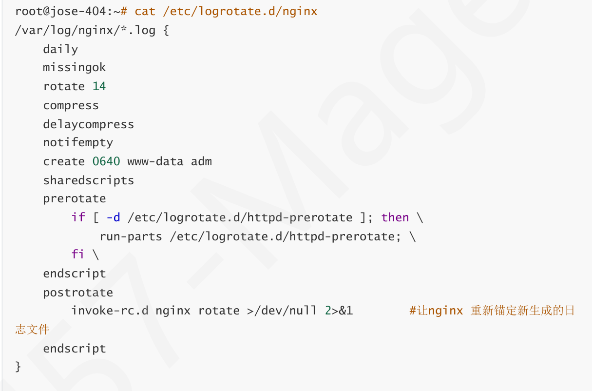

## 15.网络文件共享和文件实时同步

### 15.1  存储

**分布式存储**

在海量数据和文件的场景下，单一服务器所能连接的物理介质有限，能提供的存储空间和IO性能也是有 限的，所以可以通过多台服务器协同工作，每台服务器连接若干物理介质，再配合分布式存储系统和虚 拟化技术，将底层多个物理硬件设备组合成一个统一的存储服务。一个分布式存储系统，可以同时提供 块存储，文件存储和对象存储这三种存储方式。

#### 15.1.1NFS 服务

**NFS工作原理**

网络文件系统：Network File System (NFS)

NFS 中的远程访问是基于 RPC ( Remote Procedure Call Protocol，远程过程调用) 来实现的。

服务端的服务注册到RPC上，RPC监听111端口，目的就是让客户端的调用能找到服务端对应服务的端口，也就是服务注册和发现

客户端知道了之后就不需要经过RPC了，除非服务端重启该服务

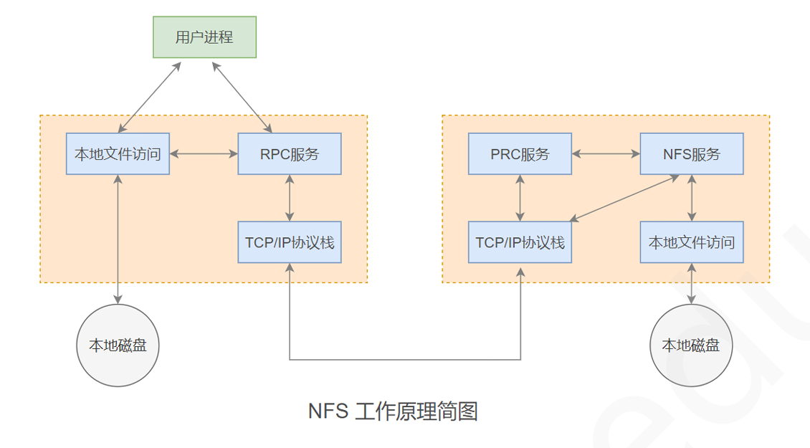

```bash
#在rocky 中安装，包含了客户端工具和服务端工具
[root@rocky ~]# yum install rpcbind nfs-utils
 #在ubuntu中安装服务端包
[root@ubuntu ~]# apt install nfs-kernel-server
 #在ubuntu中安装客户端包
[root@ubuntu ~]# apt install nfs-common
```

```powershell
/etc/exports
允许所有主机都可以访问共享目录，但是没有写权限
/path/to/dir  *
允许A主机进行读写操作，运行b主机读操作，其他主机不让访问
/path/to/dir  10.0.0.1(rw)  10.0.0.2
指定网段主机可以对共享目录进行读写操作
/path/to/dir  10.0.0.0/24(rw)
```

实践

```powershell
mkdir /data/dir{a,b}
cp /etc/fstab /data/dira/
定制专属的配置
root@ubuntu24:~# cat /etc/exports
/data/dira  *

mkdir -pv /data/dir{1,2}
mount 10.0.0.13:/data/dira /data/dir1
df -h /data/dir1/

可读
root@ubuntu24:~# cat /data/dir1/fstab
不可写
root@ubuntu24:~# echo "123" >> /data/dir1/fstab

root@ubuntu24:~# cat /etc/exports
/data/dira  10.0.0.151(rw)

exportfs -r
exportfs -v
主机上测试，还是可读不可写


chmod o+w /data/dira
现在可读可写了
```

对于root的身份操作文件，全部映射为 nobody的用户，而对于普通用户的身份操作文件，服务端没有，只会显示id

通过 普通用户身份 不映射的 特点，我们可以实现，多web主机上，同时挂载一个文件目录，然后在所有的主机上，同时创建 同一个 id的 同名 www 用户，这样，就可以实现 "统一用户映射" 的效果了。

### 15.2文件实时同步

inotify + rsync  

实现原理 利用内核中的 inotify 监控指定目录，当目录中的文件或数据发生变化时，立即调用 rsync 服务将数据推 送到远程主机上。

**inotify + rsync** 实现数据实时同步

```powershell
准备工作
[root@rocky9-12 ~]# mkdir /data/scrips -p

准备密码文件
[root@rocky9-12 ~]# echo 123456 > /data/scrips/www_rsync.pwd
[root@rocky9-12 ~]# chmod 600 /data/scrips/www_rsync.pwd
```

```shell
准备脚本文件
[root@rocky9-12 ~]# cat /data/scrips/rsync.sh
#!/bin/bash

USER="rsyncer"
PASS_FILE="/data/scrips/www_rsync.pwd"
REMOTE_HOST="10.0.0.13"
SRC="/data/www/"
REMOTE_DIR="dir1"
DEST="${USER}@${REMOTE_HOST}::${REMOTE_DIR}"
LOG_FILE="/data/scrips/www_rsync.log"
# 准备工作环境
ubuntu_install_inotify(){
  if [ ! -f /usr/bin/rsync ]; then
    apt install inotify-tools -y
    apt install rsync -y
        fi
}
centos_install_inotify(){
  if [ ! -f /usr/bin/rsync ]; then
    yum install inotify-tools -y
          yum install rsync -y
        fi
}
install_inotify(){
  os_type=$(grep Ubuntu /etc/issue >/dev/null && echo "Ubuntu" || echo "CentOS")
        if [ "${os_type}" == "Ubuntu" ]; then
          ubuntu_install_inotify
        else
          centos_install_inotify
        fi
}
#不间断监控指定目录中的特定事件,当目录中有事件发生变化时，调用 rsync 命令进行同步
rsync_file(){
  inotifywait -mrq --exclude=".*\.swp" --timefmt '%Y-%m-%d %H:%M:%S' --format '%T 
%w %f' -e create,delete,moved_to,close_write,attrib ${SRC} | while read DATE TIME 
DIR FILE;do
    FILEPATH=${DIR}${FILE}
          rsync -az --delete --password-file=${PASS_FILE} $SRC $DEST && echo "At 
${TIME} on ${DATE}, file ${FILEPATH} was backup via rsync" >> ${LOG_FILE}
  done
}

# 主函数
main(){
  install_inotify
        rsync_file
}
# 执行主函数
main
```


sersync

sersync 类似 于inotify，同样用于监控，但它克服了 inotify 的缺点，inotify 最大的不足是会产生重复事 件，或者同一个目录下多个文件的操作会产生多个事件，例如，当监控目录中有5个文件时，删除目录时 会产生6个监控事件，从而导致重复调用 rsync 命令。

sersync 不仅可以实现实时同步，另外还自带 crontab 功能，只需在 xml 配置文件中开启，即也可 以 按要求隔一段时间整体同步一次，而无需再额外配置 crontab 功能 sersync 可以二次开发

```bash
https://code.google.com/archive/p/sersync/          
#项目地址
```

## 16.linux防火墙

### 16.1网络安全技术基础

**入侵检测系统 IDS**

IDS：Intrusion Detection Systems （入侵检测系统） 其特点是不阻断任何网络访问，而是依照一定的安全策略，通过软，硬件，对网络，系统的运行状况进 行监控，尽可能发现各种攻击企图，攻击行为或攻击结果，以保证网络系统资源的机密性，完整性和可 用性。 本质上，IDS 是监听设备（系统），不用直接接入网络链路，网络流量也不用经过IDS。所以IDS一般以 旁路部署的形入接入系统，然后在网络上收集它所关心的报文即可。对于收集到的报文数据，IDS会进行 清洗统计，并与内置的规则进行比对和分析，从而得出哪些网络数据是入侵和攻击。 根据模型和部署方式不同，IDS 可分为基于主机的IDS，基于网络的IDS，以及新一代的分布式IDS。


**入侵防御系统 IPS**

IPS： Intrusion Prevention System （入侵防御系统） IPS 以串行的方式接入系统，IPS系统可以深度感知并检测经流的数据报文，可以根据预先设定的安全策 略，对流经的每个报文进行深度检测（包括协议分析跟踪、特征匹配、流量统计分析、事件关联分析 等），如果发现藏匿于其中的网络攻击，可以根据该攻击的威胁级别立即采取措施，这些措施包括中断 连接，丢弃报文，隔离文件，向管理员告警等。

 IPS可以分为 主机入侵防御系统，网络入侵防御系统，无线入侵防御系统等几类。


**防火墙 FW**

防火墙以串行的方式接入系统，所有流入流出的网络报文都要经由防火墙。

防火墙可以分为 网络层防火墙，应用层防火墙等

### 16.2防火墙的分类

**按照保护范围来划分**

主机防火墙 

主机防火墙对单个主机进行防护，运行在终端主机上，主机防火墙可以阻止未授权的程序和数据出入计 算机，Windows和Linux 系统都有自带的主机防火墙。 

网络防火墙 

网络防火墙部署在整个系统的主线网路上，对整个系统的出入数据进行过滤。

**按实现方式划分**

硬件防火墙

软件防火墙

**按网络协议划分**

网络层防火墙工作在OSI七层模型中的网络层，又称包过滤防火墙。 

应用层防火墙工作在OSI七层模型中的应用层，又称网关防火墙或代理服务器防火墙。

### 16.3Linux 防火墙

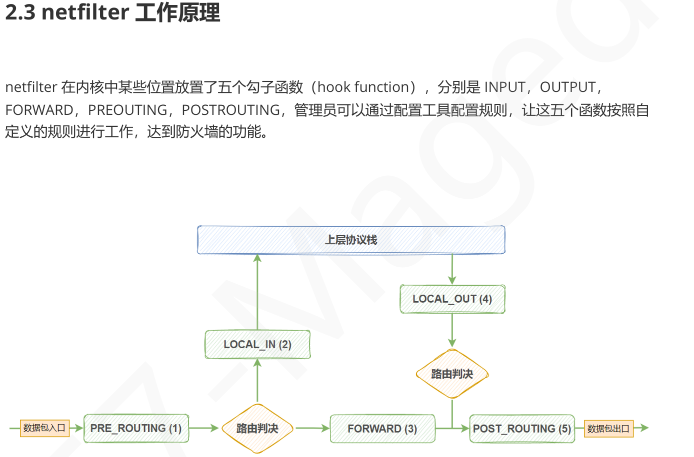


#### 16.3.1iptables 的组成

五链五表

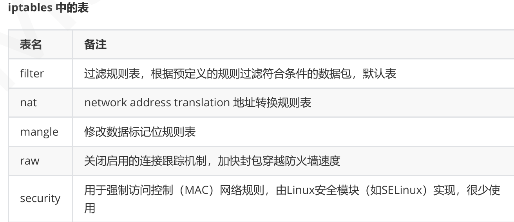

表的优先级（从高到低） security --> raw --> mangle --> nat --> filter

**链和表的对应关系（不是每个链都能支持五个表）**

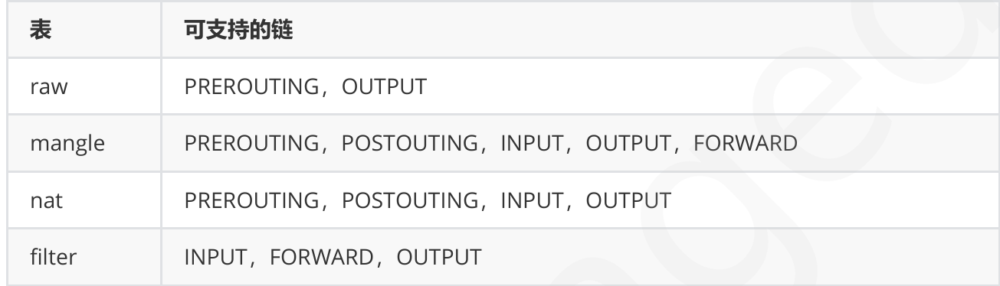

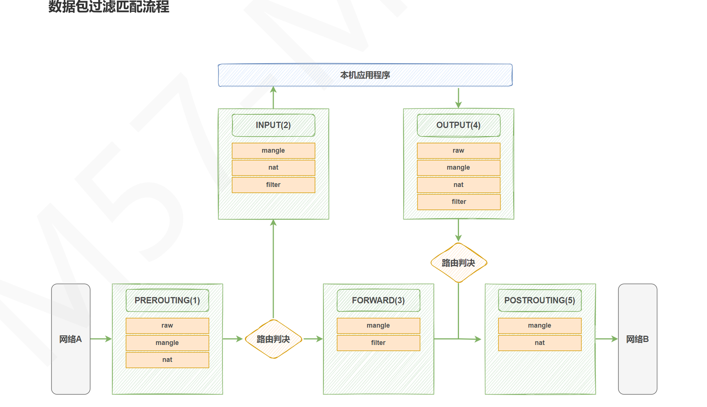

当一个数据包进入网卡时，数据包首先进入PREROUTING链，内核根据数据包目的IP判断是否需要 传送出去； 

如果数据包是进入本机的，则会进入INPUT链，然后交由本机的应用程序处理； 

如果数据包是要转发的，且内核允许转发，则数据包在PREROUTING链之后到达FORWARD链，再经由POSTROUTING链输出 

本机的应用程序往外发送数据包，会先进入OUTPUT链，然后到达POSTROUTING链输出

### 16.4iptables

在 ubuntu 中，在用iptables命令设置防火墙之前，先关闭自带的 ufw 服务，因为 ufw 服务中也有一套 自定义的规则，如果在开启 ufw 服务的情况下再用 iptables 设置或删除规则，容易发生冲突。

```bash
[root@ubuntu ~]# systemctl is-active ufw
[root@ubuntu ~]# systemctl disable --now ufw
```

在 redhat 系中要先停用 firewalld 服务

```bash
[root@rocky86 ~]# iptables  -L
[root@rocky86 ~]# systemctl disable --now firewalld.service
[root@rocky86 ~]# iptables  -L
```

iptables 完整命令由四部份组成

```powershell
iptables Table（默认filter表） Chain Rule   重点
```

查看规则

```powershell
#默认 filter 表，规则为空#这里显示的filter 表上各链默认规则
[root@ubuntu ~]# iptables -vnL
[root@ubuntu ~]# iptables -t filter -vnL
#指定 filter 表 INPUT 链 
[root@ubuntu ~]# iptables -t filter -vnL INPUT

iptables规则顺序生效
```

新增规则

```bash
#在INPUT 链的 filter 表上设置过滤规则，将来自 10.0.0.150 的数据包丢弃掉
[root@ubuntu ~]# iptables -t filter -A INPUT -s 10.0.0.150 -j DROP

iptables -A INPUT -p tcp --dport 22 -j ACCEPT
```

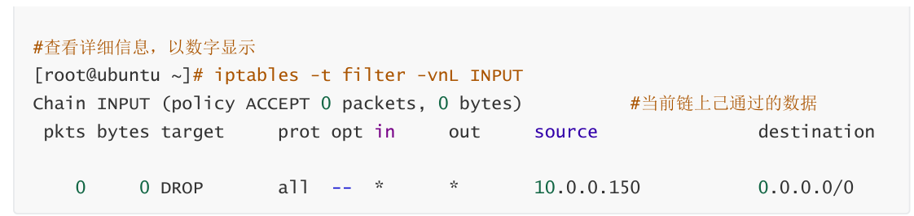

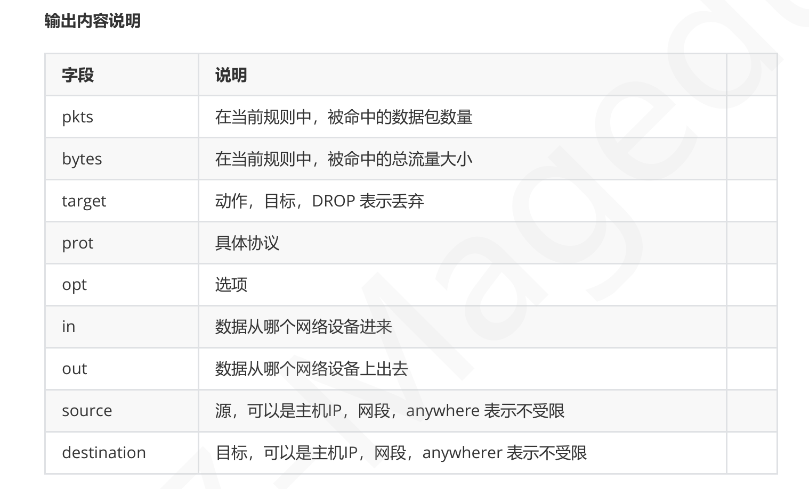

```bash
#在 150 主机 ping 206
 [root@rocky86 ~]# ping 10.0.0.206
 
 #在 206 主机上用抓包工具分析
#从 150 来的 ping 包，都没有回应，因为被 iptables DROP掉了
[root@ubuntu ~]# tcpdump -i ens33 -nn icmp
```

```bash
#拒绝整个网段
[root@ubuntu ~]# iptables -t filter -A INPUT -s 10.0.0.0/24 -j REJECT

#再添加一条特定IP的放行规则
[root@ubuntu ~]# iptables -t filter -A INPUT -s 10.0.0.1 -j ACCEPT
```

```bash
#只允许 10.0.0.1 连接
[root@ubuntu ~]# iptables -t filter -A INPUT -s 10.0.0.1 -j ACCEPT
#其它机器数据全部拒绝，不指定匹配条件，则全部拒绝
[root@ubuntu ~]# iptables -t filter -A INPUT -j REJECT 

#这种情况下，ACCEPT规则一定要写在前面
[root@ubuntu ~]# iptables -t filter  -nL INPUT --line-number

#由于拒绝了10.0.0.1 之外的主机，本机也无法使用
[root@ubuntu ~]# ping 127.1

#在最前面插入 127.1 的ACCEPT 规则
[root@ubuntu ~]# iptables -t filter -I INPUT -s 127.0.0.1 -j ACCEPT

#再次添加，指定入口设备是本地回环网卡
[root@ubuntu ~]# iptables -t filter -I INPUT -i lo -j ACCEPT

#替换第一条  
[root@ubuntu ~]# iptables -t filter -R INPUT 1 -s 127.0.0.1 -j ACCEPT
```

 iptables 规则只有 root 才能操作

```powershell
入站仅开放80/443端口
# 1. 清空已有规则（可选）
iptables -F
iptables -X
iptables -Z

# 2. 设置默认策略
iptables -P INPUT DROP      # 默认丢弃所有入站
iptables -P FORWARD DROP    # 不做转发，丢弃
iptables -P OUTPUT ACCEPT   # 允许所有出站

# 3. 允许本地回环接口
iptables -A INPUT -i lo -j ACCEPT

# 4. 允许已建立连接的返回流量
iptables -A INPUT -m state --state ESTABLISHED,RELATED -j ACCEPT

# 5. 允许 TCP 80 和 443 端口
iptables -A INPUT -p tcp --dport 80 -j ACCEPT
iptables -A INPUT -p tcp --dport 443 -j ACCEPT

# （可选）允许 ping
iptables -A INPUT -p icmp -j ACCEPT
```

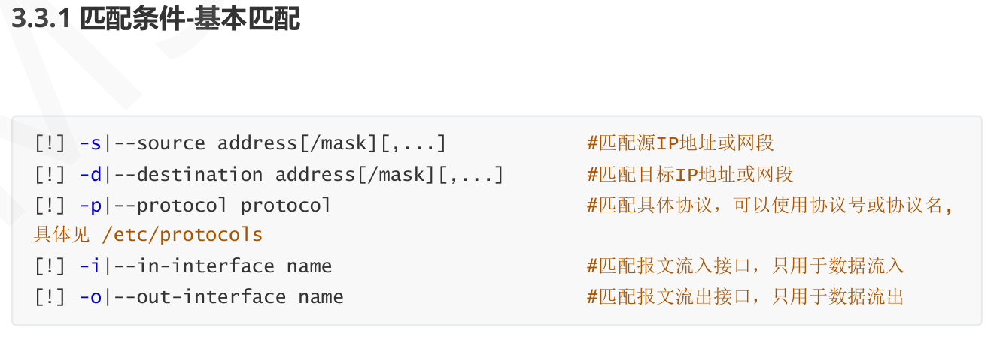

```bash
#设置取反规则，除了 10.0.0.150 来的数据，其它都拒绝
[root@ubuntu ~]# iptables -t filter -R INPUT 2 ! -s 10.0.0.150 -j REJECT

#拒绝目标为110的IP上的ICMP协议
[root@ubuntu ~]# iptables -t filter -A INPUT -d 10.0.0.110 -p icmp -j REJECT

#在一条规则中指定两个端口
[root@ubuntu ~]# iptables -t filter -A INPUT -s 10.0.0.150 -d 10.0.0.110 -p tcp m multiport --dports 22,80 -j REJECT
```

**connlimit 扩展** 

根据每客户端IP做并发连接数数量匹配，可防止 Dos(Denial of Service，拒绝服务)攻击

```bash
[root@rocky ~]# yum -y install httpd-tools
 #ubuntu系统
[root@ubuntu ~]# apt-get install apache2-utils 
#压测
[root@rocky ~]# ab -n 100000 -c 1000  http://10.0.0.206/
N                        #总共发起多少个请求，默认一个
-c N                        #每次请求并发数，默认一个
```

**limit 扩展** 

基于收发报文的速率做匹配 , 令牌桶过滤器。 connlimit 扩展是限制单个客户端对服务器的并发连接数，limit 扩展是限制服务器上所有的连接数。

```bash
#添加 icmp 放行规则，前10个不处理，后面每分钟放行20个
[root@ubuntu ~]# iptables -t filter -A INPUT -p icmp --icmp-type 8 -m limit -limit 20/minute --limit-burst 10 -j ACCEPT
```


#### 规则优化


**持久化保存规则**

```bash
#在标准输出中显示
[root@ubuntu ~]# iptables-save
 #导出到文件
[root@ubuntu ~]# iptables-save > iptables.rule

#导入，加载保存的规则
[root@ubuntu ~]# iptables-restore < ./iptables.rule

#开机自动加载规则
[root@rocky ~]# vim /etc/rc.d/rc.local
 #增加如下行
iptables-restore < /root/iptables.rule
```

### 16.5 网络防火墙

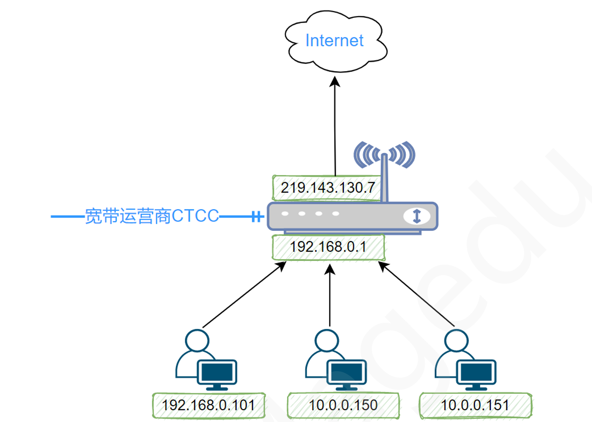

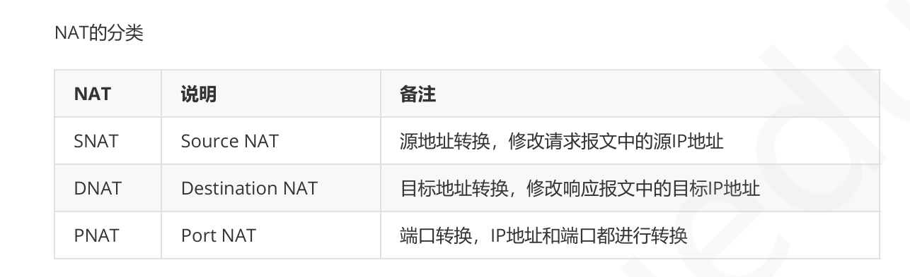

NAT：(Network Address Translation)  网络地址转换
