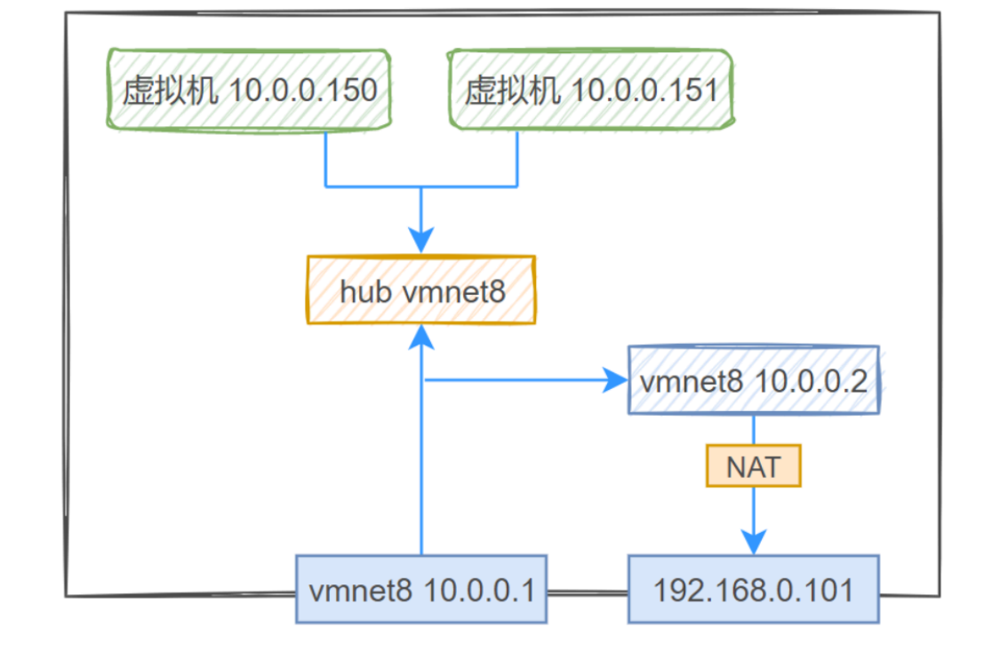
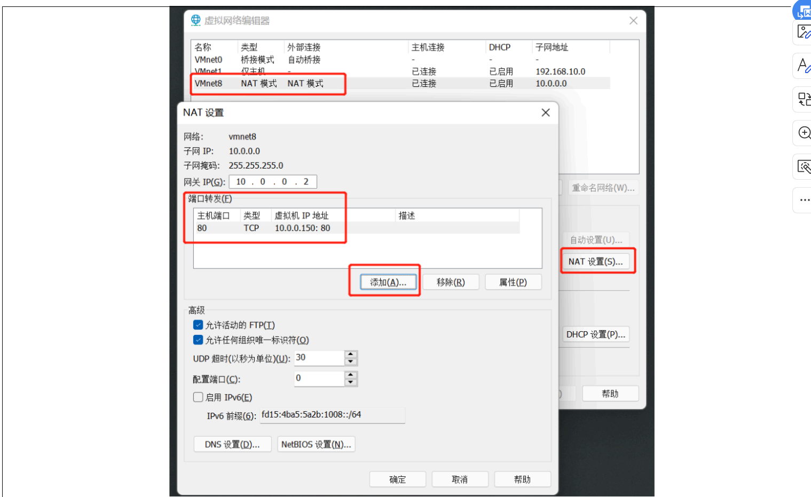
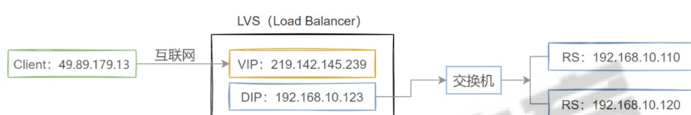
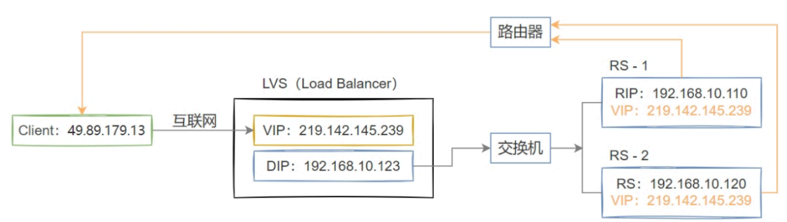

# Linux防火墙

## 1.基本概念

主机内的进程间数据通信

```powershell
封装好的数据，无需经过物理网卡和路由，通过本机的回环网卡(LoopBack)即可实现从A套接字流出，从B套接字流入，由内核空间进入用户空间，进而被进程所在的应用程序接收并处理，完成整套数据的传输效果。
```

主机间的进程数据通信

```powershell
封装好的数据，在物理层进行路由决策，如果数据包的目标地址是其他主机，数据包从A网卡流出，然后数据包在互联网上进行路由转发，最终到达目标主机，从B网卡流入，进入到指定的套接字，被进程所在的应用程序接收并处理，完成整套数据的传输效果。
```

netfilter/iptables/nftables

```powershell
Netfilter是Linux内核中的一个框架，用于进行网络数据包的过滤和操作。
iptables是基于Netfilter框架实现的报文选择系统，可以用于报文的过滤、网络地址转换和报文修改等功能。
iptables(内核空间) 和 iptables 命令行工具(用户空间)

nftables：是基于 Netfilter 框架构建的新一代用户空间工具和内核子系统，在 Netfilter 的基础上提供了更高级、更便捷的规则管理和配置方式，更侧重于用户对防火墙规则等网络功能的管理和配置。

ufw是一款基于iptables的主机级防火墙配置工具。(ubuntu)
```

## 2.netfilter/iptables

```powershell
关心filter表：实现防火墙，也就是包过滤。INPUT，FORWARD，OUTPUT
关心nat表：实现网络地址转换，PREROUTING，POSTOUTING，INPUT，OUTPUT

FORWARD 链的典型应用场景：
Linux 当网关/路由器时
Docker / Kubernetes 容器网络
NAT 配合

yum install -y iptables-services
```

操作

```powershell
查看iptables规则
iptables -vnL

清理防火墙规则
iptables -F

iptables -t filter -A INPUT -s 10.0.0.12 -j DROP

Iptables 常用选项：
-A 追加规则-->iptables -A INPUT
-D 删除规则-->iptables -D INPUT 1(编号)
-R 修改规则-->iptables -R INPUT 1 -s 192.168.12.0 -j DROP 取代现行规则，顺序不
变(1 是位置)
-I 插入规则-->iptables -I INPUT 1 --dport 80 -j ACCEPT 插入一条规则，原本位置上的规则将会往后移动一个顺位
-L 查看规则-->iptables -L INPUT 列出规则链中的所有规则
通用参数：
-p 协议 例：iptables -A INPUT -p tcp
-s 源地址 例：iptables -A INPUT -s 192.168.1.1
-d 目的地址 例：iptables -A INPUT -d 192.168.12.1
--sport 源端口 例:iptables -A INPUT -p tcp --sport 22
--dport 目的端口 例:iptables -A INPUT -p tcp --dport 22
-i 指定入口网卡 例:iptables -A INPUT -i eth0
-o 指定出口网卡 例:iptables -A FORWARD -o eth0
-j 指定要进行的处理动作 ACCEPT/DROP/REJECT/MASQUERADE（动态SNAT）
```

开机加载

```powershell
scp root@10.0.0.13:/root/iptables.rules ./

vim /etc/rc.d/rc.local
#增加如下行
iptables-restore < /root/iptables.rules

保存后给文件增加执行权限，Rocky9中默认没有可执行权限
chmod a+x /etc/rc.d/rc.local               /etc/rc.local    ubuntu

reboot
iptables -vnL INPUT
```

## 3.网络防火墙

```powershell
SNAT：Source NAT，源地址转换，基于nat表，工作在 POSTROUTING 链上。具体是指将经过当前主机转发的请求报文的源IP地址转换成根据防火墙规则指定的IP地址。
iptables -t nat -A POSTROUTING -s 10.0.0.0/24 ! -d 10.0.0.0/24 -j SNAT --to-source 192.168.8.13

iptables -t nat -R POSTROUTING 1 -s 10.0.0.0/24 ! -d 10.0.0.0/24 -o ens37 -p tcp --dport 80 -j SNAT --to-source 192.168.8.13:12345

iptables -t nat -A PREROUTING -d 10.0.0.13 -p tcp --dport 81 -j DNAT --to-destination 192.168.8.14:81

进来的时候改目标，出去的时候改源
```

虚拟机是怎么能够访问互联网的？

```powershell
10.0.0.1 = 宿主机的虚拟网卡；
10.0.0.2 = VMware NAT 网关（虚拟路由器）；
10.0.0.x（>=3）= 分配给虚拟机的地址。
```



端口转发



# LVS

## 1.基本概念

```powershell
lvs工作在preroutine和input链之间，按规则截获请求转发出去

开启linux服务的ip转发功能
在 /etc/sysctl.conf中开启功能
    net.ipv4.ip_forward = 1
```

LVS软件 由2部分程序组成：ipvs 和 ipvsadm

```powershell
LVS提供了一个支持多种IP负载均衡技术的IP虚拟服务器软件IPVS，这段代码工作在lvs主机的内核空间(netfilter的INPUT),它用于截获用户请求数据包，根据内部的调度策略实现数据包转交的功能。

ipvsadm是工作在用户空间的命令行工具，负责为ipvs的资源调度编写转交规则：
    1 定义lvs集群的名称
    2 定义该集群中处于后端提供真实服务的主机列表(Real Server)
    
yum info ipvsadm
```

ipvsadm

```powershell
集群状态查看
ipvsadm -Ln

ipvsadm -A -t|u|f service_address:port [-s scheduler] [-p [timeout]]
创建集群
ipvsadm -A -t 192.168.8.14:80
ipvsadm -A -t 192.168.8.15:80
-A创建
-E 编辑
-D 删除
-C 删除
ipvsadm -a -t service_address:port -r server-address:port -g|m|i
    -a 给lvs集群增加一个真实主机RS
    -r 指定真实主机的地址信息，格式是 IP:[Port],Port可以省略
    -g|m|i 设定后端主机的转发模式
        -g 采用默认的direct routing模式
        -m 采用masquerading的nat模式
        -i 采用ipip的tunneling模式
   这三者只能选择其一
    -w 指定真实主机的权重信息
    
ipvsadm-save查看规则   > xxx
ipvsadm-restore < xxx


nat
ip addr add 10.0.0.13 dev eth0
ipvsadm -a -t 10.0.0.13:80 -r 192.168.8.14 -m
ipvsadm -a -t 10.0.0.13:80 -r 192.168.8.15 -m

dr
ip addr add 192.168.1.100/32 dev eth0
ipvsadm -A -t 192.168.1.100:80 -s rr
ipvsadm -a -t 192.168.1.100:80 -r 192.168.1.11 -g
ipvsadm -a -t 192.168.1.100:80 -r 192.168.1.12 -g
Real server
ip addr add 192.168.1.100/32 dev lo   回环，收到包之后判断这个包是给我的，直接处理，处理后响应由内核用它作为源地址封装数据包发出去
# 关闭 ARP 响应（防止跟 LVS 抢答）
echo 1 > /proc/sys/net/ipv4/conf/lo/arp_ignore
echo 2 > /proc/sys/net/ipv4/conf/lo/arp_announce
echo 1 > /proc/sys/net/ipv4/conf/all/arp_ignore
echo 2 > /proc/sys/net/ipv4/conf/all/arp_announce

tun
# 配置 VIP 在公网接口
ip addr add 1.1.1.100/32 dev eth0
# 清空旧规则
ipvsadm -C
# 创建虚拟服务 (TUN模式用 -i)
ipvsadm -A -t 1.1.1.100:80 -s rr
ipvsadm -a -t 1.1.1.100:80 -r 10.0.0.11 -i
ipvsadm -a -t 1.1.1.100:80 -r 10.0.0.12 -i
Real Server：
ip addr add 1.1.1.100/32 dev lo
modprobe ipip       就加了这一个步骤
echo 1 > /proc/sys/net/ipv4/conf/lo/arp_ignore
echo 2 > /proc/sys/net/ipv4/conf/lo/arp_announce
echo 1 > /proc/sys/net/ipv4/conf/all/arp_ignore
echo 2 > /proc/sys/net/ipv4/conf/all/arp_announce

```

## 2.LVS工作模式

NAT模式

CIP->VIP->DIP->交换机->RIP



```powershell
LVS主机上，定制两个网卡，一个对外，一个对内。
LVS 和 RS 之间可以是路由器，也可以是交换机。

LVS本质上使用的类似于iptables里面的DNAT策略
 - LVS工作于内核上，而不是iptables的五表五链上
```


DR模式

```powershell
DR 模式是 LVS 的默认模式，应用广泛，通过为请求报文重新封装一个 MAC 首部进行转发，源 MAC 是 DIP 所在的接口的 MAC，目标MAC 是某挑选出的 RS 的 RIP 所在接口的 MAC 地址；源 IP/PORT，以及目标 IP/PORT 均保持不变，但源 MAC 和目标 MAC 会发生改变，DR 模式下，数据链路层之上的内容不会发生变化
```



```powershell
1 用户向具有公网ip地址的LVS主机地址(VIP)发起请求，(Src=CIP，Dst=VIP)
2 LVS主机接收到数据包后，修改数据包的目标MAC地址为后端RS主机并转发出去，(Src=CIP，Dst=VIP)
3 后端RS主机处理完请求后，返回数据包给客户端主机，(Src=VIP，Dst=CIP)

整个过程只需要更改数据包外层的mac地址即可。
```


tun模式

```powershell
TUN 模式下 LVS 服务器和后端 RS 可以不在同一个物理网络，可以跨公网
LVS 把请求报文再封装一层 IP-in-IP (协议号 4)，通过隧道发给 Real Server。
```

```powershell
LVS 通过调度算法选择一个 RealServer（RIP），然后做 IP-in-IP 封装
外层IP：Src = DIP, Dst = RIP
内层IP：Src = Client, Dst = VIP
RealServer 收到的 外层IP = RIP（属于自己）。
内核发现协议号是 4 (IPIP)，就会调用 ipip 模块，把外层 IP 头剥掉

RealServer 回包跟dr模式是一样的
```

调度算法

```powershell
静态方法：仅仅从调度策略本身实现的功能角度进行工作
 RR、WRR、DH、SH
动态方法：在满足调度策略本身实现功的前提下，还要考虑后端主机的动态负载效果
 LC、WLC、LBLC、LBLCR、SED、NQ
高版本内核中新增的调度算法: 在 4.15 版本的内核中新增的方法
 FO、OVF、MH、TNDR等
```

