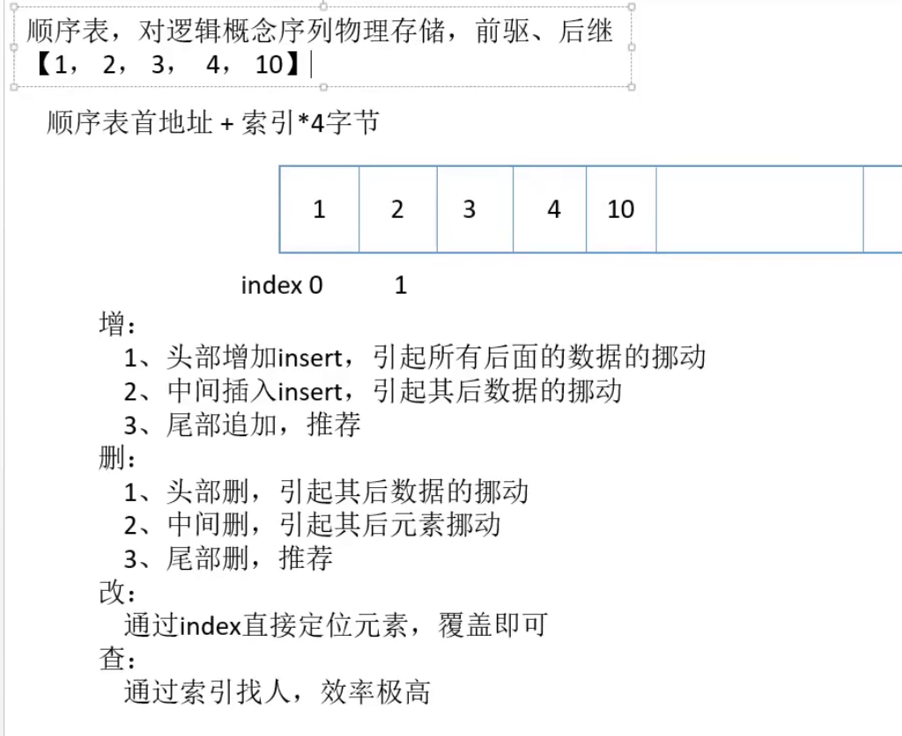
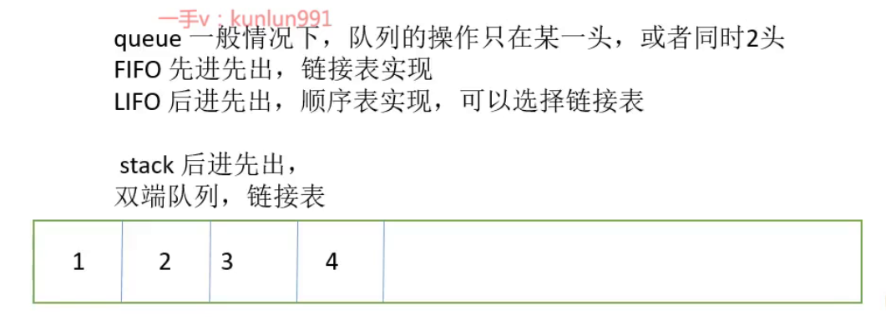
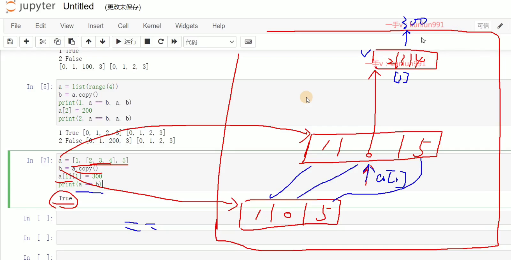
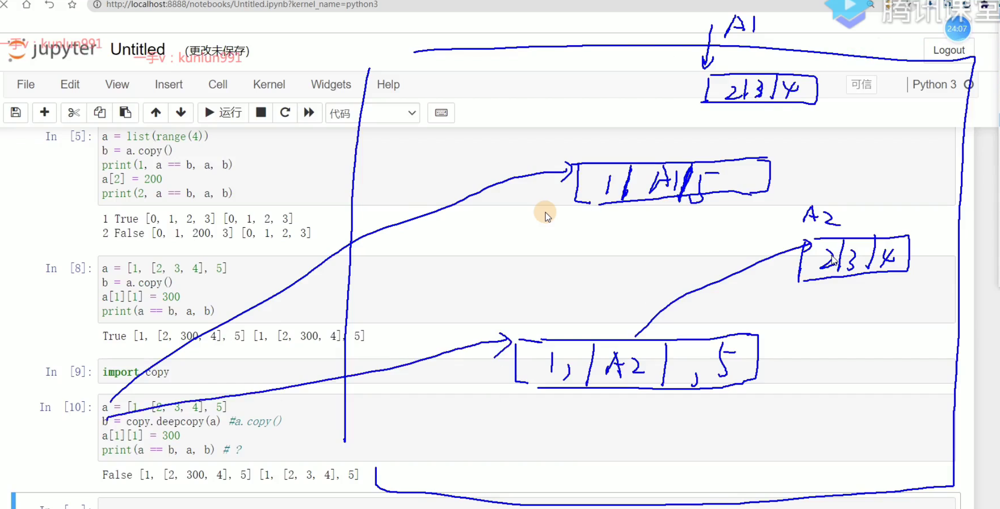
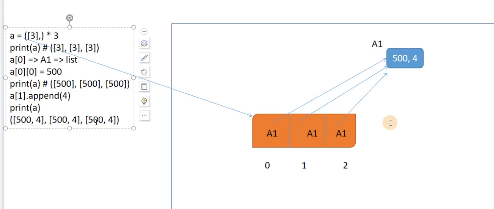

[TOC]

# python

## 基础语法

标识符记住的是内存地址，编译完后就变成内存地址

c,c++,java都是静态语言

a:int = 5也只是做个解释

## 数据结构

### 表

#### 顺序表

索引查O(1)

#### 链表

#### 应用

## 内存分析

### 列表（垃圾回收）

[[1]]在第二行运行结束时就被判断为垃圾了，虚拟机会在合适的时候清除

内存的回收和规整（减少内存空洞碎片）GC，Gabage Collection

对于垃圾回收：虚拟机垃圾回收机制自动垃圾回收，尽管策略上已经很高效了，但源头上还是编码人员要尽量减少产生垃圾，因为触发垃圾回收时GC很占用内存，有个等待过程（STW,stop world）

### 浅拷贝与深拷贝

复制的是地址，修改的是地址指向的值所以还是相等的

而深拷贝会将所有数据都做一个副本，引用的数据也会，递归拷贝

### 元组

*就类似于浅拷贝