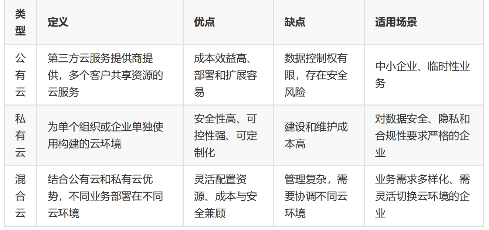

[TOC]

# 1.公有云介绍

狭义上讲云计算是指IT基础设施的交付和使用模式，通过网络以按需，易扩展的方式获得所需的资源(硬件，平台，软件)，提供资源的网络被称为 "云"。  

广义上讲云计算是指服务的交付和使用模式，通过网络以按需，易扩展的方式获得所需的服务。

专有云：云服务提供商为特定客户单独构建、隔离使用的云环境，公有云与私有云的结合，专业运维支持

# 2.阿里云

## 2.1ECS

### 2.1.1实例对应的服务选型

https://help.aliyun.com/zh/ecs/user-guide/best-practices-for-instance-type-selection?spm=a2c4g.11186623.help-menu-25365.d_4_1_2_1.811a6db93LLVug

计算密集型1:2

### 2.1.2登录

客户端下载：

https://help.aliyun.com/zh/ecs/user-guide/overview-of-alibaba-cloud-client?spm=a2c4g.11186623.help-menu-25365.d_4_1_4_6_1.3f927b8bjflQnB&scm=20140722.H_438476._.OR_help-T_cn~zh-V_1#section-pvu-jy5-ij9

密钥对/linux账号密码

### 2.1.3云盘选型和扩容

https://help.aliyun.com/zh/ecs/user-guide/essds?spm=a2c4g.11186623.help-menu-25365.d_4_3_0_4.255a1d16ig50wd

PL0-PL1/本地盘，三副本技术保证数据可靠性

扩容：

https://help.aliyun.com/zh/ecs/user-guide/resize-cloud-disks/?spm=a2c4g.11186623.help-menu-25365.d_4_3_3.1b892bef3oO0Tc

### 2.1.4快照

https://help.aliyun.com/zh/ecs/user-guide/snapshot-overview?spm=a2c4g.11186623.help-menu-25365.d_4_4_1.77f9576enEYWK0

对于重要数据，做本地备份。其他的一天做一个全量快照就够了

### 2.1.5网络

一个部门业务分配在一个vpc，一个业务组分配一个子网网段，如cfmoto app业务一个网段，zeeho业务一个网段

### 2.1.6安全组

默认不开放所有端口，按需求对指定ip开放对应端口（主要是入站规则，比如nginx->后端服务器），出站未做限制

## 2.2专有网络vpc

建一个16网络位的网段，看规格给交换机分配17-24网络位的子网网段

自定义路由（没用过）：

https://help.aliyun.com/zh/vpc/user-guide/network-traffic-management-using-custom-routing-tables?spm=a2c4g.11186623.help-menu-27706.d_2_2_0_0.3aa2459ctQMJ0y

对等连接

## 2.3openapi

运维调openapi做监控告警

开发调openapi做功能

## 2.3弹性伸缩

平时不开启弹性伸缩策略，只有在可预知的时间段（如大概率导致cpu飙高的活动推广与进行）

按量付费/抢占式

伸缩组

配置自动扩缩容策略

大致策略：平时cpu占用50%，做活动推广访问突增时cpu>80%，自动扩容后cpu回落<30-40%，持续10分钟缩容

## 2.4SLB

clb负载均衡配置，流量配比，新ALB更强，未使用过

监控：https://help.aliyun.com/zh/slb/classic-load-balancer/user-guide/configure-fine-grained-monitoring?spm=a2c4g.11186623.help-menu-27537.d_2_6_2.14d849e8njhyI8&scm=20140722.H_251757._.OR_help-T_cn~zh-V_1

## 2.5云解析DNS与SSL

域名注册

https://dc.console.aliyun.com/next/index?spm=a2c1d.8251892.console-base_search-panel.dtab-product_domain.6c615b760ny4iX#/overview

1.添加域名

https://dns.console.aliyun.com/?spm=5176.71615.J_5585722290.4.61653bd4c9rerf#/dns/domainList

2.在ssl服务中买一年期的OV证书并在nginx中配置

https://yundun.console.aliyun.com/?spm=a2c1d.8251892.console-base_search-panel.dtab-product_cas.51a85b766RIx4N&p=cas#/overview/cn-hangzhou

3.在域名解析中配置A记录
4.进入网页

5.根据业务（比如各个市县交警铁骑管理平台，主域名相同）添加子域，上述步骤重复（通配符证书）

6.各个公安不一样，有些允许这边访问，有些只允许在对方服务器上运行服务

自建DNS服务器bind（只考虑bind配置）

1.主配置文件添加新区域声明

2.创建正向区域文件                         （有需要配置反解析）

3.在域名注册商处更新域名服务器（NS）记录，指定为 BIND 服务器（让bind服务器权威）

4.重启bind服务检查是否生效

logging       acl/view

## 2.6数据库相关

2.6.1RDS

2.6.2polarDB

2.6.3DAS

### 2.6.4DTS

DTS 为了**稳定性和可靠性**，默认禁用了 DDL 同步。

同步/迁移之前，确保数据库不会新增业务表

有些版本支持部分ddl，但是最好还是不要用ddl

## ACK

镜像仓库：ACR+自建habor

k8s集群

## RAM

子管理员

跟绝大多数后台管理系统的RBAC一样

角色，用户，用户组，以及非常细颗粒度的权限管控

## 其他服务
