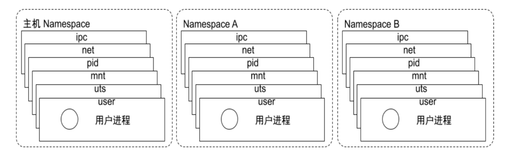
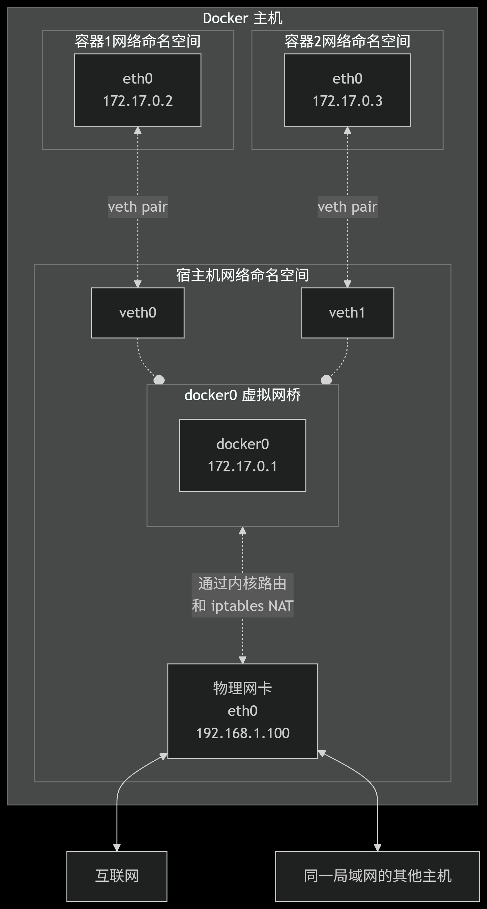

# 1.docker复习

## 1.1理论

命名空间



```powershell
Cgroups 最主要的作用，就是限制一个进程组能够使用的资源上限
```

自动补全

```powershell
curl -L 
https://raw.githubusercontent.com/docker/cli/master/contrib/completion/bash/dock
er -o /etc/bash_completion.d/docker.sh
```

程序环境

```powershell
/usr/lib/systemd/system/docker.service
/etc/docker/daemon.json
如果有本地镜像仓库用本地，云上用云上的，自用的话有时候会失效（找可用的或者直接挂vpn）
```

文件系统

```powershell
Overlay2: 是Linux 内核中的一种联合文件系统（UnionFS）
用户看到的overlay文件系统根目录下内容是挂载overlay文件系统时指定的不同目录的合集Overlay2可以有多个lower层，但只有1个upper层。上层会覆盖下层相同的内容，用户看到的是Merged层
用户只能操作Merged层，操作的变化会记录在upper层里
lower层的内容是只读的
```

域名解析

```powershell
容器会自动将容器的ID加入自已的/etc/hosts文件中，并解析成容器的IP
容器的dns服务器，默认采用宿主机的dns 地址
```

容器热迁移

```powershell
CRIU工具
1. 创建检查点
2. 导出检查点
3. 在目标主机上恢复容器
```

## 1.2镜像制作

dockerfile一般是开发那边写好的，运维主要写jenkinsfile，写完很久都不动，新项目直接cp改一下就好

```powershell
BusyBox 是一个单一可执行文件，包含了上百个常用的 Linux 命令和工具，所有这些功能都打包在一个很小的可执行文件中。
```

```powershell
FROM: 指定基础镜像
LABEL: 指定镜像元数据 #可以指定镜像元数据，如:  镜像作者等

RUN: 执行 shell命令 #注意:  RUN 可以写多个，每一个RUN指令都会建立一个镜像层，所以尽可能合并成一条指令,比如将多个shell命令通过 && 连接一起成为在一条指令
ENV: 设置环境变量  #
ARG: 构建参数  #ARG指令在build 阶段指定变量,和ENV不同的是，容器运行时不会存在这些环境变量，如果和ENV同名，ENV覆盖ARG变量

COPY: 复制文本   #复制本地宿主机的 到容器中的 。
ADD: 复制和解包文件  #该命令可认为是增强版的COPY，不仅支持COPY，还支持自动解压缩。

CMD: 容器启动命令   #一个容器中需要持续运行的进程一般只有一个,CMD 用来指定启动容器时默认执行的一个命令，且其运行结束后,容器也会停止,所以一般CMD 指定的命令为持续运行且为前台命令.
ENTRYPOINT: 入口点  #功能类似于CMD，配置容器启动后执行的命令及参数，Dockerfile中即有CMD也有ENTRYPOINT,那么CMD的全部内容会作为ENTRYPOINT的参 数

VOLUME: 匿名卷   #在容器中创建一个可以从本地主机或其他容器挂载的挂载点，一般用来存放数据库和需要保持的数据等，默认会将宿主机上的目录挂载至VOLUME 指令指定的容器目录。即使容器后期被删除，此宿主机的目录仍会保留，从而实现容器数据的持久保存。
#VOLUME ["<容器内路径1>", "<容器内路径2>"...]无法指定宿主机路径和容器目录的挂载关系
#通过docker rm -fv <容器ID> 可以删除容器的同时删除VOLUME指定的卷

EXPOSE: 暴露端口  #即使 Dockerfile 没有 EXPOSE 端口指令,也可以通过docker run -p  临时暴露容器内程序真正监听的端口,所以EXPOSE 相当于指定默认的暴露端口,可以通过docker run -P 进行真正暴露

WORKDIR: 指定工作目录  #为后续的 RUN、CMD、ENTRYPOINT 指令配置工作目录，当容器运行后，进入容器内WORKDIR指定的默认目录

ONBUILD: 子镜像引用父镜像的指令   #可以用来配置当构建当前镜像的子镜像时，会自动触发执行的指令,但在当前镜像构建时,并不会执行,即延迟到子镜像构建时才执行

USER: 指定当前用户
HEALTHCHECK: 健康检查
```

多阶段构建

```powershell
实际上很多基础镜像都只需要RUN ADD CMD就够了
多个FROM
+
COPY --from=builder
```

## 1.3数据管理

数据卷

```powershell
docker run -v参数，配置文件，日志之类
目录/文件/匿名/命名/
```

数据卷容器

```powershell
类似pv,pvc，这里是server和client
删除数据卷容器后，旧的client 容器仍能访问，但无法再创建基于数据卷容器的新的client容器,但可以
创建基于已创建的Client容器的Client容器
```

## 1.4网络管理



```powershell
veth（Virtual Ethernet）是Linux内核中的一种虚拟网络设备，通常用于连接两个网络命名空间。veth设备总是成对出现，当在一个网络命名空间中创建veth设备时，会同时创建两个端点。veth设备的两个端点可以被看作是一个虚拟的以太网电缆，任何发送到其中一个端点的数据包都会被立即从另一个端点传出，veth设备可以和Linux的其他网络设备（如bridge、veth pair、physical NIC等）一起使用，创建复杂的网络配置
```

```powershell
Docker服务安装完成之后，默认在每个宿主机会生成一个名称为docker0的网卡其IP地址都是
172.17.0.1/16
```

```powershell
玩法：
禁止互联/通过容器名称互联/容器别名
通过解决docker network connect/disconnect 实现同一个宿主机不同网络的容器间通信
实现跨宿主机的容器之间网络互联(桥接与nat)
```

网络模式

```powershell
1. bridge（桥接模式） - 默认模式（nat模式）
网络资源隔离
无需手动配置: 容器默认自动获取172.17.0.0/16的IP地址，此地址可以修改
可访问外网: 利用宿主机的物理网卡，SNAT连接外网
外部主机无法直接访问容器: 可以通过配置DNAT接受外网的访问
低性能较低: 因为可通过NAT，网络转换带来更的损耗
端口管理繁琐: 每个容器必须手动指定唯一的端口，容器产生端口冲容

2.host（主机模式）       共享宿主机网络，端口需要控制好
使用参数 --network host 指定
共享宿主机网络
各容器网络无隔离
网络性能无损耗
网络故障排除相对简单
容易产生端口冲突
网络资源无法分别统计
不支持端口映射

3. none（无网络模式）    只有回环接口

4.container（容器共享模式）        共享第一个容器的网络
空器间共享网络空间,直接使用对方的网络
第一个容器的网络可能是bridge，或none，或者host，而第二个容器模式依赖于第一个容器，它们共享网络
如果第一个容器停止，将导致无法创建第二个容器
第二个容器可以直接使用127.0.0.1访问第一个容器
适合频繁的容器间的网络通信
默认不支持端口映射，较少使用

5.overlay（跨主机网络）
✅ 支持多主机容器通信
✅ 自动服务发现
❌ 需要Swarm模式

6.自定义网络
自定义网络内的容器可以直接通过容器名进行相互的访问
docker network create -d bridge --subnet 172.27.0.0/16 --gateway 172.27.0.1 test-net
```

```powershell
容器访问互联网
容器 -> docker0 网桥 -> 宿主机(iptables MASQUERADE) -> 互联网
外部客户端访问容器
互联网 -> 宿主机(iptables DNAT) -> docker0 网桥 -> 容器
同一宿主机上的容器间通信
容器A -> docker0（充当交换机）-> 容器B
```


## 1.5docker compose

```powershell
在新版docker-23.0.0以上开始内置了compose的子命令
docker-20.10.24以前版本没有内置，需要单独安装docker-compose
一键生成docker compose
https://www.composerize.com/

docker compose up -d
docker compose pause/unpause/ps
```

## 1.6docker仓库

```powershell
私有云单机仓库 Docker Registry
harbor
```

## 1.7docker资源限制

```powershell
OOM 优先级机制: linux会为每个进程计算一个分数，最终将分数最高的kill
```

```powershell
**Stress-ng** **压力测试工具**
docker pull lorel/docker-stress-ng
stress-ng --cpu 8 --io 4 --vm 2 --vm-bytes 128M --fork 4 --timeout 10s，直接写在docker run的最后
```

```powershell
-m/--memory 2G --memory-reservation  --memory-swap
--cpus 1.5   --cpu-shares 1000#满载情况下的配额，比如总数2000，满载占一半
```


## 命令

系统命名空间相关（不重要，信息都可以docker获取）

```powershell
lsns --help           
lsns -t net
#nsenter -t 4136 -n ip a 进入4136容器的对应网络名称空间执行命令
ls -l /proc/4140/ns
```

```powershell
docker信息
docker info       #可以看daemon.json是否生效

镜像管理命令
docker image history nginx        docker images 
docker inspect         #看元数据信息       
docker save nginx -o nginx.tar            docker load -i nginx.tar  
docker search/pull
docker rmi -f `docker images -q -f dangling=true` #删除tag为none的镜像/或用来删除其他标签
docker image prune -a -f #清除dangling和不再使用的镜像
docker tag

容器操作命令
docker run --name自定义容器名称/-it进入容器/-h主机名/--rm一次性/-p映射端口，-P使用随机端口暴露/--privileged/-e指定环境变量/--dns/-v挂载:ro只读/--network指定网络模式
docker port 查看端口映射关系
docker ps -a/-s容器大小
cat /proc/`pidof dockerd`/limits   容器使用dockerd的资源限制值
docker stats 容器资源使用情况
docker inspect --format "{{.NetworkSettings.Networks.bridge.IPAddress}}" elasticsearch          #获取容器元数据，获取容器ip
docker logs -f
docker rm -f
docker start|stop|restart|pause|unpause
docker kill -s
docker exec -it 容器 /bin/bash
docker cp -a 容器id:/etc/centos-release .    #复制文件
docker system prune  清除不再使用的数据    -f -a  连没有容器的镜像也一并清理了
docker system df
runlike工具可以查看容器运行命令，runlike -p mysql

docker commit    手动在镜像内修改环境制作镜像 -a 指定作者信息
镜像制作并上传镜像仓库命令
docker build -t filebeat-ubuntu:8.17.0 .   -t指定标签，实际上可以不用下一步
docker tag filebeat-ubuntu:8.17.0 harbor.test.local/sys-microservice/filebeat-ubuntu:8.17.0
docker push harbor.test.local/sys-microservice/filebeat-ubuntu:8.17.0

数据/网络管理（跟之前一样）
docker volume/network ls/rm/prune
docker volume/network inspect
```


## 优化

daemon.json

代理

```powershell
[root@ubuntu2204 ~]#cat >> /etc/systemd/system/docker.service.d/http-proxy.conf 
<<EOF
[Service]
# 使用宿主机IP作为代理服务器
Environment="HTTP_PROXY=http://192.168.1.100:7897/"
Environment="HTTPS_PROXY=http://192.168.1.100:7897/"

# 只排除真正的本地通信，不包括虚拟机到宿主机的通信
Environment="NO_PROXY=127.0.0.0/8,172.17.0.0/16,10.0.0.0/8,localhost,*.local,cluster.local"
EOF

# 应用配置
sudo systemctl daemon-reload
sudo systemctl restart docker

# 测试：应该显示代理服务器的IP（宿主机的公网IP）
docker run --rm curlimages/curl -s http://ifconfig.me

# 测试：Docker Hub访问（应该能正常拉取）
docker pull nginx
```

https://dockerproxy.net/

