[TOC]

# 1.k8s实践

| 组件                      | 监听 apiserver 的资源        | 行为                             |
| ------------------------- | ---------------------------- | -------------------------------- |
| kubelet                   | Pod、Secret、ConfigMap       | 接收调度结果，创建容器           |
| scheduler                 | Pod                          | 监听无 Node 的 Pod，决定调度目标 |
| controller-manager        | ReplicaSet、Node、Service 等 | 根据期望状态生成实际操作         |
| coredns                   | Service、Endpoints           | 实时更新 DNS                     |
| kube-proxy                | Service、Endpoints           | 维护本地 iptables/ipvs 规则      |
| operator（如 prometheus） | CRD、自定义资源              | 根据变更做自动化运维             |

## 1.1高可用安装部署（containerd）

**本案例所有主机环境为rocky9最小安装版,不同系统可能有部分差异，但不大，需要注意细节**

对于8C8G的etcd节点，完全足以支撑数百个pod

16C16G SSD，支撑上千甚至数千个

32C32G  >10000IOPS，支撑上万个

master的资源规划一般为etcd的两倍

现实还是要根据实际需求来

### 1.1.1主机配置

| 类型                        | 服务器     | 主机名               | VIP        |
| :-------------------------- | ---------- | -------------------- | ---------- |
| k8s master1/ansible1/deploy | 10.0.0.156 | k8s-master1.test.net | 10.0.0.201 |
| k8s master2                 | 10.0.0.157 | k8s-master2.test.net | 10.0.0.202 |
| k8s master3                 | 10.0.0.158 | k8s-master3.test.net | 10.0.0.203 |
| k8s node1                   | 10.0.0.159 | k8s-node1.test.net   |            |
| k8s node2                   | 10.0.0.160 | k8s-node2.test.net   |            |
| k8s node3                   | 10.0.0.161 | k8s-node3.test.net   |            |
| haproxy1                    | 10.0.0.162 | k8s-ha1.test.net     |            |
| haproxy2                    | 10.0.0.163 | k8s-ha2.test.net     |            |
| etcd1                       | 10.0.0.164 | k8s-etcd1.test.net   |            |
| etcd2                       | 10.0.0.165 | k8s-etcd2.test.net   |            |
| etcd3                       | 10.0.0.166 | k8s-etcd3.test.net   |            |
| harbor1                     | 10.0.0.167 | k8s-harbor1.test.net |            |
| harbor2                     | 10.0.0.168 | k8s-harbor2.test.net |            |

如果电脑性能不行，harbor可以干掉一个，etcd可以和master在一起部署

### 1.1.2主机基础环境

```powershell
[root@master1 system-connections]# cat ens160.nmconnection 
[connection]
id=ens160
uuid=41d64f3b-bdf0-3a63-84e9-06eca5677491
type=ethernet
autoconnect-priority=-999
interface-name=ens160
timestamp=1753179271

[ethernet]

[ipv4]
method=manual

address1=10.0.0.156/24,10.0.0.2

dns=223.5.5.5;

[ipv6]
addr-gen-mode=eui64
method=auto

[proxy]

sed -e 's|^mirrorlist=|#mirrorlist=|g' \
    -e 's|^#baseurl=http://dl.rockylinux.org/$contentdir|baseurl=https://mirrors.aliyun.com/rockylinux|g' \
    -i.bak \
    /etc/yum.repos.d/rocky-*.repo

dnf makecache

dnf install -y epel-release lrzsz wget vim tar coreutils tree bash-completion net-tools mlocate yum-utils device-mapper-persistent-data lvm2


sudo sed -i 's/^SELINUX=enforcing/SELINUX=disabled/' /etc/selinux/config
setenforce 0
getenforce

systemctl disable firewalld
发现重启之后又启动了，是preset:enabled的原因
systemctl mask firewalld彻底禁用

自动补全
if [ -f /usr/share/bash-completion/bash_completion ]; then
     . /usr/share/bash-completion/bash_completion
fi
source ~/.bashrc

hostnamectl set-hostname k8s-master1.test.net    

cat <<EOF >> /etc/hosts
10.0.0.156  k8s-master1.test.net
10.0.0.157  k8s-master2.test.net
10.0.0.158  k8s-master3.test.net
10.0.0.159  k8s-node1.test.net
10.0.0.160  k8s-node2.test.net
10.0.0.161  k8s-node3.test.net
10.0.0.162  k8s-ha1.test.net
10.0.0.163  k8s-ha2.test.net
10.0.0.164  k8s-etcd1.test.net
10.0.0.165  k8s-etcd2.test.net
10.0.0.166  k8s-etcd3.test.net
10.0.0.167  k8s-harbor1.test.net
10.0.0.168  k8s-harbor2.test.net
EOF
```

### 1.1.3ha节点部署keepalived和haproxy

```powershell
比如访问80端口，haproxy绑定其中一个vip，监听80端口，将流量转发给任意一个master节点的nginx端口，比如30880
```

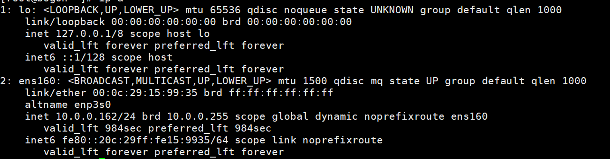

```powershell
dnf install keepalived -y

cp /usr/share/doc/keepalived/keepalived.conf.vrrp /etc/keepalived/keepalived.conf

仅保留一个即可，下面的VI_都删了
ha1操作
vim /etc/keepalived/keepalived.conf
vrrp_instance VI_1 {
    state MASTER
    interface ens160
    garp_master_delay 10
    smtp_alert
    virtual_router_id 51
    priority 100
    advert_int 1
    authentication {
        auth_type PASS
        auth_pass 1111
    }
    virtual_ipaddress {
        10.0.0.201 dev ens160 label ens160:0
        10.0.0.202 dev ens160 label ens160:1
        10.0.0.203 dev ens160 label ens160:2
    }
}

ha2操作
state Backup
priority 80

scp /etc/keepalived/keepalived.conf k8s-ha2.test.net:/etc/keepalived/keepalived.conf

systemctl enable --now keepalived.service

ip a
master节点上ping测试

ha1 停止keepalived测试
```

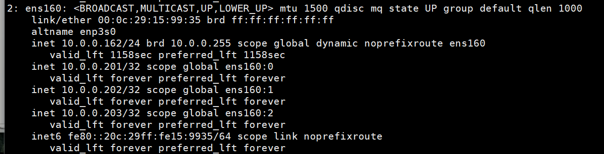

```powershell
部署haproxy
dnf install haproxy -y

vim /etc/haproxy/haproxy.cfg
listen k8s-api-6443
        bind 10.0.0.202:6443
        mode tcp
        server master1 10.0.0.156:6443 check inter 3s fall 3 rise 1
        server master2 10.0.0.157:6443 check inter 3s fall 3 rise 1
        server master3 10.0.0.158:6443 check inter 3s fall 3 rise 1

systemctl enable --now haproxy

ss -tunlp

scp /etc/haproxy/haproxy.cfg 10.0.0.163:/etc/haproxy/haproxy.cfg

vim /etc/sysctl.conf
net.ipv4.ip_nonlocal_bind = 1      允许监听没绑定socket的端口
sysctl -p
```

### 1.1.4master和node，harbor节点部署docker

阿里云docker源：https://developer.aliyun.com/mirror/docker-ce?spm=a2c6h.13651102.0.0.57e31b11Ww0lln

所有节点安装docker

```powershell
yum-config-manager --add-repo https://mirrors.aliyun.com/docker-ce/linux/centos/docker-ce.repo

dnf makecache

sudo dnf install -y docker-ce-20.10.24-3.el9 docker-ce-cli-20.10.24-3.el9 containerd.io docker-buildx-plugin docker-compose-plugin

rocky9不适合这样安装，因为rocky9的python版本是3.9
dnf install -y python3-pip
pip3 install docker-compose==1.29.2

rocky9安装，连不上就下载
DOCKER_CONFIG=${DOCKER_CONFIG:-~/.docker}
mkdir -p $DOCKER_CONFIG/cli-plugins
curl -SL https://github.com/docker/compose/releases/download/v2.24.7/docker-compose-linux-x86_64 -o $DOCKER_CONFIG/cli-plugins/docker-compose
chmod +x $DOCKER_CONFIG/cli-plugins/docker-compose

docker compose version
```

harbor

直接在github上把2.9.3的包下载下来传到habor节点上

```powershell
mkdir /apps/
cd /apps
tar zxvf /root/harbor-offline-installer-v2.9.3.tgz
cd harbor

cp harbor.yml.tmpl harbor.yml
vim harbor.yml
更改内容
harbor.test.local

mkdir certs
yum install -y easy-rsa
EASYRSA_DIR=/opt/easy-rsa
mkdir -p $EASYRSA_DIR
cp -r /usr/share/easy-rsa/3/* $EASYRSA_DIR
cd $EASYRSA_DIR
./easyrsa init-pki

./easyrsa build-ca nopass
MyHaborCA
./easyrsa build-server-full harbor.example.com nopass
yes

cp pki/ca.crt                               /apps/harbor/certs/
cp pki/issued/harbor.test.local.crt       /apps/harbor/certs/
cp pki/private/harbor.test.local.key      /apps/harbor/certs/

cd /apps/harbor
vim harbor.yml
./install.sh --with-trivy 

物理主机配置hosts解析
访问：harbor.test.local

重新编排
docker compose up -d
```

自签名可能遇见问题，以下是最佳实践

```powershell
第一步：生成 CA
openssl req -x509 -nodes -days 3650 \
  -newkey rsa:2048 \
  -keyout ca.key \
  -out ca.crt \
  -subj "/CN=MyTestCA" \
  -extensions v3_ca \
  -config <(cat <<EOF
[req]
distinguished_name = dn
x509_extensions = v3_ca
prompt = no

[dn]
CN = MyTestCA

[v3_ca]
basicConstraints = CA:TRUE
keyUsage = keyCertSign, cRLSign
subjectKeyIdentifier = hash
authorityKeyIdentifier = keyid:always,issuer
EOF
)


第二步：签发 harbor 证书
openssl req -new -key harbor.test.local.key -out harbor.csr \
  -subj "/CN=harbor.test.local" \
  -config <(cat <<EOF
[req]
distinguished_name = dn
req_extensions = v3_req
prompt = no

[dn]
CN = harbor.test.local

[v3_req]
subjectAltName = @alt_names

[alt_names]
DNS.1 = harbor.test.local
EOF
)

第三步：用 CA 签发 harbor 证书
openssl x509 -req -in harbor.csr -CA ca.crt -CAkey ca.key -CAcreateserial \
  -out harbor.test.local.crt -days 3650 -extensions v3_req \
  -extfile <(cat <<EOF
[v3_req]
subjectAltName = @alt_names
basicConstraints = CA:FALSE
keyUsage = digitalSignature, keyEncipherment
extendedKeyUsage = serverAuth

[alt_names]
DNS.1 = harbor.test.local
EOF
)

#!/bin/bash

CA_FILE=/root/ca.crt                          # 替换为你的实际证书路径
HARBOR_DOMAIN=harbor.test.local
CONTAINERD_CERT_PATH="/etc/containerd/certs.d/${HARBOR_DOMAIN}/ca.crt"
SYSTEM_CA_PATH="/etc/pki/ca-trust/source/anchors/${HARBOR_DOMAIN}.crt"

for IP in 10.0.0.156 10.0.0.157 10.0.0.159 10.0.0.160; do
  echo ">>> 正在配置 $IP"

  ssh root@$IP "mkdir -p $(dirname $CONTAINERD_CERT_PATH)"
  scp $CA_FILE root@$IP:/tmp/ca.crt

  ssh root@$IP "
    cp /tmp/ca.crt $CONTAINERD_CERT_PATH &&
    cp /tmp/ca.crt $SYSTEM_CA_PATH &&
    chmod 644 $CONTAINERD_CERT_PATH &&
    chmod 644 $SYSTEM_CA_PATH &&
    update-ca-trust extract &&
    systemctl restart containerd
  "

  echo ">>> $IP 配置完成"
done


# 验证系统 curl 能信任
curl -v https://harbor.test.local
```

k8s创建secret

```powershell
kubectl create secret docker-registry harbor-reg-secret \
  --docker-server=https://harbor.test.local \
  --docker-username=admin \
  --docker-password=123456 \
  -n default

kubectl get secret harbor-reg-secret -n default -o yaml > harbor-reg-secret.yaml               ##去掉namespace

kubectl apply -f harbor-reg-secret.yaml -n test

kubectl patch serviceaccount default -n default \
  -p '{"imagePullSecrets": [{"name": "harbor-reg-secret"}]}'  #default空间默认使用该仓库

```

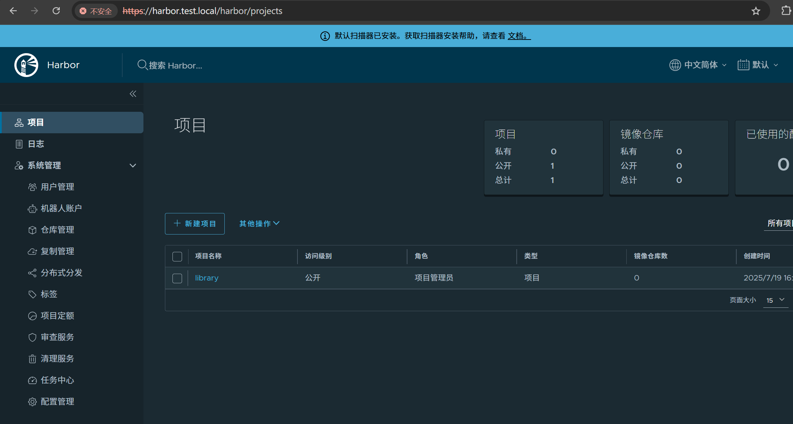

### 1.1.5时间同步

```powershell
cat <<EOF > /etc/chrony.conf
server time1.aliyun.com iburst
server time2.aliyun.com iburst
server time3.aliyun.com iburst
makestep 1.0 -1
EOF
systemctl restart chronyd
chronyc tracking
sudo chronyc makestep
systemctl status chronyd
```

### 1.1.6 Master1节点ansible部署及免密登录

```powershell
dnf install -y ansible
ansible --version


免密登录脚本
#!/bin/bash

# 配置
PASSWORD="123456"
USER="root"  # 请替换为实际用户名

# 生成 SSH 密钥对（如果没有的话）
if [ ! -f ~/.ssh/id_rsa ]; then
    echo "生成 SSH 密钥对..."
    ssh-keygen -t rsa -b 2048 -N "" -f ~/.ssh/id_rsa
fi

# 将公钥复制到目标主机
for i in {156..168}
do
    echo "将公钥复制到 10.0.0.$i ..."
    sshpass -p "$PASSWORD" ssh-copy-id -o StrictHostKeyChecking=no -i ~/.ssh/id_rsa.pub "$USER@10.0.0.$i"
done

# 测试免密登录并执行命令（这里示例是查看主机名）
for i in {156..168}
do
    echo "连接到 10.0.0.$i 并执行命令..."
    sshpass -p "$PASSWORD" ssh -o StrictHostKeyChecking=no "$USER@10.0.0.$i" 'hostname'
done

echo "所有主机免密登录测试完成！"

测试免密登录
```

### 1.1.7kubeasz（在此之前对所有节点做快照）

在此之前对所有节点做快照！！！！！！！！！！！！！！！！！！！

```powershell
由于rocky9+3.2.0ezdown+calico3.19+k8s1.23有不兼容的问题，主要是calico和rocky9，用centos7的话可以用3.2.0安装
wget https://github.com/easzlab/kubeasz/releases/download/3.2.0/ezdown


注意，以下为失败尝试！！！！！！！！！！！！！！！！！！3.6.7默认安装k8s1.33.1
使用3.6.7
wget https://github.com/easzlab/kubeasz/releases/download/3.6.7/ezdown
本次使用docker，k8s1.23.1
vim ezdown修改k8s版本为1.23.1

可能会失效，要关注最新ezdown的配置
cat > /etc/docker/daemon.json << EOF
{
  "exec-opts": ["native.cgroupdriver=systemd"],
  "registry-mirrors": [
    "https://docker.1ms.run",
    "https://hub1.nat.tf",
    "https://docker.1panel.live",
    "https://proxy.1panel.live",
    "https://hub.rat.dev",
    "https://docker.amingg.com"
  ],
  "insecure-registries": ["easzlab.io.local:5000"],
  "max-concurrent-downloads": 10,
  "log-driver": "json-file",
  "log-level": "warn",
  "log-opts": {
    "max-size": "10m",
    "max-file": "3"
    },
  "data-root": "/var/lib/docker"
}
EOF

sudo systemctl daemon-reexec
sudo systemctl restart docker
docker info | grep -A 10 'Registry Mirrors'

./ezdown -D
cd /etc/kubeasz

./ezctl new k8s-cluster
vim ./clusters/k8s-cluster/hosts
vim ./clusters/k8s-cluster/config.yml

./ezctl setup k8s-cluster 01
./ezctl setup k8s-cluster 02
...
./ezctl setup k8s-cluster 06

出现状况：第一次安装失败未完全清除k8s导致的pause默认拉取3.6版本失败，哪怕配置文件制定了3.10
第二次清除之后,docker报错没连上containerd,以下解决master1
rm -rf /opt/kube/bin/docker* /opt/kube/bin/containerd*
rm -rf /etc/docker /var/lib/docker /var/lib/containerd
rm -f /etc/systemd/system/docker.service
rm -f /run/docker.sock /run/containerd/containerd.sock

systemctl daemon-reexec
systemctl daemon-reload
cat > /etc/docker/daemon.json << EOF
{
  "exec-opts": ["native.cgroupdriver=$CGROUP_DRIVER"],
  "registry-mirrors": [
    "https://docker.1ms.run",
    "https://hub1.nat.tf",
    "https://docker.1panel.live",
    "https://proxy.1panel.live",
    "https://hub.rat.dev",
    "https://docker.amingg.com"
  ],
  "insecure-registries": ["easzlab.io.local:5000"],
  "max-concurrent-downloads": 10,
  "log-driver": "json-file",
  "log-level": "warn",
  "log-opts": {
    "max-size": "10m",
    "max-file": "3"
    },
  "data-root": "/var/lib/docker"
}
EOF

sudo systemctl daemon-reexec
sudo systemctl restart docker
docker info | grep -A 10 'Registry Mirrors'

遇到问题看日志，解决不了直接回滚快照（不要浪费时间在解决问题上）
dnf reinstall -y docker-ce-20.10.24-3.el9 docker-ce-cli-20.10.24-3.el9 containerd.io docker-buildx-plugin docker-compose-plugin修复docker
不一定能修复
搞来搞去没搞完第一个问题，第二个问题根本原因还是docker版本杂糅

其他节点连不上master1的仓库
curl -v http://easzlab.io.local:5000/
docker info | grep insecure
```

```powershell
默认安装k8s1.33.1
很顺畅直接按原步骤装完，所以部署k8s如果配置没什么错误那基本上都是些版本不兼容的问题
```

./clusters/k8s-cluster/hosts

```powershell
[root@master1 k8s-cluster]# cat config.yml 
############################
# prepare
############################
# 可选离线安装系统软件包 (offline|online)
INSTALL_SOURCE: "online"

# 可选进行系统安全加固 github.com/dev-sec/ansible-collection-hardening
# (deprecated) 未更新上游项目，未验证最新k8s集群安装，不建议启用
OS_HARDEN: false


############################
# role:deploy
############################
# default: ca will expire in 100 years
# default: certs issued by the ca will expire in 50 years
CA_EXPIRY: "876000h"
CERT_EXPIRY: "876000h"

# force to recreate CA and other certs, not suggested to set 'true'
CHANGE_CA: false

# kubeconfig 配置参数
CLUSTER_NAME: "cluster1"
CONTEXT_NAME: "context-{{ CLUSTER_NAME }}"

# k8s version
K8S_VER: "1.33.1"

# set unique 'k8s_nodename' for each node, if not set(default:'') ip add will be used
# CAUTION: 'k8s_nodename' must consist of lower case alphanumeric characters, '-' or '.',
# and must start and end with an alphanumeric character (e.g. 'example.com'),
# regex used for validation is '[a-z0-9]([-a-z0-9]*[a-z0-9])?(\.[a-z0-9]([-a-z0-9]*[a-z0-9])?)*'
K8S_NODENAME: " \
                    {{ k8s_nodename|replace('_', '-')|lower }} \
                \
                    k8s-{{ inventory_hostname|replace('.', '-') }} \
               "

# use 'K8S_NODENAME' to set hostname
ENABLE_SETTING_HOSTNAME: true


############################
# role:etcd
############################
# 设置不同的wal目录，可以避免磁盘io竞争，提高性能
ETCD_DATA_DIR: "/var/lib/etcd"
ETCD_WAL_DIR: ""


############################
# role:runtime [containerd,docker]
############################
# [.]启用拉取加速镜像仓库
ENABLE_MIRROR_REGISTRY: true

# [.]添加信任的私有仓库
# 必须按照如下示例格式，协议头'http://'和'https://'不能省略
INSECURE_REG:
  - "http://easzlab.io.local:5000"
  - "https://harbor.test.local"

# [.]基础容器镜像
SANDBOX_IMAGE: "easzlab.io.local:5000/easzlab/pause:3.10"

# [containerd]容器持久化存储目录
CONTAINERD_STORAGE_DIR: "/var/lib/containerd"

# [docker]容器存储目录
DOCKER_STORAGE_DIR: "/var/lib/docker"

# [docker]开启Restful API
DOCKER_ENABLE_REMOTE_API: false


############################
# role:kube-master
############################
# k8s 集群 master 节点证书配置，可以添加多个ip和域名（比如增加公网ip和域名）
MASTER_CERT_HOSTS:
  - "10.0.0.202"
  - "k8s.test.io"
  #- "www.test.com"

# node 节点上 pod 网段掩码长度（决定每个节点最多能分配的pod ip地址）
# 如果flannel 使用 --kube-subnet-mgr 参数，那么它将读取该设置为每个节点分配pod网段
# https://github.com/coreos/flannel/issues/847
NODE_CIDR_LEN: 24


############################
# role:kube-node
############################
# Kubelet 根目录
KUBELET_ROOT_DIR: "/var/lib/kubelet"

# node节点最大pod 数
MAX_PODS: 110

# 配置为kube组件（kubelet,kube-proxy,dockerd等）预留的资源量
# 数值设置详见templates/kubelet-config.yaml.j2
KUBE_RESERVED_ENABLED: "no"

# k8s 官方不建议草率开启 system-reserved, 除非你基于长期监控，了解系统的资源占用状况；
# 并且随着系统运行时间，需要适当增加资源预留，数值设置详见templates/kubelet-config.yaml.j2
# 系统预留设置基于 4c/8g 虚机，最小化安装系统服务，如果使用高性能物理机可以适当增加预留
# 另外，集群安装时候apiserver等资源占用会短时较大，建议至少预留1g内存
SYS_RESERVED_ENABLED: "no"


############################
# role:network [flannel,calico,cilium,kube-ovn,kube-router]
############################
# ------------------------------------------- flannel
# [flannel]设置flannel 后端"host-gw","vxlan"等
FLANNEL_BACKEND: "vxlan"
DIRECT_ROUTING: false

# [flannel] 
flannel_ver: "v0.26.0"

# ------------------------------------------- calico
# [calico] IPIP隧道模式可选项有: [Always, CrossSubnet, Never],跨子网可以配置为Always与CrossSubnet(公有云建议使用always比较省事，其他的话需要修改各自公有云的网络配置，具体可以参考各个公有云说明)
# 其次CrossSubnet为隧道+BGP路由混合模式可以提升网络性能，同子网配置为Never即可.
CALICO_IPV4POOL_IPIP: "Always"

# [calico]设置 calico-node使用的host IP，bgp邻居通过该地址建立，可手工指定也可以自动发现
IP_AUTODETECTION_METHOD: "can-reach={{ groups['kube_master'][0] }}"

# [calico]设置calico 网络 backend: bird, vxlan, none
CALICO_NETWORKING_BACKEND: "bird"

# [calico]设置calico 是否使用route reflectors
# 如果集群规模超过50个节点，建议启用该特性
CALICO_RR_ENABLED: false

# CALICO_RR_NODES 配置route reflectors的节点，如果未设置默认使用集群master节点 
# CALICO_RR_NODES: ["192.168.1.1", "192.168.1.2"]
CALICO_RR_NODES: []

# [calico]更新支持calico 版本: ["3.19", "3.23"]
calico_ver: "v3.28.4"

# [calico]calico 主版本
calico_ver_main: "{{ calico_ver.split('.')[0] }}.{{ calico_ver.split('.')[1] }}"

# ------------------------------------------- cilium
# [cilium]镜像版本
cilium_ver: "1.17.4"
cilium_connectivity_check: false
cilium_hubble_enabled: false
cilium_hubble_ui_enabled: false

# ------------------------------------------- kube-ovn
# [kube-ovn]离线镜像tar包
kube_ovn_ver: "v1.11.5"

# ------------------------------------------- kube-router
# [kube-router]公有云上存在限制，一般需要始终开启 ipinip；自有环境可以设置为 "subnet"
OVERLAY_TYPE: "full"

# [kube-router]NetworkPolicy 支持开关
FIREWALL_ENABLE: true

# [kube-router]kube-router 镜像版本
kube_router_ver: "v1.5.4"


############################
# role:cluster-addon
############################
# coredns 自动安装
dns_install: "no"
corednsVer: "1.12.1"
ENABLE_LOCAL_DNS_CACHE: false
dnsNodeCacheVer: "1.25.0"
# 设置 local dns cache 地址
LOCAL_DNS_CACHE: "169.254.20.10"

# metric server 自动安装
metricsserver_install: "no"
metricsVer: "v0.7.2"

# dashboard 自动安装
dashboard_install: "no"
dashboardVer: "7.12.0"

# prometheus 自动安装
prom_install: "no"
prom_namespace: "monitor"
prom_chart_ver: "45.23.0"

# kubeapps 自动安装，如果选择安装，默认同时安装local-storage（提供storageClass: "local-path"）
kubeapps_install: "no"
kubeapps_install_namespace: "kubeapps"
kubeapps_working_namespace: "default"
kubeapps_storage_class: "local-path"
kubeapps_chart_ver: "12.4.3"

# local-storage (local-path-provisioner) 自动安装
local_path_provisioner_install: "no"
local_path_provisioner_ver: "v0.0.31"
# 设置默认本地存储路径
local_path_provisioner_dir: "/opt/local-path-provisioner"

# nfs-provisioner 自动安装
nfs_provisioner_install: "no"
nfs_provisioner_namespace: "kube-system"
nfs_provisioner_ver: "v4.0.2"
nfs_storage_class: "managed-nfs-storage"
nfs_server: "192.168.1.10"
nfs_path: "/data/nfs"

# network-check 自动安装
network_check_enabled: false 
network_check_schedule: "*/5 * * * *"

# kubeblocks 自动安装
kubeblocks_install: "no"
kb_addon_mysql_install: "no"
kb_addon_pg_install: "no"
kb_addon_redis_install: "no"
kb_addon_minio_install: "no"
kb_addon_es_install: "no"
kb_addon_mongodb_install: "no"


############################
# role:harbor
############################
# harbor version，完整版本号
HARBOR_VER: "v2.12.4"
HARBOR_DOMAIN: "harbor.easzlab.io.local"
HARBOR_PATH: /var/data
HARBOR_TLS_PORT: 8443
HARBOR_REGISTRY: "{{ HARBOR_DOMAIN }}:{{ HARBOR_TLS_PORT }}"

# if set 'false', you need to put certs named harbor.pem and harbor-key.pem in directory 'down'
HARBOR_SELF_SIGNED_CERT: true

# install extra component
HARBOR_WITH_TRIVY: false
```

```powershell
[root@master1 k8s-cluster]# cat hosts 
# 'etcd' cluster should have odd member(s) (1,3,5,...)
[etcd]
10.0.0.164
10.0.0.165
10.0.0.166

# master node(s), set unique 'k8s_nodename' for each node
# CAUTION: 'k8s_nodename' must consist of lower case alphanumeric characters, '-' or '.',
# and must start and end with an alphanumeric character
[kube_master]
10.0.0.156 k8s_nodename='master1'
10.0.0.157 k8s_nodename='master2'

# work node(s), set unique 'k8s_nodename' for each node
# CAUTION: 'k8s_nodename' must consist of lower case alphanumeric characters, '-' or '.',
# and must start and end with an alphanumeric character
[kube_node]
10.0.0.159 k8s_nodename='worker1'
10.0.0.160 k8s_nodename='worker2'

# [optional] harbor server, a private docker registry
# 'NEW_INSTALL': 'true' to install a harbor server; 'false' to integrate with existed one
[harbor]
#10.0.0.8 NEW_INSTALL=false

# [optional] loadbalance for accessing k8s from outside
[ex_lb]
10.0.0.6 LB_ROLE=backup EX_APISERVER_VIP=10.0.0.202 EX_APISERVER_PORT=6443
10.0.0.7 LB_ROLE=master EX_APISERVER_VIP=10.0.0.202 EX_APISERVER_PORT=6443

# [optional] ntp server for the cluster
[chrony]
#10.0.0.1

[all:vars]
# --------- Main Variables ---------------
# Secure port for apiservers
SECURE_PORT="6443"

# Cluster container-runtime supported: docker, containerd
# if k8s version >= 1.24, docker is not supported
CONTAINER_RUNTIME="containerd"

# Network plugins supported: calico, flannel, kube-router, cilium, kube-ovn
CLUSTER_NETWORK="calico"

# Service proxy mode of kube-proxy: 'iptables' or 'ipvs'
PROXY_MODE="ipvs"

# K8S Service CIDR, not overlap with node(host) networking
SERVICE_CIDR="172.30.0.0/16"

# Cluster CIDR (Pod CIDR), not overlap with node(host) networking
CLUSTER_CIDR="172.31.0.0/16"

# NodePort Range
NODE_PORT_RANGE="30000-65000"

# Cluster DNS Domain
CLUSTER_DNS_DOMAIN="test.local"

# -------- Additional Variables (don't change the default value right now) ---
# Binaries Directory
bin_dir="/opt/kube/bin"

# Deploy Directory (kubeasz workspace)
base_dir="/etc/kubeasz"

# Directory for a specific cluster
cluster_dir="{{ base_dir }}/clusters/k8s-cluster"

# CA and other components cert/key Directory
ca_dir="/etc/kubernetes/ssl"

# Default 'k8s_nodename' is empty
k8s_nodename=''

# Default python interpreter
ansible_python_interpreter=/usr/bin/python3
```

没有问题

```powershell
kubectl get pods -A -owide所有calico 1/1,只要不是1/1就是错的

[root@master1 k8s-cluster]# calicoctl node status
Calico process is running.

IPv4 BGP status
+--------------+-------------------+-------+----------+-------------+
| PEER ADDRESS |     PEER TYPE     | STATE |  SINCE   |    INFO     |
+--------------+-------------------+-------+----------+-------------+
| 10.0.0.157   | node-to-node mesh | up    | 04:42:10 | Established |
| 10.0.0.159   | node-to-node mesh | up    | 04:42:10 | Established |
| 10.0.0.160   | node-to-node mesh | up    | 04:42:10 | Established |
+--------------+-------------------+-------+----------+-------------+

IPv6 BGP status
No IPv6 peers found.

测试
[root@master1 k8s-cluster]# kubectl run net-test1 --image=alpine sleep 360000

[root@master1 k8s-cluster]# kubectl run net-test2 --image=alpine sleep 360000

kubectl get pods -owide

kubectl exec -it net-test1 -- sh
ping {net-test2的ip}

kubectl delete pod net-test1 net-test2
```

### 1.1.8组件模版配置文件

```powershell
/etc/kubeasz/roles/cluster-addon
```

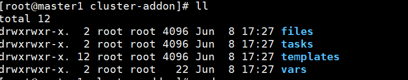

```powershell
cat /etc/kubeasz/roles/cluster-addon/templates/dns/coredns.yaml.j2
也可以直接在https://github.com/kubernetes/kubernetes/blob/master/CHANGELOG/CHANGELOG-1.33.md
这里下载解压前四个 ，解压后有模版配置文件
```

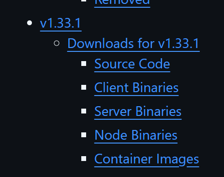

### 1.1.9coredns安装

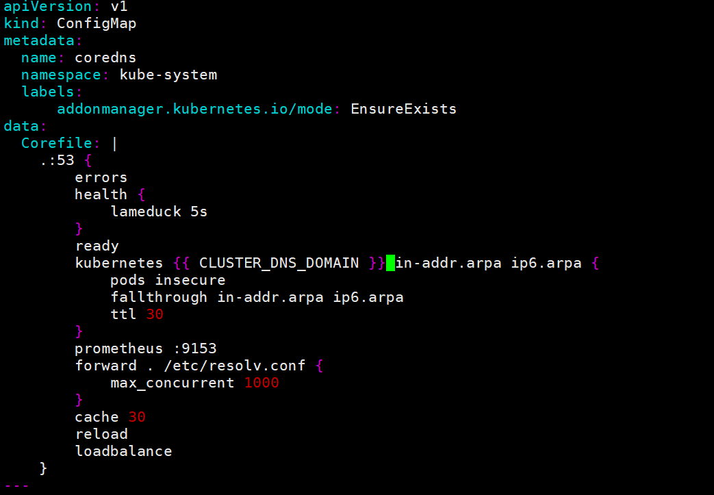

```powershell
kubernetes test.local in-addr.arpa ip6.arpa {

forward . 223.6.6.6 {        dns转发

缓存30秒
CoreDNS 1.12.0开始将 loop 检测逻辑内置到核心代码中，不再需要用户手动添加 loop 插件
```

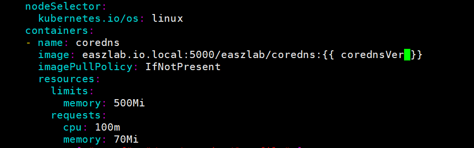

```powershell
image: easzlab.io.local:5000/easzlab/coredns:1.12.1
查看net-test1容器下的/etc/resolv.conf
配在yaml文件最下面的cluster_ip
172.30.0.2

```


```powershell
[root@k8s-master1 kubeasz]# kubectl get deployments -n kube-system
NAME                      READY   UP-TO-DATE   AVAILABLE   AGE
calico-kube-controllers   1/1     1            1           104m
coredns                   1/1     1            1           16m
查看
kubectl get deployments -n kube-system -o yaml
修改
kubectl edit deployments coredns -n kube-system -o yaml
replicas: 2

[root@k8s-master1 kubeasz]# kubectl get svc -A
NAMESPACE     NAME         TYPE        CLUSTER-IP   EXTERNAL-IP   PORT(S)                  AGE
default       kubernetes   ClusterIP   172.30.0.1   <none>        443/TCP                  127m
kube-system   kube-dns     ClusterIP   172.30.0.2   <none>        53/UDP,53/TCP,9153/TCP   36m

进入net-test1容器可以ping kubernetes（解析） 能通
ping kube-dns不通，因为在不同的名称空间里
ping kube-dns.kube-system可以ping通
完整域名kube-dns.kube-system.svc.test.local

dns缓存放在nginx容器里或者宿主机中效果并不太好，放在coredns效果还行
```

```powershell
kubectl exec -it net-test1 -- nslookup kube-dns.kube-system.svc.test.local
dns-utils包
```

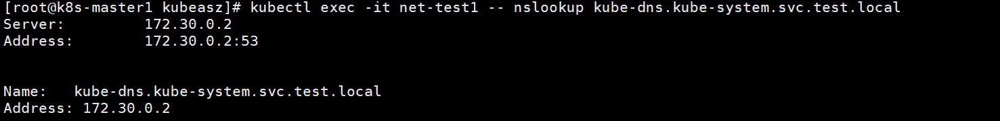

### 1.1.10helm安装

```powershell
wget https://get.helm.sh/helm-v3.18.4-linux-amd64.tar.gz
tar -zxvf helm-v3.18.4-linux-amd64.tar.gz
mv linux-amd64/helm /usr/local/bin/helm
chmod +x /usr/local/bin/helm

helm version

helm repo add stable https://charts.helm.sh/stable
helm repo add bitnami https://charts.bitnami.com/bitnami
helm repo update
显然国内这两仓库无法加上

helm repo add aliyun https://kubernetes.oss-cn-hangzhou.aliyuncs.com/charts
helm repo add azure http://mirror.azure.cn/kubernetes/charts
helm repo update
helm repo list
```

### 1.1.11通过helm安装dashboard

```powershell
helm repo add kubernetes-dashboard https://kubernetes.github.io/dashboard/
helm upgrade --install kubernetes-dashboard kubernetes-dashboard/kubernetes-dashboard --create-namespace --namespace kubernetes-dashboard

kubectl -n kubernetes-dashboard get pods
kubectl -n kubernetes-dashboard get svc

```

```powershell
暴露给外部
kubectl -n kubernetes-dashboard edit svc kubernetes-dashboard-kong-proxy
改为NodePort
nodePort: 30888

kubectl -n kubernetes-dashboard get svc
https://10.0.0.156:30888/
```

```powershell
集群管理员角色的用户
admin-user.yaml
cat <<EOF >admin-user.yaml
apiVersion: v1
kind: ServiceAccount
metadata:
  name: admin-user
  namespace: kubernetes-dashboard
---
apiVersion: rbac.authorization.k8s.io/v1
kind: ClusterRoleBinding
metadata:
  name: admin-user
roleRef:
  apiGroup: rbac.authorization.k8s.io
  kind: ClusterRole
  name: cluster-admin
subjects:
- kind: ServiceAccount
  name: admin-user
  namespace: kubernetes-dashboard
EOF


kubectl apply -f admin-user.yaml
```

```powershell
kubectl get secrets -A/-n kubernetes-dashboard
kubectl describe secrets -A/-n kubernetes-dashboard
发现没有，原来是新版的不支持直接自动生成token

admin-user实际已经存在
kubectl get serviceaccount -n kubernetes-dashboard

kubectl -n kubernetes-dashboard create token admin-user
复制token
```

rancher

kuboard

kubesphere的功能更为强大，界面也美观

但是对于新手而言，用dashboard就够了，用功能过于强大的web工具不利于学习k8s，就像学习linux如果一开始就在图形化界面点点点一样，不利于掌握命令和了解整个架构网络

## 1.2ETCD

高性能键值数据库

### 1.2.1一些基本操作

可视化etcd manager

```powershell
ETCDCTL_API=3
etcdctl --help
etcdctl member --help
export NODE_IPS="10.0.0.164 10.0.0.165 10.0.0.166"

可以用grep unhealty做监控
for ip in ${NODE_IPS}; do 
    etcdctl --endpoints=https://${ip}:2379 \
    --cacert=/etc/kubernetes/ssl/ca.pem \
    --cert=/etc/kubernetes/ssl/etcd.pem \
    --key=/etc/kubernetes/ssl/etcd-key.pem \
    endpoint health; 
done

表格方式显示节点详细状态
for ip in ${NODE_IPS}; do etcdctl --write-out=table endpoint status --endpoints=https://${ip}:2379 --cacert=/etc/kubernetes/ssl/ca.pem --cert=/etc/kubernetes/ssl/etcd.pem --key=/etc/kubernetes/ssl/etcd-key.pem;
done

etcdctl get / --prefix --keys-only
grep pod/namespaces/depolyment/calico.....
```

```powershell
增
etcdctl put /foo "bar"
删
etcdctl del /foo
改
etcdctl put /foo "newvalue"
查
etcdctl get /foo
```

```powershell
watch机制，不断监控看数据，发生变化通知客户端，比如api-server
etcdctl watch /data

etcdctl put /data "bar"
ok
```

### 1.2.2备份恢复

```powershell
backup命令已经弃用
etcdctl snapshot save /backup/etcd-k8s-$(date +%F).db \
  --endpoints=https://127.0.0.1:2379 \
  --cacert=/etc/kubernetes/pki/ca.crt \
  --cert=/etc/kubernetes/pki/etcd/server.crt \
  --key=/etc/kubernetes/pki/etcd/server.key

出现故障
systemctl stop kube-apiserver
systemctl stop etcd

mv /var/lib/etcd /var/lib/etcd.bak
etcdctl snapshot restore /backup/etcd-k8s-2025-07-23.db \
  --data-dir=/var/lib/etcd

systemctl start etcd
systemctl start kube-apiserver

```

```powershell
当 etcd 集群若机器数量超过集群总节点数一半以上的时候（如总数为三台宕两台），就会导致整个集群宕机，后期需要重新恢复数据，则恢复流程如下：

1.恢复服务器系统
2.重新部署 ETCD 集群
3.停止 kube-apiserver/controller-manager/scheduler/kubelet/kube-proxy，实际上就是停止kube-apiserver
4.停止 ETCD 集群
5.各 ETCD 节点恢复同一份备份数据
6.启动各节点并验证 ETCD 集群
7.启动 kube-apiserver/controller-manager/scheduler/kubelet/kube-proxy
8.验证 k8s master 状态及 pod 数据

基本很难遇到etcd有问题，但还是有备无患
```

### 1.2.3集群节点添加和删除

```powershell
不建议超过五个节点
一个节点够用，3个节点高可用

删除节点
etcdctl member remove <member-id> \
  --endpoints=https://127.0.0.1:2379 \
  --cacert=... --cert=... --key=...
  
systemctl stop etcd
mv /var/lib/etcd /var/lib/etcd.bak

etcdctl member list

添加节点
etcdctl --endpoints=https://10.0.0.1:2379 \
  --cacert=/etc/kubernetes/pki/ca.crt \
  --cert=/etc/kubernetes/pki/etcd/peer.crt \
  --key=/etc/kubernetes/pki/etcd/peer.key \
  member add etcd-new \
  --peer-urls=https://10.0.0.4:2380
在新节点配置启动参数
systemctl start etcd
etcdctl member list
```


## 1.3velero和minio备份恢复

```powershell
安全备份恢复迁移k8s集群资源，不支持增量备份
支持把容器应用从一个集群迁移到另一个集群
调api-server从etcd拿数据，放到对象存储（oss,minio,aws s3）三副本，ceph


对于学习教程的疑惑，为什么要安装证书？问AI后得到答案
你只有在不使用 Kubernetes 内部的认证机制（如 token），而是通过 client-certificate-authentication（TLS双向认证）访问 API Server 才需要证书

Kubernetes 组件之间不能直接用 RBAC 是因为它们之间的通信，很多不是走 Kubernetes API Server 的权限系统（即不是请求 Kubernetes API），而 RBAC 只作用于 Kubernetes API Server 的访问控制。
```

### 1.3.1安装部署

#### minio

```powershell
docker pull quay.io/minio/minio:latest

docker run -d --name minio \
  -p 9000:9000 -p 9001:9001 \
  -e "MINIO_ROOT_USER=admin" \
  -e "MINIO_ROOT_PASSWORD=123456" \
  -v /data/minio:/data \
  quay.io/minio/minio server /data --console-address ":9001"
```

#### velero

```powershell
先创建一个文件 `credentials-velero` 内容如下：
[default]
aws_access_key_id=minioadmin
aws_secret_access_key=minioadmin123

先创建一个文件 `credentials-velero` 内容如下：
kubectl create secret generic cloud-credentials \
  --namespace velero \
  --from-file=credentials=./cloud         

kubectl get pods -n velero

wget https://github.com/vmware-tanzu/velero/releases/download/v1.16.1/velero-v1.16.1-linux-amd64.tar.gz
tar -zxvf velero-v1.16.1-linux-amd64.tar.gz
cp velero-v1.16.1-linux-amd64/velero /usr/local/bin/
chmod +x /usr/local/bin/velero

velero version
```


```powershell
helm repo add vmware-tanzu https://vmware-tanzu.github.io/helm-charts
helm repo update

helm install velero vmware-tanzu/velero \
  --namespace velero --create-namespace \
  --set configuration.backupStorageLocation[0].name=default \
  --set configuration.backupStorageLocation[0].provider=aws \
  --set configuration.backupStorageLocation[0].bucket=velero \
  --set configuration.backupStorageLocation[0].config.region=minio \
  --set configuration.backupStorageLocation[0].config.s3ForcePathStyle=true \
  --set configuration.backupStorageLocation[0].config.s3Url=http://10.0.0.167:9000 \   
  --set configuration.volumeSnapshotLocation[0].name=default \
  --set configuration.volumeSnapshotLocation[0].provider=aws \
  --set credentials.useSecret=true \
  --set-file credentials.secretContents.cloud=cloud \     
  --set initContainers[0].name=velero-plugin-for-aws \
  --set initContainers[0].image=velero/velero-plugin-for-aws:v1.9.1 \
  --set initContainers[0].volumeMounts[0].mountPath=/target \
  --set initContainers[0].volumeMounts[0].name=plugins

参数值需要看着改
```

```powershell
kubectl get deployment velero -n velero -o yaml |cat

apiVersion: apps/v1
kind: Deployment
metadata:
  annotations:
    deployment.kubernetes.io/revision: "3"
    meta.helm.sh/release-name: velero
    meta.helm.sh/release-namespace: velero
  creationTimestamp: "2025-07-23T12:46:40Z"
  generation: 3
  labels:
    app.kubernetes.io/instance: velero
    app.kubernetes.io/managed-by: Helm
    app.kubernetes.io/name: velero
    app.kubernetes.io/version: 1.16.1
    component: velero
    helm.sh/chart: velero-10.0.10
  name: velero
  namespace: velero
  resourceVersion: "162728"
  uid: 8e6d98d8-5583-49dc-99e3-fef141e9cef9
spec:
  progressDeadlineSeconds: 600
  replicas: 1
  revisionHistoryLimit: 10
  selector:
    matchLabels:
      app.kubernetes.io/instance: velero
      app.kubernetes.io/name: velero
  strategy:
    type: Recreate
  template:
    metadata:
      annotations:
        checksum/secret: b9754ca4d83dab2f2e3ce5d2f763c69ed92c2298dc2737084680716557250af3
        prometheus.io/path: /metrics
        prometheus.io/port: "8085"
        prometheus.io/scrape: "true"
      creationTimestamp: null
      labels:
        app.kubernetes.io/instance: velero
        app.kubernetes.io/managed-by: Helm
        app.kubernetes.io/name: velero
        app.kubernetes.io/version: 1.16.1
        helm.sh/chart: velero-10.0.10
        name: velero
    spec:
      automountServiceAccountToken: true
      containers:
      - args:
        - server
        - --uploader-type=kopia
        - --keep-latest-maintenance-jobs=3
        command:
        - /velero
        env:
        - name: VELERO_SCRATCH_DIR
          value: /scratch
        - name: VELERO_NAMESPACE
          valueFrom:
            fieldRef:
              apiVersion: v1
              fieldPath: metadata.namespace
        - name: LD_LIBRARY_PATH
          value: /plugins
        - name: AWS_SHARED_CREDENTIALS_FILE
          value: /credentials/cloud
        - name: GOOGLE_APPLICATION_CREDENTIALS
          value: /credentials/cloud
        - name: AZURE_CREDENTIALS_FILE
          value: /credentials/cloud
        - name: ALIBABA_CLOUD_CREDENTIALS_FILE
          value: /credentials/cloud
        image: velero/velero:v1.16.1
        imagePullPolicy: IfNotPresent
        livenessProbe:
          failureThreshold: 5
          httpGet:
            path: /metrics
            port: http-monitoring
            scheme: HTTP
          initialDelaySeconds: 10
          periodSeconds: 30
          successThreshold: 1
          timeoutSeconds: 5
        name: velero
        ports:
        - containerPort: 8085
          name: http-monitoring
          protocol: TCP
        readinessProbe:
          failureThreshold: 5
          httpGet:
            path: /metrics
            port: http-monitoring
            scheme: HTTP
          initialDelaySeconds: 10
          periodSeconds: 30
          successThreshold: 1
          timeoutSeconds: 5
        resources: {}
        terminationMessagePath: /dev/termination-log
        terminationMessagePolicy: File
        volumeMounts:
        - mountPath: /plugins
          name: plugins
        - mountPath: /credentials
          name: cloud-credentials
        - mountPath: /scratch
          name: scratch
      dnsPolicy: ClusterFirst
      initContainers:
      - image: velero/velero-plugin-for-aws:v1.9.1
        imagePullPolicy: IfNotPresent
        name: velero-plugin-for-aws
        resources: {}
        terminationMessagePath: /dev/termination-log
        terminationMessagePolicy: File
        volumeMounts:
        - mountPath: /target
          name: plugins
      restartPolicy: Always
      schedulerName: default-scheduler
      securityContext: {}
      serviceAccount: velero-server
      serviceAccountName: velero-server
      terminationGracePeriodSeconds: 3600
      volumes:
      - name: cloud-credentials
        secret:
          defaultMode: 420
          secretName: cloud-credentials
      - emptyDir: {}
        name: plugins
      - emptyDir: {}
        name: scratch
status:
  availableReplicas: 1
  conditions:
  - lastTransitionTime: "2025-07-23T12:46:40Z"
    lastUpdateTime: "2025-07-24T02:02:57Z"
    message: ReplicaSet "velero-77bb8b4d6f" has successfully progressed.
    reason: NewReplicaSetAvailable
    status: "True"
    type: Progressing
  - lastTransitionTime: "2025-07-24T02:23:59Z"
    lastUpdateTime: "2025-07-24T02:23:59Z"
    message: Deployment has minimum availability.
    reason: MinimumReplicasAvailable
    status: "True"
    type: Available
  observedGeneration: 3
  readyReplicas: 1
  replicas: 1
  updatedReplicas: 1
```


### 1.3.2备份恢复

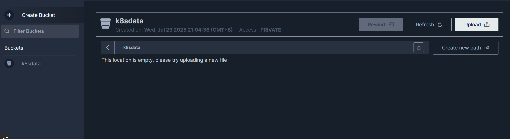

```powershell
BACKUP_NAME="backup-default-namespace-$(date +%Y%m%d%H%M%S)"

velero backup create $BACKUP_NAME \
  --include-namespaces default \
  --storage-location default
  
kubectl delete pod net-test1 -n default

velero restore create --from-backup $BACKUP_NAME

Restore request "backup-default-namespace-20250724112257-20250724112404" submitted successfully.
Run `velero restore describe backup-default-namespace-20250724112257-20250724112404` or `velero restore logs backup-default-namespace-20250724112257-20250724112404` for more details.
```

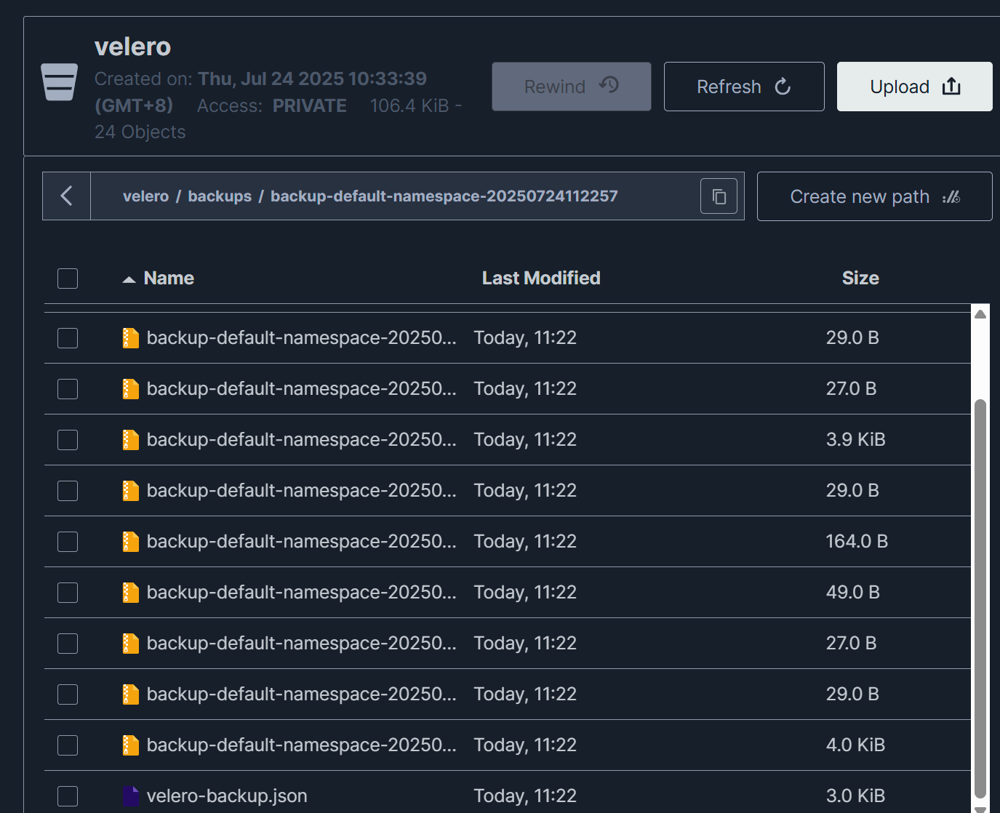

## 1.4k8s集群升级

### 1.4.1小版本升级

```powershell
如1.33.1升级到1.33.3
替换二进制文件进行升级
1.下载对应版本的二进制文件，master以及node的
2.停止master组件服务并替换二进制
3.启动
4.节点驱逐node
kubectl drain <node-name> --ignore-daemonsets --delete-emptydir-data
5.停止node组件服务并替换二进制
6.重新加入调度/使用ezctl添加node
kubectl uncordon <node-name>

```

### 1.4.2跨版本迁移升级

```powershell
跨版本升级只能迁移升级
如1.22升级到1.33
1.新建1.33集群，打通网络，尤其是镜像仓库，如果有使用网上的helm源，镜像源，这些服务可能很多都要升级
2.旧版本velero全量备份，etcd全量备份
3.将 MinIO（或 OSS）的存储挂载到新集群
4.新集群中部署 Velero，确保能访问备份桶
5.恢复
```

数据卷迁移

```powershell
如果使用 NFS/GlusterFS，挂载路径可复用

如果使用 hostPath，可打包对应目录迁移

云盘类（如阿里云 Disk、EBS）可创建快照重建 PVC
```

验证与切换

```powershell
1. 在新集群中验证所有服务和数据是否正常
2. DNS 或 Ingress 切换流量到新集群
3. 停止旧集群，备份并清理资源
```

添加节点

```powershell
ezctl
```

## 1.5k8s资源对象清单

**本节所有yaml资源仅供参考**

| 类型                                           | 是否持久                             | 是否推荐       | 原理                                     |
| ---------------------------------------------- | ------------------------------------ | -------------- | ---------------------------------------- |
| ✅ **声明式** (`kubectl apply -f`)              | ✅ **持久有效**（保存在 YAML 或 Git） | ✅ 推荐         | 定义目标状态，系统不断驱动资源向目标靠拢 |
| ⚠️ **命令式** (`kubectl scale`, `kubectl edit`) | ❌ **临时修改**                       | ⚠️ 不推荐长期用 | 修改当前实际状态，不持久化目标           |

```powershell
域名：<service资源名称>.<命名空间>.svc.cluster.local
```

```powershell
kubectl api-versions
kubectl api-resources
kubectl api-resources --api-group=
```

```powershell
查询写法
比如：
kubectl explain Deployment
kubectl explain Deployment.spec
...
```

### 1.5.1简介

```powershell
Kubernetes基于声明式API管理资源对象，通常使用yaml文件进行配置。yaml文件主要包含以下字段：

‌apiVersion‌：指定创建对象所使用的Kubernetes API版本。
‌kind‌：指明想要创建的资源对象类型。
‌metadata‌：包含识别对象的唯一性数据，如‌name‌（名称）和可选的‌namespace‌（命名空间）。
‌spec‌：详细定义资源对象的规范信息，如label标签、容器名称、镜像、端口映射等。
‌status‌：Pod创建完成后，Kubernetes自动生成的状态信息。
```

| **资源类型** | **资源名称**                                                 |
| ------------ | :----------------------------------------------------------- |
| **资源对象** | Pod、ReplicaSet、ReplicationController、Deployment、StatefulSet、DaemonSet、Job、CronJob、HorizontalPodAutoscaling、Node、Namespace、Service、Ingress、Label、CustomResourceDefinition |
| **存储对象** | Volume、PersistentVolume、PersistentVolumeClaim、Secret、ConfigMap |
| **策略对象** | SecurityContext、ResourceQuota、LimitRange                   |
| **身份对象** | ServiceAccount、Role、ClusterRole                            |

```yaml
spec:
  replicas: 3                  # 控制器管理多少个 Pod
  selector:                    # 控制器用 label 找自己管理的 Pod
    matchLabels:
      app: myapp
  template:                    # 真正描述 Pod 是什么样子
    metadata:
      labels:
        app: myapp
    spec:                      # Pod 的规范
      containers:
        - name: ...
```

### 1.5.2job和cronjob

job一次性，不重要

```yaml
apiVersion: batch/v1
kind: Job
metadata:
  name: job-mysql-init
  namespace: linux
spec:
  template:
    spec:
      containers:
      - name: job-mysql-init-container
        image: centos:7.9.2009
        command: ["/bin/sh"]
        args: ["-c", "echo data init job at `date +%Y-%m-%d_%H-%M-%S` >> /cache/data.log"]
        volumeMounts:
        - mountPath: /cache
          name: cache-volume
      volumes:
      - name: cache-volume
        hostPath:
          path: /tmp/jobdata
      restartPolicy: Never
```

**cronjob**

```yaml
apiVersion: batch/v1
kind: CronJob
metadata:
  name: cronjob-mysql-databackup
spec:
  #schedule: "30 2 * * *"
  schedule: "* * * * *"
  jobTemplate:
    spec:
      template:
        spec:
          containers:
          - name: cronjob-mysql-databackup-pod
            image: centos:7.9.2009
            #imagePullPolicy: IfNotPresent
            command: ["/bin/sh"]
            args: ["-c", "echo mysql databackup cronjob at `date +%Y-%m-%d_%H-%M-%S` >> /cache/data.log"]
            volumeMounts: 
            - mountPath: /cache
              name: cache-volume
          volumes:
          - name: cache-volume
            hostPath:
              path: /tmp/cronjobdata
          restartPolicy: OnFailure
```

### 1.5.3控制器

```powershell
rc第一代
rs第二代
deployment第三代，内嵌rs，有滚动升级，回滚等功能
```

```yaml
#apiVersion: extensions/v1beta1
apiVersion: apps/v1
kind: Deployment
metadata:
  name: nginx-deployment
spec:
  replicas: 1
  selector:
    #matchLabels: #rs or deployment
    #  app: ng-deploy3-80
    matchExpressions:
      - {key: app, operator: In, values: [ng-deploy-80,ng-rs-81]}
  template:
    metadata:
      labels:
        app: ng-deploy-80
    spec:
      containers:
      - name: ng-deploy-80
        image: nginx:1.17.5 
        ports:
        - containerPort: 80
      #nodeSelector:
      #  env: group1
```

### 1.5.4.service

```powershell
通过标签选择器来将流量负载均衡到对应的pod
比如vehicle svc将流量分发到vehicle服务，包括服务注册eureka，nacos等等
```

#### service类型

```yaml
apiVersion: v1
kind: Service
metadata:
  name: ng-deploy-80 
spec:
  ports:
  - name: http
    port: 80                        #Service 对外暴露的端口
    targetPort: 80                  #Pod 容器里真正监听的端口
    #nodePort: 30012
    protocol: TCP
  type: ClusterIP         
  #type: NodePort
  #type: LoadBalancer         #主要是公有云
  #type: ExternalName         #用于将k8s集群外部的服务映射至k8s集群内部访问，或不同namespace
  externalName:www.xxxx.com
  selector:
    app: ng-deploy-80
```

#### Endpoints

```powershell
K8s 的 Endpoint Controller 会去找所有带 app=ng-deploy-80 标签的 Pod，收集它们的 Pod IP + 容器端口，放进 Endpoints 对象里。
Service → Endpoints → Pod IP 流程
Service 创建时 → 根据 selector 找 Pod → 生成 Endpoints
```

#### service负载均衡的原理

```powershell
1.Endpoints IP 池
Service 并不直接和 Pod 通信，而是维护了一个 Endpoints 对象。
这个 Endpoints 里记录了一组 Pod IP + Port（就是 endpoint pool）。
2.kube-proxy 的作用
在每个 Node 上，kube-proxy 监听 Service 和 Endpoints 的变化。
当你访问 Service（ClusterIP / NodePort / LoadBalancer），kube-proxy 就会在本地维护的 iptables/ipvs 规则里，把请求转发到 Endpoints 池中的某个 Pod IP。
3.负载均衡方式
iptables 模式：使用 NAT 规则，基于随机选择 Pod IP，近似轮询。
ipvs 模式：使用 Linux IPVS（IP Virtual Server），支持多种算法（rr、lc、wrr 等），性能更好。
```

### 1.5.5.pv与pvc

```powershell
pv
创建pv，绑定存储
pvc
创建pvc，绑定pv
pod绑定pvc
volumes
volumeMounts
```

```yaml
    spec:
      containers:
      - name: ng-deploy-80
        image: nginx 
        ports:
        - containerPort: 80
        volumeMounts:
        - mountPath: /cache
          name: cache-volume
      volumes:
      - name: cache-volume
        emptyDir: {}      #k8s管理的临时存储，就像docker不挂载一样，只能同一个pod共享
#        hostPath:                      #挂载到主机路径
#        path: /tmp/linux              
        
```

#### NFS

```yaml
#apiVersion: extensions/v1beta1
apiVersion: apps/v1
kind: Deployment
metadata:
  name: nginx-deployment-site2
spec:
  replicas: 1
  selector:
    matchLabels:
      app: ng-deploy-81
  template:
    metadata:
      labels:
        app: ng-deploy-81
    spec:
      containers:
      - name: ng-deploy-81
        image: nginx 
        ports:
        - containerPort: 80
        volumeMounts:
        - mountPath: /usr/share/nginx/html/mysite
          name: my-nfs-volume
        - mountPath: /usr/share/nginx/html/magedu
          name: magedu-statics-volume
      volumes:
      - name: my-nfs-volume
        nfs:
          server: 10.0.0.162
          path: /data/k8sdata/linux
      - name: magedu-statics-volume
        nfs:
          server: 10.0.0.163
          path: /data/test

---
apiVersion: v1
kind: Service
metadata:
  name: ng-deploy-81
spec:
  ports:
  - name: http
    port: 80
    targetPort: 80
    nodePort: 30017
    protocol: TCP
  type: NodePort
  selector:
    app: ng-deploy-81
```

#### pv-static

```yaml
1-------myapp-persistentvolume.yaml
apiVersion: v1
kind: PersistentVolume
metadata:
  name: myserver-myapp-static-pv
spec:
  capacity:
    storage: 10Gi
  accessModes:
    - ReadWriteOnce
  nfs:
    path: /data/k8sdata/myserver/myappdata
    server: 10.0.0.162


2-------myapp-persistentvolumeClaim.yaml
apiVersion: v1
kind: PersistentVolumeClaim
metadata:
  name: myserver-myapp-static-pvc
  namespace: myserver
spec:
  volumeName: myserver-myapp-static-pv
  accessModes:
    - ReadWriteOnce
  resources:
    requests:
      storage: 10Gi
      
      
3-------myapp-webserver.yaml
kind: Deployment
#apiVersion: extensions/v1beta1
apiVersion: apps/v1
metadata:
  labels:
    app: myserver-myapp 
  name: myserver-myapp-deployment-name
  namespace: myserver
spec:
  replicas: 3
  selector:
    matchLabels:
      app: myserver-myapp-frontend
  template:
    metadata:
      labels:
        app: myserver-myapp-frontend
    spec:
      containers:
        - name: myserver-myapp-container
          image: nginx:1.20.0 
          #imagePullPolicy: Always
          volumeMounts:
          - mountPath: "/usr/share/nginx/html/statics"
            name: statics-datadir
      volumes:
        - name: statics-datadir
          persistentVolumeClaim:
            claimName: myserver-myapp-static-pvc 

---
kind: Service
apiVersion: v1
metadata:
  labels:
    app: myserver-myapp-service
  name: myserver-myapp-service-name
  namespace: myserver
spec:
  type: NodePort
  ports:
  - name: http
    port: 80
    targetPort: 80
    nodePort: 30080
  selector:
    app: myserver-myapp-frontend
```


#### pv-dynamic

```powershell
https://kubernetes.io/zh-cn/docs/concepts/storage/storage-classes/
https://github.com/kubernetes-sigs/nfs-subdir-external-provisioner

主要是给有状态服务使用
```

```powershell
1.创建账户（rbac）
给 NFS Provisioner 分配权限（Role + ServiceAccount + RoleBinding）
这是为了让它有权限动态创建 PV

2. 创建 StorageClass
声明一个 StorageClass，比如名字叫 nfs-client
配置 provisioner: nfs-subdir-external-provisioner，指定用哪个驱动
绑定 NFS 服务地址和根目录

3.创建 NFS Provisioner

4.创建 PVC（PersistentVolumeClaim）
用户创建一个 PVC，只需要指定 StorageClass、大小等
Provisioner 会监听并自动创建一个 PV 并绑定该 PVC
不需要提前写死 PV，这是“动态供给”

5.创建 Web 服务（Pod）
启动一个 Web 应用容器，并挂载上面声明的 PVC
存储目录会映射到 NFS 中对应的子目录下
```

```yaml
apiVersion: v1
kind: Namespace
metadata:
  name: nfs
---
apiVersion: v1
kind: ServiceAccount
metadata:
  name: nfs-client-provisioner
  # replace with namespace where provisioner is deployed
  namespace: nfs
---
kind: ClusterRole
apiVersion: rbac.authorization.k8s.io/v1
metadata:
  name: nfs-client-provisioner-runner
rules:
  - apiGroups: [""]
    resources: ["nodes"]
    verbs: ["get", "list", "watch"]
  - apiGroups: [""]
    resources: ["persistentvolumes"]
    verbs: ["get", "list", "watch", "create", "delete"]
  - apiGroups: [""]
    resources: ["persistentvolumeclaims"]
    verbs: ["get", "list", "watch", "update"]
  - apiGroups: ["storage.k8s.io"]
    resources: ["storageclasses"]
    verbs: ["get", "list", "watch"]
  - apiGroups: [""]
    resources: ["events"]
    verbs: ["create", "update", "patch"]
---
kind: ClusterRoleBinding
apiVersion: rbac.authorization.k8s.io/v1
metadata:
  name: run-nfs-client-provisioner
subjects:
  - kind: ServiceAccount
    name: nfs-client-provisioner
    # replace with namespace where provisioner is deployed
    namespace: nfs
roleRef:
  kind: ClusterRole
  name: nfs-client-provisioner-runner
  apiGroup: rbac.authorization.k8s.io
---
kind: Role
apiVersion: rbac.authorization.k8s.io/v1
metadata:
  name: leader-locking-nfs-client-provisioner
  # replace with namespace where provisioner is deployed
  namespace: nfs
rules:
  - apiGroups: [""]
    resources: ["endpoints"]
    verbs: ["get", "list", "watch", "create", "update", "patch"]
---
kind: RoleBinding
apiVersion: rbac.authorization.k8s.io/v1
metadata:
  name: leader-locking-nfs-client-provisioner
  # replace with namespace where provisioner is deployed
  namespace: nfs
subjects:
  - kind: ServiceAccount
    name: nfs-client-provisioner
    # replace with namespace where provisioner is deployed
    namespace: nfs
roleRef:
  kind: Role
  name: leader-locking-nfs-client-provisioner
  apiGroup: rbac.authorization.k8s.io
```

```powershell
apiVersion: storage.k8s.io/v1
kind: StorageClass
metadata:
  name: managed-nfs-storage
provisioner: k8s-sigs.io/nfs-subdir-external-provisioner # or choose another name, must match deployment's env PROVISIONER_NAME'
reclaimPolicy: Retain #PV的删除策略，默认为delete，删除PV后立即删除NFS server的数据
mountOptions:
  - noresvport #告知NFS客户端在重新建立网络连接时，使用新的传输控制协议源端口
  - noatime #访问文件时不更新文件inode中的时间戳，高并发环境可提高性能
parameters:
  mountOptions: "vers=4.1,noresvport,noatime"
  archiveOnDelete: "true"  #删除pod时保留pod数据，默认为false时为不保留数据 
```

```powershell
apiVersion: apps/v1
kind: Deployment
metadata:
  name: nfs-client-provisioner
  labels:
    app: nfs-client-provisioner
  # replace with namespace where provisioner is deployed
  namespace: nfs
spec:
  replicas: 1
  strategy: #部署策略
    type: Recreate
  selector:
    matchLabels:
      app: nfs-client-provisioner
  template:
    metadata:
      labels:
        app: nfs-client-provisioner
    spec:
      serviceAccountName: nfs-client-provisioner
      containers:
        - name: nfs-client-provisioner
          #image: k8s.gcr.io/sig-storage/nfs-subdir-external-provisioner:v4.0.2 
          image: registry.cn-qingdao.aliyuncs.com/zhangshijie/nfs-subdir-external-provisioner:v4.0.2 
          volumeMounts:
            - name: nfs-client-root
              mountPath: /persistentvolumes
          env:
            - name: PROVISIONER_NAME
              value: k8s-sigs.io/nfs-subdir-external-provisioner
            - name: NFS_SERVER
              value: 172.31.7.109
            - name: NFS_PATH
              value: /data/volumes
      volumes:
        - name: nfs-client-root
          nfs:
            server: 172.31.7.109
            path: /data/volumes

```

```powershell
# Test PVC
kind: PersistentVolumeClaim
apiVersion: v1
metadata:
  name: myserver-myapp-dynamic-pvc
  namespace: myserver
spec:
  storageClassName: managed-nfs-storage #调用的storageclass 名称
  accessModes:
    - ReadWriteMany #访问权限
  resources:
    requests:
      storage: 500Mi #空间大小
```

```powershell
kind: Deployment
#apiVersion: extensions/v1beta1
apiVersion: apps/v1
metadata:
  labels:
    app: myserver-myapp 
  name: myserver-myapp-deployment-name
  namespace: myserver
spec:
  replicas: 1 
  selector:
    matchLabels:
      app: myserver-myapp-frontend
  template:
    metadata:
      labels:
        app: myserver-myapp-frontend
    spec:
      containers:
        - name: myserver-myapp-container
          image: nginx:1.20.0 
          #imagePullPolicy: Always
          volumeMounts:
          - mountPath: "/usr/share/nginx/html/statics"
            name: statics-datadir
      volumes:
        - name: statics-datadir
          persistentVolumeClaim:
            claimName: myserver-myapp-dynamic-pvc 

---
kind: Service
apiVersion: v1
metadata:
  labels:
    app: myserver-myapp-service
  name: myserver-myapp-service-name
  namespace: myserver
spec:
  type: NodePort
  ports:
  - name: http
    port: 80
    targetPort: 80
    nodePort: 30080
  selector:
    app: myserver-myapp-frontend
```

### 1.5.6configmap和secret

**ConfigMap**：用于存储**普通配置信息**（非敏感），比如环境变量、配置文件内容。

**Secret**：用于存储**敏感信息**（如密码、token、密钥），数据经过**base64 编码**，并支持更高的安全控制。只放关键认证信息

| Secret类型                            | 使用场景描述                                       | 使用场景示例                               |
| ------------------------------------- | -------------------------------------------------- | ------------------------------------------ |
| `Opaque`                              | 用户自定义的任意数据                               | 存储数据库用户名密码、JWT 密钥等           |
| `kubernetes.io/service-account-token` | 自动创建，用于 Pod 访问 API 的 ServiceAccount 令牌 | Pod 自动挂载该 Secret 以调用 K8s API       |
| `kubernetes.io/dockercfg`             | 旧版 docker 凭据（~/.dockercfg 文件）              | 用于私有镜像仓库认证（Docker Hub 老版本）  |
| `kubernetes.io/dockerconfigjson`      | 当前版本 docker 凭据（~/.docker/config.json 文件） | 拉取私有 Harbor 镜像时使用                 |
| `kubernetes.io/basic-auth`            | 用于 HTTP Basic Auth 身份认证                      | 给 Nginx Ingress 设置访问认证              |
| `kubernetes.io/ssh-auth`              | SSH 私钥认证信息                                   | 通过 SSH 拉取 Git 仓库（私有 Repo）        |
| `kubernetes.io/tls`                   | TLS 证书与私钥，通常用于 HTTPS 服务                | 为 Ingress 配置自签名或 CA 签发的 TLS 证书 |
| `bootstrap.kubernetes.io/token`       | 节点加入集群的临时令牌，用于 Kubelet 启动时认证    | 新 Node 使用 kubeadm join 加入集群         |

#### configmap

```yaml
apiVersion: v1
kind: ConfigMap
metadata:
  name: nginx-config
data:
 default: |
   server {
       listen       80;
       server_name  www.mysite.com;
       index        index.html index.php index.htm;

       location / {
           root /data/nginx/html;
           if (!-e $request_filename) {
               rewrite ^/(.*) /index.html last;
           }
       }
    }


---
#apiVersion: extensions/v1beta1
apiVersion: apps/v1
kind: Deployment
metadata:
  name: nginx-deployment
spec:
  replicas: 1
  selector:
    matchLabels:
      app: ng-deploy-80
  template:
    metadata:
      labels:
        app: ng-deploy-80
    spec:
      containers:
      - name: ng-deploy-80
        image: nginx:1.20.0
        ports:
        - containerPort: 80
        volumeMounts:
        - name: nginx-config
          mountPath:  /etc/nginx/conf.d/mysite
      volumes:
      - name: nginx-config
        configMap:
          name: nginx-config
          items:
             - key: default
               path: mysite.conf

---
apiVersion: v1
kind: Service
metadata:
  name: ng-deploy-80
spec:
  ports:
  - name: http
    port: 81
    targetPort: 80
    nodePort: 30019
    protocol: TCP
  type: NodePort
  selector:
    app: ng-deploy-80
```

```yaml
apiVersion: v1
kind: ConfigMap
metadata:
  name: nginx-config
data:
  username: "user1"
  password: "12345678"


---
#apiVersion: extensions/v1beta1
apiVersion: apps/v1
kind: Deployment
metadata:
  name: nginx-deployment
spec:
  replicas: 1
  selector:
    matchLabels:
      app: ng-deploy-80
  template:
    metadata:
      labels:
        app: ng-deploy-80
    spec:
      containers:
      - name: ng-deploy-80
        image: nginx 
        env:
        - name: magedu
          value: linux66 
        - name: MY_USERNAME
          valueFrom:
            configMapKeyRef:
              name: nginx-config
              key: username
        - name: MY_PASSWORD
          valueFrom:
            configMapKeyRef:
              name: nginx-config
              key: password
        ports:
        - containerPort: 80
```

#### secret

```powershell
kubectl create secret tls my-tls-secret \
  --cert=tls.crt \
  --key=tls.key \
  -n your-namespace

```

```powershell
apiVersion: v1
kind: Secret
metadata:
  name: mysecret-data
  namespace: myserver
type: Opaque
data:
  user: YWRtaW4K
  password: MTIzNDU2Cg==

----------------------------------------------------------------------------
apiVersion: v1
kind: Secret
metadata:
  name: mysecret-stringdata
  namespace: myserver
type: Opaque
stringData:
  user: 'admin'
  password: '123456'
  
----------------------------------挂载--------------------------------------
#apiVersion: extensions/v1beta1
apiVersion: apps/v1
kind: Deployment
metadata:
  name: myserver-myapp-app1-deployment
  namespace: myserver
spec:
  replicas: 1
  selector:
    matchLabels:
      app: myserver-myapp-app1
  template:
    metadata:
      labels:
        app: myserver-myapp-app1
    spec:
      containers:
      - name: myserver-myapp-app1
        image: tomcat:7.0.94-alpine
        ports:
        - containerPort: 8080
        volumeMounts:
        - mountPath: /data/myserver/auth
          name: myserver-auth-secret 
      volumes:
      - name: myserver-auth-secret
        secret:
          secretName: mysecret-data

---
apiVersion: v1
kind: Service
metadata:
  name: myserver-myapp-app1
  namespace: myserver
spec:
  ports:
  - name: http
    port: 8080
    targetPort: 8080
    nodePort: 30018
    protocol: TCP
  type: NodePort
  selector:
    app: myserver-myapp-app1
```

tls

```powershell
apiVersion: v1
kind: ConfigMap
metadata:
  name: nginx-config
  namespace: myserver
data:
 default: |
    server {
       listen       80;
       server_name  www.mysite.com;
       listen 443 ssl;
       ssl_certificate /etc/nginx/conf.d/certs/tls.crt;
       ssl_certificate_key /etc/nginx/conf.d/certs/tls.key;

       location / {
           root /usr/share/nginx/html; 
           index index.html;
           if ($scheme = http ){  #未加条件判断，会导致死循环
              rewrite / https://www.mysite.com permanent;
           }  

           if (!-e $request_filename) {
               rewrite ^/(.*) /index.html last;
           }
       }
    }

---
#apiVersion: extensions/v1beta1
apiVersion: apps/v1
kind: Deployment
metadata:
  name: myserver-myapp-frontend-deployment
  namespace: myserver
spec:
  replicas: 1
  selector:
    matchLabels:
      app: myserver-myapp-frontend
  template:
    metadata:
      labels:
        app: myserver-myapp-frontend
    spec:
      containers:
      - name: myserver-myapp-frontend
        image: nginx:1.20.2-alpine 
        ports:
          - containerPort: 80
        volumeMounts:
          - name: nginx-config
            mountPath:  /etc/nginx/conf.d/myserver
          - name: myserver-tls-key
            mountPath:  /etc/nginx/conf.d/certs
      volumes:
      - name: nginx-config
        configMap:
          name: nginx-config
          items:
             - key: default
               path: mysite.conf
      - name: myserver-tls-key
        secret:
          secretName: myserver-tls-key 


---
apiVersion: v1
kind: Service
metadata:
  name: myserver-myapp-frontend
  namespace: myserver
spec:
  type: NodePort
  ports:
  - name: http
    port: 80
    targetPort: 80
    nodePort: 30018
    protocol: TCP
  - name: https
    port: 443
    targetPort: 443
    nodePort: 30019
    protocol: TCP
  selector:
    app: myserver-myapp-frontend 
```

仓库

```powershell
#apiVersion: extensions/v1beta1
apiVersion: apps/v1
kind: Deployment
metadata:
  name: myserver-myapp-frontend-deployment
  namespace: myserver
spec:
  replicas: 1
  selector:
    matchLabels:
      app: myserver-myapp-frontend
  template:
    metadata:
      labels:
        app: myserver-myapp-frontend
    spec:
      containers:
      - name: myserver-myapp-frontend
        image: registry.cn-qingdao.aliyuncs.com/zhangshijie/nginx:1.16.1-alpine-perl 
        ports:
          - containerPort: 80
      imagePullSecrets:                              使用仓库公钥
        - name: aliyun-registry-image-pull-key

---
apiVersion: v1
kind: Service
metadata:
  name: myserver-myapp-frontend
  namespace: myserver
spec:
  ports:
  - name: http
    port: 80
    targetPort: 80
    nodePort: 30018
    protocol: TCP
  type: NodePort
  selector:
    app: myserver-myapp-frontend 
```

### 1.5.7statefulset

```powershell
Statefulset为了解决有状态服务的集群部署、集群之间的数据同步问题（MySQL主从等
Statefulset所管理的Pod拥有唯一且固定的Pod名称
Statefulset按照顺序对pod进行启停、伸缩和回收
Headless Services（无头服务，请求的解析直接解析到pod IP）

```

mysql主+备+从示例（伪）

```yaml
-------------------------------1. Secret
apiVersion: v1
kind: Secret
metadata:
  name: mysql-secret
type: Opaque
data:
  # root 密码（base64 编码后的 "rootpassword"）
  mysql-root-password: cm9vdHBhc3N3b3Jk
  
-------------------------------2. ConfigMap
apiVersion: v1
kind: ConfigMap
metadata:
  name: mysql-config
data:
  master.cnf: |
    [mysqld]
    server-id=1
    log-bin=mysql-bin
    skip-name-resolve
    binlog-do-db=exampledb

  replica.cnf: |
    [mysqld]
    server-id=2
    relay-log=relay-log
    read-only=1
    skip-name-resolve

-------------------------------3. Headless Service
apiVersion: v1
kind: Service
metadata:
  name: mysql
spec:
  ports:
    - port: 3306
      name: mysql
  clusterIP: None  # Headless
  selector:
    app: mysql
    
-------------------------------5. pv
apiVersion: v1
kind: PersistentVolume
metadata:
  name: pv-mysql-0            #1、2
spec:
  capacity:
    storage: 1Gi
  accessModes: [ReadWriteOnce]
  hostPath:
    path: "/mnt/data/mysql-0"               #1、2
  persistentVolumeReclaimPolicy: Retain

-------------------------------6. 
apiVersion: apps/v1
kind: StatefulSet
metadata:
  name: mysql
spec:
  serviceName: "mysql"
  replicas: 3
  selector:
    matchLabels:
      app: mysql
  template:
    metadata:
      labels:
        app: mysql
    spec:
      containers:
        - name: mysql
          image: mysql:8.0
          ports:
            - containerPort: 3306
              name: mysql
          env:
            - name: MYSQL_ROOT_PASSWORD
              valueFrom:
                secretKeyRef:
                  name: mysql-secret
                  key: mysql-root-password
          volumeMounts:
            - name: config
              mountPath: /etc/mysql/conf.d
            - name: datadir
              mountPath: /var/lib/mysql
      volumes:
        - name: config
          configMap:
            name: mysql-config
  volumeClaimTemplates:
    - metadata:
        name: datadir
      spec:
        accessModes: ["ReadWriteOnce"]
        resources:
          requests:
            storage: 1Gi
        volumeMode: Filesystem
        # 留空表示手动匹配静态 PV
        # storageClassName: ""  
```

### 1.5.8daemonset

```powershell
daemonset每个节点至少有一个pod，如promethues的exporter
```

案例：promethues+grafana

1.Prometheus 组件

```yaml
---------------（1）Prometheus 配置 ConfigMap
apiVersion: v1
kind: ConfigMap
metadata:
  name: prometheus-config
  namespace: monitoring
data:
  prometheus.yml: |
    global:
      scrape_interval: 15s

    scrape_configs:
      - job_name: 'prometheus'
        static_configs:
          - targets: ['localhost:9090']

      - job_name: 'node-exporter'
        static_configs:
          - targets: ['node-exporter:9100']
          
---------------（2）.Prometheus 部署 + Service
apiVersion: apps/v1
kind: Deployment
metadata:
  name: prometheus
  namespace: monitoring
spec:
  replicas: 1
  selector:
    matchLabels:
      app: prometheus
  template:
    metadata:
      labels:
        app: prometheus
    spec:
      containers:
        - name: prometheus
          image: prom/prometheus
          args:
            - "--config.file=/etc/prometheus/prometheus.yml"
          ports:
            - containerPort: 9090
          volumeMounts:
            - name: config-volume
              mountPath: /etc/prometheus
      volumes:
        - name: config-volume
          configMap:
            name: prometheus-config
---
apiVersion: v1
kind: Service
metadata:
  name: prometheus
  namespace: monitoring
spec:
  type: NodePort
  ports:
    - port: 9090
      nodePort: 30090
  selector:
    app: prometheus
```

2. Grafana 组件

```yaml
apiVersion: apps/v1
kind: Deployment
metadata:
  name: grafana
  namespace: monitoring
spec:
  replicas: 1
  selector:
    matchLabels:
      app: grafana
  template:
    metadata:
      labels:
        app: grafana
    spec:
      containers:
        - name: grafana
          image: grafana/grafana
          ports:
            - containerPort: 3000
---
apiVersion: v1
kind: Service
metadata:
  name: grafana
  namespace: monitoring
spec:
  type: NodePort
  ports:
    - port: 3000
      nodePort: 30300
  selector:
    app: grafana
```

3. Node Exporter（节点指标）

```yaml
apiVersion: apps/v1
kind: DaemonSet
metadata:
  name: node-exporter
  namespace: monitoring
spec:
  selector:
    matchLabels:
      app: node-exporter
  template:
    metadata:
      labels:
        app: node-exporter
    spec:
      hostNetwork: true
      hostPID: true
      containers:
        - name: node-exporter
          image: prom/node-exporter
          ports:
            - containerPort: 9100
              hostPort: 9100
```

4. 访问方式说明

用户名：admin

密码：admin（首次登录强制修改）

5. Grafana 数据源 & Dashboard 配置

### 1.5.9init容器

| 作用点                     | 说明                                                         |
| -------------------------- | ------------------------------------------------------------ |
| **初始化逻辑独立**         | 把初始化任务（如下载文件、等待依赖服务、权限准备等）与主容器分离，职责清晰。 |
| **顺序启动，阻塞主容器**   | 所有 initContainer **必须按顺序执行完成**，主容器才会启动。  |
| **适合短生命周期任务**     | 适合做一件事就退出的轻量任务，如数据库准备、检查依赖等。     |
| **可以使用不同镜像和权限** | init 容器可以使用不同的镜像和权限配置，更加灵活。            |

```powershell
initContainer 非常适合用来执行一次性的初始化脚本，比如修改配置文件、初始化数据库、设置权限等任务。
```

```yaml
apiVersion: v1
kind: Pod
metadata:
  name: webapp
spec:
  initContainers:
  - name: wait-for-mysql
    image: busybox
    command: ['sh', '-c', 'until nc -z mysql 3306; do echo waiting; sleep 2; done']
  containers:
  - name: web
    image: nginx
```


### 1.5.10pod状态与探针

#### pod状态及异常排查

| **状态**                | **状态说明**                                        | **处理办法**                                                 |
| ----------------------- | --------------------------------------------------- | ------------------------------------------------------------ |
| `Error`                 | Pod 启动过程中发生错误。                            | 多为容器启动命令或参数配置错误，查看 `kubectl logs`、`kubectl describe pod` 获取详细信息。 |
| `NodeLost`              | Pod 所在节点失联。                                  | 检查节点状态：`kubectl get node`，若节点 NotReady，可重启 kubelet 或排查网络、硬件问题。 |
| `Unknown`               | Pod 所在节点状态异常或 kubelet 无法上报状态。       | 检查节点连接、kubelet 状态、网络连接是否正常。               |
| `Pending`               | Pod 等待调度中。                                    | 通常资源不足或调度失败，使用 `kubectl describe pod` 查看调度失败原因，如 CPU/内存不足、调度策略等。 |
| `Terminating`           | Pod 正在终止中。                                    | 检查是否被 Finalizer 阻塞，是否有长时间运行的 preStop 脚本。必要时使用 `kubectl delete pod --grace-period=0 --force` 强制删除。 |
| `CrashLoopBackOff`      | 容器不断崩溃并重启。                                | 检查容器日志（`kubectl logs`），常见原因包括：启动命令错误、端口占用、资源限制、探针失败、依赖服务未启动。 |
| `ImagePullBackOff`      | 拉取镜像失败，重试中。                              | 检查镜像名、tag 是否正确，有无私有仓库权限问题。可使用 `kubectl describe pod` 查看具体错误信息。 |
| `ErrImagePull`          | 拉取镜像失败。                                      | 镜像不存在、仓库不可访问、鉴权失败，检查 `imagePullSecrets` 和镜像仓库配置。 |
| `RunContainerError`     | 容器运行失败。                                      | 通常是容器启动命令执行失败，查看日志（`kubectl logs`）排查。 |
| `OOMKilled`             | 容器被系统因内存限制杀死（Out Of Memory）。         | 增加 Pod 的 `resources.limits.memory` 或优化应用内存使用。   |
| `Completed`             | 容器已成功终止（退出码为 0），常见于 Job 类型 Pod。 | 若为 Job 预期行为则正常；若是误终止可检查是否业务脚本提前退出。 |
| `ContainerCreating`     | 容器镜像正在拉取、挂载存储、配置中。                | 正常初始化过程。若时间过长，排查：镜像拉取是否卡住、PVC 是否绑定异常、网络是否正常等。 |
| `Init:CrashLoopBackOff` | Init 容器启动失败并循环重启。                       | 查看 init 容器的日志（如 `kubectl logs <pod> -c <init-container>`），排查启动脚本或依赖服务。 |
| `Init:Error`            | Init 容器启动失败。                                 | 同上，排查初始化命令执行失败的原因。                         |
| `Evicted`               | Pod 被节点驱逐，常因节点资源压力（如磁盘、内存）。  | 使用 `kubectl describe pod` 查看驱逐原因；检查节点资源，或配置 `priorityClassName` 保留关键 Pod。 |

```powershell
Pod 异常
├── 查看 Pod 状态
│   ├── 状态异常 → 根据 Pod 事件、日志、配置、监控等进行排查
│   └── 状态正常但未正常工作 → 使用 Pod 故障诊断工具
├── 查看 Pod 事件
│   └── 确认是否是 Pod OOM 异常问题
```

| 命令                                                       | 用途                                              |
| ---------------------------------------------------------- | ------------------------------------------------- |
| `kubectl describe pod <pod>`                               | 查看调度、事件、状态详情                          |
| `kubectl logs <pod>`                                       | 查看容器日志（默认主容器）                        |
| `kubectl logs <pod> -c <container>`                        | 查看指定容器（包括 init 容器）日志                |
| `kubectl get events --sort-by=.metadata.creationTimestamp` | 按时间查看集群事件                                |
| `kubectl get pod <pod> -o yaml`                            | 获取完整 Pod 定义，辅助诊断探针、挂载、资源等问题 |

#### 探针

```powershell
常用的探针(Probe):
	livenessProbe:
		健康状态检查，**周期性检查服务是否存活**，检查结果失败，将"重启"容器(**删除源容器并重新创建新器**)。
		如果容器没有提供健康状态检查，则默认状态为Success。
	readinessProbe:
		可用性检查，周期性检查服务是否可用，从而判断容器是否就绪。
		**若检测Pod服务不可用，则会将Pod从svc的ep列表中移除。**
		**若检测Pod服务可用，则会将Pod重新添加到svc的ep列表中。**
		如果容器没有提供可用性检查，则默认状态为Success。
	startupProbe: (1.16+之后的版本才支持)
		**如果提供了启动探针，则所有其他探针都会被禁用，直到此探针成功为止。**
		**如果启动探测失败，kubelet将杀死容器，而容器依其重启策略进行重启。** 
		如果容器没有提供启动探测，则默认状态为 Success。
```

```yaml
livenessProbe:
      # 使用tcpSocket的方式去做健康检查
      tcpSocket:
        port: 80
      # 检测服务失败次数的累加值，默认值是3次，最小值是1。当检测服务成功后，该值会被重置!
      failureThreshold: 3
      # 指定多久之后进行健康状态检查，即此时间段内检测服务失败并不会对failureThreshold进行计数。
      initialDelaySeconds: 15
      # 指定探针检测的频率，默认是10s，最小值为1.
      periodSeconds: 1
      # 检测服务成功次数的累加值，默认值为1次，最小值1.
      successThreshold: 1
      # 一次检测周期超时的秒数，默认值是1秒，最小值为1.
      timeoutSeconds: 1


-----------------------------------------------------------------------------
readinessProbe:
  exec:
    command:
    - cat
    - /tmp/healthy
  initialDelaySeconds: 5
  periodSeconds: 10

-----------------------------------------------------------------------------
readinessProbe:
  httpGet:
    path: /healthz
    port: 8080
  initialDelaySeconds: 5
  periodSeconds: 10

```

探针未生效

```powershell
kubectl describe pod
```

### 1.5.11postStart和preStop

`postStart` 和 `preStop` 是 Kubernetes 中容器生命周期（lifecycle）钩子（Hook），用于在容器启动和停止的特定时机**执行自定义操作**。

| 生命周期钩子    | 触发时机           | 用途示例                           |
| --------------- | ------------------ | ---------------------------------- |
| **`postStart`** | 容器启动后立即执行 | 初始化环境、注册服务、准备数据等   |
| **`preStop`**   | 容器终止前执行一次 | 通知下游、优雅关闭连接、上传数据等 |

```yaml
apiVersion: v1
kind: Pod
metadata:
  name: hook-demo
spec:
  containers:
  - name: demo-container
    image: busybox
    command: ["/bin/sh", "-c", "sleep 3600"]
    lifecycle:
      postStart:
        exec:
          command: ["/bin/sh", "-c", "echo postStart hook running >> /tmp/hook.log"]
      preStop:
        exec:
          command: ["/bin/sh", "-c", "echo preStop hook running >> /tmp/hook.log"]
```

容器启动后，`postStart` 会在几乎同时（但略早于主命令运行）执行；

容器被删除、驱逐、缩容等情况时，`preStop` 会在 `TERM` 信号发送前先执行；

`preStop` 执行默认有 **30 秒的宽限期**（grace period），你可用 `terminationGracePeriodSeconds` 配置时间；

### 1.5.12hpa控制器和vpa

#### hpa

```powershell
HPA（Horizontal Pod Autoscaler）是 Kubernetes 提供的一种控制器，它能根据 Pod 的实时 CPU / 内存 / 自定义指标使用情况，自动增加或减少副本数（Replica），从而实现服务的弹性伸缩。

HPA 的基本工作原理
1.HPA Controller 每隔 15 秒（可配置） 从 Metrics Server 获取指标；
2.比较当前指标和目标指标；
3.自动调整 Deployment/ReplicaSet 的副本数（replica）；
4.触发滚动扩缩容。
```


示例

1.给 Pod 设置资源限制（必须要有）

```yaml
resources:
  requests:
    cpu: "200m"
  limits:
    cpu: "500m"
```

2.创建hpa对象

```yaml
apiVersion: autoscaling/v2
kind: HorizontalPodAutoscaler
metadata:
  name: myapp-hpa
spec:
  scaleTargetRef:
    apiVersion: apps/v1
    kind: Deployment
    name: myapp                       #
  minReplicas: 2
  maxReplicas: 10
  metrics:
    - type: Resource
      resource:
        name: cpu
        target:
          type: Utilization
          averageUtilization: 60

```

```powershell
解读：
若所有 Pod 的平均 CPU 使用率 > 60%，则扩容；

若低于 60%，并且 replica 数大于 minReplicas，则缩容；

扩缩容的副本数每次计算后动态调整。
```

```yaml
apiVersion: apps/v1
kind: Deployment
metadata:
  name: nginx-deploy
  labels:
    app: nginx
spec:
  replicas: 2
  selector:
    matchLabels:
      app: nginx
  template:
    metadata:
      labels:
        app: nginx
    spec:
      containers:
      - name: nginx
        image: nginx:1.25
        ports:
        - containerPort: 80
        resources:
          requests:
            cpu: "100m"
          limits:
            cpu: "200m"

------------------------------------------------------------------------------
apiVersion: v1
kind: Service
metadata:
  name: nginx-svc
spec:
  selector:
    app: nginx
  ports:
    - protocol: TCP
      port: 80
      targetPort: 80
  type: ClusterIP

------------------------------------------------------------------------------
apiVersion: autoscaling/v2
kind: HorizontalPodAutoscaler
metadata:
  name: nginx-hpa
spec:
  scaleTargetRef:
    apiVersion: apps/v1
    kind: Deployment
    name: nginx-deploy    #  注意：这里是 Deployment 的名称
  minReplicas: 2
  maxReplicas: 5
  metrics:
    - type: Resource
      resource:
        name: cpu
        target:
          type: Utilization
          averageUtilization: 50   # 平均 CPU 超过 50% 就扩容

```


#### vpa

自动调整cpu和内存，每次调整都会重启pod

不推荐使用vpa

### 1.5.13pause容器-宿主机的namespace

Kubernetes 中的 Pod 是一组共享网络和存储的容器。所有容器共用一个网络命名空间（network namespace），而这个 namespace 实际上是由 `pause` 容器创建并持有的。

`pause` 容器是 Kubernetes 中每个 Pod 创建时默认运行的一个“基础容器”（也叫 **sandbox 容器**），它有几个非常重要的作用：

| 作用                | 说明                                            |
| ------------------- | ----------------------------------------------- |
| 网络命名空间基础    | 负责 Pod 的 IP、端口，其他容器加入它的网络空间  |
| 生命周期锚点        | Pod 生命周期与它绑定，先启动，后停止            |
| 容器共享资源基础    | 其他容器共享它的 PID、IPC 等命名空间            |
| 极小资源占用        | 镜像小，不消耗资源                              |
| 实现 Pod 概念的核心 | Pod 中的容器是逻辑概念，实际通过 pause 容器维系 |

```powershell
crictl ps -a
```

它不做任何业务处理，镜像极小（通常只有几百 KB）

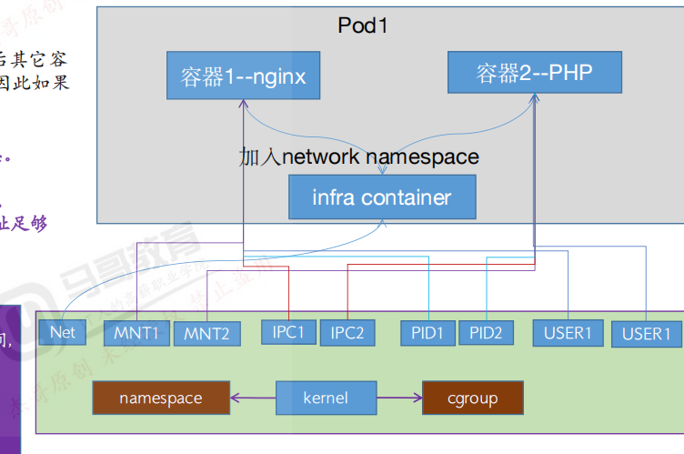

kernel

提供 namespace/cgroup 功能的核心组件

**命名空间（namespace）**

图中列出多个 namespace 类型，用于资源隔离：

| Namespace 类型 | 功能说明                               |
| -------------- | -------------------------------------- |
| `Net`          | 网络隔离（IP、端口、路由）             |
| `MNT1/MNT2`    | 文件系统挂载隔离                       |
| `IPC1/IPC2`    | 进程间通信隔离（如信号、共享内存）     |
| `PID1/PID2`    | 进程编号空间隔离（彼此看不到对方进程） |
| `USER1`        | 用户和权限隔离                         |

这些命名空间 **由 Linux kernel 提供支持**，通过 `kernel + namespace + cgroup` 实现容器隔离。

**cgroup（控制组）**

用于控制容器的 **资源分配和限制**（如 CPU、内存、IO 等）。

每个容器会被分配对应的 cgroup。

### 1.5.14资源限制

| 类型         | 说明                               |
| ------------ | ---------------------------------- |
| **requests** | 最低保证资源，调度时根据它分配节点 |
| **limits**   | 最大允许资源，运行时限制不能超过   |

#### 限制单个容器的 CPU 和 Memory

```yaml
apiVersion: v1
kind: Pod
metadata:
  name: resource-demo
spec:
  containers:
  - name: busybox
    image: busybox
    command: ["sh", "-c", "sleep 3600"]
    resources:
      requests:
        memory: "64Mi"
        cpu: "250m"
      limits:
        memory: "128Mi"
        cpu: "500m"
```

#### 限制整个pod

```powershell
Pod 资源限制 = 各个容器限制之和。K8s 没有单独的 Pod 限制字段，你只能通过控制 容器资源限制来间接限制整个 Pod。
```

```yaml
apiVersion: v1
kind: Pod
metadata:
  name: multi-container-demo
spec:
  containers:
  - name: container-a
    image: busybox
    command: ["sh", "-c", "sleep 3600"]
    resources:
      requests:
        memory: "32Mi"
        cpu: "100m"
      limits:
        memory: "64Mi"
        cpu: "200m"
  - name: container-b
    image: busybox
    command: ["sh", "-c", "sleep 3600"]
    resources:
      requests:
        memory: "64Mi"
        cpu: "150m"
      limits:
        memory: "128Mi"
        cpu: "300m"

```

#### 限制整个 Namespace 的资源（通过 ResourceQuota + LimitRange）

1.设置 `ResourceQuota`

```yaml
apiVersion: v1
kind: ResourceQuota
metadata:
  name: ns-quota
  namespace: dev
spec:
  hard:
    requests.cpu: "1"
    requests.memory: "1Gi"
    limits.cpu: "2"
    limits.memory: "2Gi"

```

2：设置 `LimitRange`（可选，限制单个容器默认值）

```yaml
apiVersion: v1
kind: LimitRange
metadata:
  name: default-limit
  namespace: dev
spec:
  limits:
  - default:
      memory: 256Mi
      cpu: 500m
    defaultRequest:
      memory: 128Mi
      cpu: 250m
    type: Container
```

用于 K8s Pod 压测

```yaml
apiVersion: v1
kind: Pod
metadata:
  name: stress-memory
spec:
  containers:
  - name: stress
    image: polinux/stress
    args: ["--vm", "2", "--vm-bytes", "256M", "--vm-hang", "0"]
    resources:
      limits:
        memory: "600Mi"
```

```powershell
容器运行后会消耗大约 512Mi 内存

如果你把 limits 设置为 500Mi，这个 Pod 就很可能因为超限而被 OOMKilled
```

### 1.5.15亲和与反亲和、污点与容忍、驱逐

#### 亲和（Affinity）与反亲和（Anti-Affinity）

```powershell
控制 Pod 倾向于调度 在哪些节点（或与哪些 Pod 一起/不一起）运行

1. 节点亲和（Node Affinity）
Pod 倾向于调度到 打了特定标签的节点，如：不同项目的主机分开，服务，存储分开等
kubectl get node node1 --show-labels
kubectl label node node1 disktype=ssd env=prod
kubectl describe node node1 | grep Labels -A 20
kubectl label node node1 node-role.kubernetes.io/worker-
spec:
  affinity:
    nodeAffinity:
简化
spec:
  nodeSelector:
    disktype: ssd

重点注意以下表格，这是硬性要求，pod也类似：
```

| 层级                      | 条件之间的关系 |
| ------------------------- | -------------- |
| `matchExpressions` 同组内 | AND            |
| `values` 同一表达式内     | OR             |
| 多个 `nodeSelectorTerms`  | OR             |

```yaml
apiVersion: v1
kind: Pod
metadata:
  name: pod-with-node-affinity
spec:
  affinity:
    nodeAffinity:
      requiredDuringSchedulingIgnoredDuringExecution:   #硬性要求
        nodeSelectorTerms:
        - matchExpressions:         #匹配条件1,多个values可以调度
          - key: node-role.kubernetes.io/worker
            operator: In           #节点反亲和,NotIn
            values:
            - "true"                 # 只有一个value是匹配成功也可以调度
            - xxx
            #Pod 只能调度到带有 node-role.kubernetes.io/worker=true 的节点
          - key: disktype
            operator: In
            values:
            - ssd
  containers:
  - name: nginx
    image: nginx
```

```yaml
      affinity:
        nodeAffinity:
          preferredDuringSchedulingIgnoredDuringExecution: #软性要求
          - weight: 80                 #100也是非强制，主要影响的是评分
            preference: 
              matchExpressions: 
              - key: project 
                operator: In 
                values: 
                  - mageduxx
          - weight: 60 
            preference: 
              matchExpressions: 
              - key: disktype
                operator: In 
                values: 
                  - hddxx
```

```powershell
硬性要求和软性要求可以同时存在
```


| 类型                         | 控制关系                    | 使用场景                             |
| ---------------------------- | --------------------------- | ------------------------------------ |
| ✅ Pod Affinity（亲和）       | 和某些 Pod 放在同一个 Node  | 通常用于服务协同，例如 Web + Sidecar |
| ❌ Pod AntiAffinity（反亲和） | 和某些 Pod 放在不同 Node 上 | **最常见**，用于高可用，避免单点     |

```powershell
2. Pod 间亲和（Pod Affinity）
Pod 倾向于调度到与某类 Pod 在同一节点
spec:
  affinity:
    podAffinity:
```

```yaml
podAffinity:
  requiredDuringSchedulingIgnoredDuringExecution:
  - labelSelector:
      matchLabels:
        app: frontend
    topologyKey: "kubernetes.io/hostname"
#要求：调度到与 app=frontend 的 Pod 同一节点
#topologyKey 也可以是 zone, rack 等，控制亲和的“范围”
```

```powershell
      affinity:
        podAffinity:
          #requiredDuringSchedulingIgnoredDuringExecution:
          preferredDuringSchedulingIgnoredDuringExecution:
          - weight: 100
            podAffinityTerm:
              labelSelector:
                matchExpressions:
                - key: project 
                  operator: In
                  values:
                    - python
              topologyKey: kubernetes.io/hostname 
              namespaces: 
                - xxx
```


```powershell
3. Pod 间反亲和（Pod Anti-Affinity）
不希望调度到有某类 Pod 的节点上
保证副本部署在不同节点，防止单点故障（如数据库主备）
```

```yaml
podAntiAffinity:
  requiredDuringSchedulingIgnoredDuringExecution:
  - labelSelector:
      matchLabels:
        app: frontend
    topologyKey: "kubernetes.io/hostname"

```

```powershell
      affinity:
        podAffinity:
          #requiredDuringSchedulingIgnoredDuringExecution:
          preferredDuringSchedulingIgnoredDuringExecution:
          表示：“尽量不要跟这些 Pod 调度在一起，但实在没地方也可以放一起。”
          - weight: 100
            podAffinityTerm:
              labelSelector:
                matchExpressions:
                - key: project 
                  operator: In
                  values:
                    - python
              topologyKey: kubernetes.io/hostname 
              namespaces: 
                - xxx
```

#### 污点（Taints）与容忍（Tolerations）

```powershell
作用：
控制 Pod 能否调度到某些被“污点”标记的节点。
污点：打在节点上，表示“不欢迎”某些 Pod
容忍：写在 Pod 中，表示“我能容忍这个污点”

kubectl taint nodes node1 key=value:NoSchedule
说明：node1 不允许没有容忍的 Pod 被调度上去
```

```powershell
添加容忍
tolerations:
- key: "key"
  operator: "Equal"
  value: "value"
  effect: "NoSchedule"
表示 Pod 容忍 key=value:NoSchedule 的节点污点
```

| Effect             | 含义                                       |
| ------------------ | ------------------------------------------ |
| `NoSchedule`       | 严格不调度除非容忍                         |
| `PreferNoSchedule` | 尽量不调度，但不是强制                     |
| `NoExecute`        | 不仅不调度，还会驱逐已有的 Pod（除非容忍） |

#### 驱逐（Eviction）

| 原因               | 示例触发                                |
| ------------------ | --------------------------------------- |
| 节点压力（如内存） | `Evicted` 状态                          |
| 驱逐策略           | Pod 没有容忍某污点，被 `NoExecute` 驱逐 |
| 管理命令           | `kubectl drain` 节点时，会驱逐 Pod      |
| 优先级低           | 被抢占（Preemption）                    |

### 1.5.16RBAC鉴权

#### apiserver鉴权

```powershell
# 查看当前身份（kubectl 所用用户）
kubectl config view --minify -o jsonpath='{.users[0].name}'
# 查看当前用户是否有权限做某事（如查看 pod）
kubectl auth can-i get pods --namespace dev

client发送请求到apiserver
1.认证（Authentication）
认证的目的是识别发起请求的用户或组件是谁（例如：Alice、Pod、ServiceAccount、Node）。
```

| 方式                       | 说明                                                         |
| -------------------------- | ------------------------------------------------------------ |
| **证书认证（X.509 证书）** | 通常用于 kubelet、apiserver、kubectl（在 kubeconfig 中配置） |
| **Bearer Token**           | 如 ServiceAccount 使用 JWT Token                             |
| **Basic Auth**（不推荐）   | 用户名+密码，已不推荐                                        |
| **OIDC（OpenID Connect）** | 与企业身份系统（如 LDAP、SSO）集成                           |
| **Webhook Token Auth**     | 外部认证系统自定义身份验证                                   |

```powershell
2.授权（Authorization）
认证通过后，API Server 会调用授权模块判断该用户是否有权限执行该操作。
```

| 授权方式                                     | 说明                           |
| -------------------------------------------- | ------------------------------ |
| **RBAC（Role-Based Access Control）✅最常用** | 基于角色的权限控制，最灵活     |
| ABAC（Attribute-Based）                      | 早期方式，通过配置文件定义规则 |
| Webhook                                      | 调用外部服务判断权限           |

```powershell
3. 准入控制（Admission Control）
即使认证和授权都通过，API Server 还会通过一组准入控制器进行进一步校验或修改请求。
```

| 插件名                         | 功能                                         |
| ------------------------------ | -------------------------------------------- |
| **NamespaceLifecycle**         | 不允许在 Terminating 的 Namespace 中创建资源 |
| **ResourceQuota**              | 限制资源使用量                               |
| **PodSecurity**                | 限制 Pod 使用特权容器等                      |
| **MutatingAdmissionWebhook**   | 修改请求（如自动注入 sidecar）               |
| **ValidatingAdmissionWebhook** | 验证请求是否合法                             |

#### RBAC鉴权

| 组件                                 | 作用                                                 |
| ------------------------------------ | ---------------------------------------------------- |
| `Role` / `ClusterRole`               | 定义权限（如能操作哪些资源、能执行哪些动词）         |
| `RoleBinding` / `ClusterRoleBinding` | 将权限授予具体用户、用户组或 ServiceAccount          |
| `Subject`                            | 被授权的对象，如用户、用户组、ServiceAccount         |
| `Resource`                           | 被操作的对象，如 Pod、Deployment、Namespace 等       |
| `Verb`                               | 动作，如 get、list、watch、create、update、delete 等 |

| 类型          | 生效范围                   | 示例                                                      |
| ------------- | -------------------------- | --------------------------------------------------------- |
| `Role`        | **命名空间级别**           | 只能控制某个 namespace 下的资源                           |
| `ClusterRole` | **集群级别（非命名空间）** | 可控制所有命名空间的资源，或非 namespaced 资源（如 Node） |

注意：Role 和 RoleBinding 只能用于某个命名空间，而 ClusterRole 可以跨命名空间使用（搭配 ClusterRoleBinding 或 RoleBinding）

```yaml
apiVersion: rbac.authorization.k8s.io/v1
kind: Role
metadata:
  name: pod-reader
  namespace: dev               #作用于dev命名空间的角色
rules:
- apiGroups: [""]
  resources: ["pods"]
  verbs: ["get", "watch", "list"]
```

```yaml
apiVersion: rbac.authorization.k8s.io/v1
kind: RoleBinding
metadata:
  name: read-pods
  namespace: dev
subjects:
- kind: User        #也可以是 ServiceAccount
  name: alice       # 用户名
  apiGroup: rbac.authorization.k8s.io
roleRef:
  kind: Role
  name: pod-reader
  apiGroup: rbac.authorization.k8s.io

```

cluster-role

```yaml
apiVersion: rbac.authorization.k8s.io/v1
kind: ClusterRole
metadata:
  name: cluster-pod-reader
rules:
- apiGroups: [""]
  resources: ["pods"]
  verbs: ["get", "watch", "list"]
```

ClusterRoleBinding

```yaml
apiVersion: rbac.authorization.k8s.io/v1
kind: ClusterRoleBinding
metadata:
  name: read-all-pods
subjects:
- kind: User
  name: alice
  apiGroup: rbac.authorization.k8s.io
roleRef:
  kind: ClusterRole
  name: cluster-pod-reader
  apiGroup: rbac.authorization.k8s.io

```

| Verb     | 含义                           |
| -------- | ------------------------------ |
| `get`    | 读取单个资源                   |
| `list`   | 列出资源列表                   |
| `watch`  | 监视资源变化（常用于 UI 组件） |
| `create` | 创建资源                       |
| `update` | 修改资源                       |
| `patch`  | 局部更新资源                   |
| `delete` | 删除资源                       |

```powershell
# 查看用户是否拥有权限
kubectl auth can-i get pods --as=alice --namespace=dev

# 查看某个 ServiceAccount 的权限
kubectl auth can-i create deployments --as=system:serviceaccount:default:my-sa

```

内置权限

```powershell
# 给某个用户授予集群管理员权限
kubectl create clusterrolebinding cluster-admin-binding \
  --clusterrole=cluster-admin \
  --user=alice
  
kubectl get clusterrole
```

### 1.5.17CICD

#### 1.rollingupdate(默认)

使用这个

```powershell
一个新版本起来了，就下掉一个旧版本
第一层spec
spec:
  replicas: 5
  strategy:
    type: RollingUpdate
    rollingUpdate:
      maxSurge: 25%         #1，最大超出副本数
      maxUnavailable: 25%        #1，最大不可用副本数
```

```powershell
kubectl set image deployment/my-nginx nginx=nginx:1.21 -n default
                     deployment名称       容器名称          名称空间
查看更新进度                     
kubectl rollout status deployment/my-nginx

会让每个 Pod 重建一次，镜像不变，但等价于重新部署
kubectl rollout restart deployment/my-nginx

kubectl rollout history deployment/my-nginx

kubectl rollout undo deployment/my-nginx --to-revision=
```


#### 2.recreate

```powershell
spec:
  replicas: 2
  strategy:
    type: Recreate 
  selector:
    matchLabels:
      app: magedu-tomcat-app1-selector
```

#### 3.蓝绿部署

```powershell
运行两个版本，一新一旧，在新版本充分测试后，直接service切流到新版本
```

#### 4.金丝雀部署

```powershell
新旧版本同时存在，旧版本缓慢切流给新版本，直到认为新版本稳定可靠，再将全部流量给新版本
比如使用同一个service，分配副本数不同

在新旧版本只是更新原有的接口功能情况下好用
痛点就是：如果新版本有新接口，那么新接口请求打到旧版本就只会返回404/501
没有成熟的解决方案不推荐
```

#### 5.远程调用k8sapi

### 1.5.18 networkpolicy

就跟防火墙一样，只不过在pod级别生效，可以管理东西向流量去做东西向的网络隔离

#### ingress

##### selector

```powershell
apiVersion: networking.k8s.io/v1
kind: NetworkPolicy
metadata:
  name: tomcat-access-networkpolicy
  namespace: python
spec:
  policyTypes:
  - Ingress
  podSelector: #目标pod
    matchLabels:
      app: python-tomcat-app1-selector
  ingress:
  - from:
    - podSelector: #匹配源pod,matchLabels: {}为不限制源pod即允许所有pod,写法等同于resources(不加就是不限制)
        matchLabels: {}
        #app: python-nginx-selector #指定访问源的匹配条件,如果存在多个matchLabel条件,是and的关系,即要同时满足条件A、条件B、条件X
        #project: "python"
    
    - namespaceSelector:
#        matchLabels: {} #允许所有namespace访问python namespace指定的目标端口或指定的pod加指定端口
        matchLabels:
          nsname: linux #只允许指定的namespace访问
    - namespaceSelector:
        matchLabels:
          nsname: python #只允许指定的namespace访问
    
    ports: #入栈规则，如果指定目标端口就是匹配全部端口和协议，协议TCP, UDP, or SCTP
    - protocol: TCP
      port: 8080 #允许通过TCP协议访问目标pod的8080端口，但是其它没有允许的端口将全部禁止访问
      #port: 80
    - protocol: TCP
      port: 3306
    - protocol: TCP
      port: 6379
```

##### ipblock

```powershell
  ingress:
  - from:
#    - podSelector: #匹配源pod,matchLabels: {}为不限制源pod即允许所有pod,写法等同于resources(不加就是不限制)
#        matchLabels: {}
    - ipBlock:
        cidr: 10.200.0.0/16 #白名单，允许访问的地址范围，没有允许的将禁止访问目标pod
        except:
        - 10.200.219.0/24 #在以上范围内禁止访问的源IP地址
        - 10.200.229.0/24 #在以上范围内禁止访问的源IP地址
        - 10.200.218.11/32 #在以上范围内禁止访问的源IP地址
    ports: #入栈规则，如果指定目标端口就是匹配全部端口和协议，协议TCP, UDP, or SCTP
    - protocol: TCP
      port: 8080 #允许通过TCP协议访问目标pod的8080端口，但是其它没有允许的端口将全部禁止访问
      #port: 80
    - protocol: TCP
      port: 3306
    - protocol: TCP
      port: 6379
```

#### egress

```powershell
  policyTypes:
  - Egress
  podSelector: #目标pod选择器
    matchLabels:  #基于label匹配目标pod
      app: python-tomcat-app1-selector #匹配python namespace中app的值为python-tomcat-app1-selector的pod,然后基于egress中的指定网络策略进行出口方向的网络限制
  egress:
  - to:
    - ipBlock:
        cidr: 10.200.0.0/16 #允许匹配到的pod出口访问的目的CIDR地址范围
    - ipBlock:
        cidr: 172.31.7.106/32 #允许匹配到的pod出口访问的目的主机
    ports:
    - protocol: TCP
      port: 80 #允许匹配到的pod访问目的端口为80的访问
    - protocol: TCP
      port: 53 #允许匹配到的pod访问目的端口为53 即DNS的解析
    - protocol: UDP
      port: 53 #允许匹配到的pod访问目的端口为53 即DNS的解析
```

### 1.5.19 ingress

**Ingress 是 Kubernetes 提供的七层（HTTP/HTTPS）流量入口控制器资源**。

主要作用：

- 把外部请求（HTTP/HTTPS）转发到集群内部的 **Service**。
- 提供 **统一流量入口、反向代理、域名路由、路径路由、TLS（HTTPS）终止** 等功能。

Ingress 本身只是规则的定义，真正的流量转发是由 **Ingress Controller**（例如 Nginx Ingress Controller、Traefik、HAProxy、Istio Gateway 等）来实现的。

```powershell
使用loadbalancer就会给ingress分配ip地址，云域名解析会把这个域名的请求转发到lb，lb再负载均衡到ingress，最后再转发到内部的nginx web服务器
```

#### 模版yaml

```powershell
apiVersion: networking.k8s.io/v1
kind: Ingress
metadata:
  name: domain-ingress
  namespace: linux
  annotations:
  annotations:
    kubernetes.io/ingress.class: "nginx" ##指定Ingress Controller的类型
    nginx.ingress.kubernetes.io/use-regex: "true" ##指定后面rules定义的path可以使用正则表达式
    nginx.ingress.kubernetes.io/proxy-connect-timeout: "600" ##连接超时时间,默认为5s
    nginx.ingress.kubernetes.io/proxy-send-timeout: "600" ##后端服务器回转数据超时时间,默认为60s
    nginx.ingress.kubernetes.io/proxy-read-timeout: "600" ##后端服务器响应超时时间,默认为60s
    nginx.ingress.kubernetes.io/proxy-body-size: "10m" ##客户端上传文件，最大大小，默认为20m
    #nginx.ingress.kubernetes.io/rewrite-target: / ##URL重写
    nginx.ingress.kubernetes.io/app-root: /index.html
spec:
  tls:
    - hosts:
        - nginx-vts.a.com
      secretName: my-tls-secret   # ← 引用上面的 Secret
  rules:
    - host: app1.example.com           域名路由
      http:
        paths:
          - path: /                     路径路由
            pathType: Prefix
            backend:
              service:
                name: app1-service
                port:
                  number: 80
          - path: /static
            pathType: Prefix
            backend:
              service:
                name: static-service
                port:
                  number: 80
    - host: app2.example.com
      http:
        paths:
          - path: /
            pathType: Prefix
            backend:
              service:
                name: app2-service
                port:
                  number: 80

```

#### TLS解密

```powershell
kubectl create secret tls my-tls-secret \
  --cert=cert.pem \
  --key=key.pem
```

```powershell
apiVersion: networking.k8s.io/v1
kind: Ingress
metadata:
  name: https-ingress
spec:
  tls:
    - hosts:                            可以写多个
        - secure.example.com            域名
      secretName: my-tls-secret         域名对应的tls证书secret
  rules:
    - host: secure.example.com
      http:
        paths:
          - path: /
            pathType: Prefix
            backend:
              service:
                name: secure-service
                port:
                  number: 80

```

#### 实操

##### nginx ingress安装

```powershell
➜ helm repo add ingress-nginx https://kubernetes.github.io/ingress-nginx
➜ helm repo update
➜ helm fetch ingress-nginx/ingress-nginx
➜ tar -xvf ingress-nginx-4.0.13.tgz && cd ingress-nginx
```


```powershell
controller:
  name: controller
  image:
    repository: cnych/ingress-nginx
    tag: "v1.1.0"  # 推荐使用较新稳定版
    digest: ""

  # 不需要 publishService 在 NodePort 模式下也可以开启（用于 Ingress status 显示 NodeIP）
  publishService:
    enabled: true  # ← 推荐设为 true，这样 Ingress 的 status 会显示 Node IP

  # 使用 Deployment（默认），也可设为 DaemonSet（但一般 NodePort 用 Deployment 足够）
  kind: Deployment

  # 副本数（高可用）
  replicaCount: 2

  # 移除 nodeSelector（除非你有专用 ingress 节点）
  # nodeSelector: {}

  # 启用 Service，并设置为 NodePort
  service:
    enabled: true
    type: NodePort  # ← 关键：NodePort 模式
    ports:
      http: 80
      https: 443
    # 可选：固定 NodePort 端口（必须在 30000-32767 范围内）
    nodePorts:
      http: 30080
      https: 30443
    # 如果不指定 nodePorts，K8s 会自动分配

  # Admission Webhook（强烈建议开启）
  #NGINX Ingress 的准入控制，是利用 Kubernetes API Server 的准入控制机制（ValidatingWebhook），专门对 Ingress 资源做配置合法性校验的一个应用级扩展。
  admissionWebhooks:
    enabled: true
    patch:
      enabled: true
    createSecretJob:
      resources:
        limits:
          cpu: 10m
          memory: 20Mi
        requests:
          cpu: 10m
          memory: 20Mi
    patchWebhookJob:
      resources:
        limits:
          cpu: 10m
          memory: 20Mi
        requests:
          cpu: 10m
          memory: 20Mi
    patch:
      enabled: true
      image:
        repository: cnych/ingress-nginx-webhook-certgen
        tag: v1.1.1
        digest:
# 默认后端（当没有匹配 Ingress 时返回 404）
defaultBackend:
  enabled: true
  name: defaultbackend
  image:
    repository: cnych/ingress-nginx-defaultbackend
    tag: "1.5"
```

```powershell
helm upgrade --install ingress-nginx . -f ./ci/deployment-prod.yaml --namespace ingress-nginx
kubectl get svc -n ingress-nginx
```

##### 配置ingress

```powershell
apiVersion: networking.k8s.io/v1
kind: Ingress
metadata:
  name: nginx-vts
  namespace: test
  annotations:
    kubernetes.io/ingress.class: nginx
spec:
  #ingressClassName: nginx # 使用 nginx 的 IngressClass（关联的 ingress-nginx 控制器）
  rules:
    - host: nginx-vts.a.com # 将域名映射到 my-nginx 服务
      http:
        paths:
          - path: /
            pathType: Prefix
            backend:
              service: # 将所有请求发送到 my-nginx 服务的 80 端口
                name: nginx-vts-svc
                port:
                  number: 80
```

##### nginx ingress配置

```powershell
kubectl exec -it $POD_NAME -n ingress-nginx -- cat /etc/nginx/nginx.conf

```


### 1.5.20CRD

```powershell
CRD 概念
定义：CRD 是 Kubernetes 提供的一种扩展机制，可以让用户自定义自己的资源类型，就像 Pod、Service、Deployment 一样。
作用：用来扩展 K8s API，让你可以 kubectl get / kubectl apply / kubectl delete 自定义资源。

核心特点：
可编排：自定义资源对象可以被 K8s 原生机制管理。
声明式：通过 YAML 声明资源状态，Controller 负责维护实际状态。
可扩展：配合 Operator / Controller 可以实现自动化管理。
```


## 1.6k8s集群使用必装组件

### 1.6.1metric server

```powershell
metrics-server 是 Kubernetes 集群中的一个资源指标采集组件，它的作用是从每个 Node 和 Pod 的 Kubelet 中获取 实时的资源使用数据（CPU / 内存），并提供给 Kubernetes 的 API Server 查询。
```


```yaml
https://github.com/kubernetes-sigs/metrics-server/releases/download/metrics-server-helm-chart-3.13.0/metrics-server-3.13.0.tgz
下载解压后得到value.yaml

修改
image:
  repository: registry.cn-hangzhou.aliyuncs.com/google_containers/metrics-server
  tag: v0.7.0


args: []改为
args:
  - --kubelet-insecure-tls
  - --kubelet-preferred-address-types=InternalIP
```

```powershell
helm upgrade --install metrics-server ./metrics-server \
  --namespace kube-system \
  --create-namespace
```

使用

```powershell
kubectl top nodes
kubectl top pods

kubectl get hpa
```

## 1.7镜像制作

一些基础命令

```powershell
docker system prune -a --volumes            #清理未运行未使用的镜像
docker system df

清理悬挂镜像（失败的中间产物）：
docker image prune
如果你想更彻底（包括网络、卷、构建缓存等）：
docker system prune
或者交互确认：
docker system prune -a
```

### 1.7.1基础镜像制作

建议用下面的第二种构建方法：多阶段构建

```powershell
https://artifacts.elastic.co/downloads/beats/filebeat/filebeat-8.17.0-amd64.deb
```

```dockerfile
.
├── Dockerfile
└── filebeat-8.17.0-amd64.deb
#不行就网上下载
docker pull ubuntu:22.04 

FROM ubuntu:22.04

# 添加本地 Filebeat 安装包
ADD filebeat-8.17.0-amd64.deb /tmp/

# 更新 apt 缓存，安装必要工具和依赖
RUN apt-get update && apt-get install -y \
    wget curl vim net-tools iproute2 tzdata gnupg \
    && dpkg -i /tmp/filebeat-8.17.0-amd64.deb \
    && rm -f /tmp/filebeat-8.17.0-amd64.deb \
    && ln -snf /usr/share/zoneinfo/Asia/Shanghai /etc/localtime
    
docker build -t filebeat-ubuntu:8.17.0 .
docker tag filebeat-ubuntu:8.17.0 harbor.test.local/sys-microservice/filebeat-ubuntu:8.17.0
```

```powershell
继续
docker push harbor.test.local/sys-microservice/filebeat-ubuntu:8.17.0
```


```powershell
多层构建
# ========= 构建阶段 =========
FROM ubuntu:22.04 as builder

# 添加 Filebeat 安装包（请放在构建目录）
ADD filebeat-8.17.0-amd64.deb /tmp/

# 安装 Filebeat
RUN apt-get update && apt-get install -y dpkg \
    && dpkg -i /tmp/filebeat-8.17.0-amd64.deb \
    && rm -f /tmp/filebeat-8.17.0-amd64.deb

# ========= 运行阶段 =========
FROM debian:bullseye-slim

LABEL maintainer="zzh"
ENV TZ=Asia/Shanghai

# 安装运行所需组件 + 设置时区
RUN apt-get update && apt-get install -y \
    ca-certificates tzdata curl \
    && ln -snf /usr/share/zoneinfo/${TZ} /etc/localtime \
    && echo "${TZ}" > /etc/timezone \
    && apt-get clean && rm -rf /var/lib/apt/lists/*

# 拷贝 filebeat 可执行文件和配置目录
COPY --from=builder /usr/bin/filebeat /usr/bin/filebeat
COPY --from=builder /usr/share/filebeat /usr/share/filebeat
COPY --from=builder /etc/filebeat /etc/filebeat

# 设置工作目录为 filebeat 目录
WORKDIR /usr/share/filebeat

# 默认使用挂载的 filebeat.yml 启动
#CMD ["filebeat", "-e", "-c", "/etc/filebeat/filebeat.yml"]

```

```powershell
docker build -t filebeat-deb-slim:8.17.0 .
docker tag filebeat-deb-slim:8.17.0 harbor.test.local/sys-microservice/filebeat-deb-slim:8.17.0
docker push harbor.test.local/sys-microservice/filebeat-deb-slim:8.17.0
```


### 1.7.2jdk8镜像

```dockerfile
# 构建阶段：安装 JDK8 并检测版本
FROM ubuntu:22.04 AS builder

RUN apt-get update && apt-get install -y openjdk-8-jdk \
    && java -version

# 运行阶段：基于 filebeat 镜像，复制 JDK 目录和配置时区
FROM harbor.test.local/sys-microservice/filebeat-deb-slim:8.17.0

ENV JAVA_HOME=/usr/lib/jvm/java-8-openjdk-amd64
ENV PATH=$JAVA_HOME/bin:$PATH
ENV TZ=Asia/Shanghai

RUN apt-get update && apt-get install -y tzdata \
    && ln -snf /usr/share/zoneinfo/$TZ /etc/localtime \
    && echo $TZ > /etc/timezone \
    && apt-get clean && rm -rf /var/lib/apt/lists/*

COPY --from=builder /usr/lib/jvm/java-8-openjdk-amd64 /usr/lib/jvm/java-8-openjdk-amd64

RUN java -version

WORKDIR /app                       #执行语句目录，工作目录
```

```powershell
docker build -t harbor.test.local/sys-microservice/jdk8-base:8.17.0 .
docker image prune -f   清理none镜像
dcoker push harbor.test.local/sys-microservice/jdk8-base:8.17.0

openjdk version "1.8.0_462"
OpenJDK Runtime Environment (build 1.8.0_462-8u462-ga~us1-0ubuntu2~22.04.2-b08)
OpenJDK 64-Bit Server VM (build 25.462-b08, mixed mode
```

### 1.7.3虚拟机扩容

考虑到在笔记本测试，可能开头给的空间并不足，给出rocky9扩容的一种方案，前提是环境一致

```powershell
步骤一：在 VMware 扩大虚拟硬盘容量
关闭虚拟机（强烈推荐）

打开 VMware vSphere / Workstation

选择你的虚拟机 → 设置 → 硬盘 → 扩展容量（例如改为 40GB）

启动虚拟机，进入系统


echo 1 | sudo tee /sys/class/block/nvme0n1/device/rescan
fdisk -l /dev/nvme0n1
yum install -y cloud-utils-growpart  # 或 apt install cloud-guest-utils
growpart /dev/nvme0n1 2
pvresize /dev/nvme0n1p2
遇到问题
vi /etc/lvm/lvm.conf
找到并修改如下配置项（如果存在）：
use_devicesfile = 1
改为：
use_devicesfile = 0

vgscan
vgchange -ay
lvextend -r -l +100%FREE /dev/rl_bogon/root
df -h /
```

## 1.8devops工具安装使用

### 1.8.1gitlab安装及备份恢复

#### 安装

```powershell
#!/bin/bash
set -e

# 配置访问域名或IP
DOMAIN="gitlab.local"
EXTERNAL_URL="http://$DOMAIN"

echo "安装 GitLab CE，访问地址：$EXTERNAL_URL"

# 添加 GitLab 官方仓库
curl https://packages.gitlab.com/install/repositories/gitlab/gitlab-ce/script.rpm.sh | bash

# 安装最新的 GitLab CE
EXTERNAL_URL="$EXTERNAL_URL" dnf install -y gitlab-ce

# 初始化配置并启动 GitLab
gitlab-ctl reconfigure

echo ""
echo "✅ GitLab CE 安装完成！"
echo "🔗 访问地址： $EXTERNAL_URL"
echo "请首次访问设置 root 密码"
```

手动下载具体版本安装

```powershell
wget https://packages.gitlab.com/gitlab/gitlab-ce/packages/el/9/gitlab-ce-18.0.5-ce.0.el9.x86_64.rpm/download.rpm \
     -O gitlab-ce-18.0.5-ce.0.el9.x86_64.rpm
     
sudo dnf localinstall -y gitlab‑ce‑18.0.5‑ce.0.el9.x86_64.rpm
```

#### swap内存

本地测试扩展swap内存,个人测试环境内存不足

```powershell
正式环境不要这样做
# 创建 4GB 的 swap 文件
fallocate -l 4G /swapfile2

# 设置权限
chmod 600 /swapfile2

# 格式化为 swap 格式
mkswap /swapfile2

# 启用
swapon /swapfile2
swapon --show
#关闭
swapoff /swapfile2

# 查看结果
free -h

永久生效
echo '/swapfile2 swap swap defaults 0 0' >> /etc/fstab
```

```powershell
查看密码
cat /etc/gitlab/initial_root_password
查看版本
gitlab-rake gitlab:env:info
```

```powershell
修改密码
sudo gitlab-rails console

user = User.find_by(username: 'root')
user.password = 'MyStrongPass123!'
user.password_confirmation = 'MyStrongPass123!'
user.save!
```

```powershell
汉化->点击偏好设置下拉就行了
```

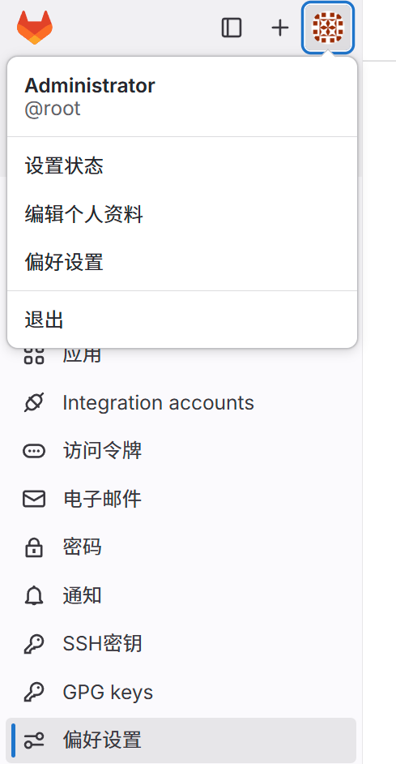

#### 备份恢复

```powershell
/etc/gitlab/gitlab.rb 

/etc/gitlab/gitlab-secrets.json #双因子验证等使用此文件

修改配置
vim /etc/gitlab/gitlab.rb
gitlab_rails['backup_path'] = '/data/gitlab_backups'

备份文件git的权限
# gitlab_rails['backup_archive_permissions'] = 0644

七天后自动删除
# gitlab_rails['backup_keep_time'] = 604800

sudo mkdir -p /data/gitlab_backups
sudo chown -R git:git /data/gitlab_backups

gitlab-ctl reconfigure
gitlab-ctl restart
gitlab-ctl status
```

```powershell
#!/bin/bash

# GitLab 全量备份脚本（使用 gitlab-backup 命令）
# 适配 Omnibus GitLab 18.0.5
# 可每日定时执行，保留最近几天备份

set -euo pipefail

BACKUP_DIR="/data/gitlab_backup"
DATE=$(date +%F_%H-%M-%S)
BACKUP_NAME="gitlab_backup_$DATE"
GITLAB_BACKUP_PATH="$BACKUP_DIR/$BACKUP_NAME"
RETENTION_DAYS=7
SKIP_COMPONENTS="registry,artifacts,lfs"

log() {
    echo "[INFO] $1"
}

err() {
    echo "[ERROR] $1" >&2
    exit 1
}

log "开始 GitLab 备份：$DATE"
mkdir -p "$GITLAB_BACKUP_PATH" || err "无法创建目录 $GITLAB_BACKUP_PATH"

# 1. 执行 GitLab 数据备份（封装 gitlab-rake）
log "执行 gitlab-backup..."
if ! /opt/gitlab/bin/gitlab-backup create SKIP=$SKIP_COMPONENTS; then
    err "gitlab-backup 执行失败"
fi

# 2. 拷贝备份 tar 文件（位于 /data/gitlab_backups）
BACKUP_FILE=$(ls -1t /data/gitlab_backups/*.tar 2>/dev/null | head -n 1)
if [[ -z "$BACKUP_FILE" ]]; then
    err "未找到任何 GitLab 备份文件"
fi
cp -a "$BACKUP_FILE" "$GITLAB_BACKUP_PATH/" || err "复制备份文件失败"

# 3. 拷贝配置文件
log "备份 /etc/gitlab 配置..."
cp -a /etc/gitlab "$GITLAB_BACKUP_PATH/etc_gitlab" || err "配置备份失败"

# 4. 拷贝 secrets 文件
log "备份 secrets..."
cp /etc/gitlab/gitlab-secrets.json "$GITLAB_BACKUP_PATH/" || err "secrets 备份失败"

# 5. 备份证书
if [[ -d /etc/gitlab/ssl ]]; then
    log "备份 SSL 证书..."
    cp -a /etc/gitlab/ssl "$GITLAB_BACKUP_PATH/ssl"
fi

# 6. 打包备份目录为 tar.gz
log "打包归档..."
cd "$BACKUP_DIR" || err "进入备份目录失败"
tar czf "$BACKUP_NAME.tar.gz" "$BACKUP_NAME" --remove-files || err "压缩失败"

# 7. 清理旧备份
log "删除 $RETENTION_DAYS 天前的旧备份..."
find "$BACKUP_DIR" -name "*.tar.gz" -type f -mtime +$RETENTION_DAYS -exec rm -f {} \;

# 8. 删除 GitLab 生成的原始 tar 文件
log "删除 GitLab 自动生成的备份文件..."
rm -f "$BACKUP_FILE" || err "无法删除 $BACKUP_FILE"

log "GitLab 备份完成：$BACKUP_NAME.tar.gz"

```

```powershell
sudo crontab -e
0 1 * * * /root/scripts/gitlab_backup.sh >> /root/scripts/gitlab_backup.log 2>&1
```

恢复脚本

```powershell
#!/bin/bash
set -euo pipefail

BACKUP_DIR="/data/gitlab_backup"
RETENTION_DAYS=7

log() {
    echo "[INFO] $1"
}

err() {
    echo "[ERROR] $1" >&2
    exit 1
}

if [[ $# -ne 1 ]]; then
    echo "用法: $0 <备份包全路径.tar.gz>"
    exit 1
fi

BACKUP_ARCHIVE="$1"
BACKUP_NAME=$(basename "$BACKUP_ARCHIVE" .tar.gz)
WORK_DIR="$BACKUP_DIR/$BACKUP_NAME"

log "开始恢复 GitLab 备份：$BACKUP_ARCHIVE"

if [[ ! -f "$BACKUP_ARCHIVE" ]]; then
    err "备份文件不存在：$BACKUP_ARCHIVE"
fi

# 1. 解压备份包到临时目录
log "解压备份包到 $WORK_DIR"
mkdir -p "$WORK_DIR"
tar xzf "$BACKUP_ARCHIVE" -C "$BACKUP_DIR"

# 2. 恢复 /etc/gitlab 配置
log "恢复 /etc/gitlab 配置..."
if [[ -d "$WORK_DIR/etc_gitlab" ]]; then
    cp -a "$WORK_DIR/etc_gitlab/." /etc/gitlab/
else
    err "备份包中缺少 etc_gitlab 目录，无法恢复配置"
fi

# 3. 恢复 gitlab-secrets.json
log "恢复 gitlab-secrets.json..."
if [[ -f "$WORK_DIR/gitlab-secrets.json" ]]; then
    cp "$WORK_DIR/gitlab-secrets.json" /etc/gitlab/
else
    err "备份包中缺少 gitlab-secrets.json，无法恢复密钥"
fi

# 4. 恢复证书（如果存在）
if [[ -d "$WORK_DIR/ssl" ]]; then
    log "恢复 SSL 证书..."
    cp -a "$WORK_DIR/ssl/." /etc/gitlab/ssl/
fi

# 5. 复制 GitLab 数据备份 tar 文件到默认备份目录
log "恢复 GitLab 数据备份文件..."
BACKUP_TAR_FILE=$(ls -1t "$WORK_DIR"/*.tar 2>/dev/null | head -n 1)
if [[ -z "$BACKUP_TAR_FILE" ]]; then
    err "备份包中找不到数据库和仓库备份的 .tar 文件"
fi

cp "$BACKUP_TAR_FILE" /var/opt/gitlab/backups/ || err "复制备份文件失败"

# 6. 停止 GitLab 服务
log "停止 GitLab 服务..."
gitlab-ctl stop

# 7. 恢复数据库和仓库
log "执行 GitLab 数据恢复..."
gitlab-backup restore BACKUP=$(basename "$BACKUP_TAR_FILE" .tar) --force

# 8. 重新配置并启动 GitLab
log "重新配置 GitLab..."
gitlab-ctl reconfigure

log "启动 GitLab 服务..."
gitlab-ctl start

log "GitLab 恢复完成。"
```

```powershell
假设备份包是
/data/gitlab_backup/gitlab_backup_2025-08-01_15-36-00.tar.gz

恢复
sudo ./gitlab_restore.sh /data/gitlab_backup/gitlab_backup_2025-08-01_15-36-00.tar.gz
```

#### 迁移升级

```powershell
GitLab 官方推荐的升级流程是：先备份旧版本，安装新版本，再恢复数据，且严格按照官方升级步骤执行
小版本可以使用恢复脚本，大版本不行，按照官方文档来
```

#### 开发使用工作流程

```powershell
git chechout -b feature #from develop，完成开发和特性测试
git checkout develop
git merge feature
git branch --delete feature
git checkout -b release # from develop，完成测试、bug修复和发布
git checkout develop
git merge release   #将release合并至develop
git checkout master
git merge release #将release合并至master
git branch --delete release #删除releae分支
```


### 1.8.2jenkins安装

```powershell
#!/bin/bash
set -e

DOMAIN="jenkins.local"

# 安装依赖和 Java（Jenkins 运行依赖 Java 17）
dnf install -y java-17-openjdk curl

# 添加 Jenkins 仓库
curl -fsSL https://pkg.jenkins.io/redhat-stable/jenkins.io.key | gpg --dearmor -o /etc/pki/rpm-gpg/jenkins.gpg
cat <<EOF > /etc/yum.repos.d/jenkins.repo
[jenkins]
name=Jenkins-stable
baseurl=https://pkg.jenkins.io/redhat-stable
gpgcheck=1
gpgkey=file:///etc/pki/rpm-gpg/jenkins.gpg
EOF

# 安装最新版本 Jenkins
dnf install -y jenkins

# 启动并设置开机自启
systemctl enable --now jenkins

echo "Jenkins 安装完成，访问：http://$DOMAIN:8080"

```


```powershell
[root@jenkins ~]#vim /usr/lib/systemd/system/jenkins.service
 #User=jenkins	
 #Group=jenkins
 User=root
 Group=root
[root@jenkins ~]#systemctl daemon-reload 
[root@jenkins ~]#systemctl restart jenkins.service 
```

```powershell
配置文件都在/var/lib/jenkins/上

cat /var/lib/jenkins/secrets/initialAdminPassword
3aa46a2fb8504d1c8dc1ff5add594a42
进去后推荐插件安装
```

## 1.9日志收集

### 1.9.1elk

### 1.9.2收集方式

```powershell
1.node节点收集             
2.sidcar（一个pod多容器）
3.在容器内置日志收集服务进程       建议，filebeat很轻量
打镜像时多阶段构建把filebeat打进去
```

## 1.10网络

 **Flannel-vxlan / Flannel-hostgw / Calico-IPIP / Calico-VXLAN / Calico-BGP**

### 1.10.1一些基本概念

交换机 (Switch):

- **工作层次**：OSI **二层（数据链路层）**，少数高端交换机支持三层。
- **主要作用**：
  - 根据 **MAC 地址表** 转发帧。
  - 用于把多个设备连接在同一个 **局域网 (LAN)** 中。
  - 可以通过 **VLAN** 划分多个广播域。
- **特点**：
  - 转发速度快（硬件转发）。
  - 一般不关心 IP，只管 MAC。
  - 二层交换机不能实现跨网段通信。

------

路由器 (Router):

- **工作层次**：OSI **三层（网络层）**。
- **主要作用**：
  - 根据 **IP 地址和路由表** 转发数据包。
  - 连接不同的 **网络/网段**（比如 192.168.1.0/24 和 192.168.2.0/24）。
  - 实现 **跨网段通信**。
  - 提供 **NAT、防火墙、DHCP、VPN 等高级功能**。
- **特点**：
  - 处理更复杂的协议和策略。
  - 能跨越不同的物理网络（LAN ↔ WAN）。
  - 转发速度一般比纯二层交换机慢（但三层交换机可以优化）。

### 1.10.2flannel

使用场景一般是公有云以及不需要配置网络策略的场景

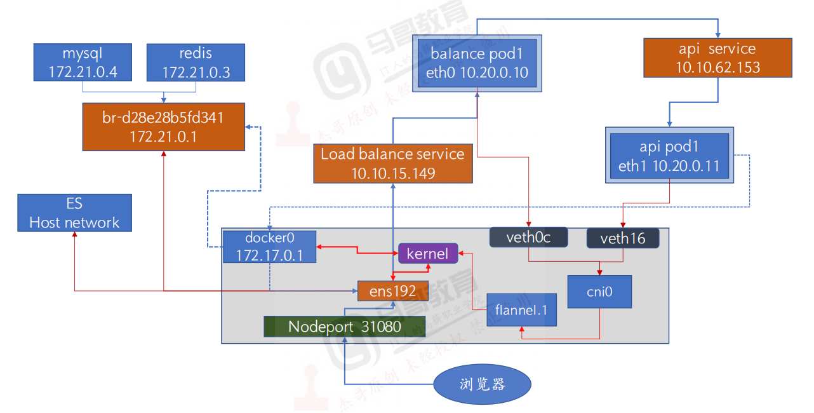

```powershell
Overlay = 思路（用隧道再构建一层虚拟网络覆盖在物理网络上）。
VXLAN = 技术实现（Overlay 的一种隧道封装方式）。

Underlay网络模型
MACVLAN允许容器以虚拟接口方式直接连接至物理接口
IPVLAN
```

```powershell
Flannel 网络模型 (后端)，Flannel目前有三种方式实现 UDP/VXLAN/host-gw:

UDP: 早期版本的Flannel使用UDP封装完成报文的跨越主机转发，其安全性及性能略有不足。

VXLAN: Linux 内核在在2012年底的v3.7.0之后加入了VXLAN协议支持，因此新版本的Flannel也有UDP转换为VXLAN，VXLAN本质上是一种tunnel（隧道）协议，用来基于3层网络实现虚拟的2层网络，目前flannel 的网络模型已经是基于VXLAN的叠加(覆盖)网络，目前推荐使用vxlan作为其网络模型。

Host-gw: 也就是Host GateWay，通过在node节点上创建到达各目标容器地址的路由表而完成报文的转发，因此这种方式要求各node节点本身必须处于同一个局域网(二层网络)中，因此不适用于网络变动频繁或比较大型的网络环境，但是其性能较好。

Flannel 组件的解释:
Cni0:网桥设备，每创建一个pod都会创建一对 veth pair，其中一端是pod中的eth0，另一端是Cni0网桥中的端口（网卡），Pod中从网卡 eth0发出的流量都会发送到Cni0网桥设备的端口（网卡）上，Cni0 设备获得的ip地址是该节点分配到的网段的第一个地址。
Flannel.1: overlay网络的设备，用来进行vxlan报文的处理（封包和解包），不同node之间的pod数据流量都从overlay设备以隧道的形式发送到对端。vxlan4789端口

traceroute www.baidu.com   外网全是***

tcpdump -nn -vvv -i veth91d6f855 -vvv -nn ! port 22 and ! port 2379 and ! port 6443 and ! port 10250 and ! arp and ! port 53
```

##### 抓包

```powershell
获取虚拟网络接口信息
/ # apk add ethtool
/ # ethtool -S eth0
arp -n/-a

根据抓包流程一步步下去
tcpdump -nn -vvv -i veth91d6f855 -vvv -nn ! port 22 and ! port 2379 and ! port 6443 and ! port 10250 and ! arp and ! port 53 > 1.cap
```

步骤

```powershell
vxlan关注二层mac地址
1: 源pod发起请求，此时报文中源IP为pod的eth0的ip,源mac 为pod的eth0的mac，目的Pod为目的Pod的IP，目的mac为网关(cni0)的MAC

2: 数据报文通过veth peer发送给网关cni0,检查目的mac就是发给自己的， cni0进行目标IP检查,如果是同一个网桥的报文就直接转发,不是的话就发送给flannel.1

3: 到达flannel.1,检查目的mac就是发给自己的，开始匹配路由表,先实现overlay报文的内层封装(主要是修改目的Pod的对端flannel.1的MAC、源MAC为当前宿主机flannel.1的MAC)

4.基于udp封装vxlan报文，外层封装表现为：源ip为物理网卡ip,目的ip为目的pod宿主机所在ip，源mac和目的mac也是

5.报文到达目的宿主机物理网卡，接开始解封装报文： 目的主机解封装报文: 外层目的IP为本机物理网卡，解开后发现里面还有一层目的IP和目的MAC，发现目的IP为10.100.1.6，目的MAC为本机flannel.1的MAC，然后将报文发送给flannel.

6.到达flanne.1,检查目的ip，发现是去cni0的子网，转发到cni0

7.报文到达cni0，基于ip检查目的mac，修改为 pod的mac，检查mac地址表发现是本地接口，直接转发给pod
```

### 1.10.3calico

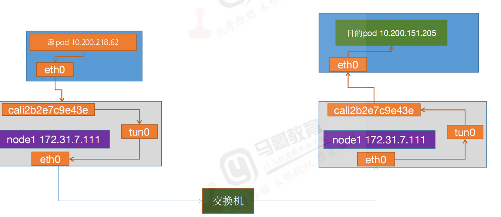

| 名称     | 类型                   | 作用                                                         |
| -------- | ---------------------- | ------------------------------------------------------------ |
| **BGP**  | 路由协议（L3）         | 用于在各节点之间 **交换路由信息**，告诉其他节点哪些 Pod IP 在自己节点上 |
| **IPIP** | 封装协议（L3→L3 隧道） | 将 Pod 数据包封装到宿主机 IP 中，实现在 **不同节点之间转发 Pod 流量** |

BGP 和 IPIP **不冲突，也不等同**

抓包（关注纯三层IP，全程路由）

```powershell
1.源pod发起请求，报文到宿主机与pod对应的网卡，此时报文中源IP为pod的eth0的ip,源mac 为pod的eth0的mac，目的IP为10.200.151.205，下一跳为网关地址169.254.1.1,目的mac为ee:ee:ee:ee:ee:ee(默认网关169.254.1.1的MAC地址),源端口随机产生目的端口80.

2.报文到tunl0,源IP为源podIP，目的IP为目的podIP,没有MAC地址

3.到达宿主机eth0，IPinIP,外层封装，ip和mac源为宿主机，目的为目的pod宿主机

4.目的宿主机，解封装

5.到达宿主机tunl0

6.到达对应网卡cali，到达目的pod
```

### 1.10.4压测工具

```powershell
带宽测试
iperf3（推荐）
测试 TCP/UDP 带宽、延迟、抖动。
能模拟大流量、长时间压测。

kubectl exec -it iperf3-client -- iperf3 -c <server-pod-ip> -t 60 -P 10
kubectl exec -it iperf3-client -- iperf3 -c <server-pod-ip> -u -b 1G -t 30

netperf
更细粒度测试不同场景，比如请求/响应型、吞吐量型。
```


## 1.11监控

### 1.11.1cAdvisor

```powershell
https://github.com/google/cadvisor

c容器 Advisor顾问

k8s kubelet自带了cadvisor,/metrics/cadvisor,operator自动监控

cAdvisor 指标本质是 抓 Node 上的容器资源指标，可以看到 Pod 内容器的资源使用情况，但如果想监控应用层指标或 Kubernetes 对象状态，还需要 kube-state-metrics / Pod exporter 等补充

cadvisor还提供基础查询界面和http接口，方便其他组件如Prometheus进行数据抓取，cAdvisor可以对节点机器上的资源及容器进行实时监控和性能数据采集，包括CPU使用情况、内存使用情况、网络吞吐量及文件系统使用情况。
```

```yaml
apiVersion: v1
kind: Namespace
metadata:
  name: monitor
---
apiVersion: apps/v1
kind: DaemonSet
metadata:
  name: cadvisor
  namespace: monitoring
  labels:
    k8s-app: cadvisor
spec:
  selector:
    matchLabels:
      k8s-app: cadvisor
  template:
    metadata:
      labels:
        k8s-app: cadvisor
    spec:
      tolerations:
        - effect: NoSchedule
          key: node-role.kubernetes.io/master
          #operator: Exists
      nodeSelector:
        kubernetes.io/os: linux
      containers:
        - name: cadvisor
          image: gcr.io/cadvisor/cadvisor:v0.47.2   # 需要修改
          imagePullPolicy: IfNotPresent  # 镜像策略
          ports:
            - containerPort: 8080
              name: http-metrics
          resources:
            limits:
              cpu: 200m
              memory: 200Mi
            requests:
              cpu: 100m
              memory: 100Mi
          volumeMounts:
            - name: rootfs
              mountPath: /rootfs
              readOnly: true
            - name: var-run
              mountPath: /var/run
            - name: sys
              mountPath: /sys
              readOnly: true
            - name: docker
              mountPath: /var/lib/docker
              readOnly: true
            - name: disk
              mountPath: /dev/disk
              readOnly: true
      volumes:
        - name: rootfs
          hostPath:
            path: /
        - name: var-run
          hostPath:
            path: /var/run
        - name: sys
          hostPath:
            path: /sys
        - name: docker
          hostPath:
            path: /var/lib/docker
        - name: disk
          hostPath:
            path: /dev/disk
      hostNetwork: true
      dnsPolicy: ClusterFirstWithHostNet
---
apiVersion: v1
kind: Service
metadata:
  name: cadvisor
  namespace: monitoring
spec:
  selector:
    k8s-app: cadvisor
  ports:
    - name: http-metrics
      port: 8080
      targetPort: 8080
      nodePort: 30080
  type: NodePort

```

### 1.11.2node-exporter

```yaml
apiVersion: apps/v1
kind: DaemonSet
metadata:
  name: node-exporter
  namespace: monitoring 
  labels:
    k8s-app: node-exporter
spec:
  selector:
    matchLabels:
        k8s-app: node-exporter
  template:
    metadata:
      labels:
        k8s-app: node-exporter
    spec:
      tolerations:
        - effect: NoSchedule
          key: node-role.kubernetes.io/master
      containers:
      - image: prom/node-exporter:v1.3.1 
        imagePullPolicy: IfNotPresent
        name: prometheus-node-exporter
        ports:
        - containerPort: 9100
          hostPort: 9100
          protocol: TCP
          name: metrics
        volumeMounts:
        - mountPath: /host/proc
          name: proc
        - mountPath: /host/sys
          name: sys
        - mountPath: /host
          name: rootfs
        args:
        - --path.procfs=/host/proc
        - --path.sysfs=/host/sys
        - --path.rootfs=/host
      volumes:
        - name: proc
          hostPath:
            path: /proc
        - name: sys
          hostPath:
            path: /sys
        - name: rootfs
          hostPath:
            path: /
      hostNetwork: true
      hostPID: true
---
apiVersion: v1
kind: Service
metadata:
  annotations:
    prometheus.io/scrape: "true"
  labels:
    k8s-app: node-exporter
  name: node-exporter
  namespace: monitoring 
spec:
  type: NodePort
  ports:
  - name: http
    port: 9100
    nodePort: 39100
    protocol: TCP
  selector:
    k8s-app: node-exporter

```

### 1.11.3promethues

```powershell
定时pull metrics数据，每一个被抓取的target都要暴露一个端口（http接口/metrics）
静态配置文件配置的话很麻烦，需要动态服务发现配置
```

yaml

```powershell
---
apiVersion: apps/v1
kind: Deployment
metadata:
  name: prometheus-server
  namespace: monitoring
  labels:
    app: prometheus
spec:
  replicas: 1
  selector:
    matchLabels:
      app: prometheus
      component: server
    #matchExpressions:
    #- {key: app, operator: In, values: [prometheus]}
    #- {key: component, operator: In, values: [server]}
  template:
    metadata:
      labels:
        app: prometheus
        component: server
      annotations:
        prometheus.io/scrape: 'false'
    spec:
      nodeName: 172.31.7.113
      serviceAccountName: monitor
      containers:
      - name: prometheus
        image: prom/prometheus:v2.36.1
        imagePullPolicy: IfNotPresent
        command:
          - prometheus
          - --config.file=/etc/prometheus/prometheus.yml
          - --storage.tsdb.path=/prometheus
          - --storage.tsdb.retention=720h
          - --web.enable-lifecycle
        ports:
        - containerPort: 9090
          protocol: TCP
        volumeMounts:
        - mountPath: /etc/prometheus/prometheus.yml
          name: prometheus-config
          subPath: prometheus.yml
        - mountPath: /prometheus/
          name: prometheus-storage-volume
      volumes:
        - name: prometheus-config
          configMap:
            name: prometheus-config
            items:
              - key: prometheus.yml
                path: prometheus.yml
                mode: 0644
        - name: prometheus-storage-volume
          hostPath:
           path: /data/prometheusdata
           type: Directory
---
apiVersion: v1
kind: Service
metadata:
  name: prometheus
  namespace: monitoring
  labels:
    app: prometheus
spec:
  type: NodePort
  ports:
    - port: 9090
      targetPort: 9090
      nodePort: 39090
      protocol: TCP
  selector:
    app: prometheus
    component: server
```

#### 1.11.3.1赋权

直接绑定cluster-admin角色

```powershell
kubectl create clusterrolebinding monitor-clusterrolebinding -n monitoring --clusterrole=cluster-admin --serviceaccount=monitoring:monitor 

进入pod中可以看到以下两个文件
/var/run/secrets/kubernetes.io/serviceaccount/ca.crt
/var/run/secrets/kubernetes.io/serviceaccount/token
```

如果promethues部署在k8s集群外，创建promethues集群角色并绑定

```yaml
apiVersion: v1
kind: ServiceAccount
metadata:
  name: prometheus
  namespace: monitoring
---
apiVersion: rbac.authorization.k8s.io/v1
kind: ClusterRole
metadata:
  name: prometheus
rules:
- apiGroups:
  - ""
  resources:
  - nodes
  - services
  - endpoints
  - pods
  - nodes/proxy
  verbs:
  - get
  - list
  - watch
- apiGroups:
  - "extensions"
  resources:
    - ingresses
  verbs:
  - get
  - list
  - watch
- apiGroups:
  - ""
  resources:
  - configmaps
  - nodes/metrics
  verbs:
  - get
- nonResourceURLs:
  - /metrics
  verbs:
  - get
---
#apiVersion: rbac.authorization.k8s.io/v1beta1
apiVersion: rbac.authorization.k8s.io/v1
kind: ClusterRoleBinding
metadata:
  name: prometheus
roleRef:
  apiGroup: rbac.authorization.k8s.io
  kind: ClusterRole
  name: prometheus
subjects:
- kind: ServiceAccount
  name: prometheus
  namespace: monitoring
```

#### 1.11.3.2configmap（kubernetes_sd_configs）

```powershell
Prometheus 的 relabel_configs 是 按顺序执行的，每一条规则都会在上一步结果的基础上生效。
在上一步的结果上执行下一步，范围逐渐缩小
后面的规则可以用前面生成的标签 
前面的规则不能用后面才生成的标签 

发现类型，node/service/pod/endpoints/Endpointslice/ingress

测试：新增或删减，看能否自动发现
```

其他sd配置

```powershell
static_configs：裸机部署静态配置
consul_sd_configs：Prometheus 只能从 Consul 的 服务目录 (Catalog) 里获取信息。要让 Prometheus 发现某个服务的 metrics，你必须先把服务注册到 Consul。
file_sd_configs:跟static差不多，只不过单独写了个target的json文件
基于DNS服务发现
```

```powershell
---
kind: ConfigMap
apiVersion: v1
metadata:
  labels:
    app: prometheus
  name: prometheus-config
  namespace: monitoring
data:
  prometheus.yml: |
    global:
      scrape_interval: 15s
      scrape_timeout: 10s
      evaluation_interval: 1m
    scrape_configs:
    - job_name: 'kubernetes-node'
      kubernetes_sd_configs:               ####基于k8sAPI实现的服务发现
      - role: node       ###发现类型，node/service/pod/endpoints/Endpointslice/ingress
      relabel_configs:
      - source_labels: [__address__]
        regex: '(.*):10250'                ###这个标签中有ip:10250，是kubelet的端口
        replacement: '${1}:9100'           ###替换为9100端口，让prom自动发现
        target_label: __address__
        action: replace
      - action: labelmap
        regex: __meta_kubernetes_node_label_(.+)
    - job_name: 'kubernetes-node-cadvisor-1'   ##直接访问 Node IP（适合内部网络开放端口）
      kubernetes_sd_configs:
      - role: node
      relabel_configs:
      - source_labels: [__address__]
        regex: '(.*):10250'
        replacement: '${1}:8080'           ###cadvisor
        target_label: __address__          
        action: replace
      - action: labelmap
        regex: __meta_kubernetes_node_label_(.+)
    - job_name: 'kubernetes-node-cadvisor-2'##通过kube-apiserver代理（安全，不暴露端口）
      kubernetes_sd_configs:
      - role:  node
      scheme: https
      tls_config:
        ca_file: /var/run/secrets/kubernetes.io/serviceaccount/ca.crt
      bearer_token_file: /var/run/secrets/kubernetes.io/serviceaccount/token
      relabel_configs:
      - action: labelmap
        regex: __meta_kubernetes_node_label_(.+)
      - target_label: __address__
        replacement: kubernetes.default.svc:443
      - source_labels: [__meta_kubernetes_node_name]
        regex: (.+)
        target_label: __metrics_path__
        replacement: /api/v1/nodes/${1}/proxy/metrics/cadvisor
    - job_name: 'kubernetes-apiserver'       #通过一系列的规则发现并监控apiserver
      kubernetes_sd_configs:
      - role: endpoints
      scheme: https
      tls_config:
        ca_file: /var/run/secrets/kubernetes.io/serviceaccount/ca.crt
      bearer_token_file: /var/run/secrets/kubernetes.io/serviceaccount/token
      relabel_configs:
      - source_labels: [__meta_kubernetes_namespace, __meta_kubernetes_service_name, __meta_kubernetes_endpoint_port_name]
        action: keep
        regex: default;kubernetes;https
    - job_name: 'kubernetes-service-endpoints'
      kubernetes_sd_configs:
      - role: endpoints
      relabel_configs:
      - source_labels: [__meta_kubernetes_service_annotation_prometheus_io_scrape]
        action: keep
        regex: true
      - source_labels: [__meta_kubernetes_service_annotation_prometheus_io_scheme]
        action: replace
        target_label: __scheme__
        regex: (https?)     #匹配http和https
      - source_labels: [__meta_kubernetes_service_annotation_prometheus_io_path]
        action: replace
        target_label: __metrics_path__
        regex: (.+)
      - source_labels: [__address__, __meta_kubernetes_service_annotation_prometheus_io_port]
        action: replace
        target_label: __address__
        regex: ([^:]+)(?::\d+)?;(\d+)
        replacement: $1:$2
      - action: labelmap            ###发现新的label,转换为我们通过--show-labels实际看到的label
      ###如__meta_kubernetes_service_label_app="nginx"  变成app=nginx
      ###__meta_kubernetes_service_label_env="prod"    变成env=prod
        regex: __meta_kubernetes_service_label_(.+)
      - source_labels: [__meta_kubernetes_namespace]
        action: replace
        target_label: kubernetes_namespace
      - source_labels: [__meta_kubernetes_service_name]
        action: replace
        target_label: kubernetes_name


    - job_name: 'kubernetes-pods'
      kubernetes_sd_configs:
      - role: pod
        namespaces: #可选指定namepace，如果不指定就是发现所有的namespace中的pod
          names:
          - myserver
          - magedu
      relabel_configs:
      - action: labelmap
        regex: __meta_kubernetes_pod_label_(.+)
      - source_labels: [__meta_kubernetes_namespace]
        action: replace
        target_label: kubernetes_namespace
      - source_labels: [__meta_kubernetes_pod_name]
        action: replace
        target_label: kubernetes_pod_name

```

### 1.11.4kube-state-metrics

```powershell
https://github.com/kubernetes/kube-state-metrics
```

```powershell
kube-state-metrics 提供的是 Kubernetes 对象状态指标，如 Deployment、副本数、Pod 状态、调度状态等
```

```powershell
Kube-state-metrics: 通过监听 API Server 生成有关资源对象的状态指标，比如 Deployment、Node、Pod，需要注意的是 kube-state-metrics 只是简单的提供一个 metrics 数据，并不会存储这些指标数据，所以我们可以使用 Prometheus 来抓取这些数据然后存储，主要关注的是业务相关的一些元数据，比如 Deployment、Pod、副本状态等，调度了多少个 replicas？现在可用的有几个？多少个 Pod 是 running/stopped/terminated 状态？Pod 重启了多少次？目前有多少 job 在运行中。
```

yaml（随便扫两眼就可以了）

```powershell
apiVersion: apps/v1
kind: Deployment
metadata:
  name: kube-state-metrics
  namespace: kube-system
spec:
  replicas: 1
  selector:
    matchLabels:
      app: kube-state-metrics
  template:
    metadata:
      labels:
        app: kube-state-metrics
    spec:
      serviceAccountName: kube-state-metrics
      containers:
      - name: kube-state-metrics
        image: bitnami/kube-state-metrics:2.5.0 
        ports:
        - containerPort: 8080

---
---
apiVersion: v1
kind: ServiceAccount
metadata:
  name: kube-state-metrics
  namespace: kube-system
---
apiVersion: rbac.authorization.k8s.io/v1
kind: ClusterRole
metadata:
  name: kube-state-metrics
rules:
- apiGroups: [""]
  resources: ["nodes", "pods", "services", "resourcequotas", "replicationcontrollers", "limitranges", "persistentvolumeclaims", "persistentvolumes", "namespaces", "endpoints"]
  verbs: ["list", "watch"]
- apiGroups: ["extensions"]
  resources: ["daemonsets", "deployments", "replicasets"]
  verbs: ["list", "watch"]
- apiGroups: ["apps"]
  resources: ["statefulsets"]
  verbs: ["list", "watch"]
- apiGroups: ["batch"]
  resources: ["cronjobs", "jobs"]
  verbs: ["list", "watch"]
- apiGroups: ["autoscaling"]
  resources: ["horizontalpodautoscalers"]
  verbs: ["list", "watch"]
---
apiVersion: rbac.authorization.k8s.io/v1
kind: ClusterRoleBinding
metadata:
  name: kube-state-metrics
roleRef:
  apiGroup: rbac.authorization.k8s.io
  kind: ClusterRole
  name: kube-state-metrics
subjects:
- kind: ServiceAccount
  name: kube-state-metrics
  namespace: kube-system

---
apiVersion: v1
kind: Service
metadata:
  annotations:
    prometheus.io/scrape: 'true'
  name: kube-state-metrics
  namespace: kube-system
  labels:
    app: kube-state-metrics
spec:
  type: NodePort
  ports:
  - name: kube-state-metrics
    port: 8080
    targetPort: 8080
    nodePort: 31666
    protocol: TCP
  selector:
    app: kube-state-metrics
```


### 1.11.5各种exporter

打镜像时直接把exporter打进去

```powershell
etcd(不需要)   2379/metrics
https://github.com/nlighten/tomcat_exporter
https://github.com/prometheus/jmx_exporter
jmx_prometheus_javaagent
https://github.com/prometheus/jmx_exporter/releases
CATALINA_OPTS="$CATALINA_OPTS -javaagent:/opt/jmx_exporter/jmx_prometheus_javaagent.jar=9404:/opt/jmx_exporter/config.yaml"              ##启动脚本
java -javaagent:/opt/jmx_exporter/jmx_prometheus_javaagent.jar=9404:/opt/jmx_exporter/config.yaml -jar myapp.jar


https://github.com/oliver006/redis_exporter             9121
https://github.com/prometheus/mysqld_exporter  需要mysql赋权       9104
https://github.com/prometheus/haproxy_exporter

nginx:编译安装时添加nginx-module-vts模块
或https://github.com/nginx/nginx-prometheus-exporter  开启stub_status
nginx-prometheus-exporter --nginx.scrape-uri=http://localhost:8080/stub_status
    location /stub_status {        ##直接写在默认conf就可以了
        stub_status;
        allow 127.0.0.1;
        deny all;
    }
```

### 1.11.6黑盒监控

```powershell
https://prometheus.io/download/#blackbox_exporter     9115
```

Blackbox Exporter `config.yml`

```powershell
modules:
  http_2xx:
    prober: http
    timeout: 5s
    http:
      valid_http_versions: ["HTTP/1.1", "HTTP/2"]
      method: GET
      fail_if_ssl: false
      fail_if_not_ssl: false
      valid_status_codes: [200, 301, 302]

  icmp_ping:
    prober: icmp
    timeout: 5s

  tcp_connect:
    prober: tcp
    timeout: 5s

```

prom

```powershell
scrape_configs:
  - job_name: 'blackbox_http'
    metrics_path: /probe
    params:
      module: [http_2xx]  # 使用 config.yml 中定义的 module
    static_configs:
      - targets:
        - https://www.example.com
        - http://www.test.com
    relabel_configs:
    ##这里就是将targets赋值给新标签__param_target，再将__param_target的值赋值给instance
      - source_labels: [__address__]   ##默认抓取目标的值，就是targets
        target_label: __param_target   ##HTTP 请求的参数名
        ##就是把 static_configs.targets 的值 传给 Blackbox Exporter
      - source_labels: [__param_target]
        target_label: instance     ##为了在监控或告警里显示 实际被监控的目标，把 __param_target 的值赋给 instance         
      - target_label: __address__
        replacement: blackbox-exporter:9115  # 实际抓取目标为Blackbox Exporter 地址
#前两条标签重写是处理“实际被监控的目标”信息，Prometheus 不直接抓被监控服务，而是抓 Exporter；Exporter 再去抓目标

  - job_name: 'blackbox_icmp'
    metrics_path: /probe
    params:
      module: [icmp_ping]
    static_configs:
      - targets:
        - 192.168.1.1
        - 10.0.0.2
    relabel_configs:
      - source_labels: [__address__]
        target_label: __param_target
      - source_labels: [__param_target]
        target_label: instance
      - target_label: __address__
        replacement: blackbox-exporter:9115

  - job_name: 'blackbox_tcp'
    metrics_path: /probe
    params:
      module: [tcp_connect]
    static_configs:
      - targets:
        - 192.168.1.10:22   # SSH
        - 192.168.1.20:3306 # MySQL
    relabel_configs:
      - source_labels: [__address__]
        target_label: __param_target
      - source_labels: [__param_target]
        target_label: instance
      - target_label: __address__
        replacement: blackbox-exporter:9115
```

### 1.11.7operator部署

```powershell
https://github.com/prometheus-operator/kube-prometheus
```

```powershell
kubectl apply --server-side -f manifests/setup
kubectl wait \                #等待 Kubernetes 自定义资源（CRD）准备好
    --for condition=Established \
    --all CustomResourceDefinition \
    --namespace=monitoring
kubectl apply -f manifests/

注意修改镜像地址！！！！！！！！！！！！！
```

```powershell
# 添加 helm 仓库
helm repo add prometheus-community https://prometheus-community.github.io/helm-charts
helm repo update

# 安装 Prometheus Operator（namespace: monitoring）
helm install kube-prometheus prometheus-community/kube-prometheus-stack -n monitoring --create-namespace

```

| 主要组件               | 功能                                                         |
| ---------------------- | ------------------------------------------------------------ |
| Prometheus Operator    | 核心控制器，管理 Prometheus/Alertmanager CRD，确保 StatefulSet/ConfigMap/Service 资源正确创建 |
| **Prometheus CRD**     | 定义 Prometheus 实例（副本数、数据持久化、ServiceMonitor 关联等） |
| **ServiceMonitor CRD** | 定义监控目标（Pods、Services、Endpoints）的抓取规则          |
| **Alertmanager CRD**   | 定义 Alertmanager 实例及告警路由规则                         |
| **PodMonitor CRD**     | 类似 ServiceMonitor，但直接抓取 Pod 指标                     |
| **PrometheusRule CRD** | 定义 Prometheus 告警规则（Recording / Alerting）             |

默认部署功能

| 组件                   | 默认功能                                                     |
| ---------------------- | ------------------------------------------------------------ |
| **Prometheus**         | - 默认抓取 K8s API Server、kubelet、node-exporter、kube-state-metrics- 自动发现 Node/Pod/Service- 默认 2 副本 |
| **Alertmanager**       | - 集群 HA 部署（通常 3 副本）- 默认告警规则很少，主要是 K8s 组件健康 |
| **Grafana**            | - 默认 dashboards，包含 Node、Pod、Cluster 监控模板          |
| **Node Exporter**      | - 默认抓取节点系统指标：CPU、内存、磁盘、网络                |
| **kube-state-metrics** | - 默认抓取 K8s 对象状态指标（Deployment、DaemonSet、Pod 状态等） |
| **CRD 资源**           | - Prometheus、ServiceMonitor、PodMonitor、PrometheusRule、Alertmanager CRD 都创建好了 |

#### 增加监控项

```powershell
K8s 内置组件（API Server / Etcd / Scheduler 等） → Operator 已经内置
Node/系统指标（CPU、磁盘、网络） → Node Exporter 已内置

应用服务（MySQL、Redis、Nginx、Spring Boot 应用等） → 需要手动增加
```

增加步骤

```powershell
1.确认监控需求
2.跟前面的一样，打镜像的时候或者起个sidecar容器将exporter起来（最好打镜像的时候做上去）
3.通过service暴露指标端口
4.创建 ServiceMonitor 或 PodMonitor（告诉 Prometheus 去抓取），如下：
ServiceMonitor：基于 Service 发现监控目标
PodMonitor：基于 Pod label 直接发现监控目标
5.配置告警规则（PrometheusRule）
6.dashboard
```

增加redis监控完整示例(yaml命名直接模仿operator下的哪些yaml就行)

redis exporter

```yaml
apiVersion: apps/v1
kind: Deployment
metadata:
  name: redis-exporter
  namespace: cache-namespace
  labels:
    app: redis-exporter
spec:
  replicas: 1
  selector:
    matchLabels:
      app: redis-exporter
  template:
    metadata:
      labels:
        app: redis-exporter
    spec:
      containers:
        - name: redis-exporter
          image: oliver006/redis_exporter:v1.50.0
          args:
            - "--redis.addr=redis://redis-master:6379"
          ports:
            - containerPort: 9121
              name: metrics
---
apiVersion: v1
kind: Service
metadata:
  name: redis-exporter
  namespace: cache-namespace
  labels:
    app: redis-exporter
spec:
  selector:
    app: redis-exporter
  ports:
    - port: 9121
      targetPort: 9121
      name: metrics

```

ServiceMonitor

```powershell
apiVersion: monitoring.coreos.com/v1
kind: ServiceMonitor
metadata:
  name: redis-servicemonitor
  namespace: monitoring
  labels:
    release: prometheus           ###匹配
spec:
  selector:
    matchLabels:
      app: redis-exporter
  namespaceSelector:
    matchNames:
      - cache-namespace
  endpoints:
    - port: metrics
      interval: 15s
      path: /metrics
```

PrometheusRule

```powershell
apiVersion: monitoring.coreos.com/v1
kind: PrometheusRule
metadata:
  name: redis-alerts
  namespace: monitoring
  labels:
    release: prometheus
spec:
  groups:
    - name: redis.rules
      rules:
        - alert: RedisMemoryHigh
          expr: redis_memory_used_bytes / redis_memory_max_bytes > 0.8
          for: 5m             ########持续时间超过
          labels:
            severity: warning
          annotations:
            summary: "Redis 内存使用率过高"
            description: "Redis 内存使用率已超过 80%，请检查内存使用情况。"

```


# 2.yudao-cloud-mini项目

## 2.1cicd准备

### 2.1.1项目上gitlab

```powershell
https://gitee.com/yudaocode/yudao-cloud-mini/
```

| 模块目录              | 类型          | 功能说明                                                |
| --------------------- | ------------- | ------------------------------------------------------- |
| `yudao-dependencies`  | 依赖管理模块  | 统一 Spring Cloud 组件版本的 BOM 管理（不包含实际代码） |
| `yudao-framework`     | 公共框架模块  | 封装基础设施，如：异常处理、通用响应封装、通用配置等    |
| `yudao-gateway`       | 网关模块      | Spring Cloud Gateway，所有外部请求统一入口              |
| `yudao-module-infra`  | 基础模块      | 如：字典管理、上传管理、通知中心、日志管理等            |
| `yudao-module-system` | 系统模块      | 核心模块，包含用户、角色、菜单、权限、租户等            |
| `yudao-server`        | 启动聚合模块  | 作为 Spring Boot 聚合启动器，会一起运行上面模块         |
| `yudao-ui`            | 前端 Vue 项目 | Vue3 + Element Plus 管理后台                            |

```powershell
https://cloud.iocoder.cn/quick-start
```


```powershell
在gitlab服务器
yum install -y git git-filter-repo
git clone https://gitee.com/yudaocode/yudao-cloud-mini.git
git filter-repo --subdirectory-filter yudao-gateway

gateway模块
git remote add origin http://10.0.0.168/yudao-cloud/yudao-gateway.git
git remote set-url origin http://10.0.0.168/yudao-cloud/yudao-gateway.git

git push -u origin master
git remote -v
```

```powershell
idea拉取完整仓库代码后在终端执行
cd D:\IdeaProjects\yudao-cloud-mini\yudao-gateway

# 初始化仓库（如果已有，可跳过）
git init

# 配置用户信息（首次配置）
git config user.name "root"
git config user.email "root@example.com"

# 添加所有文件并提交
git add .
git commit -m "init"

# 创建并切换到开发分支（比如你叫 zzh）
git checkout -b feature/dev-zzh

# 添加远程仓库，已有不需要添加
git remote add origin http://10.0.0.168/yudao-cloud/yudao-gateway.git

# 推送开发分支到远程（并设置 upstream 关联）
git push -u origin feature/dev-zzh
创建一个readme.md文件含有内容测试
git commit -m "合并测试"
git push -u origin feature/dev-zzh
git checkout master
git merge feature/dev-zzh                本地master
git push -u origin master               不成功，因为master受保护

cd D:\IdeaProjects\yudao-cloud-mini\yudao-module-infra
git init
git add .
git commit -m "init"
git checkout -b feature/dev-zzh
git remote add origin http://10.0.0.168/yudao-cloud/yudao-module-infra.git
git remote set-url origin http://10.0.0.168/yudao-cloud/yudao-module-infra.git
git push -u origin feature/dev-zzh
git checkout master
git merge feature/dev-zzh
git log master
git log feature/dev-zzh
git branch --merged


将剩下的都推送到远程仓库gitlab服务器
cd D:\IdeaProjects\yudao-cloud-mini\yudao-module-system
git init
git add .
git commit -m "init"
git checkout -b feature/dev-zzh
git remote add origin http://10.0.0.168/yudao-cloud/yudao-module-system.git
git remote set-url origin http://10.0.0.168/yudao-cloud/yudao-module-system.git
git push -u origin feature/dev-zzh

如果没有在gitlab新建仓库，feature/dev-zzh会成为受保护的默认分支
cd D:\IdeaProjects\yudao-cloud-mini\yudao-framework
git init
git add .
git commit -m "init"
git checkout -b feature/dev-zzh
git remote add origin http://10.0.0.168/yudao-cloud/yudao-framework.git
git remote set-url origin http://10.0.0.168/yudao-cloud/yudao-framework.git
git push -u origin feature/dev-zzh


cd D:\IdeaProjects\yudao-cloud-mini\yudao-dependencies
git init
git add .
git commit -m "init"
git checkout -b feature/dev-zzh
git remote add origin http://10.0.0.168/yudao-cloud/yudao-dependencies.git
git remote set-url origin http://10.0.0.168/yudao-cloud/yudao-dependencies.git
git push -u origin feature/dev-zzh

cd D:\IdeaProjects\yudao-cloud-mini\yudao-ui
git init
git add .
git commit -m "init"
git checkout -b feature/dev-zzh
git remote add origin http://10.0.0.168/yudao-cloud/yudao-ui.git
git remote set-url origin http://10.0.0.168/yudao-cloud/yudao-ui.git
git push -u origin feature/dev-zzh
```

### 2.1.2jenkins配置

```powershell
安装完 Jenkins 后，建议进行以下准备和配置，保证 Jenkins 稳定运行且适合你的开发/运维环境：针对该实践
## 1.配置系统设置

* 【管理 Jenkins】 → 【配置系统】

  * 配置 JDK 路径（如果构建 Java 项目）
  * 配置 Git 路径
  * 配置邮件服务器（用于构建通知）
  * 配置代理服务器（如果需要访问外网）
  * 配置全局环境变量（如 Maven\_HOME）

---

## 2. 配置凭证管理

* 【管理 Jenkins】 → 【凭证】
* 配置 Gitlab 仓库访问的api token
* 配置 harbor 凭证等


## 3. 备份与监控

* 配置定期备份 Jenkins 配置和任务数据
* 部署监控插件（如 Monitoring 插件）
* 监控 Jenkins 运行状态和磁盘空间

---

## 4. 配置节点与执行环境

* 根据需要配置 Jenkins Master 和多个 Agent 节点，实现分布式构建

---

## 5. 配置流水线

* 学习并创建简单 Pipeline 作业（Declarative Pipeline / Scripted Pipeline）
* 集成代码管理工具（GitLab/GitHub）
* 集成构建工具（Maven/Gradle）
* 配置自动化测试和部署步骤

```

#### jenkins配置图片

tools

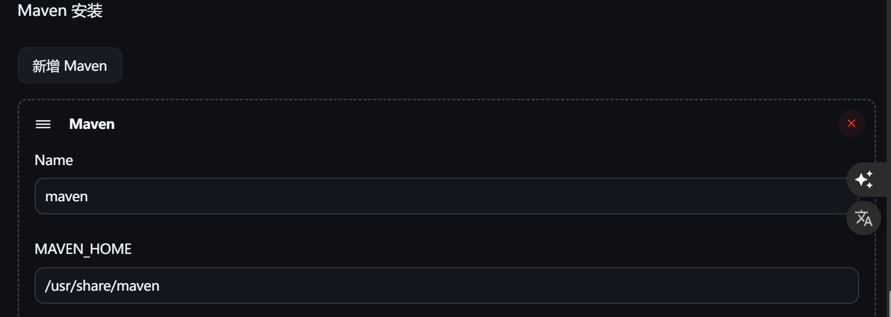

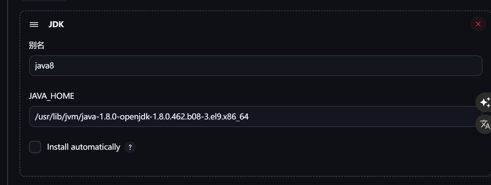

system

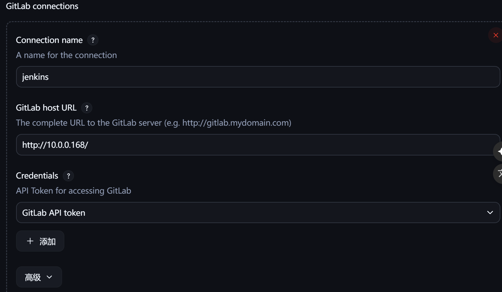

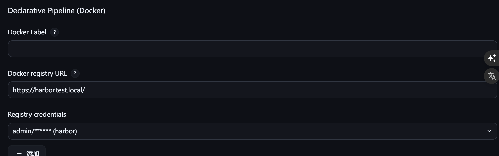

#### 流水线测试

harbor

```powershell
#ebac027b-5d2b-4355-bfb5-ee4bfbec63b1是harbor仓库的凭据ID

pipeline {
  agent any
  
  environment {
    REGISTRY_URL = "harbor.test.local"
    REGISTRY_PROJECT = "test"
    IMAGE_NAME = "demo-app"
    IMAGE_TAG = "latest"
    IMAGE_FULL_NAME = "${REGISTRY_URL}/${REGISTRY_PROJECT}/${IMAGE_NAME}:${IMAGE_TAG}"
  }

  stages {
    stage('Prepare Dockerfile') {
      steps {
        script {
          // 动态写一个简单 Dockerfile 到工作区根目录
          writeFile file: 'Dockerfile', text: '''
            FROM alpine:3.18
            CMD ["echo", "Hello, Jenkins Docker Build!"]
          '''
        }
      }
    }
    
    stage('Build Image') {
      steps {
        script {
          docker.build("${IMAGE_FULL_NAME}")
        }
      }
    }

    stage('Login & Push') {
      steps {
        script {
          docker.withRegistry("https://${REGISTRY_URL}", "ebac027b-5d2b-4355-bfb5-ee4bfbec63b1") {
            docker.image("${IMAGE_FULL_NAME}").push()
          }
        }
      }
    }
  }

  post {
    always {
      cleanWs()
    }
  }
}
```

服务镜像制作上harbor测试

```powershell
出过很多错误，但都靠AI解决了
pipeline {
  agent any

  environment {
    HARBOR_REGISTRY = 'harbor.test.local'
    HARBOR_PROJECT = 'yudao'
    HARBOR_CREDENTIALS_ID = 'ebac027b-5d2b-4355-bfb5-ee4bfbec63b1'
    GIT_CREDENTIALS_ID = 'eb158a05-9559-46e7-9ca1-0600df7bc919'
  }

  parameters {
    choice(name: 'MODULE', choices: ['yudao-gateway', 'yudao-module-system', 'yudao-module-infra'], description: '选择要部署的模块')
  }

  stages {
    stage('Checkout Code') {
      steps {
        echo "克隆代码仓库"
        checkout([
          $class: 'GitSCM',
          userRemoteConfigs: [[
            url: 'http://gitlab.local/yudao-cloud/yudao-cloud-mini.git',
            credentialsId: "${GIT_CREDENTIALS_ID}"
          ]],
          branches: [[name: 'master']]
        ])
      }
    }

    stage('Install All Modules') {
      steps {
        echo "安装全部模块到本地 Maven 仓库"
        sh 'mvn clean install -DskipTests'
      }
    }

    stage('Package Selected Module') {
      steps {
        echo "构建模块: ${params.MODULE}"
        sh "mvn clean package -DskipTests -pl ${params.MODULE}"
      }
    }

    stage('Docker Build & Push') {
      steps {
        dir("${params.MODULE}") {
          script {
            def commitId = sh(script: 'git rev-parse --short HEAD', returnStdout: true).trim()
            def buildTime = sh(script: 'date +%Y%m%d%H%M%S', returnStdout: true).trim()
            def imageTag = "${buildTime}-${commitId}"

            withCredentials([usernamePassword(
              credentialsId: "${HARBOR_CREDENTIALS_ID}",
              usernameVariable: 'HARBOR_CREDENTIALS_USR',
              passwordVariable: 'HARBOR_CREDENTIALS_PSW'
            )]) {
              echo "构建镜像并推送: ${HARBOR_REGISTRY}/${HARBOR_PROJECT}/${params.MODULE}:${imageTag}"
              sh """
                docker build -t ${HARBOR_REGISTRY}/${HARBOR_PROJECT}/${params.MODULE}:${imageTag} .
                echo "$HARBOR_CREDENTIALS_PSW" | docker login -u "$HARBOR_CREDENTIALS_USR" --password-stdin "$HARBOR_REGISTRY"
                docker push ${HARBOR_REGISTRY}/${HARBOR_PROJECT}/${params.MODULE}:${imageTag}
              """
            }
          }
        }
      }
    }
  }
}

```

### 2.1.3依赖管理的方式

本地maven    +  远程nexus
打包方式，直接用胖jar或者用瘦jar+依赖部署（多阶段构建直接先将依赖部署环境再部署jar包制作为镜像）

## 2.2中间件部署

### 2.2.1nfs部署

```powershell
sudo yum install -y nfs-utils
sudo mkdir -p /data/nfs
sudo chmod -R 777 /data/nfs

echo "/data/nfs *(rw,sync,no_root_squash,no_subtree_check)" | sudo tee -a /etc/exports

sudo systemctl enable nfs-server
sudo systemctl start nfs-server
exportfs -r

showmount -e localhost
```

k8s

```powershell
helm repo add nfs-subdir-external-provisioner https://kubernetes-sigs.github.io/nfs-subdir-external-provisioner/
helm repo update

找个可以用helm直接装的镜像真他么难
helm upgrade --install nfs-client nfs-subdir-external-provisioner/nfs-subdir-external-provisioner \
  -n kube-system \
  --set image.repository=swr.cn-north-4.myhuaweicloud.com/ddn-k8s/registry.k8s.io/sig-storage/nfs-subdir-external-provisioner \
  --set image.tag=v4.0.2 \
  --set nfs.server=10.0.0.167 \
  --set nfs.path=/data/nfs \
  --set storageClass.name=nfs-sc \
  --set storageClass.defaultClass=true \
  --set nodePath=/data/nfs \
  --set nodePathCreate=false
```

```powershell
apiVersion: v1
kind: PersistentVolumeClaim
metadata:
  name: mysql-pvc
spec:
  accessModes:
    - ReadWriteOnce
  storageClassName: nfs-sc
  resources:
    requests:
      storage: 5Gi                   @@@测试用，成功bounding就删掉，都是动态创建的
```

### 2.2.2mysql

```powershell
查看资源使用情况
kubectl top node

kubectl get sc
kubectl get pvc
```

```powershell
apiVersion: apps/v1
kind: StatefulSet
metadata:
  name: mysql
  labels:
    app: mysql
spec:
  replicas: 1
  selector:
    matchLabels:
      app: mysql
  serviceName: mysql
  template:
    metadata:
      labels:
        app: mysql
    spec:
      containers:
      - name: mysql
        image: swr.cn-south-1.myhuaweicloud.com/library/mysql:8.0
        env:
        - name: MYSQL_ROOT_PASSWORD
          value: "123456"   # 请修改密码
        ports:
        - containerPort: 3306
          name: mysql
        volumeMounts:
        - name: mysql-data
          mountPath: /var/lib/mysql
  volumeClaimTemplates:
  - metadata:
      name: mysql-data
    spec:
      accessModes: ["ReadWriteOnce"]
      storageClassName: nfs-sc    # 你的 StorageClass 名称
      resources:
        requests:
          storage: 5Gi
---
apiVersion: v1
kind: Service
metadata:
  name: mysql
  labels:
    app: mysql
spec:
  type: NodePort            # 暴露给外网访问可改成 NodePort 或 LoadBalancer
  ports:
  - port: 3306
    targetPort: 3306
    nodePort: 33060         # 节点端口，范围30000-32767
  selector:
    app: mysql
```

```powershell
/data/nfs/default-mysql-data-mysql-0-pvc-a759392c-dada-4f38-97e6-ab9ed8b0d648
```

```powershell
执行拉下来代码的sql
```

```powershell
获取域名
kubectl get svc -A | grep mysql

mysql.default.svc.cluster.local

按要求更改
https://cloud.iocoder.cn/quick-start/#_3-1-%E5%88%9D%E5%A7%8B%E5%8C%96-mysql
```

### 2.2.3redis

仓库找不到自己做

```powershell
apiVersion: apps/v1
kind: StatefulSet
metadata:
  name: redis
  namespace: default
spec:
  serviceName: redis # 虽然没有 Headless，这个字段 Kubernetes 仍要求填写
  replicas: 1
  selector:
    matchLabels:
      app: redis
  template:
    metadata:
      labels:
        app: redis
    spec:
      containers:
        - name: redis
          image: swr.cn-south-1.myhuaweicloud.com/library/redis:6.0-alpine
          ports:
            - containerPort: 6379
          volumeMounts:
            - name: redis-data
              mountPath: /data
          command: ["redis-server"]
          args: ["--appendonly", "yes"]
  volumeClaimTemplates:
    - metadata:
        name: redis-data
      spec:
        accessModes: ["ReadWriteOnce"]
        storageClassName: nfs-sc
        resources:
          requests:
            storage: 2Gi

---
apiVersion: v1
kind: Service
metadata:
  name: redis
  namespace: default
spec:
  type: NodePort  # 如需外部访问，使用 NodePort 或 LoadBalancer
  selector:
    app: redis
  ports:
    - port: 6379
      targetPort: 6379
      nodePort: 30079  # 自定义端口（可选），30000-32767 之间
```

# 3监控

使用argocd去管理yaml

## 3.1指标

### 3.1.1prom

对于自建prom

```powershell
curl -X POST "http://10.244.3.174:9090/-/reload"
```

#### 3.1.1.1operator安装

```powershell
git clone https://github.com/prometheus-operator/kube-prometheus.git
cd kube-prometheus
# 创建命名空间和 CRDs
kubectl create -f manifests/setup
# 等待命名空间创建完成，然后安装其余组件
kubectl create -f manifests/

kubectl describe pod -l app.kubernetes.io/name=kube-state-metrics -n monitoring
kubectl describe pod -l app.kubernetes.io/name=prometheus-adapter -n monitoring

时区问题，建议在yaml文件中+
operator yaml中加，dockerfile里加，只加环境变量如：ENV TZ=Asia/Shanghai
spec:
  containers:
  - name: node-exporter
    image: quay.io/prometheus/node-exporter:v1.7.0
    env:
    - name: TZ
      value: Asia/Shanghai
```

不行，自己做镜像

```powershell
git clone https://github.com/kubernetes/kube-state-metrics.git
cd kube-state-metrics

# 检查对应版本
git checkout v2.17.0

#走国内代理
vim Dockerfile
ENV GOPROXY=https://goproxy.cn,direct
ENV GOPRIVATE=
ENV GOSUMDB=off

# 构建镜像
docker build --build-arg GOARCH=amd64 -t harbor.test.local/monitoring/kube-state-metrics:v2.17.0 .

# 测试镜像是否能运行
docker run --rm harbor.test.local/monitoring/kube-state-metrics:v2.17.0 --version

docker push harbor.test.local/monitoring/kube-state-metrics:v2.17.0

find manifests/ -name "*.yaml" -exec sed -i 's|k8s.gcr.io/kube-state-metrics/|harbor.test.local/monitoring/|g' {} \;
find manifests/ -name "*.yaml" -exec sed -i 's|registry.k8s.io/kube-state-metrics/|harbor.test.local/monitoring/|g' {} \;

kubectl apply -f manifests/


#问题检查
kubectl get secret harbor-reg-secret -n monitoring -o jsonpath='{.data.\.dockerconfigjson}' | base64 -d

kubectl get serviceaccount default -n monitoring -o jsonpath='{.imagePullSecrets}'

kubectl run test-pull -n monitoring \
  --image=harbor.test.local/monitoring/kube-state-metrics:v2.17.0 \
  --restart=Never \
  --rm -it
#找到原因，yaml中image字段不能有https://

kubectl apply -f manifests/kube-state-metrics-deployment.yaml
# 强制替换配置（忽略注解问题）
kubectl replace -f manifests/kube-state-metrics-deployment.yaml --force
```

```powershell
# 克隆仓库
git clone https://github.com/kubernetes-sigs/prometheus-adapter.git

# 进入目录
cd prometheus-adapter

# 查看所有发布版本（Tag）
git tag

# 选择一个版本并切换过去，例如 v0.12.0
git checkout v0.12.0

#走国内代理
vim Dockerfile
ENV GOPROXY=https://goproxy.cn,direct
ENV GOPRIVATE=
ENV GOSUMDB=off

docker build   --build-arg ARCH=amd64   --build-arg GO_VERSION=1.24   -t harbor.test.local/monitoring/prometheus-adapter:v0.12.0 .

docker run --rm harbor.test.local/monitoring/prometheus-adapter:v0.12.0 --help

docker push harbor.test.local/monitoring/prometheus-adapter:v0.12.0

####省略了替换仓库步骤

kubectl run test-pull -n monitoring \
  --image=harbor.test.local/monitoring/prometheus-adapter:v0.12.0 \
  --restart=Never \
  --rm -it

kubectl replace -f manifests/prometheusAdapter-deployment.yaml --force
```


问题：

虚拟机配置代理

```powershell
代理打开允许局域网，只监听127.0.0.1没用   （clash verge居然没有这个功能）
虚拟机配置代理，网卡ip:port
win防火墙添加入站规则允许该端口

或者在虚拟机里装个clash
```

docker配置代理

```powershell
# 创建 Docker 代理配置目录
sudo mkdir -p /etc/systemd/system/docker.service.d/

# 创建代理配置文件
sudo tee /etc/systemd/system/docker.service.d/http-proxy.conf << 'EOF'
[Service]
Environment="HTTP_PROXY=http://10.0.0.1:7890"
Environment="HTTPS_PROXY=http://10.0.0.1:7890"
Environment="NO_PROXY=localhost,127.0.0.1,.local"
EOF

# 重启 Docker 服务
sudo systemctl daemon-reload
sudo systemctl restart docker

# 验证配置是否生效
systemctl show --property=Environment docker
```

节点信任harbor（开头部署有脚本，这里贴个ansible伪代码）

```powershell
- name: Deploy Harbor CA
  hosts: k8s_nodes
  become: yes
  tasks:
    - name: Copy CA to containerd
      copy:
        src: /apps/harbor/certs/ca.crt
        dest: /etc/containerd/certs.d/harbor.test.local/ca.crt
        owner: root
        group: root
        mode: '0644'

    - name: Copy CA to system trust
      copy:
        src: /apps/harbor/certs/ca.crt
        dest: /etc/pki/ca-trust/source/anchors/harbor.test.local.crt
        owner: root
        group: root
        mode: '0644'

    - name: Update CA trust
      command: update-ca-trust extract
      when: ansible_os_family == "RedHat"

    - name: Restart containerd
      systemd:
        name: containerd
        state: restarted
        enabled: yes
```

k8s创建secret

```powershell
每个命名空间都要一个，很麻烦
脚本/kustomize/helm
```

#### 3.1.1.2验证安装成功

检查各组件端点

```powershell
# 检查所有服务的端点
kubectl get endpoints -n monitoring

# 检查特定服务的详情
kubectl describe service kube-state-metrics -n monitoring
kubectl describe service prometheus-k8s -n monitoring

[root@master1 kube-prometheus]# kubectl get svc -n monitoring 
NAME                    TYPE        CLUSTER-IP      EXTERNAL-IP   PORT(S)                      AGE
alertmanager-main       ClusterIP   172.30.69.43    <none>        9093/TCP,8080/TCP            9h
alertmanager-operated   ClusterIP   None            <none>        9093/TCP,9094/TCP,9094/UDP   9h
blackbox-exporter       ClusterIP   172.30.38.179   <none>        9115/TCP,19115/TCP           9h
grafana                 ClusterIP   172.30.112.86   <none>        3000/TCP                     9h
kube-state-metrics      ClusterIP   None            <none>        8443/TCP,9443/TCP            9h
node-exporter           ClusterIP   None            <none>        9100/TCP                     9h
prometheus-adapter      ClusterIP   172.30.200.36   <none>        443/TCP                      9h
prometheus-k8s          ClusterIP   172.30.210.28   <none>        9090/TCP,8080/TCP            9h
prometheus-operated     ClusterIP   None            <none>        9090/TCP                     9h
prometheus-operator     ClusterIP   None            <none>        8443/TCP                     9h
```

验证数据采集

```powershell
# 检查 Prometheus 的目标（targets）状态
kubectl port-forward svc/prometheus-k8s 9090:9090 -n monitoring --address 0.0.0.0 &
#节点cpu
100 - (avg by(instance) (rate(node_cpu_seconds_total{mode="idle"}[5m])) * 100)
#节点内存
(node_memory_MemTotal_bytes - node_memory_MemAvailable_bytes) / node_memory_MemTotal_bytes * 100

kubectl port-forward -n monitoring svc/alertmanager-main 9093:9093 --address 0.0.0.0 &

kubectl port-forward -n monitoring svc/grafana 3000:3000 --address 0.0.0.0 &
默认账号密码admin/admin

改时区
sed -i 's|utc|Asia/Shanghai|g' grafana-dashboardDefinitions.yaml
sed -i 's|UTC|Asia/Shanghai|g' grafana-dashboardDefinitions.yaml
```

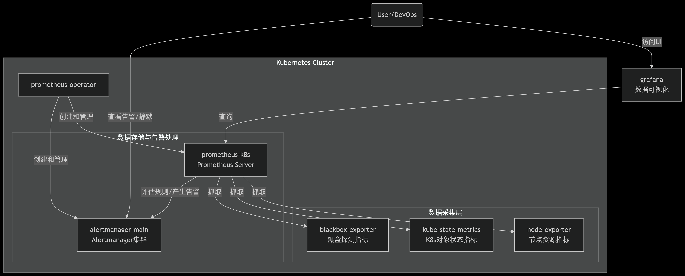

没抓到controllermanager和scheduller

```powershell
---
# kube-controller-manager Service
apiVersion: v1
kind: Service
metadata:
  name: kube-controller-manager
  namespace: kube-system
  labels:
    app.kubernetes.io/name: kube-controller-manager
spec:
  clusterIP: None
  ports:
    - name: https-metrics
      port: 10257
      protocol: TCP
      targetPort: 10257
---
# kube-controller-manager Endpoints
apiVersion: v1
kind: Endpoints
metadata:
  name: kube-controller-manager
  namespace: kube-system
subsets:
  - addresses:
      - ip: 10.0.0.156
      - ip: 10.0.0.157
      - ip: 10.0.0.158
    ports:
      - name: https-metrics
        port: 10257
        protocol: TCP
---
# kube-scheduler Service
apiVersion: v1
kind: Service
metadata:
  name: kube-scheduler
  namespace: kube-system
  labels:
    app.kubernetes.io/name: kube-scheduler
spec:
  clusterIP: None
  ports:
    - name: https-metrics
      port: 10259
      protocol: TCP
      targetPort: 10259
---
# kube-scheduler Endpoints
apiVersion: v1
kind: Endpoints
metadata:
  name: kube-scheduler
  namespace: kube-system
subsets:
  - addresses:
      - ip: 10.0.0.156
      - ip: 10.0.0.157
      - ip: 10.0.0.158
    ports:
      - name: https-metrics
        port: 10259
        protocol: TCP
```

```powershell
新建了一个 Endpoints，和 Service 同名、同 namespace
这样 Service 和 Endpoints 就关联上了。

排错重点关注整个链路
Prometheus Operator 通过 Service 找到 Endpoints → 从 Endpoints 里解析出真实的 IP:Port → 下发到 Prometheus → 开始采集。

其他链路
pod
PodMonitor → 选 Pod → Pod.status.podIP + 容器端口 → 下发到 Prometheus
node
Prometheus Operator → kubernetes_sd_configs (role: node) → Node.status.addresses → 下发到 Prometheus

role: ingress → 发现 Ingress backend
role: endpointslice → 直接发现 EndpointSlice

Prometheus scrape_configs.static_configs → 直接写死 IP:Port → 下发到 Prometheus
```

### 3.1.2nginx

#### 3.1.2.1制作镜像

使用vts模块，以下

```powershell
[root@k8s-harbor1 nginx-vts]# cat Dockerfile
# 使用 Alpine 作为基础镜像
FROM alpine:3.18 AS builder

# 设置国内镜像源
RUN echo "https://mirrors.aliyun.com/alpine/v3.18/main" > /etc/apk/repositories && \
    echo "https://mirrors.aliyun.com/alpine/v3.18/community" >> /etc/apk/repositories

# 设置 Nginx 版本
ENV NGINX_VERSION=1.24.0

# 安装编译依赖（使用国内源）
RUN apk add --no-cache \
    gcc \
    libc-dev \
    make \
    openssl-dev \
    pcre-dev \
    zlib-dev \
    linux-headers \
    curl \
    gnupg \
    libxslt-dev \
    gd-dev \
    geoip-dev \
    perl-dev

# 复制本地的 vts tar 包到镜像中
COPY v0.2.1.tar.gz /tmp/nginx-module-vts.tar.gz

# 下载并编译 Nginx with vts module
RUN cd /tmp && \
    # 使用国内镜像下载 nginx
    curl -fSL https://nginx.org/download/nginx-${NGINX_VERSION}.tar.gz -o nginx.tar.gz && \
    tar -zxvf nginx.tar.gz && \
    # 解压本地的 vts 模块
    tar -zxvf nginx-module-vts.tar.gz && \
    # 编译 Nginx
    cd /tmp/nginx-${NGINX_VERSION} && \
    ./configure \
        --prefix=/etc/nginx \
        --sbin-path=/usr/sbin/nginx \
        --conf-path=/etc/nginx/nginx.conf \
        --error-log-path=/var/log/nginx/error.log \
        --http-log-path=/var/log/nginx/access.log \
        --pid-path=/var/run/nginx.pid \
        --lock-path=/var/run/nginx.lock \
        --http-client-body-temp-path=/var/cache/nginx/client_temp \
        --http-proxy-temp-path=/var/cache/nginx/proxy_temp \
        --http-fastcgi-temp-path=/var/cache/nginx/fastcgi_temp \
        --http-uwsgi-temp-path=/var/cache/nginx/uwsgi_temp \
        --http-scgi-temp-path=/var/cache/nginx/scgi_temp \
        --user=nginx \
        --group=nginx \
        --with-compat \
        --with-file-aio \
        --with-threads \
        --with-http_addition_module \
        --with-http_auth_request_module \
        --with-http_dav_module \
        --with-http_flv_module \
        --with-http_gunzip_module \
        --with-http_gzip_static_module \
        --with-http_mp4_module \
        --with-http_random_index_module \
        --with-http_realip_module \
        --with-http_secure_link_module \
        --with-http_slice_module \
        --with-http_ssl_module \
        --with-http_stub_status_module \
        --with-http_sub_module \
        --with-http_v2_module \
        --with-mail \
        --with-mail_ssl_module \
        --with-stream \
        --with-stream_realip_module \
        --with-stream_ssl_module \
        --with-stream_ssl_preread_module \
        --add-module=../nginx-module-vts-0.2.1 && \
    make -j$(nproc) && \
    make install && \
    # 清理临时文件
    rm -rf /tmp/nginx-${NGINX_VERSION} /tmp/nginx.tar.gz /tmp/nginx-module-vts.tar.gz

# 创建运行时镜像
FROM alpine:3.18

# 设置国内镜像源
RUN echo "https://mirrors.aliyun.com/alpine/v3.18/main" > /etc/apk/repositories && \
    echo "https://mirrors.aliyun.com/alpine/v3.18/community" >> /etc/apk/repositories && \
    # 安装运行时依赖
    apk add --no-cache \
    pcre \
    zlib \
    openssl \
    tzdata \
    curl && \
    # 创建 nginx 用户和组
    addgroup -S nginx && \
    adduser -S -D -H -u 101 -h /var/cache/nginx -s /sbin/nologin -G nginx -g nginx nginx && \
    # 创建必要的目录
    mkdir -p /var/cache/nginx && \
    mkdir -p /var/log/nginx && \
    mkdir -p /etc/nginx/conf.d && \
    mkdir -p /usr/share/nginx/html && \
    chown -R nginx:nginx /var/cache/nginx && \
    chown -R nginx:nginx /var/log/nginx

# 从构建阶段复制编译好的 Nginx
COPY --from=builder /etc/nginx /etc/nginx
COPY --from=builder /usr/sbin/nginx /usr/sbin/nginx

# 复制您自定义的配置文件
COPY nginx.conf /etc/nginx/nginx.conf
COPY index.html /usr/share/nginx/html/index.html

# 复制 mime.types 文件
COPY --from=builder /etc/nginx/mime.types /etc/nginx/mime.types

# 暴露端口
EXPOSE 80 443


# 启动 Nginx
CMD ["nginx", "-g", "daemon off;"]
```

```powershell
docker run -d --rm -p 8888:80 harbor.test.local/nginx/nginx-vts:1.22.1 docker exec -it ..... /bin/bash   #上面使用/bin/bash会覆盖原本的启动命令，删了

docker push harbor.test.local/nginx/nginx-vts:1.22.1
```

#### 3.1.2.2nginx上k8s

```powershell
kubectl rollout restart -n test deployment/nginx-vts
```

yaml

```powershell
[root@master1 nginx]# cat nginx-vts.yaml 
apiVersion: v1
kind: PersistentVolumeClaim
metadata:
  name: nginx-logs-pvc
  namespace: test
spec:
  accessModes:
    - ReadWriteOnce
  storageClassName: nfs-sc
  resources:
    requests:
      storage: 1Gi
---
apiVersion: apps/v1
kind: Deployment
metadata:
  name: nginx-vts
  namespace: test
  labels:
    app: nginx-vts
spec:
  replicas: 2   # 起两个 Pod
  selector:
    matchLabels:
      app: nginx-vts
  template:
    metadata:
      labels:
        app: nginx-vts
    spec:
      containers:
        - name: nginx-vts
          image: harbor.test.local/nginx/nginx-vts:1.22.1-0.2.1
          imagePullPolicy: Always
          ports:
            - containerPort: 80
          volumeMounts:
            - name: nginx-conf
              mountPath: /etc/nginx/nginx.conf
              subPath: nginx.conf
            - name: nginx-logs
              mountPath: /var/log/nginx
      volumes:
        - name: nginx-conf
          configMap:
            name: nginx-vts-config
        - name: nginx-logs
          persistentVolumeClaim:
            claimName: nginx-logs-pvc

---
apiVersion: v1
kind: ConfigMap
metadata:
  name: nginx-vts-config
  namespace: test
data:
    user nginx;
    worker_processes auto;

    error_log  /var/log/nginx/error.log warn;
    pid        /var/run/nginx.pid;

    events {
        worker_connections 1024;
    }

    http {
        include       /etc/nginx/mime.types;
        default_type  application/octet-stream;

        # ✅ 1. 必须定义 vhost_traffic_status_zone（你漏了！）
        vhost_traffic_status_zone shared:vhost_traffic_status:10m;

        # ✅ 2. 在 log_format 中加入 $request_time
        log_format  main  '$remote_addr - $remote_user [$time_local] "$request" '
                          '$status $body_bytes_sent "$http_referer" '
                          '"$http_user_agent" "$http_x_forwarded_for" '
                          '$request_time';  # ← 必须加上！

        access_log  /var/log/nginx/access.log  main;

        sendfile        on;
        keepalive_timeout  65;

        server {
            listen       80;
            server_name  localhost;

            # ✅ 3. 启用基于 host 的过滤（可选）
            vhost_traffic_status_filter_by_host on;

            # ✅ 4. 关键：让 VTS 使用 $request_time 来统计处理时间
            vhost_traffic_status_filter_by_set_key $request_time request_time::$server_name;

            location / {
                root   /usr/share/nginx/html;
                index  index.html index.htm;
            }

            location /metrics {
                vhost_traffic_status_display;
                vhost_traffic_status_display_format prometheus;
                allow all;
            }

            location /status {
                vhost_traffic_status_display;
                vhost_traffic_status_display_format html;
                allow all;
            }
        }
    }
---
apiVersion: v1
kind: Service
metadata:
  name: nginx-vts-svc
  namespace: test
  labels:
    app: nginx-vts
    app.kubernetes.io/component: nginx
    app.kubernetes.io/name: nginx-vts
    app.kubernetes.io/part-of: kube-prometheus
spec:
  selector:
    app: nginx-vts
  ports:
    - name: http
      port: 80
      targetPort: 80
      nodePort: 30080
  type: NodePort

```

#### 3.1.2.3prometheus监控

```powershell
[root@master1 nginx]# cat nginx-vts-monitor.yaml 
apiVersion: monitoring.coreos.com/v1
kind: ServiceMonitor
metadata:
  labels:
    app.kubernetes.io/component: nginx
    app.kubernetes.io/name: nginx-vts
    app.kubernetes.io/part-of: kube-prometheus
    app.kubernetes.io/version: 1.22.1-0.2.1
  name: nginx-vts
  namespace: monitoring  # ServiceMonitor 通常放在 monitoring 命名空间
spec:
  endpoints:
  - interval: 15s
    port: http           # 对应 Service 的端口名称
  selector:
    matchLabels:
      app: nginx-vts     # 匹配您的 Service 的标签
  namespaceSelector:
    matchNames:
    - test               # 您的 nginx 所在的命名空间
```

排查问题

```powershell
wget -qO- --timeout=10 http://172.31.189.66:80/metrics


日你马的排查一天，链路都没问题，结果是operator权限的问题
[root@master1 external-solution]# kubectl auth can-i get endpoints -n test --as system:serviceaccount:monitoring:prometheus-k8s
no

[root@master1 manifests]# cat > prometheus-clusterRole.yaml << 'EOF'
apiVersion: rbac.authorization.k8s.io/v1
kind: ClusterRole
metadata:
  labels:
    app.kubernetes.io/component: prometheus
    app.kubernetes.io/instance: k8s
    app.kubernetes.io/name: prometheus
    app.kubernetes.io/part-of: kube-prometheus
    app.kubernetes.io/version: 3.5.0
  name: prometheus-k8s
rules:
- apiGroups: [""]
  resources:
    - nodes
    - nodes/metrics
    - services
    - endpoints
    - pods
  verbs: ["get", "list", "watch"]
- apiGroups: ["discovery.k8s.io"]
  resources:
    - endpointslices
  verbs: ["get", "list", "watch"]
- nonResourceURLs:
  - /metrics
  - /metrics/slis
  verbs: ["get"]
EOF
```

#### 3.1.2.4grafana面板展示

```powershell
#Server connections
sum(nginx_vts_main_connections{instance=~"$Instance", status=~"active|writing|reading|waiting"}) by (status)   求和分组

sum(nginx_vts_main_connections{status="active"})
...

#状态码
sum(irate(nginx_vts_server_requests_total{instance=~"$Instance",code!="total"}[5m])) by (code)
```

### 3.1.3自定义监控

编写/metrics或者exporter

```powershell
go build -o goexamplemetrics main.go

mv goexamplemetrics ../metrics-example

go mod tidy

还非得进目录打包
go build -o app main.go
go build -o exporter main.go
```

#### dockerfile

```powershell
# 构建阶段
FROM golang:1.24-alpine AS builder

# 设置国内镜像源（加速下载）
RUN go env -w GOPROXY=https://goproxy.cn,direct

WORKDIR /app


# 复制源代码并编译
COPY . .
RUN go mod download
RUN go build -ldflags="-s -w" -o main-app app/main.go

# 运行阶段
FROM alpine:latest

WORKDIR /app

# 从构建阶段复制二进制文件
COPY --from=builder /app/main-app .

# 创建非root用户运行（更安全）
RUN adduser -D -g '' appuser && chown -R appuser:appuser /app
USER appuser

EXPOSE 8081 

CMD ["./main-app"]
```

#### 测试

```powershell
docker run -it -p 8081:8081  harbor.test.local/apps/main-app:v1

在k8s上运行后测试
while true; do curl -s http://10.0.0.156:38080/api/car/random; sleep 1; done

#30秒内平均，瞬时向量
avg by (pod) (
  #时间范围向量
  avg_over_time(car_http_request_latency_seconds[30s])
)

sum by (pod) (increase(car_http_requests_total[30s]))

sum(increase(car_http_requests_total{code="Internal Server Error"}[30s]))

#请求成功率
sum(increase(car_http_requests_total{code="OK"}[30s]))
/sum(increase(car_http_requests_total[30s]))

#瞬时
quantile by (pod) (0.99, car_http_request_latency_seconds)
```

#### yaml文件

```powershell
# justmetrics.yaml

apiVersion: v1
kind: Pod
metadata:
  name: justmetrics
  labels:
    app.kubernetes.io/name: justmetrics
    app: justmetrics         # 推荐：更标准的标签
spec:
  containers:
  - name: justmetrics
    image: harbor.test.local/apps/justmetrics:v1
    ports:
    - containerPort: 8080
      protocol: TCP
      name: http
---
apiVersion: v1
kind: Service
metadata:
  name: justmetrics
  labels:
    app.kubernetes.io/name: justmetrics
    app: justmetrics
spec:
  type: NodePort
  selector:
    app: justmetrics         
  ports:
    - port: 8080             # Service 监听的端口（集群内访问）
      targetPort: 8080       # 转发到 Pod 的容器端口
      protocol: TCP
      name: http
      nodePort: 38080


---
#monitor
apiVersion: monitoring.coreos.com/v1
kind: ServiceMonitor
metadata:
  labels:
    app.kubernetes.io/name: justmetrics
    app.kubernetes.io/part-of: kube-prometheus
  name: justmetrics-monitor
  namespace: monitoring
spec:
  endpoints:
  - interval: 15s
    port: http
  selector:
    matchLabels:
      app: justmetrics
  namespaceSelector:
    matchNames:
    - default
```

exporter

```powershell
apiVersion: v1
kind: Pod
metadata:
  name: exporter-example
  labels:
    app: exporter-example           # 标签，供 Service 使用
    app.kubernetes.io/name: exporter_example
spec:
  containers:
    # --- 主应用容器 ---
    - name: app
      image: harbor.test.local/apps/main-app:v1
      ports:
        - containerPort: 8081
          protocol: TCP
          name: app-http
      # 如果主应用需要通过 /status 被 exporter 抓取，确保它监听 8081
      # 例如：启动命令应绑定到 :8081

    # --- Exporter 容器 ---
    - name: exporter
      image: harbor.test.local/apps/exporter:v1
      ports:
        - containerPort: 9090
          protocol: TCP
          name: metrics
---
# Service：暴露两个端口，使用 NodePort
apiVersion: v1
kind: Service
metadata:
  name: exporter-example
  labels:
    app: exporter-example
    app.kubernetes.io/name: exporter_example
spec:
  type: NodePort
  selector:
    app: exporter-example                 # 匹配 Pod 的标签
  ports:
    # 暴露主应用的 8081 端口（可选，如果外部需要访问）
    - name: app
      port: 8081
      targetPort: 8081
      protocol: TCP
      nodePort: 38081                # 可选：指定 NodePort

    # 暴露 Exporter 的 9090 端口（Prometheus 抓取用）
    - name: exporter
      port: 9090
      targetPort: 9090
      protocol: TCP
      nodePort: 39090                # 可选：指定 NodePort
      
---
#monitor
apiVersion: monitoring.coreos.com/v1
kind: ServiceMonitor
metadata:
  labels:
    app.kubernetes.io/name: exporter-example
    app.kubernetes.io/part-of: kube-prometheus
  name: justmetrics-monitor
  namespace: monitoring
spec:
  endpoints:
  - interval: 15s
    port: exporter
  selector:
    matchLabels:
      app: exporter-example
  namespaceSelector:
    matchNames:
    - default
```

### 3.1.4告警

以自定义监控为例，一般servicemonitor，rule，alert等资源都和被监控对象在统一命名空间

####  3.1.4.1记录规则和告警规则PrometheusRule

```powershell
# jm-rules.yaml
apiVersion: monitoring.coreos.com/v1
kind: PrometheusRule
metadata:
  name: jm-rules
  namespace: default
  labels:
    app: justmetrics
    role: alert-rules
    app.kubernetes.io/name: justmetrics
    app.kubernetes.io/part-of: kube-prometheus
spec:
  groups:
  - name: car-app
    rules:

      - record: job:car_http_success_rate:percent
        expr: |
          (
            sum(rate(car_http_requests_total{code="OK"}[30s]))
            /
            sum(rate(car_http_requests_total[30s]))
          ) * 100
        labels:
          severity: info

      # =====================
      # ⚠️ 告警规则：成功率低于 95% 持续 1 分钟
      # =====================
      - alert: CarAppHighErrorRate
        expr: |
          (
            sum(rate(car_http_requests_total{code="OK"}[30s])) by (pod, namespace)
            /
            sum(rate(car_http_requests_total[30s])) by (pod, namespace)
          ) * 100 < 95
        for: 30s
        labels:
          severity: warning
          app: justmetrics                          # 👈 用于和 jm-alerts 路由绑定
          namespace: "{{ $labels.namespace }}"
          pod: "{{ $labels.pod }}"
        annotations:
          summary: "Car App High Error Rate (pod {{ $labels.pod }})"
          description: "告警:请求成功率低于 95% (当前值: {{ $value }}%)"

      # =====================
      # ⚠️ 告警规则：成功率低于 90% 持续 1 分钟 → 严重告警
      # =====================
      - alert: CarAppErrorRate
        expr: |
          (
            sum(rate(car_http_requests_total{code="OK"}[30s])) by (pod, namespace)
            /
            sum(rate(car_http_requests_total[30s])) by (pod, namespace)
          ) * 100 < 90
        for: 30s
        labels:
          severity: critical
          app: justmetrics
          namespace: "{{ $labels.namespace }}"
          pod: "{{ $labels.pod }}"
        annotations:
          summary: "Car App Critical Error Rate (instance {{ $labels.instance }})"
          description: "告警:请求成功率低于 90% (当前值: {{ $value }}%)"

      # =====================
      # 📈 可选：记录 P99 延迟（如果你有 car_http_request_latency_seconds）
      # =====================
      - record: job:car_http_latency_p99:seconds
        expr: quantile by (pod) (0.99, car_http_request_latency_seconds)
        labels:
          quantile: "0.99"
```

#### 3.1.4.2AlertmanagerConfig

```powershell
两种方式：
1.使用alertmanagerConfig，使用prometheus-webhook-dingtalk，在alertmanager原始配置中配置选择器
```

```powershell
vim alertmanager-alertmanager.yaml
  # 关键配置：启用 AlertmanagerConfig 发现
  alertmanagerConfigSelector: {}  # 选择所有命名空间的 AlertmanagerConfig
  alertmanagerConfigNamespaceSelector: {}  # 在所有命名空间中查找
```

```powershell
apiVersion: monitoring.coreos.com/v1alpha1
kind: AlertmanagerConfig
metadata:
  name: jm-alerts 
  namespace: default  # 👈 必须和 PrometheusRule 同命名空间，或确保 Prometheus 能发现它
  labels:
    app: justmetrics
    app.kubernetes.io/name: justmetrics
    app.kubernetes.io/part-of: kube-prometheus
spec:
  # =====================
  # 🚫 路由匹配器：只处理带有 'app=justmetrics' 标签的告警
  # （可选，用于多团队隔离）
  # =====================
  route:
    matchers:                         # 👈 限定只接收 justmetrics 的告警
      - name: app
        value: justmetrics
        matchType: "="
    groupBy: ['alertname', 'namespace', 'pod']      # 👈 按告警名+命名空间+Pod分组
    groupWait: 30s                                  # 新组等待时间      将30秒内告警合并
    groupInterval: 1m                               # 组内新增告警间隔
    repeatInterval: 1m                              # 重复通知间隔
    receiver: "default-webhook"                     # 默认接收器

    # 子路由：按 severity 分发
    routes:
      - matchers:
          - name: severity
            value: critical
            matchType: "="
        receiver: "critical-webhook"
        continue: true                              # 继续匹配抑制规则

      - matchers:
          - name: severity
            value: warning
            matchType: "="
        receiver: "warning-webhook"

  # =====================
  # 🛑 抑制规则：当同一 Pod 出现 critical 告警时，抑制 warning 告警
  # =====================
  inhibitRules:
    - sourceMatch:
        - name: severity
          value: critical            #任何同一个 Pod 里的 critical 告警，都会抑制这个 Pod 的 所有 warning 告警。
          matchType: "="
      targetMatch:
        - name: severity
          value: warning
          matchType: "="
      equal: ['namespace', 'pod']      # 👈 关键：相同 Pod 才抑制

  # =====================
  # 📥 接收器定义
  # =====================
  receivers:
    - name: "default-webhook"
      webhookConfigs:
        - url: "http://prometheus-webhook-dingtalk.monitoring.svc:8060/dingtalk/default/send"
          sendResolved: true

    - name: "critical-webhook"
      webhookConfigs:
        - url: "http://prometheus-webhook-dingtalk.monitoring.svc:8060/dingtalk/critical/send"
          sendResolved: true

    - name: "warning-webhook"
      webhookConfigs:
        - url: "http://prometheus-webhook-dingtalk.monitoring.svc:8060/dingtalk/warning/send"
          sendResolved: true
```

#### 3.1.4.3部署prometheus-webhook-dingtalk

```powershell
[root@master1 dingtalk-adapter]# cat dingtalk-adapter.yaml 
apiVersion: apps/v1
kind: Deployment
metadata:
  name: prometheus-webhook-dingtalk
  namespace: monitoring
spec:
  replicas: 1
  selector:
    matchLabels:
      app: prometheus-webhook-dingtalk
  template:
    metadata:
      labels:
        app: prometheus-webhook-dingtalk
    spec:
      containers:
        - name: webhook-dingtalk
          image: timonwong/prometheus-webhook-dingtalk:v2.1.0
          args:
            - --config.file=/etc/prometheus-webhook-dingtalk/config.yaml
            - --web.listen-address=:8060      # 👈 绑定到所有接口
          ports:
            - containerPort: 8060
          volumeMounts:
            - name: config-volume
              mountPath: /etc/prometheus-webhook-dingtalk
      volumes:
        - name: config-volume
          configMap:
            name: dingtalk-config
            
---
apiVersion: v1
kind: Service
metadata:
  name: prometheus-webhook-dingtalk
  namespace: monitoring
spec:
  ports:
    - port: 8060
      targetPort: 8060
  selector:
    app: prometheus-webhook-dingtalk        
```

#### 4.1.4.4告警模版configmap

```yaml
apiVersion: v1
kind: ConfigMap
metadata:
  name: dingtalk-config
  namespace: monitoring
data:
  # 模板文件
  default.tmpl: |-
    {{ define "__subject" }}[{{ .Status | toUpper }}{{ if eq .Status "firing" }}:{{ 
    .Alerts.Firing | len }}{{ end }}] {{ .GroupLabels.SortedPairs.Values | join " " }} {{ 
    if gt (len .CommonLabels) (len .GroupLabels) }}({{ with .CommonLabels.Remove 
    .GroupLabels.Names }}{{ .Values | join " " }}{{ end }}){{ end }}{{ end }}
    {{ define "__alertmanagerURL" }}{{ .ExternalURL }}/#/alerts?receiver={{ .Receiver }}
    {{ end }}
    {{ define "__text_alert_list" }}{{ range . }}
    **Labels**
    {{ range .Labels.SortedPairs }}> - {{ .Name }}: {{ .Value | markdown | html }}
    {{ end }}
    **Annotations**
    {{ range .Annotations.SortedPairs }}> - {{ .Name }}: {{ .Value | markdown | html }}
    {{ end }}
    **Source:** [{{ .GeneratorURL }}]({{ .GeneratorURL }})
    {{ end }}{{ end }}
    {{ define "___text_alert_list" }}{{ range . }}
    ---
    **告警主题:** {{ .Labels.alertname | upper }}
    **告警级别:** {{ .Labels.severity | upper }}
    **触发时间:** {{ dateInZone "2006-01-02 15:04:05" (.StartsAt) "Asia/Shanghai" }}
    **事件信息:** {{ range .Annotations.SortedPairs }} {{ .Value | markdown | html }}
    {{ end }}
    **事件标签:**
    {{ range .Labels.SortedPairs }}{{ if and (ne (.Name) "severity") (ne (.Name) 
    "summary") (ne (.Name) "team") }}> - {{ .Name }}: {{ .Value | markdown | html }}
    {{ end }}{{ end }}
    {{ end }}
    {{ end }}
    {{ define "___text_alertresovle_list" }}{{ range . }}
    ---
    **告警主题:** {{ .Labels.alertname | upper }}
    **告警级别:** {{ .Labels.severity | upper }}
    **触发时间:** {{ dateInZone "2006-01-02 15:04:05" (.StartsAt) "Asia/Shanghai" }}
    **结束时间:** {{ dateInZone "2006-01-02 15:04:05" (.EndsAt) "Asia/Shanghai" }}
    **事件信息:** {{ range .Annotations.SortedPairs }} {{ .Value | markdown | html }}
    {{ end }}
    **事件标签:**
    {{ range .Labels.SortedPairs }}{{ if and (ne (.Name) "severity") (ne (.Name) 
    "summary") (ne (.Name) "team") }}> - {{ .Name }}: {{ .Value | markdown | html }}
    {{ end }}{{ end }}
    {{ end }}
    {{ end }}
    {{/* Default */}}
    {{ define "_default.title" }}{{ template "__subject" . }}{{ end }}
    {{ define "_default.content" }} [{{ .Status | toUpper }}{{ if eq .Status "firing" }}:
    {{ .Alerts.Firing | len }}{{ end }}\] **[{{ index .GroupLabels "alertname" }}]({{ 
    template "__alertmanagerURL" . }})**
    {{ if gt (len .Alerts.Firing) 0 -}}
    
    **========PromAlert 告警触发========**
    {{ template "___text_alert_list" .Alerts.Firing }}
    {{- end }}
    {{ if gt (len .Alerts.Resolved) 0 -}}
    
    **========PromAlert 告警恢复========**
    {{ template "___text_alertresovle_list" .Alerts.Resolved }}
    {{- end }}
    {{- end }}
    {{/* Legacy */}}
    {{ define "legacy.title" }}{{ template "__subject" . }}{{ end }}
    {{ define "legacy.content" }} [{{ .Status | toUpper }}{{ if eq .Status "firing" }}:{{ 
    .Alerts.Firing | len }}{{ end }}\] **[{{ index .GroupLabels "alertname" }}]({{ 
    template "__alertmanagerURL" . }})**
    {{ template "__text_alert_list" .Alerts.Firing }}
    {{- end }}
    {{/* Following names for compatibility */}}
    {{ define "_ding.link.title" }}{{ template "_default.title" . }}{{ end }}
    {{ define "_ding.link.content" }}{{ template "_default.content" . }}{{ end }}
  # 配置文件
  config.yaml: |-
    templates:
      - /etc/prometheus-webhook-dingtalk/default.tmpl

    default_message:
      title: '{{ template "_ding.link.title" . }}'
      text: '{{ template "_ding.link.content" . }}'
    targets:
      default:
        url: https://oapi.dingtalk.com/robot/send?access_token=2cde05892735cc5a867c06e63216ca8de6203b0b5945ea5d0b77af83bb04fb59
      critical:
        url: https://oapi.dingtalk.com/robot/send?access_token=4c5e69e9203f0fdb6fa3fae7270e76ad2294056fc50f0c480e7c56fe63e13a67
      warning:
        url: https://oapi.dingtalk.com/robot/send?access_token=d99129a379319b801ccea6b5f83d8e7a457c3fa2481fbb16a88c127119b0383d
```


#### 4.1.4.5测试

问题排查

inactive → pending → firing → resolved

```powershell
打开ui看看正常不正常

kubectl port-forward -n monitoring svc/alertmanager-main 9093:9093 --address 0.0.0.0 &

kubectl port-forward svc/prometheus-k8s 9090:9090 -n monitoring --address 0.0.0.0 &

kubectl port-forward -n monitoring svc/grafana 3000:3000 --address 0.0.0.0 &

kubectl run curl-test -n monitoring --rm -i --tty --image=curlimages/curl --restart=Never -- sh

curl -v -X POST http://prometheus-webhook-dingtalk.monitoring.svc:8060/dingtalk/warning/send \ > -d '{"alerts":[{"labels":{"alertname":"Test"}}]}'

curl -v -X POST http://prometheus-webhook-dingtalk.monitoring.svc:8060/dingtalk/warning/send \
-H "Content-Type: application/json" \
-d '{
  "alerts": [
    {
      "status": "firing",
      "labels": {
        "alertname": "TestAlert",
        "severity": "warning",
        "namespace": "default",
        "pod": "justmetrics"
      },
      "annotations": {
        "description": "测试告警"
      },
      "startsAt": "2025-09-24T12:00:00Z"
    }
  ]
}'

kubectl rollout restart deployment prometheus-webhook-dingtalk -n monitoring

sum(rate(car_http_requests_total[30s])) by (pod, namespace)

kubectl edit sts alertmanager-main -n monitoring
alertmanager内部
kubectl get pod -n monitoring alertmanager-main-0 -o jsonpath='{.spec.containers[*].name}'
kubectl debug -n monitoring alertmanager-main-0 \
  --image=curlimages/curl --target=alertmanager-main-0 -it -- sh


/etc/alertmanager/config_out $ cat alertmanager.env.yaml
发现配置真的没有生效
kubectl delete -f jm-alerts.yaml
查看ui

vim alertmanager-alertmanager.yaml
  # 关键配置：启用 AlertmanagerConfig 发现
  alertmanagerConfigSelector: {}  # 选择所有命名空间的 AlertmanagerConfig
  alertmanagerConfigNamespaceSelector: {}  # 在所有命名空间中查找
kubectl rollout restart sts -n monitoring alertmanager-main
```

#### 4.1.4.6告警给对应的人

```powershell
# configmap.yaml
apiVersion: v1
kind: ConfigMap
metadata:
  name: dingtalk-template
data:
  template.tmpl: |
    {{ define "dingding.message" }}
    {
      "msgtype": "text",
      "text": {
        "content": "{{ range .Alerts }}⚠️ {{ .Annotations.summary | printf \"%s\" }}\n{{ end }}\n环境: {{ .CommonLabels.cluster }}"
      },
      "at": {
        {{- $atUserIds := list -}}
        {{- range .Alerts -}}
          {{- if eq .Labels.owner "zhangsan" -}}
            {{- $atUserIds = append $atUserIds "user123" -}}
          {{- else if eq .Labels.owner "lisi" -}}
            {{- $atUserIds = append $atUserIds "user456" -}}
          {{- end -}}
        {{- end -}}
        "atUserIds": {{ toJson $atUserIds }},
        "isAtAll": false
      }
    }
    {{ end }}
```


### 3.1.5时区问题

```powershell
日志一般为宿主机时间，但是数据并没有时区的概念
Elasticsearch 内部也是 时间字段（@timestamp）统一存 UTC
使用operator创建出来的pod都是UTC时区，日志也是UTC时间，这个信息写上去查询可以按时区来查，但是信息里的时间无法更改
```

### 3.1.6数据持久化

```powershell
1.数据
	nfs:挂载
	Thanos Sidecar：
		Prometheus 写本地 PVC
		Thanos Sidecar 同步 TSDB 到对象存储（S3/OSS/GCS）
			准备对象存储
			AWS S3 / 阿里 OSS / GCP GCS
				创建 bucket 和访问密钥
	自建victoriametrics
		spec:
  			remoteWrite:
  			- url: http://victoriametrics-vm-cluster:8428/api/v1/write

2.日志
elfk，filebeat直接收集
```

云上

```powershell
spec:
  storage:
    volumeClaimTemplate:
      spec:
        storageClassName: gp3
        accessModes: ["ReadWriteOnce"]
        resources:
          requests:
            storage: 50Gi
            
---
containers:
- name: thanos-sidecar
  image: thanosio/thanos:v0.35.0
  args:
  - sidecar
  - --tsdb.path=/prometheus
  - --objstore.config-file=/etc/thanos/bucket.yaml

---
type: S3
config:
  bucket: prometheus-backup
  endpoint: s3.amazonaws.com
  access_key: <AK>
  secret_key: <SK>
```

## 3.2日志

## 3.3链路追踪

## 3.4webook接收器开发

# 4.helm

```powershell
helm repo add azure http://mirror.azure.cn/kubernetes/charts/

helm repo add aliyun https://kubernetes.oss-cn-hangzhou.aliyuncs.com/charts
helm version
helm install
helm repo list
helm update

helm search repo azure
helm show chart azure/mysql

#查看通过helm下载的
helm ls
helm uninstall  xxx  --keep-history
helm status
helm history

```

## 4.1定制

```powershell
➜ helm show values stable/mysql
## mysql image version
## ref: https://hub.docker.com/r/library/mysql/tags/
##
image: "mysql"
imageTag: "5.7.14"

busybox:
  image: "busybox"
  tag: "1.29.3"

testFramework:
  enabled: true
  image: "dduportal/bats"
  tag: "0.4.0"
...

上面我们看到的所有参数都是可以用自己的数据来覆盖的，可以在安装的时候通过 YAML 格式的文件来传递这些参数
➜ cat config.yaml
mysqlUser:
  user0
mysqlPassword: user0pwd
mysqlDatabase: user0db
persistence:
  enabled: false
➜ helm install -f config.yaml mysql stable/mysql

helm install xxx --set a=b,c=d...
```

```powershell
升级回滚
helm upgrade -f config.yaml mysql stable/mysql
```

## 4.2charts

文件结构

```powershell
wordpress/
  Chart.yaml           包含当前 chart 信息的 YAML 文件
  LICENSE             # 可选：包含 chart 的 license 的文本文件
  README.md           # 可选：一个可读性高的 README 文件
  values.yaml          当前 chart 的默认配置 values
  values.schema.json  # 可选: 一个作用在 values.yaml 文件上的 JSON 模式
  charts/              包含该 chart 依赖的所有 chart 的目录
  crds/                Custom Resource Definitions
  templates/           模板目录，与 values 结合使用时，将渲染生成 Kubernetes 资源清单文件
  templates/NOTES.txt # 可选: 包含简短使用使用的文本文件
```

### 4.2.1chart.yaml

```powershell
apiVersion: chart API 版本 (必须)
name: chart 名 (必须)
version: SemVer 2版本 (必须)
#kubeVersion: #兼容的 Kubernetes 版本 (可选)
#description: #一句话描述 (可选)
#type: chart #类型 (可选)
#keywords:
  - 当前项目关键字集合 (可选)
#home: 当前项目的 URL (可选)
#sources:
  - 当前项目源码 URL (可选)
#dependencies: # chart 依赖列表 (可选)
  - name: chart 名称 (nginx)
    version: chart 版本 ("1.2.3")
    repository: 仓库地址 ("https://example.com/charts")
#maintainers: # (可选)
  - name: 维护者名字 (对每个 maintainer 是必须的)
    email: 维护者的 email (可选)
    url: 维护者 URL (可选)
#icon: #chart 的 SVG 或者 PNG 图标 URL (可选).
#appVersion: #包含的应用程序版本 (可选). 不需要 SemVer 版本
#deprecated: #chart 是否已被弃用 (可选, boolean)
```

```powershell
弃用 charts 的工作流程如下所示：
更新 chart 的 Chart.yaml 来标记 chart 为弃用状态
发布该新版本到 Chart 仓库
从源码仓库（比如 git）中删除 chart

chart类型
type 字段定义 chart 的类型，可以定义两种类型：应用程序（application）和库（library）。

使用 dependencies 字段管理依赖
当前 chart 所需的依赖 chart 需要在 dependencies 字段中进行定义
```

#### 

### 4.2.2TEMPLATES 和 VALUES

```powershell
所有模板文件都存储在 chart 的 templates/ 目录下面，当 Helm 渲染 charts 的时候，它将通过模板引擎传递该目录中的每个文件。模板的 Values 可以通过两种方式提供：
	Chart 开发人员可以在 chart 内部提供一个名为 values.yaml 的文件，该文件可以包含默认的values 值内容。
	Chart 用户可以提供包含 values 值的 YAML 文件，可以在命令行中通过 helm install 来指定该文件，覆盖默认的值。
```

**作用范围、依赖和 Values**

```powershell
values 文件可以声明顶级的 chart 以及该 chart 的 charts/ 目录中包含的任何 chart 的值。或者，换句话说，values 文件可以为 chart 以及他的任何依赖项提供 values 值。

但是较低级别的 chart 是无法访问父 chart 中的内容的

全局 Values：这种方式提供了一种与所有子 chart 共享一个顶级变量的方式
global:
  app: MyWordPress

mysql:
  global:
    app: MyWordPress
  max_connections: 100 # 传递到 MySQL
  password: "secret"

apache:
  global:
    app: MyWordPress
  port: 8080 # 传递到 Apache
```

**Schema 文件**

```powershell
schema 就是一个 JSON Schema 文件结构规范，用来规范chart文件
```

```powershell
{
  "➜schema": "https://json-schema.org/draft-07/schema#",
  "properties": {
    "image": {
      "description": "Container Image",
      "properties": {
        "repo": {
          "type": "string"
        },
        "tag": {
          "type": "string"
        }
      },
      "type": "object"
    },
    "name": {
      "description": "Service name",
      "type": "string"
    },
    "port": {
      "description": "Port",
      "minimum": 0,
      "type": "integer"
    },
    "protocol": {
      "type": "string"
    }
  },
  "required": [
    "protocol",
    "port"
  ],
  "title": "Values",
  "type": "object"
}
```

```powershell
name: frontend
protocol: https
port: 443

该 schema 会对 values 值进行校验，调用以下任何命令时，都会进行验证：
helm install
helm upgrade
helm lint
helm template

此外，还会根据所有的子 chart schemas 来检查最终的 .Values 对象，这意味着父 chart 无法规避对子 chart 的限制。同样的，如果子 chart 要求未满足子 chart 的 values.yaml 文件，则父 chart 必须满足这些限制才能生效。
```

#### 4.2.3CRDS

```powershell
当 Helm 安装一个新的 chart 的时候，它将会安装 CRDs，然后会暂停直到 API Server 提供 CRD 为止，然后才开始启动模板引擎，渲染其余的 chart 模板

限制
CRDs 不会重新安装
CRDs 不会被删除，删除 CRD 会自动删除集群中所有 namespace 中的 CRDs 内容，所以 Helm 不会删除 CRD。

Helm 希望想要升级或删除 CRDs 的操作人员可以手动来仔细地操作。
```

## 4.3使用 Helm 管理 Charts

```powershell
helm create mychart

#打包
helm package mychart
```

## 4.4模版开发

### 4.4.1常用内置对象

- `Release`：该对象描述了 release 本身的相关信息，它内部有几个对象：
  - `Release.Name`：release 名称
  - `Release.Namespace`：release 安装到的命名空间
  - `Release.IsUpgrade`：如果当前操作是升级或回滚，则该值为 true
  - `Release.IsInstall`：如果当前操作是安装，则将其设置为 true
  - `Release.Revision`：release 的 revision 版本号，在安装的时候，值为1，每次升级或回滚都会增加
  - `Reelase.Service`：渲染当前模板的服务，在 Helm 上，实际上该值始终为 Helm
- `Values`：从 `values.yaml` 文件和用户提供的 values 文件传递到模板的 Values 值，默认情况下，Values 是空的。
- `Chart`：获取 `Chart.yaml` 文件的内容，该文件中的任何数据都可以访问，例如 `{{ .Chart.Name }}-{{ .Chart.Version}}` 可以渲染成 `mychart-0.1.0`，该对象下面可用的字段前面我们已经提到过了。
- `Files`：可以访问 chart 中的所有非特殊文件，虽然无法使用它来访问模板文件，但是可以来访问 chart 中的其他文件。
  - `Files.Get`：用于根据名称获取文件（比如 `.Files.Get config.ini`）
  - `Files.GetBytes`：用于以 bytes 数组而不是字符串的形式来获取文件内容的函数，这对于类似于图片之类的东西很有用
  - `Files.Glob`：用于返回名称于给定的 shell glob 模式匹配的文件列表
  - `Files.Lines`：可以逐行读取文件的函数，对于遍历文件中的每行内容很有用
  - `Files.AsSecrets`：将文件内容以 Base64 编码的字符串返回的函数
  - `Files.AsConfig`：将文件正文作为 YAML 字典返回的函数
- `Capabilities`：提供了获取有关 Kubernetes 集群支持功能的信息的对象
  - `Capabilities.APIVersions`：支持的版本集合
  - `Capabilities.APIVersions.Has $version`：判断一个版本（比如 `batch/v1`）或资源（比如 `apps/v1/Deployment`）是否可用
  - `Capabilities.Kube.Version`：Kubernetes 的版本
  - `Capabilities.Kube`：是 Kubernetes 版本的缩写
  - `Capabilities.Kube.Major`：Kubernetes 主版本
  - `Capabilities.Kube.Minor`：Kubernetes 的次版本
- `Template`：包含当前正在执行的模板的相关信息
  - `Name`：当前模板的命名空间文件路径（比如 `mychart/templates/mytemplate.yaml`）
  - `BaePath`：当前 chart 的模板目录的命名空间路径（比如 `mychart/templates`）

### 4.4.2values文件

```powershell
favoriteDrink: coffee

apiVersion: v1
kind: ConfigMap
metadata:
  name: {{ .Release.Name }}-configmap
data:
  myvalue: "Hello World"
  drink: {{ .Values.favoriteDrink }}
```

```powershell
➜ helm install --generate-name --dry-run --debug ./mychart
install.go:148: [debug] Original chart version: ""
install.go:165: [debug] CHART PATH: /Users/ych/devs/workspace/yidianzhishi/course/k8strain/content/helm/manifests/mychart
NAME: mychart-1575963545
LAST DEPLOYED: Tue Dec 10 15:39:06 2019
NAMESPACE: default
STATUS: pending-install
REVISION: 1
TEST SUITE: None
USER-SUPPLIED VALUES:
{}

COMPUTED VALUES:
favoriteDrink: coffee

HOOKS:
MANIFEST:
---
# Source: mychart/templates/configmap.yaml
apiVersion: v1
kind: ConfigMap
metadata:
  name: mychart-1575963545-configmap
data:
  myvalue: "Hello World"
  drink: coffee
```

删除默认key

```powershell
--set key=null
```


### 4.4.3函数和管道

模板函数遵循的语法规则是 `functionName arg1 arg2...`，在上面的代码片段中，`quote .Values.favorite.drink` 会调用 `quote` 函数并传递一个单个参数

```powershell
apiVersion: v1
kind: ConfigMap
metadata:
  name: {{ .Release.Name }}-configmap
data:
  myvalue: "Hello World"
  drink: {{ quote .Values.favorite.drink }}
  food: {{ quote .Values.favorite.food }}
```

**管道**

```powershell
apiVersion: v1
kind: ConfigMap
metadata:
  name: {{ .Release.Name }}-configmap
data:
  myvalue: "Hello World"
  drink: {{ .Values.favorite.drink | repeat 5 | quote }}
  food: {{ .Values.favorite.food | upper | quote }}  #将参数发送给upper函数再发送给quote函数
```

**运算符函数**

运算符（eq、ne、lt、gt、and、or 等等）均实现为函数，在管道中，运算符可以用括号`（）`进行分割。

**default函数**

```powershell
food: {{ .Values.favorite.food | default (printf "%s-rice" (include "fullname" .)) }}
```

### 4.4.4流程控制

```powershell
apiVersion: v1
kind: ConfigMap
metadata:
  name: {{ .Release.Name }}-configmap
data:
  myvalue: "Hello World"
  drink: {{ .Values.favorite.drink | default "tea" | quote }}
  food: {{ .Values.favorite.food | upper | quote }}
  {{ if eq .Values.favorite.drink "coffee" }}
  mug: true
  {{ end }}
  
渲染后
# Source: mychart/templates/configmap.yaml
apiVersion: v1
kind: ConfigMap
metadata:
  name: mychart-1575971172-configmap
data:
  myvalue: "Hello World"
  drink: "coffee"
  food: "PIZZA"

  mug: true

更改
  {{- if eq .Values.favorite.drink "coffee" }}
  mug: true
  {{- end }}

渲染后
# Source: mychart/templates/configmap.yaml
apiVersion: v1
kind: ConfigMap
metadata:
  name: mychart-1575972373-configmap
data:
  myvalue: "Hello World"
  drink: "coffee"
  food: "PIZZA"
  mug: true
```

使用 with 修改作用域

```powershell
with 语句的语法和 if 语句比较类似：
{{ with PIPELINE }}
  # 限制范围
{{ end }}

apiVersion: v1
kind: ConfigMap
metadata:
  name: {{ .Release.Name }}-configmap
data:
  myvalue: "Hello World"
  {{- with .Values.favorite }}
  drink: {{ .drink | default "tea" | quote }}
  food: {{ .food | upper | quote }}
  {{- end }}


报错，Release.Name 并不在 . 的限制范围内
{{- with .Values.favorite }}
drink: {{ .drink | default "tea" | quote }}
food: {{ .food | upper | quote }}
release: {{ .Release.Name }}
{{- end }}
```

循环

```powershell
apiVersion: v1
kind: ConfigMap
metadata:
  name: {{ .Release.Name }}-configmap
data:
  myvalue: "Hello World"
  {{- with .Values.favorite }}
  drink: {{ .drink | default "tea" | quote }}
  food: {{ .food | upper | quote }}
  {{- end }}
  toppings: |-
    {{- range .Values.pizzaToppings }}             循环
    - {{ . | title | quote }}
    {{- end }}
```

### 4.4.5变量

```powershell
  {{- $relname := .Release.Name -}}
  
  {{- range $key, $val := .Values.favorite }}
  {{ $key }}: {{ $val | quote }}
  {{- end }}
  

```

全局变量

```powershell
{{- range .Values.tlsSecrets }}
apiVersion: v1
kind: Secret
metadata:
  name: {{ .name }}
  labels:
    # helm 模板经常使用 `.`，但是这里是无效的，用 `$` 是可以生效的。
    app.kubernetes.io/name: {{ template "fullname" $ }}
    # 这里不能引用 `.Chart.Name`，但是可用使用 `$.Chart.Name`
    helm.sh/chart: "{{ $.Chart.Name }}-{{ $.Chart.Version }}"
    app.kubernetes.io/instance: "{{ $.Release.Name }}"
    # 值来自于 Chart.yaml 文件中的 appVersion
    app.kubernetes.io/version: "{{ $.Chart.AppVersion }}"
    app.kubernetes.io/managed-by: "{{ $.Release.Service }}"
type: kubernetes.io/tls
data:
  tls.crt: {{ .certificate }}
  tls.key: {{ .key }}
---
{{- end }}
```

### 4.4.6命名模版

```powershell
命名模版是全局可用的
templates/ 中的大多数文件都被视为 Kubernetes 资源清单文件
以 _ 开头命名的文件也不会被当做 Kubernetes 资源清单文件

我们完全可以将命名模板定义在这些 partials 文件中，默认就是 _helpers.tpl 文件
```

```powershell
{{- define "mychart.labels" }}
  labels:
    generator: helm
    date: {{ now | htmlDate }}
    chart: {{ .Chart.Name }}
    version: {{ .Chart.Version }}
{{- end }}


使用以下，没有传入任何作用域，所以在模板内我们无法访问 . 中的任何内容
  {{- template "mychart.labels" }}    
更改：
  {{- template "mychart.labels" . }}
```

include函数

```powershell
{{- define "mychart.app" -}}
app_name: {{ .Chart.Name }}
app_version: "{{ .Chart.Version }}"
{{- end -}}
因为 template 只是一个动作，无法将模板调用的输出传递给其他函数，只是内联插入

用 include 函数得到模板内容后通过管道传给了后面的 indent 函数来保证了缩进
apiVersion: v1
kind: ConfigMap
metadata:
  name: {{ .Release.Name }}-configmap
  labels:
{{ include "mychart.app" . | indent 4 }}
data:
  myvalue: "Hello World"
  {{- range $key, $val := .Values.favorite }}
  {{ $key }}: {{ $val | quote }}
  {{- end }}
{{ include "mychart.app" . | indent 2 }}
```

### 4.4.7访问文件

```powershell
可以在 Helm chart 中添加额外的文件，这些文件也会被打包，不过需要注意，由于 Kubernetes 对象的存储限制，Charts 必须小于 1M

由于一些安全原因，通过 .Files 对象无法访问某些文件
无法访问 templates/ 下面的文件
无法访问使用 .helmignore 排除的文件
```

基本示例

```powershell
将3个文件都直接放置在 mychart/ 目录中。
config1.toml:
message = Hello from config 1
config2.toml:
message = This is config 2
config3.toml:
message = Goodbye from config 3

apiVersion: v1
kind: ConfigMap
metadata:
  name: {{ .Release.Name }}-configmap
data:
  {{- $files := .Files }}
  {{- range tuple "config1.toml" "config2.toml" "config3.toml" }}
  {{ . }}: |-
    {{ $files.Get . }}
  {{- end }}
  
# Source: mychart/templates/configmap.yaml
apiVersion: v1
kind: ConfigMap
metadata:
  name: mychart-1576046462-configmap
data:
  config1.toml: |-
    message = Hello from config 1

  config2.toml: |-
    message = This is config 2

  config3.toml: |-
    message = Goodbye from config 3
```

glob模式

```powershell
.Glob 返回 Files 类型，所以你可以在返回的对象上调用任何 Files 方法。
foo/:
  foo.txt foo.yaml

bar/:
  bar.go bar.conf baz.yaml
  
{{ range $path := .Files.Glob "**.yaml" }}
{{ $path }}: |
{{ .Files.Get $path }}
{{ end }}
```

configmap和secret

```powershell
apiVersion: v1
kind: ConfigMap
metadata:
  name: conf
data:
{{ (.Files.Glob "foo/*").AsConfig | indent 2 }}
---
apiVersion: v1
kind: Secret
metadata:
  name: very-secret
type: Opaque
data:
{{ (.Files.Glob "bar/*").AsSecrets | indent 2 }}


编码
apiVersion: v1
kind: Secret
metadata:
  name: {{ .Release.Name }}-secret
type: Opaque
data:
  token: |-
    {{ .Files.Get "config1.toml" | b64enc }}
    
apiVersion: v1
kind: Secret
metadata:
  name: mychart-1576048287-secret
type: Opaque
data:
  token: |-
    bWVzc2FnZSA9IEhlbGxvIGZyb20gY29uZmlnIDEK
```

```powershell
data:
  some-file.txt: {{ range .Files.Lines "foo/bar.txt" }}
    {{ . }}{{ end }}
```

### 4.4.8子chart和全局值

```powershell
➜ cd mychart/charts
➜ helm create mysubchart
Creating mysubchart
➜ rm -rf mysubchart/templates/*.*

子 chart 是独立的，这意味着子 chart 不能显示依赖其父 chart
所以子 chart 无法访问其父级的值
父 chart 可以覆盖子 chart 的值
Helm 中有可以被所有 charts 访问的全局值的概念
```

父覆盖子

```powershell
values.yaml
favorite:
  drink: coffee
  food: pizza
pizzaToppings:
  - mushrooms
  - cheese
  - peppers
  - onions

mysubchart:                    发送给mysubchart
  dessert: ice cream
  
global:                 全局值
  salad: caesar
```

### 4.4.9模版调试

```powershell
helm lint 是验证 chart 是否遵循最佳实践的首选工具
helm install --dry-run --debug 或者 helm template --debug：前面我们已经使用了这个技巧，这个是让服务器渲染模板，然后返回生成的资源清单文件的好方法，而且不会真正的去安装这些资源
helm get manifest：这是查看服务器上安装了哪些模板的好方法
```

### 4.4.10Chart Hooks

```powershell
Helm 也提供了一种 Hook 机制，可以允许 chart 开发人员在 release 生命周期的某些时间点进行干预。比如，可以使用 hook 来进行下面的操作：

在加载任何 charts 之前，在安装的时候加载 ConfigMap 或者 Secret
在安装新的 chart 之前，执行一个 Job 来备份数据库，然后在升级后执行第二个 Job 还原数据
在删除 release 之前运行一个 JOb，以在删除 release 之前适当地取消相关服务
```


# 5.CICD

## 5.1gitlab+jenkins

### 5.1.1迁移到k8s

```powershell
1.备份gitlab
2.准备 Kubernetes 存储
```


## 5.2gitops

**不可变基础设施**

> 应用都需要运行在多台机器上，它们被组织成不同的环境，例如开发环境、测试环境和生产环境等等。需要将相同的应用部署到不同的机器上。通常需要系统管理员确保所有的机器都处于相同的状态。接着所有的修改、补丁、升级需要在所有的机器中进行。随着时间的推移，很难再确保所有的机器处于相同的状态，同时越来越容易出错。这就是传统的可变架构中经常出现的问题。这时我们有了不可变架构，它将整个机器环境打包成一个单一的不可变单元，而不是传统方式仅仅打包应用。这个单元包含了之前所说的整个环境栈和应用所有的修改、补丁和升级，这就解决了前面的问题。 —— 摘自 InfoQ 的《关于不可变架构以及为什么需要不可变架构》作者 百占辉

```powershell
借助 Kubernetes 的声明性特点，应用系统的整个配置文件集可以在 Git 库中进行版本控制。通过使用 Git 库，应用程序更容易部署到 Kubernetes 中，以及进行版本回滚。更重要的是，当灾难发生时，集群的基础架构可以从 Git 库中可靠且快速地恢复。
```

```powershell
安全的云原生 CI/CD 流水线模型
更快的部署时间和恢复时间
稳定且可重现的回滚（例如，根据 Git 恢复/回滚/fork）
与监控和可视化工具相结合，对已经部署的应用进行全方位的监控
```

**基本原则**

以下是几条在云原生环境中，GitOps 的一些基本原则：

- **任何能够被描述的内容都必须存储在 Git 库中**：通过使用 Git 作为存储声明性基础架构和应用程序代码的存储仓库，可以方便地监控集群，以及检查比较实际环境的状态与代码库上的状态是否一致。所以，我们的目标是描述系统相关的所有内容：策略，代码，配置，甚至监控事件和版本控制等，并且将这些内容全部存储在版本库中，在通过版本库中的内容构建系统的基础架构或者应用程序的时候，如果没有成功，则可以迅速的回滚，并且重新来过。
- **不应直接使用 kubectl 命令**：一般不提倡在命令行中直接使用 kubectl 命令操作执行部署基础架构或应用程序到集群中。还有一些开发者使用 CI 工具驱动应用程序的部署，但如果这样做，可能会给生产环境带来潜在不可预测的风险。
- **调用 Kubernetes 的 API 接口或者控制器应该遵循 Operator 模式**：集群的状态和 Git 库中的配置文件等要保持一致，并且查看分析它们之间的状态差异。

### 5.2.1ArgoCD

https://github.com/argoproj/argo-cd/releases/tag/v3.1.7


#### 5.2.1.1组件

 Argo CD 中的几个主要组件：

**API 服务**：API 服务是一个 gRPC/REST 服务，它暴露了 Web UI、CLI 和 CI/CD 系统使用的接口，主要有以下几个功能：

- 应用程序管理和状态报告
- 执行应用程序操作（例如同步、回滚、用户定义的操作）
- 存储仓库和集群凭据管理（存储为 K8S Secrets 对象）
- 认证和授权给外部身份提供者
- RBAC
- Git webhook 事件的侦听器/转发器

**仓库服务**：存储仓库服务是一个内部服务，负责维护保存应用程序清单 Git 仓库的本地缓存。当提供以下输入时，它负责生成并返回 Kubernetes 清单：

- 存储 URL
- revision 版本（commit、tag、branch）
- 应用路径
- 模板配置：参数、ksonnet 环境、helm values.yaml 等

**应用控制器**：应用控制器是一个 Kubernetes 控制器，它持续 watch 正在运行的应用程序并将当前的实时状态与所期望的目标状态（ repo 中指定的）进行比较。它检测应用程序的 `OutOfSync` 状态，并采取一些措施来同步状态，它负责调用任何用户定义的生命周期事件的钩子（PreSync、Sync、PostSync）。

#### 5.2.1.2安装部署配置

如果你对 UI、SSO、多集群管理这些特性不感兴趣，只想把应用变更同步到集群中，那么你可以使用 `--disable-auth` 标志来禁用认证，可以通过命令 `kubectl patch deploy argocd-server -n argocd -p '[{"op": "add", "path": "/spec/template/spec/containers/0/command/-", "value": "--disable-auth"}]' --type json` 来实现。

```powershell
$ kubectl create namespace argocd
$ kubectl apply -n argocd -f https://raw.githubusercontent.com/argoproj/argo-cd/v2.4.9/manifests/install.yaml
高可用版
$ kubectl apply -n argocd -f https://raw.githubusercontent.com/argoproj/argo-cd/v2.4.9/manifests/ha/install.yaml

cd /usr/local/bin/
wget -qvL https://github.com/argoproj/argo-cd/releases/download/v2.4.9/argocd-linux-amd64 argocd
chmod +x /usr/local/bin/argocd

```


Argo CD 在同一端口 (443) 上提供多个协议 (gRPC/HTTPS)，所以当我们为 argocd 服务定义单个 nginx ingress 对象和规则的时候有点麻烦，因为 `nginx.ingress.kubernetes.io/backend -protocol` 这个 annotation 只能接受一个后端协议（例如 HTTP、HTTPS、GRPC、GRPCS）。

为了使用单个 ingress 规则和主机名来暴露 Argo CD APIServer，必须使用 `nginx.ingress.kubernetes.io/ssl-passthrough` 这个 annotation 来传递 TLS 连接并校验 Argo CD APIServer 上的 TLS。

以下为http协议配置

```powershell
apiVersion: networking.k8s.io/v1
kind: Ingress
metadata:
  name: argocd-server-ingress
  namespace: argocd
  annotations:
    nginx.ingress.kubernetes.io/force-ssl-redirect: 'true'###
    nginx.ingress.kubernetes.io/ssl-passthrough: 'true'   ###传递ssl
spec:
  ingressClassName: nginx
  rules:
    - host: argocd.k8s.local
      http:
        paths:
          - path: /
            pathType: Prefix
            backend:
              service:
                name: argocd-server
                port:
                  name: https
```

```powershell
grpc ingress配置
```

```powershell
apiVersion: networking.k8s.io/v1
kind: Ingress
metadata:
  name: argocd-server-grpc-ingress
  namespace: argocd
  annotations:
    nginx.ingress.kubernetes.io/backend-protocol: 'GRPC'
spec:
  ingressClassName: nginx
  rules:
    - http:
        paths:
          - path: /
            pathType: Prefix
            backend:
              service:
                name: argocd-server
                port:
                  name: https
      host: grpc.argocd.k8s.local
  tls:
    - hosts:
        - grpc.argocd.k8s.local
      secretName: argocd-secret # do not change, this is provided by Argo CD
```

```powershell
$ kubectl -n argocd get secret argocd-initial-admin-secret -o jsonpath="{.data.password}" | base64 -d && echo
默认密码

$ argocd login grpc.argocd.k8s.local
```

```powershell
$ kubectl config get-contexts -o name
$ argocd cluster add kind-kind
```

# 6.mall-service项目

https://github.com/iKubernetes/learning-k8s/blob/master/Mall-MicroService

## 6.1基础环境搭建

```powershell
kubectl apply -f https://raw.githubusercontent.com/metallb/metallb/v0.14.9/config/manifests/metallb-native.yaml

# metallb-config.yaml
apiVersion: metallb.io/v1beta1
kind: IPAddressPool
metadata:
  name: default-pool
  namespace: metallb-system
spec:
  addresses:
  - 192.168.10.100-192.168.10.110   # ← 替换为你局域网中**空闲、未被占用**的 IP 段！

---
apiVersion: metallb.io/v1beta1
kind: L2Advertisement
metadata:
  name: default-l2
  namespace: metallb-system
spec:
  ipAddressPools:
  - default-pool

kubectl get ipaddresspool -A
kubectl get l2advertisement -A


kubectl apply -f https://openebs.github.io/charts/openebs-operator.yaml
```

### 6.1.1nacos

```powershell
kubectl create namespace nacos
kubectl apply -f 01-secrets-mysql.yaml -f  02-mysql-persistent.yaml -n nacos

kubectl exec -it mysql-0 -n nacos -- mysql -uroot -hlocalhost
在mysql的提示符下运行如下SQL语句后退出即可
mysql> GRANT ALL ON nacosdb.* TO nacos@'%' IDENTIFIED BY 'magedu.com';

<service-name>.<namespace>.svc.cluster.local
<pod-name>.<service-name>.<namespace>.svc.cluster.local
读请求：mysql-read.nacos.svc.cluster.local
写请求：mysql-0.mysql.nacos.svc.cluster.local  指定pod
/metrics 9104

kubectl apply -f 03-nacos-cfg.yaml -f 04-nacos-persistent.yaml  -f 05-nacos-service.yaml -f 06-nacos-ingress.yaml -n nacos


[root@master1 01-Nacos]# cat 06-nacos-ingress.yaml 
---
apiVersion: networking.k8s.io/v1
kind: Ingress
metadata:
  name: nacos
  namespace: nacos  # 👈 强烈建议显式指定命名空间（如果你的 nacos 服务在 nacos 命名空间）
  # 删除所有 Cilium 相关注解！
  # annotations:  ← 整个 annotations 块可以删掉（除非你有 nginx 特定需求）
spec:
  ingressClassName: nginx  # ✅ 正确：使用 ingress-nginx
  rules:
  - host: nacos.magedu.com
    http:
      paths:
      - path: /
        pathType: Prefix
        backend:
          service:
            name: nacos
            port:
              number: 8848


kubectl logs -n ingress-nginx -l app.kubernetes.io/component=controller --tail=30
没有分配ip，发现权限不够
apiVersion: rbac.authorization.k8s.io/v1
kind: Role
metadata:
  name: ingress-nginx
  namespace: ingress-nginx
  annotations:
    # 保留 Helm 注解，避免 Helm 后续管理冲突
    meta.helm.sh/release-name: ingress-nginx
    meta.helm.sh/release-namespace: ingress-nginx
  labels:
    app.kubernetes.io/component: controller
    app.kubernetes.io/instance: ingress-nginx
    app.kubernetes.io/managed-by: Helm
    app.kubernetes.io/name: ingress-nginx
    app.kubernetes.io/part-of: ingress-nginx
    app.kubernetes.io/version: 1.13.3
    helm.sh/chart: ingress-nginx-4.13.3
rules:
  # ========== 保留原有权限（只读类）==========
- apiGroups: [""]
  resources: ["namespaces"]
  verbs: ["get"]
- apiGroups: [""]
  resources: ["configmaps", "pods", "secrets", "endpoints"]
  verbs: ["get", "list", "watch"]
- apiGroups: [""]
  resources: ["services"]
  verbs: ["get", "list", "watch"]
- apiGroups: ["networking.k8s.io"]
  resources: ["ingresses"]
  verbs: ["get", "list", "watch"]
- apiGroups: ["networking.k8s.io"]
  resources: ["ingresses/status"]
  verbs: ["update"]
- apiGroups: ["networking.k8s.io"]
  resources: ["ingressclasses"]
  verbs: ["get", "list", "watch"]
- apiGroups: ["coordination.k8s.io"]
  resourceNames: ["ingress-nginx-leader"]
  resources: ["leases"]
  verbs: ["get", "update"]
- apiGroups: ["coordination.k8s.io"]
  resources: ["leases"]
  verbs: ["create"]
- apiGroups: [""]
  resources: ["events"]
  verbs: ["create", "patch"]
- apiGroups: ["discovery.k8s.io"]
  resources: ["endpointslices"]
  verbs: ["list", "watch", "get"]

  # ========== 新增：configmaps 写权限（关键修复）==========
- apiGroups: [""]
  resources: ["configmaps"]
  verbs: ["create", "update", "patch", "delete"]
  
重启，重新触发选举
kubectl delete pod -n ingress-nginx -l app.kubernetes.io/component=controller
kubectl get ingress -A
```

导入数据

```powershell
更换为自己的pod ip
curl --location -XPOST 'http://10.244.3.41:8848/nacos/v1/cs/configs?import=true&namespace=public' \
            --form 'policy=OVERWRITE' --form 'file=@"examples/nacos_config_20231029.zip"'
```

### 6.1.2elasticsearch

```powershell
创建名称空间
kubectl create namespace elastic

部署elasticsearch
kubectl apply -f 01-elasticsearch-cluster-persistent.yaml -n elastic

待ES的相关Pod就绪后，即可部署fluentd或者filebeat
kubectl apply -f 02-fluentbit.yaml -n elastic

部署kibana
kubectl apply -f 03-kibana.yaml -n elastic

kubectl get service kibana -n elastic
```


### 域名

```powershell
nacos.magedu.com/nacos
kibana.magedu.com
```

