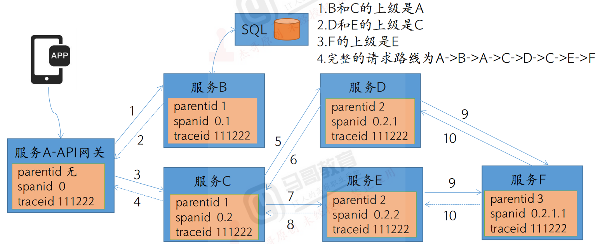
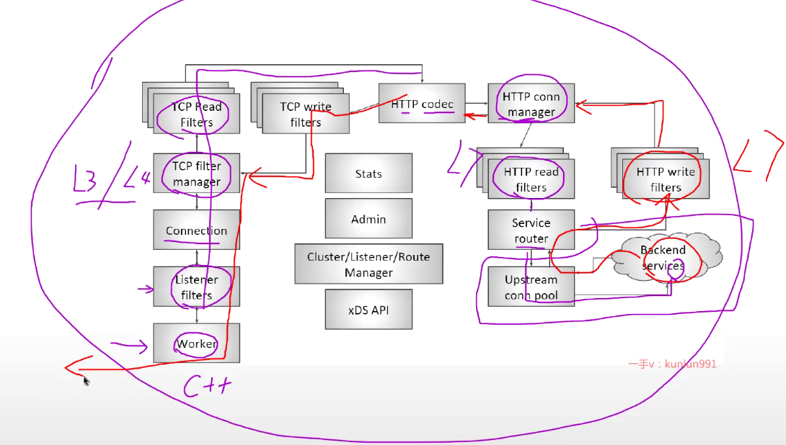
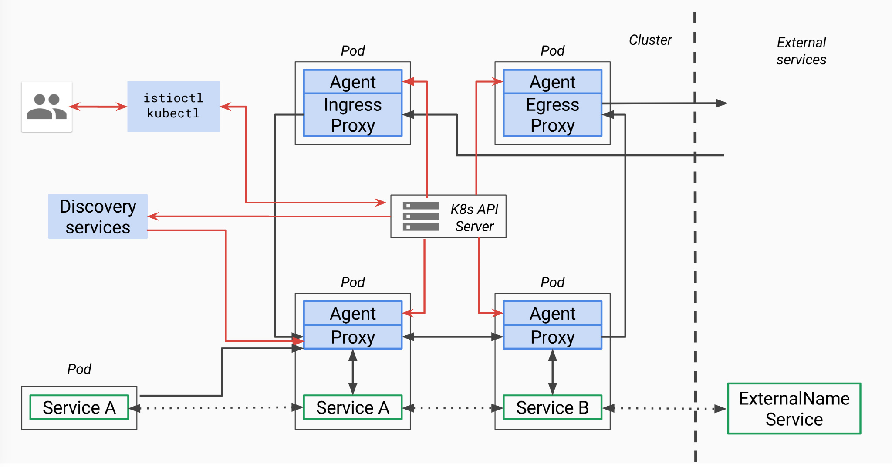
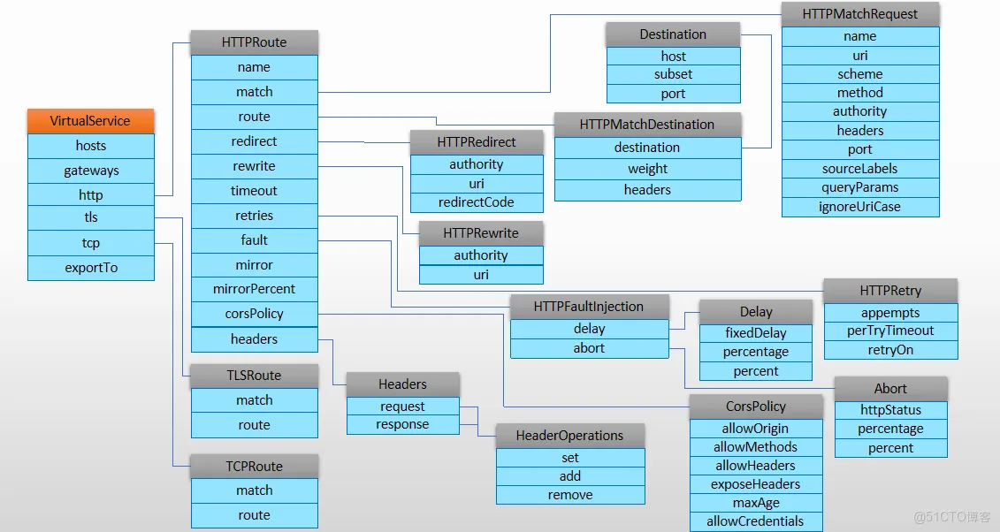
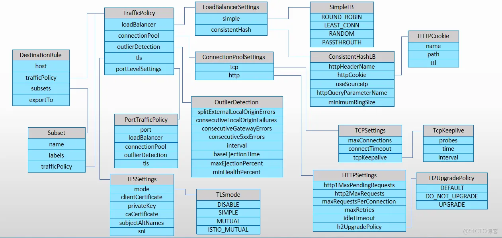
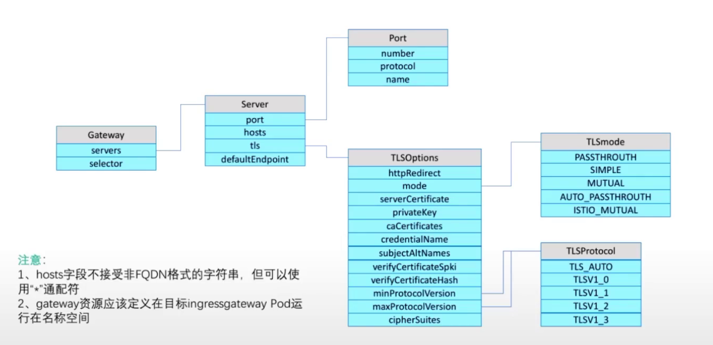
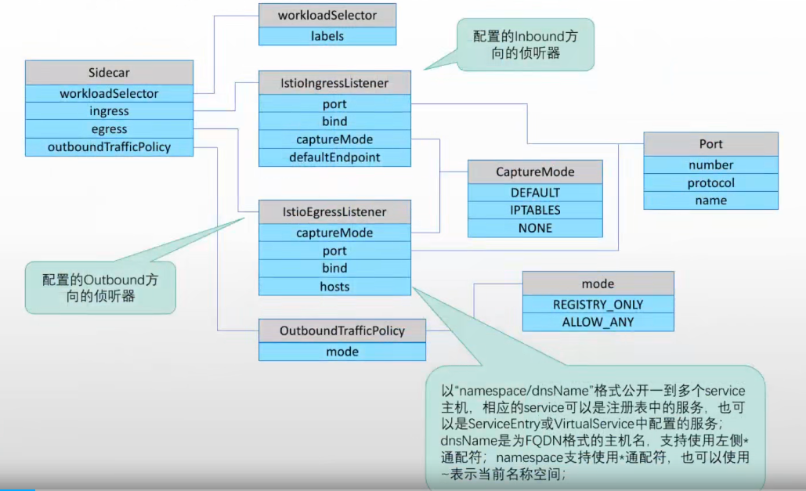
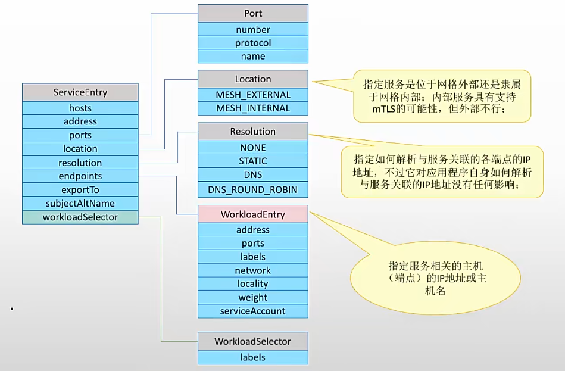
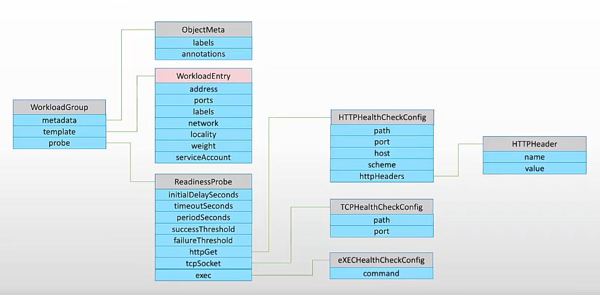

# 1.SkyWalking

https://skywalking.apache.org/downloads/

https://skywalking.apache.org/docs/

APM应用性能监控

链路追踪（Tracing）



```powershell
Trace
表示一次完整的请求链路
包含：
span：一次操作的详细记录   唯一标识/开始时间/结束时间
span_id（唯一标识 span）
parent_span_id（父调用的 span）
operation name（操作名称，例如 GET /api/user）
start_time / end_time
tags（额外属性，例如 http.status_code=200）

trace树：表示一次完整的分布式请求

Annotation（span context）：传递 Trace 信息的“身份证”，保证跨服务能找到彼此
trace_id
span_id
parent_span_id
采样标记（是否采样、调试标志）
```

```powershell
A→B   ─────────────────────────────── 500ms
  B→C        ──────────────── 300ms
     C           ────── 100ms

| Span | 总耗时 |自身处理 |下游耗时|
| ---- | ----- | ----- | ----- |
| A→B  | 500ms | 200ms | 300ms |
| B→C  | 300ms | 200ms | 100ms |
| C    | 100ms | 100ms | 0     |

TraceID: 12345
└── Span A (服务 A 入站) start=0ms, end=50ms
     ├── Span A->B (A 调用 B) start=5ms, end=30ms
     │     └── Span B 入站 start=10ms, end=25ms
     │           └── Span B->C start=12ms, end=22ms
     │                 └── Span C 入站 start=13ms, end=20ms
     └── Span A->D (如果有其他调用)

异步调用示意：
Span A 入站 ──────────────── (0-50ms)
 └─ 异步调用 B 触发 (span 不阻塞)
 
Span B 入站 ──────────────── (60-80ms) 独立 span，非子span

怎么分析
1.打开调用链（Trace）详情
找到这个接口的 TraceId
查看 火焰图 / 时间线
可以看到每个 Span 的耗时和顺序

2.分析耗时分布
父 Span 耗时：接口总耗时
子 Span 耗时：调用数据库 / 调用其他服务
自身耗时 = 父 Span 总耗时 - 子 Span 总耗时

3.定位慢点
如果子 Span耗时占大头 → 下游慢
如果子 Span耗时少 →  自身处理慢
```

## 1.1简述

功能

```powershell
1.链路追踪（Tracing）
自动收集服务间调用链路（支持 HTTP、gRPC、数据库调用等）。
展示完整调用路径、耗时分布、异常位置。

2.应用性能监控（APM Metrics）
JVM 指标（GC、线程、内存、类加载、CPU 使用率）。
服务/实例级别的吞吐量、响应时间、错误率（TPS、RT、Error Rate）。

3.服务拓扑图（Topology）
展示服务间的调用关系和流量情况，支持下钻到接口级别。

4.告警（Alarm）
指标阈值告警，例如接口 RT 超过阈值、错误率过高、GC 频繁等。

5.日志与 Trace 关联（Log + Trace）
可以将应用日志和 Trace ID 关联，便于排查问题。

6.多存储支持
默认支持 ElasticSearch、PostgreSQL、MySQL、H2 等。
大规模生产推荐用 Elasticsearch，方便横向扩展。
```

组件

```powershell
1.Agent（探针）
部署在应用进程中，负责采集链路和指标数据。
Java Agent 是最常见的，零侵入，无需修改应用代码。

2.OAP（Observability Analysis Platform）
后端核心，负责数据接收、分析、存储。
内部模块：Receiver（接收探针数据）、Analyzer（处理指标和Trace）、Storage（存储到 ES）。

3.UI（Web 界面）
提供调用链路查询、拓扑图、性能指标大盘、告警查看等功能。

4.存储（Storage）
生产常用 ElasticSearch 作为存储。
```

一些名词

```powershell
端点 (Endpoint) →最细粒度，指服务对外暴露的某个 API 或方法，比如/api/order/create。

Endpoint 的作用
1.性能分析
可以统计每个接口的 RT、QPS、错误率。

2.瓶颈排查
如果某个接口响应慢，可以直接定位到具体服务 + endpoint。

3.告警触发
可以对 endpoint 设置告警规则，比如 /api/order/create 的 RT 超过 2s 就告警。
```

## 1.2Java

```powershell
接入 Java 程序时，一般通过 启动参数 加载 SkyWalking Agent
-javaagent:/opt/skywalking/agent/skywalking-agent.jar  jar包目录
-Dskywalking.agent.service_name=my-java-service      应用服务名（区分不同微服务） 
-Dskywalking.collector.backend_service=oap-server:11800    OAP地址
```

常用配置项（`agent/config/agent.config` 或 JVM -D 参数）

| 配置项                         | 说明                                     | 示例                                  |
| ------------------------------ | ---------------------------------------- | ------------------------------------- |
| `agent.service_name`           | 应用服务名（区分不同微服务）             | `order-service`                       |
| `collector.backend_service`    | OAP 地址                                 | `oap:11800`                           |
| `agent.namespace`              | 命名空间，适合多环境区分                 | `prod`                                |
| `logging.level`                | Agent 日志级别                           | `INFO / DEBUG`                        |
| `plugin.*`                     | 插件开关，例如是否开启 Spring/Redis 插件 | `plugin.springmvc.trace_handler=true` |
| `trace.sample_rate`            | 采样率（默认 10000=100%）                | `5000` → 50%                          |
| `agent.span_limit_per_segment` | 单个 Trace Segment 中最大 Span 数        | `300`                                 |
| `agent.instance_name`          | 实例名（区分 Pod/实例）                  | `hostname-pod`                        |

SkyWalking Agent 会自动采集以下指标

```powershell
1.JVM 指标

2.服务性能指标
吞吐量 (Calls per minute, CPM/TPS)
平均响应时间 (Avg RT)
错误率 (Error %)

3.调用链路
跨服务 HTTP 调用
SpringMVC、Spring Boot Controller
Dubbo/gRPC/RabbitMQ/Kafka
数据库操作（JDBC、MyBatis、Hibernate）
Redis、Elasticsearch 调用

4.拓扑关系
服务 → 服务调用链
接口级别调用链
DB/Cache 等外部依赖节点
```

## 1.3告警规则

指标及常用告警规则

~~~powershell
SkyWalking 的告警能力其实是基于它采集到的 **链路追踪 + JVM + 指标监控** 统一体系来的。常用的告警指标可以分为几大类（请求、错误、性能、JVM/主机指标）。我帮你梳理一下常见可用于告警的维度和指标：
## 1️⃣ 请求调用相关（链路级指标）
* **Service Level（服务级）**
  * `service_resp_time`：服务平均响应时间
  * `service_sla`：服务成功率 (Success Rate)
  * `service_cpm`：每分钟调用量（Calls per minute）
  * service_percentile：p95,p99等等
* **Service Instance Level（实例级）**
  * `service_instance_resp_time`：实例平均响应时间
  * `service_instance_sla`：实例成功率
  * `service_instance_cpm`：实例调用量
  
* **Endpoint Level（接口级）**
  * `endpoint_avg_resp_time`：单接口平均响应时间
  * `endpoint_sla`：接口成功率
  * `endpoint_cpm`：接口调用量
👉 常见告警规则：
* 某个服务平均响应时间 > 200ms
* 某个接口 SLA < 95%
* QPS 过低/过高（流量异常）

## 2️⃣ JVM / 实例资源指标
SkyWalking Agent 会采集 JVM 基本运行指标：
* `instance_jvm_cpu`：CPU 使用率
* `instance_jvm_memory_heap`：堆内存使用率
* `instance_jvm_memory_nonheap`：非堆内存使用率
* `instance_jvm_gc_time`：GC 耗时
* `instance_jvm_gc_count`：GC 次数
* `instance_jvm_thread_live_count`：活动线程数
* `instance_jvm_thread_daemon_count`：守护线程数
* `instance_jvm_class_loaded_count`：加载类数
👉 常见告警规则：
* JVM 堆内存使用率 > 80%
* Full GC 次数在 1 分钟内 > 5 次
* CPU 使用率 > 85%

## 3️⃣ 数据库 / MQ / 依赖调用指标
SkyWalking 会把下游依赖（DB、Redis、MQ 等）的性能也统计出来：
* `database_resp_time`：数据库调用平均响应时间
* `database_sla`：数据库调用成功率
* `mq_resp_time`：消息队列响应时间
* `mq_sla`：消息队列成功率
👉 常见告警规则：
* DB 响应时间 > 300ms
* MQ 成功率 < 99%

## 4️⃣ 自定义指标（Metrics Extension）
* 你可以通过 **Meter API** 或 **Prometheus 接入** 把自定义指标送进 SkyWalking，然后用 OAL（Observability Analysis Language）编写规则。
* 比如：
  * 业务订单失败率
  * 缓存命中率
  * 队列积压长度
```
SkyWalking 告警指标主要分为三大块：
1. **链路调用性能指标**（响应时间、成功率、QPS）
2. **JVM/实例资源指标**（CPU、内存、GC、线程、类加载）
3. **下游依赖指标**（DB、Redis、MQ 响应时间 & 成功率）
4. **自定义业务指标**（通过 Meter API/Prometheus 接入）
~~~

在ui界面配置

在配置文件配置（要重启或重载，不太行）

在 OAP（后端）部署目录下的 `config/alarm-settings.yml` 中定义规则

```powershell
rules: # 定义rule规则
  service_cpm_rule: # 唯一的规则名称,必须以_rule结尾
    # Metrics value need to be long, double or int
    metrics-name: service_cpm # 指标名称
    op: ">" # 操作符,>, >=, <, <=, ==
    threshold: 1 # 指标阈值
    # The length of time to evaluate the metrics
    period: 2 # 评估指标的间隔周期
    # How many times after the metrics match the condition, will trigger alarm
    count: 1 # 匹配成功多少次就会触发告警
    # How many times of checks, the alarm keeps silence after alarm triggered, default as same as period.
    #silence-period: 3
    silence-period: 2 # 触发告警后的静默时间
    message: dubbo-provider service_cpm 大于1了 # 告警信息

dingtalkHooks:
  textTemplate: |-
    {
      "msgtype": "text",
      "text": {
        "content": "Apache SkyWalking Alarm: \n %s."
      }
    }
webhooks:
  - url: https://oapi.dingtalk.com/robot/send?access_token=b317849c09c2c1dcb5b426c343f696fdadb5aaf087b39144721ebdfcaee8cc83
```

# 2.ceph

稳定版本：x.2.z，中间必须是2


## 2.1功能作用及工作原理

```powershell
块存储：格式化为指定的文件系统，挂载使用
对象存储：OSS,minio

Ceph 是一个 开源的分布式存储系统，主要特点是 高可用、强扩展、去中心化。它能在普通 x86 服务器组成的集群上，提供 对象存储、块存储、文件系统 三种存储服务。
```

```powershell
好的，我来系统地帮你梳理一下 **Ceph 的功能、作用以及工作原理**。
# 🔧 Ceph 的主要功能和作用
1. **对象存储（RADOSGW, S3/Swift 兼容）**
   * 提供类似 AWS S3 的 RESTful API
   * 适合云存储、大数据、日志存储

2. **块存储（RBD, RADOS Block Device）**
   * 可作为虚拟机/容器的虚拟硬盘
   * 支持快照、克隆、动态扩展
   * 常用于 OpenStack、Kubernetes 的持久化存储

3. **文件存储（CephFS）**
   * 一个 POSIX 兼容的分布式文件系统
   * 多客户端共享访问，支持目录、权限

4. **高可用与容错**
   * 自动副本（通常 3 副本）或纠删码（EC, Erasure Coding）保证数据可靠性
   * 节点宕机时自动数据恢复

5. **高扩展性**
   * 横向扩展，只要加机器即可增加容量和吞吐量
   * 无单点瓶颈，理论上可扩展到 **PB/EB 级**
```

## 2.2核心组件

```powershell
1.MON (Monitor，监视器)
作用：
维护集群的健康状态。
存储集群的 Cluster Map（包括 OSD 列表、状态、CRUSH Map 等）。
提供集群的共识（使用 Paxos 协议）。
特点：
通常部署奇数台（3 或 5）保证 quorum。
不存储实际数据，只存元数据和状态。

2.OSD (Object Storage Daemon，对象存储守护进程)
作用：
存储实际的数据块（对象）。
负责数据复制、恢复、回填、再平衡。
特点：
每块磁盘对应一个 OSD。
集群中 OSD 数量越多，性能越好。
通过 CRUSH 算法决定数据的分布。

3.MDS (Metadata Server，元数据服务器)
作用：
为 CephFS 提供文件系统元数据服务。
处理目录结构、权限、文件名等信息。
特点：
只有在使用 CephFS 时才需要。
可部署多台，支持活动/备用模式。

4.RGW (Rados Gateway)
作用：
提供对象存储接口（兼容 S3/Swift）。
特点：
可直接对接应用程序。
不负责数据存储，只是接口层，数据仍存于 OSD。

5.客户端 (Client)
作用：
提供访问 Ceph 的方式：
RBD（块存储）
CephFS（文件存储）
RGW（对象存储）
特点：
可以是 Linux 主机挂载 CephFS。
可以是云应用通过 S3 API 调用 RGW。

6.CRUSH Map
作用：
定义数据如何在 OSD 中分布。
特点：
无需中心化管理，客户端根据 CRUSH Map 可直接定位数据。

7.Mgr (Manager)
作用：
提供集群的管理功能和性能监控。
生成和提供图形化或 API 可用的指标。
支持 Dashboard、告警、插件扩展（比如 Prometheus exporter）。
与 MON 配合提供集群状态，但不是数据存储节点。
特点：
建议至少部署 2~3 个 Mgr 节点，其中一个为 active，其余为 standby。
可保证当 active Mgr 宕机时，standby Mgr 自动接管。
```

## 2.3存储

存储文件过程

```powershell
1.计算文件到对象的映射：假如 file 为客户端要读写的文件,得到 oid(object id) = ino + ono，ino:inode number (INO), File 的元数据序列号, File 的唯一 id。ono:object number (ONO), File 切分产生的某个 object 的序号，默认以 4M 切分一个块大小。

2.通过一致性 HASH 计算 Object 到 PG，Object -> PG 映射 hash(oid) & mask-> pgid

3.通过 CRUSH 算法计算 PG 到 OSD, PG -> OSD 映射: [CRUSH(pgid)->(osd1,osd2,osd3)]

4.主OSD将对象写入到硬盘
5.主OSD数据同步给备份OSD，并等待备份OSD确认
6.主OSD返回存储结果
```

ceph对象数据的元数据信息

```powershell
RADOS中两种实现：xattrs和omap
xattrs(扩展属性)：元数据作为扩展属性
omap：bluestore与rocksdb：在OSD中划出一部分空间格式化为BlueFS用于保存元数据
```

crush算法

```powershell
Ceph 使用 CRUSH 算法来存放和管理数据，它是 Ceph 的智能数据分发机制。Ceph 使用 CRUSH 算法来准确计算数据应该被保存到哪里，以及应该从哪里读取，和保存元数据不同的是，CRUSH 按需计算出元数据，因此它就消除了对中心式的服务器/网关的需求，它使得 Ceph 客户端能够计算出元数据，该过程也称为 CRUSH 查找，然后和 OSD 直接通信。
```

## 2.4规划及部署

Ceph 分布式存储集群规划原则/目标:

```powershell
较低的 TCO (Total Cost of Ownership,总拥有成本):
使用廉价的 X86 服务器。
较高的 IOPS (Input/Output Operations Per Second,每秒可完成的读写次数):
使用 SSD/PCI-E SSD/NVMe 硬盘提高存储集群数据以提高读写性能。
较大的存储空间:
使用单块 2T/4T 或更大容量的磁盘，提高单台服务器的总空间，节省服务器总数，降低机柜使用量。
较快的网络吞吐:
使用 10G、40G、100G 或更快的光纤网络
更好的数据冗余:
数据可以以三副本机制分别保存到不同的主机，宕机 2 台也不会丢失数据。
```

服务器硬件选择：

```powershell
monitor、mgr、radosgw:
4C 8G~16G(小型，专用虚拟机)、8C 16G~32G(中型，专用虚拟机)、16C ~32C 32G~64G(大型/超大型，专用物理机)

MDS(相对配置更高一个等级)
8C 8G~16G(小型，专用虚拟机)、16C 16G~32G(中型，专用虚拟机)、32C ~64C 64G~96G(大型、超大型，物理机)

OSD 节点 CPU:
每个 OSD 进程至少有一个 CPU 核心或以上，比如服务器一共 2 颗 CPU 每个 12 核心 24 线程，那么服务器总计有 48 核心 CPU，这样最多最多可以放 48 块磁盘。

OSD 节点内存:
OSD 硬盘空间在 2T 或以内的时候每个硬盘 2G 内存，4T 的空间每个 OSD 磁盘 4G 内存，
即大约每 1T 的磁盘空间(最少)分配 1G 的内存空间做数据读写缓存。
(总内存/OSD 磁盘总空间)= X > 1G 内存
比如: (总内存 128G/36T 磁盘总空间 )= 3G/每 T > 1G 内存
```

# 3.服务网格

服务网格解决什么问题

```powershell
服务网格（Service Mesh）是一种专门用来处理服务之间通信的基础设施层。
简单说，它是微服务架构下的 “服务间通信管控平面”。

在传统单体应用中，模块间的调用就是方法调用，不需要关心网络。但在微服务中，每个服务是独立部署的，通信通过网络进行，会带来许多问题：
服务发现：怎么知道要调用的服务在哪台机器？
负载均衡：多实例下怎么分配请求？
流量管理：怎么做限流、熔断、重试？
安全：服务之间的调用如何认证与加密（mTLS）？
可观测性：如何获取调用链路、指标、日志？
这些功能本来可以写在业务代码里（比如通过 Spring Cloud、Dubbo），但这样导致 业务和基础设施逻辑耦合，开发人员要重复实现，维护困难。

服务网格的核心思路是：将这些功能抽离出来，由基础设施负责，业务代码不感知。

只需要业务开发遵循相同的接口协议，比如rpc,restful，不管是什么语言的业务代码都可以相互调用
```

实现

https://istio.io/latest/docs/setup/getting-started/

```powershell
服务网格一般分两层：
1.数据平面（Data Plane）：实际处理流量。
通常由 轻量级代理（Sidecar Proxy） 实现，比如 Envoy。
每个服务实例旁边都会运行一个代理容器，拦截所有进出流量。

2.控制平面（Control Plane）：负责管理和配置数据平面的代理。
下发路由、流量规则、安全策略。
典型实现就是 Istio。

这样，业务服务之间并不直接通信，而是通过代理通信，代理来保证流量治理、可观测性和安全。
```

## 3.1Envoy

```powershell
Envoy 本质上是一个高性能的 L4/L7 代理，常被用作 服务网格（Service Mesh） 的数据面代理，也可以单独作为 API Gateway、边车代理（sidecar）、负载均衡器使用。

nginx工作在网络边缘出入口流量，而envoy是Service Mesh 数据面的出入口流量治理

部署：自己玩的话用docker-compose或者deployment玩一玩，学完istio就直接丢弃这种玩法吧，手动用envoy去搞个服务网格是地狱级别的难度
```


```powershell
   Proxy：连接DownStream和UPStream
        DownStream：通过Listener接入请求
            关键配置：
                name、address
                filter_chains: [{}]
                    代理过滤器通常在一个Listener只配置一个； 
            针对HTTP 7层代理来说，每个Listener又可以承载一到多个Virtual Host，通过请求报文中的Host来获取请示的目标主机
                Virtual Host内部最重要的配置即为route
                    /PATH --> Cluster、Redirect、Direct Response
            
        UpStream：通过Cluster承载上游上关的配置
            关键配置：
                name, type, lb_policy
                load_assignments: [{}]

                type: STATIC, STRICT_DNS, LOGICAL_DNS, EDS 

    代理类型：
        Front/Edge Proxy: Gateway 
            Ingress Gateway
            Egress Gateway 
        Service to Service Only：Mesh
            Ingress Listeners 
            Egress Listeners 
            Egress Listeners to External (Optional)
            
1.应用不需要知道 IP/端口
通过逻辑服务名即可调用
2.Envoy 拦截端口
拦截原始 TCP/HTTP 流量，获取目标信息
3.Cluster + 服务发现
Cluster 内维护最新 endpoint（IP + Port）
Kubernetes EDS / API Server 提供服务发现
4.端口动态解析
Envoy 根据 Cluster endpoint 转发流量，即使服务端口变化也能正确发送
```


### 3.1.1常用配置（读懂就好）

请求测试

```powershell
#!/bin/bash
#
if [ $# -ne 2 ]
then
    echo "USAGE: $0 <URL> <COUNT>"
    exit 1;
fi

URL=$1
COUNT=$2
c=1
#interval="0.2"

while [[ ${c} -le ${COUNT} ]];
do
  #echo "Sending GET request: ${URL}"
  curl -o /dev/null -w '%{http_code}\n' -s ${URL} &
  (( c++ ))
#  sleep $interval
done

wait
```

#### 3.1.1.1 basic

l7简单示例：

```yaml
#通过curl 9901/clusters获取一些信息
admin:
  profile_path: /tmp/envoy.prof        #用于性能分析（CPU profile）
  access_log_path: /tmp/admin_access.log  #管理接口的访问日志
  address:
    socket_address:
       address: 0.0.0.0
       port_value: 9901

#分层运行时配置：优先级一般是：static_layer < disk_layer < admin_layer，叠加生效，同配置覆盖
layered_runtime:
  layers:
  - name: static_layer_0
    static_layer:
      health_check:
        min_interval: 5     #健康检查的最小间隔时间
#admin_layer 表示启用 Admin API 可写层，可以通过 Envoy 的 Admin 接口（默认 9901 端口）来动态修改运行时参数
  - name: admin_layer_0
    admin_layer: {}

#作用：定义一个监听器（入口）。
#监听端口：0.0.0.0:80 → 接收所有 HTTP 请求。
static_resources:
  listeners:
  - name: listener_0
    address:
      socket_address: { address: 0.0.0.0, port_value: 80 }
    filter_chains:
    #Envoy 最常用的网络过滤器，专门用来处理 HTTP/1.1、HTTP/2。
    - filters:
      - name: envoy.filters.network.http_connection_manager
        typed_config:
          #Envoy 会根据 "@type" 把这段配置解析成对应的 protobuf 对象
          #比如说这里是生成HttpConnectionManager对象
          "@type": type.googleapis.com/envoy.extensions.filters.network.http_connection_manager.v3.HttpConnectionManager
          stat_prefix: ingress_http    #统计前缀（用于 Prometheus 指标）
          codec_type: AUTO             #自动选择 HTTP/1.1 或 HTTP/2。
          route_config:                #Route 配置
            name: local_route
            virtual_hosts:
            - name: web_service_1
              domains: ["*.ik8s.io", "ik8s.io"]
              routes:
              - match: { prefix: "/" }
                route: { cluster: local_cluster }
            - name: web_service_2
              domains: ["*.magedu.com",“magedu.com"]
              routes:
              - match: { prefix: "/" }
                redirect:
                  host_redirect: "www.ik8s.io"
          #router filter：必须配置的 HTTP 过滤器，用于路由请求到 cluster，或者执行 redirect/retry 等操作。
          http_filters:
          - name: envoy.filters.http.router
            typed_config:
              "@type": type.googleapis.com/envoy.extensions.filters.http.router.v3.Router

  clusters:
  - name: local_cluster
    connect_timeout: 0.25s          #连接后端超时 0.25 秒
    type: STATIC                    #静态定义后端地址（不是从服务发现获取）
    lb_policy: ROUND_ROBIN          #轮询负载均衡
    load_assignment:
      cluster_name: local_cluster
      endpoints:
      - lb_endpoints:
        - endpoint:
            address:
              socket_address: { address: 172.31.5.11, port_value: 8080 }
        - endpoint:
            address:
              socket_address: { address: 172.31.5.12, port_value: 8080 }
```

tcp示例:

```yaml
static_resources:
  listeners:
    name: listener_0
    address:
      socket_address: { address: 0.0.0.0, port_value: 80 }
    filter_chains:
    - filters:
      - name: envoy.tcp_proxy
        typed_config:
          "@type": type.googleapis.com/envoy.extensions.filters.network.tcp_proxy.v3.TcpProxy
          stat_prefix: tcp
          cluster: local_cluster
```

echo：不用配置 Cluster、Route 就能看到效果，确认 Listener 正常工作，常用于验证 Envoy 是否能正常启动并监听端口

```powershell
static_resources:
  listeners:
  - name: listener_0
    address:
      socket_address:
        address: 0.0.0.0
        port_value: 8080
    filter_chains:
    - filters:
      - name: envoy.filters.network.echo      #echo filter
```

ingress：拦截pod入口请求，以下只拦了80端口，Istio/Linkerd 等 Service Mesh，用 iptables 把 8080 的流量重定向到 Envoy 的监听端口（15001/15006）。

```yaml
static_resources:
  listeners:
  - name: listener_0
    address:
      socket_address: { address: 0.0.0.0, port_value: 80 }
    filter_chains:
    - filters:
      - name: envoy.filters.network.http_connection_manager
        typed_config:
          "@type": type.googleapis.com/envoy.extensions.filters.network.http_connection_manager.v3.HttpConnectionManager
          stat_prefix: ingress_http
          codec_type: AUTO
          route_config:
            name: local_route
            virtual_hosts:
            - name: web_service_1
              domains: ["*"]
              routes:
              - match: { prefix: "/" }
                route: { cluster: local_cluster }
          http_filters:
          - name: envoy.filters.http.router
            typed_config:
              "@type": type.googleapis.com/envoy.extensions.filters.http.router.v3.Router

  clusters:
  - name: local_cluster
    connect_timeout: 0.25s
    type: STATIC
    lb_policy: ROUND_ROBIN
    load_assignment:
      cluster_name: local_cluster
      endpoints:
      - lb_endpoints:
        - endpoint:
            address:
              socket_address: { address: 127.0.0.1, port_value: 8080 }
```

egress：拦截流出pod的流量

```yaml
static_resources:
  listeners:
  - name: listener_0
    address:
      socket_address: { address: 127.0.0.1, port_value: 80 }
    filter_chains:
    - filters:
      - name: envoy.filters.network.http_connection_manager
        typed_config:
          "@type": type.googleapis.com/envoy.extensions.filters.network.http_connection_manager.v3.HttpConnectionManager
          stat_prefix: egress_http
          codec_type: AUTO
          route_config:
            name: local_route
            virtual_hosts:
            - name: web_service_1
              domains: ["*"]
              routes:
              - match: { prefix: "/" }
                route: { cluster: web_cluster }
          http_filters:
          - name: envoy.filters.http.router
            typed_config:
              "@type": type.googleapis.com/envoy.extensions.filters.http.router.v3.Router

  clusters:
  - name: web_cluster
    connect_timeout: 0.25s
    type: STATIC
    lb_policy: ROUND_ROBIN
    load_assignment:
      cluster_name: web_cluster
      endpoints:
      - lb_endpoints:
        - endpoint:
            address:
              socket_address: { address: 172.31.4.11, port_value: 80 }
        - endpoint:
            address:
              socket_address: { address: 172.31.4.12, port_value: 80 }
```

#### 3.1.1.2xDS

Envoy 作为前端代理+xDS动态配置管理客户端:所有 listener/cluster/route 都通过 xDS 动态下发

```powershell
xDS 统一抽象：各种资源都通过发现服务动态下发
LDS
Listener Discovery Service
下发 Listener 配置（监听端口、过滤链、入站流量规则）

RDS
Route Discovery Service
下发 路由配置（HTTP 路由规则，比如 /api → clusterA）

CDS
Cluster Discovery Service
下发 上游 Cluster 配置（服务发现结果、负载均衡策略）

EDS
Endpoint Discovery Service
下发 Cluster 的具体 Endpoint（例如某个微服务的多个 Pod IP:Port）

SDS
Secret Discovery Service
下发 证书、密钥（TLS 证书轮换、mTLS 支持）

ADS
Aggregated Discovery Service
聚合接口，Envoy 通过一个 gRPC 流同时接收 LDS/CDS/RDS/EDS/SDS 等配置，而不是分别连接多个接口。

    dynamic_resources: {
        lds_config:
            配置源（三选一）：
                path: 基于指定路径上的文件发现
                api_config_source：基于MS单独进行发现
                    特殊依赖：事先定义好MS组成的集群，该集群配置一定是静态配置的，而且为了安全，一般应该使用tls协议传输配置
                ads：基于MS发现所有类型的动态配置

        cds_config: {}
    } 
    
核心资源类型为Listener、RouteConfiguration、Cluster和ClusterLoadAssignment四个

Envoy 启动
Envoy 根据静态 Cluster xds_cluster 连接到 xds-server:18000
Envoy 向 xDS Server 注册自己节点信息（Node ID、Cluster 名）
xDS Server 根据节点信息下发 Listener/Cluster/Route 配置
Envoy 动态更新自身的路由表和 Cluster endpoints
```

GRPC

```powershell
#告诉 xDS Server “我是这个节点，我属于这个集群”，便于下发动态配置。
node:
  id: envoy_front_proxy   #Envoy 实例的唯一标识，通常用于 xDS Server 识别节点
  cluster: webcluster

admin:       #功能：通过 Admin API 可以查询 Envoy 统计信息、热重载配置、profiling 等
  profile_path: /tmp/envoy.prof
  access_log_path: /tmp/admin_access.log
  address:
    socket_address:
       address: 0.0.0.0
       port_value: 9901

dynamic_resources:
  ads_config:         #指定 Envoy 使用 gRPC 方式连接 xDS Server 获取动态配置，还可以REST方式
  #基于GRPC/REST管理服务器
    api_type: GRPC    
    transport_api_version: V3
    grpc_services: #指定 Envoy 要连接的 gRPC Cluster，这里是 xds_cluster
    - envoy_grpc:
        cluster_name: xds_cluster
    set_node_on_first_message_only: true 
  #都通过 ADS 拉取动态配置，不用 Envoy 静态配置 Cluster 或 Listener
  cds_config:      #集群动态发现
    resource_api_version: V3
    ads: {}
  lds_config:      #监听器动态发现
    resource_api_version: V3
    ads: {}

#dynamic_resources:
#  lds_config:
#    resource_api_version: V3
#    api_config_source:
#      api_type: GRPC
#      transport_api_version: V3
#      grpc_services:
#      - envoy_grpc:
#          cluster_name: xds_cluster
#
#  cds_config:
#    resource_api_version: V3
#    api_config_source:
#      api_type: GRPC
#      transport_api_version: V3
#      grpc_services:
#      - envoy_grpc:
#          cluster_name: xds_cluster

static_resources:
  clusters:
  - name: xds_cluster   #Envoy 静态定义的 Cluster，用来连接 xDS Server
    connect_timeout: 0.25s
    type: STRICT_DNS
    # The extension_protocol_options field is used to provide extension-specific protocol options for upstream connections. 
    typed_extension_protocol_options:
      envoy.extensions.upstreams.http.v3.HttpProtocolOptions:
        "@type": type.googleapis.com/envoy.extensions.upstreams.http.v3.HttpProtocolOptions
        explicit_http_config:
          http2_protocol_options: {}
    lb_policy: ROUND_ROBIN
    load_assignment:
      cluster_name: xds_cluster
      endpoints:
      - lb_endpoints:
        - endpoint:
            address:
              socket_address:
                address: xdsserver
                port_value: 18000
```

基于指定路径的文件发现，EDS端点发现案例

```yaml
---eds.yaml----------------------------
version_info: '2'
resources:
- "@type": type.googleapis.com/envoy.config.endpoint.v3.ClusterLoadAssignment
  cluster_name: webcluster
  endpoints:
  - lb_endpoints:
    - endpoint:
        address:
          socket_address:
            address: 172.31.11.11
            port_value: 80
    - endpoint:
        address:
          socket_address:
            address: 172.31.11.12
            port_value: 80
            
---front-envoy.yaml---------
node:
  id: envoy_front_proxy
  cluster: MageEdu_Cluster

admin:
  profile_path: /tmp/envoy.prof
  access_log_path: /tmp/admin_access.log
  address:
    socket_address:
       address: 0.0.0.0
       port_value: 9901

static_resources:
  listeners:
  - name: listener_0
    address:
      socket_address: { address: 0.0.0.0, port_value: 80 }
    filter_chains:
    - filters:
      - name: envoy.filters.network.http_connection_manager
        typed_config:
          "@type": type.googleapis.com/envoy.extensions.filters.network.http_connection_manager.v3.HttpConnectionManager
          stat_prefix: ingress_http
          codec_type: AUTO
          route_config:
            name: local_route
            virtual_hosts:
            - name: web_service_01
              domains: ["*"]
              routes:
              - match: { prefix: "/" }
                route: { cluster: webcluster }
          http_filters:
          - name: envoy.filters.http.router
            typed_config:
              "@type": type.googleapis.com/envoy.extensions.filters.http.router.v3.Router

  clusters:
  - name: webcluster
    connect_timeout: 0.25s
    type: EDS
    lb_policy: ROUND_ROBIN
    eds_cluster_config:
      service_name: webcluster
      eds_config:
        path: '/etc/envoy/eds.conf.d/eds.yaml'
```

cds,lds

```yaml
---cds.yaml
resources:
- "@type": type.googleapis.com/envoy.config.cluster.v3.Cluster
  name: webcluster
  connect_timeout: 1s
  type: STRICT_DNS
  load_assignment:
    cluster_name: webcluster
    endpoints:
    - lb_endpoints:
      - endpoint:
          address:
            socket_address:
              address: webserver01
              port_value: 80
      - endpoint:
          address:
            socket_address:
              address: webserver02
              port_value: 80
---lds.yaml
resources:
- "@type": type.googleapis.com/envoy.config.listener.v3.Listener
  name: listener_http
  address:
    socket_address: { address: 0.0.0.0, port_value: 80 }
  filter_chains:
  - filters:
      name: envoy.http_connection_manager
      typed_config:
        "@type": type.googleapis.com/envoy.extensions.filters.network.http_connection_manager.v3.HttpConnectionManager
        stat_prefix: ingress_http
        route_config:
          name: local_route
          virtual_hosts:
          - name: local_service
            domains: ["*"]
            routes:
            - match:
                prefix: "/"
              route:
                cluster: webcluster
          http_filters:
          - name: envoy.filters.http.router
            typed_config:
              "@type": type.googleapis.com/envoy.extensions.filters.http.router.v3.Router
              
---front-envoy
node:
  id: envoy_front_proxy
  cluster: MageEdu_Cluster

admin:
  profile_path: /tmp/envoy.prof
  access_log_path: /tmp/admin_access.log
  address:
    socket_address:
       address: 0.0.0.0
       port_value: 9901

dynamic_resources:
  lds_config:
    path: /etc/envoy/conf.d/lds.yaml
  cds_config:
    path: /etc/envoy/conf.d/cds.yaml
```

#### 3.1.1.3健康检查

```powershell
健康检查：类比 K8s 的 livenessProbe，只不过这里是 Envoy 对上游服务的健康探测，而不是 kubelet 对容器的探测。
    集群上未定义健康状态检测机制时：
        每个端点，初始即为健康，且一直被视作健康
        此时至少应该打开异常值探测
            根据客户端与被代理上游端点之间的通信流量来判定端点健康状态
                临时地判定为不健康，临时驱逐该端点
                过后会再次自动添加回来
                    若仍然不健康，会再次被驱逐，驱逐时长会成倍增加
            判定标准有多类
            驱逐操作是有条件的
                驱逐的功能激活通常有处于健康状态的端点的比例要求
                
如果健康节点 < 50% → Envoy 进入 panic mode
忽略节点健康状态，把请求 发送给所有节点，即使有节点标记为不可用
目的是保证服务 尽量可用，避免彻底宕机
```

健康检查

```powershell
health_checks:
- timeout: 5s                # 单次健康检查的超时时间，超过 5 秒没响应就算失败
  interval: 10s              # 健康检查的间隔，每 10 秒检查一次
  unhealthy_threshold: 2     # 连续 2 次失败，认为该实例不健康
  healthy_threshold: 2       # 连续 2 次成功，认为该实例恢复健康
  http_health_check:
    path: /livez             # 用 HTTP GET /livez 作为探测请求
    expected_statuses:
      start: 200             # 期望返回状态码区间起始值
      end: 399               # 期望返回状态码区间结束值（含头不含尾）
    outlier_detection:
      consecutive_5xx: 3     #连续三次5xx
      base_ejection_time: 10s   #弹出
      max_ejection_percent: 10  #最大弹出比例


  #tcp_health_check: {}          # TCP 检查：只要能握手成功就算健康
  #grpc_health_check:
    #service_name: my.grpc.Service   # gRPC 服务名
  #redis_health_check: {}   # 发 PING，看能否正常返回 PONG
```

#### 3.1.1.4负载均衡

```powershell
优先级
priority：整型，值越小优先级越高。
0 → 主节点（primary）
1、2 → 后备节点（secondary/backup）
Envoy 会优先把请求发送给 最低 priority 的节点，只有当这些节点不可用时，才会降级到高 priority 的节点。

负载均衡器子集(Subset)
Envoy 在普通负载均衡基础上的扩展，用于根据 主机的元数据（metadata）进行分组选择
Envoy 允许给上游主机设置 metadata 标签（比如版本、机房、类型等）。
子集负载均衡可以按这些标签筛选出一组主机（subset），再在子集内做负载均衡。
实现效果类似 按条件路由 + 权重调度，支持灰度发布、分区流量等。

子集 LB = 动态、灵活、少 cluster
普通路由 = 静态、简单、每个版本 cluster 独立
如果版本少且不频繁变化，普通路由即可。
如果版本多、节点动态，或者希望灰度/按 region 分流，子集 LB 更合适

配置了子集，但路由并未指定元数据或不存在与指定元数据匹配的子集时，则子集均衡均衡
器为其应用“回退策略”
◼ NO_FALLBACK：请求失败，类似集群中不存在任何主机；此为默认策略；
◼ ANY_ENDPOINT：在所有主机间进行调度，不再考虑主机元数据；
◼ DEFAULT_SUBSET：调度至默认的子集，该子集需要事先定义；

全局负载均衡与分布式负载均衡
    全局负载均衡：
        将端点按位置分组，在各组之间分配流量
            分组条件：Region、Zone、Sub_Zone
        组上附加的属性：
            Priority：优先级
            Weight：权重
        将各后端端点：动态分组，称为子集
            自定义分组，而不再是固定的基于位置的定义
            流量在多个子集之间分布
            适用场景：Service仅负责帮助完成服务发现
                v1
                v2
        区域感知的负载均衡

    分布式负载均衡：
        负载均衡算法：
            RANDOM、ROUND_ROBIN、LEAST_REQUEST
            RING_HASH、MAGLEV
        区域感知的负载均衡
```


| 算法名称     | Envoy 配置名    | 特点                                           | 适用场景                                     |
| ------------ | --------------- | ---------------------------------------------- | -------------------------------------------- |
| 加权轮询     | ROUND_ROBIN     | 按顺序轮流分发请求，可根据权重调整             | 请求耗时均匀，简单负载均衡场景               |
| 加权最少请求 | LEAST_REQUEST   | 优先发送到当前活跃请求最少的主机，可结合权重   | 请求耗时差异大，需要动态负载均衡             |
| 环哈希       | RING_HASH       | 类似一致性哈希，变动主机影响小                 | 会话保持、分布式缓存、需要请求稳定映射的场景 |
| 磁悬浮哈希   | MAGLEV          | 哈希环固定大小 65537，确保每个主机至少映射一次 | 会话保持、稳定负载分配，环哈希升级版         |
| 随机         | RANDOM          | 随机选择主机，未配置健康检查时比轮询更好       | 轻量级负载均衡，快速实现                     |
| 原始目标     | ORIGINAL_DST_LB | 请求直接转发到原始目标地址                     | 原始目标集群调度，仅限特定场景               |

加权最少请求

```yaml
  clusters:
  - name: web_cluster_01
    connect_timeout: 0.25s
    type: STRICT_DNS
    lb_policy: LEAST_REQUEST
    load_assignment:
      cluster_name: web_cluster_01
      endpoints:
      - lb_endpoints:
        - endpoint:
            address:
              socket_address:
                address: red
                port_value: 80
          load_balancing_weight: 1
        - endpoint:
            address:
              socket_address:
                address: blue
                port_value: 80
          load_balancing_weight: 3
        - endpoint:
            address:
              socket_address:
                address: green
                port_value: 80
          load_balancing_weight: 5
```

位置加权

```yaml
  clusters:
  - name: webcluster1
    connect_timeout: 0.25s
    type: STRICT_DNS
    lb_policy: ROUND_ROBIN
    http2_protocol_options: {}
    load_assignment:
      cluster_name: webcluster1
      policy:
        overprovisioning_factor: 140   #负载过量因子，就是认为自己能承载140%的流量，出故障到一定程度时才会把流量给低优先级的主机，10*100=1000,7*140=980，损失三台才降级
      endpoints:
      - locality:
          region: cn-north-1               ##区域
        priority: 0
        load_balancing_weight: 10
        lb_endpoints:
        - endpoint:
            address:
              socket_address: { address: webservice1, port_value: 80 }
      - locality:
          region: cn-north-2
        priority: 0
        load_balancing_weight: 20
        lb_endpoints:
        - endpoint:
            address:
              socket_address: { address: webservice2, port_value: 80 }
```

ring hash

```yaml
static_resources:
  listeners:
  - name: listener_0
    address:
      socket_address: { address: 0.0.0.0, port_value: 80 }
    filter_chains:
    - filters:
      - name: envoy.filters.network.http_connection_manager
        typed_config:
          "@type": type.googleapis.com/envoy.extensions.filters.network.http_connection_manager.v3.HttpConnectionManager
          stat_prefix: ingress_http
          codec_type: AUTO
          route_config:
            name: local_route
            virtual_hosts:
            - name: webservice
              domains: ["*"]
              routes:
              - match: { prefix: "/" }
                route:
                  cluster: web_cluster_01
                  hash_policy:             ####指明要hash的内容
                  # - connection_properties:
                  #     source_ip: true
                  - header:
                      header_name: User-Agent
          http_filters:
          - name: envoy.filters.http.router
            typed_config:
              "@type": type.googleapis.com/envoy.extensions.filters.http.router.v3.Router  
  
  clusters:
  - name: web_cluster_01
    connect_timeout: 0.5s
    type: STRICT_DNS
    lb_policy: RING_HASH
    ring_hash_lb_config:
      maximum_ring_size: 1048576   ##槽位
      minimum_ring_size: 512
    load_assignment:
      cluster_name: web_cluster_01
      endpoints:
      - lb_endpoints:
        - endpoint:
            address:
              socket_address:
                address: myservice
                port_value: 80
                
#环 = 一个连续的哈希空间（0 到 N-1），就像一个圆环。
#每个节点（服务器）会被映射到环上的若干点（虚拟节点）。
#请求通过哈希计算（例如 URL、用户 ID、Cookie）得到一个哈希值，然后顺时针找到环上最近的节点，就是该请求要发送的服务器。
```

负载均衡子集

```yaml
static_resources:
  listeners:
  - address:
      socket_address: { address: 0.0.0.0, port_value: 80 }
    name: listener_http
    filter_chains:
    - filters:
    #使用 HTTP Connection Manager 处理流量，进行路由匹配。
      - name: envoy.filters.network.http_connection_manager
        typed_config:
          "@type": type.googleapis.com/envoy.extensions.filters.network.http_connection_manager.v3.HttpConnectionManager
          codec_type: auto
          stat_prefix: ingress_http
          route_config:
            name: local_route
            virtual_hosts:
            - name: backend
              domains:
              - "*"
              routes:
              - match:
                  prefix: "/"
                  headers:         #规则 1：按 header x-custom-version
                  - name: x-custom-version 
                    exact_match: pre-release
                    #请求头里带 x-custom-version: pre-release 的流量 → 转到 webcluster1 中 版本 1.2-pre 且 stage=dev 的子集
                route:
                  cluster: webcluster1
                  metadata_match:
                    filter_metadata:
                      envoy.lb:
                        version: "1.2-pre"
                        stage: "dev"
              - match:
                  prefix: "/"
                  headers:  #规则 2：按 header x-hardware-test
                  - name: x-hardware-test
                    exact_match: memory
              #请求头里带 x-hardware-test: memory → 转到 prod 环境的 bigmem 节点。
                route:
                  cluster: webcluster1
                  metadata_match:
                    filter_metadata:
                      envoy.lb:
                        type: "bigmem"
                        stage: "prod"
              - match:      #规则 3：默认 (加权分流)：没有特定 header，就按权重分流
                  prefix: "/"
                route:
                  weighted_clusters:
                    clusters:
                    - name: webcluster1
                      weight: 90
                      metadata_match:
                        filter_metadata:
                          envoy.lb:
                            version: "1.0"
                    - name: webcluster1
                      weight: 10
                      metadata_match:
                        filter_metadata:
                          envoy.lb:
                            version: "1.1"
                  metadata_match:
                    filter_metadata:
                      envoy.lb:
                        stage: "prod"
          http_filters:
          - name: envoy.filters.http.router
            typed_config:
              "@type": type.googleapis.com/envoy.extensions.filters.http.router.v3.Router

  clusters:
  - name: webcluster1
    connect_timeout: 0.5s
    type: STRICT_DNS            #通过 DNS 解析成员地址
    lb_policy: ROUND_ROBIN
    load_assignment:
      cluster_name: webcluster1
      endpoints:
      - lb_endpoints:
        - endpoint:
            address:
              socket_address:
                address: e1
                port_value: 80
          metadata:               #给每一个endpoint带上metadata
            filter_metadata:
              envoy.lb:
                stage: "prod"
                version: "1.0"
                type: "std"
                xlarge: true
        - endpoint:
            address:
              socket_address:
                address: e2
                port_value: 80
          metadata:
            filter_metadata:
              envoy.lb:
                stage: "prod"
                version: "1.0"
                type: "std"
        - endpoint:
            address:
              socket_address:
                address: e3
                port_value: 80
          metadata:
            filter_metadata:
              envoy.lb:
                stage: "prod"
                version: "1.1"
                type: "std"
        - endpoint:
            address:
              socket_address:
                address: e4
                port_value: 80
          metadata:
            filter_metadata:
              envoy.lb:
                stage: "prod"
                version: "1.1"
                type: "std"
        - endpoint:
            address:
              socket_address:
                address: e5
                port_value: 80
          metadata:
            filter_metadata:
              envoy.lb:
                stage: "prod"
                version: "1.0"
                type: "bigmem"
        - endpoint:
            address:
              socket_address:
                address: e6
                port_value: 80
          metadata:
            filter_metadata:
              envoy.lb:
                stage: "prod"
                version: "1.1"
                type: "bigmem"
        - endpoint:
            address:
              socket_address:
                address: e7
                port_value: 80
          metadata:
            filter_metadata:
              envoy.lb:
                stage: "dev"
                version: "1.2-pre"
                type: "std"
    lb_subset_config:
      fallback_policy: DEFAULT_SUBSET   #如果子集选择器找不到，就默认子集
      default_subset:            #默认子集
        stage: "prod"
        version: "1.0"
        type: "std"
      subset_selectors:    #子集选择器
      - keys: ["stage", "type"]
      - keys: ["stage", "version"]
      - keys: ["version"]
      - keys: ["xlarge", "version"]
      
```

```powershell
假设用户请求头命中第三条路由：
这会生成两个候选子集：
子集1：stage=prod, version=1.0
子集2：stage=prod, version=1.1

Envoy 会：
在 subset_selectors 里找是否允许 stage+version → ✅ 存在
子集1 → 命中 e1, e2
子集2 → 命中 e3, e4
按权重 90:10 把流量打到这两个子集
```

#### 3.1.1.5熔断

```powershell
熔断（Circuit Breaker）是分布式系统中一种 容错保护机制。
当上游服务出现大量错误（比如超时、连接失败、请求错误）时，熔断器会“断开”，让调用方 立即失败而不是继续等待。熔断可以防止问题扩散，避免整个系统雪崩，雪崩是上游服务反压下游服务导致下游服务也挂了。

熔断器circuit breaker一般有 3 种状态：
Closed（关闭）
正常状态，请求正常转发。
统计失败率，如果失败率达到阈值，进入 Open 状态。
Open（打开）
熔断状态，所有请求立即失败，不再调用上游服务。
避免无效的重试请求进一步压垮下游。
Half-Open（半开）
经过一段冷却时间，熔断器会让部分请求试探性地放行。
如果请求成功率高，切回 Closed；如果继续失败，保持 Open。

频繁触发熔断会导致反压调度服务器，导致调度服务器压力过大，如果是非关键服务可以降级，关键服务进行限流（弹性扩容速度小于流量速度），由消息队列削峰填谷。

连接池
   连接管理器

可使用工具fortio进行压力测试，例如
fortio load -c 2 -qps 0 -n 20 -loglevel Warning URL
-c 并发数  
QPS（每秒请求数）限制 = 0，表示 不限制速率，尽可能快地发请求。
-n 20  请求总数 = 20。
-loglevel Warning URL  日志级别。目标地址
项目地址：https://github.com/fortio/fortio
```

关于上下游

```powershell
服务网格/熔断视角 (从服务自身看):
服务B 说：“服务C 是我的上游，因为我调用它。”（这里的“上游”指“我依赖的服务”）
这种定义强调依赖关系：我（下游）依赖你（上游）。
链路追踪视角 (从请求流动看):
服务B 说：“服务A 是我的上游（请求来源），服务C 是我的下游（请求去向）。”
这种定义强调数据流方向：请求从上游来，向下游去。
```

```powershell
  clusters:
  - name: webcluster1
    connect_timeout: 0.25s
    type: STRICT_DNS
    lb_policy: ROUND_ROBIN
    load_assignment:
      cluster_name: webcluster1
      endpoints:
      - lb_endpoints:
        - endpoint:
            address:
              socket_address:
                address: webservice1
                port_value: 80
    #连接级别的熔断（Circuit Breakers），设这么小是为了测试出效果
    #这里的 熔断器（Circuit Breaker） 主要是 调用方侧（Envoy → upstream）对资源的保护，限制自己对下游的调用压力，防止调用方因为下游慢或不可用而被拖垮。避免连接数过多，撑爆 Envoy 的线程/内存。避免请求无限排队，导致请求堆积雪崩。避免疯狂重试，把自己也搞挂
    circuit_breakers:
      thresholds:              #下面是连接池配置和熔断器配置
        max_connections: 1      #同时最多只能和这个 cluster 建立 1 个并发连接
        max_pending_requests: 1  #最多允许挂起 1 个，超过就拒绝。
        max_retries: 3  #每个请求最多尝试 3 次重试，超过就失败，不会无限重试
    #这种属于硬性并发控制，防止短时间内太多请求把服务压爆

  - name: webcluster2
    connect_timeout: 0.25s
    type: STRICT_DNS
    lb_policy: ROUND_ROBIN
    load_assignment:
      cluster_name: webcluster2
      endpoints:
      - lb_endpoints:
        - endpoint:
            address:
              socket_address:
                address: webservice2
                port_value: 80
    #把不健康的下游实例剔除，避免继续路由过去。
    outlier_detection:
      interval: "1s"
      consecutive_5xx: "3"
      consecutive_gateway_failure: "3"
      base_ejection_time: "10s"          #被踢出的实例至少休息 10 秒，再尝试恢复
      enforcing_consecutive_gateway_failure: "100"
      max_ejection_percent: "30"   #最多只能剔除 30% 的实例，避免全踢光导致雪崩
      success_rate_minimum_hosts: "2" #至少有 2 个实例时，才启用基于成功率的判定
```

#### 3.1.1.6http流量治理



```powershell
路由匹配：精确匹配写在上面，自上而下，最后再+默认匹配。先按上下顺序后按精确性
先匹配精准，再左通配->右通配->*

路由目标之一：路由到指定集群:cluster,cluster_header,weighted_clusters...
路由目标之二：重定向:协议重定向/主机重定向/端口重定向/路径重定向...
路由目标之三：直接响应请求:
{
"status": "...",
"body": "{...}"
}

灰度发布：金丝雀/蓝绿/AB测试/流量镜像
灰度策略：“基于请求内容发布”（cookie或header）和“基于流量比例发布”两种类型
实施方式：
1.基于负载均衡器进行灰度发布:仅支持对入口服务进行灰度，无法支撑后端服务需求
2.基于Kubernetes进行灰度发布:根据新旧版本应用所在的Pod数量比例进行流量分配
3.基于服务网格进行灰度发布：通过控制平面，将流量配置策略分发至对目标服务的请求发起方的envoy sidecar上即可

流量迁移和流量分割，感觉差不多的意思，就是配置不一样

流量镜像/流量复制/影子镜像：类似于全链路测试的影子环境（生产环境隔做离测试生产环境的瓶颈），也可以说是影子镜像，将同样的请求再做一次转发到影子环境中。
```

流量迁移

```yaml
curl -XPOST 'http://front_envop_ip:admin_port/runtime_modify?routing.traffic_shift.demoapp=90'

---
admin:
  profile_path: /tmp/envoy.prof
  access_log_path: /tmp/admin_access.log
  address:
    socket_address:
       address: 0.0.0.0
       port_value: 9901

layered_runtime:
  layers:
  - name: admin
    admin_layer: {}
       
static_resources:
  listeners:
  - name: listener_0
    address:
      socket_address: { address: 0.0.0.0, port_value: 80 }
    filter_chains:
    - filters:
      - name: envoy.filters.network.http_connection_manager
        typed_config:
          "@type": type.googleapis.com/envoy.extensions.filters.network.http_connection_manager.v3.HttpConnectionManager
          stat_prefix: ingress_http
          codec_type: AUTO
          route_config:
            name: local_route
            virtual_hosts:
            - name: demoapp
              domains: ["*"]
              routes:
              - match:
                  prefix: "/"
                  #用户再通过不断地通过Envoy的admin接口修改runtime_fraction对象的值完成流量迁移
                  runtime_fraction:
                    default_value:
                      numerator: 100
                      denominator: HUNDRED
                    runtime_key: routing.traffic_shift.demoapp
                route:
                  cluster: demoappv10
              - match:
                  prefix: "/"
                route:
                  cluster: demoappv11
          http_filters:
          - name: envoy.filters.http.router
            typed_config:
              "@type": type.googleapis.com/envoy.extensions.filters.http.router.v3.Router
```

流量分割

```yaml
curl -XPOST 'http://172.31.57.10:9901/runtime_modify?routing.traffic_split.demoapp.demoappv10=0&routing.traffic_split.demoapp.demoappv11=100'
---

          route_config:
            name: local_route
            virtual_hosts:
            - name: demoapp
              domains: ["*"]
              routes:
              - match:
                  prefix: "/"
                route:
                  weighted_clusters:
                    clusters:
                    - name: demoappv10
                      weight: 100
                    - name: demoappv11
                      weight: 0
                    total_weight: 100
                    runtime_key_prefix: routing.traffic_split.demoapp
```

流量镜像:可以相同版本也可以不同版本，看需求

```powershell
curl -XPOST 'http://172.31.60.10:9901/runtime_modify?routing.request_mirror.demoapp=100'
---
          route_config:
            name: local_route
            virtual_hosts:
            - name: demoapp
              domains: ["*"]
              routes:
              - match:
                  prefix: "/"
                route:
                  cluster: demoappv10
                  request_mirror_policies:      ##流量镜像
                  - cluster: demoappv11
                    runtime_fraction:
                      default_value:
                        numerator: 20         ##分子
                        denominator: HUNDRED    ###分母
                      runtime_key: routing.request_mirror.demoapp
```

#### 3.1.1.7服务韧性

```powershell
故障注入：算是混沌工程的子集
故障注入的目的，是为了模拟上游不稳定、网络延迟或服务错误，从而测试调用方应用的 超时、重试、熔断、降级等容错逻辑。
Abort 注入：Envoy 会拦截并直接返回 5xx，不会把流量真正发到 B。
Delay 注入：Envoy 会先延迟一段时间再转发请求给 B。

超时重试：避免请求无限等待，在短暂故障下增加请求成功率
超时可以触发 重试、降级、熔断，让系统快速恢复或切换备用逻辑。

跨域：协议 + 域名 + 端口，三个要素中任意一个不同，就算跨域
http://example.com:80 -> https://example.com:443 是跨域（协议不同）
CORS（Cross-Origin Resource Sharing）（跨域资源共享）：
允许前端浏览器跨域访问 API
与浏览器的 CORS 机制配合，实现安全的跨域资源共享
配置在 Envoy 上，可以统一管理网关级的跨域策略

整个请求链只要有一处没开启cors，就=没开启cors，路由cors会覆盖虚拟主机cors配置，都是包含关系，就像公司大门->楼门->办公室
```

```yaml
  listeners:
  - name: listener_0
    address:
      socket_address:
        address: 0.0.0.0
        port_value: 10000
    filter_chains:
    - filters:
      - name: envoy.filters.network.http_connection_manager
        typed_config:
          "@type": type.googleapis.com/envoy.extensions.filters.network.http_connection_manager.v3.HttpConnectionManager
          stat_prefix: ingress_http
          codec_type: AUTO
          route_config:
            name: local_route
            virtual_hosts:
            - name: backend
              domains: ["*"]
              routes:
              - match:
                  prefix: "/"          # 匹配所有请求
                route:
                  cluster: service_backend
                  timeout: 3s          # 整个请求超时（默认 15s）
                  idle_timeout: 10s    # 空闲连接超时
                  retry_policy:
                    retry_on: "5xx,gateway-error,connect-failure,reset" # 哪些情况触发重试
                    num_retries: 3           # 最多重试 3 次
                    per_try_timeout: 1s      # 每次重试超时
                    host_selection_retry_max_attempts: 3
          http_filters:
          - name: envoy.filters.http.fault   # 故障注入过滤器
            typed_config:
              "@type": type.googleapis.com/envoy.extensions.filters.http.fault.v3.HTTPFault
              delay:                         # 注入延迟
                fixed_delay: 2s              # 固定延迟 2 秒
                percentage:
                  numerator: 50              # 50% 请求延迟
                  denominator: HUNDRED
              abort:                         # 注入错误
                http_status: 503             # 返回 503 错误
                percentage:
                  numerator: 10              # 10% 请求直接失败
                  denominator: HUNDRED
          - name: envoy.filters.http.router  # 路由过滤器（必须有）
          
---
客户端 A
   |
   | 发起请求
   v
Envoy Sidecar (调用方，egress)
   |
   |--- 故障注入检查 ---
   |     ├─ 10% Abort → 直接返回 503
   |     └─ 50% Delay → 等待 2s 再转发
   |
   |--- 转发请求到后端 ---
   v
后端服务 B
   |
   | 处理请求
   v
Envoy Sidecar (返回路径)
   |
   | 超时检查：per_try_timeout=1s, timeout=3s
   | 如果超时，且 retry_on 命中 → 重试最多 3 次
   |
   | 返回响应或最终错误
   v
客户端 A
```

CORS：网络必须一层一层都有cors

```yaml
listeners:
- address:
    socket_address:
      address: 0.0.0.0
      port_value: 80                # Envoy 监听 80 端口，接收客户端请求
  filter_chains:
  - filters:
    - name: envoy.http_connection_manager
      typed_config:
        "@type": type.googleapis.com/envoy.config.filter.network.http_connection_manager.v2.HttpConnectionManager
        codec_type: auto
        stat_prefix: ingress_http
        access_log:
          - name: envoy.file_access_log
            typed_config:
              "@type": type.googleapis.com/envoy.config.accesslog.v2.FileAccessLog
              path: "/var/log/access.log"  # 请求日志存放位置
        route_config:
          name: local_route
          virtual_hosts:
          - name: www
            domains:
            - "*"                        # 匹配所有域名
            cors:                        # 🌟 虚拟主机级别 CORS 配置
              allow_origin:
              - "*"                        # 允许任意来源
              allow_methods: "GET"         # 允许的 HTTP 方法
              filter_enabled:               # 是否开启 CORS
                default_value:
                  numerator: 100
                  denominator: HUNDRED     # 默认 100% 开启
                runtime_key: cors.www.enabled
              shadow_enabled:               # 是否影子模式（仅记录不生效）
                default_value:
                  numerator: 0
                  denominator: HUNDRED
                runtime_key: cors.www.shadow_enabled
            routes:                         # 🌟 路由配置
            - match:
                prefix: "/cors/open"
              route:
                cluster: backend_service    # 继承虚拟主机 CORS
            - match:
                prefix: "/cors/disabled"
              route:
                cluster: backend_service
                cors:
                  filter_enabled:           # 路由级别关闭 CORS
                    default_value:
                      numerator: 0
                      denominator: HUNDRED
            - match:
                prefix: "/cors/restricted"
              route:
                cluster: backend_service
                cors:                       # 路由级别覆盖虚拟主机
                  allow_origin:
                  - "envoyproxy.io"        # 只允许特定来源
                  allow_methods: "GET"
            - match:
                prefix: "/"
              route:
                cluster: backend_service   # 默认路由，继承虚拟主机 CORS
        http_filters:
        - name: envoy.cors               # 🌟 CORS 过滤器
          typed_config: {}               # 使用默认行为
                                          # 根据路由/虚拟主机配置决定是否在响应头注入 Access-Control-Allow-*
        - name: envoy.router             # 路由过滤器，转发请求到 cluster
          typed_config: {}
```

#### 3.1.1.8可观测性

```powershell
Envoy stats：Envoy 内部会收集各种指标，包括：
请求数、请求延迟、响应状态码分布
集群健康状态、连接数、重试次数等

Sink：将这些指标发送到外部监控系统,推给exporter,prom再拉

StatsD Sink 就是 将 Envoy 统计信息发送到 StatsD 系统 的接口

StatsD Exporter：上下游请求指标，连接数指标，中断，重试，健康等（如果是servicemesh，基本是sidecar/daemonset）
access_log：filebeat收集（一般是daemonset）

分布式链路跟踪：
顶层 tracing → 必须配置（否则没 trace）。
Filter tracing → 可选，用于精细化控制。
注意:
只需要跨服务请求链路 → Envoy tracing 就够了，不用加 Java agent。
需要应用内部方法级调用链 → 还需要 skywalking-agent.jar。

Envoy 处理追踪的步骤
当 Envoy 作为 sidecar 收到请求时，追踪逻辑是这样的：
1️⃣ 入站请求（Client → Envoy → App）
Envoy 接收请求，检查 HTTP Headers 中是否有 Trace 上下文（不同后端用不同 header，例如：
Zipkin/Jaeger: x-b3-traceid, x-b3-spanid, x-b3-sampled
W3C Trace Context: traceparent
SkyWalking: sw8
如果 有追踪上下文：Envoy 复用该 Trace ID。
如果 没有上下文：Envoy 会 生成一个新的 Trace ID / Span ID，并打上采样标记。
Envoy 把 header 转发给应用（App A），让应用也能感知 trace（如果应用有接入 agent，例如 SkyWalking Agent）。
2️⃣ 出站请求（App → Envoy → 下游 Service）
当应用调用下游服务时，流量先到 Envoy（sidecar）。
Envoy 拿到请求后，会 插入/修改 Trace Headers，保证 Trace ID/Span ID 能在整个调用链中传递。
Envoy 把这些 header 注入到下游 HTTP/gRPC 请求中。
下游 Envoy 收到请求时就能继续链路。
3️⃣ 上报 Tracing 后端
Envoy 在处理请求时，会根据配置生成 span 信息（包括：开始时间、结束时间、上游/下游服务名、错误码等）。
这些 span 会被异步发送到 tracing collector，例如：
Jaeger (Zipkin 协议 / gRPC)
Zipkin (HTTP JSON)
SkyWalking (gRPC)
这样，Tracing 后端就能拼出 A → B → C 的完整调用链。

对比：
如果只靠应用 Agent（如 skywalking-agent.jar）：链路只覆盖应用内部调用。
如果靠 Envoy sidecar：即使应用没接入 Agent，也能拿到“黑盒”调用链（从入口到出口）。
最佳实践：应用 Agent + Envoy sidecar 结合，能看到最完整的链路（应用内部方法级 + 服务调用级）。
```

statsd exporter

```powershell
---envoy
stats_sinks:
- name: envoy.stats_sinks.statsd
  typed_config:
    "@type": type.googleapis.com/envoy.config.metrics.v3.StatsdSink
    address:
      socket_address:
        address: 127.0.0.1   # StatsD Exporter 所在地址
        port_value: 9125      # StatsD Exporter 默认 UDP 端口
    prefix: envoy            # 指标前缀,如front-envoy
    flush_interval: 500ms    # 指标发送间隔
    
---
statsd_exporter \
  --statsd.listen-udp :9125 \
  --web.listen-address :9102 \
  --metric-prefix envoy
  
---prom
scrape_configs:
- job_name: 'envoy_statsd'
  static_configs:
  - targets: ['statsd-exporter:9102']
```

收集访问日志

```yaml
http_filters:
- name: envoy.router
  typed_config: {}

access_log:
- name: envoy.access_loggers.file
  typed_config:
    "@type": type.googleapis.com/envoy.extensions.access_loggers.file.v3.FileAccessLog
    path: /var/log/envoy/access.log   # 日志文件路径
    log_format:
      text_format_source:
        inline_string: "[%START_TIME%] \"%REQ(:METHOD)% %REQ(X-ENVOY-ORIGINAL-PATH?:PATH)% %PROTOCOL%\" %RESPONSE_CODE% %RESPONSE_FLAGS% %BYTES_RECEIVED% %BYTES_SENT% %DURATION% %UPSTREAM_HOST%\n"

---filebeat-configmap
#自动发现（autodiscover）机制，让 Filebeat 能根据 Pod 生命周期自动开始/停止收集日志，而不是写死路径
filebeat.autodiscover:
  providers:
    - type: kubernetes
      node: ${NODE_NAME}
      hints.enabled: true  # 支持通过 annotation 提示收集
      ##如果 Pod 上有 co.elastic.logs/enabled: "true" 这样的 annotation，Filebeat 会自动采集。
      templates:
        ##如果容器名 = envoy，就应用下面的 config
        - condition:
            equals:
              kubernetes.container.name: "envoy"
          config:
            - type: container
              paths:
              #容器日志文件路径。K8s 默认把 stdout/stderr 保存到 /var/log/containers/*.log，这里用容器 ID 来确保文件唯一。
                - /var/log/containers/*-${data.kubernetes.container.id}.log
              fields:            #给日志加一个自定义字段 service: envoy，方便区分服务
                service: envoy
              fields_under_root: true

processors:
  - add_kubernetes_metadata:
      host: ${NODE_NAME}
      matchers:
        - logs_path:
            logs_path: "/var/log/containers/"

output.elasticsearch:
  hosts: ["http://elasticsearch:9200"]
  index: "k8s-logs-%{[kubernetes.container.name]}-%{+yyyy.MM.dd}"

```

分布式追踪:zipkin/jaeger/skywalking

```powershell
tracing:
  provider:
    name: envoy.tracers.zipkin           #选用 zipkin 驱动
    typed_config:
      "@type": type.googleapis.com/envoy.config.trace.v3.ZipkinConfig
      collector_cluster: jaeger
      collector_endpoint: "/api/v2/spans"    ##上报接口
      shared_span_context: false  #控制 是否在同一个请求中共享父 span
      #一般推荐 false，保证每个请求都有独立 span
      collector_endpoint_version: HTTP_JSON #Envoy 会根据这里的设置序列化 span 发送
 
  clusters:
  - name: zipkin
    connect_timeout: 1s
    type: STRICT_DNS
    lb_policy: ROUND_ROBIN
    load_assignment:
      cluster_name: zipkin
      endpoints:
      - lb_endpoints:
        - endpoint:
            address:
              socket_address: { address: zipkin, port_value: 9411 }
```

```powershell
tracing:
  http:
    name: envoy.tracers.zipkin   # Jaeger 兼容 Zipkin 协议
    typed_config:
      "@type": type.googleapis.com/envoy.config.trace.v3.ZipkinConfig
      collector_cluster: jaeger
      collector_endpoint: "/api/v2/spans"
      trace_id_128bit: true

clusters:
- name: jaeger
  connect_timeout: 1s
  type: STRICT_DNS
  lb_policy: ROUND_ROBIN
  load_assignment:
    cluster_name: jaeger
    endpoints:
    - lb_endpoints:
      - endpoint:
          address:
            socket_address: { address: jaeger-collector, port_value: 9411 } # 注意 Jaeger 9411 Zipkin 接口
```

```powershell
tracing:
  http:
    name: envoy.tracers.skywalking
    typed_config:
      "@type": type.googleapis.com/envoy.config.trace.v3.SkyWalkingConfig
      grpc_service:
        envoy_grpc:
          cluster_name: skywalking
        timeout: 0.25s

clusters:
- name: skywalking
  connect_timeout: 1s
  type: STRICT_DNS
  lb_policy: ROUND_ROBIN
  http2_protocol_options: {}
  load_assignment:
    cluster_name: skywalking
    endpoints:
    - lb_endpoints:
      - endpoint:
          address:
            socket_address: { address: skywalking-oap, port_value: 11800 }
```

#### 3.1.1.9网格安全

```powershell
服务网格的安全风险与控制
风险来源
网络层：未经授权的访问、流量劫持、监听。
应用层：接口滥用、身份伪造、越权访问。

常见解决方案
1.网络级控制机制
    限制 IP/端口访问。
    使用 mTLS 加密服务间通信。
    	TLS：单向加密，客户端验证服务器证书
    	mTLS（双向 TLS）：客户端和服务器都验证对方证书，实现点对点身份验证。mTLS 可以保证流量机密性和来源可信性

2.应用级控制机制
OAuth 2.0、OpenID Connect：用于用户身份认证和授权。
JWT（JSON Web Token）：轻量级的应用间身份认证方案。
	Authorization: Bearer <jwt_token>
	<header>（算法和token类型）.<payload>（身份信息）.<signature>（签名）
	JWK：公钥信息的 JSON 格式，用于验证 JWT 签名。
	JWS：签名后的 JWT，保证内容未篡改。

可以理解为：网络级安全是“管道安全”，应用级安全是“访问门禁”。

SPIFFE/SPIRE/SDS 的 mTLS
	SPIFFE：为服务生成唯一身份标识（SPIFFE ID）。
	SPIRE：SPIFFE 的实现，用于发放和管理证书。
	SDS（Secret Discovery Service）：Envoy 获取证书和密钥的机制。xDS
在 Istio 网格里，Istiod（或 Istio Agent）实现 SDS 功能。
在 SPIRE + Envoy 场景里，SPIRE Agent 实现 SDS，Envoy 拉取 SPIFFE 证书。

统一的 CA（根证书）：好比给服务发带磁验证的员工牌

Envoy 授权
RBAC（Role-Based Access Control）
	基于角色的访问控制，Envoy 可以根据请求来源、路径、方法决定是否允许访问
外部授权和 ABAC（Attribute-Based Access Control）
	ABAC：基于属性（如用户、IP、时间、服务标签）做访问控制。
	OPA（Open Policy Agent）：Envoy 可通过 OPA 来外部决策是否允许请求。
		OPA 策略机制：使用 Rego 语言定义访问规则。
		Envoy OPA 示例：Envoy 将请求信息发送给 OPA，OPA 返回是否允许访问。
```

tls/mtls：一般作为项目网关时做ssl/tls终止，而对于零信任环境（高安全要求）则要服务与服务之间都启用，会有性能开销（但一般可接受，Envoy + SPIRE 下发证书已经比较轻量），服务网格推荐用。

```yaml
static_resources:
  listeners:
  - name: listener_0
    address:
      socket_address: { address: 0.0.0.0, port_value: 8443 }
    filter_chains:
    - filters:
      - name: envoy.filters.network.http_connection_manager
        typed_config:
          "@type": type.googleapis.com/envoy.extensions.filters.network.http_connection_manager.v3.HttpConnectionManager
          stat_prefix: ingress_http
          route_config:
            name: local_route
            virtual_hosts:
            - name: local_service
              domains: ["*"]
              routes:
              - match: { prefix: "/" }
                route: { cluster: service_backend }
          http_filters:
          - name: envoy.filters.http.router
      # 配置 TLS / mTLS
      transport_socket:
        name: envoy.transport_sockets.tls
        typed_config:
          "@type": type.googleapis.com/envoy.extensions.transport_sockets.tls.v3.DownstreamTlsContext
          common_tls_context:
            tls_certificates:   # 服务端证书和私钥（Envoy作为服务端时使用）
              - certificate_chain: { filename: "/etc/envoy/certs/server.crt" }
                private_key: { filename: "/etc/envoy/certs/server.key" }
            validation_context: # 配置此项即可开启 mTLS（双向认证）
              trusted_ca:
                filename: "/etc/envoy/certs/ca.crt"
              match_subject_alt_names:
                - exact: "client.example.com"   # 限制客户端证书中的 SAN 必须匹配
          require_client_certificate: true       # 表示启用 mTLS，必须验证客户端证书

  clusters:
  - name: service_backend
    connect_timeout: 0.25s
    type: strict_dns
    lb_policy: round_robin
    load_assignment:
      cluster_name: service_backend
      endpoints:
      - lb_endpoints:
        - endpoint:
            address:
              socket_address: { address: backend, port_value: 8080 }
    transport_socket:
      name: envoy.transport_sockets.tls
      typed_config:
        "@type": type.googleapis.com/envoy.extensions.transport_sockets.tls.v3.UpstreamTlsContext
        common_tls_context:
          tls_certificates:   # 客户端证书（Envoy作为客户端时使用）
            - certificate_chain: { filename: "/etc/envoy/certs/client.crt" }
              private_key: { filename: "/etc/envoy/certs/client.key" }
          validation_context: # 校验后端服务端证书
            trusted_ca:
              filename: "/etc/envoy/certs/ca.crt"
            match_subject_alt_names:
              - exact: "backend.example.com"
```

JWT/JWS/JWK → 验证的是 **用户/客户端的身份和权限**

```yaml
static_resources:
  listeners:
  - name: listener_0
    address:
      socket_address: { address: 0.0.0.0, port_value: 8080 }
    filter_chains:
    - filters:
      - name: envoy.filters.network.http_connection_manager
        typed_config:
          "@type": type.googleapis.com/envoy.extensions.filters.network.http_connection_manager.v3.HttpConnectionManager
          stat_prefix: ingress_http
          route_config:
            name: local_route
            virtual_hosts:
            - name: local_service
              domains: ["*"]
              routes:
              - match: { prefix: "/" }
                route: { cluster: service_backend }
          http_filters:
          # 1) JWT 验证过滤器
          - name: envoy.filters.http.jwt_authn
            typed_config:
              "@type": type.googleapis.com/envoy.extensions.filters.http.jwt_authn.v3.JwtAuthentication
              providers:
                my_jwt_provider:                      # 定义一个 JWT 提供方
                  issuer: "https://auth.example.com/" # JWT 的签发者 (iss 字段)
                  audiences: ["my-service"]           # 允许访问的受众 (aud 字段)
                  remote_jwks:    # 从远程拉取 JWK 公钥，通常是 IdP 提供，如 Keycloak
                    http_uri:
                      uri: "https://auth.example.com/.well-known/jwks.json"
                      cluster: jwt_cluster
                      timeout: 5s
                    cache_duration: 600s              # 缓存 JWK 公钥时间
                  forward: true                       # 验证成功后，将 JWT 继续转发给后端
              rules:
              - match:
                  prefix: "/"                         # 哪些路由需要做 JWT 验证
                requires:
                  provider_name: "my_jwt_provider"    # 指定使用哪个 provider
          # 2) 路由过滤器
          - name: envoy.filters.http.router

  clusters:
  # 后端服务
  - name: service_backend
    connect_timeout: 0.25s
    type: strict_dns
    lb_policy: round_robin
    load_assignment:
      cluster_name: service_backend
      endpoints:
      - lb_endpoints:
        - endpoint:
            address:
              socket_address: { address: backend, port_value: 9000 }

  # 用于获取 JWK 公钥的 cluster
  - name: jwt_cluster
    connect_timeout: 1s
    type: strict_dns
    lb_policy: round_robin
    load_assignment:
      cluster_name: jwt_cluster
      endpoints:
      - lb_endpoints:
        - endpoint:
            address:
              socket_address: { address: auth.example.com, port_value: 443 }
    transport_socket:
      name: envoy.transport_sockets.tls
      typed_config:
        "@type": type.googleapis.com/envoy.extensions.transport_sockets.tls.v3.UpstreamTlsContext
```

SPIFFE/SPIRE/SDS

```yaml
static_resources:
  listeners:
    - name: listener_0
      address:
        socket_address:
          address: 0.0.0.0
          port_value: 8443
      filter_chains:
        - filters:
            - name: envoy.filters.network.http_connection_manager
              typed_config:
                "@type": type.googleapis.com/envoy.extensions.filters.network.http_connection_manager.v3.HttpConnectionManager
                stat_prefix: ingress_http
                route_config:
                  name: local_route
                  virtual_hosts:
                    - name: backend
                      domains: ["*"]
                      routes:
                        - match: { prefix: "/" }
                          route: { cluster: service_backend }
                http_filters:
                  - name: envoy.filters.http.router
          transport_socket:
            name: envoy.transport_sockets.tls
            typed_config:
              "@type": type.googleapis.com/envoy.extensions.transport_sockets.tls.v3.DownstreamTlsContext
              #服务端证书，通过 SDS 获取 SPIFFE 工作负载证书
              common_tls_context:
                tls_certificate_sds_secret_configs:
                  - name: spiffe_cert          ## SDS secret 名称
                    sds_config:
                      api_config_source:
                        api_type: GRPC
                        grpc_services:
                          - envoy_grpc:
                              cluster_name: sds_server # SPIRE Agent 提供的 SDS gRPC
                # 客户端证书验证，保证只允许合法 SPIFFE ID 的客户端访问
                validation_context_sds_secret_config:
                  name: spiffe_root   # 根证书
                  sds_config:
                    api_config_source:
                      api_type: GRPC
                      grpc_services:
                        - envoy_grpc:
                            cluster_name: sds_server
                            
  clusters:
    - name: service_backend
      connect_timeout: 0.25s
      type: STRICT_DNS
      lb_policy: ROUND_ROBIN
      load_assignment:
        cluster_name: service_backend
        endpoints:
          - lb_endpoints:
              - endpoint:
                  address:
                    socket_address:
                      address: backend-service.default.svc.cluster.local
                      port_value: 8443
      transport_socket:
        name: envoy.transport_sockets.tls
        typed_config:
          "@type": type.googleapis.com/envoy.extensions.transport_sockets.tls.v3.UpstreamTlsContext
           # 客户端证书，通过 SDS 获取 SPIFFE 工作负载证书
          common_tls_context:
            tls_certificate_sds_secret_configs:
              - name: spiffe_cert
                sds_config:
                  api_config_source:
                    api_type: GRPC
                    grpc_services:
                      - envoy_grpc:
                          cluster_name: sds_server
            # 验证上游服务证书，保证请求只发向合法 SPIFFE ID 的服务              
            validation_context_sds_secret_config:
              name: spiffe_root
              sds_config:
                api_config_source:
                  api_type: GRPC
                  grpc_services:
                    - envoy_grpc:
                        cluster_name: sds_server
```

[Microservice App]
        │
        ▼
  ┌────────────┐
  │ Envoy Sidecar │  ←—— 拉取证书 + 验证客户端/服务端证书
  └────────────┘
        │
        │
        ▼
 ┌─────────────┐
 │ SPIRE Agent │  ←—— 本节点 Agent，提供 SDS gRPC + 轮换证书
 └─────────────┘
        │
        ▼
 ┌─────────────┐
 │ SPIRE Server │  ←—— 签发证书，维护注册表
 └─────────────┘

## 3.2Istio

```powershell
服务网格
	服务网格应用程序中管理实例之间的网络流量的部分称为数据平面
	控制平面负责生成和部署控制数据平面行为的相关配置
		控制平面通常包括API接口、命令行界面和用于管理应用程序的图形用户界面等
Istiod
	Istiod充当控制平面，将配置分发到所有Sidecar代理和网关
	它能够为支持网格的应用实现智能化的负载均衡机制，且相关流量绕过了kube-proxy；

为什么绕过kubeproxy：
	kube-proxy：监听 Service/Endpoints 对象 → 在节点上写 iptables/ipvs 规则 → 把访问 ClusterIP 的流量分发到 Pod。
		Client → NodePort/ClusterIP → kube-proxy → Pod
		Service 自己不处理流量，真正做流量转发的是 kube-proxy（iptables/ipvs）或者外部 LB
		kube-proxy = Service 的内部代理，LoadBalancer = Service 的外部代理
		
	Ingress Controller：直接通过 Kubernetes API 获取 Endpoints → 作为应用层代理（Nginx/Envoy/Traefik）自己做负载均衡 → 直接转发到 Pod IP。
		
	Istio：在 Pod 内用 iptables 劫持流量 → Sidecar Envoy 通过 xDS 获取 Endpoints → 自己做流量治理 & 负载均衡 → 直接发给 Pod IP。
	所以本质上：kube-proxy 是内核层代理，Ingress Controller / Istio 是用户态代理（Envoy/Nginx），而且它们直接拿到 Endpoints，不需要 kube-proxy 兜一圈。
	
LB → Istio Ingress Gateway Pod (Envoy) → Pod 内部 Sidecar Envoy → 业务容器
```

WASM

```powershell
WASM：一种可移植的二进制插件机制。
Istio 中的作用：扩展 Envoy Proxy，允许你在不改 Envoy 源码的情况下加载自定义功能。
应用场景：认证授权、流量治理、可观测性、策略控制等。
核心价值：让服务网格变得灵活可扩展，避免“一个 Istio 打天下但不能扩展”的问题。
```

### 3.2.1部署

```powershell
https://istio.io/latest/docs/setup/getting-started/

1.istioctl:适合快速部署、实验和测试，操作简单直观，适合小规模集群
	istio安装目录结构介绍
		bin/ # 二进制程序文件
		manifests/
			manifests/profiles/ # 内置的配置档案
		samples/ #目录下的示例应用程序
        	samples/addons/ # 部署各扩展组件的示例清单
			samples/bookinfo/ # 示例微服务项目bookinfo
		tools/
2.Istio Operator:适合生产环境和大规模集群的管理，提供了更高的自动化和管理能力，通过 CRD 进行声明式配置，支持版本控制和生命周期管理
3.helm
```

```powershell
部署档案：profile
实际上就是根据profile生成kubernetes资源清单，install会直接apply到集群中
    istioctl apply/install --set profile=<PROFILE> --set ...

    istioctl profile dump <NAME>  > /path/to/profile.yaml

    istioctl apply/install -f /path/to/profile.yaml

    部署在istio-system名称空间下
        控制平面的名称空间，服务网格的root namespace

    istioctl x uninstall --purge：卸载控制平面组件

    调整网格级别控制平面的配置：支持基于已经部署调整配置
        istioctl apply/install

    部署档案对应存在Kubernetes原生格式的资源配置：
        istioctl manifest generate --set profile=demo | kubectl apply -f -
```

| 特性         | `istioctl`                   | Istio Operator                          |
| ------------ | ---------------------------- | --------------------------------------- |
| **管理方式** | 命令式（imperative）         | 声明式（declarative）                   |
| **使用场景** | 开发测试、快速部署、临时调整 | 生产环境、大规模集群、自动化管理        |
| **灵活性**   | 命令行参数灵活，适合快速实验 | 通过 CR 配置统一管理，适合版本控制      |
| **升级维护** | 需要管理员手动执行命令       | Operator 自动保证 CR 与集群状态一致     |
| **复杂度**   | 相对简单，学习成本低         | 需要理解 CRD/Operator，但自动化程度更高 |

### 3.2.2 kiali、grafana

```powershell
Kiali 就是 Istio 的 可视化控制台
grafana的部署同理

Gateway负责接入这部分流量，VirtualService负责将这部分流量完成在网格内的路由
```

```powershell
---gateway实际就是叫开放一个端口
# Gateway：相当于 Envoy Listener，用来接收外部流量,service LB->istio-system
apiVersion: networking.istio.io/v1beta1
kind: Gateway
metadata:
  name: kiali-gateway
  namespace: istio-system
spec:
  selector:
    app: istio-ingressgateway      # 选择哪个网关 Pod 来监听（默认 istio-ingressgateway）
  servers:
  - port:
      number: 20001                # 暴露的端口，云厂商LB可以监听30000以下，测试用K8S换端口
      name: http-kiali
      protocol: HTTP
    hosts:
    - "kiali.test.com"               # 匹配的域名（Host header）

---
# VirtualService：相当于 Envoy Route，定义请求转发规则
apiVersion: networking.istio.io/v1beta1
kind: VirtualService
metadata:
  name: kiali-virtualservice
  namespace: istio-system
spec:
  hosts:
  - "kiali.test.com"                 # 匹配的域名
  gateways:
  - kiali-gateway                    # 绑定到上面定义的 Gateway
  http:
  - match:
    - uri:
        prefix: /                    # 匹配所有路径
    route:
    - destination:
        host: kiali                  # 后端服务的 Kubernetes Service 名称
        port:
          number: 20001              # Kiali Service 暴露的端口

---
# DestinationRule：相当于 Envoy Cluster，定义连接策略
apiVersion: networking.istio.io/v1beta1
kind: DestinationRule
metadata:
  name: kiali
  namespace: istio-system
spec:
  host: kiali                        # 对应 VirtualService 里的 destination.host
  trafficPolicy:
    tls:
      mode: DISABLE                  # 关闭 TLS（Kiali 默认是明文 20001）
```


### 3.2.3流量治理

```powershell
Istio会将网格中的每个Service的端口创建为Listener，而其匹配到的endpoint将组合成为一个Cluster

Virtual Services和Destination Rules是Istio流量路由功能的核心组件
	Virtual Services用于分类流量并将其路由到指定的目的地（Destination）
		作用：流量路由/流量分配/故障注入/流量镜像
	Destination Rules则用于配置那个指定Destination如何处理流量
		1.定义服务版本：为同一服务的不同版本（或子集）设置流量控制策略。
		2.负载均衡：为每个子集定义不同的负载均衡策略。
		3.连接池和超时：为服务间的连接设置最大连接数、超时等。
    	4.TLS 配置：为服务间的通信设置 TLS 加密与认证方式。

VirtualService 决定：请求怎么分流
DestinationRule 决定：流量到达子集后，怎么负载均衡、是否启用 mTLS、连接池大小等

VirtualService为Sidecar Envoy定义Listener（主要定义流量路由机制等）
	仅应用于网格内的东西流量时，应省略gateways字段,表示东西向流量时每个服务都有入口和出口需要配置
DestinationRule为Sidecar Envoy定义Cluster（包括发现端点等）

注意：没有匹配到vs的流量默认走service轮询（隐式默认路由），VirtualService 是一个“增强”和“覆盖”工具，而不是一个“限制”工具

#获取默认路由
FRONTEND=$(kubectl get pods -l app=proxy -o jsonpath={.items[0].metadata.name})
istioctl proxy-config routes $FRONTEND --name 8080 -o yaml

Client --> Envoy Sidecar (outbound：egress listener --> route --> cluster --> endpoint （由目标生生成）) --> Server Pod Envoy Sidecar (inbound: ingress listener --> route --> local cluster --> localhost(业务容器)（自由所属的服务生成）)
```

```powershell
Envoy sidecar 不直接依赖 ClusterIP 来查找 Pod，它有两种信息来源：
	Service 和 Endpoints：
		Istio 会监听 Kubernetes 的 Service/Endpoint 对象。
		Pilot 把 Service 名称、端口、Pod IP、标签等信息推送给 Envoy sidecar。
		Envoy 构建自己的集群（Cluster），用于路由。
	虚拟服务路由规则（VirtualService/DestinationRule）：
		定义流量路由策略，比如版本灰度、流量拆分、熔断、重试等。
		Envoy 根据规则决定流量走向哪些 Pod IP。

因此，Envoy 使用 Kubernetes 的 Service/Endpoints 信息做服务发现，但实际通信是 Pod IP 级别的，不经过 ClusterIP 负载均衡。
```


DestinationRule (定义服务子集和策略)

```yaml
apiVersion: networking.istio.io/v1alpha3
kind: DestinationRule
metadata:
  name: reviews-destination
  namespace: default
spec:
  host: reviews  # 目标服务名称，K8s Service
  subsets:
  - name: v1      # 定义子集 v1
    labels:
      version: v1 # 匹配带有 label version=v1 的 Pod
    trafficPolicy:   # 可选，定义该子集的流量策略
      loadBalancer:
        simple: ROUND_ROBIN
  - name: v2
    labels:
      version: v2
    trafficPolicy:
      loadBalancer:
        simple: LEAST_CONN
```

VirtualService (定义流量路由规则)

```yaml
apiVersion: networking.istio.io/v1alpha3
kind: VirtualService
metadata:
  name: reviews-virtualservice
  namespace: default
spec:
  hosts:
  - reviews  # 匹配访问 reviews 服务的请求
  http:
  - route:
    - destination:
        host: reviews   # 指向 DestinationRule 的 host
        subset: v1      # 流量路由到子集 v1
      weight: 80        # 80% 流量
    - destination:
        host: reviews
        subset: v2
      weight: 20        # 20% 流量

```

### 3.2.4流量治理进阶

```powershell
Pilot负责网格中数据平面相关的配置信息的获取、生成及分发，它通过用户配置及服务注册表获取网格配置信息并将其转换为xDS接口的标准数据格式，而后经gPRC分发至相关的Envoy；
	Service Registry：服务注册表中存储有相关平台上注册的各Service的相关信息，例如kubernetes的
services等；
	Config Storage：配置存储，例如Kubernetes的API Server，配置信息通常是由用户提供，对于
Kubernetes来说，它们以kubernetes CRD格式提供并存储于API Server中；
```



```powershell
pilot-discovery：即图中的Discovery Services：
	从API Server中获取配置信息->将服务信息和配置信息转化为Envoy的配置格式，并通过xDS API完成分发

Kubernetes API Server：
	配置存储系统，负责存储用户以kubernetes crd格式（例如Gateway,VirtualService和DestinationRule等）提供的配置信息
	
pilot-agent
	基于k8s api server为envoy初始化出可用的boostrap配置文件并启动envoy；
	监控并管理envoy的运行状态，包括envoy出错时重启envoy，以及envoy配置变更后将其重载等
```

#### virtual service



```powershell
apiVersion: networking.istio.io/v1alpha3  # Istio资源类型API版本
kind: VirtualService                      # 资源类型：虚拟服务（路由规则核心）
metadata:
  name: demo-virtual-service              # 虚拟服务名称
spec:
  hosts:
    - "example.com"                       # 生效的域名（可匹配多个）
  gateways:
    - "mesh"                              # 绑定的网关（mesh表示服务网格内部流量）
  
  # HTTP路由规则（核心配置）
  http:
    - match:                              # 匹配条件（可多组）
        - uri:                            # URI匹配规则
            prefix: "/api/v1"             # 前缀匹配（如/api/v1开头的路径）
        - headers:                        # 请求头匹配
            user-agent:
              exact: "Mozilla/5.0"        # 精确匹配User-Agent
      route:                              # 路由目标（可权重分流）
        - destination:                    # 目标服务1（权重80%）
            host: "service-a"             # 服务名（K8s Service或Istio ServiceEntry）
            subset: "v1"                  # 子集（常用于A/B测试或金丝雀发布）
            port:
              number: 8080                # 目标端口
          weight: 80                      # 流量权重
        - destination:                    # 目标服务2（权重20%）
            host: "service-b"
            subset: "v2"
            port:
              number: 9090
          weight: 20
      redirect:                           # 重定向配置
        authority: "redirect.example.com" # 目标host
        uri: "/redirected-path"           # 重定向路径
        redirectCode: 301                 # HTTP状态码（301永久重定向）
      rewrite:                            # 请求改写
        authority: "rewrite.example.com"  # 修改请求host
        uri: "/rewritten-path"            # 修改请求路径
      timeout: "10s"                      # 请求超时时间
      retries:                            # 重试策略
        attempts: 3                       # 最大重试次数
        perTryTimeout: "2s"               # 单次重试超时
        retryOn: "connect-failure"        # 触发重试的条件（如连接失败）
      fault:                              # 故障注入（测试用）
        delay:                            # 延迟注入
          fixedDelay: "2s"                # 固定延迟时间
          percentage: 50                  # 注入比例（50%请求受影响）
        abort:                            # 中断请求
          httpStatus: 500                 # 返回的HTTP状态码
          percentage: 10                  # 中断比例（10%请求返回500错误）
      mirror:                             # 流量镜像（影子流量）
        host: "mirror-service"            # 镜像目标服务
        mirrorPercent: 100                # 镜像流量比例（100%全量镜像）
      corsPolicy:                         # 跨域配置
        allowOrigin: "*"                  # 允许的源（*表示全部）
        allowMethods: ["GET", "POST"]     # 允许的HTTP方法
        allowHeaders: ["Content-Type"]    # 允许的请求头
        maxAge: "1h"                      # 预检请求缓存时间
      headers:                            # 请求/响应头操作
        request:                          # 请求头修改
          set:                            # 设置头（覆盖原有值）
            - name: "X-Request-Header"
              value: "request-value"
          add:                            # 添加头（不覆盖）
            - name: "X-Request-Header-Add"
              value: "add-value"
          remove:                         # 删除头
            - "X-Request-Header-Remove"
        response:                         # 响应头修改（同上）
          set:
            - name: "X-Response-Header"
              value: "response-value"
          add:
            - name: "X-Response-Header-Add"
              value: "add-value"
          remove:
            - "X-Response-Header-Remove"

  # TLS路由规则（加密流量）
  tls:
    - match:                              # 匹配条件
        - sourceLabels:                   # 来源标签（如K8s Pod标签）
            env: "prod"                   # 匹配env=prod的客户端
        - destination:                    # 目标服务匹配
            host: "tls-service"           # 服务名
            port: 443                     # 端口（HTTPS默认端口）
      route:                              # 路由目标
        - destination:
            host: "tls-destination"       # 实际转发目标
            port:
              number: 443

  # TCP路由规则（非HTTP协议）
  tcp:
    - match:                              # 匹配条件
        - sourceLabels:
            env: "prod"
        - destination:
            host: "tcp-service"
            port: 8080                    # TCP端口
      route:
        - destination:
            host: "tcp-destination"
            port:
              number: 8080

  exportTo:                              # 规则可见性（"."表示仅当前命名空间）
    - "."
```

#### destination rule



```powershell
apiVersion: networking.istio.io/v1alpha3
kind: DestinationRule
metadata:
  name: example-destinationrule
spec:
  host: example.com # 目标服务主机名
  trafficPolicy: # 全局流量策略
    loadBalancer: # 负载均衡策略
      simple: ROUND_ROBIN # 简单负载均衡（ROUND_ROBIN/LEAST_CONN/RANDOM/PASSTHROUGH）
    connectionPool: # 连接池配置
      tcp: # TCP 连接池
        maxConnections: 100 # 最大连接数
        connectTimeout: 30s # 连接超时时间
        tcpKeepalive: # TCP 保活配置
          probes: 3 # 保活探测次数
          time: 10s # 保活探测间隔
          interval: 5s # 保活探测间隔
      http: # HTTP 连接池
        http1MaxPendingRequests: 100 # HTTP/1.1 最大待处理请求
        http2MaxRequests: 100 # HTTP/2 最大请求数
        maxRequestsPerConnection: 100 # 每连接最大请求数
        maxRetries: 3 # 最大重试次数
        idleTimeout: 30s # 空闲超时时间
        h2UpgradePolicy: UPGRADE # HTTP/2 升级策略（UPGRADE/DO_NOT_UPGRADE/DEFAULT）
    outlierDetection: # 异常检测策略
      splitExternalLocalOriginErrors: true # 分离外部/本地错误
      consecutiveLocalOriginFailures: 3 # 连续本地错误次数
      consecutiveGatewayErrors: 3 # 连续网关错误次数
      consecutive5xxErrors: 3 # 连续 5xx 错误次数
      interval: 30s # 检测间隔
      baseEjectionTime: 30s # 基础驱逐时间
      maxEjectionPercent: 50 # 最大驱逐百分比
      minHealthPercent: 50 # 最小健康百分比
    tls: # TLS 安全策略
      mode: SIMPLE # TLS 模式（DISABLE/SIMPLE/MUTUAL/ISTIO_MUTUAL）
      clientCertificate: /path/to/client.crt # 客户端证书路径
      privateKey: /path/to/client.key # 私钥路径
      caCertificate: /path/to/ca.crt # CA 证书路径
      subjectAltNames: # 主机名别名
      - example.com
      sni: example.com # SNI（服务器名称指示）
  subsets: # 服务子集（Subset）
  - name: v1 # 子集名称
    labels: # 子集标签
      version: v1
    trafficPolicy: # 子集流量策略
      loadBalancer: # 子集负载均衡策略
        consistentHash: # 一致性哈希（需指定哈希字段）
          httpCookie: # 基于 HTTP Cookie 的哈希
            name: session # Cookie 名称
            path: / # Cookie 路径
            ttl: 300s # Cookie 有效时长
      connectionPool: # 子集连接池配置（同全局，可覆盖）
      outlierDetection: # 子集异常检测配置（同全局，可覆盖）
      tls: # 子集 TLS 配置（同全局，可覆盖）
  exportTo: # 导出策略
  - "." # 当前命名空间
```

#### gateway



```powershell
apiVersion: networking.istio.io/v1beta1
kind: Gateway
metadata:
  name: comprehensive-gateway
  namespace: istio-system # Gateway资源应定义在目标ingressgateway Pod运行的名称空间
spec:
  selector:
    istio: ingressgateway # 这是最常见的标签，请根据您的实际部署进行调整
  servers:
    - # Server 配置块 1: 处理 HTTPS 流量
      port:
        # Port 配置块
        number: 443 # 端口号 (必需)
        protocol: HTTPS # 协议 (必需)，其他常见值：HTTP, HTTP2, GRPC, TCP, TLS, MONGO
        name: https-web # 端口名称 (可选)
      hosts:
        # hosts 字段：此服务器所负责的主机名。
        # 只接受 FQDN（完全限定域名）或通配符前缀格式。
        - "www.example.com" # 具体的FQDN
        - "*.example.com"   # 使用通配符*匹配子域
        # - "example.com"   # 另一个FQDN示例
      tls:
        # TLSOptions 配置块
        httpsRedirect: true # httpRedirect: 是否将HTTP流量重定向到HTTPS（true/false）
        mode: SIMPLE # TLS 模式 (必需)。可选值：PASSTHROUGH | SIMPLE | MUTUAL | AUTO_PASSTHROUGH | ISTIO_MUTUAL
        credentialName: example-com-cert # credentialName: 指向一个已存在的TLS Secret的名称（常用于SIMPLE/MUTUAL模式，在K8s中通过Secret存储证书）
        # 以下serverCertificate/privateKey/caCertificates通常与credentialName二选一，用于直接内联或指定文件路径。
        serverCertificate: /etc/istio/nginx-server-certs/tls.crt # 服务器证书文件路径
        privateKey: /etc/istio/nginx-server-certs/tls.key # 服务器私钥文件路径
        caCertificates: /etc/istio/nginx-ca-certs/example.com.crt # CA证书链文件路径（用于验证客户端证书）
        subjectAltNames: # subjectAltNames: 验证客户端证书中的SAN列表
          - "example.com"
          - "*.example.com"
        verifyCertificateSpki: # verifyCertificateSpki: 通过SPKI哈希验证客户端证书
          - "SPKI_HASH_1..."
          - "SPKI_HASH_2..."
        verifyCertificateHash: # verifyCertificateHash: 通过证书哈希验证客户端证书
          - "HASH_1..."
          - "HASH_2..."
        minProtocolVersion: TLSV1_2 # minProtocolVersion: 最低支持的TLS协议版本
        maxProtocolVersion: TLSV1_3 # maxProtocolVersion: 最高支持的TLS协议版本
        cipherSuites: # cipherSuites: 指定支持的加密套件列表
          - "ECDHE-ECDSA-AES128-GCM-SHA256"
          - "ECDHE-RSA-AES256-GCM-SHA384"
      # defaultEndpoint: 此服务器的默认端点（格式通常为IP:Port），通常由Istio自动管理，在Gateway CR中不常显式配置。

    - # Server 配置块 2: 处理 HTTP 流量并重定向
      port:
        number: 80
        protocol: HTTP
        name: http-redirect
      hosts:
        - "*" # 使用通配符匹配所有域名
      tls:
        httpsRedirect: true # 将此HTTP端口的流量全部重定向到HTTPS(443端口)

    - # Server 配置块 3: 使用 Mutual TLS (mTLS)
      port:
        number: 9443
        protocol: HTTPS
        name: https-mtls
      hosts:
        - "secure-api.example.com"
      tls:
        mode: MUTUAL # 双向TLS认证
        credentialName: secure-api-mtls-cert # 包含服务器证书和私钥的Secret
        caCertificates: /etc/istio/secure-api-ca-certs/ca.crt # 用于验证客户端证书的CA

    - # Server 配置块 4: TLS 透传模式示例
      port:
        number: 9000
        protocol: TLS # 协议为TLS
        name: tls-passthrough
      hosts:
        - "tls-service.example.com"
      tls:
        mode: PASSTHROUGH # 透传模式，Gateway不解密TLS流量，直接转发给后端服务

```

`credentialName` 通常指向一个 Kubernetes Secret（类型为 `kubernetes.io/tls`），该 Secret 包含 `tls.crt` 和 `tls.key`。这是一种更常见的云原生做法。

### 3.2.5流量拦截机制

Istio 的流量拦截机制核心是使用一个特权初始化容器 `istio-init` 来配置 `iptables` 规则，实现流量的透明劫持。它将Pod内几乎所有TCP流量重定向到Envoy Sidecar代理的15001（出站）和15006（入站）端口。这种方式对应用完全无侵入，是Istio实现高级流量治理的基础。当然，它也支持像eBPF这样的更先进的拦截模式作为备选方案。

```powershell
IPTABLES 拦截模式
重定向（REDIRECT）：会修改数据包的目标IP和端口。简单粗暴，兼容性好，是默认模式。
透明代理（TPROXY）：会保留数据包的原始目标IP和端口。更高级，能处理更复杂的网络场景，但需要特殊权限。

# 查看某个Pod的Sidecar配置摘要，包括拦截信息
istioctl proxy-config bootstrap <sleep-pod-name> | grep -i "intercept"
# 或者查看监听器，你会看到Envoy在15001和15006端口的监听器
istioctl proxy-config listener <sleep-pod-name>

curl ip:15000/clusters

iptables 将流量劫持到 Envoy->envoy根据istio下发的vs和dr配置处理流量->app->envoy->外部
```

```powershell
特殊端口
    15000/tcp       管理端口
    15001/tcp       出站端口
    15004/http      debug端口
    15006/tcp       入站端口
    15008/h2        hbone mtls隧道端口
    15009/h2c       hbone安全网络端口
    15020/http      内置合并指标数据的端口
    15021/http      健康检测
    15053/dns       dns端口，默认未启用
    15090/http      内置普罗米修斯端口
控制平面端口
    443/https
    15010/grpc      xds、ca服务
    15012/grpc      xds、ca
    15014/http      控制平面监控
    15017/https     转发443
```

captureMode

| 特性             | **IPTABLES (默认)**                                          | **EBPF**                                                     | **NONE**                                                 |
| :--------------- | :----------------------------------------------------------- | :----------------------------------------------------------- | :------------------------------------------------------- |
| **工作原理**     | 使用 Linux 内核的 `iptables` 规则**重写**数据包的目标地址。  | 使用 eBPF 程序**动态跟踪**内核函数调用，直接处理网络数据包。 | **不进行任何捕获**。流量直接绕过 Sidecar。               |
| **性能开销**     | **较高**。每个数据包都需要经过用户态（Envoy）处理，上下文切换开销大。 | **较低**。eBPF 程序在内核空间直接运行，减少了上下文切换和数据包复制。 | **无**。零额外开销。                                     |
| **灵活性/功能**  | 功能强大且稳定，支持所有特性。                               | **非常灵活**。可以实现更细粒度的过滤和路由，而无需将流量全部重定向到用户态。 | **无**。Sidecar 不参与流量处理。                         |
| **复杂度**       | 中等。成熟稳定，易于理解。                                   | **高**。需要较新的内核版本，且本身是一项复杂的技术。         | **低**。最简单。                                         |
| **内核要求**     | 低。绝大多数 Linux 发行版都支持。                            | **高**。需要 **Linux 4.18+** 及以上版本，并开启相关编译选项。 | 无要求。                                                 |
| **典型应用场景** | **通用默认选择**，适用于绝大多数环境和用例。                 | **高性能需求场景**，需要极致性能和对流量有更底层控制的需求。 | **特定端口排除**，**性能关键型应用**，或与传统服务共存。 |

### 3.2.6sidecar

```powershell
istio 配置分发机制：不是简单的“全量拷贝”
	Istiod 是大脑：Istiod 是控制平面，它掌握所有配置（VS, DR, Gateway 等）。
		按需计算与聚合：Istiod 不会直接下发 YAML 文件。它会根据整个网格的状态，计算并生成一份针对每个 Sidecar 的、最精简的 Envoy 配置（通常是 xDS 协议中的 CDS, EDS, RDS, LDS 等）。
		只下发相关配置：虽然每个 Sidecar 会收到很多配置，但其中大部分是服务发现信息（例如，集群内所有服务的端点信息）。具体的 VS 和 DR 规则只有在匹配到该 Sidecar 可能访问的服务时才会被生效或包含。

注意：随着时间的推移，服务可能会跟其他不相关的服务通信，出现配置膨胀
```

```powershell
绝大多数情况是无需配置sidecar的

Sidecar 资源的作用（默认行为 vs. 配置后）
1. 默认行为（无 Sidecar 配置）：
	Istio 的控制平面（Istiod）会默认将整个服务网格内所有服务的路由信息下发给每一个 Envoy Sidecar。
		优点：任何服务都可以直接调用任何其他服务，无需额外配置，开箱即用。
		缺点：随着服务数量的增长，每个 Sidecar 的配置会变得非常庞大（可能包含成千上万条路由和集群信息），导致：内存占用高：每个 Envoy 实例需要缓存所有服务的信息。启动和配置推送变慢：影响性能。

何时需要配置 Sidecar？
	大型集群的性能优化：当集群有数百或数千个服务时，为了减少单个Sidecar的内存占用和配置复杂度。
	命名空间隔离：您希望将一个命名空间中的服务与网格的其他部分隔离，只允许它访问特定的外部服务或少数几个内部服务。
	安全加固：遵循“最小权限原则”，明确指定一个 Pod 可以访问哪些服务，禁止访问其他所有服务。
```

声明式和最终一致性

```powershell
过程是“更新”而非“删除”     
1.Istiod 检测到变化：Istiod 监控着所有 Istio 自定义资源（包括 Sidecar）的变化。

2.重新计算配置：Istiod 识别出这个 Sidecar 资源关联到哪些工作负载（通过 workloadSelector），然后立即开始为这些工作负载重新生成一份新的、裁剪过的 XDS 配置。

3.主动推送更新：Istiod 通过 gRPC 流连接主动将新的、精简后的配置推送给目标 Pod 的 Sidecar 代理。

4.Sidecar 热重载：Envoy Sidecar 接收新配置，并执行热重载（Hot Restart）。这个过程会优雅地使用新配置，逐渐替换掉老的连接和监听器，通常不会中断现有的正在处理的连接。

5.内存回收：在新配置完全生效后，旧配置中那些不再需要的部分（例如，其他服务的集群信息、路由规则）所占用的内存就会被 Envoy 代理垃圾回收。
```



实际配置通常只需配置 `workloadSelector` 和 `egress.hosts`。

```powershell
# apiVersion: networking.istio.io/v1beta1
# kind: Sidecar
# metadata:
#   name: example-sidecar
#   namespace: my-namespace # Sidecar资源最好定义在应用所在的命名空间

apiVersion: networking.istio.io/v1beta1
kind: Sidecar
metadata:
  name: example-sidecar
  namespace: my-namespace
spec:
  # workloadSelector 字段：用于选择应用此配置的特定工作负载（Pod）。
  # 如果省略，则配置将应用于命名空间中的所有工作负载。
  workloadSelector:
    labels:
      app: reviews # 选择具有标签 app=reviews 的Pod
      version: v1  # 可以指定多个标签来实现更精细的选择
  # ingress 字段：配置工作负载的入站（Inbound）流量侦听器。
  # 用于自定义Sidecar如何处理进入Pod的流量。每个条目是一个Listener。
  ingress:
    - # port 字段：指定 ingress 侦听器监听的端口
      port:
        number: 9080 # 端口号
        protocol: HTTP # 协议类型 (HTTP, HTTPS, TCP, TLS等)
        name: http-ingress # 端口名称 (可选)
      # bind 字段：指定侦听器绑定的IP地址。通常使用本地回环地址以限制只接收来自Pod内部的流量。
      bind: 127.0.0.1
      # captureMode 字段：指定如何为此侦听器捕获流量。
      # DEFAULT: 使用默认捕获模式（通常为IPTABLES）
      # IPTABLES: 使用iptables重定向流量
      # NONE: 不捕获流量（通常与显式绑定地址一起使用）
      captureMode: IPTABLES
      # defaultEndpoint 字段：指定入站流量的默认目标地址。
      # 格式为 <IP_address>:<Port>，通常指向本地应用实例的监听地址。
      defaultEndpoint: 127.0.0.1:8080

  # egress 字段：配置工作负载的出站（Outbound）流量侦听器。
  # 用于限制和自定义Sidecar可以发送流量到哪些主机。每个条目是一个Listener。
  egress:
    - # port 字段：指定 egress 侦听器使用的端口
      port:
        number: 80
        protocol: HTTP
        name: http-egress
      # bind 字段：指定出站侦听器绑定的IP地址。通常为 0.0.0.0 以监听所有出口。
      bind: 0.0.0.0
      # captureMode 字段：指定如何为此侦听器捕获流量。
      captureMode: DEFAULT
      # hosts 字段：这是最重要的部分！！！！！！！指定此出站侦听器可以访问的服务主机。
      # 格式为 "namespace/dnsName" 或 "namespace/*" 或 "*/dnsName"。
      # 支持通配符(*)。这是限制Sidecar“可见性”的关键。
      hosts:
        - "my-namespace/product-service.my-namespace.svc.cluster.local" # 精确匹配FQDN
        - "my-namespace/*" # 允许访问同命名空间下的所有服务
        - "istio-system/*" # 允许访问istio-system命名空间下的所有服务（如Istiod）
        - "*/mysql.external.svc.cluster.local" # 允许访问任何命名空间下的特定外部服务(通过ServiceEntry定义)
        - "*/*.example.com" # 允许访问所有命名空间下的外部.example.com域（通配符匹配）

  # outboundTrafficPolicy 字段：配置出站流量的全局处理模式。
  # 这为那些未被 `egress.hosts` 明确覆盖的流量提供了一个兜底策略。
  outboundTrafficPolicy:
    # mode 字段：策略模式。
    # ALLOW_ANY: 允许流量发往任何未在`egress.hosts`中声明的外部服务。（默认模式，宽松）
    # REGISTRY_ONLY: 只允许流量发往在网格注册表中明确声明的服务（如K8s Service, ServiceEntry）。
    #                 发往未声明服务的流量将被Sidecar阻断。（严格模式，推荐用于安全）
    mode: REGISTRY_ONLY

# 注意：
# 1. 此示例为了演示，包含了所有可能字段。实际配置通常只需配置 `workloadSelector` 和 `egress.hosts`。
# 2. `ingress` 列表通常不需要配置，除非有非常特殊的入站流量处理需求。
# 3. `egress.hosts` 的配置是性能优化和安全加固的关键，它决定了Sidecar配置的大小和 workload 的访问权限。
# 4. `outboundTrafficPolicy.mode: REGISTRY_ONLY` 与明确的 `egress.hosts` 列表结合，可以实现最小权限原则。
```

### 3.2.7istio外部流量治理（网格外部）

```powershell
将k8s集群外部的服务，引入到集群内，当做网格治理
适用于业务迁移到服务网格的中间阶段，此时可能部分服务已经迁移到网格，一部分还是vm、物理机在运行，就需要对外部的这部分做流量治理

sidecar egress侦听器在allow_any策略下，在网格中请求未定义的外部流量，使用的是tcp透传，无法做网络治理，但有时又需要治理外部服务，则需要使用ServiceEntry资源，将外部资源注册到istio中，实现手动添加外部服务到网格中
TCP透传就是指：Istio 的 Sidecar（Envoy代理）不解密、不查看、不干预原始的TCP数据包的内容，仅仅作为一个简单的网络路由器，将数据包原封不动地从客户端转发到后端服务。

ServiceEntry资源向istio的服务注册表添加1个ServiceEntry后（相当于svc），网格中的envoy可将流量发给注册的这个svc，也可做相关治理（配合vs、dr）

网格外部服务：运行在k8s中，但非istio网格管理的命名空间中的pod，或直接运行在物理机和虚拟机的服务，这些服务在ServiceEntry中称为：mesh_external
网关内但未注册服务：没有svc的pod等，在ServiceEntry中称为：mesh_internal
```

```powershell
WorkloadEntry：将一个具体的端点（VM的IP）注册到网格中，使其成为一个可路由的后端。

ServiceEntry：将一个服务（主机名、端口、协议）添加到Istio的内部服务注册表中，让网格内的其他服务能够发现并理解这个服务。（也可以配置端点）

WorkloadGroup：是一个模板，用于定义一组共享共同属性（如标签、端口、健康检查设置）的非Pod工作负载（如虚拟机）。它本身不代表一个具体实例，而是用于自动生成 WorkloadEntry 的蓝图。（自动生成过程需要运行在虚拟机上的 istio-agent 组件来驱动，手动创建的话就是覆盖模版配置，模版相当于默认配置）

destination rule
```



```powershell
# apiVersion: v1
# kind: Service
# metadata:
#   name: catalog-service
#   namespace: my-namespace
---
apiVersion: v1
kind: Service
metadata:
  name: catalog-service
  namespace: my-namespace
spec:
  ports:
  - name: http        # 端口名称，必须与WorkloadEntry中的端口映射键名对应
    port: 80          # Service本身的虚拟端口，集群内其他服务通过 catalog-service:80 访问
    targetPort: http  # 指向WorkloadEntry中定义的端口键名 'http' (对应VM上的8080端口)
  - name: grpc        # 第二个端口
    port: 9090
    targetPort: grpc
  selector:
    # 【核心】这个选择器用于选择Pod，但也会自动选择具有相同标签的WorkloadEntry！
    app: catalog
    version: v1
  type: ClusterIP     # 通常是ClusterIP，因为访问来自集群内部

---
# apiVersion: networking.istio.io/v1beta1
# kind: ServiceEntry
# metadata:
#   name: catalog-serviceentry
#   namespace: my-namespace
---
apiVersion: networking.istio.io/v1beta1
kind: ServiceEntry
metadata:
  name: catalog-serviceentry
  namespace: my-namespace
spec:
  hosts:
    # 此ServiceEntry所代表的服务的主机名。
    # 其他服务可以通过这个主机名访问catalog服务。
    - catalog-service.my-namespace.svc.cluster.local # 标准K8s服务DNS
    - catalog.mydomain.com # 可能的外部域名（可选）
  addresses: # （可选）可以绑定到特定IP段
    - 192.168.12.0/24
  ports:
    - number: 80    # 端口号，对应Service的port
      name: http    # 端口名称，对应Service的ports.name
      protocol: HTTP # 协议类型。明确协议后，Istio才能提供高级HTTP功能（如路由、重试）
    - number: 9090
      name: grpc
      protocol: GRPC # 或HTTP2
  location: MESH_INTERNAL # 指定此服务是网格的一部分（尽管在VM上运行）
  resolution: STATIC # 解析模式为STATIC，因为我们将通过WorkloadEntry提供具体的端点
  # 注意：这里不需要指定endpoints，端点由Service通过selector从WorkloadEntry中自动获取
```



```powershell
# apiVersion: networking.istio.io/v1alpha3
# kind: WorkloadGroup
# metadata:
#   name: catalog-workloadgroup
#   namespace: my-namespace
---
apiVersion: networking.istio.io/v1alpha3
kind: WorkloadGroup
metadata:
  name: catalog-workloadgroup
  namespace: my-namespace
  labels:
    # 应用于从此模板创建的所有WorkloadEntry的默认标签
    app: catalog
    tier: backend
  annotations:
    # 可以在此处添加一些注解，例如配置说明或自定义元数据
    description: "WorkloadGroup for the catalog service VM instances"
    owner: "team-a"
spec:
  # template 字段：定义了由此WorkloadGroup创建的新WorkloadEntry的蓝图
  template:
    # 以下字段会作为新创建的WorkloadEntry的spec
    address: 192.168.12.100 # 【必需】虚拟机或外部工作负载的地址
    ports:
      # 【必需】工作负载公开的端口映射。键名是端口名称，值与Service端口对应。
      http: 8080 # 例如，Service中名为'http'的端口应映射到工作负载的8080端口
      grpc: 9090
    labels:
      # 标识工作负载实例的标签。这些标签可用于Service的选择器以及DestinationRule中的子集选择。
      app: catalog
      version: v1 # 版本标签，可用于金丝雀发布
      instance-id: vm-zone-a-01 # 实例标识符
    network: cloud-vpc-1 # 【可选】工作负载所在的网络名称。用于跨网络通信的配置。
    locality:
      # 【可选】工作负载的区域信息，用于地域感知路由和负载均衡。
      region: us-west-1
      zone: us-west-1a
    weight: 100 # 【可选】工作负载的权重，用于负载均衡算法（默认1）
    serviceAccount: catalog-service-account # 【可选】与此工作负载关联的服务帐户。用于mTLS等安全身份。
  # probe 字段：用于指导Istio如何对由此组创建的工作负载执行健康检查。
  # 这用于生成异步健康检查信息，辅助Envoy的负载均衡决策。
  probe:
    # initialDelaySeconds: 容器启动后等待多少秒才启动探针（默认0）
    initialDelaySeconds: 5
    # timeoutSeconds: 探针执行超时时间（默认1）
    timeoutSeconds: 2
    # periodSeconds: 执行探针的时间间隔（默认10）
    periodSeconds: 10
    # successThreshold: 探针失败后，最少连续成功多少次才被认定为成功（默认1）
    successThreshold: 1
    # failureThreshold: 探针失败后，最少连续失败多少次才被认定为失败（默认2）
    failureThreshold: 3
    # 定义健康检查的具体方式。只能使用一种：httpGet, tcpSocket, 或 exec。
    httpGet:
      # path: 访问HTTP服务器的路径
      path: /health/ready
      # port: 健康检查端口的名称或数字。这里是端口名称，对应上面ports中的'http'
      port: http
      # host: 连接使用的主机名（可选，默认为Pod IP）
      host: catalog.mydomain.com
      # scheme: 用于连接的方案（HTTP 或 HTTPS，默认HTTP）
      scheme: HTTPS
      # httpHeaders: 请求中设置的自定义HTTP头
      httpHeaders:
        - name: Custom-Header
          value: ProbeValue
        - name: Authorization
          value: Bearer s3cr3t
    # 如果使用TCP检查，则配置此项（与httpGet二选一）
    # tcpSocket:
    # port: 8080 # 端口号或名称
    # 如果使用命令检查，则配置此项（与httpGet、tcpSocket三选一）
    # exec:
    # command:
    # - curl
    # - -f
    # - http://localhost:8080/health

---
# 根据上述WorkloadGroup模板，手动或自动创建的WorkloadEntry示例，该资源没有probe字段
# apiVersion: networking.istio.io/v1alpha3
# kind: WorkloadEntry
# metadata:
#   name: catalog-vm-1
#   namespace: my-namespace
---
apiVersion: networking.istio.io.v1alpha3
kind: WorkloadEntry
metadata:
  name: catalog-vm-1
  namespace: my-namespace
  labels:
    app: catalog
    version: v1
    instance-id: vm-zone-a-01 # 具体实例的标识
spec:
  address: 192.168.12.101 # 【必需】这台特定虚拟机的实际IP
  ports:
    http: 8080 # 映射到Service的'http'端口
    grpc: 9090 # 映射到Service的'grpc'端口
  labels:
    app: catalog
    version: v1
    instance-id: vm-zone-a-01 # 与metadata.labels中的一致，也可用于选择
  network: cloud-vpc-1
  locality:
    region: us-west-1
    zone: us-west-1a
  weight: 90 # 这台实例的特定权重
  serviceAccount: catalog-service-account
# 注意：WorkloadEntry本身不包含probe配置。健康检查由WorkloadGroup定义或直接在Sidecar中配置。
```

### 3.2.8envoyfilter资源

```powershell
直接配置网格中envoy的filter，使用envoy原生语法，以补丁/合并式合，配置到sidecar envoy上
istio并没有完全实现envoy的全部功能，所以有些额外的功能，需要用envoyfilter资源，配置envoy的各种过滤器
envoyfilter资源提供自定义sidecar envoy的配置接口，支持修改、添加字段，增加侦听器、集群等

未实现功能：
跨域集群网络构建：envoyfilter + se + gw
扩展认证
限速
访问日志等

应谨慎使用，可能破坏网格稳定性！！！可能会产生冲突
```

```powershell
kubectl get envoyfilter -n istio-system
```


### 3.2.9istio可观测性

https://www.cnblogs.com/suyanhj/articles/17926673.html

istio将envoy的可观测性功能进一步简化，可以实现网格到网格之间指标采集，暴露等，但网格内业务应用内部自身的数据是采集不了的，所以还需要在业务程序中做进一步处理

```powershell
Istio 负责生成服务间的追踪上下文（Trace Context）并传播，为整个调用链提供基础。
应用程序利用接收到的上下文，创建更细粒度的内部Span，并将其上报到同一个追踪后端（如Jaeger）。
```

**istio支持：**

- 指标：服务间通信指标、envoy stats指标（内置）、控制平面指标
- 日志：访问日志，envoy自身日志
- 链路追踪：envoy间传播机制

**业务应用需要支持：**

- 指标：业务应用自身指标暴露（jmx）
- 日志：自身日志
- 链路追踪：兼容追踪系统的埋点

**指标**

指标包括：

- 代理指标：数据平面指标（envoy proxy） 15020
- 服务指标：四个黄金指标（延迟流量错误饱和度）   (envoy stats)
- 控制平面指标：istiod自身的指标，普罗米修斯拉取暴露端口为15014/tcp

envoy统计数据分类：

- upstream：离开当前envoy实例的统计信息，包括集群管健康、断路器、tls等
- downstream：传入当前envoy实例的统计信息，包括侦听器、http连接管理器、tcp代理过滤器等
- envoy server：envoy服务实例自身信息，包括运行时间、分配内存等

```powershell
kubectl exec pod名 -- curl localhost:15000/stats/prometheus

istioctl pc bootstrap pod名 |jq .bootstrap.statsConfig
pc 是 proxy-config 的缩写。bootstrap 是子命令，用于获取 Envoy 的启动配置。这是 Envoy 最核心的配置之一，由 Istiod 生成并下发给每个 Sidecar。
```


#### 3.2.9.0配置案例

```powershell
Telemetry 资源的核心设计目的就是为实现 Istio 可观测性功能的细粒度控制
为重要服务提高采样率
精细地控制 metrics, tracing, access logging 的各个方面。

Pod 注解 (最高优先级，最细粒度) - e.g., proxy.istio.io/config
Telemetry 资源 (中等优先级，声明式控制) 
全局默认配置 (最低优先级) - 通过 IstioOperator 或 istio ConfigMap 设置

spec:
  metrics | tracing | accessLogging: # 【1. 选择遥测类型】
    - providers: [ - name: ... ]     # 【2. 指定目的地（本问题的核心）】
      ... # 【3. 定义生成规则】
      overrides: ...                 # 【4. 精细控制数据内容（指标标签等）】
      randomSamplingPercentage: ...  # 【5. 精细控制数据量（采样率）】
      filter: ...                    # 【6. 精细控制数据过滤（日志过滤）】
      customTags: ...                # 【7. 精细控制数据内容（追踪标签）】
      

```

