[TOC]

# 1.MYSQL

## 1.1数据库原理

### 1.1.1数据的分类

**结构化数据**

结构化数据一般是指可以用**二维表**来逻辑表达实现的数据。是有**固定的格式和有限长度**的数据，可以用关系型数据库表示和存储。

对于结构化数据来讲通常是先有结构再有数据。


**半结构化数据**

例如：**HTML文档，JSON，XML和一些 NoSQL 数据库**等就属于半结构化数据。

对于半结构化数据来说则是先有数据再有结构。

**非结构化数据**

二进制文件，音视频文件，位置信息等

### 1.1.2数据库管理系统

数据库：Database(DB)

数据库：Database(DB)

数据库管理员：Database Administrator (DBA)

### 1.1.3关系型数据库理论

**E-R模型**

ER模型，全称为实体联系模型、实体关系模型或实体联系模式图（ERD：Entity-relationship model）

实体，属性，联系

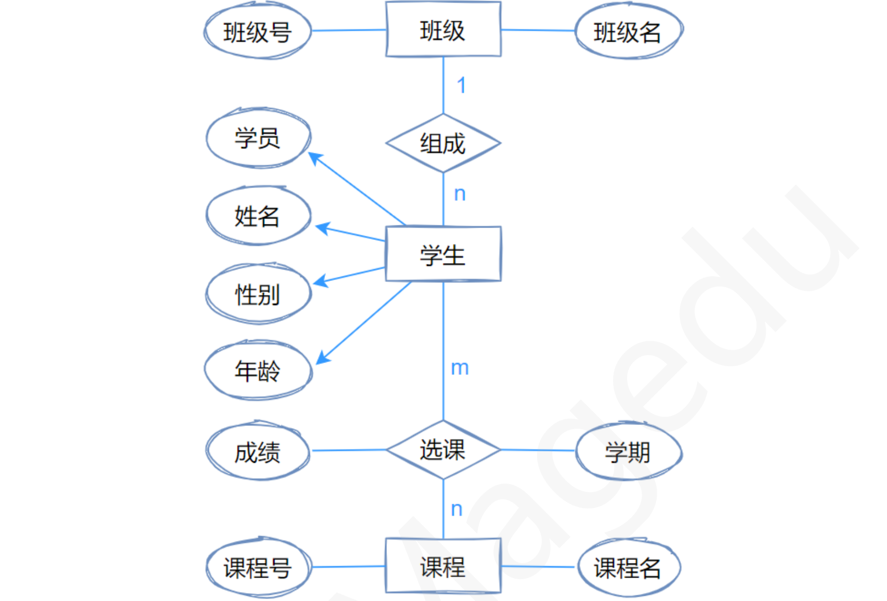

**实体间的联系有三种类型**

一对一联系 ( 1:1 )

一对多联系 ( 1:n )

多对多联系 ( m:n )

#### 数据库的正规化分析

**第一范式** 1NF (确保每列保持原子性)

第一范式是最基本的范式。如果数据库表中的所有字段值都是不可分解的原子值，就说明该数据库表满足了第一范式。

第一范式需要根据系统的实际需求来定。其核心是要保证数据表中的列里面没有重复值，即实体中的某个属性不能有多个值或者不能有重复的属性，确保每一列的原子性。

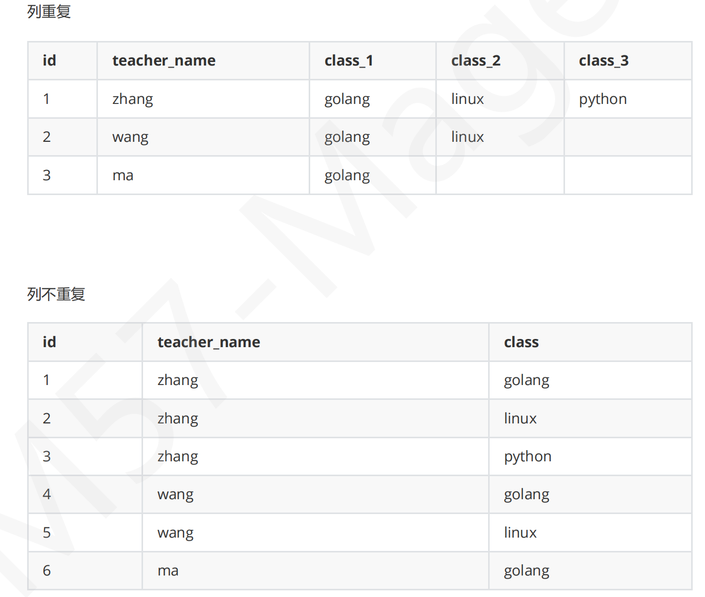

**第二范式** 2NF (确保表中的每列都和主键相关)

第二范式在第一范式的基础之上更进一层。第二范式需要确保数据库表中的每一列都和主键相关，而不能只与主键的某一部分相关（主要针对联合主键而言）。也就是说在一个数据库表中，一个表中只能保存一种数据，不可以把多种数据保存在同一张数据库表中。

teacher_name 和 city 组成联合主键，city_code 与 city 一一对应，city_code 依赖了部份主键，违反了第二范式

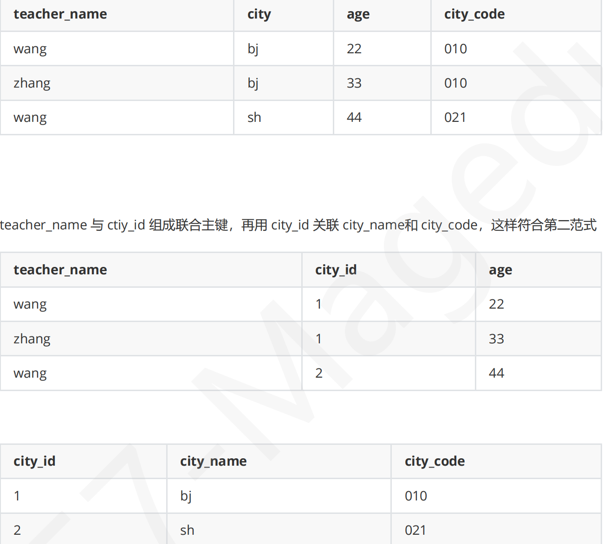

**第三范式** 3NF (确保每列都和主键列直接相关，而不是间接相关)

第三范式需要确保数据表中的每一列数据都和主键直接相关，而不能间接相关。

必须先满足第一范式才能满足第二范式，必须同时满足第一第二范式才能满足第三范式。

teacher 表一对一

class 表一对一

teacher 与 class 多对多

## 1.2mysql安装和基本使用

### 1.2.1MySQL 安装

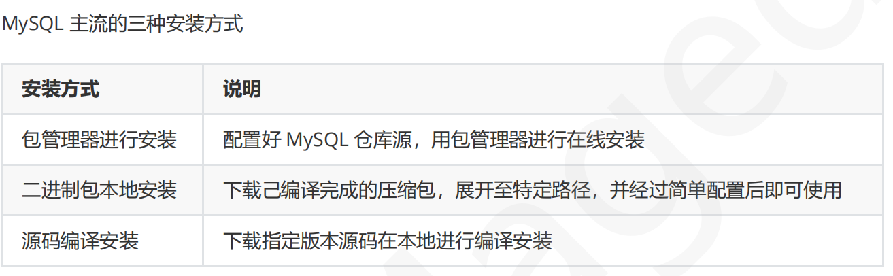

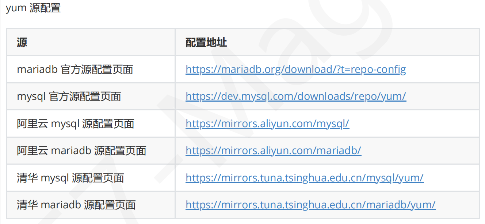

#### 包管理器进行安装

```powershell
apt install mysql-server -y
```

**Rocky8.6 中安装 mysql 8.0**

```bash
[root@rocky86 ~]# yum list mysql mysql-server
[root@rocky86 ~]# yum list mariadb mariadb-server
#安装 mysql-server，会自动安装客户端包
[root@rocky86 ~]# yum install -y mysql-server

#服务状态
[root@rocky86 ~]# systemctl status mysqld.service
#启动服务
[root@rocky86 ~]# systemctl enable --now mysqld.service
```

**在CentOS 7 中安装 mysql5.7**

```bash
#配置yum 源
[root@c7 ~]# vim /etc/yum.repos.d/mysql.repo
 [mysql]
 name=mysql5.7
 baseurl=https://mirrors.tuna.tsinghua.edu.cn/mysql/yum/mysql-5.7-community-el7x86_64/
 gpgcheck=0
```


```bash
[root@c7 ~]# yum install -y mysql-community-server
#启动服务
[root@c7 ~]# systemctl enable --now mysqld

#多线程
[root@c7 ~]# pstree | grep mysqld

#自动创建的账号
[root@c7 ~]# getent passwd mysql
```

```bash
#mysql 5.7 包安装会有默认的随机密码
[root@centos7 ~]# cat /var/log/mysqld.log | grep pass

#指定用户名密码连接
[root@centos7 ~]# mysql -uroot -p'ef58-W=p_opM'
#无任何操作权限，需要先更新密码
#修改密码， 需要大小写字母加数字加符号
mysql> alter user root@'localhost' identified by 'M54-magedu';

#另外一种修改密码方法
[root@centos7 ~]# mysqladmin -uroot -p'Magedu-m52' password 'Magedu-M52'
```

#### 二进制包安装

```powershell
mysql官方已经不提供二进制包或者源码下载，完全可以直接使用yum或apt下载
```

这里的二进制包是指己经编译完成，以压缩包提供下载的文件，下载到本地之后释放到自定义目录，再 进行配置即可。

#### 源码编译安装

源码编译安装与前面的二进制包安装相比较，只多了编译过程。

#### 在 docker 中安装

```bash
#更新源
root@ubuntu20:~# apt update
#安装 docker
root@ubuntu20:~# apt install docker.io
#安装mysql最新版镜像
root@ubuntu20:~# docker run --name mysql -d -p 3306:3306 -e MYSQL_ROOT_PASSWORD=123456 mysql

root@ubuntu20:~# docker ps

#安装客户端
root@ubuntu20:~# apt install mysql-client-core-8.0
```

### 1.2.2MySQL 多实例

拿 MySQL 数据库来说明，就是在一台服务器上运行多个 MySQL 服务端进程，每个进程监听一个端口（3306，3307，3308），维护一套属于其自己的配置和数据，客户端使用不同的端口来连接具体服端进程，从而实现对不同的实例的操作。

资源抢占：一台服务器上运行多个服务实例，资源总量恒定，一个实例占用的资源无法被另一个实例所使用，在这种情况下，服务性能会受到影响，无法体现 MySQL 服务的实际性能。

存在单点风险：一台服务器上部署多个服务实例，如果该服务器当机，则这多个服务实例都会受影响

### 1.2.3MySQL 主要组成

mysql 基于 C/S 模式提供服务，主要有客户端程序和服务端程序组成，另外还有一些管理工具。

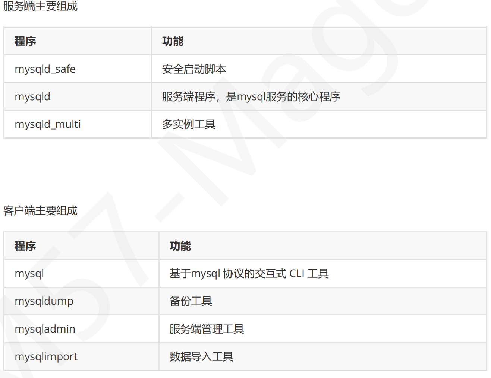

配置文件

```bash
[root@rocky86 ~]# cat /etc/my.cnf

[root@rocky86 ~]# tree /etc/my.cnf.d/
```

```bash
#执行客户端命令

[root@m52 ~]# mysql -e "source /root/test.sql"
```

### 1.2.4mysql工具使用

#### 

```bash
#显示版本
[root@rocky86 ~]# mysql -V

#使用主机名
[root@rocky86 ~]# mysql --user=root --host=m52.magedu.rocky86 --port=3306
#指定数据库
[root@m52 ~]# mysql information_schema
```

```bash
[root@m52 ~]# mysqladmin status

[root@m52 ~]# mysqladmin -h10.0.0.123 --connect-timeout=2 ping

#静默退出，不输出错误信息
[root@m52 ~]# mysqladmin -h10.0.0.123 --connect-timeout=2 -s ping
```

**mycli** **工具**

MyCLI 是基于 Python 开发的 MySQL 的命令行工具，具有自动完成和语法突出显示功能。

## 1.3SQL语言

### 1.3.1SQL 语言介绍

#### sql语句类型

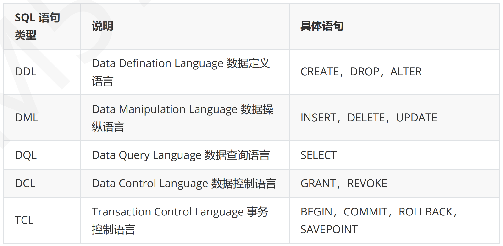

#### 字符集

MySQL8.0 开始默认字符集已经为 utf8mb4

```bash
MariaDB [(none)]> show CHARACTER SET;

[root@m52 ~]# vim /etc/my.cnf.d/mariadb-server.cnf
[mysqld]
character-set-server=utf8mb4
```

### 1.3.2管理数据库

#### 创建数据库

```bash
#查看数据库列表
SHOW DATABASES;

create database testdb1;

#查看创建语句，包含默认字符集
show create database testdb1;
```

创建两个数据库，本质上是在硬盘上创建了两个目录

```bash
[root@m52 ~]# ls /var/lib/mysql/testdb* -d
/var/lib/mysql/testdb1 /var/lib/mysql/testdb2
```

#### 修改数据库

```bash
ALTER DATABASE testdb2 character set utf8mb4 COLLATE
```

#### 删除

```bash
DROP DATABASE testdb2;
#判断
DROP DATABASE IF EXISTS testdb2;
```

```bash
#相对应的目录己不正在
[root@m52 ~]# ls /var/lib/mysql/testdb* -d
/var/lib/mysql/testdb1
```

### 1.3.3数据类型

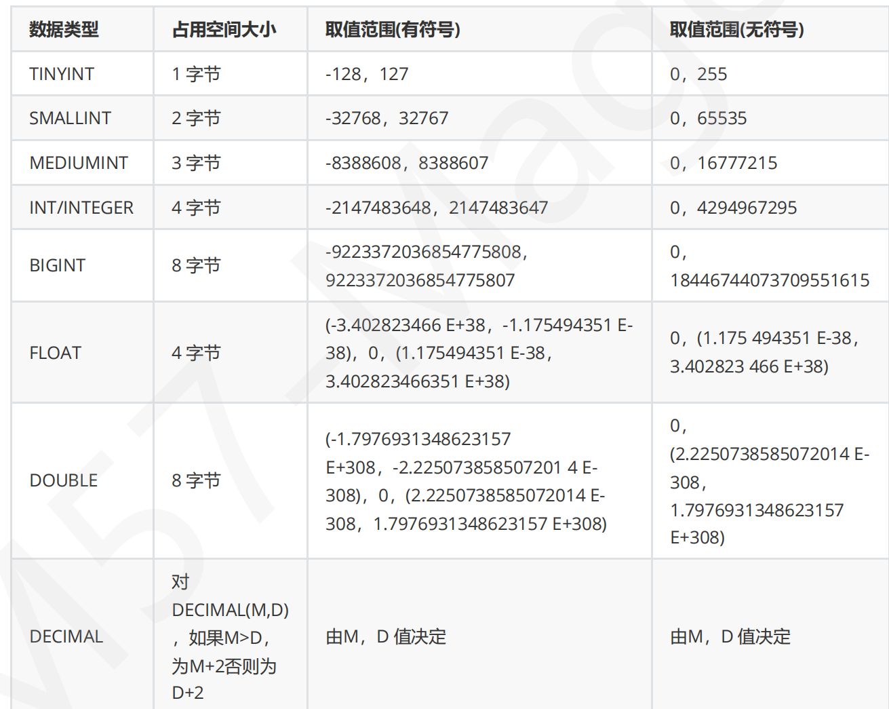

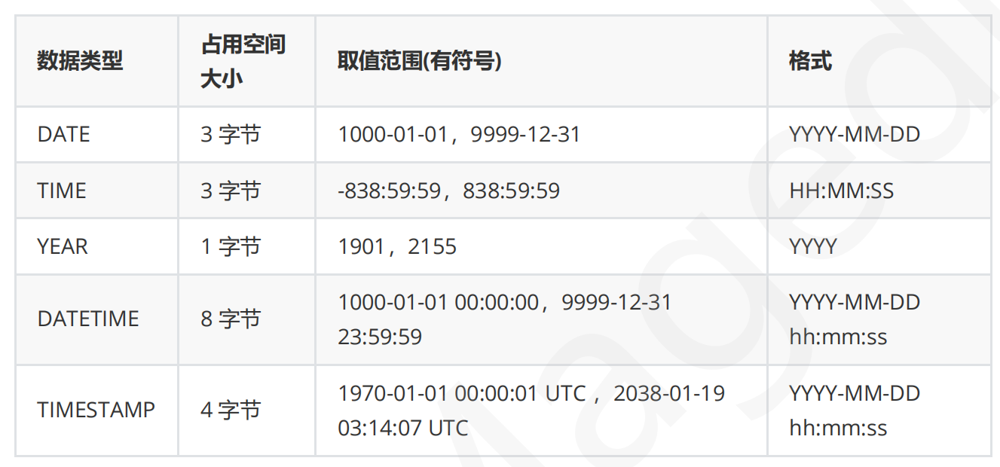

**TIMESTAMP 类型有专有的自动更新特性。即这条记录，如果有字段是 TIMESTAMP 类型，那该记录更新后，TIMESTAMP 会自动更新。**

**char** **和** **varchar**

CHAR 和 VARCHAR 类型类似，但它们保存和检索的方式不同。它们的最大长度和是否尾部空格被保留等方面也不同。在存储或检索过程中不进行大小写转换。

char(n) 是固定长度，char(4) 不管是存入几个字符，都将占用4个字节，varchar 是存入的实际字符数+1 个字节（0< n>255)，所以varchar(4)，存入3个字符将占用4个字节。

char 类型的字符串检索速度要比 varchar 类型的快。

**varchar** **和** **text**

varchar 可指定 n，text 不能指定，内部存储 varchar 是存入的实际字符数+1个字节（1< n>255)，text 是实际字符数+2个字节。

text 类型不能有默认值。

**二进制数据BLOB**

BLOB 和 text 存储方式不同，TEXT 以文本方式存储，英文存储区分大小写，而 Blob 以二进制方式存储，不分大小写

BLOB 存储的数据只能整体读出。

TEXT 可以指定字符集，BLOB 不用指定字符集。

**选择正确的数据类型对于获得高性能至关重要**

更小的通常更好，尽量使用可正确存储数据的最小数据类型

简单就好，简单数据类型的操作通常需要更少的CPU周期

尽量避免NULL，包含为NULL的列，对MySQL更难优化

#### 修饰符

**适用所有类型的修饰符**

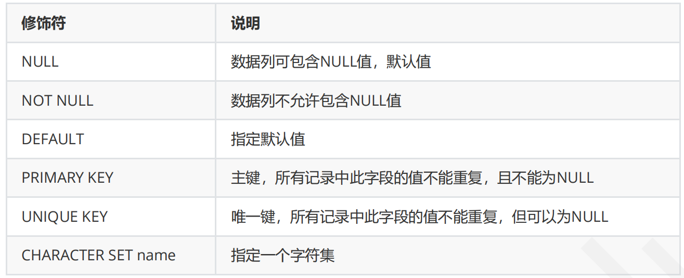

**适用数值型的修饰符**

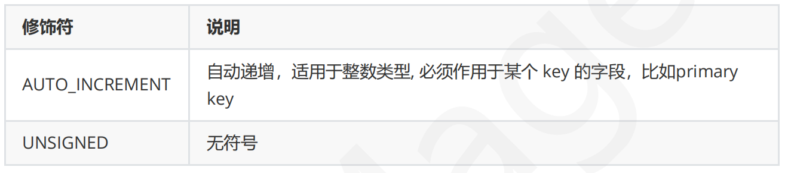

### 1.3.4DDL 语句

#### 创建表

```bash
CREATE [TEMPORARY] TABLE [IF NOT EXISTS] tbl_name
```

```bash
CREATE TABLE student (
id int UNSIGNED AUTO_INCREMENT PRIMARY KEY,
name VARCHAR(20) NOT NULL,
age tinyint UNSIGNED,
#height DECIMAL(5,2),
gender ENUM('M','F') default 'M'
)ENGINE=InnoDB AUTO_INCREMENT=10 DEFAULT CHARSET=utf8mb4;
```

```bash
#查看表结构
desc student;
#通过复制现存的表的表结构创建，但不复制数据
create table student3 like student;
```

#### 查看表

```bash
SHOW [FULL] TABLES [{FROM | IN} db_name]
   [LIKE 'pattern' | WHERE expr]
```

```bash
show tables from db1;
#查看建表语句
show create table student;
#查看指定数据库的数据表
show create table db1.student\G
```

```bash
#查看表状态
SHOW TABLE STATUS LIKE 'student';
```

**查看库中所有表状态**

```bash
SHOW TABLE STATUS FROM db_name
```

**查看当前mysql服务支持的引擎**

```bash
SHOW ENGINES\G
```

#### 修改和删除表

```bash
#修改表名
MariaDB [db1]> ALTER TABLE student RENAME stu;

#修改字段类型
MariaDB [db1]> ALTER TABLE stu MODIFY phone int;

#修改字段名称和类型
MariaDB [db1]> ALTER TABLE stu CHANGE COLUMN phone mobile char(11);

#删除字段
MariaDB [db1]> ALTER TABLE stu DROP COLUMN mobile;

#修改表字符集
MariaDB [db1]> ALTER TABLE stu character SET utf8;
#同时修改数据类型和字符集，只修改字符集，类型也不能少
MariaDB [db1]> ALTER TABLE stu CHANGE name name char(30) character set utf8;

#设置字段默认值
MariaDB [db1]> alter table stu alter column gender set default 'M';

#添加字段和修改字段
MariaDB [db1]> ALTER TABLE stu ADD is_del bool DEFAULT false;
```

```bash
drop table student2;drop table db1.student3;
```

### 1.3.5DML语句

DML 语句包括 INSERT，UPDATE，DELETE

```bash
INSERT INTO stu VALUES(12,'xiaoli',19,'F',0);

INSERT INTO stu (name,age)VALUES('test1',20),('test2',21),
('test3',22);
```

```bash
update stu SET age=21, gender='M' WHERE ( id=15 OR name IS NULL );
```

```bash
delete from stu where ( name IS NULL or id=14 );
```

在真实生产环境中，一般不会对数据做物理删除，而是用字段来标记为逻辑删除，将对应字段值设为某个特定项，认为是己删除

### 1.3.6DQL 语句

#### 单表

GROUP BY：根据指定的条件把查询结果进行"分组"以用于做"聚合"运算

常见聚合函数： count()，sum()，max()，min()，avg()，

**注意：聚合函数不对null统计**

HAVING：对分组聚合运算后的结果指定过滤条件

一旦分组 group by，select语句后只跟分组的字段，聚合函数

```bash
#分组统计
MariaDB [db1]> select sum(age),gender from stu group by gender;

#分组统计
MariaDB [db1]> select sum(age),gender from stu group by gender;

#分组带where条件
MariaDB [db1]> select count(*),max(id),avg(age),gender from stu where age is not null group by gender;

#分组后过滤
MariaDB [db1]> select count(*) as total,max(id),avg(age),gender from stu where 
age is not null group by gender having total=3;

#用分组结果排序
MariaDB [db1]> select sum(age) sum_age,avg(age) avg_age,gender from stu where age is not null group by gender order by sum_age asc;
```

```bash
#去重
MariaDB [db1]> select distinct age from stu order by age desc;

#第一页，每页3条记录
MariaDB [db1]> select id ,name from stu limit 0,3;
```

#### 多表


多表查询：即同时从多张表中查询出结果。

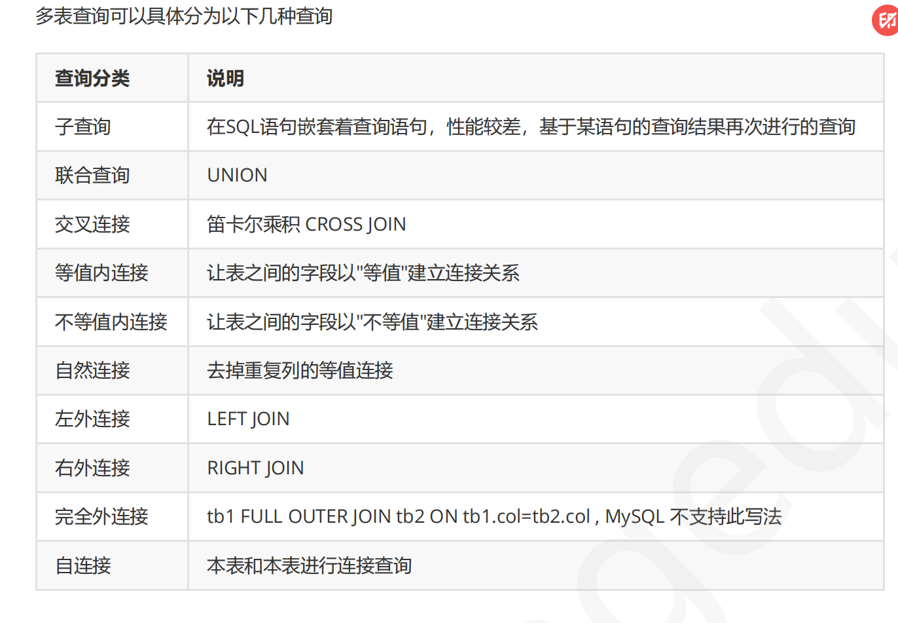

#### **SELECT** **语句处理的顺序**

查询执行路径中的组件：查询缓存、解析器、预处理器、优化器、查询执行引擎、存储引擎

SELECT语句的执行流程：

```bash
FROM Clause --> WHERE Clause --> GROUP BY --> HAVING Clause -->SELECT --> ORDER BY --> LIMIT
```

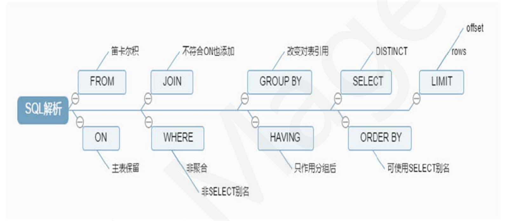

#### sql注入

SQL 注入是指应用程序对用户输入的数据没有严格校验，没有做合法性判断或者过滤不严格，让攻击者可以通过传参的形式构建特殊的SQL语句并执行，以此来实现欺骗数据库服务器执行非授权的任意查询，从而进一步得到相应的数据信息，并非法获取系统权限。

```bash
#正常验证逻辑，根据用户名和密码判断
MariaDB [db1]> select * from user where name='admin' and password='123456';

#特殊查询语句，永远都能返回查询结果
MariaDB [db1]> select * from user where name='abc' and password='def' or 1=1;
```

### 1.3.7视图

视图：虚拟表，保存有实表的查询结果，相当于别名。

利用视图，可以隐藏表真实结构，在程序中利用视图进行查询，可以避免表结构的变化，而修改程序，降低程序和数据库之间的耦合度。

视图中的数据，实际上是存在于相对应的表中，视图本身没有数据，因此，**修改视图中的数据，本质上是修改了表中的数据。**

```bash
create view v_stu as select * from stu where age>22;

#增删改查操作与操作表相同
```

### 1.3.8FUNCTION 函数

函数：分为系统内置函数和自定义函数两种。

自定义函数：user-defined function UDF，保存在mysql.proc (MySQL8.0 中已经取消此表)表中。mysql8.0中默认不能创建自定义函数

系统内置函数参考：

```bash
https://dev.mysql.com/doc/refman/8.0/en/built-in-function-reference.html
https://dev.mysql.com/doc/refman/5.7/en/built-in-function-reference.html
```

```bash
#查看函数列表
SHOW FUNCTION STATUS;
#查看函数定义
SHOW CREATE FUNCTION function_name
#删除
DROP FUNCTION function_name
#调用
SELECT function_name(parameter_value,...)
```

参数可以有多个，也可以没有参数；

无论有无参数，小括号（）是必须的；

必须有且只有一个返回值；

不能独立使用，必须要在 SQL 语句中使用；

#### MySQL中的变量

### 1.3.9PROCEDURE 存储过程

存储过程：多表SQL的语句的集合，可以独立执行，存储过程保存在 mysql.proc 表中

**存储过程优势**

**存储过程把经常使用的SQL语句或业务逻辑封装起来,预编译保存在数据库中**,当需要时从数据库中直接调用，省去了编译的过程，提高了运行速度，同时降低网络数据传输量。

**存储过程与自定义函数的区别**

存储过程实现的过程要复杂一些，而函数的针对性较强。

存储过程可以有多个返回值，而自定义函数只有一个返回值。

存储过程一般可独立执行，而函数往往是作为其他SQL语句的一部分来使用。

无参数的存储过程执行过程中可以不加()，函数必须加 ()。

```bash
#查看存储过程列表
SHOW PROCEDURE STATUS
#查看存储过程定义
SHOW CREATE PROCEDURE sp_name
#调用存储过程
CALL sp_name ([ proc_parameter [,proc_parameter ...]])
#删除
DROP PROCEDURE [IF EXISTS] sp_name
```

### 1.3.10TRIGGER 触发器

触发器的执行不是由程序调用，也不是由手工启动，而是由事件来触发、激活从而实现执行

```bash
#查看
SHOW TRIGGERS;

USE information_schema;
SELECT * FROM triggers WHERE trigger_name='trigger_name';
#删除
DROP TRIGGER trigger_name;
```

学生总数随增删操作增减

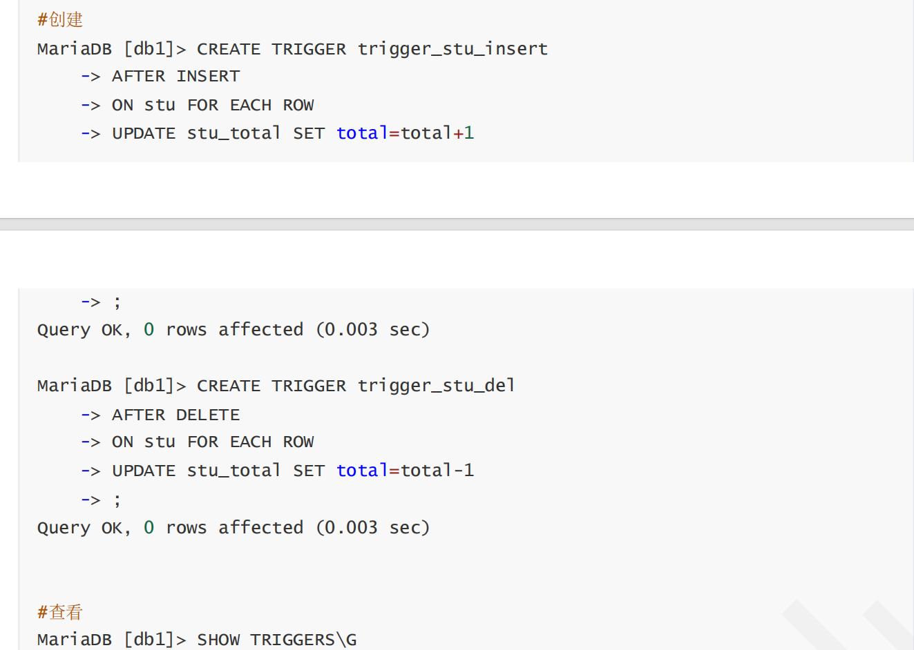

### 1.3.11Event 事件

事件和触发器类似，都是在某些事情发生的时候启动。当数据库上启动一条语句的时候，触发器就启动了，而事件是根据调度事件来启动的。由于它们彼此相似，所以事件也称为临时性触发器。

事件取代了原先只能由操作系统的计划任务来执行的工作，而且MySQL的事件调度器可以精确到每秒钟执行一个任务，而操作系统的计划任务（如：Linux下的CRON或Windows下的任务计划）只能精确到每分钟执行一次。

MySQL事件调度器event_scheduler负责调用事件，它默认是关闭的。这个调度器不断地监视一个事件是否要调用， 要创建事件，必须打开调度器。在 MySQL8.0 默认是 ON

**事件的优缺点**

优点：一些对数据定时性操作不再依赖外部程序，而直接使用数据库本身提供的功能，可以实现每秒钟执行一个任务，这在一些对实时性要求较高的环境下就非常实用。

缺点：定时触发，不可以直接调用

```bash
select @@event_scheduler;
show processlist;
```

```bash
#临时开启
set global event_scheduler=1;
```

```bash
#持久开启事件调度
[root@m52 ~]# vim /etc/my.cnf.d/mariadb-server.cnf
[mysqld]
event_scheduler=ON
```

```bash
#创建表用来记录事件
MariaDB [db1]> create table events_list(event_name varchar(20) not null,event_started timestamp not null);
#开启事件调度
MariaDB [db1]> set global event_scheduler=1;

#创建一个每秒执行一次的 event 
MariaDB [db1]> CREATE EVENT test_very_second ON SCHEDULE EVERY 1 SECOND DO INSERT INTO events_list VALUES('TEST-EVENT',now());

#查看
MariaDB [db1]> SHOW EVENTS\G
```

## 1.4用户权限管理

### 1.4.1mysql用户管理

MySQL 服务的账户是独立存在的，只用于MySQL服务的登录验证。

虚拟用户：给服务和应用使用的用户账号。

系统用户：Linux 系统使用的用户账号

用户名和主机组合起来才能标识一个唯一用户。SQL Server，Oracle 等都没有此限制，只要账号和密码能校验通过即可登录。

```bash
#格式
CREATE USER 'USERNAME'@'HOST' [IDENTIFIED BY 'password']；

RENAME USER 'USERNAME'@'HOST' TO 'USERNAME'@'HOST';

DROP USER 'USERNAME'@'HOST'

#在MYSQL8.0中可以使用此写法
#MySQL8.0中的密码是放在 mysql.user 表中 authentication_string 字段中，但MariaDB中还保留了Password字段
SET PASSWORD FOR root@'localhost'='123456' ;
```

**忘记密码**

```bash
自建数据库用
#方式一，会清除所有数据
#停止服务
[root@localhost ~]# systemctl stop mysqld.service
#删除数据目录下所有内容
[root@localhost ~]# rm -rf /var/lib/mysql/*
#重启服务，恢复空密码登录
[root@localhost ~]# systemctl start mysqld.service
```

```bash
#方式二，保留原有数据
#1 启动时添加指定项
--skip-grant-tables
--skip-networking
#2 使用UPDATE命令修改管理员密码
#3 移除配置项重启
```

**MySQL5.7 和 8.0 破解 root 密码**

```bash
[root@localhost ~]# vim /etc/my.cnf
[mysqld]
skip-grant-tables
skip-networking #MySQL8.0不需要
[root@localhost ~]# systemctl restart mysqld
[root@localhost ~]# mysql
#方法1
mysql> update mysql.user set authentication_string='' where user='root' and host='localhost';
#方法2
mysql> flush privileges;
#再执行下面任意一个命令
mysql> alter user root@'localhost' identified by 'ubuntu';
mysql> set password for root@'localhost'='ubuntu';
[root@localhost ~]# vim /etc/my.cnf
[mysqld]
#skip-grant-tables
#skip-networking
[root@localhost ~]# systemctl restart mysqld
[root@localhost ~]# mysql -uroot -pubuntu
```

### 1.4.2权限管理和 DCL 语句

**授权**

```bash
#授予所有权限
GRANT ALL PRIVILEGES ON *.* TO 'root'@'10.0.0.%' WITH GRANT OPTION;
#创建用户和授权同时执行的方式在MySQL8.0取消了
GRANT ALL ON wordpress.* TO wordpress@'192.168.8.%' IDENTIFIED BY 'magedu';
#只能查询，插入指定字段
GRANT SELECT(col1),INSERT(col1,col2) ON mydb.mytbl TO 'someuser'@'somehost';
```

**取消权限**

```bash
REVOKE DELETE ON *.* FROM 'testuser'@'172.16.0.%';
REVOKE ALL ON *.* FROM 'testuser'@'172.16.0.%';
```

## 1.5LAMP案例

## 1.6MySQL 架构和性能优化

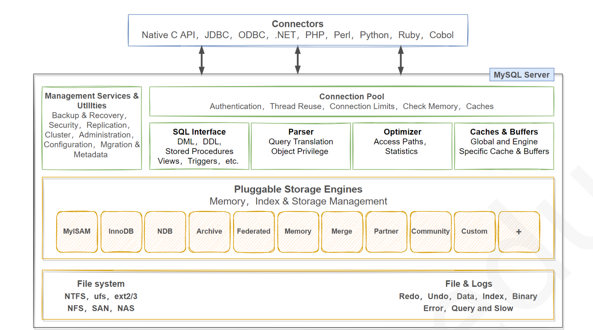

**Connection Pool：线程池**

MySQL 是单进程多线程模型，因此，每个用户连接，都会创建一个连接线程，客户端和服务端通过这个线程进行数据交互。MySQL 通过线程池来管理这些线程，线程池组件的功能包括登录验证(authentication)，线程重用(Connection Pool) 等，connection limit 值决定了线程池中线程数量，也就决定了MySQL服务的最大并发连接数，check memory 用来检测内存，caches 实现线程缓存。

```bash
#最大并发连接数，在实际的生产环境中，可以将此参数调大
mysql> show variables like 'max_connections';
```

**SQL Interface：SQL语句接口**

完整的 sql 命令的解释器，对 SQL 语句进行检查，是否有错误，并且进行词法分析，语法分析，识别出具体操作，对象，参数等。

**Parser：查询解析器**

解析器会根据己经检查过的SQL语句生成一个数据结构，一般是树形结构，我们称其为解析树。在这个过程中也会校验当前连接的客户端是否有权限操作库和表等。

**Optimizer：查询优化器**

根据解析器生成的解析树中的各个节点，决定一个最优的执行顺序路径，保证在使用最少的开销的情况下返回正确的结果。

**Cache & Buffer：查询缓存**

将己查询过的结果进行缓存，下次使用相同的查询语句查询时，可以直接从缓存中返回查询结果。

### 1.6.1存储引擎

在 MySQL5.5 之后默认存储引擎是 InnoDB，在之前是 MyISAM。

```bash
https://docs.oracle.com/cd/E17952_01/mysql-8.0-en/storage-engines.html

https://docs.oracle.com/cd/E17952_01/mysql-5.7-en/storage-engines.html
```

**表锁与行锁**

锁是计算机协调多个进程或线程并发访问某一资源的机制。

**表锁：表锁是 MySQL 中锁定粒度最大的一种锁，表示对当前操作的整张表加锁（哪怕只操作表里面的一行数据），它实现简单，消耗资源少，被大部份 MySQL 存储引擎支持，MyISAM 存储引擎使用表锁，表级锁定分为表共享读锁（共享锁）与表独占写锁（排他锁）。**

**表锁的特点是开销小，加锁快，不会出现死锁，锁定颗粒度大，发生锁冲突的概率高，并发性差。**

**行锁：行锁是 MySQL 中锁定粒度最小的一种锁，表示只对当前操作的行加锁，行锁能大大减少数据库操作的冲突。其加锁粒度最小，但加锁的开销也最大。行级锁分为共享锁和排他锁。InnoDB存储引擎默认采用行锁。**

**行锁的特点是开销大，加锁慢，会出现死锁，锁定颗粒度最小，发生锁冲突的概率最低，并发性好。**

#### MyISAM 存储引擎

```bash
select version();
5.1.52
#user表使用 MyISAM 存储引擎
show table status like 'user'\G
```

**MyISAM** **存储引擎特点**

不支持事务

表级锁定

读写相互阻塞，写入不能读，读时不能写

只缓存索引

不支持外键约束

不支持聚簇索引

支持全文索引

读取数据较快，占用资源较少

不支持MVCC（多版本并发控制机制）高并发

崩溃恢复性较差

MySQL5.5.5 前默认的数据库引擎

**MyISAM** **存储引擎适用场景**

读多写少的业务（或者只读的业务）

不需要事务支持的业务（比如转账，充值这种业务就不行）

并发访问低的业务

对数据一致性要求不高的业务

表较小（可以接受长时间进行修复操作）

#### InnoDB 存储引擎

**InnoDB** **存储引擎特点**

支持事务，适合处理大量短期事务

行级锁定

读写阻塞与事务隔离级别相关

可缓存数据和索引

支持聚簇索引

崩溃恢复性更好

支持MVCC高并发

支持表分区，支持表空间

从MySQL5.5 后支持全文索引

从MySQL5.5.5 开始为默认的数据库引擎

**InnoDB** **存储引擎适用场景**

数据读写都较为频繁的业务

需要事务支持的业务

对并发要求较高的业务

对数据一致性要求较高的业务

**InnoDB** **中有共享表空间和独立表空间的概念。**

**共享表空间是指表结构文件单独放在以数据命名的文件夹中**，**格式为 tbl_name.frm，所有 InnoDB 引擎表的数据都放在一个文件中 (ibdata1,ibdata2,...)。**

**独立表空间是指用独立文件存放每个表的表结构 tbl_name.frm 和数据及索引 tbl_name.ibd，在独立表空间的前提下，共享表空间中的 ibdata 文件还是存在，独立表空间文件只存储该表的数据，索引和插入缓冲的BITMAP等信息，其它信息还是存放在共享表空间中。**

MySQL 5.5 版本以后默认采用独立表空间

MySQL8.0 开始，InnoDB 引擎的 frm 文件被取消了，并入到 idb文件中了

```bash
#开启了独立表空间
mysql> show variables like 'innodb_file_per_table';
```

```bash
#查看当前默认的存储引擎
show variables like '%storage_engine%';
```

**查看库中所有表使用的存储引擎**

```bash
show table status from db_name;
```

### 1.6.2MySQL 中的系统数据库

**mysql** **数据库**

类似于Sql Server中的master库，主要负责存储数据库的用户、权限设置、关键字等mysql自己需要使用的控制和管理信息

**information_schema** **数据库**

MySQL 5.0 之后产生的，一个虚拟数据库，物理上并不存在information_schema数据库类似与"数据字典"，**提供了访问数据库元数据的方式**，即数据的数据。比如数据库名或表名，列类型，访问权限（更加细化的访问方式）。

**performance_schema** **数据库**

MySQL 5.5 开始新增的数据库，主要用于收集数据库服务器性能参数，库里表的存储引擎均为PERFORMANCE_SCHEMA，用户不能创建存储引擎为 PERFORMANCE_SCHEMA 的表

### 1.6.3服务器配置和状态

设置 MySQL 服务的特性，可以通过 **mysqld 服务选项，服务器系统变量和服务器状态变量**这三个方面来进行设置和查看

```bash
[root@localhost ~]# mysqld --verbose --help

#查看服务启动时在命令行下添加的选项
[root@localhost ~]# ps aux | grep mysqld

#这个选项是配置在服务脚本中的
[root@localhost ~]# systemctl cat mysqld.service | grep basedir
# Note: we set --basedir to prevent probes that might trigger SELinux alarms,
ExecStart=/usr/libexec/mysqld --basedir=/usr
```

```bash
#查看当前服务启动选项
[root@localhost ~]# mysqld --print-defaults
/usr/libexec/mysqld would have been started with the following arguments:
--default_authentication_plugin=mysql_native_password --datadir=/var/lib/mysql -
-socket=/var/lib/mysql/mysql.sock --log-error=/var/log/mysql/mysqld.log --pid-file=/run/mysqld/mysqld.pid
```

**非服务器选项不能加配置文件**

#### 1.6.3.1服务器系统变量

#### 1.6.3.2服务器状态变量

#### 1.6.3.3服务器变量 sql_mode

sql_mode 是服务器选项，也是变量，其值会影响 SQL 语句执行的工作模式。

### 1.6.4索引

索引：是排序的快速查找的特殊数据结构，定义作为查找条件的字段上，又称为键 key，索引通过存储引擎实现。

**优点**

大大加快数据的检索速度;

创建唯一性索引，保证数据库表中每一行数据的唯一性;

加速表和表之间的连接;

在使用分组和排序子句进行数据检索时，可以显著减少查询中分组和排序的时间。

**缺点**

索引需要占物理空间。

当对表中的数据进行增加、删除和修改的时候，索引也要动态的维护，降低了数据的维护速度。

#### 索引结构（看原文）

B+树索引

B+树是B-树的变体，也是一棵多路搜索树，MySQL普遍使用B+树来实现索引

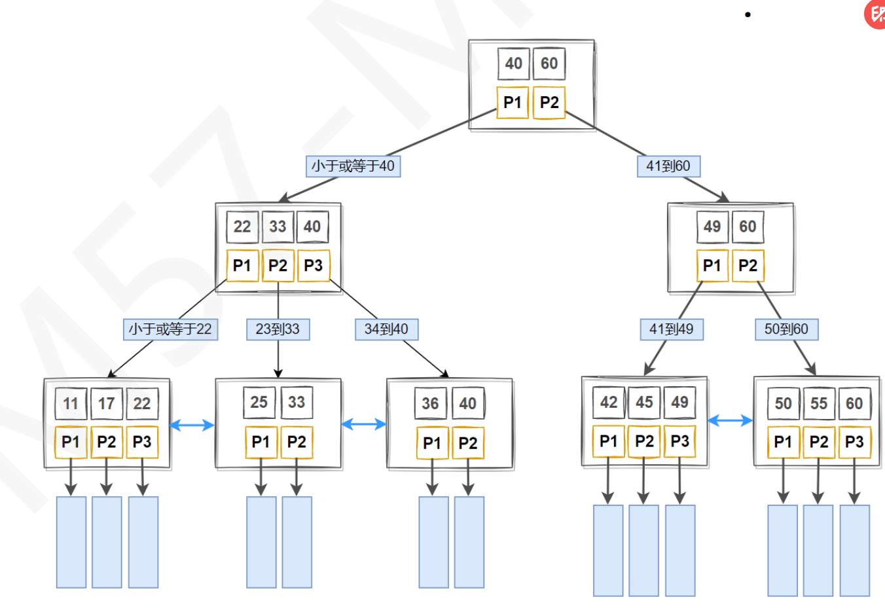

```bash
show index from student\G
```

```bash
explain select * from student where name="wangwu"\G;
       id: 1
 select_type: SIMPLE
       table: student
   partitions: NULL
         type: ALL #全表扫描
possible_keys: NULL #没有使用索引字段
         key: NULL #没有使用索引字段
     key_len: NULL
         ref: NULL
         rows: 6 #扫描了6条数据，整个表就是6条数据
     filtered: 16.67
       Extra: Using where #在存储引擎检索行后再进行过滤
1 row in set, 1 warning (0.00 sec)
```

不是所有查询都能用到索引，B+树索引是左前缀特性，即左匹配可以使用索引

```bash
全表总共28条记录，name 字段中，以 m 开头的有22条，以 z 开头的有3条，所以在此情况下，查询以 m 开头内容，直接全表扫描反而会更快
这是 mariadb 中的优化，MySQL8.0 中也有此功能，但旧版本中没有此优化
```

删除索引

```bash
DROP INDEX index_name ON tbl_name;
ALTER TABLE tbl_name DROP INDEX index_name(index_col_name);
```

**优化表空间**

```bash
OPTIMIZE TABLE tb_name;
```

对 MySQL 进行大量或频繁的写操作(insert，delete，update)，容易产生碎片，这些碎片会影响MySQL 性能。在此情况下，我们可以通过 optimize 命令来进行优化。此命令在使用时会锁表，需要保证在不对业务产生影响的情况下使用。

这里的碎片指的是，经过某些操作，导致数据库中的表对应的硬盘上的物理文件中的数据不是紧密排列的。

**profile 工具**

开启 profiling 设置可以记录 SQL 语句执行的详细过程

```bash
set profiling=1;
select * from student where name="wangwu";
show profiles;
```

### 1.6.5并发控制

#### 1.6.5.1锁机制

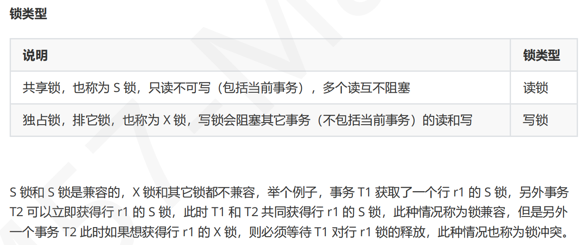

**锁是加在索引上的，而不是加在数据上的**


#### 1.6.5.2显式使用锁

```bash
#可读不可写
lock tables student read;
```

```bash
#释放锁
UNLOCK TABLES
```

```bash
#加写锁-终端1，只有终端1可读可写，其他都不可读不可写
mysql> lock table student write;
```

一个session只能为自己获取锁和释放锁，不能为其他session获取锁，也不能释放由其他session保持的锁

**全局锁**

关闭正在打开的表（清除查询缓存），通常在备份前加全局读锁

```bash
FLUSH TABLES 
#关闭所有打开的表，强制关闭所有正在使用的表，并刷新查询缓存和预准备语句缓存，不会刷新脏块
FLUSH TABLES WITH READ LOCK 
#关闭所有打开的表并使用全局读锁锁定所有数据库的所有表，不会刷新脏块,也不阻塞日志表写入，例如查询日志，慢日志等
FLUSH TABLES tbl_name tb_name[,...] WITH READ LOCK
#操作指定表
FLUSH TABLES tbl_name [tb_name[,...]] FOR EXPORT 
#刷新脏块
#脏块也称为脏页，当内存数据页和磁盘数据页上的内容不一致时，我们称这个内存页为脏页
```

**查询时加锁**

这种加锁方式只是在执行的过程中加锁，等查询结束之后，锁会被自动释放

```bash
SELECT clause [FOR UPDATE | LOCK IN SHARE MODE]
LOCK IN SHARE MODE #对读取到的记录加S锁
FOR UPDATE #对读取到的记录加X锁
```

同时在两个终端对同一行记录修改，只有一条能执行成功（update 有写锁）

#### 1.6.5.3事务

事务是一组具有原子性的 SQL 语句，或者说一个独立单元。可以理解为一个事务对应的是一组完整的业务，这个业务有一条或多条 SQL 语句组成。所谓原子性是指，这一组业务中的 SQL 语句不可分割，所以，要么全部 SQL 语句都执行成功，事务也就执行成功；只要有一条 SQL 语句执行失败，则整个事务要回滚到事务开始前。

**事务日志**

记录事务的日志，可以根据此日志实现事务的回滚(undo)，重新提交(redo) 等功能。

此处说的事务仅限于InnoDB引擎下，在MySQL中，MyISAM 引擎是不支持事务的。

**ACID**

**原子性Atomicity**

一个事务中的所有操作，要么全部完成，要么全部不完成

**一致性Consistency**

保证了事务执行前后，数据库从一个一致的状态转移到另一个一致的状态。

**隔离性（Isolation）**

保证并发执行的多个事务之间互不干扰，每个事务都像是在独立执行一样，不会看到其他并行事务的中间状态。

**持久性（Durability）**

事务执行成功后，其对于数据的修改会永久保存于数据库中。

#### 1.6.5.4管理事务

```bash
BEGIN
START TRANSACTION

#提交执行
COMMIT
#回滚
ROLLBACK
```

```bash
#未提交事务，仅影响当前终端查询，不影响其他终端
mysql> begin;
Query OK, 0 rows affected (0.00 sec)
mysql> delete from t1;
Query OK, 2 rows affected (0.00 sec)
#当前终端中查询己经没有数据了
mysql> select * from t1;

#在另一个终端中查询
mysql> select * from t1;
2 rows in set (0.00 sec)

#事务回滚
mysql> rollback;
```

**只有事务型存储引擎中的** **DML** **语句才能支持事务操作**

```bash
#开启事务
mysql> begin;
Query OK, 0 rows affected (0.00 sec)
#清空
mysql> truncate table t1;
Query OK, 0 rows affected (0.00 sec)
mysql> select * from t1;
Empty set (0.01 sec)
#回滚
mysql> rollback;
Query OK, 0 rows affected (0.00 sec)
#数据并没有回来,因为 truncate 属于 DDL 语句，不支持事务操作
mysql> select * from t1;
Empty set (0.00 sec)
```

**自动提交**

```bash
set autocommit={1|0}
```

```bash
#MySQL 默认开启了自动提交
mysql> select @@autocommit;
```

关闭自动提交的话，所有DML都需要commit

atuocommit 是会话级别的变量，同时也是一个服务器选项，需要此选项永久生效，可以写配置文件

```bash
[root@rocky86 ~]# vim /etc/my.cnf
[mysqld]
autocommit=0   #关闭自动提交
```

MySQL中，每次写操作都是一个事务操作，批量写时，可以将多次提交合并成一次提交，以加快执行速度

**事务支持保存点**

```bash
#查表
mysql> select * from t1;
Empty set (0.00 sec)
#开启事务
mysql> begin;
Query OK, 0 rows affected (0.00 sec)
#插入数据
mysql> insert into t1 (name,age,gender)values('u1',11,'M');
Query OK, 1 row affected (0.00 sec)
#保存回滚点 p1
mysql> savepoint p1;
Query OK, 0 rows affected (0.00 sec)
#插入数据
mysql> insert into t1 (name,age,gender)values('u2',22,'M');
Query OK, 1 row affected (0.00 sec)
#保存回滚点 p2
mysql> savepoint p2;
Query OK, 0 rows affected (0.00 sec)
#插入数据
mysql> insert into t1 (name,age,gender)values('u3',33,'M');
Query OK, 1 row affected (0.00 sec)
#保存回滚点 p3
mysql> savepoint p3;
Query OK, 0 rows affected (0.00 sec)
#未提交状态
mysql> select * from t1;
#回滚至保存点p2
mysql> rollback to p2;
```

##### 查看事务

```bash
#查看当前正在进行的事务
SELECT * FROM INFORMATION_SCHEMA.INNODB_TRX;
#以下两张表在MySQL8.0中已取消
#查看当前锁定的事务
SELECT * FROM INFORMATION_SCHEMA.INNODB_LOCKS;
#查看当前等锁的事务
SELECT * FROM INFORMATION_SCHEMA.INNODB_LOCK_WAITS;
```

**死锁**

死锁是指两个或两个以上的进程在执行过程中，因争夺资源而造成的一种互相等待的现象，若无外力作用，它们都将无法推进下去，此时称系统处于死锁状态或系统产生了死锁，这些永远在互相等的进程称为死锁进程。

在 MySQL中，两个或多个事务在同一资源相互占用，并请求锁定对方占用的资源的状态。

死锁并不是 MySQL 中独有的，只要出现资源互相竞争的情况都有可能出现死锁。

在 MySQL 中出现死锁时，MySQL 服务会自行处理，自行回滚一个事务，防止死锁的出现。

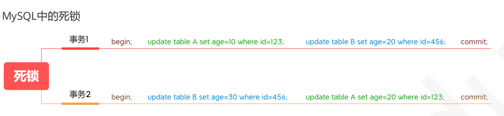

```bash
#查看innodb状态，可以查看锁信息
show engine innodb status;
#查看正在进行中的事务
SELECT * FROM information_schema.INNODB_TRX;
#查看锁
SELECT * FROM information_schema.INNODB_LOCKS;
#MySQL8.0.13 及以后使用此语句查看锁
SELECT * FROM performance_schema.data_locks;
#查看锁等待
SELECT * FROM information_schema.INNODB_LOCK_WAITS;
#MySQL8.0.13及以后使用此语句查看锁等待
SELECT * FROM performance_schema.data_lock_waits;
```

```bash
#查看正在进行的事务
mysql> SELECT * FROM information_schema.INNODB_TRX\G
#查看所有线程
mysql> show processlist\G
```

```bash
mysql> show engine innodb status;
mysql> SELECT * FROM information_schema.INNODB_TRX\G
show processlist\G

```

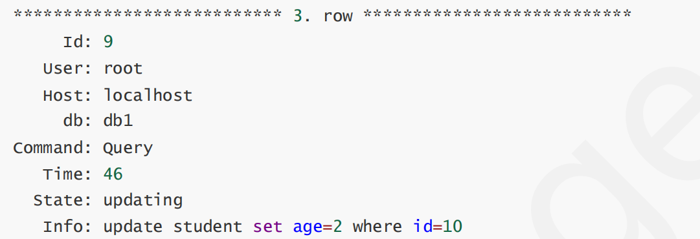

```bash
mysql> kill 9;
#杀掉未完成的事务
mysql> kill 10;
ERROR 1317 (70100): Query execution was interrupted
MariaDB [testdb]> kill 11;
Query OK, 0 rows affected (0.001 sec)
```

```bash
#查看事务锁的超时时长，默认50s
mysql> show global variables like 'innodb_lock_wait_timeout';
```

#### 1.6.5.5事务隔离级别

**读未提交** **READ UNCOMMITTED** 字面意思

在读未提交隔离级别下，事务A可以读取到事务B修改过但未提交的数据。可能发生脏读、不可重复读和幻读问题，一般很少使用此隔离级别。

**读已提交** **READ COMMITTED**  字面意思

在读已提交隔离级别下，事务B只能在事务A修改过并且已提交后才能读取到事务B修改的数据。读已提交隔离级别解决了脏读的问题，但可能发生不可重复读和幻读问题，一般很少使用此隔离级别。**不可重复读指的是在同一事务内，不同的时刻读到的同一批数据可能是不一样的**，上下两个read执行之间，有事务提交修改

**可重复读** **REPEATABLE READ** 

在可重复读隔离级别下，事务B只能在事务A修改过数据并提交后，自己也提交事务后，才能读取到事务B修改的数据。可重复读隔离级别解决了脏读和不可重复读的问题，但可能发生幻读问题。**MVCC解决不可重复读**

**可串行化** **SERIALIZABLE**

可串行化，又称序列化。各种问题（脏读、不可重复读、幻读）都不会发生，通过加锁实现（读锁和写锁）。


MySQL的InnoDB存储引擎使用多版本并发控制（MVCC, Multi-Version Concurrency Control）技术来实现可重复读。在这种机制下，每个事务都会看到数据的一个快照，这个快照基于事务开始时的数据状态，而不是依赖于锁定数据行。这样，在同一事务内，无论何时执行相同的查询，都会得到一致的结果，不受其他事务的影响，同时也允许更高的并发度，因为不需要给数据行加写锁来维护一致性视图。

**幻读**

一个事务先根据某些条件查询出一些记录，之后另一个事务又向表中插入了符合这些条件的记录，原先的事务再次按照该条件查询时，能把另一个事务插入的记录也读出来。（幻读在读未提交、读已提交、可重复读隔离级别都可能会出现）

**MVCC****和事务的隔离级别**

MVCC（多版本并发控制机制）只在 READ COMMITTED 和 REPEATABLE READ 两个隔离级别下工作。其他两个隔离级别都和 MVCC 不兼容，因为 READ UNCOMMITTED总是读取最新的数据行，而不是符合当前事务版本的数据行。而SERIALIZABLE则会对所有读取的行都加锁。

```bash
#MySQL8.0及以后
mysql> select @@transaction_isolation;
#MySQL8.0以前及Mariadb
MariaDB [(none)]> select @@tx_isolation;
```

## 1.7日志管理

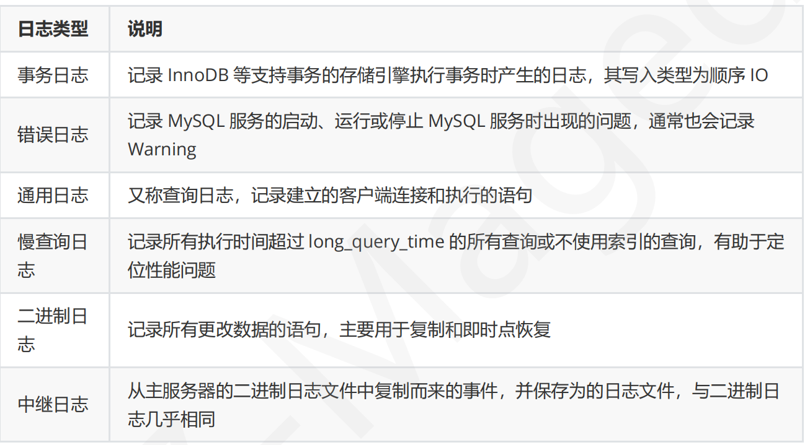

### 1.7.1事务日志

InnoDB 引擎使用 force log at commit 机制**实现事务的持久性**，即在事务提交的时候，必须先将与其相关的日志写到磁盘上的 redo log file 和 undo log file 文件中进行持久化。

事务日志是连续的磁盘空间，因此IO是顺序的，性能比较高，可以保证数据及时写入事务日志。InnoDB 引擎使用日志来减少提交事务时的开销。

**redo log** **重做日志**

InnoDB 引擎对数据更新时，先将更新记录写入到 redo log 的 buffer 中，而后在系统空闲的时候或者是按照设定的更新策略再将日志中的内容更新到磁盘之中。然后再将 commit 的事务的相关数据落盘，也就是说，**先写日志，再去修改对应的 MySQL 中的数据文件**，这就是所谓的预写式技术（Write Ahead logging）。如果事务在 commit 之后数据落盘时失败，则下次启动 MySQL 时，可以根据己经保存的 redo log 再次进行操作，保证 commit 提交成功。当然，如果 redo log 也写失败了，那么这段时间内的commit 就丢失了。

redo log 通常是物理日志，用来保证事务的原子性，持久性。

**undo log** **回滚日志**

**保存与执行的操作相反的操作**，即记录某数据被修改前的值，可以用来在事务失败时进行回滚到某行记录的某个版本，其具体流程与 redo log 相似，也要**先于 commit 数据落盘**，更改对应的 MySQL 数据文件之前保存。

undo log 通常是逻辑日志，用来保证事务的原子性， 帮助事务回滚以及MVCC功能

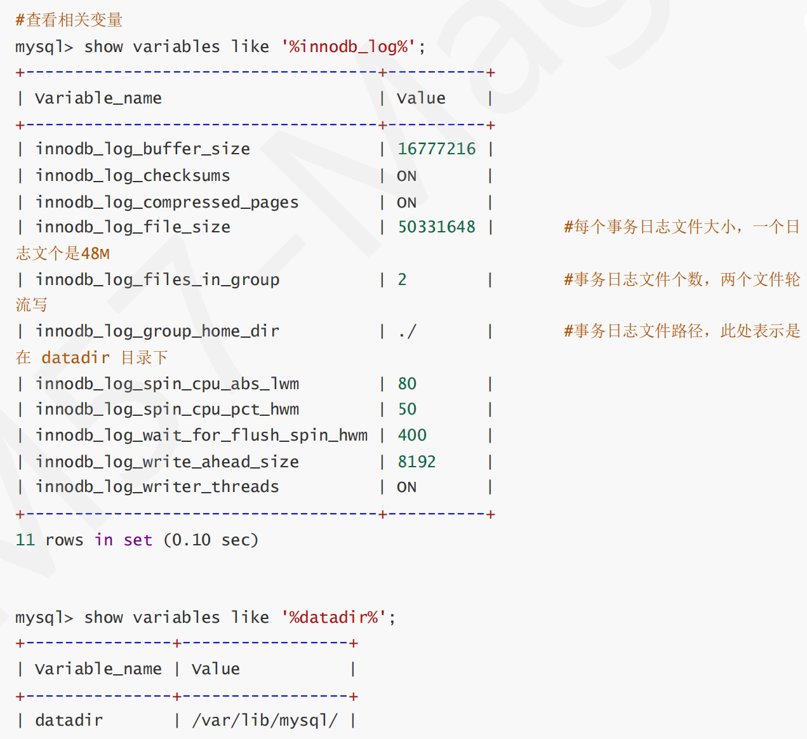

```bash
#查看相关文件-redo log
[root@m52 ~]# ll /var/lib/mysql/ib_logfile* -h

#修改保存位置
[root@m52 ~]# vim /etc/my.cnf
[mysqld]
innodb_log_group_home_dir=/ib_log/

#查看版本
mysql> select version();
MariaDB [(none)]> show variables like '%datadir%';
mysql> show variables like '%innodb_redo_log_capacity%';

#当定义了innodb_redo_log_capacity设置时，将忽略innodb_log_files_in_group, innodb_og_file_size设置
#如果没有定义innodb_redo_log_capacity时，将使用innodb_log_files_in_group * innodb_log file_size来当作capacity值
#如果没有设置这些变量，重做日志容量将设置为innodb_redo_log_capacity默认值，即104857600字节（100MB）
#最大重做日志容量为128GB。
```


```bash
[root@rocky86 ~]# ls /var/lib/mysql/#innodb_redo/
#重做日志文件有两种类型，普通和备用。普通重做日志文件是正在使用的文件。备用重做日志文件是那些等待使用的文件。
#InnoDB尝试维护总共32个重做日志文件，每个文件的大小等于1/32*InnoDB_redo_log_capacity。
#其命名规则为 #ib_redoN，N为重做日志文件编号，备用文件由_tmp后缀表示。
```

**事务日志性能优化**

redo log 包含日志缓冲（redo log buffer）和磁盘上的日志文件（redo logfile）两部分。

MySQL 每执行新一条 DML 语句都会先将日志记录在 redo log buffer 中，然后再根据不同的配置项，使用不同的规则将 redo log buffer 中的数据落盘（写入到 redo log file）。

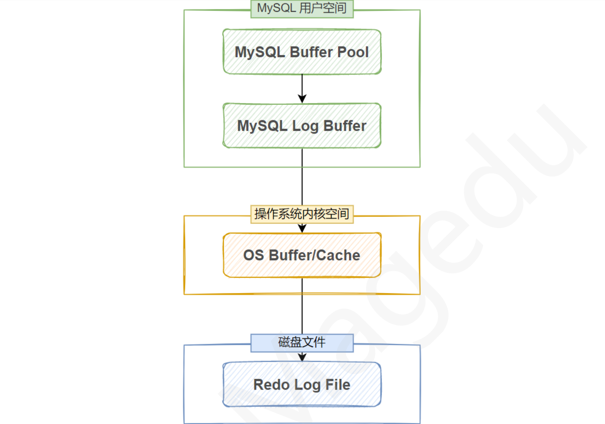

MySQL 通过 innodb_flush_log_at_trx_commit 配置来控制 redo log 的落盘规则。

0：延迟写，事务提交时会将数据写到 Log Buffer，但不会立即写 OS Buffer 和 Log File，而是每隔1S，批量的将数据写到 OS Buffer 并调用 fsync() 写磁盘文件。如果系统崩溃则会丢失 1S 的数据。

1：实时写，每次提交事务后都会将数据写入 OS Buffer 再写磁盘文件，这种方式几乎不会丢失数据，但性能较差。

2：实时写，延时落盘，每次提交事务都会将数据写入 OS Buffer，但写磁盘也是 1S 执行一次，这是一个相对折中的方案

```bash
#默认值为 1
mysql> show variables like '%innodb_flush_log_at_trx_commit%';

#调用存储过程写数据
mysql> call sp_testlog;

#在写数据的过程中可以用 iotop 或 vmstat 1 命令查看磁盘IO
```

### 1.7.2错误日志

MySQL 中错误日志中记录的主要内容

mysqld 启动和关闭过程中输出的事件信息

mysqld 运行中产生的错误信息

event scheduler 运行一个 event 时产生的日志信息

在主从复制架构中的从服务器上启动从服务器线程时产生的信息

```bash
#文件位置
mysql> select @@log_error;

#在配置文件中修改
[root@rocky86 ~]# vim /etc/my.cnf
[mysqld]
log-error=/data/mysqld.log
```

```bash
#定义错误日志记录的级别
mysql> select @@log_error_verbosity;
```

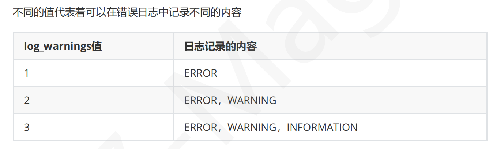

### 1.7.3通用日志

通用日志，又称通用查询日志（General Query Log），用来**记录对数据库的所有操作，包括启动和关闭 MySQL 服务、更新语句和查询语句等**。**默认情况下，通用查询日志功能是关闭的**。可以通过配置开启此日志，并决定将日志存储到文件或数据表中。如果选择记录到数据表中，则具体的表是mysql.general_log

```bash
#相关配置项
#general_log=0|1 是否开启通用日志
#general_log_file=/path/log_file 日志文件
#log_output=FILE|TABLE|NONE 记录到文件中还是记录到表中
#查看默认配置
mysql> select @@general_log,@@general_log_file,@@log_output;


#修改参数，将日志记录到表中
mysql> select * from mysql.general_log;
Empty set (0.00 sec)
#修改配置
mysql> set global log_output="TABLE";

#查表,MySQL中此表的内容被加密，但 MariaDB 中可以直接查看
mysql> select * from mysql.general_log\G

#日志表使用 CSV 引擎
mysql> use mysql;
mysql> show table status like 'general_log'\G

#对应的文件，可以直接打开
[root@rocky86 ~]# cat /var/lib/mysql/mysql/general_log.CSV
```

### 1.7.4慢查询日志

慢查询日志用来记录在 MySQL 中执行时间超过指定时间的查询语句。通过慢查询日志，可以查找出哪些查询语句的执行效率低，以便进行优化。慢查询日志默认不开启。

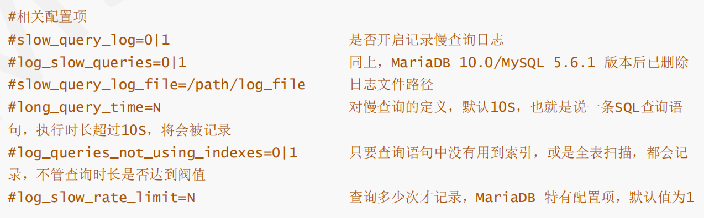

```bash
#查看默认配置
mysql> select @@slow_query_log,@@slow_query_log_file,@@long_query_time;
```

**慢查询分析工具** **mysqldumpslow**

```bash
[root@rocky86 ~]# which mysqldumpslow 
/usr/bin/mysqldumpslow
#官方工具
[root@rocky86 ~]# rpm -qf /usr/bin/mysqldumpslow 
mysql-server-8.0.30-1.module+el8.6.0+1057+4d6a1721.x86_64
```

```bash
[root@rocky86 ~]# mysqldumpslow /var/lib/mysql/rocky86-slow.log
#指定行数
[root@rocky86 ~]# mysqldumpslow -t 2 /var/lib/mysql/rocky86-slow.log
#显示具体
[root@rocky86 ~]# mysqldumpslow -a -t 3 /var/lib/mysql/rocky86-slow.log
```

### 1.7.5二进制日志

二进制日志（Binary Log）也可叫作变更日志（Update Log）

即 **SQL 语句的 DDL 和 DML 语句**，但不包含查询操作语句，因为查询语句并不会改变数据库中的数据。

如果 MySQL 数据库意外停止，可以通过二进制日志文件来查看用户执行了哪些操作，对数据库服务器文件做了哪些修改，然后根据二进制日志文件中的记录来恢复数据库服务器。

自 MySQL8.0 开始，默认开启了二进制日志功能，之前版本默认是关闭二进制日志的。

**事务日志和二进制区别**

事务日志可以看作是在线日志，二进制日志可以看作是离线日志

事务日志记录事务执行的过程，包括提交和未提交，二进制日志记录只记提交的过程

事务日志只支持 InnoDB 存储引擎，二进制支持 InnoDB 和 MyISAM 存储引擎

**二进制日志记录三种格式**

```bash
#原始SQL语句
insert into t1 (age,add_time)values(10,now());#2023-12-01 17:57:10
#Statement 日志  原生
insert into t1 (age,add_time)values(10,now());

#Row 日志, 基于行的记录模式， SQL 语句中的变量和函数进行替换后再记录。
insert into t1 (age,add_time)values(10,'2023-01-01 16:02:34');
```

Mixed：混合记录模式，在此模式下，MySQL 会根据具体的 SQL 语句来分析采用哪种模式记录日志

**相关配置和服务器变量**

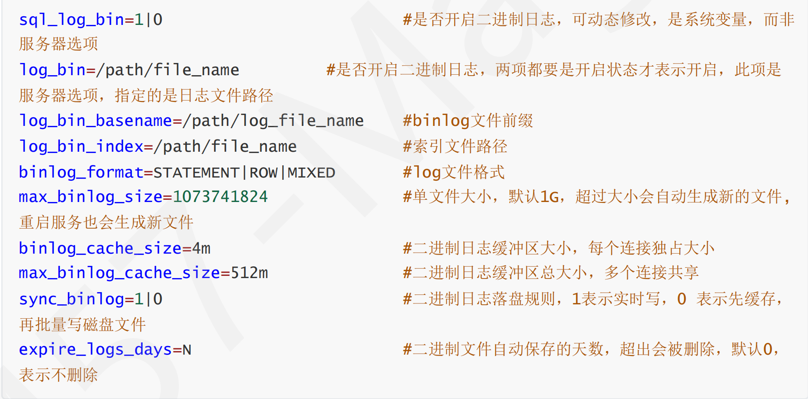

```bash
#MySQL8.0以后默认开启二进制日志
mysql> select @@log_bin,@@sql_log_bin,@@log_bin_basename,@@log_bin_index,@@binlog_format,@@max_binlog_size\G

#MySQL中默认开启，查看相关文件
[root@rocky86 ~]# ll -h /var/lib/mysql/binlog.*
-rw-r----- 1 mysql mysql 157 Jan  1 18:58 /var/lib/mysql/binlog.000001
-rw-r----- 1 mysql mysql  16 Jan  1 18:58 /var/lib/mysql/binlog.index
```

```bash
#修改相关配置
#log_bin是服务器选项，只能写配置文件,在此处是显示成0|1，但实际上要配置成路径

#修改属主属组
[root@rocky86 ~]# chown -R mysql.mysql /mysql/log/
#修改配置文件
[root@rocky86 ~]# vim /etc/my.cnf
[mysqld]
log_bin=/mysql/log/binlog
```

#### **查看二进制日志具体内容**

```bash
#范例
mysqlbinlog --start-position=678 --stop-position=752 /mysql/log/binlog.000001 -v

mysqlbinlog --start-datetime="2018-01-30 20:30:10" --stop-datetime="2018-01-30 20:35:22" /mysql/log/binlog.000001 -v
```

```bash
#修改日志类型
[root@rocky86 ~]# vim /etc/my.cnf
[mysqld]
binlog_format=statement
log_bin=/mysql/log/binlog

#重启服务，重启会生成新的日志文件
[root@rocky86 ~]# systemctl restart mysqld.service
#再次查询
mysql> select @@binlog_format
```

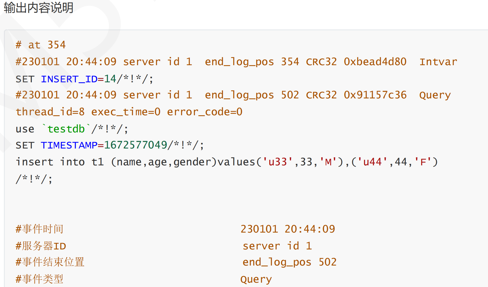


**查看当前服务的二进制文件列表**

```bash
mysql> show master logs;
mysql> show binary logs;
```

**查看正在使用的二进制文件**

```bash
SHOW MASTER STATUS
```

**查看二进制日志中的事件**

```bash
show binlog events [IN 'log_name'] [FROM pos] [LIMIT [offset,] row_count];
```

**刷新二进制日志文件**

默认情况下，当前使用的二进制文件达到设置大小后，会重新生成新的二进制文件。除此之外，也可以手动刷新二进制日志文件

```bash
mysql> show binary logs;
#重启服务
[root@rocky86 ~]# systemctl restart mysqld.service
#再次查询
mysql> show binary logs;
```

```bash
#命令刷新
mysql> flush logs;
mysql> show binary logs;
```

```bash
#mysqladmin 工具刷新
[root@rocky86 ~]# mysqladmin flush-logs
```

**清理二进制日志**

清理二进制日志会删除日志文件，并更新索引文件

```bash
#根据条件部份清理
PURGE { BINARY | MASTER } LOGS { TO 'log_name' | BEFORE datetime_expr }
#全部清理，并重新生成日志文件，默认从1开始，一般在 master 主机第一次启动时执行此操作
#MySQL8.0和 MariaDB 10.1.6 开始支持 to N,从指定文件开始
RESET MASTER [TO N];
```

```bash
mysql> show binary logs;
#删除 binlog.000002 之前的日志
mysql> PURGE BINARY LOGS TO 'binlog.000002';

#清理 2022-12-31 之前的日志
mysql> PURGE BINARY LOGS BEFORE '2022-12-31';

#清理 2023-01-01 21:00:00 之前
mysql> PURGE BINARY LOGS BEFORE '2023-01-01 21:00:00';

#重置，默认从1开始
mysql> reset master;

#重置，从10开始
mysql> reset master to 10;
```

**二进制日志远程同步**

二进制日志远程同步存在一定的延迟，要取决于网络状况，数据量等

```bash
#10.0.0.164主机
mysql> show binary logs;
#10.0.0.183主机，要求客户端工具与服务端保持同一版本，且远程用户有所有权限
#同步远程主机二进制日志到本地，从000002 开始，且保持同步，只要此进程不关闭，可以一直保持同步
[root@rocky86 binlog]# mysqlbinlog -R --host=10.0.0.164 --user=root --password=123456 --raw --stop-never binlog.000002
```

服务端主机如果重置了日志，则客户端主机也需要从新开始同步

```bash
#164 master 主机重置日志
mysql> reset master;

#183主机上的同步进程会自动断开
[root@rocky86 binlog]# mysqlbinlog -R --host=10.0.0.164 --user=root --password=123456 --raw --stop-never binlog.000002

#但183上原有的，己同步的日志还在

#用相同的条件无法继续同步
[root@rocky86 binlog]# mysqlbinlog -R --host=10.0.0.164 --user=root --password=123456 --raw --stop-never binlog.000002

#删除
[root@rocky86 binlog]# rm -f *

#从000001开始
[root@rocky86 binlog]# mysqlbinlog -R --host=10.0.0.164 --user=root --password=123456 --raw --stop-never binlog.000001
```

服务端主机如果重启了 MySQL 服务，则客户端主机可以继续增量同步

## 1.8mysql备份恢复

### 1.8.1备份简要

**备份内容**

数据库备份内容主要包括以下几个方面

数据库中的数据

二进制日志，InnoDB 事务日志

用户账号，权限配置，程序代码（视图，存储过程，触发器，事件调度器）

相关配置文件

**备份策略**

**还原要点**

备份文件要异地(不同服务器)存放

做还原测试

制定备份标准：将备份与还原流程进行规范化与制度化，形成技术文档

**备份工具**

#### 冷备份和还原的实现

```bash
#10.0.0.164主机
#停止服务
[root@rocky86 ~]# systemctl stop mysqld.service
#备份到远程主机，用SCP命令也可以
#如果配置文件有修改，则也需要备份
[root@rocky86 ~]# rsync -a /var/lib/mysql root@10.0.0.183:/root/data/
```

在远程主机上还原，远程主机上的MySQL 版本和配置，必须要与备份机上的保持一致

```bash
#10.0.0.183 远程主机上查看
[root@rocky86 ~]# ll /root/data/
#在10.0.0.183主机上还原
[root@rocky86 ~]# mv /root/data/mysql /var/lib/

#远程主机开启服务
[root@rocky86 ~]# systemctl start mysqld.service
#测试
mysql> show databases;
```

### 1.8.2mysqldump 备份工具

**mysqldump** **说明**

mysqldump 是 MySQL 官方提供的客户端备份工具，通过 mysql 协议连接至 mysql 服务器进行备份，mysqldump 命令是将数据库中的数据备份成一个文本文件，数据表的结构和数据都存储在生成的文本文件中

**MyISAM** **引擎相关选项**

MyISAM 不支持事务，只能支持温备；不支持热备，所以必须先锁定要备份的库，而后启动备份操作，可读不可写

**InnoDB** **引擎相关选项**

InnoDB 存储引擎支持事务，可以利用事务的相应的隔离级别，实现热备，也可以实现温备但不建议用

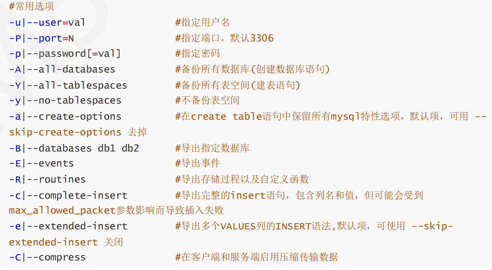

**InnoDB建议备份策略**

```bash
mysqldump -uroot -p123456 -A -F -E -R --triggers --single-transaction --master-data=2 --flush-privileges --default-character-set=utf8 --hex-blob > ${BACKUP}/fullbak_${BACKUP_TIME}.sql
#用gzip压缩

#新版8.0.26以上
mysqldump -uroot -p123456 -A -F -E -R --triggers --single-transaction --source-data=2 --flush-privileges --default-character-set=utf8 --hex-blob > 
${BACKUP}/fullbak_${BACKUP_TIME}.sql

#选项说明
-A #备份所有数据库
-F #刷新日志
-E #导出事件
-R #导出存储过程以及自定义函数
--triggers #导出触发器
--single-transaction #以开启事务的方式备份数据
--master-data=2 #备份日志信息
--source-data=2 #备份日志信息
--flush-privileges #导出后刷新权限
--default-character-set=utf8 #设置字符集
--hex-blob #使用十六进制转储二进制
```

MyISAM建议备份策略

```bash
mysqldump -uroot -p123456 -A -F -E -R -x --master-data=1 --flush-privileges --
triggers --default-character-set=utf8 --hex-blob > 
${BACKUP}/fullbak_${BACKUP_TIME}.sql
```

#### mysqldump 备份和还原实现

**备份指定数据库中的数据**

此种备份方式并不会备份数据库结构，只备份表和数据

```bash
#只备份 testdb 数据库
[root@rocky86 ~]# mysqldump -uuser1 -p123456 testdb > /data/testdb-bak.sql

#查看文件，此文件中并没有创建数据库的语句，还原时要指定数据库
[root@rocky86 ~]# ll /data/testdb-bak.sql -h

#测试还原，还原的时候要指定数据库，如果数据库不存在，要在还原前手动创建
[root@rocky86 ~]# mysql -uuser1 -p123456 testdb < /data/testdb-bak.sql
```

**备份数据库结构和数据**

```bash
[root@rocky86 ~]# mysqldump -uuser1 -p123456 -B testdb2 > /data/testdb2-bak.sql
```

**备份所有数据库**

```bash
[root@rocky86 ~]# mysqldump -uuser1 -p123456 -A > /data/all-bak.sql

#备份时可以开启压缩，减小文件体积
[root@rocky86 ~]# mysqldump -uuser1 -p123456 -A |gzip > /data/all-bak.sql.gz

#查看具体备份了哪些数据库
[root@rocky86 ~]# cat /data/all-bak.sql | grep -i "^create database"
```

**在配置中指定用户名和密码**

```bash
[root@rocky86 ~]# vim /etc/my.cnf
#仅指定 mysql 客户端
[mysql]
user=user1
password=123456
#仅指定 mysqladmin 客户端
[mysqladmin]
user=user1
password=123456

#仅指定 mysqldump 客户端
[mysqldump]
user=user1
password=123456
#所有客户端
[client]
user=user1
password=123456
```

#### 实现数据库备份脚本

```bash
[root@rocky86 0104]# vim backup.sh
UNAME=root
PWD=123456
HOST=10.0.0.158
IGNORE='Database|information_schema|performance_schema|sys'
YMD=`date +%F`
if [ ! -d /backup/${YMD} ];then
 mkdir -pv /backup/${YMD}
fi
DBLIST=`mysql -u${UNAME} -p${PWD} -h${HOST} -e "show databases;" 2>/dev/null | 
grep -Ewv "$IGNORE"`
for db in ${DBLIST};do
mysqldump -u${UNAME} -p${PWD} -h${HOST} -B $db 2>/dev/null 
1>/backup/${YMD}/${db}_${YMD}.sql
 
 if [ $? -eq 0 ];then
 echo "${db}_${YMD} backup success"
 else
 echo "${db}_${YMD} backup fail"
 fi
done

#测试
[root@rocky86 0104]# chmod a+x backup.sh

#还原测试
[root@rocky86 0104]# mysql -uuser1 -p123456 < /backup/testdb_2023-01-04.sql
```

**保存二进制日志位置信息**

在备份日志中记录备份时的二进制日志信息，后续通过此备份进行恢复，还是会缺少一部份数据，这一部份数据，则可以通过当前的二进制日志与备份文件中的二进制信息进行对比得到。

```bash
#--source-data 选项值默认是1，1就不会是注释

[root@rocky86 0104]# mysqldump -uuser1 -p123456 --source-data=2 -B testdb > /data/testdb-bak4.sql

#保存了二进制POS位置信息，但是被注释
[root@rocky86 0104]# cat /data/testdb-bak4.sql | grep "CHANGE MASTER"
-- CHANGE MASTER TO MASTER_LOG_FILE='binlog.000008', MASTER_LOG_POS=16682818;
```

查看当前正在使用的日志

```bash
mysql> show master logs;

mysql> show master status;
```

范例：利用备份中记录的二进制 POS 信息选择性恢复

场景：

上午9点执行了完全备份

上午10点误操作删除了数据库中的某张表

上午11点发现该表被误删除，现要求恢复数据

```bash
#开始恢复
#先停止MySQL服务
[root@rocky86 0104]# systemctl stop mysqld.service
#查看完全备份中的 CHANGE 信息
[root@rocky86 0104]# cat /data/testdb-bak.sql | grep "CHANGE"
CHANGE MASTER TO MASTER_LOG_FILE='binlog.000008', MASTER_LOG_POS=16686058;
#导出 16686058 之后的binglog中的数据
[root@rocky86 0104]# mysqlbinlog --start-position=16686058 
/mysql/log/binlog.000008 > /backup/logbin.sql
#可以看到DROP语句，还原的时候去掉就行了
[root@rocky86 0104]# grep -i "drop" /backup/logbin.sql
DROP TABLE `t1` /* generated by server */
#拷贝到原程主机还原
[root@rocky86 0104]# scp /data/testdb-bak.sql /backup/logbin.sql root@10.0.0.183:/root/backup/
```

```bash
#临时禁用远程主机上的二进制日志
mysql> set sql_log_bin=0;
#导入完全备份
mysql> source /root/backup/testdb-bak.sql
#导入二进制日志
mysql> source /root/backup/loginbin.sql

#导入的时候临时关闭二进制日志
```

骑行轨迹保留一年，备份三年

### 1.8.3xtrabackup 备份工具

Xtrabackup 是 percona 公司开发的一款 MySQL 数据库备份工具，支持对 InnoDB 引擎和 XtraDB 引擎进行热备。

XtraDB 存储引擎是由 Percona 开发的一款 MySQL 数据库的高性能存储引擎，其目的是用来代替InnoDB 存储引擎，可用于需要更高性能的环境。

```bash
#下载地址-8.0
https://www.percona.com/downloads/Percona-XtraBackup-LATEST/
#下载地址-2.4
https://www.percona.com/downloads/Percona-XtraBackup-2.4/LATEST/
#文档地址-8.0
https://docs.percona.com/percona-xtrabackup/8.0/index.html
#文档地址-2.4
https://docs.percona.com/percona-xtrabackup/2.4/index.htm
```

XtraBackup8.0 适配 MySQL8.0 及以后的版本，XtraBackup2.4 适配 MySQL5.7 及以前的版本，要根据MySQL的版本不同选择不同版本的 XtraBackup 来进行备份。

**XtraBackup** **特点**

备份还原过程快速、可靠

备份过程不会打断正在执行的事务

能够基于压缩等功能节约磁盘空间和流量

自动实现备份检验

开源，免费

```bash
#先安装官方源
[root@rocky86 ~]# yum install https://repo.percona.com/yum/percona-release-latest.noarch.rpm
#搜索
[root@rocky86 ~]# yum search "percona-xtrabackup"

#安装
[root@rocky86 ~]# yum install percona-xtrabackup-80

#查看
[root@rocky86 ~]# yum info percona-xtrabackup-80
```


**rpm** **包安装**

```bash
#下载rpm包
[root@rocky86 ~]# wget https://downloads.percona.com/downloads/PerconaXtraBackup-LATEST/Percona-XtraBackup-8.0.30-23/binary/redhat/8/x86_64/percona-xtrabackup-80-8.0.30-23.1.el8.x86_64.rpm

#使用yum安装来解决依赖
[root@rocky86 ~]# yum install ./percona-xtrabackup-80-8.0.30-23.1.el8.x86_64.rpm

#查看
[root@rocky86 ~]# yum info percona-xtrabackup-80
```

#### **xtrabackup** **使用**

**xtrabackup** **实现完全备份和还原**

```bash
#创建目录
[root@rocky86 ~]# mkdir /backup/
#开始备份
[root@rocky86 ~]# xtrabackup -uuser1 -p123456 --backup --target-dir=/backup/base
```

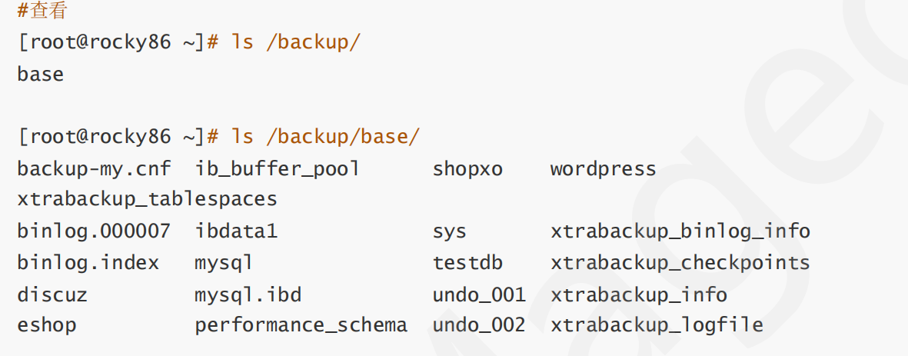

```bash
#备份时的相关信息
[root@rocky86 ~]# cat /backup/base/xtrabackup_info
#检查点相关信息
[root@rocky86 ~]# cat /backup/base/xtrabackup_checkpoints
```

```bash
#远程主机需要安装相同版本的xtrabackup，相同版本的MySQL
#查看
[root@rocky86 ~]# du -sh backup/
133M backup/
#执行还原前的整理，将备份时没提交的事务进行回滚
[root@rocky86 ~]# xtrabackup --prepare --target-dir=/root/backup/base

#开始还原
[root@rocky86 ~]# xtrabackup --copy-back --target-dir=/root/backup/base --datadir=/var/lib/mysql
#修改权限
[root@rocky86 ~]# chown -R mysql.mysql /var/lib/mysql/*

#启动MySQL服务查看
[root@rocky86 ~]# systemctl start mysqld.service
```


**LSN** **log sequence number** **日志序列号**

在 InnoDB 存储引擎中，LSN 占用8字节空间大小。LSN 的值会随着日志的写入而逐渐增大。InnoDB 存储引擎是通过 LSN 来标记相关内容的版本。不同的 LSN 有不同的含义。

LSN不仅存在于重做日志中，在每个数据页头部也会有对应的LSN号。在数据页头部，LSN记录当前页最后一次修改的LSN号，用于在recovery 时对比重做日志 LSN 号决定是否对该页进行恢复数据。checkpoint 也是有 LSN 号记录的，LSN 号串联起一个事务开始到恢复的过程。

```bash
mysql> show engine innodb status\G
```

**xtrabackup** **实现增量备份和还原**

增量备份是在完全备份的基础上进行的


数据还原时注意，还原顺序一定要正确，先还原完全备份的数据，再还原第一次增量备份的数据，再还原第二次增量备份的数据，如果有多个增量备份，也是按照此规则进行还原。**另外，在还原时，只有最后一次的备份文件还原时需要进行事务回滚，之前的都不用回滚**。

```bash
#第一次增量备份，基于/backup/base 做增量备份
[root@rocky86 ~]# xtrabackup -uuser1 -p123456 --backup --target-dir=/backup/inc1 --incremental-basedir=/backup/base
```

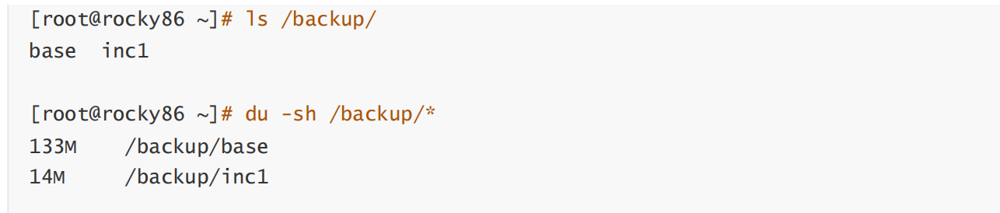

```bash
#第二增量备份，基于上一次的增量备份数据进行
[root@rocky86 ~]# xtrabackup -uuser1 -p123456 --backup --target-dir=/backup/inc2 --incremental-basedir=/backup/inc1

#复制到远程主机
[root@rocky86 ~]# scp -r /backup/* root@10.0.0.164:/root/backup/
```

```bash
#还原前整理
#整理全量备份数据，不回滚
[root@rocky86 ~]# xtrabackup --prepare --apply-log-only --target-dir=/root/backup/base

#整理第一次增量备份数据，不回滚
[root@rocky86 ~]# xtrabackup --prepare --apply-log-only --target-dir=/root/backup/base --incremental-dir=/root/backup/inc1

#整理第二次增量备份数据，需要回滚
[root@rocky86 ~]# xtrabackup --prepare --target-dir=/root/backup/base --incremental-dir=/root/backup/inc2
```

```bash
#停止MySQL服务
[root@rocky86 ~]# systemctl stop mysqld.service
#删除数据目录内容
[root@rocky86 ~]# rm -rf /var/lib/mysql/*
#还原数据
[root@rocky86 ~]# xtrabackup --copy-back --target-dir=/root/backup/base --datadir=/var/lib/mysql/
#修改文件权限
[root@rocky86 ~]# chown -R mysql.mysql /var/lib/mysql/*

#启动服务
[root@rocky86 ~]# systemctl start mysqld.service 
#测试
[root@rocky86 ~]# mysql -uuser1 -p123456 -e "select * from testdb.t1;"
```

**xtrabackup** **实现单表备份和还原**

```bash
xtrabackup -uuser1 -p123456 --backup --target-dir=/backup/db1_stu --databases='db1' --tables='stu'
```

## 1.9MySQL 集群

### 1.9.1MySQL 集群介绍

**服务性能扩展的两个方向**

**横向扩展**：

又称向外扩展，水平扩展，规模扩展等，常用英文 Scale Out，Scale horizontally 来表示，一般采用新增节点的方式，增加服务节点的规模来解决性能问题，比如，当一台机器不够用时，可以再增**加一台机器或几台机器来分担流量和业务**

**纵向扩展**：

又称向上扩展，垂直扩展，性能扩展等，常用英文 Scale Up，Scale vertically 来表示，一般采用**升级服务器硬件**，增加资源供给，修改服务配置项等方式来解决性能问题，**比如，将服务器由32G内存升级成128G内存，将服务最大并发数由128调整到256等**。

### 1.9.2MySQL 主从复制

#### 1.9.2.1主从复制架构和原理

在主从复制架构中，将 MySQL 服务器分为主服务器(Master)和从服务器(Slave)两种角色，主服务器负责数据写入(insert，update，delete，create 等)，从服务器负责提供查询服务(select 等)。

MySQL 主从架构属于向外扩展方案，主从节点都有相同的数据集，其**基于二进制日志的单向复制来实现，复制过程是一个异步的过程。**

**主从复制的优点**

负载均衡读操作

数据库备份：主从节点上都有相同的数据集，从而也实现了数据库的备份

高可用和故障切换：主从架构由两个或多个服务节点构成，在某个节点不可用的情况下，可以进行转移和切换，保证服务可用

MySQL升级：当 MySQL 服务需要升级时，由于主从架构中有多个节点，可以逐一升级，而不停止服务

**缺点**

数据延时

性能消耗：主从复制需要开启单独线程，会消耗一定资源

**数据不对齐：如果主从复制服务终止，而且又没有第一时间恢复，则从节点的数据一直无法更新**

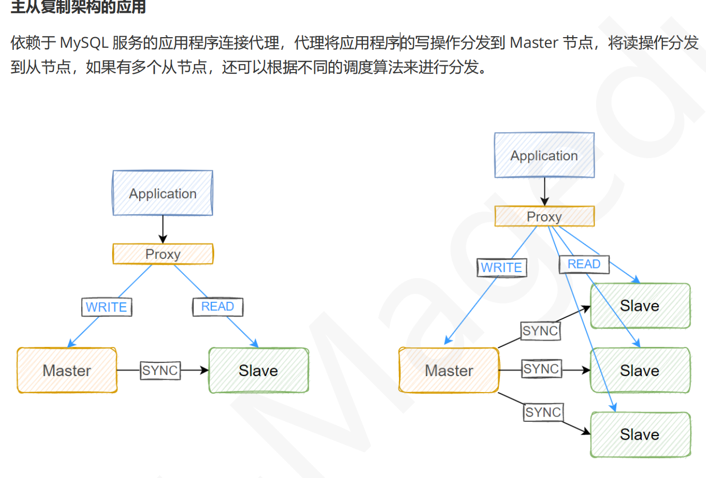

**主从复制工作原理**

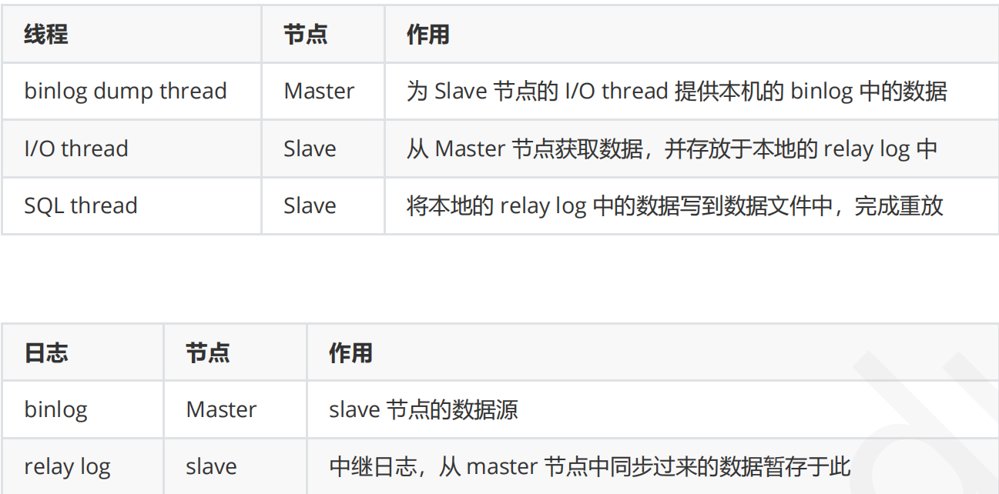

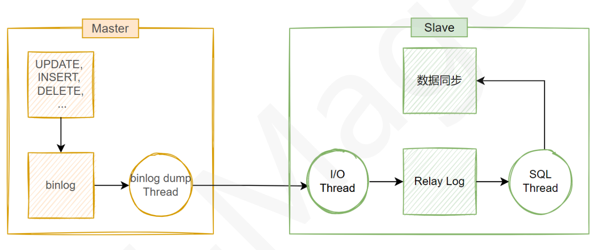

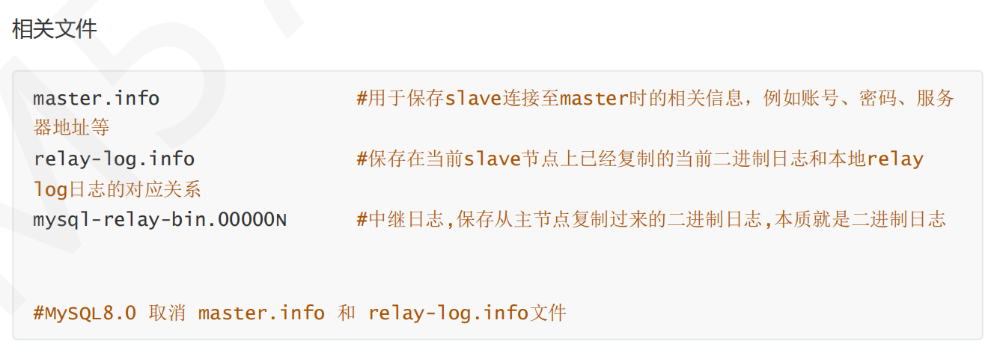

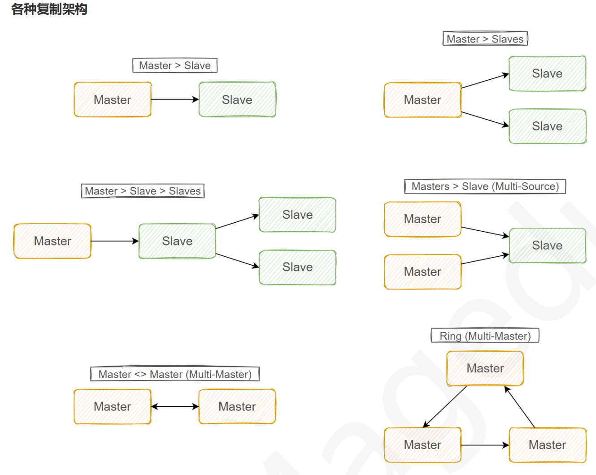

#### 1.9.2.2主从复制配置

**主节点配置**

```bash
[mysqld]
log_bin=/data/logbin/mysql-bin #启用二进制日志 
server-id=N #为当前节点设置全局唯一ID
#server-id的取值范围
#1 to 4294967295 (>= MariaDB 10.2.2)，默认值为1，MySQL8.0默认值为1
#0 to 4294967295 (<= MariaDB 10.2.1)，默认值为0，如果从节点为0，所有master都将拒绝此slave的连接
#可以使用当前主机节点的最后一位IP作为server-id
```

查看从二进制日志的文件和位置开始进行复制

```bash
show master status;
```

创建有复制权限的用户账号

```bash
GRANT REPLICATION SLAVE ON *.* TO 'repluser'@'HOST' IDENTIFIED BY 'replpass';
#MySQL8.0 分成两步实现
mysql> create user repluser@'10.0.0.%' identified by '123456';
mysql> grant replication slave on *.* to repluser@'10.0.0.%';
```

**从节点配置**

```bash
[mysqld]
server_id=N #为当前节点设置一个全局惟的ID号
log-bin #开启从节点二进制日志
read_only=ON #设置数据库只读，针对supper user无效
relay_log=relay-log #relay log的文件路径，默认值hostname-relay-bin
relay_log_index=relay-log.index #默认值hostname-relay-bin.index
```

使用有复制权限的用户账号连接至主服务器，并启动复制线程

```bash
#在从节点上执行下列SQL语，提供主节点地址和连接账号，用户名，密码，开始同步的二进制文件和位置等。
CHANGE MASTER TO MASTER_HOST='masterhost', #指定master节点
MASTER_USER='repluser', #连接用户
MASTER_PASSWORD='replpass', #连接密码
MASTER_LOG_FILE='mariadb-bin.xxxxxx', #从哪个二进制文件开始复制
MASTER_LOG_POS=123, #指定同步开始的位置
MASTER_DELAY = interval; #可指定延迟复制实现防止误操作,单位秒，这里可以用作延时同步，一般用于备份
START SLAVE [IO_THREAD|SQL_THREAD]; #启动同步线程
STOP SLAVE #停止同步
RESET SLAVE ALL #清除同步信息
SHOW SLAVE STATUS; #查看从节点状态
SHOW RELAYLOG EVENTS in 'relay-bin.00000x'; #查看relaylog 事件
#可以利用 MASTER_DELAY 参数设置从节点延时同步，用作主从备份，比如设置一小时的延时，则主节点上的误操作，要一小时后才会同步到从服务器，可以利用时间差保存从节点数据
```

#### 1.9.2.3全新一主一从实现

#### 1.9.2.4已有数据一主一从实现

**首先任何操作都一定要跟着技术文档一步一步来，如果漏了一步，问题就可能会很大**

全量备份+重置二进制日志（如果位置点非顺序的话）+指定位置点

二进制日志只记录了对数据的更改操作，而不包含数据库的初始状态。

一般全备的结束位置+当前位置点即可

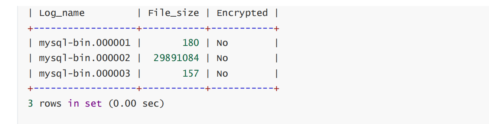

```bash
#重置二进制日志，如果从当前使用位置开始同步，则原有数据无法同步
mysql> reset master;

#用全量备份的方式导出所有己有数据，并刷新二进制日志
[root@rocky8 ~]# mysqldump -A -F --source-data=1 --single-transaction >all.sql

#日志被刷新
mysql> show master logs;
```

#### 1.9.2.5一主多从实现

一主多从，配置多个从节点即可，基于上述一主一从，再增加一个从节点

#### 1.9.2.6级联复制实现

主从复制架构中，从节点从中继日志中读取到数据写入数据库后，该数据并不会写入到从节点的二进制日志中，但是在级联同步架构中，有一个中间节点的角色，该节点从主节点中同步数据，并充当其它节点的数据源

在此架构中，中间节点要开启 log_slave_updates 选项，保证中间节点复制过来的数据也能写入二进制日志，为其它节点提供数据源。

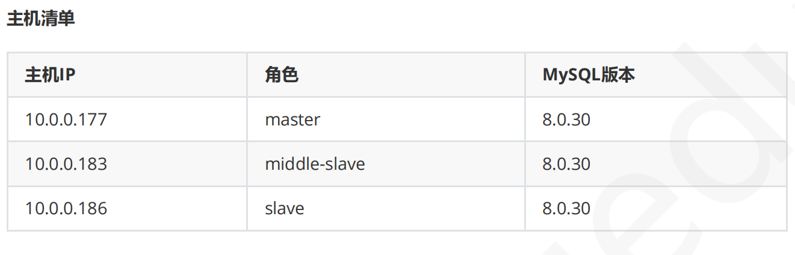

#### 1.9.2.7主主复制实现

在双主模型中，两个节点互为主备，两个节点都要开启二进制日志，都要有写权限。

双主架构在实际生产环境中，并不会配置为两个节点都去写数据，前端应用只会写一个节点，另一个节点作为备份节点，**如果当前使用的节点出问题，则IP地址会立即转移到另一个节点上**，起到一个高可用的作用，此时，如果有slave节点，在 slave 上要重新执行同步操作。

#### 1.9.2.8半同步复制

**异步复制**

默认情况下，MySQL 中的复制是异步的，当客户端程序向主节点中写入数据后，主节点中数据落盘，写入binlog日志，然后将binlog日志中的新事件发送给从节点 ，便向客户端返回写入成功，而并不验证从节点是否接收完毕，也不等待从节点返回同步状态，这意味着客户端只能确认向主节点的写入是成功的，并不能保证刚写入的数据成功同步到了从节点。此复制策略下，如果主从同步出现故障，则有可能出现主从节点之间数据不一致的问题。甚至，如果在主节点写入数据后没有完成同步，主节点服务当机，则会造成数据丢失。

**异步复制不要求数据能成功同步到从节点，只要主节点完成写操作，便立即向客户端返回结果。**

**同步复制**

当客户端程序向主节点中写入数据后，主节点中数据落盘，写入binlog日志，然后将binlog日志中的新事件发送给从节点 ，**等待所有从节点向主节点返回同步成功**之后，主节点才会向客户端返回写入成功。此复制策略能最大限度的保证数据安全和主从节点之间的数据一致性，但此复制策略**性能不高**，需要在所有从节点上完成数据同步之后，客户端才能获得返回结果。

此同步策略又称为全同步复制。

**半同步复制**

当客户端程序向主节点中写入数据后，主节点中数据落盘，写入binlog日志，然后将binlog日志中的新事件发送给从节点 ，等待所有从节点中有一个从节点返回同步成功之后，主节点就向客户端返回写入成功。**此复制策略尽可能保证至少有一个从节点中有同步到数据**，也能尽早的向客户端返回写入状态。

**但此复制策略并不能百分百保证数据有成功的同步至从节点，因为可以在此策略下设至同步超时时间，如果超过等待时间，即使没有任何一个从节点返回同步成功的状态，主节点也会向客户端返回写入成功。**

**MySQL5.7 以及之后的半同步复制**

客户端的写操作先不提交事务，而是先写二进制日志，然后向从库同步数据，由于在主节点上的事务还没提交，所以此时其它进程查不到当前的写操作，不会出现幻读的问题而且主节点要确认至少有一个从节点的数据同步成功了，再会提交事务，这样也保证了主从之间的数据一致性，不会存在丢失数据的情况。

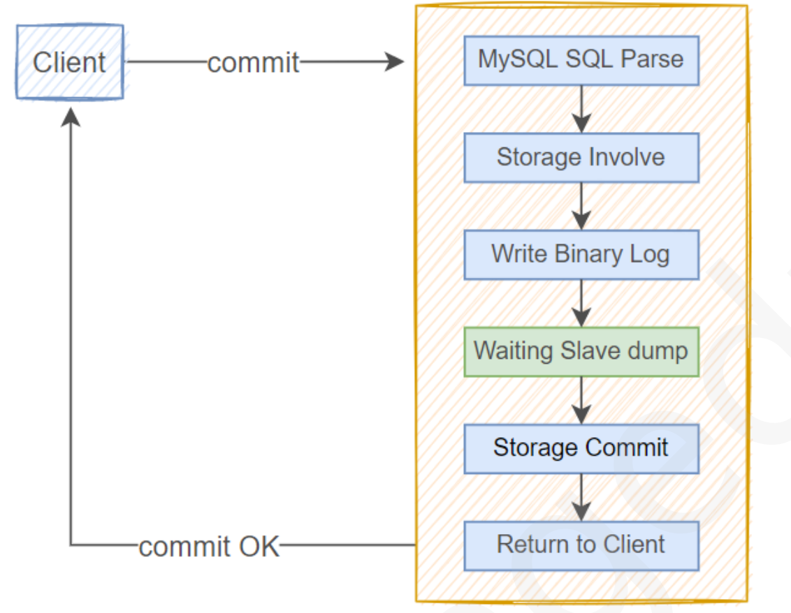

#### 1.9.2.9复制过滤器

复制过滤器是指让从节点仅复制指定的数据库，或指定数据库的指定表。

复制过滤器的实现有两种方式：

在 master 节点上使用服务器选项配置来实现：

**在 master 节点上配置仅向二进制日志中写入与特定数据库相关的事件。**

**在 slave 节点上使用服务器选项或者是全局变量配置来实现：在 slave 节点上配置在读取 relay log 时仅处理指定的数据库或表。**

#### 1.9.2.10 GTID 复制

GTID（global transaction ID）：全局事务ID

GTID 是一个己提交的事务的编号，由当前 MySQL 节点的 server-uuid 和每个事务的 transacton-id 联合组成，每个事务的 transacton-id 唯一，但仅只在当前节点唯一，server-uuid 是在每个节点自动随机生成，能保证每个节点唯一。**基于此，用 server-uuid 和 transacton-id 联合的 GTID 也能保证全局唯一**。

开启 GTID 功能可以支持多 DUMP 线程的并发复制，而且 MySQL5.6 实现了基于库级别多 SQL 线程并发。在 MySQL5.7 利用 GTID 的 Logic clock 逻辑时钟。保证了同库级别下的事务顺序问题。即可以实现基于事务级别的并发回放。从而大大减少了同步的延迟。

同时 GTID 具有幂等性特性，即多次执行结果是一样的。

利用 GTID 复制不像传统的复制方式（异步复制、半同步复制）需要找到 binlog 文件名和 POS 点，**只需知道 master 节点的 IP、端口、账号、密码即可**。开启 GTID 后，执行 change master to master_auto_postion=1 即可，它会自动寻找到相应的位置开始同步。

MySQL5.6 版本出现没有默认开启，5.7 中即使不开启也有匿名的 GTID 记录。


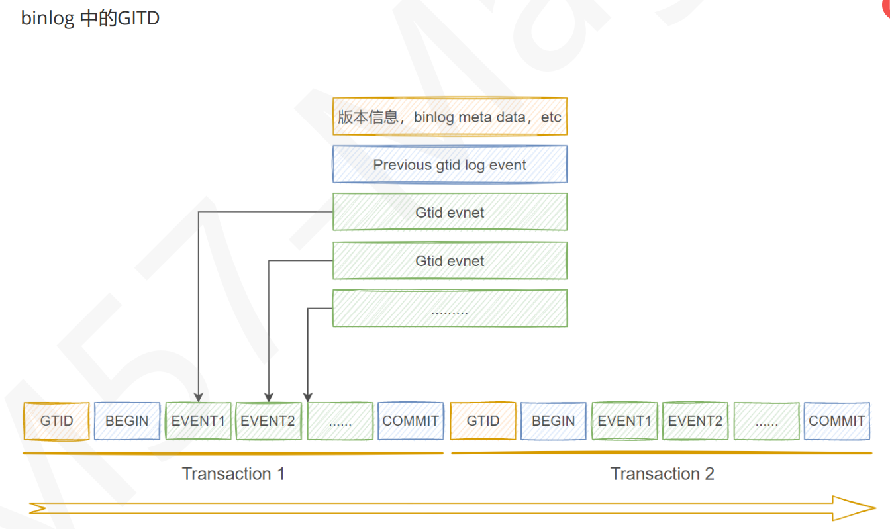

查看当前节点 server-uuid

```bash
mysql> show global variables like '%server_uuid%';

#此文件在MySQL5.7开始才有
[root@rocky8 ~]# cat /var/lib/mysql/auto.cnf 
[auto]
server-uuid=a864bbed-d9d0-11ed-8580-000c297ece82
```

在主从架构中， 主从节点可以互相获取对方节点的 server-id

```bash
#master节点上查看
mysql> show slave hosts\G

#slave节点上查看，Master_UUID 
mysql> show slave status\G
```

```bash
查看二进制日志中默认的匿名 GTID
[root@rocky8 ~]# mysqlbinlog /data/mysql/logbin/mysql-bin.000010 | grep GTID | head -n 3
```

GTID服务器相关选项

```bash
gtid_mode=ON #gtid模式
enforce_gtid_consistency=ON #保证GTID安全的参数
```

##### GTID 复制实现

```bash
#salve节点先先还原状态
mysql> stop slave;
Query OK, 0 rows affected, 1 warning (0.01 sec)
mysql> reset slave all;
Query OK, 0 rows affected, 1 warning (0.02 sec)
mysql> drop database db1;
Query OK, 1 row affected (0.03 sec)
mysql> drop database db2;
Query OK, 0 rows affected (0.01 sec)

#修改配置
[root@rocky8 ~]# cat /etc/my.cnf
......
[mysqld]
server-id=183
read-only
log-bin=/data/mysql/logbin/mysql-bin
gtid_mode=ON
enforce_gtid_consistency=ON

#重启服务
[root@rocky8 ~]# systemctl restart mysqld
```

```bash
#master节点
mysql> drop database db1;
Query OK, 0 rows affected (0.01 sec)
mysql> drop database db2;
Query OK, 0 rows affected (0.01 sec)
mysql> drop database test_db;
Query OK, 0 rows affected (0.00 sec)

#修改配置
[root@rocky8 ~]# cat /etc/my.cnf
[mysqld]
server-id=177
log-bin=/data/mysql/logbin/mysql-bin
gtid_mode=ON
enforce_gtid_consistency=ON

#重启服务
[root@rocky8 ~]# systemctl restart mysqld
```

```bash
#在salve节点上设置主从同步
mysql> CHANGE MASTER TO
    ->  MASTER_HOST='10.0.0.177',
    ->  MASTER_USER='repluser',
    ->  MASTER_PASSWORD='123456',
    ->  MASTER_PORT=3306,
    ->  MASTER_AUTO_POSITION=1;
Query OK, 0 rows affected, 8 warnings (0.03 sec)
mysql> start slave;
```

### 1.9.3主从复制的监控和维护

**清理日志**

```bash
PURGE { BINARY | MASTER } LOGS { TO 'log_name' | BEFORE datetime_expr }
RESET MASTER TO N #mysql 不支持
RESET SLAVE [ALL]
```

**查看同步状态**

```bash
SHOW MASTER STATUS
SHOW BINARY LOGS
SHOW BINLOG EVENTS
SHOW SLAVE STATUS
SHOW PROCESSLIST
```

**从服务器是否落后于主服务**

```bash
mysql> show slave status\G
Seconds_Behind_Master：0
```

**如何确定主从节点数据是否一致**

第三方工具 percona-toolkit

```bash
https://www.percona.com/software/database-tools/percona-toolkit
```

**数据不一致如何修复**

重置主从关系，从新复制

### 1.9.4主从复制中常见问题和解决方案

#### **数据损坏或丢失**

如果是 slave 节点的数据损坏或丢失，重置数据库，重新同步复制即可

如果要防止 master 节点的数据损坏或丢失，则整个主从复制架构可以用 **MHA+半同步**来实现，在master 节点不可用时，提升一个 salve 节点为新的 master 节点

**在环境中出现了不唯一的** **server-id**

可手动修改 server-id 至唯一，再次重新复制


#### **主从复制出现延迟**

升级到 MySQL5.7 以上版本(5.7之前的版本，没有开 GTID 之前，主库可以并发事务，但是 dump 传输时是串行)利用 GTID( MySQL5.6需要手动开启，MySQL5.7 以上默认开启)支持并发传输binlog 及并行多个 SQL 线程。

减少大事务，将大事务拆分成小事务

减少锁

sync_binlog=1 加快 binlog 更新时间，从而加快日志复制

需要额外的监控工具的辅助

多线程复制：对多个数据库复制


#### **主从节点数据不一致**

**常见原因**

**主库 binlog 格式为 Statement**，同步到从库执行后可能造成主从不一致。

主库执行更改前有执行set sql_log_bin=0，会使**主库不记录 binlog**，从库也无法变更这部分数据

**从节点未设置只读，误操作写入数据**

主库或从库**意外宕机**，宕机可能会造成 binlog 或者 relaylog 文件出现损坏，导致主从不一致

主从实例版本不一致，特别是高版本是主，低版本为从的情况下

主从 **sql_mode 不一致**

**MySQL 自身 bug 导致**


**解决方案**

**将从库重新实现**：虽然这是一种解决方法，但此方案恢复时间较慢，而且有时候从库也是承担一部分的查询操作的，不能贸然重建。

**使用 percona-toolkit 工具辅助**：PT 工具包中包含 pt-table-checksum 和 pt-table-sync 两个工具，主要用于检测主从是否一致以及修复数据不一致情况。**这种方案优点是修复速度快，不需要停止主从辅助**，缺点是需要会使用该工具，关于使用方法，可以参考下面链接：https://www.cnblogs.com/feiren/p/7777218.htm

**手动重建不一致的表**：在从库发现某几张表与主库数据不一致，而这几张表数据量也比较大，手工比对数据不现实，并且重做整个库也比较慢，这个时候可以只重做这几张表来修复主从不一致。这种方案缺点是在执行导入期间需要暂时停止从库复制，不过也是可以接受的。


#### 如何避免主从不一致

主库 binlog 采用 ROW 格式

主从实例数据库版本保持一致

主库做好账号权限把控，不可以执行 set sql_log_bin=0

从库开启只读，不允许人为写入

定期进行主从一致性检验


### 1.9.5MySQL 中间件代理服务器

#### 1.9.5.1数据库切片

**垂直切分**

按照不同的表（或者 Schema）来切分到不同的数据库（主机）之上，这种切分可以称为数据的垂直（纵向）切分；垂直切分的最大特点就是规则简单，实施也更为方便，尤其适合各业务之间的耦合度非常低，相互影响小， 业务逻辑非常清晰的系统，在这种系统中，可以很容易做到将不同业务模块所使用的表分拆到不同的数据库中。

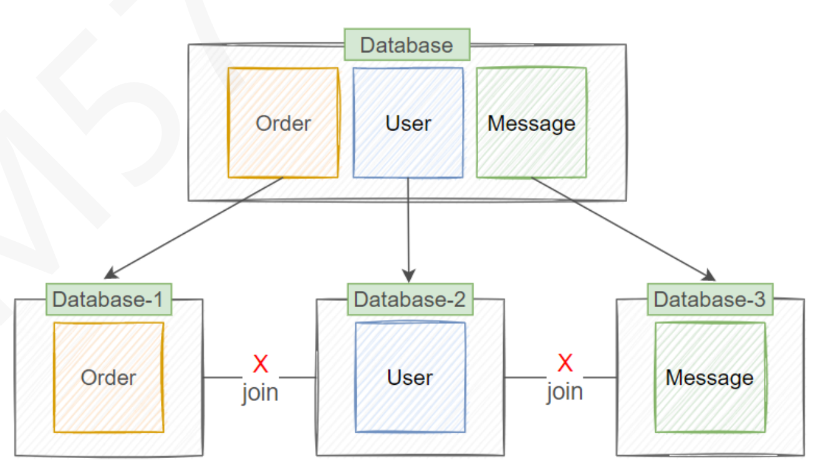

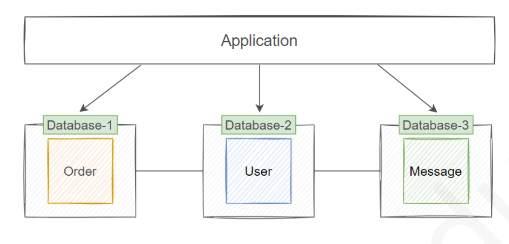

在架构设计中，各个功能模块相互之间的交互点越统一越少，系统的耦合度就越低，系统各个模块的维护性以及扩展性也就越好。这样的系统，实现数据的垂直切分也就越容易

一般来讲业务存在着复杂 join 的场景是难以切分的，往往业务独立的易于切分。如何切分，切分到何种程度是考验技术架构的一个难题。


**水平切分**

另外一种则是根据表中的数据的逻辑关系，将同一个表中的数据按照某种条件拆分到多台数据库（主机）上面，这种切分称为数据的水平（横向）切分。水平切分于垂直切分相比，相对来说稍微复杂一些。因为要将同一个表中的不同数据拆分到不同的数据库中， 对于应用程序来说，拆分规则本身就较根据表名来拆分更为复杂，后期的数据维护也会更为复杂一些。

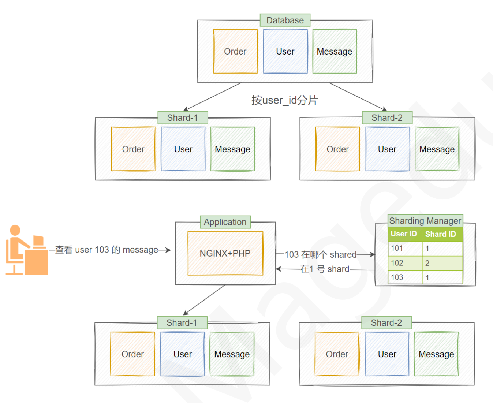

几种典型的分片规则包括：

按照用户 ID 求模，将数据分散到不同的数据库，具有相同数据用户的数据都被分散到一个库中

按照日期，将不同月甚至日的数据分散到不同的库中

按照某个特定的字段求摸，或者根据特定范围段分散到不同的库中


**共同特点缺点**有：

引入分布式事务的问题

跨节点 Join 的问题

跨节点合并排序分页问题

多数据源管理问题

**针对数据源管理，目前主要有两种思路：**

A. 客户端模式，在每个应用程序模块中配置管理自己需要的一个（或者多个）数据源，直接访问各个数据库， 在模块内完成数据的整合

B. 通过中间代理层来统一管理所有的数据源，后端数据库集群对前端应用程序透明； 可能 90%以上的人在面对上面这两种解决思路的时候都会倾向于选择第二种，尤其是系统不断变得庞大复杂 的时候。确实，这是一个非常正确的选择，虽然短期内需要付出的成本可能会相对更大一些，但是对整个系统的 扩展性来说，是非常有帮助的。

MySQL中间件服务器可以通过将数据切分解决传统数据库的缺陷，又有了 NoSQL 易于扩展的优点。通过中间代理层规避了多数据源的处理问题，对应用完全透明，同时对数据切分后存在的问题，也做了解决方案。

由于数据切分后数据 join 的难度大，在此也分享一下数据切分的经验：

第一原则：能不切分尽量不要切分

第二原则：如果要切分一定要选择合适的切分规则，提前规划好。

第三原则：数据切分尽量通过数据冗余或表分组（Table Group）来降低跨库 join 的可能

第四原则：由于数据库中间件对数据 Join 实现的优劣难以把握，而且实现高性能难度极大，业务读取尽量少使用多表 join。

#### 1.9.5.2MySQL 中间件应用

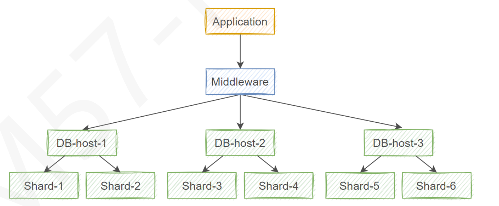

常见 MySQL 中间件


#### 1.9.5.3Mycat实现mysql读写分离

Mycat 是一个开源的分布式数据库系统，是一个实现了 MySQL 协议的服务器，前端用户可以把它看作是一个数据库代理（类似于Mysql Proxy），用 MySQL 客户端工具和命令行访问，而其后端可以用MySQL 原生协议与多个 MySQL 服务器通信，也可以用 JDBC 协议与大多数主流数据库服务器通信，其核心功能是分表分库，即将一个大表水平分割为 N 个小表，存储在后端 MySQL 服务器里或者其他数据库里

Mycat 发展到目前的版本，已经不是一个单纯的 MySQL 代理了，它的后端可以支持 MySQL、SQL Server、Oracle、DB2、PostgreSQL等主流数据库，也支持 MongoDB 这种新型 NoSQL 方式的存储，未来还会支持更多类型的存储。而在最终用户看来，无论是那种存储方式，在 MyCat 里，都是一个传统的数据库表，支持标准的 SQL 语句进行数据的操作，这样一来，对前端业务系统来说，可以大幅降低开发难度，提升开发速度。

Mycat 可以简单概括为：

一个彻底开源的，面向企业应用开发的大数据库集群

支持事务，ACID，可以替代 MySQL 的加强版数据库

一个可以视为 MySQL 集群的企业级数据库，用来替代昂贵的 Oracle 集群

一个融合内存缓存技术，NoSQL技术，HDFS 大数据的新型 SQL Server

结合传统数据库和新型分布式数据仓库的新一代企业级数据库产品

一个新颖的数据库中间件产品

http://www.mycat.org.cn/


当我们的应用只需要一台数据库服务器的时候我们并不需要 Mycat，而如果你需要分库甚至分表，这时候应用要面对很多个数据库的时候，这个时候就需要对数据库层做一个抽象，来管理这些数据库，而最上面的应用只需要面对一个数据库层的抽象或者说数据库中间件就好了，这就是 Mycat 的核心作用。所以可以这样理解：**数据库是对底层存储文件的抽象，而 Mycat 是对数据库的抽象。**


**Mycat** **工作原理**

Mycat 的原理中最重要的一个动词是"拦截"，它**拦截了用户发送过来的 SQL 语句**，首先对 SQL 语句做了一些特定的分析：如分片分析，路由分析，读写分离分析，缓存分析等，然后将此 SQL 发往后端的真实数据库，并将返回的结果做适当的处理，最终再返回给用户。


**Mycat** **应用场景**

单纯的读写分离，此时配置最为简单，支持读写分离，主从切换

分表分库，对于超过1000 万的表进行分片，最大支持 1000 亿的单表分片

多租户应用，每个应用一个库，但应用程序只连接 Mycat，从而不改造程序本身，实现多租户化

报表系统，借助于 Mycat 的分表能力，处理大规模报表的统计

替代 Hbase，分析大数据

作为海量数据实时查询的一种简单有效方案，比如 100 亿条频繁查询的记录需要在3秒内查询出来结果，除了基于主键的查询，还可能存在范围查询或其他属性查询，此时 Mycat 可能是最简单有效的选择


**Mycat** **不适合的应用场景**

设计使用 Mycat 时有非分片字段查询，请慎重使用 Mycat，可以考虑放弃！

设计使用 Mycat 时有分页排序，请慎重使用 Mycat，可以考虑放弃！

设计使用 Mycat 时如果要进行表 JOIN 操作，要确保表的关联字段具有相同的数据分布，否则请慎重使用 Mycat，可以考虑放弃

设计使用 Mycat 时如果有分布式事务，得先看是否得保证事务得强一致性，否则请慎重使用Mycat，可以考虑放弃


**MyCat** **的高可用**

需要注意: 在生产环境中, Mycat 节点最好使用双节点, 即双机热备环境, 防止Mycat这一层出现单点故障。

可以使用的高可用集群方式有:

Keepalived+Mycat+Mysql

Keepalived+LVS+Mycat+Mysql

Keepalived+Haproxy+Mycat+Mysql


**Mycat** **安装**

```bash
#mycat 是基于 java 语言开发，先要安装 java 环境
[root@rocky8 ~]# yum install -y java
[root@rocky8 ~]# java -version

#下载
[root@rocky8 ~]# wget http://dl.mycat.org.cn/1.6.7.6/20220524101549/Mycat-server-1.6.7.6-release-20220524173810-linux.tar.gz
```


```bash
#查看
[root@rocky8 ~]# ls /apps/mycat/
bin catlet conf lib logs version.txt
bin #mycat命令，启动、重启、停止等
catlet #扩展功能目录，默认为空
conf #配置文件目录
lib #引用的jar包
logs #日志目录,默认为空
version.txt #版本说明文件

#日志
logs/wrapper.log #mycat启动日志
logs/mycat.log #mycat详细工作日志
#常用配置文件
conf/server.xml #Mycat 软件本身相关的配置文件，设置账号、参数等
conf/schema.xml #对应的物理数据库和数据库表的配置,读写分离、高可用、分布式策略定制、节点控制
conf/rule.xml #Mycat分片（分库分表）规则配置文件,记录分片规则列表、使用方法等
```

```bash
#写path
[root@rocky8 ~]# vim /etc/profile.d/mycat.sh
PATH=/apps/mycat/bin:$PATH

[root@rocky8 ~]# source /etc/profile.d/mycat.sh

#启动
[root@rocky8 ~]# mycat start

#连接mycat：
[root@rocky8 ~]# mysql -uroot -p123456 -h 127.0.0.1 -P8066
```

更多配置参考文档

##### **读写分离实现**

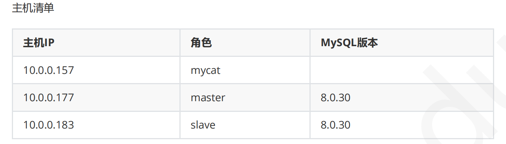

前置工作：关闭 selinux，关闭 firewalld 防火墙

配置 MySQL 主从

配置 Mycat

```bash
#下载
[root@rocky8 ~]# wget http://dl.mycat.org.cn/1.6.7.6/20220524101549/Mycat-server
1.6.7.6-release-20220524173810-linux.tar.gz
 #解压
[root@rocky8 ~]# mkdir /apps
 [root@rocky8 ~]# tar xf Mycat-server-1.6.7.6-release-20220524173810-linux.tar.gz -C /apps
 
 #写path
 [root@rocky8 ~]# vim /etc/profile.d/mycat.sh
 PATH=/apps/mycat/bin:$PATH
 
 [root@rocky8 ~]# source /etc/profile.d/mycat.sh
 
 #启动
[root@rocky8 ~]# mycat start
 Starting Mycat-server...
 #查看运行状态
[root@rocky86 ~]# mycat status

 #查看默认用户名和密码
[root@rocky86 ~]# cat /apps/mycat/conf/server.xml

#安装mysql客户端
[root@rocky86 ~]# yum install mysql -y

#连接mycat：
[root@rocky8 ~]# mysql -uroot -p123456 -h 127.0.0.1 -P8066
```

在后端数据库中创建供 Mycat 连接的账号

```bash
#在master节点上创建账号并授权，该帐号会被同步到 slave 节点
mysql> create user 'mycater'@'10.0.0.%' IDENTIFIED BY '123456';

 mysql> GRANT ALL ON db1.* TO 'mycater'@'10.0.0.%';
 mysql> flush privileges;
```

修改 server.xml 配置 mycat 连接后端数据库的账号密码

```bash
[root@rocky86 ~]# vim /apps/mycat/conf/server.xml
 <?xml version="1.0" encoding="UTF-8"?>
 <!DOCTYPE mycat:server SYSTEM "server.dtd">
 <mycat:server xmlns:mycat="http://io.mycat/">
 <system>
 <property name="useHandshakeV10">1</property>
 <property name="serverPort">3306</property>         #mycat 监听的端口从8066
 </system>
 <user name="root">              
#客户端连接mycat的配置
<property name="password">123456</property>         
<property name="schemas">db1</property>
 <property name="defaultSchema">db1</property>
 </user>
 </mycat:server>
```

修改 schema.xml 实现读写分离策略

```bash
[root@rocky86 ~]# vim /apps/mycat/conf/schema.xml
 <?xml version="1.0"?>
 <!DOCTYPE mycat:schema SYSTEM "schema.dtd">
 <mycat:schema xmlns:mycat="http://io.mycat/">
    <schema name="db1" checkSQLschema="false" sqlMaxLimit="100" dataNode="dn1">
 </schema>
    <dataNode name="dn1" dataHost="localhost1" database="db1" />
    <dataHost name="localhost1" maxCon="1000" minCon="10" balance="1"
 writeType="0" dbType="mysql" dbDriver="native" switchType="1" 
slaveThreshold="100">
        <heartbeat>select user();</heartbeat>
        <writeHost host="host1" url="10.0.0.177:3306" user="mycater" 
password="123456"> 
<readHost host="host2" url="10.0.0.183:3306" user="mycater" 
password="123456" />
        </writeHost>
    </dataHost>
 </mycat:schema>
 
  #重启mycat 服务
[root@rocky86 ~]# mycat restart

#验证读写分离, 分别在master,slave节点上开启通用日志

[root@rocky8 ~]# vim /etc/my.cnf
 ......
 general_log
 #验证读写分离, 分别在master,slave节点上开启通用日志
#重启
[root@rocky8 ~]# systemctl restart mysqld.service
 #查看通用日志, master, slave节点都有,文件名与机名同名
[root@rocky8 ~]# tail -n 3 /var/lib/mysql/rocky8.log
```


##### ProxySQL 实现 MySQL 读写分离

### 1.9.6MySQL 高可用

#### 1.9.6.1MySQL 高可用解决方案

MMM：Multi-Master Replication Manager for MySQL，Mysql 主主复制管理器是一套灵活的脚本程 序，基于perl实现，用来对mysql replication 进行监控和故障迁移，并能管理 mysql Master-Master 复制的配置

MHA：Master High Availability，对主节点进行监控，可实现自动故障转移至其它从节点；通过提升某 一从节点为新的主节点，基于主从复制实现，还需要客户端配合实现，**目前MHA主要支持一主多从的架 构**，要搭建MHA，要求一个复制集群中必须最少有三台数据库服务器，一主二从，即一台充当master， 一台充当备用master，另外一台充当从库，出于机器成本的考虑，淘宝进行了改造，目前淘宝TMHA已 经支持一主一从。

```bash
https://code.google.com/archive/p/mysql-master-ha/
https://github.com/yoshinorim/mha4mysql-manager/wiki/Downloads
https://github.com/yoshinorim/mha4mysql-manager/releases
https://github.com/yoshinorim/mha4mysql-node/releases/tag/v0.5
```

以下技术可以达到金融级的高可用性要求：

Galera Cluster：wsrep(MySQL extended with the Write Set Replication) 通过 wsrep 协议在全局实现 复制；任何一节点都可读写，不需要主从复制，实现多主读写。 

GR（Group Replication）：MySQL官方提供的组复制技术(MySQL 5.7.17引入的技术)，基于原生复制 技术 Paxos 算法，实现了多主更新，复制组由多个 server 成员构成，组中的每个 server 可独立地执行 事务，但所有读写事务只在冲突检测成功后才会提交。


**单主模型只有一个主节点可以接受写操作，主节点故 障时可以自动选举主节点。多主模型下，所有节点都可以接受写操作，所以没有 master-slave 的概念**。

#### 1.9.6.2MHA Master High Availability

```bash
#MHA 工作原理和架构
https://github.com/yoshinorim/mha4mysql-manager/wiki
```

**MHA 集群架构**


**MHA工作原理**

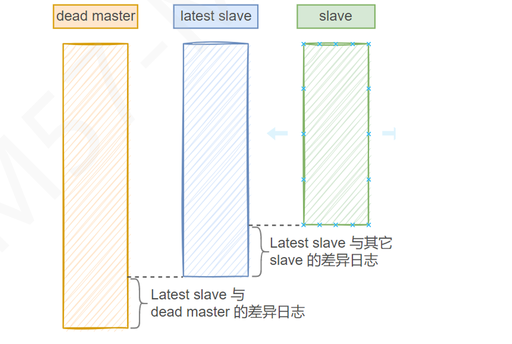

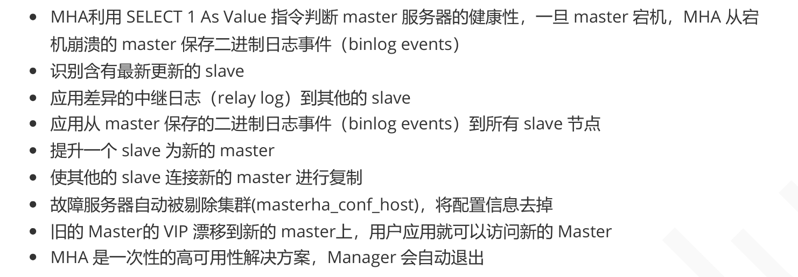

选举新的 Master


注意：为了尽可能的减少主库硬件损坏宕机造成的数据丢失，因此在配置 MHA 的同时建议配置成  MySQL 的半同步复制

#### 1.9.6.3MHA 实现 MySQL 高可用

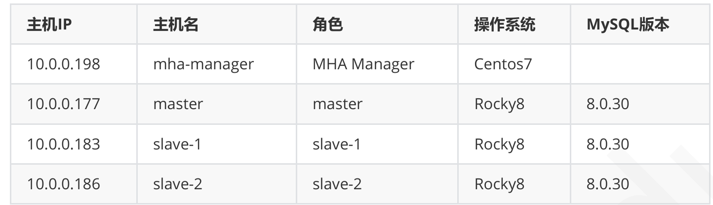

MHA 软件由两部分组成，Manager工具包和 Node 工具包

```bash
#软件下载
https://github.com/yoshinorim/mha4mysql-manager/releases/tag/v0.58
https://github.com/yoshinorim/mha4mysql-node/releases/tag/v0.58
```

```bash
#在 mha-manager 节点上安装 manager 包和 node 包
[root@mha-manager ~]# wget https://github.com/yoshinorim/mha4mysql-manager/releases/download/v0.58/mha4mysql-manager-0.58-0.el7.centos.noarch.rpm
 [root@mha-manager ~]# wget https://github.com/yoshinorim/mha4mysql-node/releases/download/v0.58/mha4mysql-node-0.58-0.el7.centos.noarch.rpm
 
 [root@mha-manager ~]# ll mha4mysql-*
 
 #通过yum安装，自行解决依赖
[root@mha-manager ~]# yum install epel-release
[root@mha-manager ~]# yum install mha4mysql-* -y

```

在所有 mysql 节点上安装 node 包

```bash
[root@mha-manager ~]# scp mha4mysql-node-0.58-0.el7.centos.noarch.rpm 
10.0.0.177:
 [root@mha-manager ~]# scp mha4mysql-node-0.58-0.el7.centos.noarch.rpm 
10.0.0.183:
 [root@mha-manager ~]# scp mha4mysql-node-0.58-0.el7.centos.noarch.rpm 
10.0.0.186:
 #分别安装
[root@master ~]# yum install -y mha4mysql-node-0.58-0.el7.centos.noarch.rpm
```

在所有节点实现基于 ssh-key 的免密登录

```bash
#生成密钥对，并在当前主机完成C/S校验
[root@mha-manager ~]# ssh-keygen
 [root@mha-manager ~]# ssh-copy-id 127.1
 #分发
[root@mha-manager ~]# rsync -av .ssh 10.0.0.177:/root/
 [root@mha-manager ~]# rsync -av .ssh 10.0.0.183:/root/
 [root@mha-manager ~]# rsync -av .ssh 10.0.0.186:/root/
 #测试ssh连接
```

在 mha-manager 节点创建相关配置文件

```bash
[root@mha-manager ~]# mkdir /etc/mastermha
 [root@mha-manager ~]# vim /etc/mastermha/app1.cnf
 #默认设置
[server default]
 user=mhauser
 ......
```

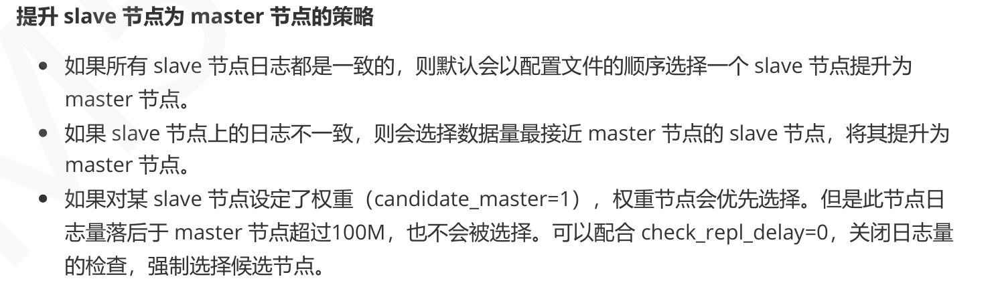

配置相关脚本

```bash
[root@mha-manager ~]# vim /usr/local/bin/sendmail.sh
 #!/bin/bash
 echo 'MHA is failover!' | mail -s 'MHA Warning' ji.wan@magedu.com
 [root@mha-manager ~]# chmod a+x /usr/local/bin/sendmail.sh
 #需要安装邮件服务
[root@mha-manager ~]# yum install mailx postfix
 #邮件服务配置
[root@mha-manager ~]# vim /etc/mail.rc

[root@mha-manager ~]# systemctl restart postfix.service
```

```bash
[root@mha-manager ~]# vim /usr/local/bin/master_ip_failover
......
my $vip = '10.0.0.100/24';        #virtually IP，此IP会在不同的MySQL节点漂移
my $key = "1";
 my $ssh_start_vip = "/sbin/ifconfig ens160:$key $vip";      #在网卡上添加IP，确保每台 MySQL 节点网卡名一样
my $ssh_stop_vip = "/sbin/ifconfig ens160:$key down";
```

在 master 节点配置 VIP，此IP会在不同 MySQL 节点上漂移

```bash
[root@master ~]# ifconfig ens160:1 10.0.0.100/24
[root@master ~]# ifconfig ens160:1
```

配置 MySQL 节点

```bash
#master 节点配置
[root@master ~]# yum install -y mysql-server
 [root@master ~]# vim /etc/my.cnf
 ......
 [mysqld]
 server-id=177
 log-bin=/data/mysql/logbin/mysql-bin
 [root@master ~]# mkdir -pv /data/mysql/logbin/
 [root@master ~]# chown -R mysql.mysql /data/mysql
 [root@master ~]# systemctl start mysqld.service
```

slave-1 节点配置\#slave-2

```bash
[root@slave-1 ~]# yum install -y mysql-server
 [root@slave-1 ~]# vim /etc/my.cnf
 ......
 [mysqld]
 server-id=183
 log-bin=/data/mysql/logbin/mysql-bin
 read-only
 [root@slave-1 ~]# mkdir -pv /data/mysql/logbin/
 [root@slave-1 ~]# chown -R mysql.mysql /data/mysql
 [root@slave-1 ~]# systemctl start mysqld.service
```

配置主从

主从同步测试

mha-manager 节点上检查环境

```bash
#配置和 SSH 连接检查
[root@mha-manager ~]# vim /etc/mastermha/app1.cnf
 #主从复制检查，会在mysql节点自动创建 remote_workdir=/data/mastermha/app1/
 [root@mha-manager ~]# masterha_check_repl --conf=/etc/mastermha/app1.cnf
 #查看当前mysql 集群状态
[root@mha-manager ~]# masterha_check_status --conf=/etc/mastermha/app1.cnf
```

在 mha-manager 节点上启动集群

```bash
#生产环境放在后台执行，并且与终端分离
nohup masterha_manager --conf=/etc/mastermha/app1.cnf --remove_dead_master_conf --ignore_last_failover &> /dev/null

#如果想停止后台的 manager, 使用此命令
masterha_stop --conf=/etc/mastermha/app1.cnf

#启动
[root@mha-manager ~]# masterha_manager --conf=/etc/mastermha/app1.cnf -remove_dead_master_conf --ignore_last_failover

#查看生成的文件
[root@mha-manager ~]# tree /data/mastermha/app1/

#查看日志
[root@mha-manager ~]# cat /data/mastermha/app1/manager.log
```

在 MySQL 的 master 节点上查看 mha-manager 发送的心跳查询

```bash
#开启 master 节点通用日志
mysql> set global general_log=1;
#每秒检测一次活动状态，间隔时长是在配置文件中指定的
[root@master ~]# tail -f /var/lib/mysql/master.log 
```

测试，停止 MySQL master 节点，VIP会转移

```bash
#master 节点上查看，当前网卡有VIP
 [root@master ~]# ip a s ens160
 
 #停止 mysqld 服务
[root@master ~]# systemctl stop mysqld

#再次查看网卡，VIP己经转移了
[root@master ~]# ip a s ens160

#查看 mha-manager 日志,提示提升了新的 master 节点，发送告警日志
[root@mha-manager ~]# cat /data/mastermha/app1/manager.log

#在slave-1节点查看，VIP己转移到当前主机，因为在 mha-manager 配置中设定了当前节点优先被提升为 master 节点
[root@slave-1 ~]# ip a s ens160

#当前同步状态消失，只读状态失效
mysql> show slave status\G

#在 slave-2 节点上查看，master IP己经发生了变化
mysql> show slave status\G

#查看数据，验证是否能从新的 master 节点同步数据

#此时收到了告警邮件
```


```bash
[root@mha-manager ~]# cat /etc/mastermha/app1.cnf
 ....
 manager_workdir=/data/mastermha/app1/
 manager_log=/data/mastermha/app1/manager.log
 remote_workdir=/data/mastermha/app1/
 #MHA 再次使用之前，需要先删除 manager_workdir 指向的目录和 remote_workdir 指向的目录
#manager_workdir 指向的目录在 mha-manager 节点上
#remote_workdir 指向的目录在 mysql 节点上
```

#### 19.6.4Galera Cluster

Galera 本身是具有多主特性的，即采用 multi-master 的集群架构，是一个既稳健，又在数据一致性、 完整性及高性能方面有出色表现的高可用解决方案。


**Galera Cluster 复制工作原理**

简单说就是事务必须以相同的顺序应用于所有实例

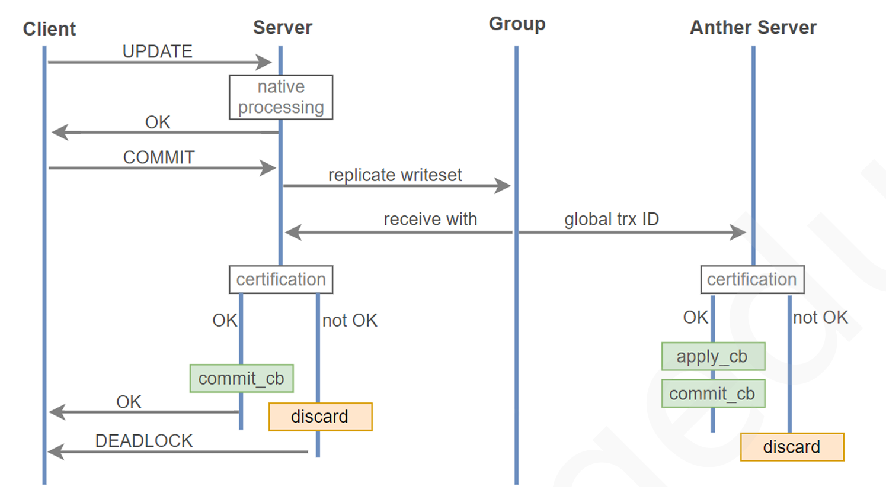


```bash
http://galeracluster.com/documentation-webpages/galera-documentation.pdf
 http://galeracluster.com/documentation-webpages/index.html
 https://www.percona.com/doc/percona-xtradb-cluster/LATEST/index.html
 https://mariadb.com/kb/en/library/getting-started-with-mariadb-galera-cluster/
```

Galera Cluster 包括两个组件 

Galera replication library (galera-3) 

WSREP：MySQL extended with the Write Set Replication

**WSREP 实现**

PXC：Percona XtraDB Cluster，是 Percona 对 Galera 的实现

MariaDB Galera Cluster

```bash
#pxc 国内源
https://mirrors.tuna.tsinghua.edu.cn/percona/release/$releasever/RPMS/$basearch
```

注意：两者都需要至少三个节点，不能安装 mysql server 或 mariadb-server

**PXC 原理**

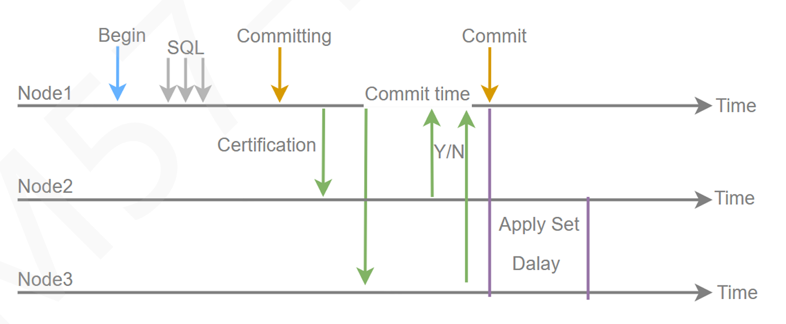

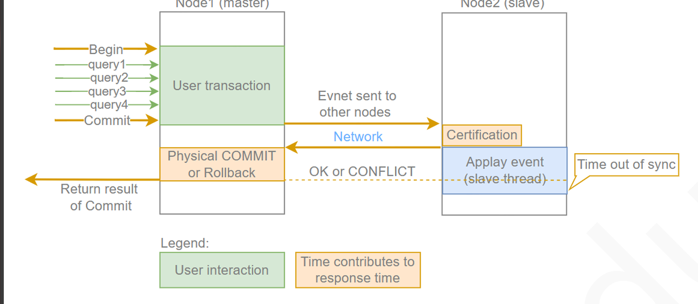

PXC 最常使用如下4个端口号： 3306：数据库对外服务的端口号 4444：请求SST的端口号 4567：组成员之间进行沟通的端口号 4568：用于传输IST的端口号

 **Percona XtraDB Cluster 5.7 实现**

## 1.10MySQL 压力测试

### 1.10.1常见 MySQL 压力测试工具

mysqlslap，Sysbench，tpcc-mysql，MySQL Benchmark Suite， MySQL super-smack，MyBench

**使用 mysqlslap 进行压力测试**

mysqlslap 是 mysql 官方提供的压力测试工具

```bash
#默认连接当前服务器，自行生成测试表，同时100个客户端并发执行,迭代10次
[root@rocky86 ~]# mysqlslap -a -i 10 -c100 -uroot -p123456

#50个客户端同时请求，myisam，innodb 各请求200次
[root@rocky86 ~]# mysqlslap -a -c 50 --number-of-queries 200 --engine=myisam,innodb
```

## 1.11MySQL配置最佳实践

高并发大数据的互联网业务，架构设计思路是"解放数据库CPU，将计算转移到服务层"，并发量大的情 况下，这些功能很可能将数据库拖死，业务逻辑放到服务层具备更好的扩展性，能够轻易实现"增机器就 加性能"。

以下规范适用场景：并发量大、数据量大的互联网业务

### 基础规范

必须使用InnoDB存储引擎 解读：支持事务、行级锁、并发性能更好、CPU及内存缓存页优化使得资源利用率更高

使用UTF8MB4字符集 解读：万国码，无需转码，无乱码风险，节省空间，支持表情包及生僻字

数据表、数据字段必须加入中文注释 解读：N年后谁知道这个r1，r2，r3字段是干嘛的

禁止使用存储过程、视图、触发器、Event 解读：高并发大数据的互联网业务，架构设计思路是"解放数据库CPU，将计算转移到服务层"，并发量 大的情况下，这些功能很可能将数据库拖死，业务逻辑放到服务层具备更好的扩展性，能够轻易实现  "增机器就加性能"。数据库擅长存储与索引，CPU计算还是上移吧

禁止存储大文件或者大照片 解读：为何要让数据库做它不擅长的事情?大文件和照片存储在文件系统，数据库里存URI多好。

### 命名规范

线上环境、开发环境、测试环境数据库内网域名遵循命名规范： 业务名称：xxx 线上环境：xxx.db 开发环境：xxx.rdb 测试环境：xxx.tdb

从库在名称后加-s标识，备库在名称后加-ss标识

线上从库：xxx-s.db

线上备库：xxx-sss.db

库名、表名、字段名：小写，下划线风格，不超过32个字符，必须见名知意，禁止拼音英文混用

库名与应用名称尽量一致

表名:t业务名称表的作用，主键名：pk_xxx，非唯一索引名：idx_xxx，唯一 键索引名：uk_xxx

### 表设计规范

单实例表数目必须小于 500，单表行数超过500万行或者单表容量超过2GB，才推荐进行分库分表。 说明：如果预计三年后的数据量根本达不到这个级别，请不要在创建表时就分库分表

单表列数目必须小于 30

表必须有主键，例如自增主键

禁止使用外键，如果有外键完整性约束，需要应用程序控制

解读：外键会导致表与表之间耦合，update 与 delete 操作都会涉及相关联的表，十分影响 sql 的性 能，甚至会造成死锁。高并发情况下容易造成数据库性能，大数据高并发业务场景数据库使用以性能优 先

### 字段设计规范

必须把字段定义为 NOT NULL 并且提供默认值解读： null 的列使索引/索引统计/值比较都更加复杂，对 MySQL 来说更难优化

禁止使用 TEXT、BLOB 类型 解读：会浪费更多的磁盘和内存空间，非必要的大量的大字段查询会淘汰掉热数据，导致内存命中率急 剧降低，影响数据库性能

禁止使用小数存储货币 解读：使用整数吧，小数容易导致钱对不上

必须使用 varchar(20)  存储手机号  解读： 涉及到区号或者国家代号，可能出现 +-() 手机号会去做数学运算么? varchar可以支持模糊查询，例如：like"138%"

禁止使用 ENUM，可使用 TINYINT 代替 解读： 增加新的ENUM值要做DDL操作 ENUM的内部实际存储就是整数，你以为自己定义的是字符串?

### 索引设计规范

单表索引建议控制在5个以内 解读：字段超过5个时，实际已经起不到有效过滤数据的作用了

禁止在更新十分频繁、区分度不高的属性上建立索引解读： 更新会变更B+树，更新频繁的字段建立索引会大大降低数据库性能

建立组合索引，必须把区分度高的字段放在前面 解读：能够更加有效的过滤数据

### SQL使用规范

禁止使用 SELECT *，只获取必要的字段，需要显示说明列属性 解读： 读取不需要的列会增加 CPU、IO、NET 消耗 不能有效的利用覆盖索引 使用 SELECT * 容易在增加或者删除字段后出现程序 BUG

禁止使用 INSERT INTO t_xxx VALUES(xxx)，必须显示指定插入的列属性 解读：容易在增加或者删除字段后出现程序 BUG

禁止使用属性隐式转换 解读：SELECT uid FROM t_user WHERE phone=13812345678 会导致全表扫描，而不能命中 phone  索引，猜猜为什么?(这个线上问题不止出现过一次)

禁止在 WHERE 条件的属性上使用函数或者表达式 解读：SELECT uid FROM t_user WHERE from_unixtime(day)>='2017-02-15' 会导致全表扫描正确的写 法是：SELECT uid FROM t_user WHERE day>= unix_timestamp('2017-02-15 00:00:00')

禁止负向查询，以及 % 开头的模糊查询 解读： 负向查询条件：NOT、!=、<>、!<、!>、NOT IN、NOT LIKE等，会导致全表扫描 %开头的模糊查询，会导致全表扫描

禁止大表使用 JOIN 查询，禁止大表使用子查询 解读：会产生临时表，消耗较多内存与CPU，极大影响数据库性能

禁止使用 OR 条件，必须改为 IN 查询 解读：旧版本Mysql的OR查询是不能命中索引的，即使能命中索引，为何要让数据库耗费更多的CPU帮 助实施查询优化呢?

应用程序必须捕获 SQL 异常，并有相应处理

# 2.redis

## 2.1Nosql

### 2.1.1RDBMS和NOSQL对比

**RDBMS**

高度组织化结构化数据

结构化查询语言（SQL）

数据和关系都存储在单独的表中。

数据操纵语言，数据定义语言

严格的一致性

基础事务

**NoSQL**

代表着不仅仅是SQL, 没有声明性查询语言

没有预定义的模式

**最终一致性**，而非ACID属性

非结构化和不可预知的数据

CAP定理

高性能，高可用性和可伸缩性

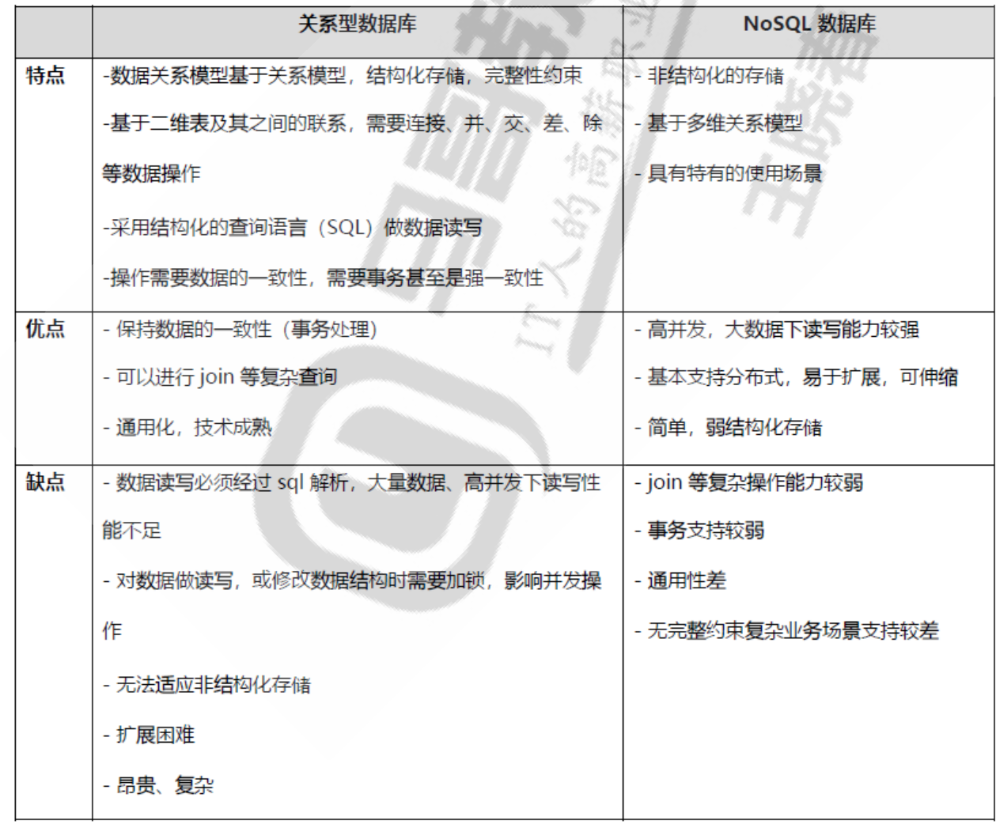

### 2.1.2CAP定理

C：Consistency

即一致性， 所有节点在同一时间具有相同的数据视图

A：Availability

即可用性，所有的节点都保持高可用性

每个非故障节点都能够在有限的时间内返回有效的响应，即系统一直可用。可用性强调系统对用户请求的及时响应

P：Partiton tolerance

即分区容忍性，系统能够在网络分区的情况下继续运行。分区是指系统中的节点由于网络故障无法相互通信，导致系统被分成多个孤立的子系统

CA - 单点集群，满足一致性，可用性的系统，通常在可扩展性上不太强大。

CP - 满足一致性，分区容忍性的系统，通常性能不是特别高。 放弃可用性，追求强一致性和分区容错性

AP - 满足可用性，分区容忍性的系统，通常可能对一致性要求低一些。

### 2.1.3 Base理论

Base理论是三要素的缩写：基本可用（Basically Available）、软状态（Soft-state）、最终一致性（Eventually Consistency）。

**基本可用 （Basically Available）**

比如系统通过断路保护而引发快速失败，在快速失败模式下，支持加载默认显示的内容（静态化的或者被缓存的数据），从而保证服务依然可用。

相比于正常的系统，可能是响应时间延长，或者是服务被降级。

比如在在秒杀活动中，如果抢购人数太多，超过了系统的QPS峰值，可能会排队或者提示限流。

**软状态 （Soft state）**

软状态允许系统中的数据存在中间状态，并认为该状态不影响系统的整体可用性，即允许系统在不同节点的数据副本上存在数据延时。

比如粉丝数，关注后需要过一段时间才会显示正确的数据。

**最终一致性（Eventuallyconsistent）**

数据不可能一直处于软状态，必须在一个时间期限后达到各个节点的一致性。在期限过后，应当保证所有副本中的数据保持一致性，也就是达到了数据的最终一致性。

### 2.1.4Redis 常见应用场景

缓存：缓存RDBMS中数据,比如网站的查询结果、商品信息、微博、新闻、消息

Session 共享：实现Web集群中的多服务器间的session共享

计数器：商品访问排行榜、浏览数、粉丝数、关注、点赞、评论等和次数相关的数值统计场景

社交：朋友圈、共同好友、可能认识他们等

地理位置: 基于地理信息系统GIS（Geographic Information System)实现摇一摇、附近的人、外卖等功能

消息队列：ELK等日志系统缓存、业务的订阅/发布系统

### 2.1.5缓存的实现流程

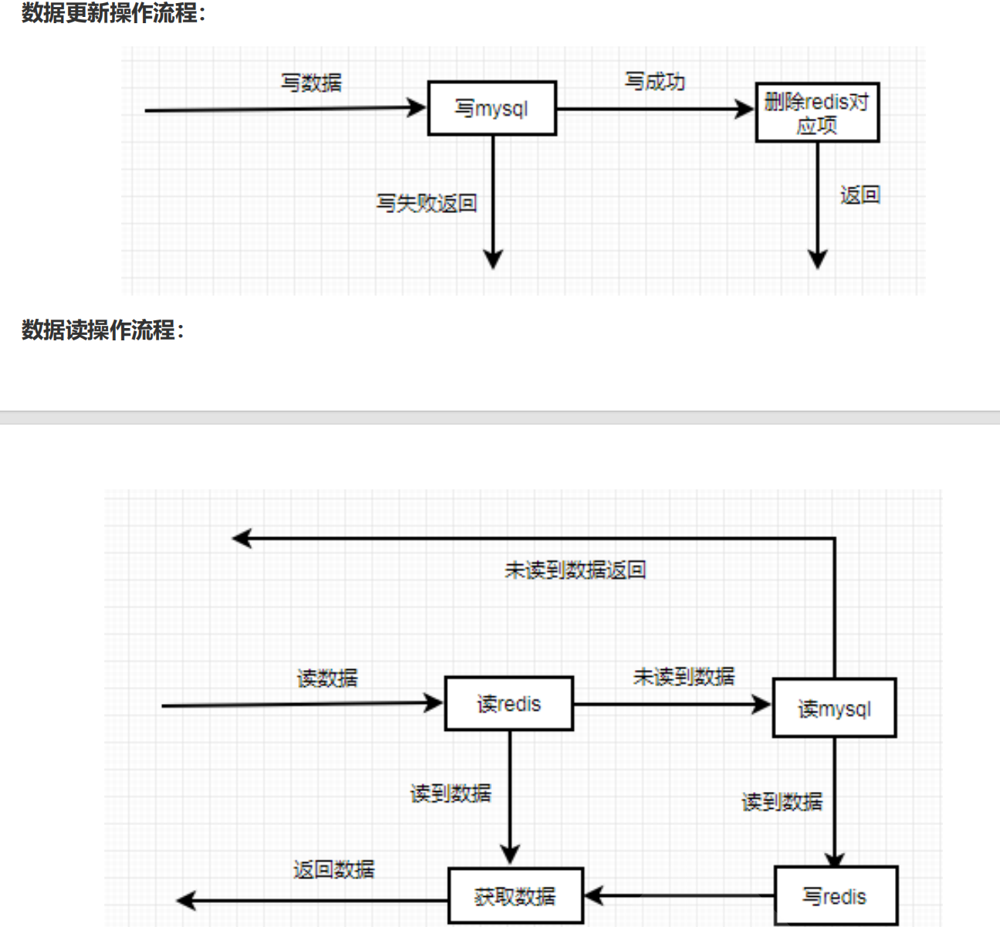

### 2.1.6缓存穿透,缓存击穿和缓存雪崩

#### 2.1.6.1缓存穿透 Cache Penetration

**缓存穿透是指缓存和数据库中都没有的数据，而用户不断发起请求**，比如： 发起为id为 “-1” 的数据或id为特别大不存在的数据。这时的用户很可能是攻击者，攻击会导致数据库压力过大。

解决方法：

**接口层增加校验**，如用户鉴权校验，id做基础校验，id<=0的直接拦截

从缓存取不到的数据，在数据库中也没有取到，这时也可以将key-value对写为key-null，缓存有效时间可以设置短点，如30秒（设置太长会导致正常情况也没法使用）。这样可以防止攻击用户反复用同一个id暴力攻击

#### 2.1.6.2缓存击穿 Cache breakdown

缓存击穿是指缓存中没有但数据库中有的数据

比如：热点数据的缓存时间到期后，这时由于并发用户特别多，同时读缓存没读到数据，又同时去数据库去取数据，引起数据库压力瞬间增大，造成过大压力

解决方法：

设置热点数据永远不过期。

#### 2.1.6.3缓存雪崩 Thunder Hurd Problem

缓存雪崩是指缓存中数据大批量到过期时间，而查询数据量巨大，引起数据库压力过大甚至down机。

和缓存击穿不同的是，缓存击穿指并发查同一条数据，缓存雪崩是不同数据都过期了，很多数据都查不到从而查数据库。

解决方法：

缓存数据的过期时间设置随机，防止同一时间大量数据过期现象发生

如果缓存数据库是分布式部署，将热点数据均匀分布在不同搞得缓存数据库中

设置热点数据永远不过期

### 2.1.7Pipeline 流水线

Redis 客户端执行一条命令分4个过程：

发送命令－-〉命令排队－-〉命令执行－-〉返回结果

未使用pipeline执行N条命令如下图

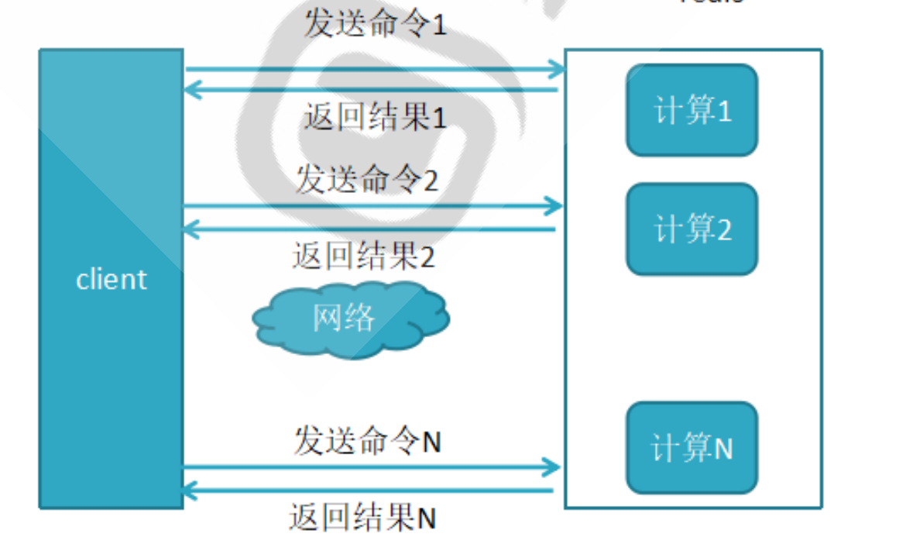

使用了pipeline执行N条命令如下图

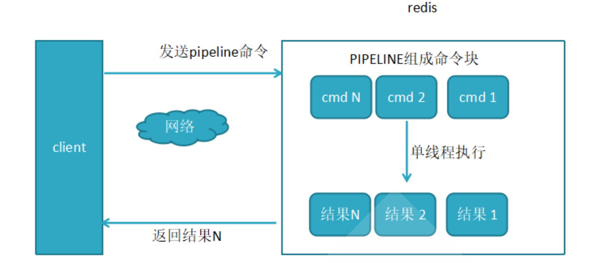

## 2.2Redis 安装

```bash
https://redis.io/docs/getting-started/installation/
```

#### 包安装

基于官方仓库包安装

```bash
https://redis.io/docs/install/install-redis/install-redis-on-linux/

#CentOS 8 由系统源提供
[root@centos8 ~]#dnf info redis
```

#### 源码编译

```bash
Redis 源码包官方下载链接：
http://download.redis.io/releases/
官方的安装方法：
https://redis.io/docs/getting-started/installation/install-redis-from-source/
```

#### 一键编译安装脚本

```bash
[root@ubuntu2004 ~]#cat install_redis.sh
#!/bin/bash
REDIS_VERSION=redis-6.2.5
PASSWORD=123456
INSTALL_DIR=/apps/redis
CPUS=`lscpu |awk '/^CPU\(s\)/{print $2}'`
. /etc/os-release
color () {
    RES_COL=60
    MOVE_TO_COL="echo -en \\033[${RES_COL}G"
    SETCOLOR_SUCCESS="echo -en \\033[1;32m"
    SETCOLOR_FAILURE="echo -en \\033[1;31m"
    SETCOLOR_WARNING="echo -en \\033[1;33m"
    SETCOLOR_NORMAL="echo -en \E[0m"
    echo -n "$1" && $MOVE_TO_COL
    echo -n "["
    if [ $2 = "success" -o $2 = "0" ] ;then
        ${SETCOLOR_SUCCESS}
        echo -n $" OK "    
    elif [ $2 = "failure" -o $2 = "1" ] ;then 
        ${SETCOLOR_FAILURE}
        echo -n $"FAILED"
    else
        ${SETCOLOR_WARNING}
        echo -n $"WARNING"
    fi
    ${SETCOLOR_NORMAL}
    echo -n "]"
    echo
}
prepare(){
    if [ $ID = "centos" ];then
       yum  -y install gcc make jemalloc-devel systemd-devel
    else
   apt update 
   apt -y install  gcc make libjemalloc-dev libsystemd-dev
    fi
    if [ $? -eq 0 ];then
       color "安装软件包成功"  0
    else
       color "安装软件包失败，请检查网络配置" 1
        exit
    fi
}
install() {   
    if [ ! -f ${REDIS_VERSION}.tar.gz ];then
        wget http://download.redis.io/releases/${REDIS_VERSION}.tar.gz || { color "Redis 源码下载失败" 1 ; exit; }
    fi
   tar xf ${REDIS_VERSION}.tar.gz
      cd ${REDIS_VERSION}
    make -j $CUPS USE_SYSTEMD=yes PREFIX=${INSTALL_DIR} install && color "Redis 
编译安装完成" 0 || { color "Redis 编译安装失败" 1 ;exit ; }
    ln -s ${INSTALL_DIR}/bin/redis-* /usr/bin/
    
    mkdir -p ${INSTALL_DIR}/{etc,log,data,run}
  
    cp redis.conf  ${INSTALL_DIR}/etc/
    sed -i -e 's/bind 127.0.0.1/bind 0.0.0.0/'  -e "/# requirepass/a requirepass $PASSWORD"  -e "/^dir .*/c dir ${INSTALL_DIR}/data/"  -e "/logfile .*/c logfile ${INSTALL_DIR}/log/redis-6379.log"  -e  "/^pidfile .*/c pidfile ${INSTALL_DIR}/run/redis_6379.pid" ${INSTALL_DIR}/etc/redis.conf
    if id redis &> /dev/null ;then 
         color "Redis 用户已存在" 1
    else
         useradd -r -s /sbin/nologin redis
         color "Redis 用户创建成功" 0
    fi
    chown -R redis.redis ${INSTALL_DIR}
    cat >> /etc/sysctl.conf <<EOF
net.core.somaxconn = 1024
vm.overcommit_memory = 1
EOF
   sysctl -p
    if [ $ID = "centos" ];then
        echo 'echo never > /sys/kernel/mm/transparent_hugepage/enabled' >> /etc/rc.d/rc.local
        chmod +x /etc/rc.d/rc.local
       /etc/rc.d/rc.local 
    else
        echo -e '#!/bin/bash\necho never > /sys/kernel/mm/transparent_hugepage/enabled' >> /etc/rc.local
        chmod +x /etc/rc.local
       /etc/rc.local
    fi
cat > /lib/systemd/system/redis.service <<EOF
[Unit]
Description=Redis persistent key-value database
After=network.target
[Service]
ExecStart=${INSTALL_DIR}/bin/redis-server ${INSTALL_DIR}/etc/redis.conf --supervised systemd
ExecStop=/bin/kill -s QUIT \$MAINPID
Type=notify
User=redis
Group=redis
RuntimeDirectory=redis
RuntimeDirectoryMode=0755
LimitNOFILE=1000000

[Install]
WantedBy=multi-user.target
EOF
     systemctl daemon-reload 
     systemctl enable --now redis &> /dev/null 
     if [ $? -eq 0 ];then
         color "Redis 服务启动成功,Redis信息如下:"  0
     else
         color "Redis 启动失败" 1
         exit
     fi
     sleep 2
     redis-cli -a $PASSWORD INFO Server 2> /dev/null
}
prepare 
install
```

#### 容器运行

```bash
https://hub.docker.com/_/redis
```

#### Redis 的多实例

测试环境中经常使用多实例,需要指定不同实例的相应的端口,配置文件,日志文件等相关配置

```bash
#生成的文件列表
[root@centos8 ~]#ll /apps/redis/

[root@centos8 ~]#tree /apps/redis/
/apps/redis/
├── bin
│   ├── redis-benchmark
│   ├── redis-check-aof
│   ├── redis-check-rdb
│   ├── redis-cli
│   ├── redis-sentinel -> redis-server
│   └── redis-server
├── data
│   ├── dump_6379.rdb
│   ├── dump_6380.rdb
│   └── dump_6381.rdb
├── etc
│   ├── redis_6379.conf
│   ├── redis_6380.conf
│   └── redis_6381.conf
├── log
│   ├── redis_6379.log
│   ├── redis_6380.log
│   └── redis_6381.log
└── run
   ├── redis_6379.pid
   ├── redis_6380.pid
   └── redis_6381.pid
   
   #编辑配置文件
[root@centos8 ~]#vim /apps/redis/etc/redis6379.conf
[root@centos8 ~]#grep 6379 /apps/redis/etc/redis6379.conf
# Accept connections on the specified port, default is 6379 (IANA #815344).
port 6379
# tls-port 6379
pidfile /apps/redis/run/redis_6379.pid
logfile "/apps/redis/log/redis_6379.log"
dbfilename dump_6379.rdb
# cluster-config-file nodes-6379.conf
# cluster-announce-tls-port 6379

[root@centos8 ~]#sed 's/6379/6380/' /apps/redis/etc/redis6379.conf > /apps/redis/etc/redis6380.conf
[root@centos8 ~]#sed 's/6379/6381/' /apps/redis/etc/redis6379.conf > /apps/redis/etc/redis6381.conf

[root@centos8 ~]#grep '^[^#]' /apps/redis/etc/redis_6379.conf

[root@centos8 ~]#grep 6380 /apps/redis/etc/redis_6380.conf 
# Accept connections on the specified port, default is 6380 (IANA #815344).
port 6380
pidfile /apps/redis/run/redis_6380.pid
logfile "/apps/redis/log/redis_6380.log"
dbfilename dump_6380.rdb
appendfilename "appendonly_6380.aof"
# cluster-config-file nodes-6380.conf
# cluster-announce-port 6380
# cluster-announce-bus-port 6380
[root@centos7 ~]#grep 6381 /apps/redis/etc/redis_6381.conf 
# Accept connections on the specified port, default is 6381 (IANA #815344).
port 6381
pidfile /apps/redis/run/redis_6381.pid
logfile "/apps/redis/log/redis_6381.log"
dbfilename dump_6381.rdb
appendfilename "appendonly_6381.aof"
# cluster-config-file nodes-6381.conf
# cluster-announce-port 6381

[root@centos8 ~]#cat /lib/systemd/system/redis6379.service

[root@centos8 ~]#systemctl daemon-reload
[root@centos8 ~]#systemctl enable --now redis6379 redis6380 redis6381
[root@centos8 ~]#ss -ntl
```

## 2.3Redis 相关工具和客户端连接


### 2.3.1redis-cli

```bash
#默认为本机无密码连接
redis-cli
#远程客户端连接,注意:Redis没有用户的概念
redis-cli -h <Redis服务器IP> -p <PORT> -a <PASSWORD> --no-auth-warning
```

### 2.3.2程序连接 Redis

```bash
https://redis.io/clients
```

**Python** **程序连接** **Redis**

```bash
https://redis.io/clients
```

```bash
https://github.com/andymccurdy/redis-py
```

**Golang** **程序连接** **Redis**

```bash
#初始化并定义模块名，即默认生成的程序名
[root@ubuntu2204 redis-go]#go mod init redis-go
#上面命令会生成go.mod文件
[root@ubuntu2204 redis-go]#cat go.mod 
module redis-go
#镜像加速
[root@ubuntu2204 redis-go]#go env -w GOPROXY=https://goproxy.cn,direct
```

**Another-Redis-Desktop-Manager**

```bash
https://github.com/qishibo/AnotherRedisDesktopManager
```

## 2.4Redis 配置管理

### 2.4.1 配置文件说明

看文档

### 2.4.2config 命令实现动态修改配置

config 命令用于查看当前redis配置、以及不重启redis服务实现动态更改redis配置等

**注意：不是所有配置都可以动态修改,且此方式无法持久保存**

```bash
#redis-7支持动态修改端口
127.0.0.1:6379> config set port 8888
OK
#redis-7 不支持动态修改日志文件路径
127.0.0.1:6379> config set logfile /tmp/redis.log
(error) ERR CONFIG SET failed (possibly related to argument 'logfile') - can't set immutable config
#redis-5不支持动态修改端口
127.0.0.1:6379> config set port 8888
(error) ERR Unsupported CONFIG parameter: port
```


```bash
#设置连接密码
127.0.0.1:6379> CONFIG SET requirepass 123456
OK
#查看连接密码
127.0.0.1:6379> CONFIG GET requirepass  
1) "requirepass"
2) "123456"
```

#### 获取当前配置

```bash
#奇数行为键，偶数行为值
127.0.0.1:6379> CONFIG GET *

#查看bind 
127.0.0.1:6379> CONFIG GET bind
1) "bind"
2) "0.0.0.0"

#Redis5.0有些设置无法修改,Redis6.2.6版本支持修改bind
127.0.0.1:6379> CONFIG SET bind 127.0.0.1
```

**设置** **Redis** **使用的最大内存量**

```bash
127.0.0.1:6379> CONFIG SET maxmemory 8589934592 或 1g|G
127.0.0.1:6379> CONFIG GET maxmemory
1) "maxmemory"
2) "8589934592"
```

### 2.4.3慢查询

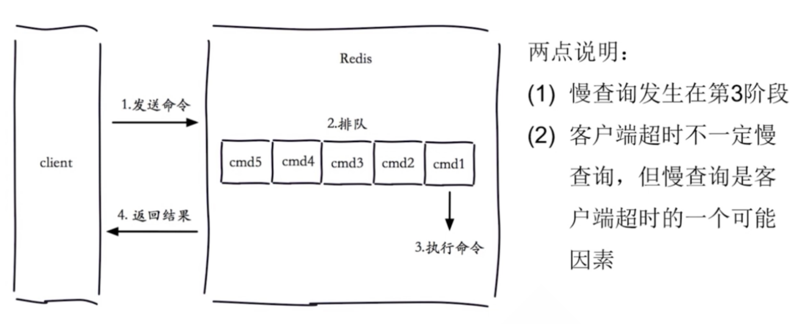

```bash
[root@centos8 ~]#vim /etc/redis.conf
slowlog-log-slower-than 1    #单位为us，指定超过1us即为慢的指令，默认值为10000us
slowlog-max-len 1024         #指定只保存最近的1024条慢记录，默认值为128
127.0.0.1:6379> SLOWLOG LEN  #查看慢日志的记录条数
(integer) 14
127.0.0.1:6379> SLOWLOG GET [n] #查看慢日志的最近n条记录，默认为10
1) 1) (integer) 14
2) (integer) 1544690617       #第2）行表示命令执行的时间戳，距离1970-1-1的秒数，date -d +@1544690617 可以转换
3) (integer) 4                #第3)行表示每条指令的执行时长

127.0.0.1:6379> SLOWLOG RESET #清空慢日志
OK
```

### 2.4.4Redis 持久化

Redis 是基于内存型的NoSQL, 和MySQL是不同的,使用内存进行数据保存

Redis支持两种数据持久化保存方法

RDB:Redis DataBase

AOF:AppendOnlyFile

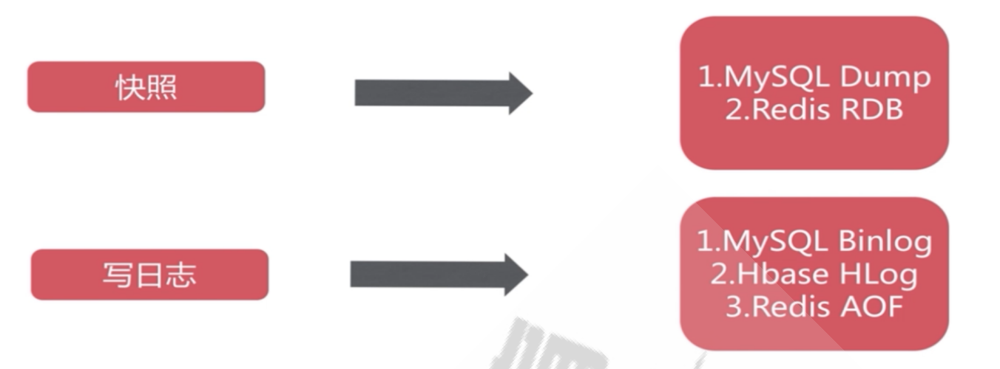

#### 2.4.4.1RDB

**RDB** **工作原理**

RDB(Redis DataBase)：是基于某个时间点的快照，注意RDB只保留当前最新版本的一个快照

相当于MySQL中的完全备份

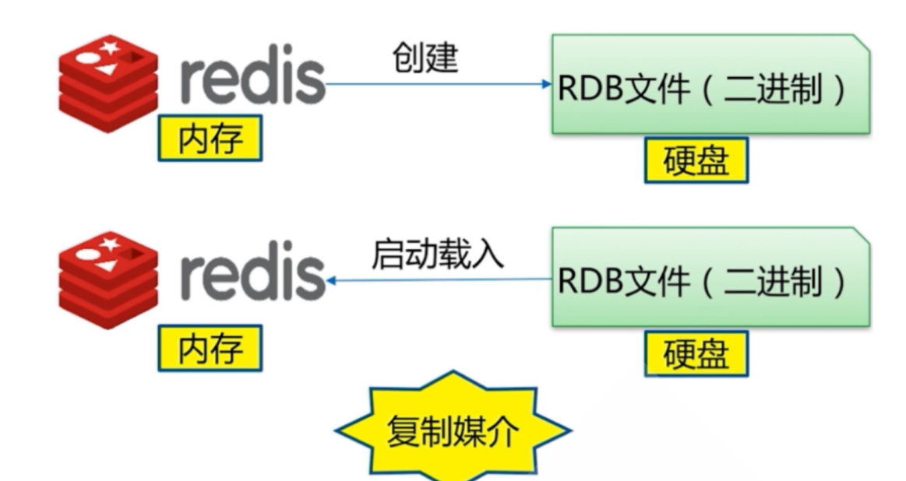

**RDB支持save和bgsave两种命令实现数据文件的持久化**

**范例：** **save执行过程会使用主进程进行快照，并生成临时文件temp-<主进程PID>.rdb文件**

```bash
#生成临时文件temp-<主进程PID>.rdb文件
[root@centos7 data]#redis-cli -a 123456 save&

[root@centos7 data]#pstree -p |grep redis ;ll /apps/redis/data
```

**RDB bgsave** **实现快照的具体过程**:

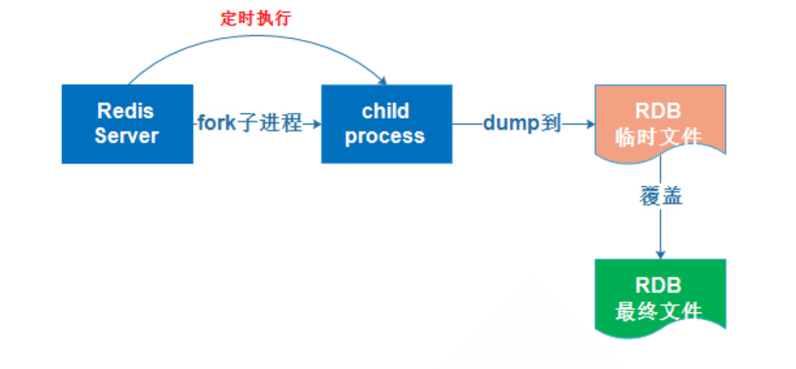

**RDB** **相关配置**

```bash
#在配置文件中的 save 选项设置多个保存条件，只有任何一个条件满足，服务器都会自动执行 BGSAVE 命令
#Redis7.0以后支持写在一行，如：save 3600 1 300 100 60 10000，此也为默认值
save 900 1         #900s内修改了1个key即触发保存RDB
save 300 10        #300s内修改了10个key即触发保存RDB
save 60 10000      #60s内修改了10000个key即触发保存RDB

dbfilename dump.rdb
dir ./             #编泽编译安装时默认RDB文件存放在Redis的工作目录,此配置可指定保存的数据目录
stop-writes-on-bgsave-error yes  #当快照失败是否仍允许写入,yes为出错后禁止写入,建议为no
rdbcompression yes
rdbchecksum yes
```

范例：RDB 相关配置

```bash
[root@ubuntu2004 ~]#grep save /apps/redis/etc/redis.conf

[root@ubuntu2004 ~]#redis-cli config get save
1) "save"
2) "3600 1 300 100 60 10000"

#禁用系统的自动快照
[root@ubuntu2004 ~]#vim /apps/redis/etc/redis.conf
save ""
# save 3600 1
# save 300 100
# save 60 10000

#支持动态修改，注意：需要添加双引号
127.0.0.1:6379> config set save "60 3"
OK
127.0.0.1:6379> config get save
1) "save"
2) "60 3"
```

##### 实现 RDB 方法

save: 同步,不推荐使用，使用主进程完成快照，因此会阻塞其它命令执行

bgsave: 异步后台执行,不影响其它命令的执行，会开启独立的子进程，因此不会阻赛其它命令执行

配置文件实现自动保存: 在配置文件中制定规则,自动执行bgsave

**RDB** **模式优点**

恢复的时候直接加载到内存即可，不用做其他处理，这种文件适合用于做灾备处理.可以通过自定义时间点执行redis指令bgsave或者save保存快照，实现多个版本的备份

比如: 可以在最近的24小时内，每小时备份一次RDB文件，并且在每个月的每一天，也备份一个RDB文件。这样的话，即使遇上问题，也可以随时将数据集还原到指定的不同的版本。

RDB在大数据集时恢复的速度比AOF方式要快

**RDB** **模式缺点**

不能实时保存数据

在数据集比较庞大时，fork()子进程可能会非常耗时，造成服务器在一定时间内停止处理客户端请求

##### 手动备份

```bash
#配置文件
[root@centos7 ~]#vim /apps/redis/etc/redis.conf
save ""
dbfilename dump_6379.rdb
dir "/data/redis"
appendonly no

#脚本
[root@centos8 ~]#cat redis_backup_rdb.sh 
#!/bin/bash
BACKUP=/backup/redis-rdb
DIR=/data/redis
FILE=dump_6379.rdb
PASS=123456
color () {
    RES_COL=60
    MOVE_TO_COL="echo -en \\033[${RES_COL}G"
    SETCOLOR_SUCCESS="echo -en \\033[1;32m"
    SETCOLOR_FAILURE="echo -en \\033[1;31m"
       SETCOLOR_WARNING="echo -en \\033[1;33m"
    SETCOLOR_NORMAL="echo -en \E[0m"
    echo -n "$1" && $MOVE_TO_COL
    echo -n "["
    if [ $2 = "success" -o $2 = "0" ] ;then
        ${SETCOLOR_SUCCESS}
        echo -n $" OK "    
    elif [ $2 = "failure" -o $2 = "1" ] ;then 
        ${SETCOLOR_FAILURE}
        echo -n $"FAILED"
    else
        ${SETCOLOR_WARNING}
        echo -n $"WARNING"
    fi
    ${SETCOLOR_NORMAL}
    echo -n "]"
    echo
}
redis-cli -h 127.0.0.1 -a $PASS --no-auth-warning bgsave 
result=`redis-cli -a $PASS --no-auth-warning info Persistence |grep rdb_bgsave_in_progress| sed -rn 's/.*:([0-9]+).*/\1/p'`
#result=`redis-cli -a $PASS --no-auth-warning info Persistence |awk -F: '/rdb_bgsave_in_progress/{print $2}'`
until [ $result -eq 0 ] ;do
    sleep 1
    result=`redis-cli -a $PASS --no-auth-warning info Persistence |awk -F: '/rdb_bgsave_in_progress/{print $2}'`
done
DATE=`date +%F_%H-%M-%S`
[ -e $BACKUP ] || { mkdir -p $BACKUP ; chown -R redis.redis $BACKUP; }
scp $DIR/$FILE $BACKUP/dump_6379-${DATE}.rdb backup-server:/backup/
color "Backup redis RDB" 0
```

#### 2.4.4.2 AOF


AOF 即 AppendOnlyFile，AOF 和 RDB 都采有COW机制

AOF可以指定不同的保存策略,**默认为每秒钟执行一次 fsync,**按照操作的顺序地将变更命令追加至指定的AOF日志文件尾部

在第一次启用AOF功能时，会做一次完全备份，后续将执行增量性备份，相当于完全数据备份+增量变化

如果同时启用RDB和AOF,进行恢复时,默认AOF文件优先级高于RDB文件,即会使用AOF文件进行恢复

**在第一次开启AOF功能时,会自动备份所有数据到AOF文件中,后续只会记录数据的更新指令**

正确启用AOF功能,访止数据丢失

```bash
[root@centos8 ~]#ll /var/lib/redis/

[root@centos8 ~]#redis-cli

127.0.0.1:6379> config get appendonly 
1) "appendonly"
2) "no"
127.0.0.1:6379> config set appendonly  yes  #自动触发AOF重写,会自动备份所有数据到AOF文件
OK
[root@centos8 ~]#ll /var/lib/redis/
[root@centos8 ~]#vim /etc/redis.conf
appendonly yes #改为yes 
#config set appendonly yes 后可以同时看到下面显示
```

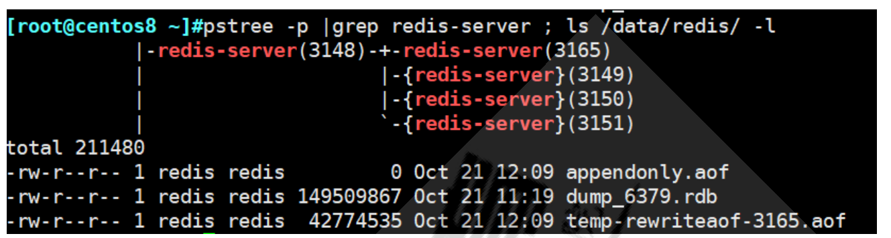

Redis 7.0以上版本的AOF是多个文件，Redis6.0以前版本只有一个文件

```bash
appendonly no #是否开启AOF日志记录，默认redis使用的是rdb方式持久化，这种方式在许多应用中已经足够用了，但是redis如果中途宕机，会导致可能有几分钟的数据丢失(取决于dump数据的间隔时间)，根据save来策略进行持久化，Append Only File是另一种持久化方式，可以提供更好的持久化特性，Redis会把每次写入的数据在接收后都写入 appendonly.aof 文件，每次启动时Redis都会先把这个文件的数据读入内存里，先忽略RDB文件。默认不启用此功能
appendfilename "appendonly.aof"  #文本文件AOF的文件名，存放在dir指令指定的目录中
appenddirname "appendonlydir"    #7.X 版指定目录名称
appendfsync everysec        #aof持久化策略的配置
#no表示由操作系统保证数据同步到磁盘,Linux的默认fsync策略是30秒，最多会丢失30s的数据
#always表示每次写入都执行fsync，以保证数据同步到磁盘,安全性高,性能较差
#everysec表示每秒执行一次fsync，可能会导致丢失这1s数据,此为默认值,也生产建议值
dir /path
#rewrite相关
no-appendfsync-on-rewrite yes
auto-aof-rewrite-percentage 100
auto-aof-rewrite-min-size 64mb
aof-load-truncated yes
```

**AOF Rewrite** **重写**（清理）

**AOF rewrite** **过程**

父进程生成一个新的子进程负责生成新的AOF文件，同时父进程将新的数据更新同时写入两个缓冲区aof_buf和aof_rewrite_buf

6.X版本之前新的AOF文件覆盖旧的AOF文件

7.X版本之后版本，新的AOF文件覆盖AOF目录中的RDB文件appendonly.aof.2.base.rdb，并生成一个新空的AOF文件appendonly.aof.2.incr.aof，此文件的编号会加1，同时更新appendonly.aof.manifest中的内容

```bash
#同时在执行bgrewriteaof操作和主进程写aof文件的操作，两者都会操作磁盘，而bgrewriteaof往往会涉及大量磁盘操作，这样就会造成主进程在写aof文件的时候出现阻塞的情形,以下参数实现控制
no-appendfsync-on-rewrite no #在aof rewrite期间,是否对aof新记录的append暂缓使用文件同步策略,主要考虑磁盘IO开支和请求阻塞时间。
#默认为no,表示"不暂缓",新的aof记录仍然会被立即同步到磁盘，是最安全的方式，不会丢失数据，但是要忍受阻塞的问题
#为yes,相当于将appendfsync设置为no，这说明并没有执行磁盘操作，只是写入了缓冲区，因此这样并不会造成阻塞（因为没有竞争磁盘），但是如果这个时候redis挂掉，就会丢失数据。丢失多少数据呢？Linux的默认fsync策略是30秒，最多会丢失30s的数据,但由于yes性能较好而且会避免出现阻塞因此比较推荐
#rewrite 即对aof文件进行整理,将空闲空间回收,从而可以减少恢复数据时间
auto-aof-rewrite-percentage 100 #当Aof log增长超过指定百分比例时，重写AOF文件，设置为0表示不自动重写Aof日志，重写是为了使aof体积保持最小，但是还可以确保保存最完整的数据
auto-aof-rewrite-min-size 64mb #触发aof rewrite的最小文件大小
aof-load-truncated yes #是否加载由于某些原因导致的末尾异常的AOF文件(主进程被kill/断电等)，建议yes
```

```bash
127.0.0.1:6379> BGREWRITEAOF
Background append only file rewriting started

#7.X版本
[root@ubuntu2204 etc]#redis-cli -a 123456 BGREWRITEAOF ; pstree -p |grep redis; ls -l /apps/redis/data/appendonlydir/


```

**AOF** **模式缺点**

即使有些操作是重复的也会全部记录，AOF 的文件大小一般要大于 RDB 格式的文件

#### 2.4.4.3 RDB和AOF 的选择

如果主要充当缓存功能,或者可以承受较长时间,比如数分钟数据的丢失, 通常生产环境一般只需启用RDB

即可,此也是默认值

如果一点数据都不能丢失,可以选择同时开启RDB和AOF

一般不建议只开启AOF

### 2.4.5Redis 常用命令

```bash
https://redis.io/commands

http://redisdoc.com/
http://doc.redisfans.com/
https://www.php.cn/manual/view/36359.html
```

**显示当前节点redis运行状态信息**

```bash
127.0.0.1:6379> INFO

#只显示指定部分的内容
[root@ubuntu2004 ~]#redis-cli info server

[root@ubuntu2004 ~]#redis-cli info Cluster
# Cluster
cluster_enabled:0
```

**SELECT**

切换数据库，相当于在MySQL的 USE DBNAME 指令

```bash
127.0.0.1:6379[15]> SELECT 0
OK
127.0.0.1:6379> SELECT 1
OK
127.0.0.1:6379[1]> SELECT 15
OK
127.0.0.1:6379[15]> SELECT 16
(error) ERR DB index is out of range
```

在Redis cluster 模式下不支持多个数据库,会出现下面错误

**KEYS**

查看当前库下的所有key，此命令慎用！

```bash
127.0.0.1:6379> KEYS n*
1) "n1"
2) "name"
127.0.0.1:6379> KEYS *
```

**DBSIZE**

返回当前库下的所有key 数量

**FLUSHDB**

强制清空当前库中的所有key，此命令慎用！

**FLUSHALL**

强制清空当前Redis服务器所有数据库中的所有key，即删除所有数据，此命令慎用！

**SHUTDOWN**

```bash
关闭Redis服务,停止所有客户端连接
如果有至少一个保存点在等待，执行 SAVE 命令
如果 AOF 选项被打开，更新 AOF 文件
关闭 redis 服务器(server)
如果持久化被打开的话， SHUTDOWN 命令会保证服务器正常关闭而不丢失任何数据。
另一方面，假如只是单纯地执行 SAVE 命令，然后再执行 QUIT 命令，则没有这一保证 —— 因为在执行SAVE 之后、执行 QUIT 之前的这段时间中间，其他客户端可能正在和服务器进行通讯，这时如果执行 QUIT 就会造成数据丢失。

#建议禁用此指令
vim /etc/redis.conf
rename-command shutdown ""
```

### 2.4.6Redis 数据类型

参考资料：http://www.redis.cn/topics/data-types.html

相关命令参考: http://redisdoc.com/

#### **字符串** **string**

字符串是一种最基本的Redis值类型。Redis字符串是二进制安全的，这意味着一个Redis字符串能包含任意类型的数据，例如： 一张JPEG格式的图片或者一个序列化的Ruby对象。一个字符串类型的值最多能存储512M字节的内容。Redis 中所有 key 都是字符串类型的。此数据类型最为常用

**创建一个key**

set 指令可以创建一个key 并赋值, 使用格式

```bash
#不论key是否存在.都设置
127.0.0.1:6379> set key1 value1
OK
127.0.0.1:6379> get key1
"value1"

127.0.0.1:6379> TYPE key1  #判断类型
string

127.0.0.1:6379> DEL key1
(integer) 1

#批量设置多个key
127.0.0.1:6379> MSET key1 value1 key2 value2 
OK

127.0.0.1:6379> MGET key1 key2
1) "value1"
2) "value2"

#追加key的数据
127.0.0.1:6379> APPEND key1 " append new value"
(integer) 12              #添加数据后,key1总共9个字节
127.0.0.1:6379> get key1
"value1 append new value"


#设置新值并返回旧值
127.0.0.1:6379> set name wang
OK
#set key newvalue并返回旧的value
127.0.0.1:6379> getset name wange
"wang"
127.0.0.1:6379> get name
"wange"

#返回字符串 key 对应值的字节数
127.0.0.1:6379> STRLEN name
(integer) 4

127.0.0.1:6379> set name 马哥教育
OK
127.0.0.1:6379> get name
"\xe9\xa9\xac\xe5\x93\xa5\xe6\x95\x99\xe8\x82\xb2"
127.0.0.1:6379> strlen name
(integer) 12

#判断 key 是否存在
127.0.0.1:6379> SET name wang ex 10
OK
127.0.0.1:6379> set age 20
OK
127.0.0.1:6379> EXISTS NAME #key的大小写敏感
(integer) 0
127.0.0.1:6379> EXISTS name age #返回值为1,表示存在2个key,0表示不存在
(integer) 2
127.0.0.1:6379> EXISTS name  #过几秒再看
(integer) 0

```


**获取** **key** **的过期时长**

```bash
ttl key #查看key的剩余生存时间,如果key过期后,会自动删除
-1 #返回值表示永不过期，默认创建的key是永不过期，重新对key赋值，也会从有剩余生命周期变成永不过期
-2 #返回值表示没有此key
num #key的剩余有效期

#重置key的过期时长
127.0.0.1:6379> TTL name
(integer) 148
127.0.0.1:6379> EXPIRE name 1000
(integer) 1
127.0.0.1:6379> TTL name
(integer) 999

#取消key的期限
127.0.0.1:6379> TTL name
(integer) 999
127.0.0.1:6379> PERSIST name
(integer) 1
127.0.0.1:6379> TTL name
(integer) -1
```

**数字递增**

利用INCR命令簇（INCR, **数字递减**DECR, INCRBY,DECRBY)来把字符串当作原子计数器使用。

```bash
127.0.0.1:6379> set num 10 #设置初始值
OK
127.0.0.1:6379> INCR num
(integer) 11


redis> SET mykey 10
OK
redis> INCRBY mykey 5
(integer) 15
127.0.0.1:6379> get mykey
"15"
127.0.0.1:6379> INCRBY mykey -10
(integer) 5
127.0.0.1:6379> get mykey
"5
```

#### **列表** **list**

**创建列表和数据**

```bash
#从左边添加数据，已添加的需向右移
127.0.0.1:6379> LPUSH name mage wang zhang  #根据顺序逐个写入name，最后的zhang会在列表的最左侧。
(integer) 3
127.0.0.1:6379> TYPE name
list
#从右边添加数据
127.0.0.1:6379> RPUSH course linux python go

127.0.0.1:6379> LLEN list1
(integer) 3

127.0.0.1:6379> LINDEX list1 0 #获取0编号的元素
"d"
127.0.0.1:6379> LINDEX list1 3 #获取3编号的元素
"a"

127.0.0.1:6379> LRANGE list2 1 2 #指定范围
1) "wang"
2) "li"

127.0.0.1:6379> LRANGE list2 0 -1  #所有元素
```

**删除列表数据**

```bash
127.0.0.1:6379> LPOP list1 #弹出左边第一个元素，即删除第一个
127.0.0.1:6379> RPOP list1  #弹出右边第一个元素，即删除最后一个

127.0.0.1:6379> LTRIM list1 1 2 #只保留1，2号元素

#删除list
127.0.0.1:6379> DEL list1
(integer) 1
127.0.0.1:6379> EXISTS list1
(integer) 0
```

#### **集合** **set**

```bash
127.0.0.1:6379> SADD set1 v1
(integer) 1
127.0.0.1:6379> SADD set2 v2 v4
(integer) 2
127.0.0.1:6379> TYPE set1
set

#追加时，只能追加不存在的数据，不能追加已经存在的数值
127.0.0.1:6379> SADD set1 v2 v3 v4
(integer) 3
127.0.0.1:6379> SADD set1 v2 #已存在的value,无法再次添加
(integer) 0

#获取集合的所有数据
127.0.0.1:6379> SMEMBERS set1
#删除集合中的元素
127.0.0.1:6379> sadd goods mobile laptop car 
(integer) 3
127.0.0.1:6379> srem goods car
#取集合的交集
127.0.0.1:6379> SINTER set1 set2
1) "v4"
2) "v2"


#有序集合 sorted set
有序
无重复元素
每个元素是由score和value组成
score 可以重复
value 不可以重复

#创建有序集合
127.0.0.1:6379> ZADD zset1 1 v1  #分数为1
```

#### **哈希** **hash**

hash 即字典, 用于保存字符串字段field和字符串值value之间的映射，即key/value做为数据部分

hash特别适合用于存储对象场景

哈希特点

  无序

  K/V 对

  适用于存放相关的数据

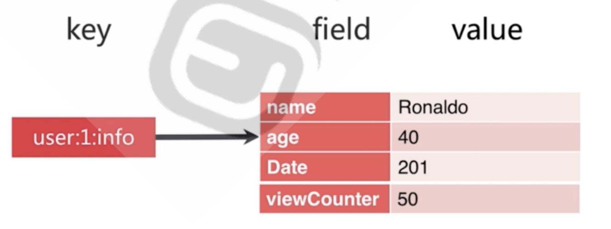

```bash
#创建 hash
127.0.0.1:6379> HSET 9527 name zhouxingxing age 20
(integer) 2
#查看所有字段的值
127.0.0.1:6379> hgetall 9527

127.0.0.1:6379> HGET 9527 name
"zhouxingxing"


#增加字段
127.0.0.1:6379> HSET 9527 gender male
#删除
127.0.0.1:6379> HDEL 9527 age
(integer) 1

#批量设置hash key的多个field和value
127.0.0.1:6379> HMSET 9527 name zhouxingxing age 50 city hongkong

127.0.0.1:6379> HGETALL 9527
```

### 2.4.7消息队列

消息队列: 把要传输的数据放在队列中,从而实现应用之间的数据交换

常用功能: 可以实现多个应用系统之间的解耦,异步,削峰/限流等

消息队列分为两种

生产者/消费者模式: Producer/Consumer

发布者/订阅者模式: Publisher/Subscriber


#### 2.4.7.1生产者消费者模式

生产者消费者模式下，多个消费者同时监听一个频道(redis用队列实现)，但是生产者产生的一个消息只能被最先抢到消息的一个消费者消费一次,队列中的消息由可以多个生产者写入，也可以有不同的消费者取出进行消费处理.此模式应用广泛

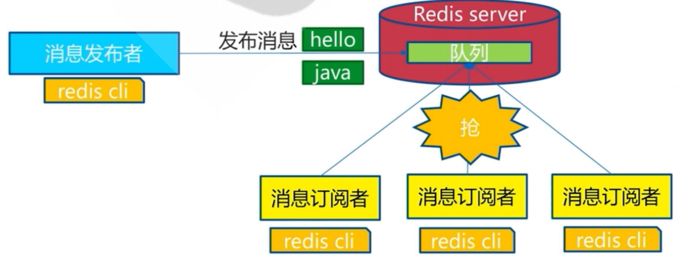

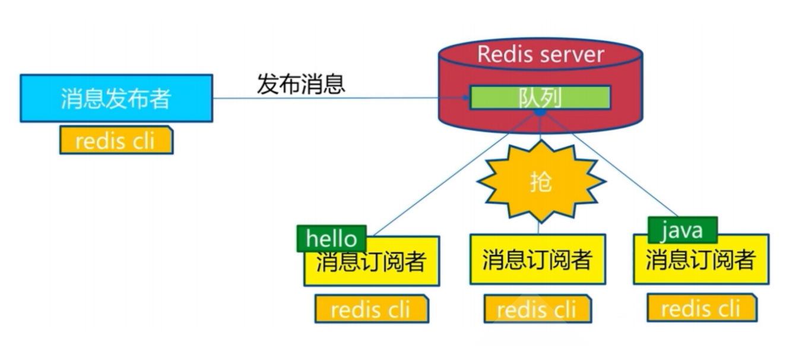

```bash
#生产者生成消息
127.0.0.1:6379> LPUSH channel1 message1 #从管道的左侧写入
...
#获取所有消息
127.0.0.1:6379> LRANGE channel1 0 -1

#消费者消费消息
127.0.0.1:6379> RPOP channel1 #基于实现消息队列的先进先出原则,从管道的右侧消费
"message1"

#验证队列消息消费完成
127.0.0.1:6379> LRANGE channel1 0 -1
(empty list or set) #验证队列中的消息全部消费完成
```

#### 2.4.7.2 发布者订阅模式

在发布者订阅者Publisher/Subscriber模式下，发布者Publisher将消息发布到指定的频道channel，事先监听此channel的一个或多个订阅者Subscriber都会收到相同的消息。即**一个消息可以由多个订阅者获取到**. **对于社交应用中的群聊、群发、群公告等场景适用于此模式**

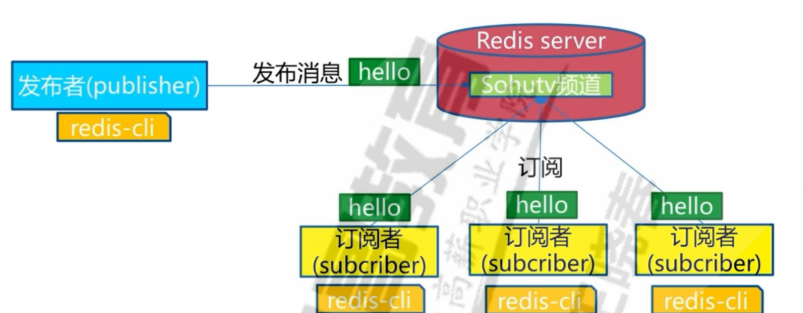

```bash
#订阅者订阅频道
127.0.0.1:6379> SUBSCRIBE channel01 #订阅者事先订阅指定的频道，之后发布的消息才能收到
Reading messages... (press Ctrl-C to quit)
1) "subscribe"
2) "channel01"
3) (integer) 1

#发布者发布消息
127.0.0.1:6379> PUBLISH channel01 message1 #发布者发布信息到指定频道
(integer) 2   #订阅者个数
127.0.0.1:6379> PUBLISH channel01 message2
(integer) 2

#各个订阅者都能收到消息
#订阅指定的多个频道
127.0.0.1:6379> SUBSCRIBE channel01 channel02
127.0.0.1:6379> PSUBSCRIBE *  #支持通配符*

#取消订阅频道
127.0.0.1:6379> unsubscribe channel01
```

## 2.5Redis 集群与高可用

### 2.5.1Redis 主从复制

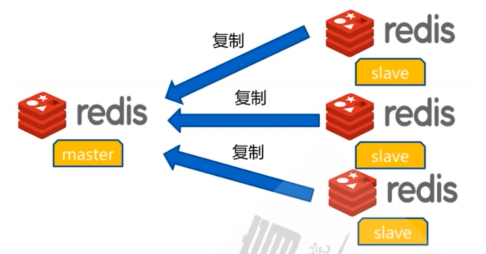

#### 2.5.1.1Redis 主从复制架构

Redis和MySQL的主从模式类似，也支持主从模式（master/slave），可以实现Redis数据的跨主机的远程备份

常见客户端连接主从的架构:

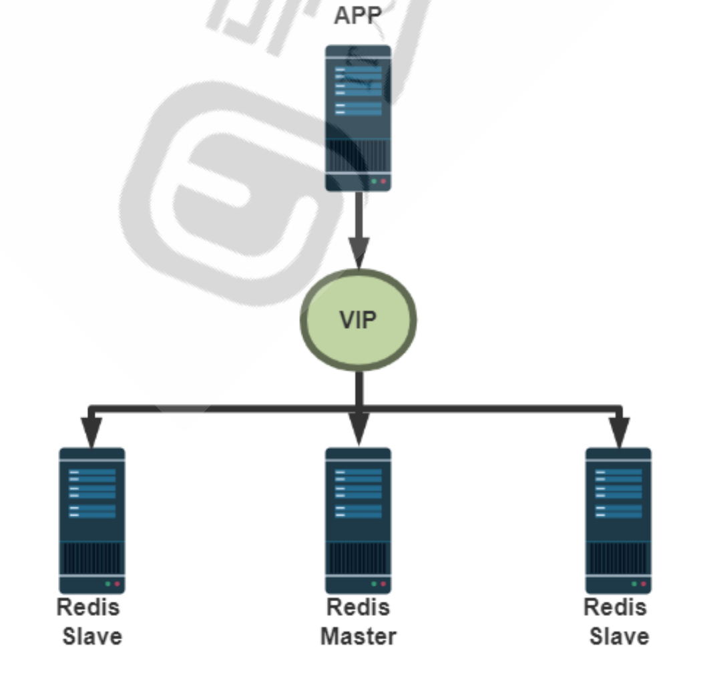

**主从复制特点**

一个master可以有多个slave

一个slave只能有一个master

数据流向是从master到slave单向的

master 可读可写

slave 只读

#### 2.5.1.2主从复制实现

**当master出现故障后,可以自动提升一个slave节点变成新的Mster,因此Redis Slave 需要设置和master相同的连接密码**

此外当一个Slave提升为新的master时需要通过**持久化**实现数据的恢复

当配置Redis复制功能时，强烈建议打开主服务器的**持久化**功能。否则主节点Redis服务应该要避免自动启动。


**参考案例: 导致主从服务器数据全部丢失**

假设节点A为主服务器，并且关闭了持久化。并且节点B和节点C从节点A复制数据

节点A崩溃，然后由自动拉起服务重启了节点A.由于节点A的持久化被关闭了，所以重启之后没有任何数据

节点B和节点C将从节点A复制数据，但是A的数据是空的，于是就把自身保存的数据副本删除。


在关闭主服务器上的持久化，并同时开启自动拉起进程的情况下，即便使用Sentinel来实现Redis的高可用性，也是非常危险的。因为主服务器可能拉起得非常快，以至于Sentinel在配置的心跳时间间隔内没有检测到主服务器已被重启，然后还是会发生上面描述的情况,导致数据丢失。

无论何时，数据安全都是极其重要的，所以应该禁止主服务器关闭持久化的同时自动启动。

**主从命令配置**

**启用主从同步**

Redis Server 默认为 master节点，如果要配置为从节点,需要指定master服务器的IP,端口及连接密码

在从节点执行 REPLICAOF MASTER_IP PORT 指令可以启用主从同步复制功能

早期版本使用 SLAVEOF 指令

```bash
127.0.0.1:6379> REPLICAOF MASTER_IP PORT #新版推荐使用
127.0.0.1:6379> CONFIG SET masterauth <masterpass>
```


```bash
#在mater上设置key1
[root@centos8 ~]#redis-cli 
127.0.0.1:6379> AUTH 123456
OK
127.0.0.1:6379> INFO replication
127.0.0.1:6379> SET key1 v1-master
OK
127.0.0.1:6379> KEYS *
1) "key1"
127.0.0.1:6379> GET key1
"v1-master"
```

```bash
#以下都在slave上执行，登录
[root@centos8 ~]#redis-cli 
127.0.0.1:6379> info 
NOAUTH Authentication required.
127.0.0.1:6379> AUTH 123456
OK
127.0.0.1:6379> INFO replication  #查看当前角色默认为master
127.0.0.1:6379> SET key1 v1-slave-18
OK
127.0.0.1:6379> KEYS *
1) "key1"
127.0.0.1:6379> GET key1
"v1-slave-18"

#在第二个slave,也设置相同的key1,但值不同
127.0.0.1:6379> KEYS *
1) "key1"
127.0.0.1:6379> GET key1
"v1-slave-28"

127.0.0.1:6379> INFO replication
# Replication
role:master

#在slave上设置master的IP和端口，4.0版之前的指令为slaveof 
127.0.0.1:6379> REPLICAOF 10.0.0.8 6379 #仍可使用SLAVEOF MasterIP Port
#在slave上设置master的密码，才可以同步
127.0.0.1:6379> CONFIG SET masterauth 123456

127.0.0.1:6379> INFO replication
# Replication   #角色变为slave
role:slave
master_host:10.0.0.8   #指向master

#查看已经同步成功
127.0.0.1:6379> GET key1
"v1-master"
```

```bash
#在master上可以看到所有slave信息
127.0.0.1:6379> INFO replication
```

**删除主从同步**

在从节点执行 REPLICAOF NO ONE 或 SLAVEOF NO ONE 指令可以取消主从复制

取消复制 会断开和master的连接而不再有主从复制关联, 但不会清除slave上已有的数据

```bash
#新版
127.0.0.1:6379> REPLICAOF NO ONE
```

**验证同步**

**在** **master** **上观察日志**

```bash
[root@centos8 ~]#tail /var/log/redis/redis.log
```

**在** **slave** **节点观察日志**

```bash
[root@centos8 ~]#tail -f /var/log/redis/redis.log
```

**修改** **Slave** **节点配置文件**

```bash
[root@centos8 ~]#vim /etc/redis.conf 
 .......
# replicaof <masterip> <masterport>
replicaof 10.0.0.8 6379 #指定master的IP和端口号

# masterauth <master-password>
masterauth 123456     #如果密码需要设置
requirepass 123456    #和masterauth保持一致，用于将来从节点提升主后使用
[root@centos8 ~]#systemctl restart redis
```

#### 2.5.1.3主从复制故障恢复

**Slave** **节点故障和恢复**

当 slave 节点故障时，将Redis Client指向另一个 slave 节点即可,并及时修复故障从节点

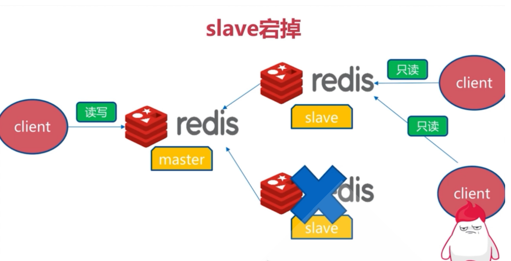

**Master** **节点故障和恢复**

当 master 节点故障时，需要提升slave为新的master

master故障后，当前还只能手动提升一个slave为新master，不能自动切换。

之后将其它的slave节点重新指定新的master为master节点

Master的切换会导致master_replid发生变化，slave之前的master_replid就和当前master不一致从而会引发所有 slave的全量同步。

**主从复制故障恢复实现**

假设当前主节点10.0.0.8故障,提升10.0.0.18为新的master

```bash
#将当前 slave 节点提升为 master 角色
127.0.0.1:6379> REPLICAOF NO ONE   #旧版使用SLAVEOF no one
OK
(5.04s)
127.0.0.1:6379> info replication

#测试能否写入数据
127.0.0.1:6379> set keytest1 vtest1
OK

#修改所有slave 指向新的master节点
#修改10.0.0.28节点指向新的master节点10.0.0.18
127.0.0.1:6379> SLAVEOF 10.0.0.18 6379
OK
127.0.0.1:6379> set key100 v100
(error) READONLY You can't write against a read only replica.
#查看日志
[root@centos8 ~]#tail -f /var/log/redis/redis.log
```

#### 2.5.1.4实现 Redis 的级联复制

即实现基于Slave节点的Slave

master和slave1节点无需修改,只需要修改slave2及slave3指向slave1做为mater即可

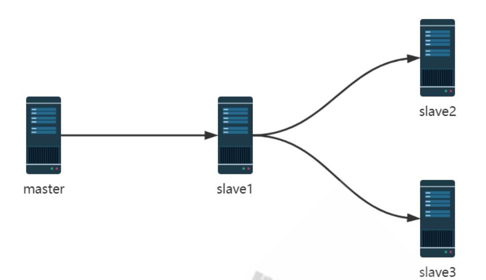

#### 2.5.1.5主从复制优化

**主从复制过程**

Redis主从复制分为全量同步和增量同步

Redis 的主从同步是非阻塞的，即同步过程不会影响主服务器的正常访问

**注意:主节点重启会导致全量同步,从节点重启只会导致增量同步**

**全量复制过程** **Full resync**

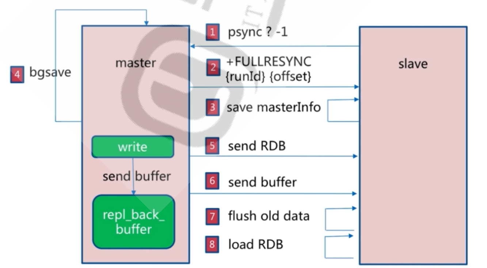

全量复制发生在下面情况

从节点首次连接主节点(无master_replid/run_id)

从节点的复制偏移量不在复制积压缓冲区内

从节点无法连接主节点超过一定的时间

**增量复制过程** **partial resynchronization**

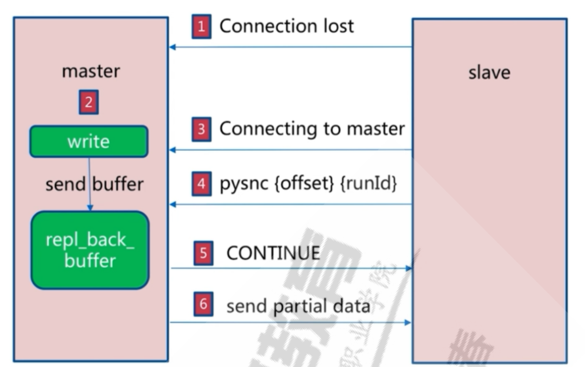

在主从复制首次完成全量同步之后再次需要同步时,从服务器只要发送当前的offset位置(类似于MySQL的binlog的位置)给主服务器，然后主服务器根据相应的位置将之后的数据(包括写在缓冲区的积压数据)发送给从服务器,再次将其保存到从节点内存即可。

即首次全量复制,之后的复制基本增量复制实现


```bash
#复制缓冲区(环形队列)配置参数
#master的写入数据缓冲区，用于记录自上一次同步后到下一次同步过程中间的写入命令，计算公式：repl-backlog-size = 允许从节点最大中断时长 * 主实例offset每秒写入量，比如:master每秒最大写入64mb，最大允许60秒，那么就要设置为64mb*60秒=3840MB(3.8G),建议此值是设置的足够大，默认值为1M
repl-backlog-size 1mb 
#如果一段时间后没有slave连接到master，则backlog size的内存将会被释放。如果值为0则表示永远不释放这部份内存。
repl-backlog-ttl   3600
```

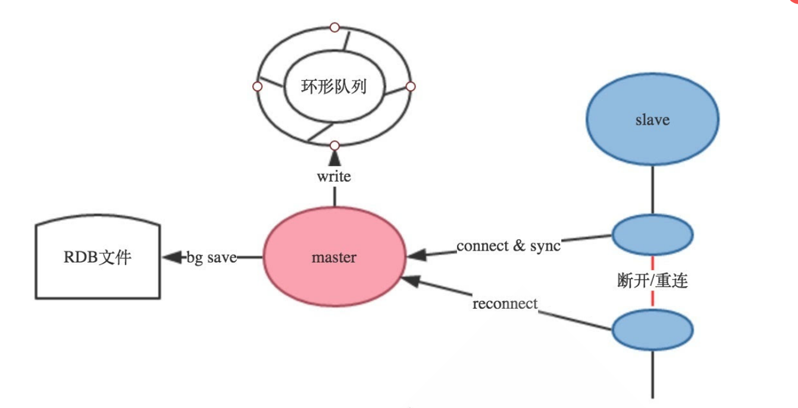

**避免全量复制**

第一次全量复制不可避免,后续的全量复制可以利用小主节点(内存小),业务低峰时进行全量

节点RUN_ID不匹配:主节点重启会导致RUN_ID变化,可能会触发全量复制,可以利用config命令动态修改配置，故障转移例如哨兵或集群选举新的主节点也不会全量复制,而从节点重启动,不会导致全量复制,只会增量复制

复制积压缓冲区不足: 当主节点生成的新数据大于缓冲区大小,从节点恢复和主节点连接后,会导致全量复制.解决方法将repl-backlog-size 调大

**避免复制风暴**

单主节点复制风暴

当主节点重启，多从节点复制

解决方法:更换复制拓扑

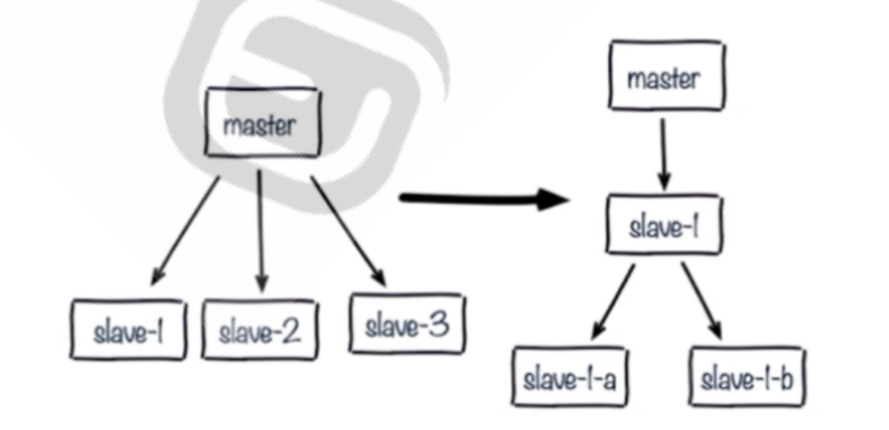

单机器多实例复制风暴

机器宕机后，大量全量复制

**主从同步优化配置**

**性能相关配置**

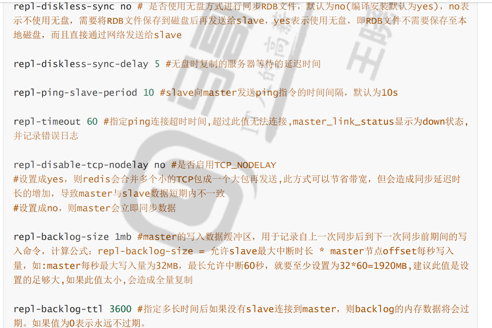

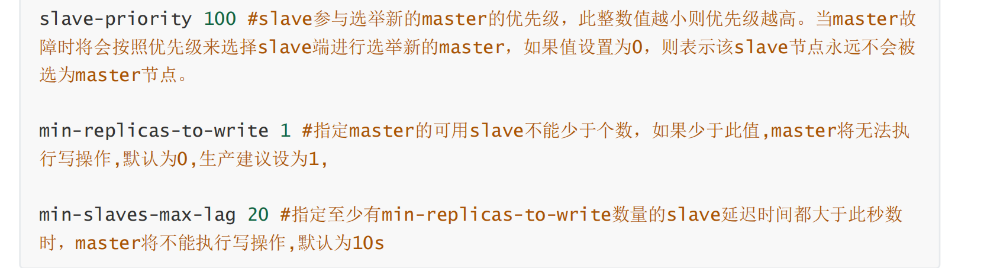

#### 2.5.1.6常见主从复制故障

**主从硬件和软件配置不一致**

主从节点的maxmemory不一致,主节点内存大于从节点内存,主从复制可能丢失数据

**Master** **节点密码错误**

**Redis** **版本不一致**

**保护（安全）模式下无法远程连接**

如果开启了安全模式，并且没有设置bind地址和密码,会导致无法远程连接

### 2.5.2Redis 哨兵 Sentinel

需要解决的主从复制以下存在的问题：

master和slave角色的自动切换，且不能影响业务

提升Redis服务整体性能，支持更高并发访问

#### 2.5.2.1哨兵 Sentinel 工作原理

**Sentinel** **架构和故障转移机制**

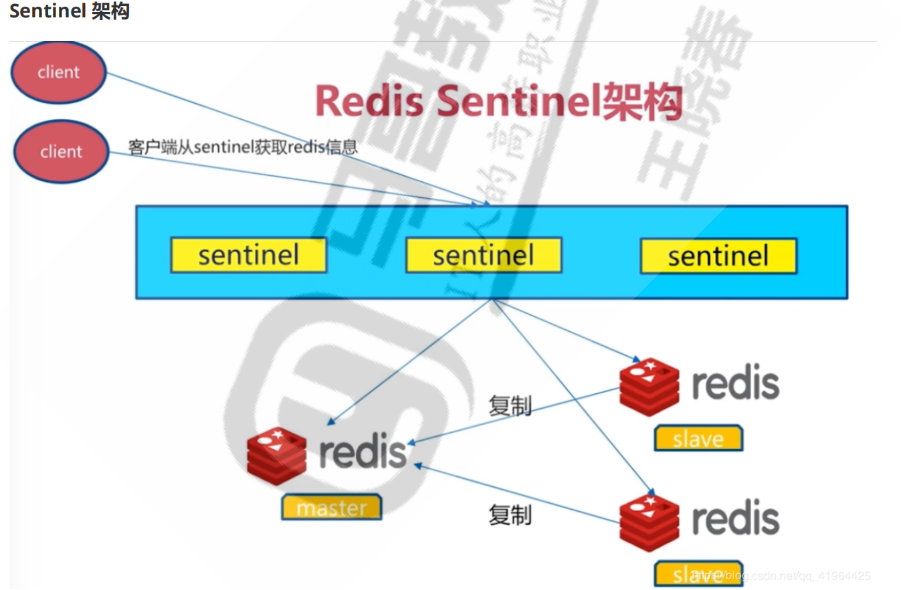

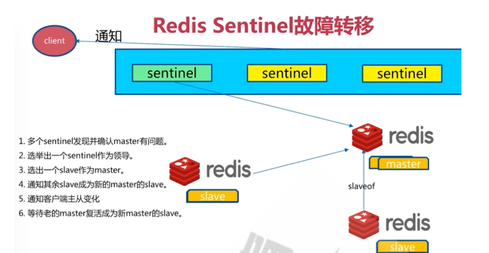

专门的Sentinel 服务进程是用于监控redis集群中Master工作的状态，当Master主服务器发生故障的时候，可以实现Master和Slave的角色的自动切换，从而实现系统的高可用性

Sentinel是一个分布式系统,即需要在多个节点上各自同时运行一个sentinel进程，Sentienl 进程通过流言协议(gossip protocols)来接收关于Master是否下线状态，并使用投票协议(Agreement Protocols)来决定是否执行自动故障转移,并选择合适的Slave作为新的Master

每个Sentinel进程会向其它Sentinel、Master、Slave定时发送消息，来确认对方是否存活

**Sentinel中的三个定时任务**

1.每10 秒每个sentinel 对master和slave执行info

发现slave节点

确认主从关系

2.每2秒每个sentinel通过master节点的channel交换信息(pub/sub)

通过sentinel__:hello频道交互

交互对节点的“看法”和自身信息

3.每1秒每个sentinel对其他sentinel和redis执行ping

#### 2.5.2.2实现哨兵架构

以下案例实现一主两从的基于哨兵的高可用Redis架构

**哨兵需要先实现主从复制**

哨兵的前提是已经实现了Redis的主从复制

1.准备主从环境配置

2.配置 slave1

3.配置 slave2

**编辑哨兵配置**

**sentinel** **配置**

Sentinel实际上是一个特殊的redis服务器,有些redis指令支持,但很多指令并不支持.默认监听在26379/tcp端口.

哨兵服务可以和Redis服务器分开部署在不同主机，但为了节约成本一般会部署在一起

所有redis节点使用相同的以下示例的配置文件

```bash
#如果是编译安装，在源码目录有sentinel.conf，复制到安装目录即可，
如:/apps/redis/etc/sentinel.conf
[root@ubuntu2204 ~]#cp redis-7.0.5/sentinel.conf /apps/redis/etc/sentinel.conf
[root@centos8 ~]#cp redis-6.2.5/sentinel.conf /apps/redis/etc/sentinel.conf
[root@ubuntu2204 ~]#chown redis.redis /apps/redis/etc/sentinel.conf 
#包安装修改配置文件
[root@centos8 ~]#vim /etc/redis-sentinel.conf 
bind 0.0.0.0
port 26379
daemonize yes
pidfile "redis-sentinel.pid"
logfile "sentinel_26379.log"
dir "/tmp"  #工作目录
sentinel monitor mymaster 10.0.0.8 6379 2
#mymaster是集群的名称，此行指定当前mymaster集群中master服务器的地址和端口
#2为法定人数限制(quorum)，即有几个sentinel认为master down了就进行故障转移，一般此值是所有sentinel节点(一般总数是>=3的 奇数,如:3,5,7等)的一半以上的整数值，比如，总数是3，即3/2=1.5，取整为2,是master的ODOWN客观下线的依据

sentinel auth-pass mymaster 123456
#mymaster集群中master的密码，注意此行要在上面行的下面,注意：要求这组redis主从复制所有节点的密码是一样的

sentinel down-after-milliseconds mymaster 30000
#判断mymaster集群中所有节点的主观下线(SDOWN)的时间，单位：毫秒，建议3000
sentinel parallel-syncs mymaster 1
#发生故障转移后，可以同时向新master同步数据的slave的数量，数字越小总同步时间越长，但可以减轻新master的负载压力
sentinel failover-timeout mymaster 180000
#所有slaves指向新的master所需的超时时间，单位：毫秒
sentinel deny-scripts-reconfig yes #禁止修改脚本
logfile /var/log/redis/sentinel.log

#编译安装修改配置文件
[root@ubuntu2204 ~]#vim /apps/redis/etc/sentinel.conf
[root@ubuntu2204 ~]#grep -Ev "#|^$" /apps/redis/etc/sentinel.conf
```

**三个哨兵服务器的配置都如下**

```bash
[root@redis-master ~]#grep -vE "^#|^$" /etc/redis-sentinel.conf 
port 26379
daemonize no
pidfile "/var/run/redis-sentinel.pid"
logfile "/var/log/redis/sentinel.log"
dir "/tmp"
sentinel monitor mymaster 10.0.0.8 6379 2   #修改此行
sentinel auth-pass mymaster 123456 #增加此行
sentinel down-after-milliseconds mymaster 3000   #修改此行
sentinel parallel-syncs mymaster 1
sentinel failover-timeout mymaster 180000
sentinel deny-scripts-reconfig yes
#注意此行自动生成必须唯一,一般不需要修改，如果相同则修改此值需重启redis和sentinel服务
sentinel myid 50547f34ed71fd48c197924969937e738a39975b  
.....
# Generated by CONFIG REWRITE
protected-mode no
supervised systemd
sentinel leader-epoch mymaster 0

sentinel known-replica mymaster 10.0.0.28 6379
sentinel known-replica mymaster 10.0.0.18 6379
sentinel current-epoch 0
[root@redis-master ~]#scp /etc/redis-sentinel.conf redis-slave1:/etc/
[root@redis-master ~]#scp /etc/redis-sentinel.conf redis-slave2:/etc/
```

**启动哨兵服务**

```bash
#确保每个哨兵主机myid不同，如果相同，必须手动修改为不同的值
[root@redis-slave1 ~]#vim /etc/redis-sentinel.conf
sentinel myid 50547f34ed71fd48c197924969937e738a39975c 
[root@redis-slave2 ~]#vim /etc/redis-sentinel.conf
sentinel myid 50547f34ed71fd48c197924969937e738a39975d 
[root@redis-master ~]#systemctl enable --now redis-sentinel.service
[root@redis-slave1 ~]#systemctl enable --now redis-sentinel.service
[root@redis-slave2 ~]#systemctl enable --now redis-sentinel.service
```

如果是编译安装,在所有哨兵服务器执行下面操作启动哨兵

```bash
[root@redis-master ~]##vim /apps/redis/etc/sentinel.conf
bind 0.0.0.0
port 26379
daemonize yes
pidfile "redis-sentinel.pid"
Logfile "sentinel_26379.log"
dir "/apps/redis/data"
sentinel monitor mymaster 10.0.0.8 6379 2
sentinel auth-pass mymaster 123456
sentinel down-after-milliseconds mymaster 15000
sentinel parallel-syncs mymaster 1
sentinel failover-timeout mymaster 180000
sentinel deny-scripts-reconfig yes
[root@redis-master ~]#/apps/redis/bin/redis-sentinel 
/apps/redis/etc/sentinel.conf
#如果是编译安装，可以在所有节点生成新的service文件
[root@redis-master ~]#cat /lib/systemd/system/redis-sentinel.service
[Unit]
Description=Redis Sentinel
After=network.target
[Service]
ExecStart=/apps/redis/bin/redis-sentinel /apps/redis/etc/sentinel.conf --
supervised systemd
ExecStop=/bin/kill -s QUIT $MAINPID
User=redis
Group=redis
RuntimeDirectory=redis
Mode=0755
[Install]
WantedBy=multi-user.target
#注意所有节点的目录权限,否则无法启动服务
[root@redis-master ~]#chown -R redis.redis /apps/redis/
[root@redis-master ~]#systemctl daemon-reload
[root@redis-master ~]#systemctl enable --now redis-sentinel.service
```

#### 2.5.2.3验证哨兵服务

**查看哨兵服务端口状态**

26379

**查看哨兵日志**

```bash
[root@redis-master ~]#tail -f /var/log/redis/sentinel.log
```

**当前sentinel状态**

在sentinel状态中尤其是最后一行，涉及到masterIP是多少，有几个slave，有几个sentinels，必须是符合全部服务器数量

```bash
[root@redis-master ~]#redis-cli -p 26379
127.0.0.1:26379> INFO sentinel
# Sentinel
sentinel_masters:1
sentinel_tilt:0
sentinel_running_scripts:0
sentinel_scripts_queue_length:0
sentinel_simulate_failure_flags:0
master0:name=mymaster,status=ok,address=10.0.0.8:6379,slaves=2,sentinels=3 #两个slave,三个sentinel服务器,如果sentinels值不符合,检查myid可能冲突
```

**停止** **Master** **节点实现故障转移**

```bash
[root@redis-master ~]#killall redis-server
#查看各节点上哨兵信息
[root@redis-master ~]#redis-cli -p 26379
127.0.0.1:26379> INFO sentinel
```

**故障转移时sentinel的信息**

```bash
[root@redis-master ~]#tail -f /var/log/redis/sentinel.log
38028:X 20 Feb 2020 17:42:28.799 +failover-end master mymaster 10.0.0.8 6379
38028:X 20 Feb 2020 17:42:28.799 # +switch-master mymaster 10.0.0.8 6379 10.0.0.18 6379
```

**验证故障转移**

故障转移后redis.conf中的replicaof行的master IP会被修改

```bash
[root@redis-slave2 ~]#grep ^replicaof /etc/redis.conf
```

哨兵配置文件的sentinel monitor IP 同样也会被修改

**验证** **Redis** **各节点状态**

新的master 状态

```bash
#新的master 状态
127.0.0.1:6379> INFO replication
#另一个slave指向新的master
```

**原** **Master** **重新加入** **Redis** **集群**

```bash
[root@redis-master ~]#cat /etc/redis.conf 
#sentinel会自动修改下面行指向新的master
replicaof 10.0.0.18 6379
[root@redis-master ~]#redis-cli -a 123456
127.0.0.1:6379> INFO replication

[root@redis-master ~]#redis-cli -p 26379
127.0.0.1:26379> INFO sentinel
```

#### 2.5.2.4Sentinel 运维

在Sentinel主机手动触发故障切换

```bash
#redis-cli   -p 26379
127.0.0.1:26379> sentinel failover <masterName>
```

手动故障转移

```bash
[root@centos8 ~]#vim /etc/redis.conf
replica-priority 10 #指定优先级,值越小sentinel会优先将之选为新的master,默为值为100
[root@centos8 ~]#systemctl restart redis
#或者动态修改
[root@centos8 ~]#redis-cli -a 123456
127.0.0.1:6379> CONFIG GET replica-priority
127.0.0.1:6379> CONFIG SET replica-priority 99
OK
127.0.0.1:6379> CONFIG GET replica-priority

[root@centos8 ~]#redis-cli   -p 26379
127.0.0.1:26379> sentinel failover mymaster  #原主节点自动变成从节点
```

**应用程序连接** **Sentinel**

https://redis.io/clients

**客户端连接** **Sentinel** **工作原理**

1. 客户端获取 Sentinel 节点集合,选举出一个 Sentinel

2. 由这个sentinel 通过masterName 获取master节点信息,客户端通过sentinel get-master-addr-byname master-name这个api来获取对应主节点信息

3. 客户端发送role指令确认master的信息,验证当前获取的“主节点”是真正的主节点，这样的目的是为了防止故障转移期间主节点的变化

4. 客户端保持和Sentinel节点集合的联系，即订阅Sentinel节点相关频道，时刻获取关于主节点的相关信息,获取新的master 信息变化,并自动连接新的master

### 2.5.3Redis Cluster

使用哨兵 Sentinel 只能解决Redis高可用问题，实现Redis的自动故障转移,但仍然无法解决Redis Master 单节点的性能瓶颈问题

为了解决单机性能的瓶颈，提高Redis 服务整体性能，可以使用分布式集群的解决方案

Redis 3.0 版本之后推出无中心架构的 Redis Cluster ，支持多个master节点并行写入和故障的自动转移动能

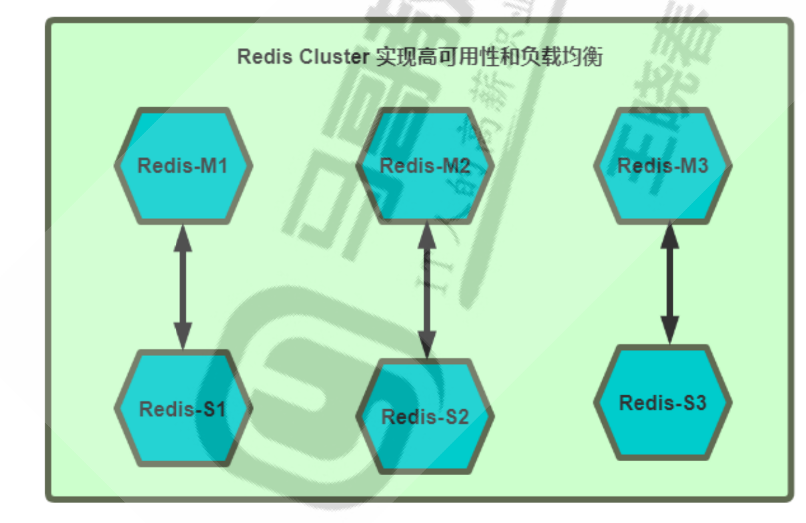

Redis cluster 需要至少 3个master节点才能实现,slave节点数量不限,当然一般每个master都至少对应的

有一个slave节点

如果有三个主节点采用哈希槽 hash slot 的方式来分配16384个槽位 slot 

此三个节点分别承担的slot 区间可以是如以下方式分配


#### 2.5.3.1Redis cluster 的工作原理

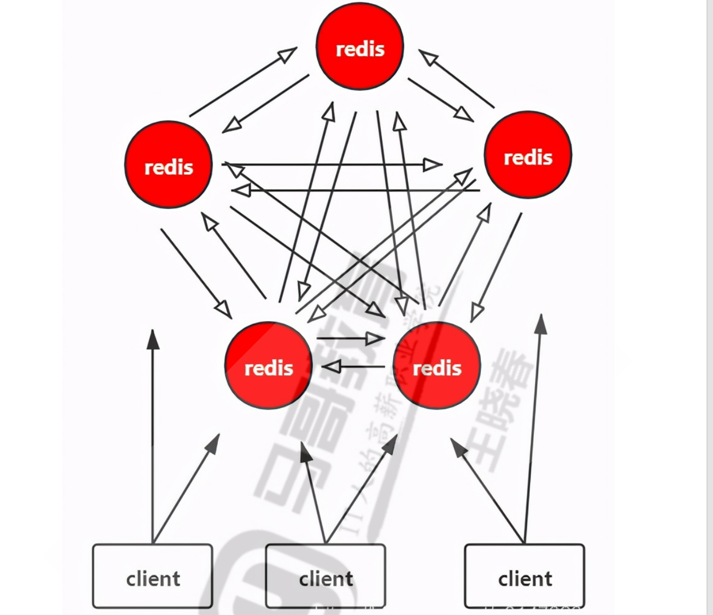

**数据分区**

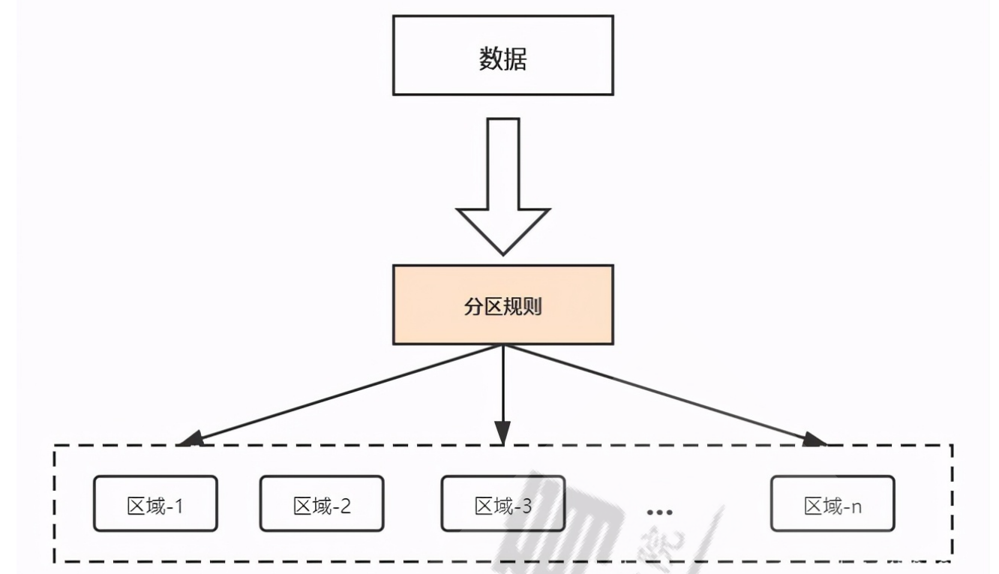

数据分区通常采取顺序分布和hash分布。

顺序分布保障了数据的有序性，但是离散性低，可能导致某个分区的数据热度高，其他分区数据的热度低，分区访问不均衡。

哈希分布也分为多种分布方式，比如区域哈希分区，一致性哈希分区等。而redis cluster采用的是虚拟槽分区的方式

**虚拟槽分区**

redis cluster设置有0~16383的槽，每个槽映射一个数据子集，通过hash函数，将数据存放在不同的槽位中，每个集群的节点保存一部分的槽。

**每个key存储时，先经过算法函数CRC16(key)得到一个整数，然后整数与16384取余，得到槽的数值，然后找到对应的节点，将数据存放入对应的槽中。**

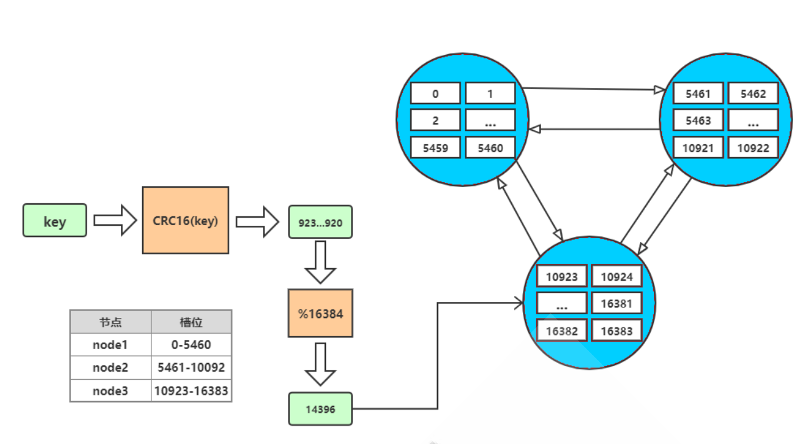

**集群通信**

但是寻找槽的过程并不是一次就命中的，而集群中节点之间的通信，保证了最多两次就能命中对应槽所在的节点，**因为在每个节点中，都保存了其他节点的信息，知道哪个槽由哪个节点负责。**

**集群伸缩**

集群并不是建立之后，节点数就固定不变的，也会有新的节点加入集群或者集群中的节点下线，这就是集群的扩容和缩容。但是由于集群节点和槽息息相关，所以集群的伸缩也对应了槽和数据的迁移

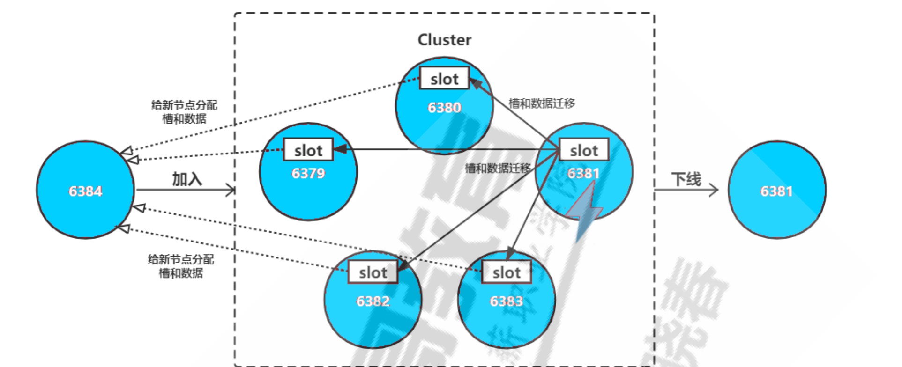

**集群扩容**

当有新的节点准备好加入集群时，这个新的节点还是孤立节点，加入有两种方式。一个是通过集群节点执行命令来和孤立节点握手，另一个则是使用脚本来添加节点。

通常这个新的节点有两种身份，要么作为主节点，要么作为从节点：

主节点：分摊槽和数据

从节点：作故障转移备份

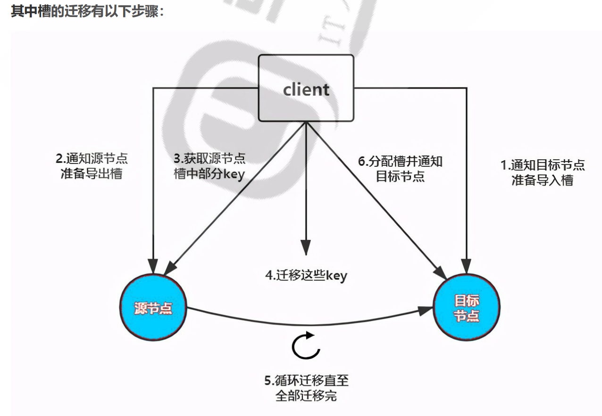

**集群缩容**

**下线节点的流程如下：**

1. 判断该节点是否持有槽，如果未持有槽就跳转到下一步，持有槽则先迁移槽到其他节点
2. 通知其他节点（**cluster forget**）忘记该下线节点
3. 关闭下线节点的服务

**故障转移**

**只有主节点才需要进行故障转移**。在之前学习主从复制时，我们需要使用redis sentinel来实现故障转移。而r**edis cluster则不需要redis sentinel，其自身就具备了故障转移功能**。

**主观下线**

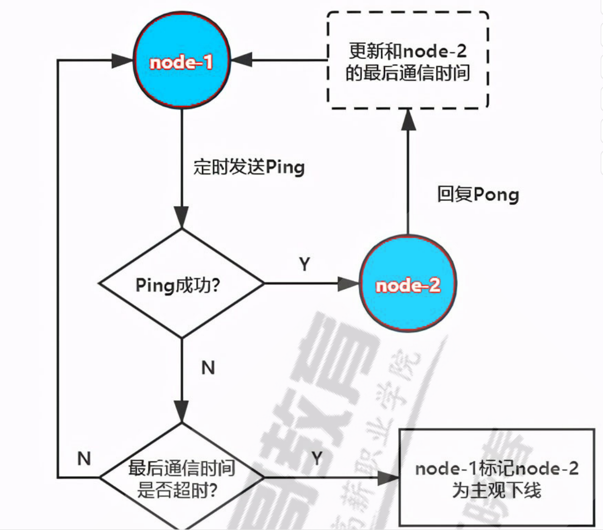

对于每个节点有一个故障列表，故障列表维护了当前节点接收到的其他所有节点的信息。**当半数以上的持有槽的主节点都标记某个节点主观下线，就会尝试客观下线。**

**故障转移**

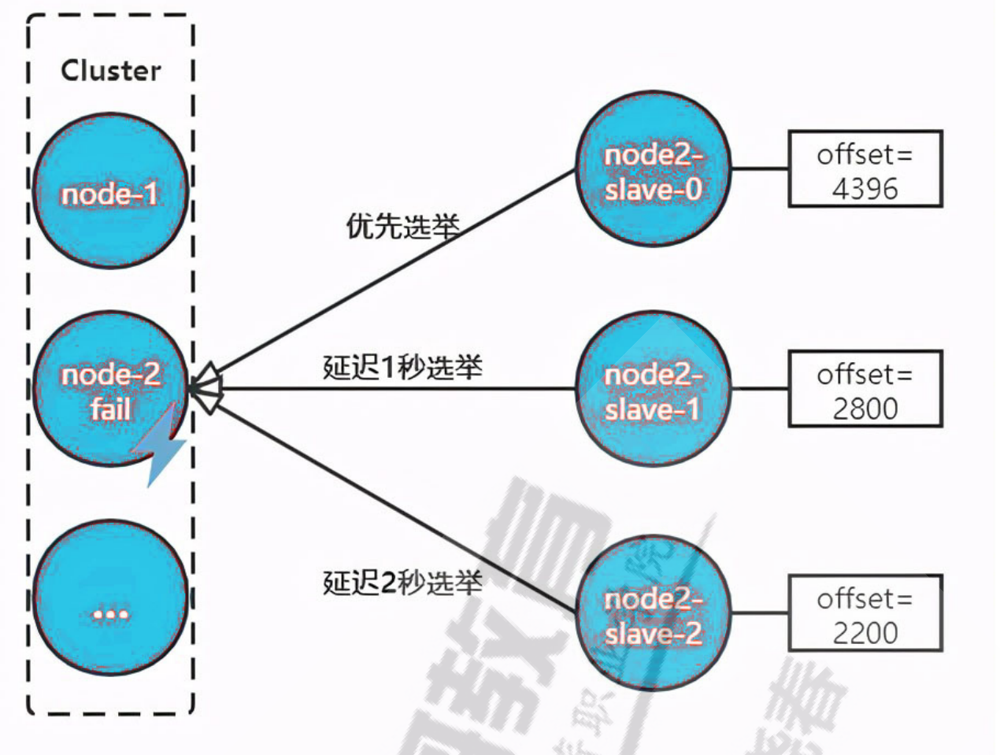

当有从节点参加选举后，主节点收到信息就开始投票。偏移量最大的节点，优先参与选举就更大可能获得最多的票数，称为主节点。

当从节点走马上任变成主节点之后，就要开始进行**替换主节点**：

1. 让该slave节点执行slaveof no one变为master节点
2. 将故障节点负责的槽分配给该节点
3. 向集群中其他节点广播Ping消息，表明已完成故障转移
4. 故障节点重启后，会成为new_master的slave节点

#### 2.5.3.2Redis Cluster 部署架构说明

**注意: 建立Redis Cluster 的节点需要清空数据，另外网络中不要有Redis哨兵的主从，否则也可能会干扰集群的创建及扩缩容**

测试环境：3台服务器，每台服务器启动6379和6380两个redis 服务实例，适用于测试环境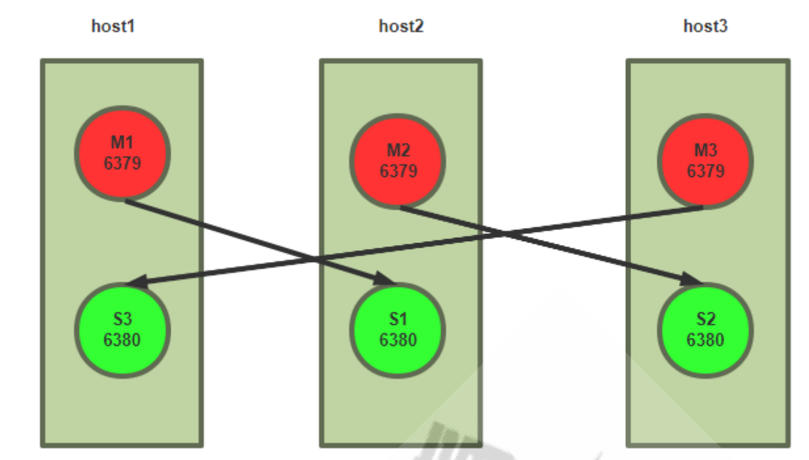

生产环境：6台服务器，分别是三组master/slave，适用于生产环境

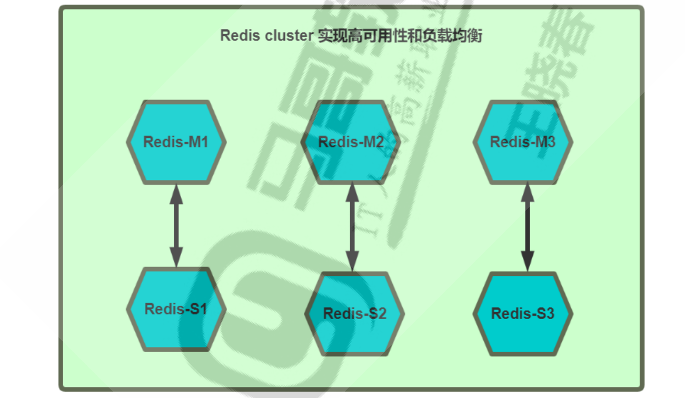

预留服务器扩展使用

**部署方式介绍**


### 2.5.4实战案例：基于 Redis 5 以上版本的 Redis Cluster 部署

官方文档：https://redis.io/topics/cluster-tutorial

```bash
#查看CLUSTER 指令的帮助
[root@centos8 ~]#redis-cli CLUSTER HELP
```

#### 1.创建 Redis Cluster 集群的环境准备

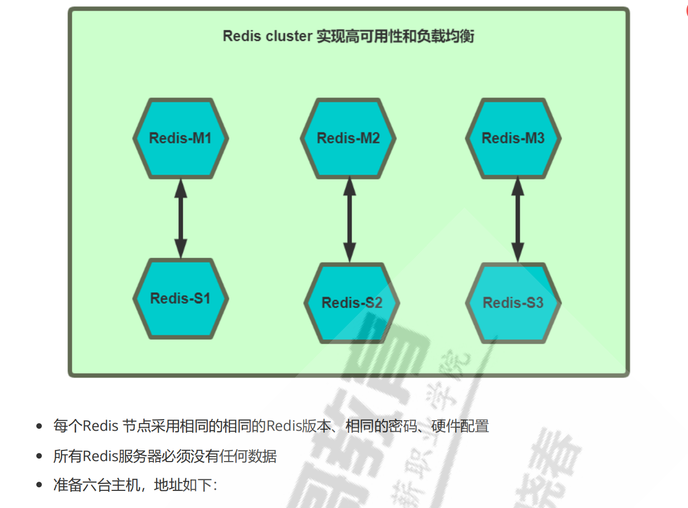

#### 2.启用 Redis Cluster 配置

```bash
[root@centos8 ~]#dnf -y install redis

#每个节点修改redis配置，必须开启cluster功能的参数
#手动修改配置文件
[root@redis-node1 ~]vim /etc/redis.conf
bind 0.0.0.0
masterauth 123456   #建议配置，否则后期的master和slave主从复制无法成功，还需再配置
requirepass 123456
cluster-enabled yes #取消此行注释,必须开启集群，开启后 redis 进程会有cluster标识
cluster-config-file nodes-6379.conf #取消此行注释,此为集群状态数据文件,记录主从关系及slot范围信息,由redis cluster 集群自动创建和维护
cluster-require-full-coverage no   #默认值为yes,设为no可以防止一个节点不可用导致整个cluster不可用

```

```bash
#或者执行下面命令,批量修改
[root@redis-node1 ~]#sed -i.bak -e 's/bind 127.0.0.1/bind 0.0.0.0/' -e '/masterauth/a masterauth 123456' -e '/# requirepass/a requirepass 123456' -e '/# cluster-enabled yes/a cluster-enabled yes' -e '/# cluster-config-file nodes-6379.conf/a cluster-config-file nodes-6379.conf' -e '/cluster-require-full-coverage yes/a cluster-require-full-coverage no' /etc/redis.conf

#如果是编译安装可以执行下面操作
[root@redis-node1 ~]#sed -i.bak -e '/masterauth/a masterauth 123456' -e '/# cluster-enabled yes/a cluster-enabled yes' -e '/# cluster-config-file nodes-6379.conf/a cluster-config-file nodes-6379.conf' -e '/cluster-require-full-coverage yes/a cluster-require-full-coverage no' /apps/redis/etc/redis.conf

[root@redis-node1 ~]#systemctl enable --now redis
```

验证当前Redis服务状态

```bash
#开启了16379的cluster的端口,实际的端口=redis port + 10000
[root@centos8 ~]#ss -ntl

#注意进程有[cluster]状态
[root@centos8 ~]#ps -ef|grep redis
```

#### 3.创建集群

```bash
#下面命令在集群节点或任意集群外节点执行皆可，命令redis-cli的选项 --cluster-replicas 1 表示每个master对应一个slave节点,注意：所有节点数据必须清空
[root@redis-node1 ~]#redis-cli -a 123456 --cluster create 10.0.0.8:6379   10.0.0.18:6379   10.0.0.28:6379   10.0.0.38:6379   10.0.0.48:6379   10.0.0.58:6379 --cluster-replicas 1

#观察以上命令结果，可以看到3组master/slave
master:10.0.0.8---slave:10.0.0.38
master:10.0.0.18---slave:10.0.0.48
master:10.0.0.28---slave:10.0.0.58
```

#### 4.验证集群

```bash
[root@redis-node1 ~]#redis-cli -a 123456 -c INFO replication

#查看指定master节点的slave节点信息。查看对应关系
[root@centos8 ~]#redis-cli -a 123456 cluster nodes
[root@redis-node1 ~]#redis-cli -a 123456 --cluster check 10.0.0.38:6379

#验证集群状态
[root@redis-node1 ~]#redis-cli -a 123456 CLUSTER INFO

#查看任意节点的集群状态
[root@redis-node1 ~]#redis-cli -a 123456 --cluster info 10.0.0.38:6379
```

#### 5.测试集群写入数据

```bash
#对应的slave节点可以KEYS *,但GET key1失败,可以到master上执行GET key1
```

#### 6.程序实现 Redis Cluster 访问

#### 7.模拟故障实现故障转移

```bash
#模拟node2节点出故障,需要相应的数秒故障转移时间
[root@redis-node2 ~]#tail -f /var/log/redis/redis.log  
[root@redis-node2 ~]#redis-cli -a 123456
127.0.0.1:6379> shutdown
not connected> exit
[root@redis-node2 ~]#ss -ntl

[root@redis-node2 ~]# redis-cli -a 123456 --cluster info 10.0.0.8:6379
Could not connect to Redis at 10.0.0.18:6379: Connection refused
10.0.0.8:6379 (cb028b83...) -> 3331 keys | 5461 slots | 1 slaves.
10.0.0.48:6379 (d04e524d...) -> 3340 keys | 5462 slots | 0 slaves. #10.0.0.48为新的master
10.0.0.28:6379 (d34da866...) -> 3329 keys | 5461 slots | 1 slaves.

[root@redis-node2 ~]# redis-cli -a 123456 --cluster check 10.0.0.8:6379

[root@redis-node2 ~]#redis-cli -a 123456 -h 10.0.0.48
10.0.0.48:6379> INFO replication

#恢复故障节点node2自动成为slave节点
[root@redis-node2 ~]#systemctl start redis

#查看自动生成的配置文件，可以查看node2自动成为slave节点
[root@redis-node2 ~]#cat /var/lib/redis/nodes-6379.conf

[root@redis-node2 ~]#redis-cli -a 123456 -h 10.0.0.48
```

### 2.5.5Redis cluster 管理

#### 1.集群扩容

注意: 生产环境一般建议master节点为奇数个,比如:3,5,7,以防止脑裂现象

1.**添加节点准备**

增加Redis 新节点，需要与之前的Redis node版本和配置一致，然后分别再启动两台Redis node，应为一主一从。

```bash
#操作与2.5.4中的开头一致
```

2.**添加新的master节点到集群**

```bash
add-node new_host:new_port existing_host:existing_port [--slave --master-id<arg>]
```

```bash
#Redis 5 以上版本的添加命令
#将一台新的主机10.0.0.68加入集群,以下示例中10.0.0.58可以是任意存在的集群节点
[root@redis-node1 ~]#redis-cli -a 123456 --cluster add-node 10.0.0.68:6379 <当前任意集群节点>:6379

#观察到该节点已经加入成功，但此节点上没有slot位,也无从节点，而且新的节点是master
[root@redis-node1 ~]#redis-cli -a 123456 --cluster info 10.0.0.8:6379

[root@redis-node1 ~]#redis-cli -a 123456 --cluster check 10.0.0.8:6379

[root@redis-node1 ~]#cat /var/lib/redis/nodes-6379.conf

#查看集群状态
[root@redis-node1 ~]#redis-cli -a 123456 CLUSTER INFO
```

3.**在新的master上重新分配槽位**

注意: 旧版本重新分配槽位需要清空数据,所以需要先备份数据,扩展后再恢复数据,新版支持有数据直接扩容

```bash
[root@redis-node1 ~]#redis-cli -a 123456 --cluster reshard <当前任意集群节点>:6379
How many slots do you want to move (from 1 to 16384)?4096 #新分配多少个槽位=16384/master个数
What is the receiving node ID? d6e2eca6b338b717923f64866bd31d42e52edc98 #新的master的ID
Source node #1: all #输入all,将哪些源主机的槽位分配给新的节点，all是自动在所有的redis node选择划分，如果是从redis cluster删除某个主机可以使用此方式将指定主机上的槽位全部移动到别的redis主机

#确定slot分配成功
[root@redis-node1 ~]#redis-cli -a 123456 --cluster check 10.0.0.8:6379
M: d6e2eca6b338b717923f64866bd31d42e52edc98 10.0.0.68:6379
   slots:[0-1364],[5461-6826],[10923-12287] (4096 slots) master #可看到4096个slots
```

4.**为新的master指定新的slave节点**

当前Redis集群中新的master节点存单点问题，还需要给其添加一个对应slave节点，实现高可用功能

方法1：在新加节点到集群时，直接将之设置为slave

```bash
#查看当前状态
[root@redis-node1 ~]#redis-cli -a 123456 --cluster check 10.0.0.8:6379

#直接加为slave节点
[root@redis-node1 ~]#redis-cli -a 123456 --cluster add-node 10.0.0.78:6379 10.0.0.8:6379 --cluster-slave --cluster-master-id d6e2eca6b338b717923f64866bd31d42e52edc98

#验证是否成功
[root@redis-node1 ~]#redis-cli -a 123456 --cluster check 10.0.0.8:6379
[root@centos8 ~]#redis-cli -a 123456 -h 10.0.0.8 --no-auth-warning cluster info
```

方法2：先将新节点加入集群，再修改为slave

```bash
#把10.0.0.78:6379添加到集群中：
[root@redis-node1 ~]#redis-cli -a 123456 --cluster add-node 10.0.0.78:6379 10.0.0.8:6379

[root@redis-node1 ~]#redis-cli -h 10.0.0.78 -p 6379 -a 123456 #登录到新添加节点
10.0.0.78:6380> CLUSTER NODES #查看当前集群节点，找到目标master 的ID
10.0.0.78:6380> CLUSTER REPLICATE 886338acd50c3015be68a760502b239f4509881c #将其设置slave，命令格式为cluster replicate MASTERID

10.0.0.78:6380> CLUSTER NODES #再次查看集群节点状态，验证节点是否已经更改为指定master 的slave
```

#### 2.集群缩容

支持集群中有旧数据的情况进行缩容

1.**迁移要删除的master节点上面的槽位到其它master**

```bash
#查看当前状态
[root@redis-node1 ~]#redis-cli -a 123456 --cluster check 10.0.0.8:6379

#连接到任意集群节点，#最后1365个slot从10.0.0.8移动到第一个master节点10.0.0.28上
[root@redis-node1 ~]#redis-cli -a 123456 --cluster reshard 10.0.0.18:6379

How many slots do you want to move (from 1 to 16384)? 1365 #共4096/3分别给其它三个master节点
What is the receiving node ID? d34da8666a6f587283a1c2fca5d13691407f9462 #master 10.0.0.28
Source node #1: cb028b83f9dc463d732f6e76ca6bbcd469d948a7 #输入要删除节点10.0.0.8的ID
Source node #2: done
```

```bash
#再将1365个slot从10.0.0.8移动到第二个master节点10.0.0.48上
[root@redis-node1 ~]#redis-cli -a 123456 --cluster reshard 10.0.0.18:6379 --cluster-slots 1365 --cluster-from cb028b83f9dc463d732f6e76ca6bbcd469d948a7 --cluster-to d04e524daec4d8e22bdada7f21a9487c2d3e1057 --cluster-yes

#最后的slot从10.0.0.8移动到第三个master节点10.0.0.68上
[root@redis-node1 ~]#redis-cli -a 123456 --cluster reshard 10.0.0.18:6379 --cluster-slots 1375 --cluster-from cb028b83f9dc463d732f6e76ca6bbcd469d948a7 --cluster-to d6e2eca6b338b717923f64866bd31d42e52edc98 --cluster-yes
```

```bash
#确认10.0.0.8的所有slot都移走了，上面的slave也自动删除，成为其它master的slave 
[root@redis-node1 ~]#redis-cli -a 123456 --cluster check 10.0.0.8:6379
```

2.**从集群中删除服务器**

上面步骤完成后,槽位已经迁移走，但是节点仍然还属于集群成员，因此还需从集群删除该节点

注意: 删除服务器前,必须清除主机上面的槽位,否则会删除主机失败

```bash
[root@redis-node1 ~]#redis-cli -a 123456 --cluster del-node <任意集群节点的IP>:6379 cb028b83f9dc463d732f6e76ca6bbcd469d948a7
#cb028b83f9dc463d732f6e76ca6bbcd469d948a7是删除节点的ID

#删除节点后,redis进程自动关闭
#删除节点信息
[root@redis-node1 ~]#rm -f /var/lib/redis/nodes-6379.conf
```

3.**删除多余的slave节点验证结果**

```bash
#验证删除成功
[root@redis-node1 ~]#ss -ntl

[root@redis-node1 ~]#redis-cli -a 123456 --cluster check 10.0.0.18:6379

#删除多余的slave从节点
[root@redis-node1 ~]#redis-cli -a 123456 --cluster del-node 10.0.0.18:6379 f9adcfb8f5a037b257af35fa548a26ffbadc852d

#删除集群文件
[root@redis-node4 ~]#rm -f /var/lib/redis/nodes-6379.conf

[root@redis-node1 ~]#redis-cli -a 123456 --cluster check 10.0.0.18:6379
```

#### 3.导入现有Redis数据至集群

官方提供了迁移单个Redis节点数据到集群的工具,有些公司开发了离线迁移工具

官方工具: redis-cli --cluster import

第三方在线迁移工具: 模拟slave 节点实现, 比如: 唯品会 redis-migrate-tool , 豌豆荚 redis-port

1.**基础环境准备**

因为导入时不能指定验证密码,所以导入数据之前需要**关闭所有Redis 节点**(括集群的的节点和集群外的节点)**的密码**。

```bash
#动态修改
[root@ubuntu2204 ~]#redis-cli -a 123456 config set protected-mode no

#或者
[root@ubuntu2204 ~]#sed -i '/^protected-mode/c protected-mode no' /apps/redis/etc/redis.conf;systemctl restart redis

#2.在所有节点(源节点和集群节点)关闭各Redis密码认证
[root@ubuntu2204 ~]#redis-cli -p 6379 -a 123456 --no-auth-warning CONFIG SET requirepass ""
```

2.**执行数据导入**

```bash
#在非集群节点10.0.0.78生成数据
[root@centos8 ~]#hostname -I
10.0.0.78 
[root@centos8 ~]#cat redis_test.sh
#!/bin/bash
NUM=10
PASS=123456
for i in `seq $NUM`;do
   redis-cli -h 127.0.0.1 -a "$PASS"  --no-auth-warning  set testkey${i} testvalue${i}
    echo "testkey${i} testvalue${i} 写入完成"
done
echo "$NUM个key写入到Redis完成"  
```

```bash
#取消需要导入的主机的密码
[root@centos8 ~]#redis-cli -h 10.0.0.78 -p 6379 -a 123456 --no-auth-warning

#取消所有集群服务器的密码
[root@centos8 ~]#redis-cli -h 10.0.0.8 -p 6379 -a 123456 --no-auth-warning CONFIG SET requirepass ""
......

```

```bash
#导入数据至集群
#注意: Redis6.2.4版本在cluster集群的任意节点或非集群节点执行下面操作导入大量数据时都会出现"Segmentation fault"的错误
#Redis6.2.4版本的集群导入大量数据时,如果是在非集群的外部节点Redis5执行下面操作却可以成功
#在CentOS8上的Redis5版本集群则没有此问题
```

```bash
[root@centos8 ~]#redis-cli --cluster import 10.0.0.8:6379 --cluster-from 10.0.0.78:6379 --cluster-copy --cluster-replace

#验证数据
[root@centos8 ~]#redis-cli -h 10.0.0.8 keys '*'
```

3.**还原安全配置**

```bash
#动态修改
#在所有节点(源节点和集群节点)还原Redis密码认证
[root@redis ~]# redis-cli -p 6379 --no-auth-warning CONFIG SET requirepass "123456"

#还原配置protected-mode
[root@ubuntu2204 ~]#redis-cli -a 123456 config set protected-mode yes
```

#### 4.集群偏斜

redis cluster 多个节点运行一段时间后,可能会出现倾斜现象,某个节点数据偏多,内存消耗更大,或者接受用户请求访问更多

发生倾斜的原因可能如下:

节点和槽分配不均

不同槽对应键值数量差异较大

包含bigkey,建议少用

内存相关配置不一致

热点数据不均衡 : 一致性不高时,可以使用本缓存和MQ

```bash
#范例: 获取指定slot对应的key个数

[root@centos8 ~]#redis-cli -a 123456 cluster countkeysinslot 0

[root@centos8 ~]#redis-cli -a 123456 cluster countkeysinslot 1

#槽位最大16383
[root@slave1 ~]#redis-cli -a 123456 cluster countkeysinslot 16384
```

执行自动的槽位重新平衡分布,但会影响客户端的访问,**此方法慎用**

```bash
#redis-cli --cluster rebalance <集群节点IP:PORT>
```

获取bigkey ,建议在slave节点执行

```bash
#redis-cli --bigkeys
```

查找 bigkey

```bash
[root@centos8 ~]#redis-cli -a 123456 --bigkeys
```

### 2.5.6Redis Cluster 的局限性

1.**集群的读写分离**

集群模式下的读写分离更加复杂，需要维护不同主节点的从节点和对于槽的关系。

2.**单机,主从，哨兵和集群的选择**

大多数时客户端性能会”降低”

命令无法跨节点使用︰mget、keys、scan、flush、sinter等

客户端维护更复杂︰SDK和应用本身消耗(例如更多的连接池)

不支持多个数据库︰集群模式下只有一个db 0

复制只支持一层∶不支持树形复制结构,不支持级联复制

Key事务和Lua支持有限∶操作的key必须在一个节点,Lua和事务无法跨节点使用

**集群搭建还要考虑单机redis是否已经不能满足业务的并发量，在redis sentinel同样能够满足高可用，且并发并未饱和的前提下，搭建集群反而是画蛇添足了。**

```bash
#跨slot的局限性
[root@centos8 ~]#redis-cli -a 123456 mget key1 key2 key3
```

# 3.MongoDB

## 3.1mongoDB介绍

3.1.1mongoDB优点

1. **灵活的文档模型**：
   - MongoDB 使用 **BSON**（类似于 JSON 的二进制数据格式）存储数据，允许嵌套结构和数组等复杂的数据类型，使得数据模型更加灵活。
2. **水平扩展性强**：
   - 通过分片技术，MongoDB 能够轻松实现数据的水平扩展，这对于处理大规模数据集和高吞吐量操作至关重要。
3. **丰富的查询语言**：
   - 提供了强大的查询支持，包括复杂的查询条件、聚合框架以及地理空间查询等。
4. **高性能读写**：
   - 对于大容量的数据存储，MongoDB 提供了高效的读写性能，尤其是在处理非事务性数据时。
5. **易于使用的管理工具**：
   - MongoDB 提供了一系列易于使用的管理和监控工具，如 MongoDB Compass，帮助用户直观地查看和管理数据库。

**相较于其他数据库的优势**

- **对比关系型数据库（如 MySQL, PostgreSQL）**：
  - MongoDB 不需要预定义的模式，这使得开发速度更快，更适合快速迭代的应用程序。
  - 在处理非结构化或半结构化数据时，MongoDB 更加灵活高效。
- **对比其他非关系型数据库（如 Cassandra, Redis）**：
  - 相比于专注于键值存储的 Redis 或者强调分布式设计的 Cassandra，MongoDB 提供了更丰富的数据模型和查询能力。
  - MongoDB 的文档模型可以更好地映射到现实世界中的对象，减少了对象关系映射（ORM）的需求。

种数据库都有其适用的场景，选择最适合项目需求的技术才是最重要的。

**逻辑结构**

拿mysql对比，表对应集合，记录对应文档，文档是bson数据，键值对

**官方文档**

http://docs.mongo.com

中文

http://docs.mongoing.com

## 3.2安装部署

https://www.mongodb.com/zh-cn/docs/manual/administration/install-on-linux/

端口27017

有时间写一下二进制安装脚本

# 4.clickhouse

## 4.1clickhouse 简介

### 4.1.1列式数据库与行式数据库

ClickHouse 是一个用于联机分析(OLAP) (Online analytical processing)的列式数据库管理系统(DBMS)

ClickHouse 性能超过了市面上大部分的数据库，相比传统的数据库、ClickHouse要快 100-1000X

1 亿条数据ClickHouse比Vertica约快5倍，比Hive快279倍，比MySQL快801倍 

10 亿条数据ClickHouse比Vertica 约快5倍，MySQL和Hive已经无法完成任务了

row-oriented database #行式数据库 https://en.wikipedia.org/wiki/Row_(database) 

column-oriented database #列式数据库 https://en.wikipedia.org/wiki/Column-oriented_DBMS

**面向行的数据库是典型的事务型数据库，能够处理大量事务，而面向列的数据库通常事务较 少，数据量较大**。


### 4.1.2良好的数据压缩比

clickhouse 使用 lz4 压缩数据，在保证数据读写性能的前提下、它的数据压缩比最高(占用空 间最少)，而且查询性能非常快


### 4.1.3使用场景

绝大多数客户端请求都是用于读请求

数据需要以大批次（大于1000行）进行更新，而不是单行更新；或者根本没有更新操 作,**不支持事务，没有一致性**

查询频率相对较低的非高并发场景（通常每台CH服务器每秒查询数百次），在处理单个客户端查询时需要高吞吐量（每台服务器每秒高达数十亿行），**少量客户端查询大量数据**

### 4.1.4缺点

1、没有完整的事务支持。 

2、缺少高频率，低延迟的修改或删除已存在数据的能力。仅能用于批量删除或修改数据。 

3、稀疏索引导致 ClickHouse 不擅长细粒度或者 key-value 类型数据的查询需求 稀疏索引是一种优化空间使用的索引方式，它只为非空值建立索引。如果表中的某些字 段有很多空值，使用稀疏索引可以节省很多空间。 

4、不擅长 join 操作，且语法特殊 

5、由于采用并行处理机制，即使一个客户端(的大量)查询也会使用较多的 CPU 资源，所 以不支持高并发

**稀疏索引**

**即在数据主键有序的基础 上，只为部分（通常是较少一部分）原始数据建立索引，从而在查询时能够圈定出大致的范 围，再在范围内利用适当的查找算法找到目标数据**

**稠密索引**

所有原始数据建立索引，就称为稠密索引

### 4.1.5谁在用 ClickHouse

1、今日头条内部用 ClickHouse 来做用户行为分析，内部一共几千个 ClickHouse 节点， 单集群最大 1200 节点，总数据量几十 PB，日增原始数据 300TB 左右。 

2、腾讯内部用 ClickHouse 做游戏数据分析，并且为之建立了一整套监控运维体系。 

3、携程内部从 18 年 7 月份开始接入试用，目前 80% 的业务都跑在 ClickHouse 上。 每天数据增量十多亿，近百万次查询请求。 

4、快手内部也在使用 ClickHouse，存储总量大约 10PB(10485760GB)，每天新增 200TB， 90% 查询小于 3S。 

5、京东ClickHouse在物流、大数据、大模型等场景使用ClickHouse实现

## 4.2clickhouse安装及使用

https://github.com/ClickHouse/ClickHouse/ #官方github 

https://packages.clickhouse.com/rpm/stable/ #官方下载地址

导入官方的测试数据并数量基本查询语句：

```bash
https://clickhouse.com/docs/zh/getting-started/tutorial/#官方提供的测试SQL文件
导入测试数据
```


### 4.2.1clickhouse-client 客户端使用

```bash
默认是监听在127.0.0.1，且没有设置客户端连接密码, 和MySQL一样。
[root@clickhouse-node1 ~]# clickhouse-client--help
[root@clickhouse-node1 ~]# clickhouse-client
 clickhouse-node1.example.local :) show databases;
```

### 4.2.2使用MySQL接口协议操作clickhouse-client

### 4.2.3DBeaver 工具使用

可视化工具DBeaver

https://dbeaver.io/download/

## 4.3数据输入/输出格式

### 4.3.1TabSeparated

简写：TSV

```bash
https://clickhouse.com/docs/zh/interfaces/formats#tabseparated

导入数据：
[root@clickhouse-node1 src]# cat ip.log
 1.1.1.1 2.2.2.1 2022-08-1 21:30:10
 1.1.1.2 2.2.2.2 2022-08-2 21:30:10
 1.1.1.3 2.2.2.3 2022-08-3 21:30:10
 1.1.1.4 2.2.2.4 2022-08-4 21:30:10
 1.1.1.5 2.2.2.5 2022-08-5 21:30:10
 1.1.1.6 2.2.2.6 2022-08-6 21:30:10
 1.1.1.7 2.2.2.7 2022-08-7 21:30:10
 1.1.1.8 2.2.2.8 2022-08-8 21:30:10
 1.1.1.9 2.2.2.9 2022-08-9 21:30:10
```

### 4.3.2TabSeparatedRaw

TabSeparatedRaw 只能在数据查询的时候作为输出格式使用，写入数据依然使用TSV， TabSeparatedRaw 可以简写为TSVRaw。

TabSeparatedRaw 与 TabSeparated 没有太大区别,主要是TabSeparatedRaw 格式不会对 行数据进行转义，即不会将换行、制表符等转换为转义字符:


```bash
# clickhouse-client-h172.31.7.211--password 123456-m
 :) use test;
 :) create table tsvraw_table(name String, addr String, age UInt8, desc String)
ENGINE=TinyLog; --max_insert_block_size=100000 < TSVRaw.log
```

### 4.3.3TSKV

TSKV: https://clickhouse.com/docs/zh/interfaces/formats#tskv

以KV的形式显示查询到的数据，key为当前列的名称，value为查询到的数据，支持数据 的导出和导入，TSKV不适合有大量小列的输出，即一列几个几十个数据的查询和序列化比 较消耗性能。

```bash
clickhouse-node1.example.local :) select * from tsvraw_table FORMAT TSKV;
```

### 4.3.4CSV

### 4.3.5CSVWithNames

CSVWithNames 会打印表头的信息。 支持数据的导入和数据的查看。

### 4.3.6JSON

JSON格式只支持查询，不支持数据的导入，JSON以对象的方式输出数据

### 4.3.7ORC 格式

https://clickhouse.com/docs/en/sql-reference/formats#data-format-orc

```bash
1.ORC 格式是Hadoop生态系统中普遍存在的列式存储格式。
2.仅支持ORC格式的写入(不支持导出为ORC格式)。
3.不支持的ORC数据类型：DATE32,TIME32,FIXED_SIZE_BINARY,JSON,UUID,ENUM。
4.ClickHouse 表的列名必须与ORC表的列名一致。
```

**使用 Spark 生成ORC文件**

```bash
val list = List(
 ("113.248.234.232", "123.212.22.01", "2018-07-12 14:35:31"),
 ("115.248.158.231", "154.245.56.23", "2020-07-12 13:26:26"),
 ("115.248.158.231", "154.245.56.23", "2020-07-12 13:22:13"),
 ("187.248.135.230", "221.228.112.45", "2019-08-09 13:17:39"),
 ("187.248.234.232", "221.228.112.24", "2019-08-09 20:51:16"),
 ("115.248.158.231", "154.245.56.23", "2020-07-12 17:22:56")
)

val rdd = sc.makeRDD(list)
import spark.implicits._
val df = rdd.toDF("srcip", "destip", "time")
df.repartition(1).write.format("orc").mode("append").save("/tmp/orc")
```

**导入 ORC格式数据**

需要在spark与hive环境导出ORC格式的数据，然后再导入到clickhouse

```bash
创建测试表：
:) use test;
:) create table orc_demo (srcip String, destip String, time DateTime) ENGINE=TinyLog;
数据导入：
~]# cat filename.orc | clickhouse-client--query="INSERT INTO orc_demo FORMAT
ORC"
```

## 4.4MergeTree 系列引擎

https://clickhouse.com/docs/zh/engines/table-engines

### 4.4.1表引擎概述

ClickHouse 在建表时必须指定表引擎，每类引擎包含了多个具体的引擎，每种引擎均有其 使用的场景，引擎主要分为以下四大类: 1. MergeTree 系列 2. Log系列 3. 与其他存储或处理系统集成的引擎 4. 特定功能的引擎

#### 4.4.1.1MergeTree 系列引擎

MergeTree 是生产环境中使用最多的存储引擎，适用于高负载任务的最通用和功能最强大 的表引擎。可以快速插入数据并进行后续的后台数据处理。支持数据复制( 使用Replicated* 的引擎版本)、分区和其他引擎不支持的特性

Clickhouse 中最强大的表引擎当属 MergeTree （合并树）引擎及该系列（*MergeTree） 中的其他引擎。 MergeTree 系列的引擎被设计用于插入极大量的数据到一张表当中。数据可以以数据片段 的形式一个接着一个的快速写入，数据片段在后台按照一定的规则进行合并。相比在插入时 不断修改（重写）已存储的数据，这种策略会高效很多。

存储的数据按主键排序 在写入数据的数据会创建一个一个小型的稀疏索引来加快后期的数据检索。 

支持分区： 基于分区实现并行读写，提高读写性能 

支持副本： 支持多副本实现数据的高可用，ClickHouse基于ZooKeeper 存储副本的元信息。 

数据采样： 自定义数据采样方法，实现数据的快速分析

#### 4.4.1.2log 系列引擎

https://clickhouse.com/docs/zh/engines/table-engines/log-family 

这些引擎是为了需要写入许多小数据量（少于一百万行）的表的场景而开发的，分为三个类 型

#### 4.4.1.3集成引擎

https://clickhouse.com/docs/zh/engines/table-engines/integrations

#### 4.4.1.4用于其他特定功能的引擎

### 4.4.2MergeTree 建表语句简介

### 4.4.3MergeTree 额外参数简介

建表时指定参数

全局指定参数：

```bash
[root@clickhouse-node1 ~]# vim /etc/clickhouse-server/config.xml

 <merge_tree>
     <index_granularity>16384</index_granularity>
 </merge_tree>
```

### 4.4.4数据片段

ClickHouse 的每一个表都是由按主键排序的数据片段(part) 组成(如未设置分区就一个) 当向ClickHouse 的表中插入数据的时候，ClickHouse会按照设置好的分区条件创建单独的 数据片段(如未设置分区就一个)

### 4.4.5列(字段)级别TTL规则

```bash
clickhouse-node1.example.local :) use test;
 # 以下命令创建abc三列，a、b一分钟之后过期、c不过期
:) DROP TABLE example_table;
 :) CREATE TABLE example_table
 (
 d DateTime,
 a Int TTL d + INTERVAL 1 MINUTE,
 b String TTL d + INTERVAL 1 MINUTE,
 c String
 )
 ENGINE = MergeTree
 ORDERBY d;
```

### 4.4.6表级别TTL规则

```bash
clickhouse-node1.example.local :) drop table example_table ;
 :) CREATE TABLE example_table
 (
 d DateTime,
 a Int,
 b String,
 c String
 )
 ENGINE = MergeTree
 ORDERBY d
 TTL d +INTERVAL 1 MINUTE DELETE;
```

### 4.4.7数据删除机制

数据删除说明： 1. 当ClickHouse 合并数据片段时，将删除TTL过期的数据。 

2. 当ClickHouse 发现数据过期时，它将执行一个计划外的合并，要控制这类合并的频率， 可设置参数merge_with_ttl_timeout，如果该值设置的过低，它将导致执行许多的计划外合 并，这可能会消耗大量资源。

3.如果在合并的时候执行SELECT查询，则可能会得到过期的数据，为了避免这种情况， 可以在SELECT之前使用OPTIMIZE指令强制触发数据合并。

### 4.4.8活跃与非活跃数据

1.active 列为数据片段的状态、1表示激活状态,0表示非激活状态，当源数据片段合并为较 大的片段之后,这些源的数据片段就变为了非激活状态,如有损坏的数据片段也是非激活状 态。

2.同一分区有多个独立的数据片段,这表明这些片段尚未合并,ClickHouse会在插入后大约 15 分钟合并数据片段,也可以使用OPTIMIZE语句执行计划外的合并 

3.非激活的片段(active=0片段)将在合并后约10分钟被删除。

```bash
查看系统目录中的表文件：
[root@clickhouse-node1 ~]# ll /var/lib/clickhouse/data/test/example_table/
```

### 4.4.9数据存储机制

bin 文件是真正存储数据的文件。 bin 文件的数据是按照排序健排序后存储的。 一个bin文件由N个压缩数据块组成。 一个压缩数据块存储压缩前是大小为64K~1M 的数据

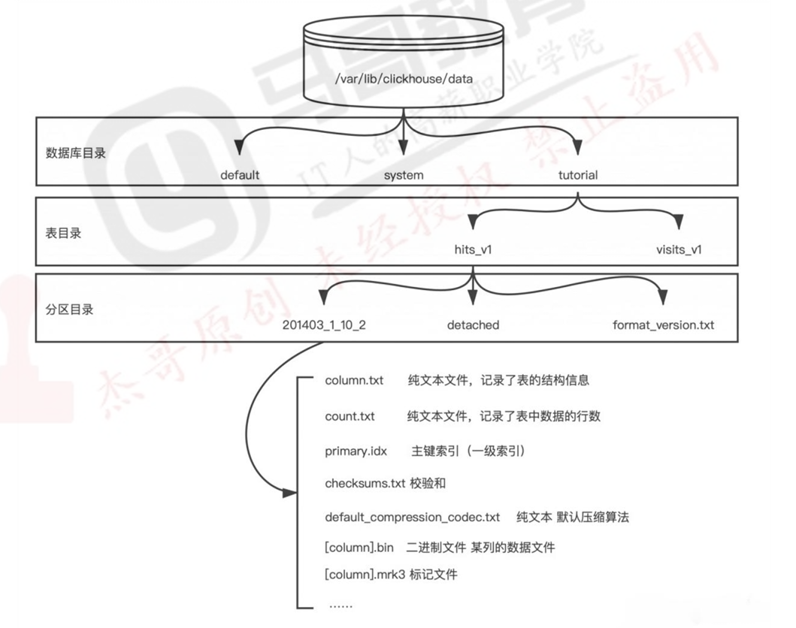

# 5.故障排错

## 5.1mysql

### 5.1.1为什么连不上

1、白名单

2、没有给予相应的权限

grant,flush

### 5.1.2死锁

```powershell
看死锁
SHOW ENGINE INNODB STATUS\G
```

复制粘贴给开发

```powershell
开启死锁日志
[mysqld]
innodb_print_all_deadlocks = 1
配合 error log 查看死锁记录
```

## 5.2redis

### 5.2.1为什么连不上

修改/etc/redis/redis.conf

bind

protected-mode no
