## 简介

ELFK[日志分析](https://so.csdn.net/so/search?q=日志分析&spm=1001.2101.3001.7020)，ElasticSearch（ES），负责日志的存储和检索；[Logstash](https://so.csdn.net/so/search?q=Logstash&spm=1001.2101.3001.7020)，负责日志的收集，过滤和格式化； Filebeat，更轻便的采集日志，进行简单格式化处理；Kibana，负责日志的展示统计和数据可视化。

## ES

### ES单点部署

下载链接：https://www.elastic.co/cn/downloads/past-releases#elasticsearch

https://artifacts.elastic.co/downloads/elasticsearch/elasticsearch-9.1.1-linux-x86_64.tar.gz

```bash
1、创建目录
[root@ELK101 ~]# mkdir -pv /data/es/{softwares,data,logs}
```

```bash
2、解压软件包
[root@ELK101 ~]# tar xf elasticsearch-7.17.5-linux-x86_64.tar.gz -C /data/es/softwares/
3、创建目录
[root@ELK101 ~]# mkdir -pv /data/es/{softwares,data,logs} 
4、解压软件包
[root@ELK101 ~]# tar xf elasticsearch-7.17.5-linux-x86_64.tar.gz -C /koten/softwares/
5、添加普通用户以启用ES，并更改ES的属主属组
由于root用户无法启用，所以添加普通用户

[root@ELK101 ~]# useradd es
[root@ELK101 ~]# chown es:es /data/es/softwares/elasticsearch-7.17.5/ -R

6、修改文件描述符的打开上限（主要关注io并发）
[root@ELK101 ~]# cat > /etc/security/limits.d/es.conf <<EOF
*          soft    nofile     65535         软限制为65535个文件描述符。
*          hard    nofile     131070         硬限制为131070个文件描述符。
EOF
 
 
扩展
cat > /etc/security/limits.d/es.conf <<EOF
*          soft    nofile     65535
*          hard    nofile     131070
*          hard    nproc      4096             #有些时候还对nproc，与nofile同理修改下就行
EOF

7、修改虚拟内存映射上限
配置好network.host: 0.0.0.0报错，故修改

#永久修改内核参数
[root@ELK101 ~]# cat > /etc/sysctl.d/es.conf <<EOF
vm.max_map_count=262144
EOF
[root@ELK101 ~]# sysctl -f /etc/sysctl.d/es.conf    #启用配置文件
vm.max_map_count = 262144
 
扩展：查看内核参数:
[root@elk101 ~]# sysctl -q vm.max_map_count
vm.max_map_count = 262144
[root@elk101 ~]# 
#临时修改内核参数(重启OS后配置丢失):
[root@elk101 ~]# sysctl -w vm.max_map_count=262144

8、修改配置文件
[root@ELK101 ~]# egrep -v "^#|^$" /data/es/softwares/elasticsearch-7.17.5/config/elasticsearch.yml 
network.host: 0.0.0.0                        #确保其他主机能访问到，不然只能本机访问
discovery.seed_hosts: ["10.0.0.101"]         #配置好network.host: 0.0.0.0报错，故修改
cluster.initial_master_nodes: ["10.0.0.101"]

9、启动服务
#前台运行
[root@ELK101 ~]# su - es -c "/data/es/softwares/elasticsearch-7.17.5/bin/elasticsearch"
 
#放在后台运行
[root@ELK101 ~]# su - es -c "/data/es/softwares/elasticsearch-7.17.5/bin/elasticsearch -d"

10、检查服务是否正常访问
[root@ELK101 ~]# curl 10.0.0.101:9200


setenforce 0 解决permission denied

[root@ELK101 ~]# cat > /usr/lib/systemd/system/es7.service <<EOF
[Unit]
Description=es7
After=network.target
 
[Service]
User=es
Group=es
Type=simple
ExecStart=/data/es/softwares/elasticsearch-7.17.5/bin/elasticsearch
WorkingDirectory=/data/es/softwares/elasticsearch-7.17.5
Environment=ES_HOME=/data/es/softwares/elasticsearch-7.17.5
LimitNOFILE=131070
LimitNPROC=65535
 
[Install]
WantedBy=multi-user.target
EOF
[root@ELK101 ~]# systemctl daemon-reload
[root@ELK101 ~]# systemctl enable --now es7
[root@ELK101 ~]# systemctl status es7


JVM调优
修改默认堆内存大小，堆内存是指Java虚拟机（JVM）运行时所使用的内存中的一段，在生产环境中，建议设置物理服务器内存的一半；内存不得超过32Gb；建议将"-Xmx"和"-Xms"的值设置一致，避免因为内存不够提交申请再去扩大内存。
cat > /usr/lib/systemd/system/es7.service <<EOF
egrep -v "^#|^%" /data/es/softwares/elasticsearch-7.17.5/config/jvm.options


1、安装OracleJDK
2、解压安装包
3、配置JDK环境变量
[root@ELK101 ~]#cat /etc/profile.d/jdk.sh
#!/bin/bash
export JAVA_HOME=/koten/softwares/jdk1.8.0_291
export PATH=$PATH:$JAVA_HOME/bin
[root@elk101 ~]# source  /etc/profile.d/jdk.sh 
[root@ELK101 ~]# java -version
java version "1.8.0_291"
Java(TM) SE Runtime Environment (build 1.8.0_291-b10)
Java HotSpot(TM) 64-Bit Server VM (build 25.291-b10, mixed mode)

[root@ELK101 ~]# cat > /usr/lib/systemd/system/es7.service <<EOF
[Unit]
Description=es7
After=network.target
 
[Service]
User=es
Group=es
Type=simple
ExecStart=/koten/softwares/elasticsearch-7.17.5/bin/elasticsearch
WorkingDirectory=/data/es/softwares/elasticsearch-7.17.5
Environment=ES_HOME=/data/es/softwares/elasticsearch-7.17.5
LimitNOFILE=131070
LimitNPROC=65535
Environment=JAVA_HOME=/koten/softwares/jdk1.8.0_291    
 
[Install]
WantedBy=multi-user.target
EOF
[root@ELK101 ~]# systemctl daemon-reload
[root@ELK101 ~]# systemctl restart es7
[root@ELK101 ~]# systemctl status es7

5、验证命令
- jps命令
jps     # 仅显示java程序的名称和PID。
jps -l  # 查看java的包名。
jps -v  # 查看java程序的详细信息。
 
[root@ELK101 ~]# jps     
3570 Jps
3356 Elasticsearch
[root@ELK101 ~]# jps -l
3356 org.elasticsearch.bootstrap.Elasticsearch
3583 sun.tools.jps.Jps
 
 
- jmap命令
[root@ELK101 ~]# jmap -heap `jps | awk  '/Elasticsearch/{print $1}'` | grep MaxHeapSize


```

### 搭建ES集群服务

```bash
1、创建数据目录和工作目录
[root@ELK101 ~]# install -d /koten/{data,logs}/es7 -o koten -g koten
cluster.name: koten-es7            #指定集群名称
path.data: /koten/data/es7         #指定数据目录
path.logs: /koten/logs/es7         #指定日志目录
network.host: 0.0.0.0              #对外暴露的IP地址
http.port: 19200                   #指定集群外部提供的http端口
transport.tcp.port: 19300          #指定集群内部数据传输端口
discovery.seed_hosts: ["10.0.0.101","10.0.0.102","10.0.0.103"]    #指定现有集群的主机地址
cluster.initial_master_nodes: ["10.0.0.101","10.0.0.102","10.0.0.103"]    #指定集群启动时，初始参与master选举的节点

                        
2、修改配置文件
[root@ELK101 ~]# egrep -v "^#|^$" /koten/softwares/elasticsearch-7.17.5/config/elasticsearch.yml

3、拷贝数据目录
[root@ELK101 ~]# scp -r /koten/ 10.0.0.102:/    #es软件目录
[root@ELK101 ~]# scp -r /koten/ 10.0.0.103:/
 
[root@ELK101 ~]# scp /etc/profile.d/jdk.sh 10.0.0.102:/etc/profile.d/    #java的环境变量（java目录和path变量修改）
[root@ELK101 ~]# scp /etc/profile.d/jdk.sh 10.0.0.103:/etc/profile.d/
 
[root@ELK101 ~]# scp /etc/sysctl.d/es.conf 10.0.0.102:/etc/sysctl.d/    #内核映射上限
[root@ELK101 ~]# scp /etc/sysctl.d/es.conf 10.0.0.103:/etc/sysctl.d/
 
[root@ELK101 ~]# scp /usr/lib/systemd/system/es7.service 10.0.0.102:/usr/lib/systemd/system/                             #systemctl配置文件
[root@ELK101 ~]# scp /usr/lib/systemd/system/es7.service 10.0.0.103:/usr/lib/systemd/system/

4、其他节点创建用户，修改权限，启用内核参数调优
[root@ELK102 ~]# useradd -u 1000 koten
[root@ELK102 ~]# chown -R koten.koten /koten/softwares/elasticsearch-7.17.5/
[root@ELK102 ~]# install -d /koten/{data,logs}/es7 -o koten -g koten
[root@ELK102 ~]# sysctl -f /etc/sysctl.d/es.conf 
vm.max_map_count = 262144

5、清空单点的数据，避免因为单点的缓存数据而污染集群的搭建
[root@ELK101 ~]# systemctl stop es7
[root@ELK101 ~]# rm  -rf /koten/data/es7/* /koten/logs/es7/* /tmp/*

6、所有节点同时启动服务，可以使用Xshell对全部会话或全部Shell生效
[root@ELK101 ~]# systemctl enable --now es7
systemctl status es7
ss -ntl | grep 19
curl 10.0.0.101:19200
curl 10.0.0.101:19200/_cat/nodes

#如果uuid显示_na_就是出问题了，可能是由于可运行的主机数量不足集群规定数量而出现的脑裂问题，解决办法就是重复5-7的步骤，此时查看集群健康状态会如下显示
[root@elk101 ~]# curl 10.0.0.101:19200/_cat/nodes
{"error":{"root_cause":[{"type":"master_not_discovered_exception","reason":null}],"type":"master_not_discovered_exception","reason":null},"status":503}[root@elk101 ~]# 


```

#### 故障排查方法

```
1、查看服务状态
systemctl status es7 -l
2、通过系统日志查看
journalctl -u es7
3、查看启动日志
tail -100f /koten/softwares/elasticsearch-7.17.5/logs/elasticsearch.log

journalctl 是 Linux 系统中的一个命令，主要用于查询和显示 systemd 日志记录服务（称为 journald）所收集的日志信息。journald 是 systemd 初始化系统的一部分，负责收集和存储系统日志，包括启动日志、服务日志、内核日志等。
journalctl -n 100
journalctl -u <service_name>
```


### ES实操

#### 工具

浏览器插件Elasticsearch-head  

Postman安装包下载链接：https://pan.baidu.com/s/1-L2Odn1q9dP2VZnh0ghxJg?pwd=09c0 

##### ES的常用术语

1、 索引（index）：存储数据的逻辑单元，并不负责实际的数据存储。用户可以基于索引进行数据的读写。

2、分片（shard）：一个索引最少有一个分片，数据存储在分片上。

3、副本（replica）：一个分片可以有0个副本，如果一个分片的副本数为0，但该分片宕机时，则数据无法访问。

4、主分片（primary shard）与副本分片（replica shard）：主分片可以对数据进行读写，副本分片只能进行读取，主分片出问题后，同一索引下的副本分片会立即切换成主分片，从只能读取变为可以读写，实现高可用。主备

5、文档（document）与JSON格式：在分片中存储的数据，对应的是JSON格式对象数据类型，而JSON格式就是文字的序列化，主机与主机间数据传输通常是使用JSON格式，之前有用xml和html，但是不够轻量，浪费带宽，而磁盘和内存之间传输是通过二进制格式文件。

json

一、基础数据类型
字符串："name" 、"age"、"123"、"true"

布尔值：true、false

数值：2023、3.14、9.18

空值：null

二、高级数据类型
数组：["2023",true,3.14,null]

对象：{"name":"koten","hobby":["Linux","K8s"]}

{

​    "name":"koten",

​    "hobby":["Linux","K8s"]

} 


#### 一、索引管理

```json
11111111111111111111111111111111111111111111、查看
查看所有索引
GET http://10.0.0.101:19200/_cat/indices?v
查看单个索引的详细信息
GET http://10.0.0.101:19200/koten

2222222222222222222222222222222222222222222222、创建
1、直接创建索引
PUT http://10.0.0.101:19200/koten

2、指定分片数创建索引
PUT http://10.0.0.101:19200/koten
{
    "settings": {
        "index": {
            "number_of_shards": "3"
        }
    }
}
3、指定分片数和副本数创建索引
PUT http://10.0.0.101:19200/koten
{
    "settings": {
        "index": {
            "number_of_shards": "3",
            "number_of_replicas": "0"
        }
    }
}

33333333333333333333333333333333333333333333333333、修改
1、修改索引的副本数量
PUT http://10.0.0.101:19200/koten/_settings
{
    "number_of_replicas": "2"
}

注意：不允许动态修改分片的数量，因为文档储存的时候，会根据文档的id哈希值跟主分片数量取余决定它储存到哪个分片，倘若主文档的id哈希值是10，主分片数量是3，那么取余会得1，所以会储存进分片位置为1的分片中，如果更改了主分片位置，不管是减少还是增加，都会更改位置，位置更高意味着存进去的数据再取的时候取不出原来的数据，导致数据错乱，所以在定义主分片的时候一开始就要定义好，后续不能修改。

4444444444444444444444444444444444444444444444444444、删除
1、通过es-head删除
2、通过curl删除
[root@ELK ~]# curl -X DELETE 10.0.0.101:19200/koten
{"acknowledged":true}
3、postman删除
DELETE http://10.0.0.101:19200/koten    #删除单个索引
DELETE http://10.0.0.101:19200/ko*      #利用通配符删除索引

55555555555555555555555555555555555555555555555555555555555、关闭
关闭索引，将无法进行读写操作，但是数据不会被删除
POST http://10.0.0.101:19200/koten/_close

666666666666666666666666666666666666666666666666666666666666、打开
POST http://10.0.0.101:19200/koten/_open

7777777777777777777777777777777777777777777777777777777777、别名
别名的意义在于，存数据的时候可能不会只存到一个索引中，所以我们给这些索引取上别名，到时候取数据的时候，可以通过别名将他们都取出。
1、查看所有索引的别名
GET http://10.0.0.101:19200/_aliases
2、给索引添加别名
POST http://10.0.0.101:19200/_aliases
{
    "actions": [
        {
            "add": {
                "index": "koten",
                "alias": "Linux容器运维工程师"
            }
        }
    ]
}
3、给索引删除别名
POST http://10.0.0.101:19200/_aliases
{
    "actions": [
        {
            "remove": {
                "index": "koten",
                "alias": "Linux容器运维工程师"
            }
        }
    ]
}
4、给索引修改别名
POST http://10.0.0.101:19200/_aliases
{
    "actions": [
        {
            "remove": {
                "index": "koten",
                "alias": "Linux容器运维工程师"
            }
        },
        {
            "add": {
                "index": "koten",
                "alias": "DBA运维工程师"
            }
        }
    ]
}


```

其他操作：https://www.elastic.co/guide/en/elasticsearch/reference/current/indices.html

#### 二、文档操作

```json
1111111111111111111111111111111111111111111111111111、创建
1、不指定文档ID
POST http://10.0.0.101:19200/koten/_doc
{"name":"koten","hobby":["Linux","K8s"]}
2、指定文档ID
如果已有的文档id再次创建文档内容会被覆盖
POST http://10.0.0.101:19200/koten/_doc/1001
{"name":"koten","hobby":["Linux","K8s"]}
或者
POST http://10.0.0.101:19200/koten/_doc
{"name":"koten","hobby":["Linux","K8s"],"_id":"1001"}
两个方法都可以，各有利弊，前者提交信息没有体现id，但是写在url可以快速检索，无需遍历整个索引，后者会增大带宽资源，但是看着更加明了，容易记忆

2222222222222222222222222222222222222222222222222222222222、查看
1、全量查询
GET http://10.0.0.101:19200/koten/_search
2、查询指定的文档
GET http://10.0.0.101:19200/koten/_doc/1001

3333333333333333333333333333333333333333333333333333333333333、修改
1、全量更新
POST http://10.0.0.101:19200/koten/_doc/1001
{
    "name": "koten",
    "hobby": [
        "mysql",
        "windows",
        "nginx"
    ]
}
2、局部更新
POST http://10.0.0.101:19200/koten/_doc/1001/_update
{
    "doc": {
        "hobby": [
            "PHP",
            "zabbix"
        ],
        "address": "101"
    }
}

44444444444444444444444444444444444444444444444444444444444、删除
DELETE http://10.0.0.101:19200/koten/_doc/1001

55555555555555555555555555555555555555555555555555555555555555555、批量增加
POST http://10.0.0.101:19200/_bulk
{ "create":{"_index":"koten01","_id":1001}}
{"name":"koten01","hobby":["nginx","tomcat","php"]}
{ "create":{"_index":"koten02","_id":1002}}
{"name":"koten02","hobby":["gitlab","Jenkins","sonarqube","maven"]}
末尾回车
                        
666666666666666666666666、批量查询
GET http://10.0.0.101:19200/_mget

7777777777777777777777、批量更改
POST http://10.0.0.101:19200/_bulk
{ "update":{"_index":"koten01","_id":1001}}
{"doc":{"name":"koten01","hobby":["1","2","3"]}}
{ "update":{"_index":"koten02","_id":1002}}
{"doc":{"name":"koten02","hobby":["4","5","6","7"]}}

88888888888888888888888、批量删除
POST http://10.0.0.101:19200/_bulk
{ "delete" : { "_index" : "koten01", "_id" : "1001" } }
{ "delete" : { "_index" : "koten02", "_id" : "1002" } }

```

#### 三、数据类型 

创建数据类型的意义在于取数据的时候可以通过数据类型去取，我们以存储查看IP网段为案例，简单介绍下。

```json
1111111111111111111111111111111111111、创建索引时指定映射关系 
PUT http://10.0.0.101:19200/koten-ip
{
    "mappings" :{
        "properties": {
            "ip_addr" : {
                "type": "ip"
            }
        }
    },
	"settings": {
		"number_of_shards":3,
		"number_of_replicas":0
	}
}

222222222222222222222222222222222222222、查看索引的映射关系
GET http://10.0.0.101:19200/koten-ip

33333333333333333333333333333333333333333333、创建测试数据
POST http://10.0.0.101:19200/_bulk
{ "create": { "_index": "koten-ip"} }
{ "ip_addr": "192.168.10.101" }
{ "create": { "_index": "koten-ip"} }
{ "ip_addr": "192.168.10.201" }
{ "create": { "_index": "koten-ip"} }
{ "ip_addr": "172.31.10.100" }
{ "create": { "_index": "koten-ip"} }
{ "ip_addr": "10.0.0.222" }

4、查看IP的网段
查看所有IP
GET http://10.0.0.101:19200/koten-ip/_search
查看指定的IP网段

POST http://10.0.0.101:19200/koten-ip/_search
{
    "query": {
        "match" : {
            "ip_addr": "192.168.0.0/24"
        }
    }
}

```

#### 四、案例

批量存储10条宝马汽车的信息（数据来自采集当日的官网），字段包含标题、价格、品牌、商品链接地址、商品链接对应的IP地址、采集该信息的作者、作者所在组。

```
一、创建指定字段格式的索引
PUT http://10.0.0.101:19200/koten-shopping
{
    "mappings" :{
        "properties": {
			"title": {
			   "type": "text"
			},
			"price": {
				"type": "float"
			},
			"brand": {
				"type": "keyword"
			},
			"item": {
				"type": "text"
			},
			"group": {
				"type": "byte"
			},
            "ip_addr" : {
                "type": "ip"
            },
			"author": {
				"type": "text"
			}
        }
    },
	"settings": {
		"number_of_shards":3,
		"number_of_replicas":0
	}
}

二、采集并写入宝马商品信息数据
POST http://10.0.0.101:19200/_bulk
 
{ "create": { "_index": "koten-shopping"} }
{ "ip_addr": "221.194.154.181" ,"title":"BMW1系运动轿车 125i M运动曜夜版","price":249900,"brand":"宝马","item":"https://www.bmw-emall.cn/newcar/design?series=1&rangeCode=F52&packageCode=2W71_0ZMB&sop=1672502400000","group":3,"author":"koten"}
{ "create": { "_index": "koten-shopping"} }
{ "ip_addr": "221.194.154.181" ,"title":"BMW2系四门轿跑车 225i M运动曜夜套装","price":298900,"brand":"宝马","item":"https://www.bmw-emall.cn/newcar/design?series=2&rangeCode=F44&packageCode=31AK_0ZSM&sop=1667232000000","group":3,"author":"koten"}
{ "create": { "_index": "koten-shopping"} }
{ "ip_addr": "221.194.154.181" ,"title":"新BMW3系 330i M运动曜夜套装","price":381900,"brand":"宝马","item":"https://www.bmw-emall.cn/newcar/design?series=3&rangeCode=G20&packageCode=24FF_0ZMC&sop=1672502400000","group":3,"author":"koten"}
{ "create": { "_index": "koten-shopping"} }
{ "ip_addr": "221.194.154.181" ,"title":"THE i3 eDrive40L曜夜运动套装","price":413900,"brand":"宝马","item":"https://www.bmw-emall.cn/newcar/design?series=3&rangeCode=G28BEV&packageCode=81BE_0ZCP&sop=1672502400000","group":3,"author":"koten"}
{ "create": { "_index": "koten-shopping"} }
{ "ip_addr": "221.194.154.181" ,"title":"BMW4系双门轿跑车 430i M运动曜夜套装","price":479900,"brand":"宝马","item":"https://www.bmw-emall.cn/newcar/design?series=4&rangeCode=G22&packageCode=51AP_0ZSM&sop=1677600000000","group":3,"author":"koten"}
{ "create": { "_index": "koten-shopping"} }
{ "ip_addr": "221.194.154.181" ,"title":"BMW4系敞篷轿跑车 430i M运动曜夜套装","price":576900,"brand":"宝马","item":"https://www.bmw-emall.cn/newcar/design?series=4&rangeCode=G23&packageCode=11AT_0ZSM","group":3,"author":"koten"}
{ "create": { "_index": "koten-shopping"} }
{ "ip_addr": "221.194.154.181" ,"title":"纯电动BMW i4 eDrive40","price":469900,"brand":"宝马","item":"https://www.bmw-emall.cn/newcar/design?series=4&rangeCode=G26BEV&packageCode=71AW_0ZOM&sop=1677600000000","group":3,"author":"koten"}
{ "create": { "_index": "koten-shopping"} }
{ "ip_addr": "221.194.154.181" ,"title":"BMW5系Li 530Li xDrive M运动套装","price":495500,"brand":"宝马","item":"https://www.bmw-emall.cn/newcar/design?series=5&rangeCode=G38&packageCode=21AF_0ZLU","group":3,"author":"koten"}
{ "create": { "_index": "koten-shopping"} }
{ "ip_addr": "221.194.154.181" ,"title":"BMW6系GT 630i M运动大旅行家版","price":699900,"brand":"宝马","item":"https://www.bmw-emall.cn/newcar/design?series=6&rangeCode=G32&packageCode=21BP_0ZLU","group":3,"author":"koten"}
{ "create": { "_index": "koten-shopping"} }
{ "ip_addr": "221.194.154.181" ,"title":"新BMW7系 740Li 尊享型 豪华套装","price":1269000,"brand":"宝马","item":"https://www.bmw-emall.cn/newcar/design?series=7&rangeCode=G70&packageCode=11EH_0ZOM&sop=1677600000000","group":3,"author":"koten"}

```

#### 五、DSL语句

```
1、match模糊查询，若字段brand是包含宝马的也可以查询到
***由于brand字段类型是keyword，所以match搜索也不会将宝马两个字分割开来匹配，也算是精准匹配。如果是text字段类型就会一个一个的进行匹配了。

GET http://10.0.0.101:19200/oldboyedu-shopping/_search
{
    "query":{
        "match":{
            "brand":"宝马"             #####此处也算精准匹配，，，"test":宝马
        }
    }
}

2、match_phrase精准查询，只能查询到brand字段是宝马的，多一个字少一个字都匹配不到，由于我们写入了数据，不能修改字段类型了，不能将text修改为keyword，所以我们采取精准查询方式
GET http://10.0.0.101:19200/koten-shopping/_search
{
    "query":{
        "match_phrase":{
            "brand":"宝马"
        }
    }
}

3、match_all全量查询，一般用不到，默认不写参数就是全量
GET http://10.0.0.101:19200/koten-shopping/_search  全量查询不需要写json，所以用不到
{
    "query":{
        "match_all":{}
    }
}

4、分页查询，size表示每页显示几条数据，from代表跳过数据的条数，查看第N页，form的值可以用（N-1）*size来计算，举例，一共10条数据，我们3条数据一页，想看最后一页就是10除以3等于3余1，有余数所以3+1，最后一页为第4页，（4-1）*3=9，所以from为9
GET http://10.0.0.101:19200/koten-shopping/_search
{
    "query": {
        "match_phrase":{
            "brand": "宝马"
        }
    },
    "size":3,
    "from": 9
}

5、查看指定字段，可以筛选出自己想看的一些字段信息
GET http://10.0.0.101:19200/koten-shopping/_search 
{
    "query":{
        "match_phrase":{
            "author":"koten"
        }
    },
    "_source":["title","price","author"]
}

6666666666666666666666666666666666666666666666666、排序
sort代表排序，price代表基于价格进行排序，order表示排序的方式，分别为desc表示降序，asc表示升序
GET http://10.0.0.101:19200/koten-shopping/_search
{
    "query":{
        "match_phrase":{
            "author":"koten"
        }
    },
    "sort":{
        "price":{
            "order":"desc"
        }
    }
}

777777777777777777777777777777777777、查询存在某个字段的文档
GET http://10.0.0.101:19200/koten-shopping/_search
{
    "query":{
        "exists":{
            "field":"author"
        }
    }
}


8、语法高亮
highlight表示进行语法高亮，pre_tags指定高亮的前缀标签，post_tags指定高亮的后缀标签，fields表示对哪个字段进行语法高亮，在搜索的时候，我们一般将搜索的关键词进行语法高亮
GET http://10.0.0.101:19200/koten-shopping/_search
{
    "query": {
        "match": {
            "title": "运动"
        }
    },
    "sort": {
        "price": {
            "order": "desc"
        }
    },
    "size":5,
    "_source":["title","price","author"]
    ,
    "highlight": {
        "pre_tags": [
            "<span style='color:red;'>"
        ],
        "post_tags": [
            "</span>"
        ],
        "fields": {
            "title": {}
        }
    }
}

999999999999999999999999999999999999999999999999、多条件查询
必要条件must，两个条件都符合才会筛选出来
GET http://10.0.0.101:19200/koten-shopping/_search
{
    "query": {
        "bool": {
            "must": [
                {
                    "match": {
                        "brand": "宝马"
                    }
                },
                {
                    "match": {
                        "price": 381900
                    }
                }
            ]
        }
    }
}
应该满足的条件should

GET http://10.0.0.101:19200/koten-shopping/_search
{
    "query": {
        "bool": {
            "should": [
                {
                    "match": {
                        "price": 249900
                    }
                },
                {
                    "match": {
                        "price": 381900
                    }
                }
            ]
        }
    }
}

必须不满足的条件must-not
GET http://10.0.0.101:19200/koten-shopping/_search
 
{
    "query": {
        "bool": {
            "must_not": [
                {
                    "match": {
                        "price": 381900
                    }
                }
            ]
        }
    }
}

10、范围查询
filter代表过滤，range代表范围查询，price基于价格进行匹配，gte代表大于等于，gt代表大于，lte代表小于等于，lt代表小于
GET http://10.0.0.101:19200/koten-shopping/_search
{
    "query": {
        "bool": {
            "must": [
                {
                    "match": {
                        "brand": "宝马"
                    }
                }
            ],
            "filter": {
                "range": {
                    "price": {
                        "gte": 400000,
                        "lt": 500000
                    }
                }
            }
        }
    }
}

11、精确匹配多个值
GET http://10.0.0.101:19200/koten-shopping/_search
{
    "query": {
        "terms": {
            "price": [
                249900,
                413900
            ]
        }
    }
}

12、权重案例
GET http://10.0.0.101:19200/koten-shopping/_search
{
    "query": {
        "bool": {
            "must": [
                {
                    "match": {
                        "brand": "宝马"
                    }
                }
            ],
            "should": [
                {
                    "match_phrase": {
                        "price": {
                            "query": "1269000",
                            "boost": 10
                        }
                    }
                },
                {
                    "match_phrase": {
                        "price": {
                            "query": "298900",
                            "boost": 2
                        }
                    }
                }
            ]
        }
    },
    "highlight": {
        "fields": {
            "title": {},
            "brand": {}
        }
    }
}

13、聚合查询
统计每个品牌的数量
GET http://10.0.0.101:19200/koten-shopping/_search
{
    "aggs": {
        "koten_brand_group": {
            "terms": {
                "field": "brand"
            }
        }
    },
    "size": 0
}

统计商品中最贵的一个
GET http://10.0.0.101:19200/koten-shopping/_search
{
    "aggs": {
        "koten_max_shopping": {
            "max": {
                "field": "price"
            }
        }
    },
    "sort": {
        "price": {
            "order": "desc"
        }
    },
    "_source": ["price","group","brand","title","auther"],
    "size": 1
}

统计3组统计的平均商品价格
GET http://10.0.0.101:19200/koten-shopping/_search
 
{
    "query": {
        "match": {
            "group": 3
        }
    },
    "aggs": {
        "koten_avg_shopping": {
            "avg": {
                "field": "price"
            }
        }
    },
    "size": 0
}

统计3组的商品价格总数
GET http://10.0.0.101:19200/koten-shopping/_search
 
{
    "query": {
        "match": {
            "group": 3
        }
    },
    "aggs": {
        "koten_sum_shopping": {
            "sum": {
                "field": "price"
            }
        }
    },
    "size": 0
}

```

#### 六、IK分词器

IK分词器的作用在于在分词的时候，ES默认的分词对中文不利，只会把中文的每个字分开，而我们使用IK分词器，可以把一些常见的词语当做一个整体分开，也可以自定义一些词语。

```json
111111111111111111111111111111111111、内置的标准分词-分析英文
默认以空隔为分割
GET http://10.0.0.101:19200/_analyze
{
    "analyzer": "standard",
    "text": "My name is koten,  and I'm 18 years old !"
}

2222222222222222222222222222222222222222、内置的标准分词器-分析中文
会把每个字都分开
GET http://10.0.0.101:19200/_analyze
{
    "analyzer": "standard",
    "text": "你的博客写的真好"
}

33333333333333333333333333333333333、安装IK分词器，集群的每个机器都要部署，滚动式部署
下载地址：https://github.com/medcl/elasticsearch-analysis-ik
切记安装版本一定要与ES的版本一致
[root@ELK101 ~]# rz -E
[root@ELK101 ~]# cd /koten/softwares/elasticsearch-7.17.5/plugins/
[root@ELK101 plugins]# install -d ik -o koten -g koten
[root@ELK101 plugins]# cd ik/
[root@ELK101 ik]# unzip ~/elasticsearch-analysis-ik-7.17.5.zip 
[root@ELK101 ik]# chown -R koten:koten *
[root@ELK101 ik]# systemctl restart es7
 
[root@ELK101 plugins]# scp -r ik 10.0.0.102:`pwd`
[root@ELK101 plugins]# scp -r ik 10.0.0.103:`pwd`
 
[root@ELK102 ~]# chown -R koten:koten /koten/softwares/elasticsearch-7.17.5/plugins/ik
[root@ELK103 ~]# chown -R koten:koten /koten/softwares/elasticsearch-7.17.5/plugins/ik
 
[root@ELK102 ~]# systemctl restart es7
[root@ELK103 ~]# systemctl restart es7

44444444444444444444444444444444444444444444444444444444、测试分词器
ik_max_word表示细粒度拆分，ik_smart表示粗粒度拆分，两者区别是，细粒度拆分会将所有可能的词语拆分出来，而粗粒度拆分就是简单拆分成一份成二，一分成三
GET http://10.0.0.101:19200/_analyze
{
    "analyzer": "ik_max_word",
    "text": "中华人民共和国人民大会堂"
}
粗粒度拆分
GET http://10.0.0.101:19200/_analyze
{
    "analyzer": "ik_smart",
    "text": "中华人民共和国人民大会堂"
}

5555555555555555555555555555555、自定义词典
[root@ELK101 ~]# cd /koten/softwares/elasticsearch-7.17.5/plugins/ik/config/
[root@ELK101 config]# mkdi
mkdict  mkdir   
[root@ELK101 config]# mkdir koten-custom-dic
[root@ELK101 config]# ls
extra_main.dic                  main.dic
extra_single_word.dic           preposition.dic
extra_single_word_full.dic      quantifier.dic
extra_single_word_low_freq.dic  stopword.dic
extra_stopword.dic              suffix.dic
IKAnalyzer.cfg.xml              surname.dic
koten-custom-dic                                                 
[root@ELK101 config]# cat koten-custom-dic/extra_custom.dic
真6
阿啦啦啦
写的

[root@ELK101 config]# cat IKAnalyzer.cfg.xml|grep koten	<entry key="ext_dict">koten-custom-dic/extra-custom.dic</entry>    #修改此行使配置文件生效
 
#再次重启服务
[root@ELK101 plugins]# scp -r ik 10.0.0.102:`pwd`
[root@ELK101 plugins]# scp -r ik 10.0.0.103:`pwd`
 
[root@ELK102 ~]# chown -R koten:koten /koten/softwares/elasticsearch-7.17.5/plugins/ik
[root@ELK103 ~]# chown -R koten:koten /koten/softwares/elasticsearch-7.17.5/plugins/ik
 
[root@ELK101 ~]# systemctl restart es7    #注意间隔开时间，滚动式重启
[root@ELK102 ~]# systemctl restart es7
[root@ELK103 ~]# systemctl restart es7

66666666666666666666666666666666666666666666666666、测试分词器
细粒度拆分
GET http://10.0.0.101:19200/_analyze
{
    "analyzer": "ik_max_word",
    "text": "你的博客写的真6阿啦啦啦"
}

粗粒度拆分 
GET http://10.0.0.101:19200/_analyze
{
    "analyzer": "ik_smart",
    "text": "你的博客写的真6阿啦啦啦"
}

总结，工作中尤其是用户登录日志，五花八门，直接细粒度，不管那么多，反正也不是经常查
```

#### 七、索引模板

索引模板是创建索引的一种方式，当数据写入指定索引时，如果该索引不存在，则根据索引名称匹配相应索引模板的话，会根据模板的配置而创建索引。索引模板仅对新创建的索引生效，对已经创建你的索引是没有作用的。

```bash
11111111111111111111111111111111111111111111111111111111、查看
1、查看所有的模板
GET http://10.0.0.103:19200/_template
2、查看指定的索引模板
GET http://10.0.0.103:19200/_template/.monitoring-es

222222222222222222222222222222222222222222222222222222222、增加
增加索引模板
POST http://10.0.0.103:19200/_template/koten
{
    "aliases": {
        "DBA": {},
        "SRE": {},
        "K8S": {}
    },
    "index_patterns": [
        "koten*"
    ],
    "settings": {
        "index": {
            "number_of_shards": 3,
            "number_of_replicas": 0
        }
    },
    "mappings": {
        "properties":{
            "ip_addr": {
                "type": "ip"
            },
            "access_time": {
                "type": "date"
            },
            "address": {
                "type" :"text"
            },
            "name": {
                "type": "keyword"
            }
        }
    }
}
创建索引测试
PUT http://10.0.0.103:19200/koten123

333333333333333333333333333333333333333333333333333333333333333、修改
更改其实就是再提交一次，会覆盖掉原来的模板配置，修改索引模板后，之前创建的索引并不会修改配置

444444444444444444444444444444444444444444444444444444444444444、删除
DELETE http://10.0.0.103:19200/_template/koten
```

### ES读写文档原理

```sql
在创建分片底层对应的是一个Lucene库，而Lucene底层使用倒排索引技术实现，那么什么是倒排索引。

我们先说下什么是正排索引（正向索引），我们以MySQL为例，用id字段储存博客文章的编号，用context储存文件的内容。

CREATE TABLE blog (id INT PRIMARY KEY AUTO_INCREMENT, context TEXT);
INSERT INTO blog VALUES (1,'I am koten, I love Linux ...')
此时，如果我们想要查询内容包含koten的词汇时，只能进行全表扫描

SELECT * FROM blog WHERE context LIKE 'koten';
```

#### **一、倒排索引**（反向索引）

ES使用一种称为倒排索引的结构，它适用于快速的全文检索，倒排索引中有以下三个专业术语。

词条：指最小的存储和查询单元，换句话说，指的是您想要查询的关键词，对于英文而言通常指的是一个单词，而对于中文而言，对应的是一个词组；

词典：是词条的集合，底层通常基于Btree+和HASHMap实现；

倒排表：记录了词条出现在什么位置，出现的频率是多少，倒排表中的每一条记录我们称为倒排项。

#### 二、倒排索引的搜索过程

1、首先根据用户需要查询的词条进行分词，将分词后的各个词条字典进行匹配，验证词条在词典中是否存在；

2、如果上一步搜索结果发现词条不在字典中，则结束本次搜索，如果在词典中，就需要去查看倒排表中的记录（倒排项）；

3、根据倒排表中记录的倒排项来定位数据在哪个文档中存在，而后根据这些文档的id来获取指定的数据。

综上，假设有10亿篇文章，在mysql不创建索引的情况下会进行全表扫描搜索koten，而对于ES而言，其只需要将倒排表中返回的id进行扫描即可，而无须进行全量查询。

#### 三、ES写文档原理

用户在客户端发起请求，通过HTTP请求到任意一个节点，我们暂且叫他为请求接收节点，接收到请求后会将信息发送给主节点，主节点负责集群状态，如果是带路由请求，就文档id生成哈希值除以分片数量取余决定将文档放入哪个分片，如果是不带路由请求，就随机生成文档id，再由id生成哈希值除以分片数量取余决定将文档放入哪个分片，决定好后，主分片会写入数据，同时副本分片会同步数据，数据同步好后会告知主节点，数据写入完毕（主分片+副本分片的总数除以2加1写入成功，视为数据写入成功），再由主节点去通知请求接收的节点，将信息再返回到用户的客户端。

#### 四、ES读文档原理

用户在客户端发起请求，通过HTTP请求到任意一个节点，由该节点进行路由分片计算，计算出来存储在哪个分片当中，再计算副本分片和主分片哪个繁忙，会在相对不繁忙的分片中取出数据，再返回给客户端。

#### 五、ES修改文档原理

用户在客户端发起请求，通过HTTP请求到任意一个节点，节点首先获取原文档的版本号，如果采用文档id的更新方式，会将修改后的文档和版本号一起写进原文档的分片中，这过程和新增相同，同时旧文档也被标志成删除文档，同样能被检索到，只不过最终被过滤掉而已，如果原文档分片不可用会写入新分片中。如果采用的是基于路由键（routing key）的更新方式，那么更新的文档可能会被路由到和原始文档所在不同的分片上。路由键通常与文档中的一个字段有关联，可以通过该字段将文档路由到相同的分片上，从而实现更好的查询性能和负载均衡。

#### 六、ES删除文档原理

用户在客户端发起请求，通过HTTP请求到任意一个节点，文档并不会真正被删除，而是del文件中记录被删除的文档，但该文档依然能被检索到，只是在最后过滤掉，当segment合并时，才会真正地删除del标志的文档。

#### 七、ES底层存储文档原理

用户在客户端发起请求，通过HTTP请求到任意一个节点，数据会先到内存，通过WAN机制，预写日志，记录本次的事件，然后在flush阶段，会将ES的段文件数据提交OS cache，未提交的数据不能被外界搜索，进入OS cache后会进入reflush阶段，经过一定的时间或到达一定的大小，将内存的数据同步给磁盘，如果此时突然断电，我们更新的数据将无法写入磁盘，但是因为我们预写了日志，在取数据的时候会同时取到磁盘中旧数据与新数据，经过版本对比，会保留新数，再对外提供服务，最后在磁盘区域中，会将多个段文件合并，减少磁盘IO占用，读取.del文件，将标记删除的数据进行物理删除。

### 集群角色

查看集群节点，可以看到node.role集群角色，可以在配置文件里去修改，实现主节点与数据节点的分离

```bash
curl 10.0.0.101:19200/_cat/nodes?v
ip         heap.percent ram.percent cpu load_1m load_5m load_15m node.role   master name
10.0.0.103           54          88   0    0.00    0.01     0.05 cdfhilmrstw -      ELK103
10.0.0.102           75          96   2    0.01    0.05     0.10 cdfhilmrstw *      ELK102
10.0.0.101           74          95   2    0.03    0.10     0.12 cdfhilmrstw -      ELK101

--------------------------------------------------------------master节点与数据节点分离
1、所有节点停止ES服务

[root@ELK101 ~]#systemctl stop es7
[root@ELK102 ~]#systemctl stop es7
[root@ELK103 ~]#systemctl stop es7
2、所有节点清空数据

[root@ELK101 ~]# rm -rf /koten/{data,logs}/es7/* /tmp/*
[root@ELK102 ~]# rm -rf /koten/{data,logs}/es7/* /tmp/*
[root@ELK103 ~]# rm -rf /koten/{data,logs}/es7/* /tmp/*
3、修改配置文件

[root@ELK101 ~]# egrep -v "^#|^$" /koten/softwares/elasticsearch-7.17.5/config/elasticsearch.yml
cluster.name: koten-es7
path.data: /koten/data/es7
path.logs: /koten/logs/es7
network.host: 0.0.0.0
http.port: 19200
transport.tcp.port: 19300
discovery.seed_hosts: ["10.0.0.101","10.0.0.102","10.0.0.103"]
cluster.initial_master_nodes: ["10.0.0.101"]    #修改选举主节点为101
node.data: false                                #修改数据节点为false
node.master: true                               #修改主节点为true

[root@ELK102 ~]# egrep -v "^#|^$" /koten/softwares/elasticsearch-7.17.5/config/elasticsearch.yml
cluster.name: koten-es7
path.data: /koten/data/es7
path.logs: /koten/logs/es7
network.host: 0.0.0.0
http.port: 19200
transport.tcp.port: 19300
discovery.seed_hosts: ["10.0.0.101","10.0.0.102","10.0.0.103"]
cluster.initial_master_nodes: ["10.0.0.101"]
node.data: true
node.master: false

[root@ELK103 ~]# egrep -v "^#|^$" /koten/softwares/elasticsearch-7.17.5/config/elasticsearch.yml
cluster.name: koten-es7
path.data: /koten/data/es7
path.logs: /koten/logs/es7
network.host: 0.0.0.0
http.port: 19200
transport.tcp.port: 19300
discovery.seed_hosts: ["10.0.0.101","10.0.0.102","10.0.0.103"]
cluster.initial_master_nodes: ["10.0.0.101"]
node.data: true
node.master: false
4、所有节点启动ES服务

[root@ELK101 ~]# systemctl start es7
[root@ELK102 ~]# systemctl start es7
[root@ELK103 ~]# systemctl start es7
5、访问ES服务

[root@ELK101 ~]# curl 10.0.0.101:19200/_cat/nodes
10.0.0.103 60 62 56 1.25 0.44 0.20 cdfhilrstw - ELK103
10.0.0.101 65 73 57 1.31 0.48 0.24 ilmr       * ELK101
10.0.0.102 58 57 48 0.93 0.35 0.16 cdfhilrstw - ELK102
6、验证ES的数据节点分离，观察ES-HEAD的分片情况

PUT http://10.0.0.101:19200/koten

{
    "settings": {
        "index": {
            "number_of_shards": "10",
            "number_of_replicas": "0"
        }
    }
}

7、停止master节点，观察集群是否正常工作
[root@ELK101 ~]# systemctl stop es7
发现集群直接瘫痪，数据节点也无法链接，无法curl节点信息
[root@ELK101 ~]# curl 10.0.0.102:19200/_cat/nodes
```

#### 总结

在Elasticsearch中，将主节点（Master Nodes）与数据节点（Data Nodes）分离是一种常见的架构设计，旨在提高集群的稳定性和性能。这种分离可以带来以下几个方面的优势和影响：

##### 优势

1. **提高稳定性**
   - **主节点专注于集群管理**：主节点主要负责集群的元数据管理、节点发现、分片分配等管理任务，而不参与数据存储和搜索操作。这减少了主节点的负载，使其更加稳定，降低了因数据处理导致的主节点崩溃风险。
   - **数据节点专注于数据处理**：数据节点专注于数据的存储、索引和搜索操作，不会因为管理任务而受到影响，提高了数据处理的性能和可靠性。
2. **更好的资源管理**
   - **资源隔离**：主节点和数据节点可以配置不同的硬件资源，例如主节点可以配置更高的CPU和内存，以应对复杂的管理任务；数据节点可以配置更大的存储和更快的磁盘，以应对大量的数据存储和搜索操作。
   - **负载均衡**：数据节点之间的负载可以更均匀地分布，避免某个节点因资源不足而导致性能下降。
3. **增强的容错性**
   - **主节点冗余**：可以通过配置多个主节点来实现高可用性。即使某个主节点故障，其他主节点可以快速接管，确保集群的正常运行。
   - **数据节点冗余**：数据节点可以配置多个副本分片，确保数据的高可用性和容错性。

##### 影响

1. **复杂性增加**
   - **配置复杂**：需要更复杂的配置和管理，包括主节点和数据节点的配置、网络通信等。
   - **运维复杂**：需要更专业的运维知识和工具来监控和维护集群。
2. **成本增加**
   - **硬件成本**：需要额外的硬件资源来部署主节点，增加了硬件成本。
   - **运维成本**：需要更多的运维资源来管理和维护分离的节点。

##### 实际应用场景

- **大型集群**：在大型集群中，主节点和数据节点分离是常见的做法，因为大型集群通常涉及大量的数据和复杂的管理任务。
- **高可用性要求**：对于需要高可用性的生产环境，主节点和数据节点分离可以提高系统的稳定性和可靠性。
- **性能敏感的应用**：对于对性能有较高要求的应用，分离主节点和数据节点可以优化资源利用，提高数据处理的效率。

## Kibana

### 一、安装部署

```
1、下载Kibana，下载的版本需要跟ES版本保持一致
[root@ELK101 ~]# wget https://artifacts.elastic.co/downloads/kibana/kibana-7.17.5-x86_64.rpm 
2、安装kibana
[root@ELK101 ~]# rpm -ivh kibana-7.17.5-x86_64.rpm

3、修改kibana的配置文件
[root@ELK101 ~]# egrep -v "^#|^$" /etc/kibana/kibana.yml
server.host: "0.0.0.0"
elasticsearch.hosts: ["http://10.0.0.101:19200","http://10.0.0.102:19200","http://10.0.0.103:19200"]
i18n.locale: "zh-CN"

4、启用kibana
[root@ELK101 ~]# systemctl start kibana
[root@ELK101 ~]# netstat -tnulp|grep 5601

```

5、访问kibana的webUI

http://10.0.0.101:5601，首次打开会提示添加集成，我们可以选择自己浏览


添加样本仪表板

**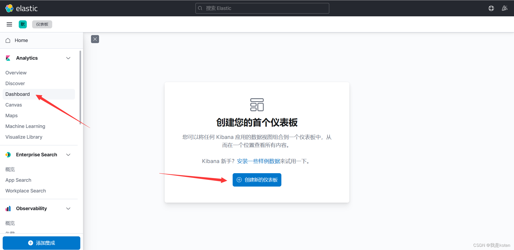**

添加后可以看到我们的样本仪表盘，我们之后可以根据自己的需求制作类似的仪表盘数据

### 二、查看索引

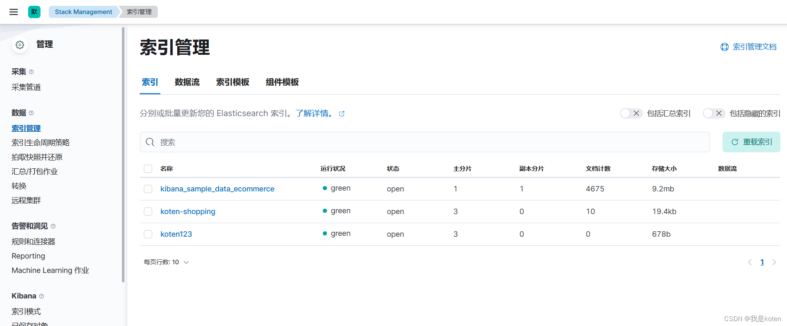

### 三、管理索引

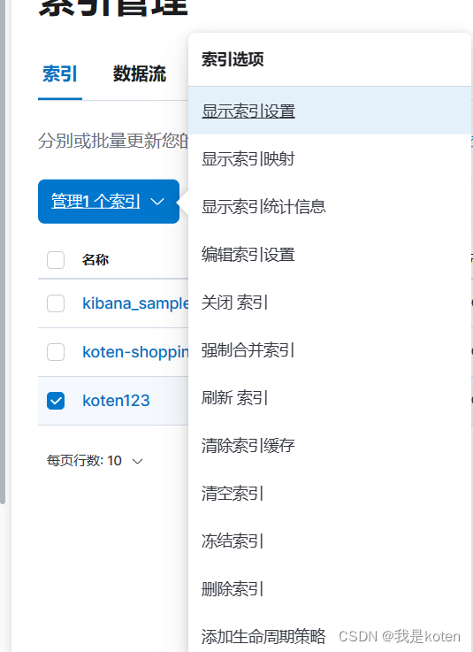

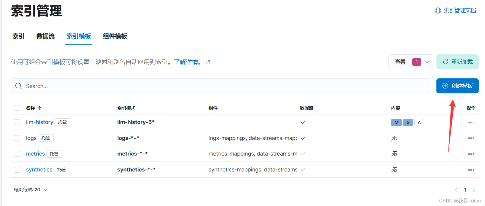

#### 添加字段

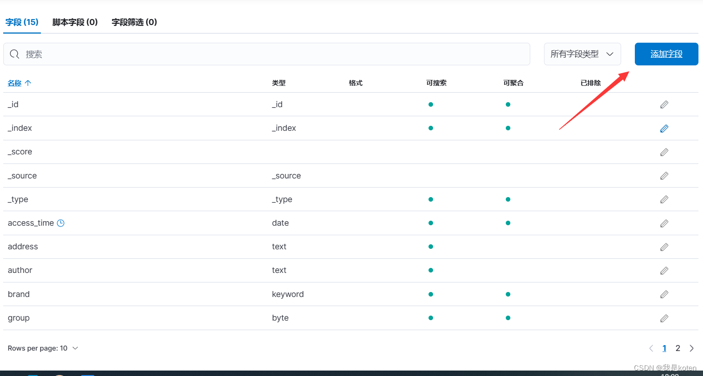

### 四、**创建索引模式

如果ES中有数据需要查询，先创建索引模式

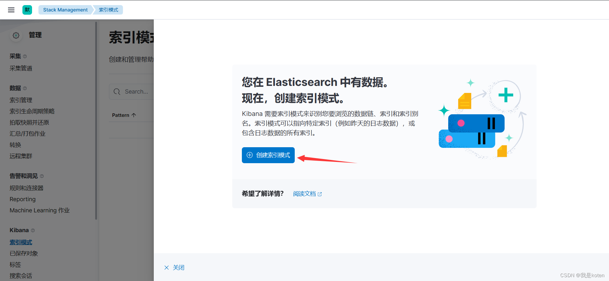


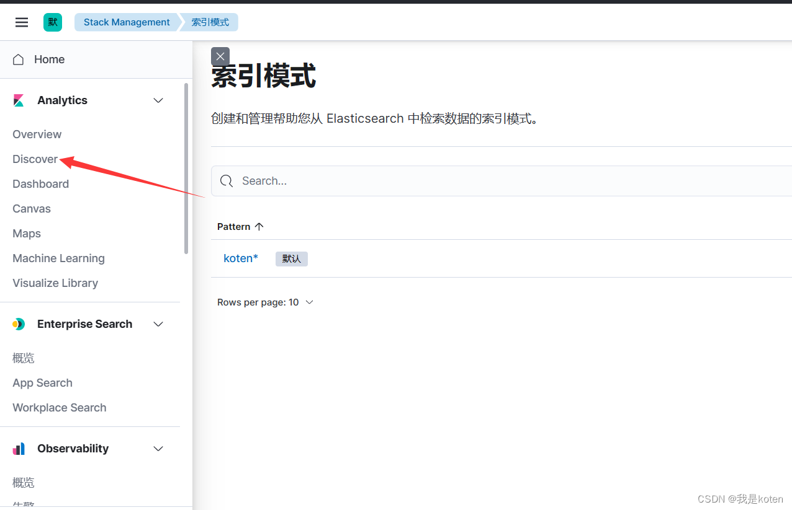

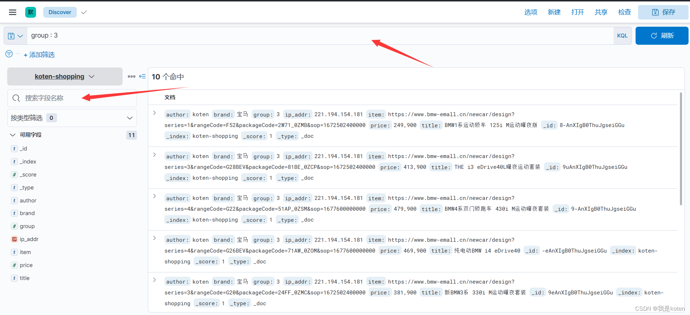

### 五、开发工具

kibana相较于api，可以实现大部分的功能，但是遇到聚合求平均值之类的需求，就解决不了了，我们可以在kibana的开发工具中输入api去实现需求

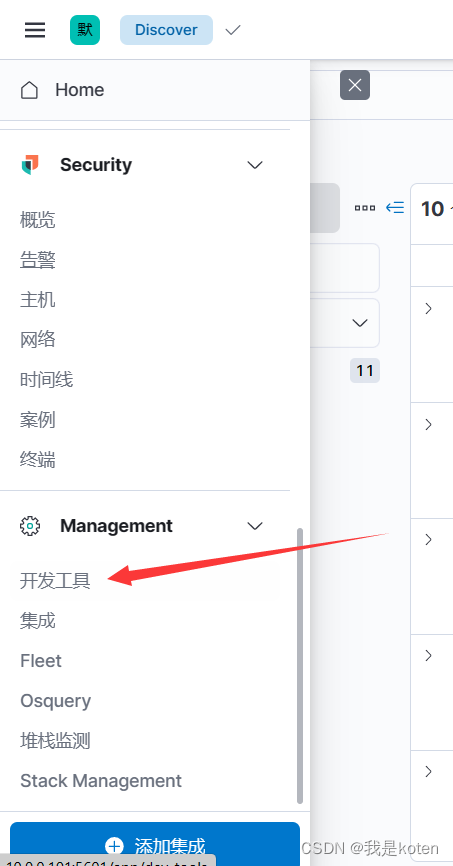

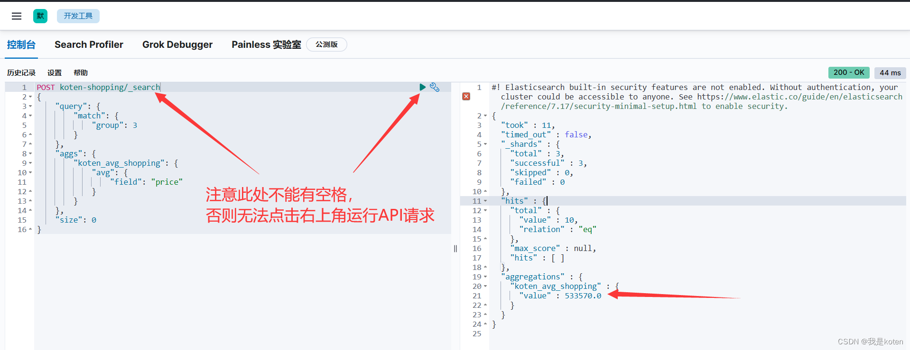


## Logstash

### 一、安装部署

```
1、下载软件
注意选择与ES一致的版本，我这边选择7.17.5
[root@ELK102 ~]# wget https://artifacts.elastic.co/downloads/logstash/logstash-7.17.5-x86_64.rpm

2、安装软件并创建符号连接，实现可以直接调用命令
[root@ELK102 ~]# rpm -ivh logstash-7.17.5-x86_64.rpm
[root@ELK102 ~]# ln -sv /usr/share/logstash/bin/logstash /usr/local/sbin/
‘/usr/local/sbin/logstash’ -> ‘/usr/share/logstash/bin/logstash’

3、基于命令行运行logstash的配置参数，并指定日志级别
[root@ELK102 ~]# logstash -e "input { stdin { type => stdin } }   output { stdout { codec => rubydebug } }" --log.level warn
......
The stdin plugin is now waiting for input:
111
{
       "message" => "111",
      "@version" => "1",
          "host" => "ELK102",
          "type" => "stdin",
    "@timestamp" => 2023-05-28T07:16:46.351Z
}
4、编写配置文件并检查语法

[root@ELK102 ~]# cat /etc/logstash/conf.d/01-stdin-to-stdout.conf
input { 
   stdin { 
     type => stdin 
   } 
}  

output { 
  stdout { 
    codec => rubydebug 
  } 
}
[root@ELK102 ~]# logstash -tf /etc/logstash/conf.d/01-stdin-to-stdout.conf --log.level fatal    #语法检查
5、基于配置文件启动logstash
[root@ELK102 ~]# logstash -f /etc/logstash/conf.d/01-stdin-to-stdout.conf --log.level fatal

```

### 二、Logstash采集本地日志文件

#### 一、采集本地日志文件到标准输出/etc/logstash/conf.d/

```
1、添加logstash配置文件
[root@ELK102 ~]# cat /etc/logstash/conf.d/02-file-to-stdout.conf
input { 
  file {
    # 指定读取新文件的起始位置，有效值为"beginning","end"，默认值为"end"
    start_position => "beginning"
    # 指定要采集文件路径
    path => ["/tmp/*.info","/tmp/*/*.txt"]
  }
}  
 
output { 
  stdout {
    # 指定输出的编码格式，默认是rubydebug
    codec => rubydebug 
    # codec => json
  } 
}

2、测试标准输出
[root@ELK102 ~]# logstash -rf /etc/logstash/conf.d/02-file-to-stdout.conf 
[root@ELK102 ~]# echo 111 > /tmp/1.info
[root@ELK102 ~]# logstash -rf /etc/logstash/conf.d/02-file-to-stdout.conf 
...
{
      "@version" => "1",
    "@timestamp" => 2023-05-28T08:54:00.415Z,
          "host" => "ELK102",
          "path" => "/tmp/1.info",
       "message" => "111"
}
[root@ELK102 ~]# echo 222 > /tmp/test/2.txt
{
      "@version" => "1",
    "@timestamp" => 2023-05-28T08:55:30.868Z,
          "host" => "ELK102",
          "path" => "/tmp/test/2.txt",
       "message" => "222"
}


```

#### 二、采集Nginx日志文件到标准输出

```bash
1、安装启动nginx
[root@ELK102 ~]# cat > /etc/yum.repos.d/nginx.repo <<'EOF'
[nginx-stable]
name=nginx stable repo
baseurl=http://nginx.org/packages/centos/$releasever/$basearch/
gpgcheck=1
enabled=1
gpgkey=https://nginx.org/keys/nginx_signing.key
module_hotfixes=true
 
[nginx-mainline]
name=nginx mainline repo
baseurl=http://nginx.org/packages/mainline/centos/$releasever/$basearch/
gpgcheck=1
enabled=0
gpgkey=https://nginx.org/keys/nginx_signing.key
module_hotfixes=true
EOF
[root@ELK102 ~]# yum -y install nginx
[root@ELK102 ~]# systemctl enable --now nginx
2、使用logstash采集Nginx日志并到标准输出
[root@ELK102 ~]# cat /etc/logstash/conf.d/03-nginx-to-stdout.conf    
input { 
  file {
    # 指定读取新文件的起始位置，有效值为"beginning","end"，默认值为"end"
    start_position => "beginning"
    # 指定要采集文件路径
    path => ["/var/log/nginx/access.log*"]
  }
}  

output { 
  stdout {
    # 指定输出的编码格式，默认是rubydebug
    codec => rubydebug 
    # codec => json
  } 
}

[root@ELK102 ~]# logstash -rf /etc/logstash/conf.d/03-nginx-to-stdout.conf
......
{
    "@timestamp" => 2023-05-28T09:05:31.885Z,
       "message" => "10.0.0.1 - - [28/May/2023:17:03:53 +0800] \"GET / HTTP/1.1\" 304 0 \"-\" \"Mozilla/5.0 (Windows NT 10.0; Win64; x64) AppleWebKit/537.36 (KHTML, like Gecko) Chrome/113.0.0.0 Safari/537.36 Edg/113.0.1774.50\" \"-\"",
          "host" => "ELK102",
          "path" => "/var/log/nginx/access.log",
      "@version" => "1"
}


```

#### 三、Nginx日志文件指定索引、主分片数、副本分片数输出

```
我们在input输入和output输出的时候有很多字段可以定义，实现我们个性化的需求，例如我们使用logstatsh采集Nginx日志到ES集群，要求10分片，0副本。logstash中并没有指定分片和副本的字段，所以我们可以采取索引模板的方式。
[root@elk102 ~]# cat config/04-nginx-to-elasticsearch.conf     
input { 
  file {
     id字段用于唯一标识一个input插件，但是无法实现
​    id => "nginx-001"
​    start_position => "beginning"
​    path => ["/var/log/nginx/access.log*"]
  }
}

output { 
  elasticsearch {
    # 指定ES的主机地址
​    hosts => ["10.0.0.101:19200","10.0.0.102:19200","10.0.0.103:19200"]
    # 自定义写入数据的索引,时间变量参考: 
    # https://www.joda.org/joda-time/apidocs/org/joda/time/format/DateTimeFormat.html
​    index => "koten-nginx-%{+yyyy.MM.dd}"    #我们先创建索引模板再指定索引姓名，就可以实现指定分片数了
  } 
}

[root@ELK102 ~]# logstash -rf /etc/logstash/conf.d/03-nginx-to-stdout.conf --log.level fatal

```

### 三、Filter常用插件详解实战练习

包括filter的grok、date、user_agent、geoip、mutate插件，多个输入输出方案（多实例+if多分支语句）

参考官网链接：https://www.elastic.co/guide/en/logstash/7.17/plugins-filters-grok.html

#### 一、grok使用官方模块采集nginx日志

1、删除缓存数据，删除后会重新读取文件，注意删除前先停掉logstash

```bash
[root@ELK102 ~]# ll /usr/share/logstash/data/plugins/inputs/file/.sincedb_
.sincedb_d527d4fe95e50e89070186240149c8bb
.sincedb_df5ae0d18161177fc305494571a52fca
.sincedb_e516aafddd2f065b257550d46b8c954c
[root@ELK102 ~]# rm -rf /usr/share/logstash/data/plugins/inputs/file/.sincedb_*
```

2、编写配置文件

```
[root@ELK102 ~]# cat /etc/logstash/conf.d/04-nginx-to-es.conf
input { 
  file {
    start_position => "beginning"
    path => ["/var/log/nginx/access.log*"]
  }
}  

filter{
  grok{
    match => {
      "message" => "%{COMMONAPACHELOG}"    #官方自带的Apache转换模块，与nginx格式一致
    }
  }
}

output { 
  elasticsearch {
    hosts => ["10.0.0.101:19200","10.0.0.102:19200","10.0.0.103:19200"]
    index => "koten-nginx-%{+yyyy.MM.dd}" 
  } 
  stdout {} 
}
```

3、执行logstash查看grok转换结果

```
[root@ELK102 ~]# logstash -rf /etc/logstash/conf.d/04-nginx-to-es.conf
......
{
       "@version" => "1",
        "message" => "10.0.0.1 - - [29/May/2023:11:26:09 +0800] \"GET / HTTP/1.1\" 304 0 \"-\" \"Mozilla/5.0 (Windows NT 10.0; Win64; x64) AppleWebKit/537.36 (KHTML, like Gecko) Chrome/113.0.0.0 Safari/537.36 Edg/113.0.1774.50\" \"-\"",
           "path" => "/var/log/nginx/access.log",
       "clientip" => "10.0.0.1",
           "host" => "ELK102",
        "request" => "/",
     "@timestamp" => 2023-05-29T03:26:20.756Z,
           "verb" => "GET",
       "response" => "304",
           "auth" => "-",
    "httpversion" => "1.1",
          "ident" => "-",
      "timestamp" => "29/May/2023:11:26:09 +0800",
          "bytes" => "0"
}

```

二、grok自定义正则案例

```
1、准备待匹配文本数据
[root@ELK102 ~]# cat /tmp/haha.log 
welcome to kotenedu linux, 2023

2、编写自定义的匹配模式
[root@ELK102 ~]# mkdir koten-patterns/koten-patterns
[root@ELK102 ~]# cat koten-patterns/koten.patterns 
SCHOOL [a-z]{8}
SUBJECT [a-z]{5}
YEAR [\d]{4}

3、编写grok的使用自定义匹配模式
[root@ELK102 ~]# cat config/05-file-grok-stdout.conf 
input { 
  file {
    start_position => "beginning"
    path => ["/tmp/haha.log"]
  }
}   
filter {
  # 基于正则匹配任意文本
  grok {
    # 加载自定义变量的存储目录
    patterns_dir => ["./koten-patterns/"]
 
    match => {
      "message" => "welcome to %{SCHOOL:school} %{SUBJECT:subject}, %{YEAR:year}"
    }
  }
}
output { 
  stdout {
    codec => rubydebug 
  } 
}

4、启动logstash，注意，启动logstasg案例，为防止写入时多个案例调用同一个id的文档，导致数据少写，官方限制了多个案例同时启动，需要单独指定数据路径
[root@ELK102 ~]# logstash -rf /etc/logstash/conf.d/05-nginx_file-grok-stdout.conf 
......
{
       "message" => "welcome to kotenedu linux, 2023",
        "school" => "kotenedu",
       "subject" => "linux",
          "year" => "2023",
    "@timestamp" => 2023-05-29T12:01:33.003Z,
          "host" => "ELK102",
      "@version" => "1",
          "path" => "/tmp/haha.log"
}
 
[root@ELK102 ~]# logstash -rf /etc/logstash/conf.d/05-nginx_file-grok-stdout.conf --path.data /tmp/new-data    #单独指定数据路径
```

#### 三、date插件修改日期时间

参考官网链接：https://www.elastic.co/guide/en/logstash/7.17/plugins-filters-date.html

```
[root@ELK102 ~]# cat config/06-file-filter-es.conf
input {
  file {
    start_position => "beginning"
    path => ["/var/log/nginx/access.log"]
  }
}

filter {
  grok {
    match => "%{COMMONAPACHELOG}"
  }
}

output { 
  elasticsearch{
    hosts => ["10.0.0.101:19200","10.0.0.102:19200","10.0.0.103:19300"]
    index => "koten-nginx-access-%{+yyyy.MM.dd}"
  }
  stdout {
    codec => rubydebug 
  } 
}
[root@ELK102 ~]# logstash -rf config/06-file-filter-es.conf

由于在kinbana中，若更改索引名字有日期，添加索引模式，下拉时间戳字段会显示@timestamp 
```


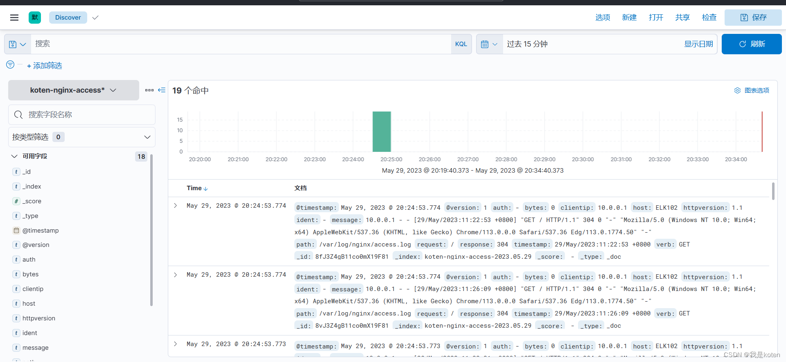

我们可以根据该时间进行筛选，但是该时间并不是日志的时间，有些时候我们想针对日志中的时间筛选，就需要date插件来定义日志中的时间

我们根据官网提供的时间符号来定义自己的时间格式

```
[root@ELK102 ~]# cat config/07-file-filter-es.conf
input { 
  file {
    start_position => "beginning"
    path => ["/var/log/nginx/access.log"]
  }
}  
 
filter {
  grok {
    match => {
      "message" => "%{COMMONAPACHELOG}"
    }
  }
  date {
    match => [ 
      # "28/May/2023:16:46:15 +0800"
      "timestamp", "dd/MMM/yyyy:HH:mm:ss Z"
    ]
 
    target => "koten-timestamp"
  }
}
 
output { 
  elasticsearch{
    hosts => ["10.0.0.101:19200","10.0.0.102:19200","10.0.0.103:19300"]
    index => "koten-nginx-access-%{+yyyy.MM.dd}"
  }
  stdout {
    codec => rubydebug 
  } 
}

删除之前加入的索引和索引模式，删除logstash记录的添加收集记录，运行新的配置文件
[root@ELK102 ~]# rm -rf /usr/share/logstash/data/plugins/inputs/file/.sincedb_*
[root@ELK102 ~]# logstash -rf config/07-file-filter-es.conf
......
{
    "koten-timestamp" => 2023-05-29T03:22:53.000Z,        #格林威治时间
              "bytes" => "0",
               "verb" => "GET",
          "timestamp" => "29/May/2023:11:22:53 +0800",    #日志中的时间
         "@timestamp" => 2023-05-29T12:47:30.415Z,        #logstash读取到日志的时间
               "path" => "/var/log/nginx/access.log",
               "host" => "ELK102",
              "ident" => "-",
           "response" => "304",
           "@version" => "1",
        "httpversion" => "1.1",
            "request" => "/",
               "auth" => "-",
            "message" => "10.0.0.1 - - [29/May/2023:11:22:53 +0800] \"GET / HTTP/1.1\" 304 0 \"-\" \"Mozilla/5.0 (Windows NT 10.0; Win64; x64) AppleWebKit/537.36 (KHTML, like Gecko) Chrome/113.0.0.0 Safari/537.36 Edg/113.0.1774.50\" \"-\"",
           "clientip" => "10.0.0.1"
}


```

此时timestamp字段已经由text字段，子字段是keyword字段转换成了date字段

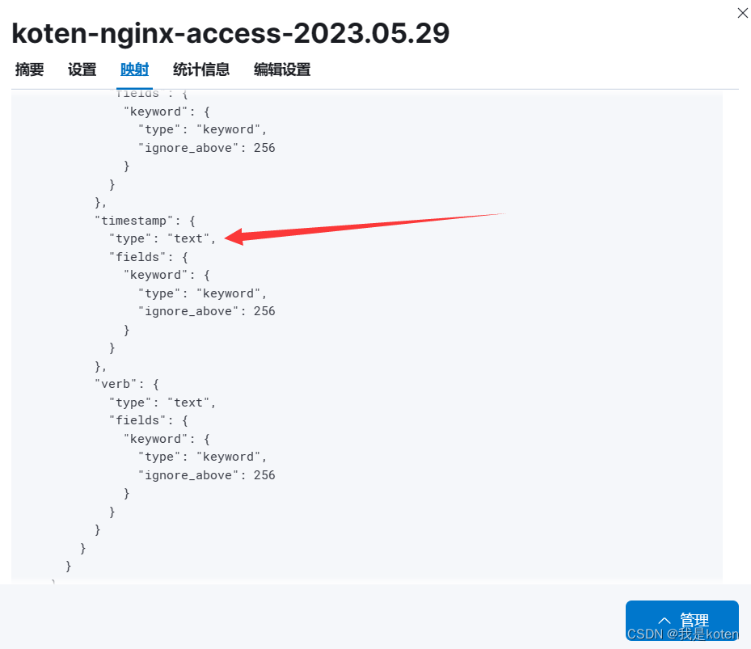

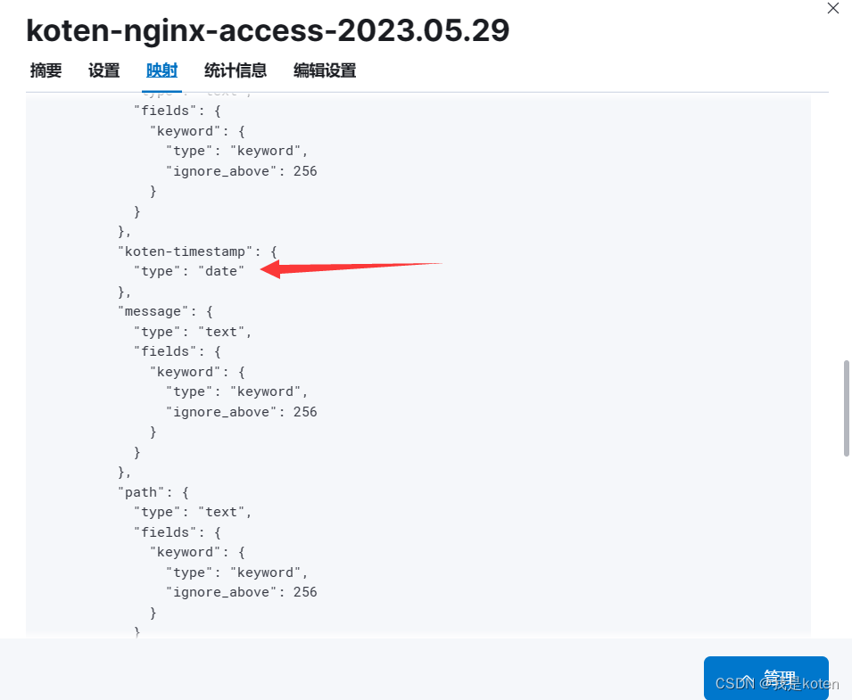

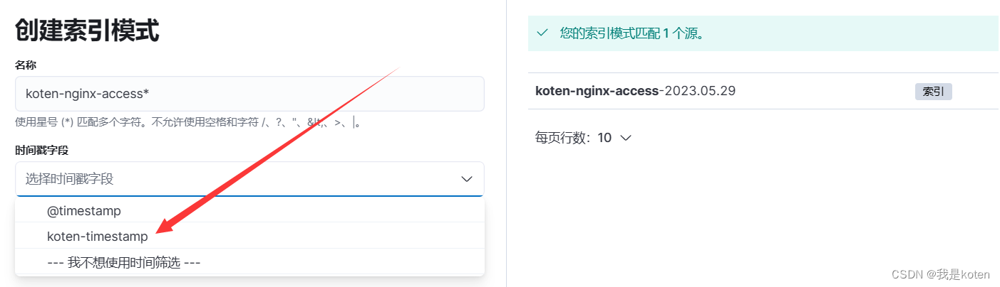

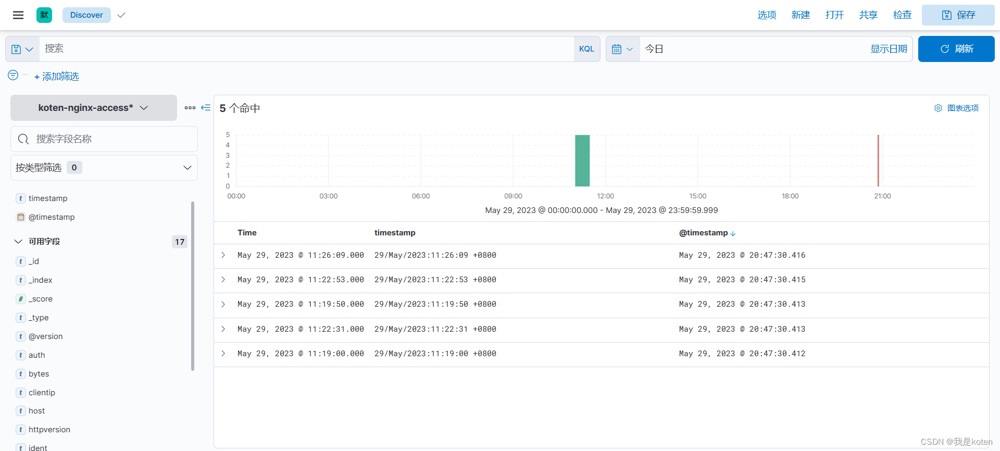

#### 四、useragent插件

参考官网链接：https://www.elastic.co/guide/en/logstash/7.17/plugins-filters-useragent.html

分析"/tmp/nginx.log"日志，采集后写入ES，并分析2011~2021的访问量pv，设备类型

1、将一些nginx记录提前准备好，放到/tmp/下，命名为nginx.log

```
[root@ELK102 ~]# ll -h /tmp/nginx.log 
-rw-r--r-- 1 root root 63M May 29 20:57 /tmp/nginx.log
[root@ELK102 ~]# wc -l /tmp/nginx.log
294549 /tmp/nginx.log
[root@ELK102 ~]# head -1 /tmp/nginx.log
54.94.14.30 - - [15/Sep/2010:02:16:14 +0800] "POST /zhibo.html HTTP/1.1" 200 555 "-" "Mozilla/5.0 (Windows NT 10.0; Win64; x64) AppleWebKit/537.36 (KHTML, like Gecko) Chrome/113.0.0.0 Safari/537.36" "-"

```

2、清空logstash缓存，方便其自动添加

```
[root@ELK102 ~]# rm -rf /usr/share/logstash/data/plugins/inputs/file/.since*
```

3、编写配置文件采集日志，并按照指定格式加入ES索引

```
[root@ELK102 ~]# cat config/08-file-filter-es.conf 
input { 
  file {
    start_position => "beginning"
    path => ["/tmp/nginx.log"]
  }
}  
 
filter {
  grok { #分析文本并解析提取需要的字段
    match => { #匹配文本字段，可以引用内置的正则变量
      "message" => "%{COMMONAPACHELOG}"
    }
  }
  date { #解析日期的字段
    match => [ #对时间进行格式化匹配并转换成ES的date字段
      # "28/May/2023:16:46:15 +0800"
      "timestamp", "dd/MMM/yyyy:HH:mm:ss Z"
    ]
    #将转换后的结果存储在指定字段，若不指定，则默认覆盖@timestamp字段
    target => "koten-timestamp"
  }
  # 分析客户端设备类型
  useragent {
      # 指定要分析客户端的字段
      source => "message"
      # 指定将分析的结果放在哪个字段中，若不指定，则放在顶级字段中。
      target => "koten-agent"
  }
}
 
output { 
  elasticsearch{
    hosts => ["10.0.0.101:19200","10.0.0.102:19200","10.0.0.103:19300"]
    index => "koten-nginx-access-%{+yyyy.MM.dd}"
  }
  #stdout {        #数据量过大，挨个输出到屏幕上浪费时间
  #  codec => rubydebug 
  #} 
}

```

4、运行logstash

```
[root@ELK102 ~]# logstash -rf config/08-file-filter-es.conf 
```

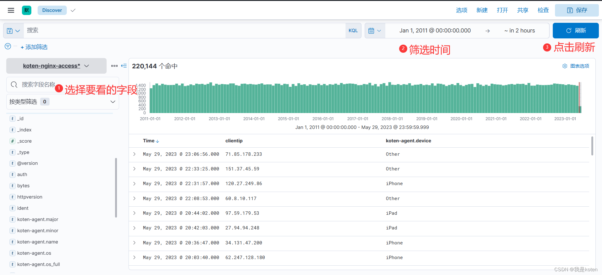

这些都是useragent插件生成的设备信息的字段

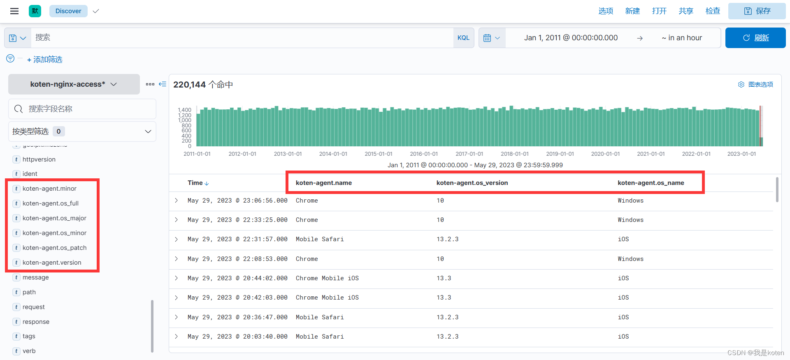

#### 五、geoip插件

参考官网链接：https://www.elastic.co/guide/en/logstash/7.17/plugins-filters-geoip.html
写入地理位置测试数据到ES中，并在kibana中生成地图
提取nginx.log中的公网ip，由logstash转成经纬度，写入ES中并在kibana中以地图形式显示

https://blog.csdn.net/qq_37510195/article/details/130922535

效果

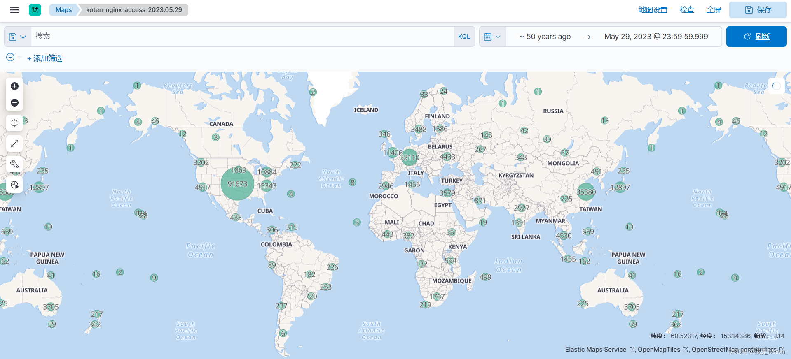

#### 六、mutate插件

参考官网链接：https://www.elastic.co/guide/en/logstash/7.17/plugins-filters-mutate.html

当我们的日志中的字段是按照指定字符分割开来时，就需要用到该插件了，mutate插件适合对字段的信息进行分割，通过分割可以很方便的定义添加字段，虽然用grok写正则表达式也可以实现匹配字段，但是写很多表达式还是很麻烦的。

#### 七、if多分支语句

if多分支语句与--path.data一样，是多个输入多个输出的一种方式

```
[root@ELK102 ~]# cat config/11-file-filter-es.conf
input { 
  file {
    start_position => "beginning"
    path => ["/tmp/haha.log"]
    type => "haha"
  }

  file {
    start_position => "beginning"
    path => ["/tmp/app.log"]
    type => "app"
  }
}  


filter {
   if [type] == "haha" {
      grok {
        patterns_dir => ["./koten-patterns/"]
        match => {
          "message" => "welcome to %{SCHOOL:school} %{SUBJECT:subject}, %{YEAR:year}"
        }
      }

   } else if [type] == "app" {
       mutate {
          split => { "message" => "|" }
       }
```

       mutate {
         add_field => {
            user_id => "%{[message][1]}"
            action => "%{[message][2]}"
            svip => "%{[message][3]}"
            price => "%{[message][4]}"
         }
       }
     
       mutate {
         convert => {
           "user_id" => "integer"
           "svip" => "boolean"
           "price" => "float"
         }
       }
     
       mutate {
         rename => { "path" => "filepath" }
       }
     
       mutate {
         remove_field => [ "@version","message" ]
       }

```
  }
}

output { 
  if [type] == "haha" {
    elasticsearch {
      hosts => ["10.0.0.101:19200","10.0.0.102:19200","10.0.0.103:19200"]
      index => "koten-if-haha-%{+yyyy.MM.dd}"
    } 
  } else if [type] == "app" {
    elasticsearch {
      hosts => ["10.0.0.101:19200","10.0.0.102:19200","10.0.0.103:19200"]
      index => "koten-if-app-%{+yyyy.MM.dd}"
    } 
  }

  stdout {
    codec => rubydebug 
  } 
}

```

#### Logstash常用filter插件总结

```
1、grok：正则匹配任意文本

2、date：处理时间字段

3、user_agent：分析客户端设备

4、geoip：分析客户端IP地理位置

5、mutate：对字符串文本进行处理，转换，字母大小写，切分，重命名，添加字段，删除字段

运行多个输入和输出的方案：

多实例：需要单独指定数据路径，--data.path

if [type] == "xxx" {

} else if [type] == "xxx" {

} else {

}

pipline：logstash运行时默认就有一个main pipline
```

### 商品分析实战练习

https://blog.csdn.net/qq_37510195/article/details/130940849

### pipline实现多实例

我们想要运行多个logstash可以有三个方法，一个是用--path.data指定的

```
nohup logstash -rf /root/config/13-01-file-filter-es.conf --path.data /tmp/logstsh-txt &>/tmp/logstsh-txt.log  &
nohup logstash -rf /root/config/13-02-file-filter-es.conf --path.data /tmp/logstsh-bulk &>/tmp/logstsh-bulk.log  &
nohup logstash -rf /root/config/13-03-file-filter-es.conf --path.data /tmp/logstsh-json &>/tmp/logstsh-json.log  &
```

第二个是用if多条件语句，就是上面多种商品格式用的那种，最后一个就是pipline实现多实例；第一个方法需要开启三个线程，比较麻烦，第二个方法的配置文件可读性比较差，而且容易造成环境污染，我们将配置文件拆分成三个，利用pipline实现多实例，拆分结果如下。

#### 实现热更新

运行logstash后，我们想停掉某个配置文件的采集和开启新的配置文件的采集，如果每次都停止，写piplines.yml的配置文件，很不方便，所以我们可以在配置文件里写通配符，然后运行logstash -r实现重载

```
[root@ELK102 ~]# egrep -v '^$|^#' /etc/logstash/pipelines.yml

pipeline.id: txt
path.config: "/root/config/*.conf"
[root@ELK102 ~]# logstash -r
```

## filebeat

部署使用

参考官网链接：https://www.elastic.co/guide/en/beats/filebeat/7.17/configuring-howto-filebeat.html

### 一、安装部署

```bash
1、下载filebeat，与es版本一致，我这边使用7.17.5
[root@ELK103 ~]# wget https://artifacts.elastic.co/downloads/beats/filebeat/filebeat-7.17.5-x86_64.rpm 

2、安装filebeat
[root@ELK103 ~]# rpm -ivh filebeat-7.17.5-x86_64.rpm 

3、创建工作目录
[root@ELK103 ~]# mkdir config
[root@ELK103 ~]# ln -sv /root/config/ /etc/filebeat/config    #这里谁做谁的软链接其实无所谓，反正filebeat默认读etc下的，做软链接，能读到root下的就行
‘/etc/filebeat/config’ -> ‘/root/config/’
 
 4、编写配置文件
[root@ELK103 ~]# cat config/01-stdin-to-console.yaml
#指定input插件
filebeat.inputs:
  # 类型为标准输出
  - type: stdin
# 指定output插件类型为console
output.console:
  pretty: true


5、运行输入输出案例，-c是指定配置文件，-e是把日志输出到当前终端
[root@ELK103 ~]# filebeat -e -c config/01-stdin-to-console.yaml
{
  "@timestamp": "2023-05-30T09:39:42.755Z",
  "@metadata": {
    "beat": "filebeat",
    "type": "_doc",
    "version": "7.17.5"
  },
  "host": {
    "name": "ELK103"
  },
  "agent": {
    "ephemeral_id": "2e3c2623-23d5-401a-b564-70e18adbe979",
    "id": "e4c15441-9b1f-454d-b484-38e809d43a51",
    "name": "ELK103",
    "type": "filebeat",
    "version": "7.17.5",
    "hostname": "ELK103"
  },
  "log": {
    "offset": 0,
    "file": {
      "path": ""
    }
  },
  "message": "1",
  "input": {
    "type": "stdin"
  },
  "ecs": {
    "version": "1.12.0"
  }
}

```

### 二、filebeat采集文本日志

1、编写配置文件

```bash
二、filebeat采集文本日志
1、编写配置文件
[root@ELK103 ~]# cat config/02-log-to-console.yaml
# 指定input插件的配置
filebeat.inputs:
  # 类型为log
- type: log
  # 指定日志的路径
  paths:
    - /tmp/filebeat/*.log
# 指定output插件类型为console
output.console:
  pretty: true

2、启动filebeat实例
[root@ELK103 ~]# filebeat -e -c config/02-log-to-console.yaml 

3、将数据加进指定路径，查看是否能采集
[root@ELK103 ~]# mkdir /tmp/filebeat
[root@ELK103 ~]# echo 111 > /tmp/filebeat/1.log
[root@ELK103 ~]# echo 222 > /tmp/filebeat/2.log

4、数据成功采集
{
  "@timestamp": "2023-05-30T12:59:17.270Z",
  "@metadata": {
    "beat": "filebeat",
    "type": "_doc",
    "version": "7.17.5"
  },
  "log": {
    "offset": 0,            #从哪个位置输出，可以在日志中修改此值
    "file": {
      "path": "/tmp/filebeat/1.log"
    }
  },
  "message": "111",
  "input": {
    "type": "log"
  },
  "ecs": {
    "version": "1.12.0"
  },
  "host": {
    "name": "ELK103"
  },
  "agent": {
    "type": "filebeat",
    "version": "7.17.5",
    "hostname": "ELK103",
    "ephemeral_id": "9fde02dc-f719-4b9c-b52b-d035a5123cdc",
    "id": "e4c15441-9b1f-454d-b484-38e809d43a51",
    "name": "ELK103"
  }
}
2023-05-30T20:59:27.271+0800	INFO	[input.harvester]	log/harvester.go:309	Harvester started for paths: [/tmp/filebeat/*.log]	{"input_id": "3e6b2b68-da05-4ce6-878f-d4fede6dd461", "source": "/tmp/filebeat/2.log", "state_id": "native::18375024-2051", "finished": false, "os_id": "18375024-2051", "harvester_id": "8368ca54-7956-4a55-b93f-f9c64e0bea39"}
{
  "@timestamp": "2023-05-30T12:59:27.271Z",
  "@metadata": {
    "beat": "filebeat",
    "type": "_doc",
    "version": "7.17.5"
  },
  "log": {
    "offset": 0,
    "file": {
      "path": "/tmp/filebeat/2.log"
    }
  },
  "message": "222",
  "input": {
    "type": "log"
  },
  "ecs": {
    "version": "1.12.0"
  },
  "host": {
    "name": "ELK103"
  },
  "agent": {
    "hostname": "ELK103",
    "ephemeral_id": "9fde02dc-f719-4b9c-b52b-d035a5123cdc",
    "id": "e4c15441-9b1f-454d-b484-38e809d43a51",
    "name": "ELK103",
    "type": "filebeat",
    "version": "7.17.5"
  }
}

5、修改运行日志后重新运行会重新读取
需要删除记录的时候直接删除/var/lib/filebeat下的所有
[root@ELK103 ~]# tail -1 /var/lib/filebeat/registry/filebeat/log.json
{"k":"filebeat::logs::native::18375024-2051","v":{"offset":4,"ttl":-1,"prev_id":"","source":"/tmp/filebeat/2.log","timestamp":[2061883432564,1685451872],"type":"log","FileStateOS":{"inode":18375024,"device":2051},"identifier_name":"native","id":"native::18375024-2051"}}
将"offset":4改为"offset":2
[root@ELK103 ~]# tail -1 /var/lib/filebeat/registry/filebeat/log.json
{"k":"filebeat::logs::native::18375024-2051","v":{"offset":2,"ttl":-1,"prev_id":"","source":"/tmp/filebeat/2.log","timestamp":[2061883432564,1685451872],"type":"log","FileStateOS":{"inode":18375024,"device":2051},"identifier_name":"native","id":"native::18375024-2051"}}
#再次运行发现输出了刚刚echo进去的最后一个字符（其实是俩，还有一个换行符）

[root@ELK103 ~]# filebeat -e -c config/02-log-to-console.yaml 
......
{
  "@timestamp": "2023-05-30T13:17:14.449Z",
  "@metadata": {
    "beat": "filebeat",
    "type": "_doc",
    "version": "7.17.5"
  },
  "message": "2",
  "input": {
    "type": "log"
  },
  "ecs": {
    "version": "1.12.0"
  },
  "host": {
    "name": "ELK103"
  },
  "agent": {
    "hostname": "ELK103",
    "ephemeral_id": "9280127a-b1da-48a5-aa91-e60378fa54a1",
    "id": "e4c15441-9b1f-454d-b484-38e809d43a51",
    "name": "ELK103",
    "type": "filebeat",
    "version": "7.17.5"
  },
  "log": {
    "offset": 2,
    "file": {
      "path": "/tmp/filebeat/2.log"
    }
  }
}

```

### 三、filebeat输出进logstash案例

这种情况要先处理logstash，启动logstash防止filebeat输出的请求接收不到

1、编辑logstash配置文件启动logstash

```
[root@ELK102 ~]# cat config/14-beats-to-stdout.conf
input {
  # 指定输入端为beats
  beats {
    # 指定监听端口
    port => 8888
  }
}
output { 
  stdout {
    codec => rubydebug 
  } 
}
[root@ELK102 ~]# logstash -rf config/14-beats-to-stdout.conf
```

2、编辑filebeat配置文件并启动filebeat

```
[root@ELK103 ~]# cat config/03-log-to-logstash.yaml
# 指定input插件的配置
filebeat.inputs:
  # 类型为log
- type: log
  # 指定日志的路径
  paths:
    - /tmp/filebeat/**/*.log        #**代表中间文件夹可有可无，且可有多层文件夹
 
# 将数据发送到logstash
output.logstash:
  hosts: ["10.0.0.102:8888"]
[root@ELK103 ~]# filebeat -e -c config/03-log-to-logstash.yaml

```

3、写入日志数据查看logstash输出状态

4、发现logstash日志比较杂乱，可以筛选出去不想要的字段

```
[root@ELK102 ~]# cat config/14-beats-to-stdout.conf
input {

  # 指定输入端为beats

  beats {
    # 指定监听端口
    port => 8888
  }
}

filter {
  mutate{
    remove_field => [ "@version","agent","host","input","ecs","log","tags" ]
  }
}

output { 
  stdout {
    codec => rubydebug 
  } 
}
```

原文链接：https://blog.csdn.net/qq_37510195/article/details/130940849

5、再次测试发现字段已经被筛选掉了，变得整洁了许多

```
[root@ELK102 ~]# logstash -rf config/14-beats-to-stdout.conf
 
[root@ELK103 ~]# filebeat -e -c config/03-log-to-logstash.yaml
[root@ELK103 ~]# echo ccc > /tmp/filebeat/c.log
 
[root@ELK102 ~]# logstash -rf config/14-beats-to-stdout.conf
......
{
    "@timestamp" => 2023-05-30T13:39:08.946Z,
       "message" => "ccc"
}

```

### 四、Filebeat输出进ES案例

```
[root@ELK103 ~]# cat config/06-log-to-es.yaml
filebeat.inputs:
- type: log
  paths: ["/tmp/filebeat/*.log"]
 
output.elasticsearch:
  # hosts: ["http://10.0.0.101:19200","http://10.0.0.102:19200","http://10.0.0.103:19200"] #两种格式均可
  hosts: 
  - "http://10.0.0.101:19200"
  - "http://10.0.0.102:19200"
  - "http://10.0.0.103:19200"

```

### 五、Input通用字段

1、enabled
默认值为true，指是否启用此字段

2、tags
可以给event打标签，生成tags定义的字段

3、fields
自定义字段，默认自定义的字段在fields字段下面

4、fields_under_root
可以指定值为true，将自定义的字段放在顶级字段，若不指定，则默认储存在fields字段下面

5、测试字段效果

```
[root@ELK103 ~]# cat config/04-log-to-logstash.yaml
# 指定input插件的配置
filebeat.inputs:
  # 类型为log
- type: log
  # 指定日志的路径
  paths:
    - /tmp/filebeat/**/*.log
  # 是否启用该配置
  enabled: true
  # 给event打标签
  tags: ["json"]
  # 给event添加字段
  fields:
    name: koten
    subject: linux
  # 将自定义添加的字段放在顶级字段中，若不指定，则默认存储在"fields"下级字段。
  fields_under_root: true
  
- type: log
  paths:
    - /tmp/filebeat/**/*.txt
  enabled: false
 
# 将数据发送到logstash
output.logstash:
  hosts: ["10.0.0.102:8888"]
    
[root@ELK103 ~]# echo 1 > /tmp/filebeat/1.txt    #enabled：false 不会采集
[root@ELK103 ~]# echo 2 > /tmp/filebeat/2.log    #enabled：false 不会采集
 
[root@ELK102 ~]# logstash -rf config/14-beats-to-stdout.conf
......
{
       "message" => "2",
    "@timestamp" => 2023-05-30T13:56:36.805Z,
       "subject" => "linux",
          "name" => "koten"
}

```

### 六、processors解析

参考官网链接：

https://www.elastic.co/guide/en/beats/filebeat/7.17/filtering-and-enhancing-data.html

有些类似logstash中的filter，但是没有filter强大，也就是说filebeat把类似filter的功能集成在了input的processors中，可以添加字段，指定字段，将字段放在顶级字段，删除事件，json格式解析，删除收集到的字段（默认字段无法删除），对字段进行重命名

```
[root@ELK103 ~]# cat config/05-log-to-logstash.yaml
filebeat.inputs:
- type: log
  paths: ["/tmp/filebeat/*.bulk"]
  processors:
    # 添加字段
  - add_fields:
      # 指定将字段放在哪个位置，若不指定，则默认值为"fields"
      # 指定为""时，则放在顶级字段中
      # target: koten-linux
      target: ""
      fields:
        name: koten
        hobby: "nginx，k8s，elk"
    # 刪除事件
  - drop_event:
      # 删除message字段中包含create字样的事件(event)
      when:
        contains:
          message: "create"
    # 解码json格式数据
  - decode_json_fields:
      fields: ["message"]
      target: ""
    # 删除指定字段，但无法删除filebeat内置的字段，若真有这个需求，请在logstash中删除即可。
  #- drop_fields:
    # fields: ["name","hobby"]
    # ignore_missing: false
    # 对字段进行重命名
  - rename:
      fields:
        - from: "name"
          to: "name2023"
 
output.logstash:
  hosts: ["10.0.0.102:8888"]
 
 
[root@ELK103 ~]# filebeat -e -c config/05-log-to-logstash.yaml
[root@ELK103 ~]# cat /tmp/filebeat/1.bulk
{ "create": { "_index": "oldboyedu-shopping"} }
{ "ip_addr": "221.194.154.181" ,"title":"BMW1系运动轿车 125i M运动曜夜版","price":249900,"brand":"宝马","item":"https://www.bmw-emall.cn/newcar/design?series=1&rangeCode=F52&packageCode=2W71_0ZMB&sop=1672502400000","group":3,"author":"koten"}
[root@ELK102 ~]# logstash -rf config/14-beats-to-stdout.conf
......
{
      "name2023" => "koten",
          "item" => "https://www.bmw-emall.cn/newcar/design?series=1&rangeCode=F52&packageCode=2W71_0ZMB&sop=1672502400000",
         "hobby" => "nginx，k8s，elk",
    "@timestamp" => 2023-05-30T14:11:00.873Z,
         "group" => 3,
         "brand" => "宝马",
         "title" => "BMW1系运动轿车 125i M运动曜夜版",
       "message" => "{ \"ip_addr\": \"221.194.154.181\" ,\"title\":\"BMW1系运动轿车 125i M运动曜夜版\",\"price\":249900,\"brand\":\"宝马\",\"item\":\"https://www.bmw-emall.cn/newcar/design?series=1&rangeCode=F52&packageCode=2W71_0ZMB&sop=1672502400000\",\"group\":3,\"author\":\"koten\"}",
        "author" => "koten",
       "ip_addr" => "221.194.154.181",
         "price" => 249900
}

```

### 七、filebeat进行多行匹配

参考官网链接：https://www.elastic.co/guide/en/beats/filebeat/7.17/multiline-examples.html

#### 一、tomcat错误日志

1、修改tomcat配置文件，生成一些错误日志

```
[root@ELK101 ~]# cd /koten/softwares/apache-tomcat-9.0.75/
[root@ELK101 apache-tomcat-9.0.75]# cat conf/server.xml|grep 111
 	<111Host name="localhost"  appBase="webapps"
[root@ELK101 apache-tomcat-9.0.75]# bin/startup.sh
```

2.使用filebeat采集tomcat错误日志

```
[root@ELK101 apache-tomcat-9.0.75]# cat logs/catalina.out
......
01-Jun-2023 18:59:45.297 SEVERE [main] org.apache.tomcat.util.digester.Digester.fatalError Parse fatal error at line [161] column [4]
	org.xml.sax.SAXParseException; systemId: file:/koten/softwares/apache-tomcat-9.0.75/conf/server.xml; lineNumber: 161; columnNumber: 4; The content of elements must consist of well-formed character data or markup.
		at com.sun.org.apache.xerces.internal.util.ErrorHandlerWrapper.createSAXParseException(ErrorHandlerWrapper.java:204)
		at com.sun.org.apache.xerces.internal.util.ErrorHandlerWrapper.fatalError(ErrorHandlerWrapper.java:178)
		at com.sun.org.apache.xerces.internal.impl.XMLErrorReporter.reportError(XMLErrorReporter.java:400)
		at com.sun.org.apache.xerces.internal.impl.XMLErrorReporter.reportError(XMLErrorReporter.java:327)
		at com.sun.org.apache.xerces.internal.impl.XMLScanner.reportFatalError(XMLScanner.java:1472)
		at com.sun.org.apache.xerces.internal.impl.XMLDocumentFragmentScannerImpl$FragmentContentDriver.startOfMarkup(XMLDocumentFragmentScannerImpl.java:2637)
		at com.sun.org.apache.xerces.internal.impl.XMLDocumentFragmentScannerImpl$FragmentContentDriver.next(XMLDocumentFragmentScannerImpl.java:2734)
		at com.sun.org.apache.xerces.internal.impl.XMLDocumentScannerImpl.next(XMLDocumentScannerImpl.java:605)
		at com.sun.org.apache.xerces.internal.impl.XMLDocumentFragmentScannerImpl.scanDocument(XMLDocumentFragmentScannerImpl.java:507)
		at com.sun.org.apache.xerces.internal.parsers.XML11Configuration.parse(XML11Configuration.java:867)
		at com.sun.org.apache.xerces.internal.parsers.XML11Configuration.parse(XML11Configuration.java:796)
		at com.sun.org.apache.xerces.internal.parsers.XMLParser.parse(XMLParser.java:142)
		at com.sun.org.apache.xerces.internal.parsers.AbstractSAXParser.parse(AbstractSAXParser.java:1216)
		at com.sun.org.apache.xerces.internal.jaxp.SAXParserImpl$JAXPSAXParser.parse(SAXParserImpl.java:644)
		at org.apache.tomcat.util.digester.Digester.parse(Digester.java:1535)
		at org.apache.catalina.startup.Catalina.parseServerXml(Catalina.java:617)
		at org.apache.catalina.startup.Catalina.load(Catalina.java:709)
		at org.apache.catalina.startup.Catalina.load(Catalina.java:746)
		at sun.reflect.NativeMethodAccessorImpl.invoke0(Native Method)
		at sun.reflect.NativeMethodAccessorImpl.invoke(NativeMethodAccessorImpl.java:62)
		at sun.reflect.DelegatingMethodAccessorImpl.invoke(DelegatingMethodAccessorImpl.java:43)
		at java.lang.reflect.Method.invoke(Method.java:498)
		at org.apache.catalina.startup.Bootstrap.load(Bootstrap.java:307)
		at org.apache.catalina.startup.Bootstrap.main(Bootstrap.java:477)
......
```

3、filebeat采集tomcat错误日志

```
[root@ELK101 ~]# cd /koten/softwares/filebeat-7.17.5-linux-x86_64/config/
[root@ELK101 config]# cat 10-tomcat-to-es.yaml
filebeat.inputs:
- type: log
  paths:
  - "/koten/softwares/apache-tomcat-9.0.75/logs/catalina.out*"
  # 表示指定多行匹配的类型
  multiline.type: pattern
  # 指定多行匹配的模式
  multiline.pattern: '^[0-9]{2}'
  # 匹配方式，匹配内容在前面，其他内容在后面，遇到下一个匹配内容前换行
  multiline.negate: true
  multiline.match: after
 
output.console:
  pretty: true
[root@ELK101 filebeat-7.17.5-linux-x86_64]# rm -rf data/
[root@ELK101 filebeat-7.17.5-linux-x86_64]# ./filebeat -e -c config/10-tomcat-to-es.yaml 
......
"message": "01-Jun-2023 18:59:45.306 WARNING [main] org.apache.catalina.startup.Catalina.parseServerXml Unable to load server configuration from [/koten/softwares/apache-tomcat-9.0.75/conf/server.xml]\n\torg.xml.sax.SAXParseException; systemId: file:/koten/softwares/apache-tomcat-9.0.75/conf/server.xml; lineNumber: 161; columnNumber: 4; The content of elements must consist of well-formed character data or markup.\n\t\tat com.sun.org.apache.xerces.internal.parsers.AbstractSAXParser.parse(AbstractSAXParser.java:1243)\n\t\tat com.sun.org.apache.xerces.internal.jaxp.SAXParserImpl$JAXPSAXParser.parse(SAXParserImpl.java:644)\n\t\tat org.apache.tomcat.util.digester.Digester.parse(Digester.java:1535)\n\t\tat org.apache.catalina.startup.Catalina.parseServerXml(Catalina.java:617)\n\t\tat org.apache.catalina.startup.Catalina.load(Catalina.java:709)\n\t\tat org.apache.catalina.startup.Catalina.load(Catalina.java:746)\n\t\tat sun.reflect.NativeMethodAccessorImpl.invoke0(Native Method)\n\t\tat sun.reflect.NativeMethodAccessorImpl.invoke(NativeMethodAccessorImpl.java:62)\n\t\tat sun.reflect.DelegatingMethodAccessorImpl.invoke(DelegatingMethodAccessorImpl.java:43)\n\t\tat java.lang.reflect.Method.invoke(Method.java:498)\n\t\tat org.apache.catalina.startup.Bootstrap.load(Bootstrap.java:307)\n\t\tat org.apache.catalina.startup.Bootstrap.main(Bootstrap.java:477)",
......

```

#### 二、自定义日志格式匹配多行

将如下json数据匹配为3行

```
[root@ELK101 ~]# cat /tmp/hobby.txt
{
  "name": "koten1",
  "hobby": ["nginx","tomcat","apache"]
}
{
  "name": "koten2",
  "hobby": ["zabbix","jenkins","sonarqube"]
}
{
  "name": "koten3",
  "hobby": ["elk","docker","k8s"]
}

```

解法1，以{开头匹配

```
[root@ELK101 ~]# cat config/05-01-pattern.yaml
filebeat.inputs:
- type: log
  paths:
  - "/tmp/hobby.txt"
  multiline.type: pattern
  multiline.pattern: '^{'
  multiline.negate: true
  multiline.match: after
 
output.console:
  pretty: true
[root@ELK101 ~]# rm -rf /var/lib/filebeat/*
[root@ELK101 ~]# filebeat -e -c config/05-pattern.yaml | grep message
......
  "message": "{\n  \"name\": \"koten1\",\n  \"hobby\": [\"nginx\",\"tomcat\",\"apache\"]\n}"
  "message": "{\n  \"name\": \"koten2\",\n  \"hobby\": [\"zabbix\",\"jenkins\",\"sonarqube\"]\n}",
  "message": "{\n  \"name\": \"koten3\",\n  \"hobby\": [\"elk\",\"docker\",\"k8s\"]\n}",
```

更多解法https://blog.csdn.net/qq_37510195/article/details/130987787

filestream替换log类型

```
[root@ELK101 ~]# cat config/06-01-filestream-to-console.yaml
filebeat.inputs:
- type: filestream
  paths:
  - /tmp/hobby.txt
  # 定义解析器，解析器的执行顺序从上到下哟~
  parsers:
      # 进行多行匹配
    - multiline:
        type: pattern
        pattern: '^{'
        negate: true
        match: after
      # 对文本进行json格式解析
    - ndjson:
        # 将解析的字段放在指定的位置,""代表放在顶级字段
        target: ""
        # 指定要解析的字段
        message_key: message
output.console:
  pretty: true
[root@ELK101 ~]# rm -rf /var/lib/filebeat/*
[root@ELK101 ~]# filebeat -e -c config/06-01-filestream-to-console.yaml
......
{
  "@timestamp": "2023-06-01T12:20:26.467Z",
  "@metadata": {
    "beat": "filebeat",
    "type": "_doc",
    "version": "7.17.5"
  },
  "input": {
    "type": "filestream"
  },
  "ecs": {
    "version": "1.12.0"
  },
  "host": {
    "name": "ELK101"
  },
  "agent": {
    "version": "7.17.5",
    "hostname": "ELK101",
    "ephemeral_id": "9c6d6443-288e-4ce7-a4ba-6aa19dcd6488",
    "id": "c47a6941-4e9d-4526-85b4-b5db7139dc78",
    "name": "ELK101",
    "type": "filebeat"
  },
  "log": {
    "file": {
      "path": "/tmp/hobby.txt"
    },
    "flags": [
      "multiline"
    ],
    "offset": 187
  },
  "hobby": [
    "elk",
    "docker",
    "k8s"
  ],
  "name": "koten3"        #成功将整合后的行json解析出来
}
```


## ELFK实战练习

将上面的ELK架构升级为ELFK架构并出图展示，我们将txt格式、bulk格式、json格式分别放入ELK101、ELK102、ELK103节点，用filebeat去采集数据，采集后输出到logstash进行数据转换，提取公网IP的经纬度，由logstash再输出到ES中存储，kibana在ES中查看数据，实现数据可视化。

我的大致思路是由filebeat跳过bulk中的creates的json语句，减轻logstash的压力，这样bulk输出的内容就跟json格式一样了，然后我准备两个logstash配置文件，一个准备接收txt的文件输出，一个准备接收bulk、json的文件输出，将不需要的字段删除掉，然后用pipeline都运行起来，其实filbeat做的操作可以更多，我这边不过多展示了，还可以以指定字符分割文本解析成json

### 一、准备需要采集的数据

```
[root@ELK101 ~]# mkdir data
[root@ELK102 ~]# mkdir data
[root@ELK103 ~]# mkdir data

[root@ELK102 ~]# scp /tmp/homework/*.txt 10.0.0.101:/root/data
[root@ELK102 ~]# scp /tmp/homework/*.json 10.0.0.103:/root/data
[root@ELK102 ~]# cp /tmp/homework/*.bulk /root/data

[root@ELK101 data]# head -1 1.txt 
ip_addr,129.157.137.130,title,曲奇,price,954,brand,曲奇品牌,item,https://item.jd.com/10066410938387.html,group,1,author,koten1
[root@ELK102 data]# head -2 2.bulk 
{ "create": { "_index": "oldboyedu-shopping"} }
{ "ip_addr": "211.144.24.221" ,"title":"赞鹰防弹插板防弹钢板 NIJ IV级碳化硅陶瓷PE复合防弹胸插板2.45KG","price":950,"brand":"赞鹰","item":"https://item.jd.com/100054634181.html?bbtf=1","group":2,"author":"koten2"}
[root@ELK103 data]# head -1 6.json 
{ "ip_addr": "202.189.3.253" ,"title":"果宾斯泰国进口金枕榴莲 新鲜水果 时令生鲜 金枕榴莲3-4斤（精品果1个装）","price":148.00,"brand":"果宾斯","item":"https://item.jd.com/10069719921889.html?bbtf=1","group":6,"author":"koten6"}
```

### 二、三台主机均安装filebeat，分别编写主机的filebeat的配置文件

```
#安装配置步骤省略
[root@ELK101 ~]# cat config/01-log-to-logstash.yaml
filebeat.inputs:
- type: log
  paths:
    - /root/data/*.txt
 
output.logstash:
  hosts: ["10.0.0.102:8888"]
 
[root@ELK102 ~]# cat config/01-log-to-logstash.yaml
filebeat.inputs:
- type: log
  paths:
    - /root/data/*.bulk
  processors:
    # 刪除事件
  - drop_event:
      # 删除message字段中包含create字样的事件(event)
      when:
        contains:
          message: "create"
 
output.logstash:
  hosts: ["10.0.0.102:9999"]
 
[root@ELK103 ~]# cat config/08-log-to-logstash.yaml
filebeat.inputs:
- type: log
  paths:
    - /root/data/*.json
 
output.logstash:
  hosts: ["10.0.0.102:9999"]
```

### 三、编写logstash的配置文件和pipeline配置文件

```
[root@ELK102 ~]# cat config_logstash/15-01-filebeat-filter-es.conf
input { 
  beats {
    port => 8888
  }
}  
 
filter {
       mutate {
          split => { "message" => "," }
       }
 
       mutate {
         add_field => {
	   ip_addr => "%{[message][1]}"
           title => "%{[message][3]}"
           price => "%{[message][5]}"
           brand => "%{[message][7]}"
           item => "%{[message][9]}"
           group => "%{[message][11]}"
           author => "%{[message][13]}"
         }
       }
	     
   geoip {
     source =>  "ip_addr"
   }
}
 
output { 
    elasticsearch {
      hosts => ["10.0.0.101:19200","10.0.0.102:19200","10.0.0.103:19200"]
      index => "koten-shop-%{+yyyy.MM.dd}"
    } 
 
 stdout {
    codec => rubydebug 
  } 
}
 
[root@ELK102 ~]# cat config_logstash/15-02-filebeat-filter-es.conf
input { 
  beats {
    port => 9999
  }
}  
 
filter {
 
      json {
        source =>  "message"
      }
   geoip {
     source =>  "ip_addr"
   }
}
 
output { 
    elasticsearch {
      hosts => ["10.0.0.101:19200","10.0.0.102:19200","10.0.0.103:19200"]
      index => "koten-shop-%{+yyyy.MM.dd}"
    } 
 
 stdout {
    codec => rubydebug 
  } 
}
 
[root@ELK102 ~]# egrep -v '^$|^#' /etc/logstash/pipelines.yml
 - pipeline.id: txt
   path.config: "/root/config_logstash/15-01-filebeat-filter-es.conf"
 - pipeline.id: bulk-json
   path.config: "/root/config_logstash/15-02-filebeat-filter-es.conf"
```

### 四、在kibana创建索引模板

### 五、运行logstash、filebeat写入数据到ES

### 六、kibana创建索引模式查看数据

### 七、kibana分析数据制作可视化

https://blog.csdn.net/qq_37510195/article/details/130970331

### 八、访问控制

#### 配置ES集群加密

https://blog.csdn.net/qq_37510195/article/details/130987787


## zookeeper

当我们的数据足够多时，我们需要用到kafka的消息队列进行缓冲，消息队列优势有很多，例如可以削峰填谷，指流量图相对于不使用消息队列流量的流入比较平缓，减少服务器压力；还有应用解耦，当我们一部分产品功能出问题时，其他功能不会有影响；还有异步提速，我们之前发送请求给解耦服务器可能需要200毫秒，但是我们发送给mq（消息队列）可能需要50毫秒，解耦服务器提前将数据存储在消息队列中，这样用户获取数据会更快，提升了用户体验。

Kafka 是一个分布式消息系统，ZooKeeper则是分布式应用程序的协调服务。Kafka 需要借助 ZooKeeper 来完成 Kafka broker 的注册、配置管理、选举（例如 Kafka 具有主从复制能力），以及集群内的各种协调与控制。在 Kafka 中，每个 Broker 在启动时需要向 ZooKeeper 注册自己的 IP 地址、端口、副本信息等元数据信息，并且将其最新的元数据缓存在 Zookeeper。消费者使用 ZooKeeper 来发现和识别可用的 Broker，生产者利用 ZooKeeper 来发现可以接收新消息的 Broker。同时，Kafka 在多数情况下也依赖于 ZooKeeper 来处理请求路由、Topic 状态监测等功能。可以说，ZooKeeper 是 Kafka 集群中必不可少的组成部分，两者相辅相成，共同形成具有高度弹性和容错性的系统架构，我们先来介绍zookeeper。

### 部署zookeeper单点

### zookeeper的leader选举流程

一、前情提要
上面我们可以看到，我们的集群启动脚本的时候，elk102成为了leader，这其实并不是随机的，是有一定的原理的，我们需要先了解两个概念，一个是myid，表示当前zookeeper server的server id，用于当前服务器的唯一标识，另一个是zxid，表示zookeeper transaction id，即zookeeper集群事务id，我们一开始集群部署，事务id肯定都为0，那么我们选举都是根据myid来选

二、选举流程
1、脚本是串行启动，启动elk101和elk102这两个节点，先检查有没有Leader 节点，如果 Leader 已经存在，那么这些节点会进入 following 状态。没有的话，两个节点进入looking状态

2、若没有leader角色，elk101和elk102这两个节点会投自己一票，此时elk101节点启动zk服务，开始发起投票，此时myid为101，zxid为0，elk102节点启动zk服务，开始发起投票，此时myid为102，zxid为0

3、两个节点接收彼此的投票信息，进行对比；首先会检查zxid，即事务id，谁的zxid较大谁会优先称为leader；如果zxid相同，则会比较myid，较大的myid作为leader服务器。一旦确定leader角色，此时leader服务器状态变更为leading，没有leader角色的节点主懂变为following

4、elk节点启动，检查有没有leader，发现集群leader在上一步已经存在，所以主动变更为following状态，elk103也变成follower

5、集群半数以上的节点投票完毕就已经确定了leader角色，无需全票通过

### zookeeper基于zab协议写入数据原理

一、前期提要
zookeeper的leader与follower有点类似于ES的主分片与副本分片，都有半数以上投票机制，leader接收到写的请求，follower会跟着一起写，半数以上写入成功就算写入成功，leader有读写权限，follower是只读权限

zookeeper原子广播原理，即Zookeeper Atomic Broadcast（简称ZAB）

zookeeper是通过zab协议来保证分布式事务的最终一致性

二、写入流程
1、客户端对follower节点发起写操作

2、follower节点将请求转发给leader

3、leader生成一个新的事务并为这个事务生成一个分布式唯一ZXID，leader将这个事务提议（propose）发送给所有的followers节点

4、所有的follower角色开始写入数据，并将响应的结果返回给leader，即响应ACK

5、leader节点收到ACK后，需要当前集群半数以上的ACK写入成功，即提交本次事务

6、数据写入成功则响应客户端

### zookeeper客户常用命令

```
一、连接客户端
zkCli.sh        连接本地

zkCli.sh -server elk101:2181        连接指定节点

zkCli.sh -server elk101:2181,elk102:2181,elk103:2181        连接集群

二、zookeeper的基本使用
掌握增删改查即可

增

[zk: elk101:2181,elk102:2181,elk103:2181(CONNECTED) 0] create /linux
Created /linux     #在/下创建linux的znode，类似于linux系统的目录
[zk: elk101:2181,elk102:2181,elk103:2181(CONNECTED) 1] create /school koten
Created /school    #创建/school的同时写入koten的数据
[zk: elk101:2181,elk102:2181,elk103:2181(CONNECTED) 2] create /school/class linux
Created /school/class    #在/shool下创建一个名为class的znode，znode为永久节点
[zk: elk101:2181,elk102:2181,elk103:2181(CONNECTED) 3] create -s /school/class 123
Created /school/class0000000001    #创建/school/class，由于节点存在，所以自动在后面生成数值，-s表示创建的节点序列化且唯一
[zk: elk101:2181,elk102:2181,elk103:2181(CONNECTED) 13] create -e /linshi 123
Created /linshi    #-e参数表示创建临时节点
查

[zk: elk101:2181,elk102:2181,elk103:2181(CONNECTED) 5] ls /   #查看/路径下有多少个znode 
[linux, school, zookeeper]
[zk: elk101:2181,elk102:2181,elk103:2181(CONNECTED) 6] get /linux    #查看/linux是否有数据
null
[zk: elk101:2181,elk102:2181,elk103:2181(CONNECTED) 7] get /school   
koten
[zk: elk101:2181,elk102:2181,elk103:2181(CONNECTED) 8] stat /school    #查看/school的znode状态信息
cZxid = 0x800000005
ctime = Sun Jun 04 10:30:03 CST 2023
mZxid = 0x800000005
mtime = Sun Jun 04 10:30:03 CST 2023
pZxid = 0x800000007
cversion = 2
dataVersion = 0
aclVersion = 0
ephemeralOwner = 0x0    #0x0表示znode为永久节点
dataLength = 5
numChildren = 2
[zk: elk101:2181,elk102:2181,elk103:2181(CONNECTED) 15] stat /linshi
cZxid = 0x800000009
ctime = Sun Jun 04 10:46:04 CST 2023
mZxid = 0x800000009
mtime = Sun Jun 04 10:46:04 CST 2023
pZxid = 0x800000009
cversion = 0
dataVersion = 0
aclVersion = 0
ephemeralOwner = 0x6500067fbda70001    #0x...表示znode为临时节点
dataLength = 3
numChildren = 0

改

[zk: elk101:2181,elk102:2181,elk103:2181(CONNECTED) 11] set /linux 123    #修改/linux的znode数据
[zk: elk101:2181,elk102:2181,elk103:2181(CONNECTED) 12] get /linux 
123
删

[zk: elk101:2181,elk102:2181,elk103:2181(CONNECTED) 16] delete /linux    #删除/linux的znode
[zk: elk101:2181,elk102:2181,elk103:2181(CONNECTED) 17] deleteall /school    #递归删除/school下所有的znode数据
[zk: elk101:2181,elk102:2181,elk103:2181(CONNECTED) 18] ls /
[linshi, zookeeper
```


https://blog.csdn.net/qq_37510195/article/details/131008653


