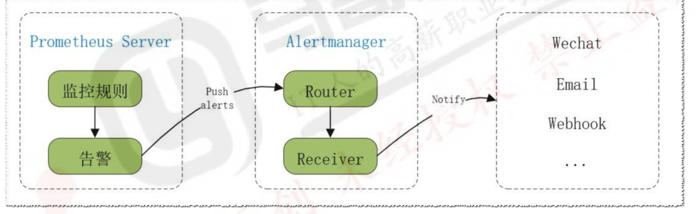

如何实现监控

日志，指标，调用链

监控流程

```powershell
zabbix 监控主机流程
1 zabbix agent 安装
2 修改配置agent，zabbix Server 
3 zabbix Server 添加到agent主机列表
4 关联模板（监控项）


prometheus 监控主机流程
1 安装对应exporter Node exporter http://0.0.0.0:9100/metrics/
2 prometheus配置文件添加exporter 地址信息，job和instances

prometheus 监控服务流程
1 服务暴露URL http://0.0.0.0:xxxx/metrics
2 prometheus配置文件添加相关服务的地址 job,targets
```

监控指标

```powershell
1.延迟：请求平均延迟
2.流量（吞吐量）：QPS,TPS,每秒API调用等
3.错误，4xx,5xx
4.饱和度：cpu，内存，I/O，磁盘
```


# 1.prometheus

```powershell
TSDB
大部分时间都是顺序写入操作，很少涉及修改数据
删除操作都是删除一段时间的数据，而不涉及到删除无规律数据
读操作一般都是升序或者降序
高效的压缩算法，节省存储空间，有效降低 IO,存储成本低
高性能读写

数据保存时间，启动参数加上:
prometheus \
  --config.file=/etc/prometheus/prometheus.yml \
  --storage.tsdb.path=/var/lib/prometheus \
  --storage.tsdb.retention.time=30d \
  --storage.tsdb.retention.size=100GB \
  --web.enable-lifecycle

```

```powershell
监控的指标可以通过下面方式提供：
Prometheus 内置
instrumentation 程序仪表: 应用内置的指标功能,比如: Zookeeper,Gitlab,Grafana等
额外的exporter,使用第三方开发的功能
Pushgateway 提供
通过自行编程实现的功能代码,需要开发能力
```

promethues-serverip:9090

## 1.1配置文件

```powershell
语法检查
promtool check config /usr/local/prometheus/conf/prometheus.yml

curl -X POST http://promethues:9090/-/reload
```

```powershell
prometheus/prometheus.yml

global:
  scrape_interval: 15s       # 默认抓取间隔
  scrape_timeout: 10s        # 每次抓取的超时时间
  evaluation_interval: 15s   # 规则评估间隔

scrape_configs:              # 抓取目标配置
  - job_name: 'node'
    static_configs:
      - targets: ['192.168.1.10:9100', '192.168.1.11:9100']
        labels:                #打标签，主要用来区分不同来源的数据
          env: production
          role: webserver
  - job_name: 'zookeeper'
    static_configs:
      - targets: ['192.168.1.100:7000']
        labels:
          env: production
          app: zookeeper
          
alerting:                    # 告警配置
  alertmanagers:
    - static_configs:
        - targets: ['alertmanager:9093']

rule_files:                  # 规则文件，主要用来记录告警规则
  - "alert.rules.yml"
```

alert.rules.yml

```powershell
groups:
  - name: node_alert
    rules:
      - alert: HighCPUUsage                 可以有很多条alert
        expr: 100 - (avg by(instance)(rate(node_cpu_seconds_total{mode="idle"}[5m])) * 100) > 80
        for: 5m                    0m
        labels:
          severity: warning
        annotations:
          summary: "CPU 使用率过高"
          description: "实例 {{ $labels.instance }} CPU 使用率 > 80%"
```

```powershell
其他常用配置
relabel_configs：标签重写、过滤目标
file_sd_configs：通过文件动态发现 Target
kubernetes_sd_configs：在 Kubernetes 中动态发现 Pod/Service
```

## 1.2grafana

https://grafana.com/grafana/download

https://grafana.com/dashboards/       

```powershell
Node Exporter Full（Dashboard ID: 1860）
直接AI搜最好的dashboard
```

grafana.ini

```powershell
#################################### Server 
[server]
# 协议: http, https, socket
protocol = http
# Grafana 监听地址 (默认 0.0.0.0)
http_addr = 
# Grafana 监听端口，默认是3000
http_port = 3000

#################################### Security 
[security]
# 默认管理员账号和密码（首次启动）
admin_user = admin
admin_password = admin
#################################### Paths 
[paths]
# Grafana 存储路径
data = /var/lib/grafana
logs = /var/log/grafana
plugins = /var/lib/grafana/plugins
provisioning = /etc/grafana/provisioning
```

添加promethues数据源,import模版

## 1.3PromQL

加减乘除取模等运算/聚合/处理等等操作

https://observability.cn/project/prometheus/prometheus-querying-basics/#_top

四种典型的数据类型

```powershell
1. Counter （计数器）
特点：只增不减，重启时可能归零。
典型场景：请求次数、错误次数、任务完成数。

2. Gauge （仪表盘型）
特点：数值可增可减。
典型场景：CPU 使用率、内存占用、温度、并发数。

3. Histogram （直方图）
特点：把观测值（如延迟、请求大小）分到多个区间（bucket），自动生成：
_bucket（分桶数据）
_count（总次数）
_sum（总和）
典型场景：请求延迟分布、响应大小分布。
计算 95 分位延迟（P95）：
histogram_quantile(0.95, rate(http_request_duration_seconds_bucket[5m]))
在一组数据中，95% 的样本值 小于或等于 P95，剩下 5% 超过它。

4. Summary （摘要）
特点：客户端直接计算分位数（quantile），同时也有 _count、_sum。
典型场景：请求延迟、流量统计（但分布是客户端计算的，Prometheus 不能跨实例再聚合）。
```

查询案例

```powershell
node_memory_MemFree_bytes/1024/1024 #将内存进行单位从字节转行为兆
node_disk_read_bytes_total{device="sda"} + node_disk_written_bytes_total{device="sda"} #计算磁盘读写数据量
查询指标的值：
prometheus_http_requests_total
查询指标的某个标签值：
prometheus_http_requests_total{handler="/api/v1/query"}
查询指标的时间范围：
prometheus_http_requests_total[5m]
计算指标的速率：
rate(prometheus_http_requests_total[5m])
计算指标的平均值：
avg(prometheus_http_requests_total)
计算指标的总和：
sum(prometheus_http_requests_total)
计算指标的增量：
delta(prometheus_http_requests_total[5m])
计算指标的标准差：
stddev_over_time(prometheus_http_requests_total[5m])
```

## 1.4metrics获取

```powershell
Prometheus 的监控数据（metrics）主要有几种来源：
1.应用程序直接暴露 /metrics 接口
应用自己集成了 Prometheus SDK（client library），在 HTTP 接口上暴露指标。
curl http://localhost:8080/metrics

2.Exporter 组件
对于没有内置 Prometheus 支持的服务，用 Exporter 来转换。
node_exporter → Linux 主机 CPU、内存、磁盘等
mysqld_exporter → MySQL 指标
blackbox_exporter → TCP/HTTP/ICMP 探测
运行 exporter 后，它们会在端口上暴露 /metrics。

3.Pushgateway
4.服务发现
在 Kubernetes、Consul、EC2 等环境下，Prometheus 可以自动发现 target 并拉取 metrics。

确认应用是否直接暴露 /metrics，或者是否需要 Exporter。
在 prometheus.yml 配置 scrape_configs，让 Prometheus 去拉取。
在 Prometheus Web 界面 (/targets) 确认目标是否正常。
用 PromQL 查询并在 Grafana 可视化。
```


## 1.5定制 Exporter

```powershell
Prometheus对于监控功能的核心要素就是metric的监控项是否正常工作 
Metric 本质就是对应的服务启动后自动生成的一个基于http协议URL地址，通过该地址可以获取想要的 监控项。
```

```powershell
实际生产环境中，想要监控好多指标，但是prometheus 可能并没有提供相应的metric监控项条目，比 如: 某业务指标、转化率等，所以就需要实现自定义的metric条目。
https://github.com/prometheus/client_golang
https://github.com/prometheus/client_python
https://github.com/prometheus/client_java
https://github.com/prometheus/client_rust
```

## 1.6标签管理

```powershell
多维度监控 → 不是单一的“CPU 使用率”，而是按实例 / 节点 / 容器 / 请求方式区分。
灵活查询 → PromQL 可以按标签筛选、聚合、统计。
动态发现 → 在 Kubernetes 这种环境里，Pod 动态创建，Prometheus 通过标签区分和管理。有些标签很乱（比如 K8S Pod 自动发现的标签特别多）
```

```powershell
relabel_configs （标签重写）
用于发现目标后，修改、删除或新增标签。

k8s中
metadata:
  labels:
    app: nginx
    env: prod
    team: frontend

promethues中
relabel_configs:
  - source_labels: [__meta_kubernetes_pod_label_app]  前两单词固定不变
    regex: nginx
    action: keep
```

| action      | 作用                              | 示例                                            |
| ----------- | --------------------------------- | ----------------------------------------------- |
| `keep`      | 只保留符合条件的 target，其他丢弃 | 只采集 `app=nginx` 的 Pod                       |
| `drop`      | 丢弃符合条件的 target             | 忽略 `kube-system` 命名空间                     |
| `replace`   | 替换或生成新的标签                | 把 `__address__` 转换成 `instance`              |
| `labelmap`  | 批量重命名标签                    | 把 `__meta_kubernetes_pod_label_*` 转成正常标签 |
| `labeldrop` | 删除匹配的标签                    | 删除所有临时标签                                |
| `labelkeep` | 只保留匹配的标签                  | 保留某些关键标签                                |

```powershell
source_labels：从哪些标签里取值
regex：正则匹配规则
action：做什么事（keep/drop/replace…）
target_label：要写入/替换的目标标签
replacement：替换后的值（可以用 $1、$2 引用 regex 的捕获组）

relabel_configs:
  - source_labels: [__address__]
    regex: (.*):\d+
    target_label: instance
    replacement: $1

解释：
__address__ 默认是 IP:Port
用正则 (\.*):\d+ 把 IP 抓出来
存到新的标签 instance
结果：192.168.1.10:9100 → instance="192.168.1.10"
```

## 1.7alertmanager

文档https://observability.cn/project/prometheus/alerting-configuration/#_top



```powershell
Alertmanager 是 Prometheus 的告警管理组件，主要负责：
1.接收告警
Prometheus 根据规则（alerting rules）触发告警后，会推送到 Alertmanager。
2.去重
相同的告警不会重复发送，避免被通知“轰炸”。
3.分组
例如一堆 Pod 宕机的告警，可以打包成一条消息发给你。
4.抑制
比如「Service Down」已经触发，就可以抑制下游的「Pod Down」告警，不重复通知。
5.通知路由
将不同的告警发到不同的渠道
```

配置文件

/etc/alertmanager/alertmanager.yml

```powershell
global:
  resolve_timeout: 5m    # 告警恢复后，多久发送"已恢复"通知

route:
  receiver: 'default'    # 默认接收器
  group_by: ['alertname']  # 告警分组规则
  group_wait: 30s        # 等待多久把同类告警分成一组
  group_interval: 5m     # 同组告警之间的最小间隔
  repeat_interval: 3h    # 相同告警重复通知的间隔
  routes:
    - match:
        severity: critical
      receiver: 'team-ops'
    - match:
        severity: warning
      receiver: 'team-dev'

receivers:
  - name: 'default'
    email_configs:
      - to: 'oncall@example.com'
        from: 'alert@example.com'
        smarthost: 'smtp.example.com:587'
        auth_username: 'alert@example.com'
        auth_password: 'password'

  - name: 'team-ops'
    webhook_configs:
      - url: 'http://ops-webhook.local/alert'

  - name: 'team-dev'
    slack_configs:
      - api_url: 'https://hooks.slack.com/services/xxx/yyy/zzz'
        channel: '#dev-alerts'

inhibit_rules:                   #告警抑制
  - source_match:                   #节点级别抑制pod级别
      alertname: 'NodeDown'
      severity: 'critical'
    target_match:
      alertname: 'PodDown'
    equal: ['namespace', 'node']

  - source_match:                       #服务不可用抑制接口失败
      alertname: 'ServiceDown'
    target_match:
      alertname: 'HttpErrorRateHigh'
    equal: ['service']
```

group_by根据以下信息分组，比如

```powershell
alertname="PodRestarting", job="kubelet", namespace="default", pod="nginx-123"
alertname="PodRestarting", job="kubelet", namespace="default", pod="nginx-456"
```

告警抑制

```powershell
对于一种业务场景，有相互依赖的两种服务：A服务和B服务，一旦A服务异常，依赖A服务的B服务也会异常,从而导致本来没有问题的B服务也不断的发出告警。要解决这个问题
```

静默

```powershell
http://<alertmanager-host>:9093
直接在web ui上配置Silences   主要配置静默时间
还可以查看告警信息，日志，但是不能配置其他的东西
```

高可用

```powershell
多实例集群 + gossip 协议
核心思想：每个节点只和少数邻居节点交换信息，然后这些节点继续传播下去 → 形成快速、可靠的信息传播网络。
1.集群内部通信
每个实例通过 --cluster.listen-address 和 --cluster.peer 互相发现
gossip 协议同步告警状态和抑制规则
去重告警，保证同一告警只发一次

2.Prometheus 配置
Prometheus 可以发送告警到单个节点或全部节点
HA 节点同时接收告警，保证任意节点宕机不丢告警
```

```powershell
例如：
节点 A 收到告警 → Gossip 给 B、C
B、C 再把信息传播给其他节点（即使 A 收到也会去重）
最终三节点都看到相同告警，并保持抑制一致
```

```powershell
./alertmanager \
  --config.file=/etc/alertmanager/alertmanager.yml \
  --storage.path=/etc/alertmanager/data \
  --web.listen-address="0.0.0.0:9093" \
  --cluster.listen-address="0.0.0.0:6783" \
  --cluster.peer=node2.example.com:6783 \       #列出集群至少一个，只需要保证所有节点的配置能覆盖所有节点就行
  --cluster.peer=node3.example.com:6783
  
Node2 / Node3 同理，--cluster.peer 列出其他节点
gossip 端口 6783 必须在防火墙中放行
Web 端口 9093 提供 Prometheus 推送告警接口
```

promethues

```powershell
alerting:
  alertmanagers:
    - static_configs:
        - targets:
          - 'node1.example.com:9093'
          - 'node2.example.com:9093'
          - 'node3.example.com:9093'
```

## 1.8pushgateway

https://github.com/prometheus/pushgateway/releases/

```powershell
Prometheus 的数据采集是 pull 模型（Prometheus 定期抓取指标）。但是有些场景下，指标的产生是 短期的、批处理式的，这些指标无法被 Prometheus 定期抓取到，例如：
批处理任务（Batch Job）
短暂存在的服务或容器（生命周期太短，Prometheus 还没来得及抓取）
临时脚本或任务的执行结果

对于这类场景，Pushgateway 提供 push 模型：
应用或任务执行完毕后，将指标主动 push 到 Pushgateway。
Prometheus 定期抓取 Pushgateway 的指标。
Pushgateway 不持久存储指标（默认），主要作为一个中转缓存。
```

最典型的就是shell处理完之后推送给pushgateway

```powershell
scrape_configs:
  - job_name: 'pushgateway'
    static_configs:
      - targets: ['localhost:9091']
```

```powershell
# Shell 示例
echo "job_status 1" | curl --data-binary @- http://localhost:9091/metrics/job/my_batch_job
```

## 1.9联邦

promtheus高可用就装两个一样的就可以了，负载均衡就好了

| 层级                         | 主要职责                                                   | 数据特性                               |
| ---------------------------- | ---------------------------------------------------------- | -------------------------------------- |
| **节点层 / 下游 Prometheus** | 直接抓取主机、容器、服务等原始指标                         | 完整、实时、详细                       |
| **集群层 / 中间 Prometheus** | 聚合节点层指标，做集群级别的汇总、报警和报表               | 精简、部分指标、延迟低                 |
| **全局层 / 顶层 Prometheus** | 汇总集群层指标，做趋势分析、跨集群对比、容量规划、优化建议 | 精简、延迟略高，主要用于分析和战略决策 |

当然还可以有更多层

集群层

```powershell
scrape_configs:
  - job_name: 'federate_nodes'
    metrics_path: /federate
    honor_labels: true
    params:
      match[]:                       #####并集
        - '{job=~".+"}'  # 抓取所有指标
    static_configs:
      - targets:
        - 'prometheus-a:9090'
        - 'prometheus-b:9090'

```

全局层

```powershell
scrape_configs:
  - job_name: 'federate_cluster'
    metrics_path: /federate
    honor_labels: true
    params:
      match[]:                     #####并集
        - '{job=~".+"}'  # 抓取集群层的所有指标
        #####交集，只属于 node_exporter 的 up 指标
        - 'up{job="node_exporter"}' 
    static_configs:
      - targets:
        - 'prometheus-cluster1:9090'

```

如果需要第四层，只需让顶层 Prometheus 再抓取全局层指标即可。

```powershell
下游负责抓取详细数据、实时监控和本地报警，顶层负责全局视角、趋势分析和优化方向，而不是保存所有原始数据。类似于县市省这种概念
只有最下游是最详细的，上一层层层汇总抓重点汇报
```

## 1.10promethues存储系统


本地存储

```powershell
--storage.tsdb.path           #数据存储位置，默认是安装和录下的data子目录。
--storage.tsdb.retention.time #保留时间，默认是15天，过15天之后就删除。该配置会覆盖--
storage.tsdb.retention的值。
--storage.tsdb.retention.size #要保留的块Block的最大字节数
--storage.tsdb.wal-compression #开启预写日志的压缩,默认开启
```

### VictoriaMetrics单机

https://github.com/VictoriaMetrics/VictoriaMetrics

```powershell
Prometheus
负责 采集（scrape）、规则计算（rules、alerts）

VictoriaMetrics
负责 存储历史数据，提供高压缩比 + 长期保存
写入wal日志到内存，两小时保存一次为一个block，block会定期压缩，合并，过期清理，一个chunk最大512MB

Grafana（配置数据源为VictoriaMetrics）
负责 展示数据（PromQL 查询走 VM API）
```


```powershell
./victoria-metrics \
  -storageDataPath=/data/victoria \
  -retentionPeriod=12 \
  -httpListenAddr=:8428
```

prom

```powershell
global:
  scrape_interval: 15s

remote_write:
  - url: "http://<victoria-ip>:8428/api/v1/write"

remote_read:
  - url: "http://<victoria-ip>:8428/api/v1/read"
    read_recent: true   # 是否查询最近的数据，默认 false
```


### VictoriaMetrics集群

https://github.com/VictoriaMetrics/VictoriaMetrics/releases

```powershell
vminsert
接收写入（Prometheus remote_write）
把数据分片写到后端 vmstorage

vmstorage
存储时序数据，真正的数据库
可以有多个，数据通过一致性哈希或分区分布

vmselect
处理查询（Grafana/Prometheus remote_read）
从多个 vmstorage 拉取并聚合结果
```

```powershell
./vmstorage \
  -storageDataPath=/data/vm \
  -retentionPeriod=12 \
  -httpListenAddr=:8482 \
  -vminsertAddr=:8400 \
  -vmselectAddr=:8401
```

```powershell
./vminsert \               
  -storageNode=vmstorage-1:8400 \
  -storageNode=vmstorage-2:8400 \
  -httpListenAddr=:8480
```

```powershell
./vmselect \               #grafana数据源
  -storageNode=vmstorage-1:8401 \
  -storageNode=vmstorage-2:8401 \
  -replicationFactor=2 \   ##副本，默认为1，就是只保留一个数据，没了就没了
  -httpListenAddr=:8481
```

```powershell
remote_write:
  - url: "http://vminsert:8480/insert/0/prometheus"

remote_read:
  - url: "http://vmselect:8481/select/0/prometheus"
    read_recent: true
```

Grafana DataSource 配置

```powershell
# VictoriaMetrics as datasource
url: http://vm.single:8428/select/1/prometheus   # 租户1/团队1、可以改名
```

```powershell
最佳实践：一个 Prometheus = 一个租户（物理隔离，最干净）。
```

## 1.11exporter开发

/metrics

```powershell
四个指标收集器/自定义收集器->注册表（自定义/默认）
用户访问->指标中间件方法开始->逻辑处理->响应->指标中间件方法结束
```

exporter

```powershell
1.从目标应用“拉取（Scrape）” 原始数据
2.将数据转化为格式化的、Prometheus 可读的文本数据->四个指标收集器/自定义收集器->注册表
3.暴露一个新的 /metrics 端点，等待 Prometheus Server 来拉取。
（可选）进行数据过滤、聚合、转换。
```


# 2.zabbix

```powershell
Zabbix 主要由以下组件组成：
1.Zabbix Server（核心调度中心）
接收 Agent、Proxy、SNMP 等数据。
存储到数据库，负责触发器、告警、事件处理。

2.Zabbix Database（数据库层）
通常用 MySQL / PostgreSQL / TimescaleDB。
存储监控指标、配置、事件、历史数据。

3.Zabbix Frontend（Web UI）
PHP + Nginx/Apache。
提供配置、展示、告警规则管理。

4.Zabbix Agent（被监控节点）
安装在服务器上，收集 CPU、内存、磁盘、进程、应用等指标。
支持主动模式（agent 主动上报）和被动模式（server 主动拉取）。

5.Zabbix Proxy（可选）          ##不太可能用的到
分布式代理，适合大规模或跨 IDC 环境。
Proxy 采集数据后暂存，定期同步给 Server。

6.Zabbix Sender / Get / Trapper
辅助采集数据工具，比如脚本推送自定义指标。
```

```powershell
/etc/zabbix/zabbix_server.conf → Server 配置
/etc/zabbix/zabbix_agentd.conf → Agent 配置
/etc/zabbix/zabbix_proxy.conf → Proxy 配置

/var/log/zabbix/zabbix_server.log
/var/log/zabbix/zabbix_agentd.log
/var/log/zabbix/zabbix_proxy.log
```

zabbix_server.conf

```powershell
# 数据库配置
DBHost=localhost
DBName=zabbix
DBUser=zabbix
DBPassword=your_password

# 日志配置
LogFile=/var/log/zabbix/zabbix_server.log
LogFileSize=10

# 缓存
CacheSize=256M
HistoryCacheSize=128M
TrendCacheSize=128M

# 并发处理
StartPollers=50
StartTrappers=10
StartDiscoverers=10

# SNMP trap 支持
SNMPTrapperFile=/var/log/snmptrap/snmptrap.log
StartSNMPTrapper=1
```

zabbix_agentd.conf

```powershell
# Server 允许访问的 IP（被动模式）
Server=192.168.1.100

# 主动模式（Agent 主动上报 Server）     一般用主动
ServerActive=192.168.1.100:10051

# 被监控主机名（与 Zabbix Web UI 配置一致）
Hostname=webserver-01

# 日志
LogFile=/var/log/zabbix/zabbix_agentd.log
EnableRemoteCommands=1
```

