[TOC]

# 运维工具

## 1.企业级VPN服务OpenVPN

### 1.1VPN基础知识

**VPN: (Virtual Private Network) 虚拟专用网络**

VPN 是虚拟专用网络，是专用网络的一种延伸，属于远程访问技术的一种。

VPN 可以在公用网络的基础上建立专用网络，但其并不是物理意义上的专线，而是在公共的互联网的基础上虚拟出一个专用网络，所以被称为虚拟专用网络。

VPN 技术在现在的网络环境中有着广泛的使用。VPN网关通过对数据包的加密和数据包目标地址的转换实现远程访问。VPN可通过服务器、硬件、软件等多种方式实现。

例如在企业中，员工出差到外地，所使用的终端不处于企业内网中，又需要访问企业内网，就可以使用VPN 技术来实现。

网络上所谓的 "翻墙软件"，其实也是使用 VPN 相关的技术，绕过相关的IP限制，内容过滤，域名劫持等，实现对网络内容的访问。

VPN 是一种网络通信技术，并不同等于翻墙软件。

#### 1.1.1VPN常见应用模式

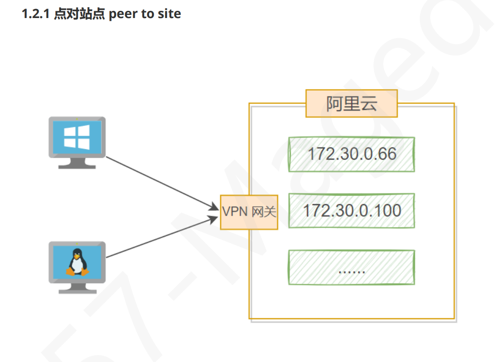

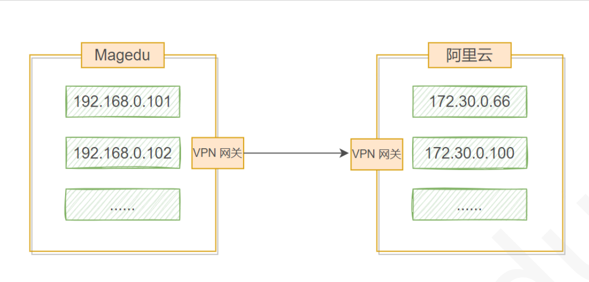

### 1.2OpenVPN介绍

OpenVPN 是 Linux下开源的 VPN 应用，它提供了良好的性能和友好的用户 GUI

OpenVPN 是一个基于 OpenSSL 库的应用层 VPN 实现。和传统 VPN 相比，它的优点是简单易用。

https://openvpn.net/

https://github.com/OpenVPN/openvpn


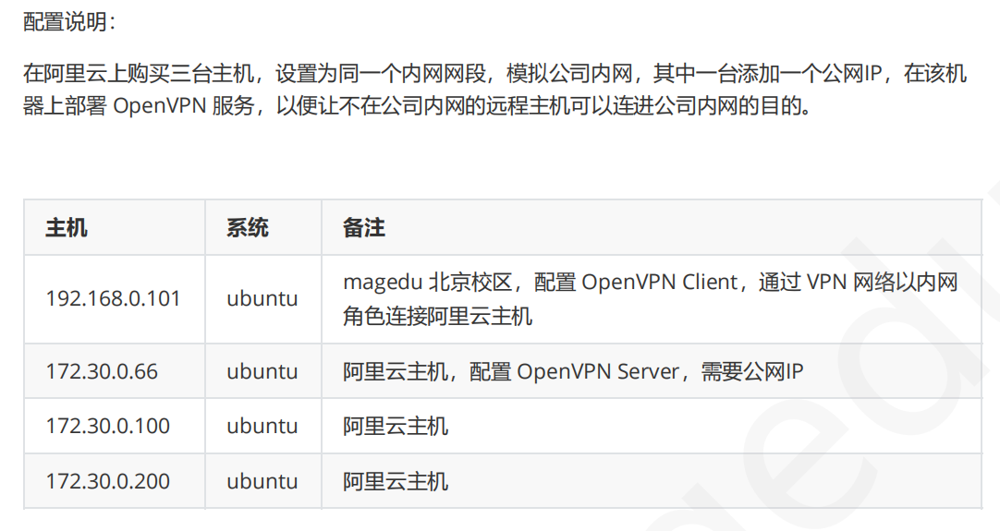

安装部署过程省略，自己跟着操作

## 2.Ansible

### 2.1自动化运维应用场景

#### 2.1.1云计算运维工程师核心职能

运维工程师的基本职责就是保障系统和服务的稳定性，稳定压倒一切，确保服务一年365天，每天24小时不间断的为用户提供服务，

在此基础上运维工程师的工作内容还有很多：

**提升效率**：使用自动化的平台或工具，来提升项目在研发生命周期内的效率。

**控制成本**：通过技术手段对服务架构进行优化，或采用新的产品或技术，来达到降低成本，提升效益的作用。

**发布管理**：构建自动化运维平台，来确保每次发版都安全可控。

**变更管理**：通过技术手段，对每次变更做要记录在案，有迹可循。

**备份恢复**：对重要数据采用定时备份机制，以便能在发生问题时能及时恢复数据。

**灾难演练**：定期对预定义方案进行演练，确保是可行的。

**系统分析**：通过采集并分析各类日志，定位并分析出系统可能存在的风险点，及时修正，以及做好预案。

**技术选型**：根据当前服务的业务情况，选用不同的产品和架构，以达到业务与经济的平衡。

**从项目的生命周期来讲，运维工程师的工作主要包括四个阶段：**

项目首次上线：平台架构组建，基础环境和服务部署

日常运行维护：负责保障项目的稳定运行，版本迭代升级等

性能效率优化：当项目发展到一定阶段后，需要一些新的技术或方案来实现性能提升，成本优化等

项目下线：备份数据，释放资源

**运维的未来是什么？**

**一切皆自动化**

运维的未来是，让研发人员能够借助工具、自动化和流程，并且让他们能够在运维干预极少的情况下部署和运营服务，从而实现自助服务。每个角色都应该努力使工作实现自动化。----------《运维的未来》

#### 2.1.2企业实际应用场景分析


#### 2.1.3**常用的自动化运维工具**

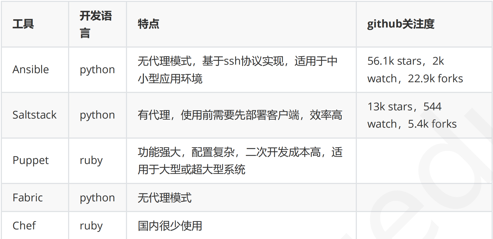

### 2.2Ansible基础

Ansible 是一个自动化运维工具，基于Python开发，集合了众多运维工具（puppet、cfengine、chef、func、fabric）的优点，实现了批量系统配置、批量程序部署、批量运行命令等功能。

https://www.ansible.com/

https://github.com/ansible/ansible

**Ansible** **的主要功能**

批量执行远程命令，可以对远程的多台主机同时进行命令的执行

批量安装和配置软件服务，可以对远程的多台主机进行自动化的方式配置和管理各种服务

编排高级的企业级复杂的IT架构任务，Ansible 的 Playbook 和 role 可以轻松实现大型的IT复杂架构

提供自动化运维工具的开发 API， 有很多运维工具，如 jumpserver 就是基于 ansible 实现自动化管理功能

**Ansible** **的不足**

在管理的主机数量较多时，性能略差，执行效率不如 saltstack 高

不支持事务回滚

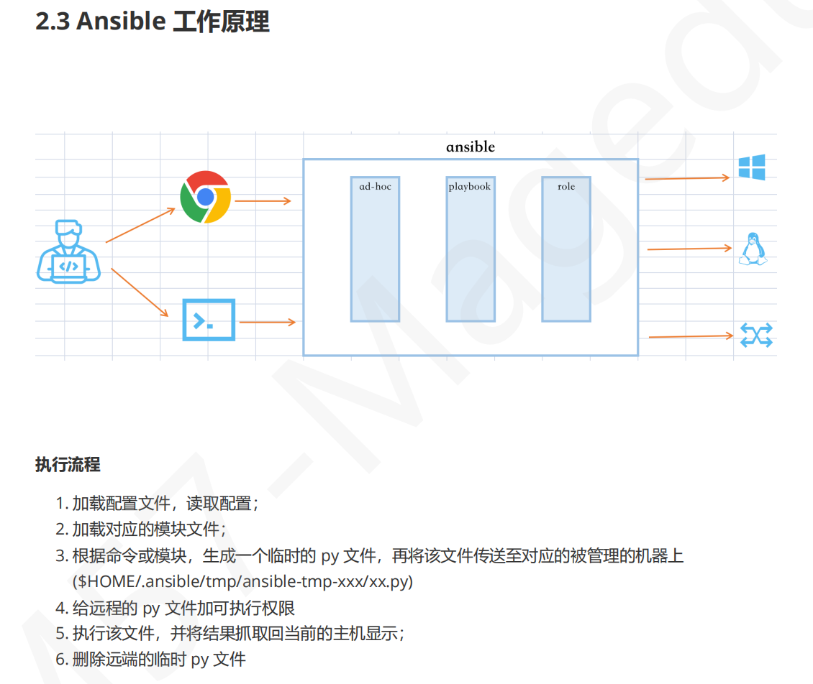

#### 使用注意事项

执行ansible的主机一般称为管理端, 主控端，中控，master 或堡垒机

主控端Python版本需要2.6或以上

被控端Python版本小于2.4，需要安装python-simplejson

被控端如开启SELinux需要安装libselinux-python

windows 不能做为主控端，只能做为被控制端

### 2.3Ansible 安装和基本使用

https://docs.ansible.com/ansible/latest/installation_guide/index.html

#### 2.3.1Ansible 安装

```bash
#需要先安装 epel 源
[root@rocky ~]# yum install -y epel-release
[root@rocky ~]# yum install -y ansible
#rocky9
[root@rocky ~]# rpm -q ansible
ansible-7.2.0-1.el9.noarch
[root@rocky ~]# ansible --version
ansible [core 2.14.2]


[root@ubuntu ~]# pip3.10 install -i https://pypi.tuna.tsinghua.edu.cn/simple ansible
[root@ubuntu ~]# ansible --version
ansible [core 2.15.0]


[root@ubuntu ~]# apt update;apt install -y ansible
[root@ubuntu ~]# dpkg -l ansible

#在 Ubuntu 中安装 ansible-core
[root@ubuntu ~]# apt update;apt install ansible-core
[root@ubuntu ~]# dpkg -V ansible
[root@ubuntu ~]# dpkg -V ansible-core
[root@ubuntu ~]# dpkg -l ansible-core
[root@ubuntu ~]# ansible --version
ansible [core 2.12.0]
```

**ansible** **和** **ansible-core**

ansible-core 包中仅包含核心功能和核心模块，ansible 包中除了核心功能之外还包含大量外围功能模块。

```bash
[root@ubuntu ~]# dpkg -L ansible-core | wc -l
1064
[root@ubuntu2204 ~]# dpkg -L ansible | wc -l
34739
```

#### 2.3.2Ansible 配置文件

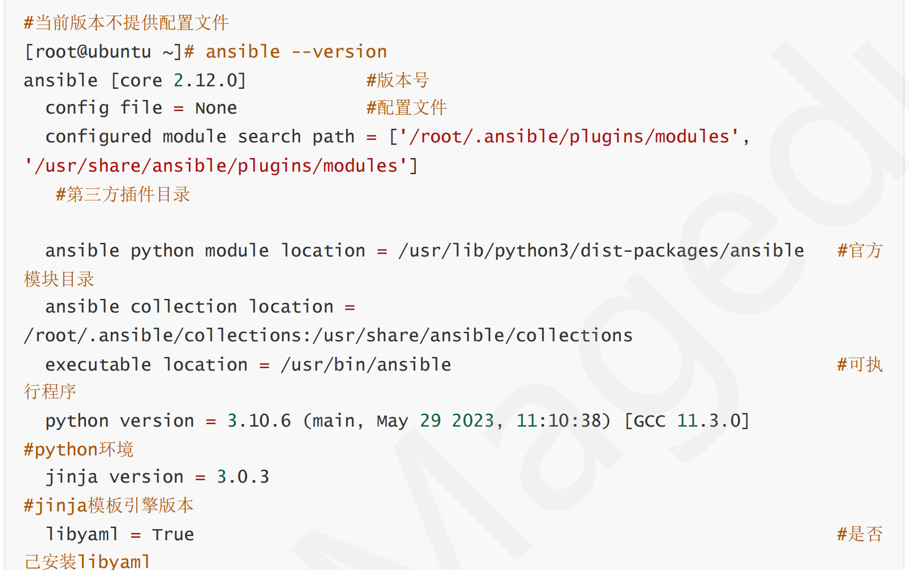


##### 2.3.2.1主配置文件

```bash
ANSIBLE_CONFIG #环境变量，此变量中指向的文件必须存在才生效，指向的文件要以.cfg 结尾
./ansible.cfg #当前目录下的ansible.cfg,一般一个项目对应一个专用配置文件,推荐使用
~/.ansible.cfg #当前用户家目录下的.ansible.cfg
/etc/ansible/ansible.cfg #ansible默认配置文件，主配置文件
```

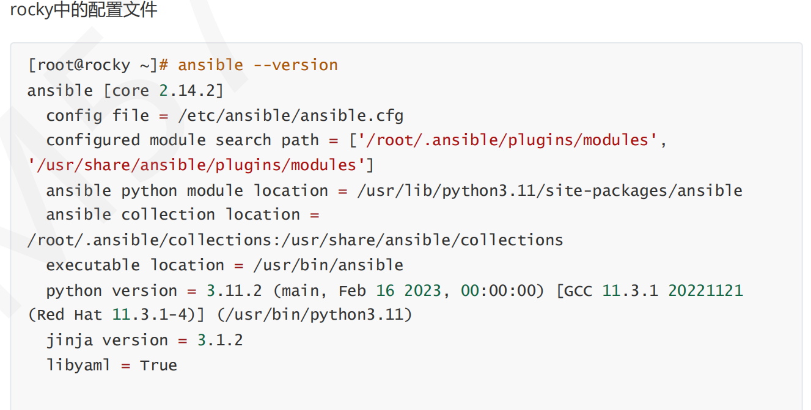

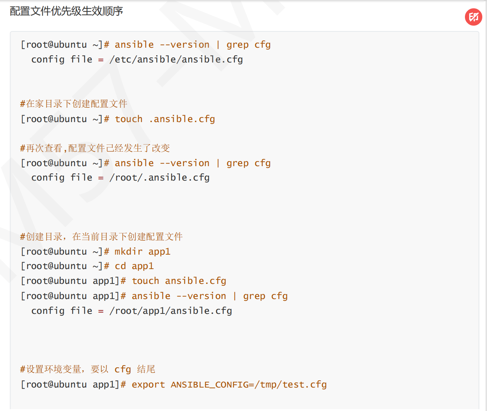

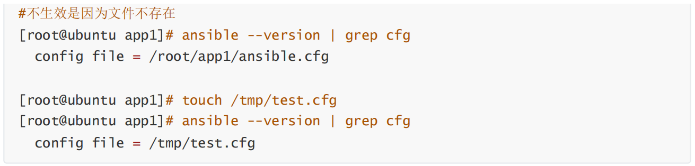

主配置文件中又间接定义了其它的配置项，在使用时，可以为不同的项目建立不同的配置文件放到不同的目录中，再去到该目录下执行 ansible，或者用变量指定不同的配置文件用来区分不同的项目配置，对于不同用户的配置，可以写在相应的家目录中。

```bash
[root@ubuntu ~]# cat /etc/ansible/ansible.cfg
[defaults]
inventory      = /etc/ansible/hosts #远程主机清单
remote_tmp     = ~/.ansible/tmp #远程主机临时文件目录
local_tmp      = ~/.ansible/tmp #本地主机临时文件目录
keep_remote_files=False #是否保留远程主机上的py脚本文件，默认不保留
executable=/bin/sh #生成shell命令时用指定的bash执行
forks          = 5 #并发数
ask_pass       = False #连接远程主机时，询问是否需要输入密码，默认不询问,走ssh key校验
host_key_checking = True #是否需要每次询问要不要添加HostKey，默认是true，每次询问
log_path = #日志文件地址,为空表示禁用日志
module_name = command #默认模块
gathering = smart|implicit|explicit #smart表示如果有缓存则使用缓存， implicit每次收集，explicit不收集，除非指定
fact_caching_timeout = 86400 #远程主机信息缓存时长，默认 86400
fact_caching = memeory|jsonfile|redis #默认缓存到内存，可以写文件和redis
fact_caching_connection = /path/to/cachedir #如果写json 文件，此处写保存路径，如果是redis此处写redis连接地址
interpreter_python=auto #指定远程主机python版本和路径


#连接持久化配置
[persistent_connection]
ansible_connection_path= #
command_timeout=30 #
connect_retry_timeout=15 #超时重试时长
connect_timeout=30 #连接
control_path_dir=~/.ansible/pc #socket 文件保存目录

#普通用户提权配置
[privilege_escalation] 
agnostic_become_prompt=True
become_allow_same_user=False
become=False
become_ask_pass=False #sudo 时是否提示输入密码
become_exe=
become_flags=
become_method=sudo #以 sudo 方式提权
become_user=root #默认 sudo 到 root
```

##### 2.3.2.2主机清单配置文件

注意：

生产建议在每个项目目录下创建项目独立的hosts文件

通过项目目录下的ansible.cfg文件中的 inventory = ./hosts 实现

```bash
192.168.168.[101:108]
192.168.168.1[01:10]
192.168.2[21:31].1[68:70]   
node[1:10].m5[0:9]-magedu.com
node.[a:d]-magedu.com
```

```bash
[group1]
192.168.168.[1:6]
[group2]
192.168.16[1:5].10
group2.m5[2:4]-magedu.com
#继承写法 group3 继承自 group1 和 group2
[group3:children]
group1
group2
#多重继承写法 group4 继承自group3， group3 继承自 group1 和 group2
[group4:children]
group3
```

```bash
10.0.0.5 ansible_connection=ssh ansible_ssh_port=222 ansible_ssh_user=jose 
ansible_ssh_password=123456
10.0.0.6 ansible_ssh_user=root ansible_ssh_password=123456
10.0.0.7:22 #指定ip 和端口
#在分组中定义别名
[group1]
node1 ansible_ssh_host=10.0.0.101
node2 ansible_ssh_host=10.0.0.102
[goup1:vars]
ansible_ssh_password=123456
```

```bash
ansible_ssh_host=IP|hostname #指定远程主机，可用IP或主机名
ansible_ssh_port=PORT #指定SSH端口
ansible_ssh_user=UNAME #指定SSH用户名
ansible_ssh_pass=PWD #显式指定SSH密码
ansible_sudo_pass=PWD #显式指定SUDO密码
ansible_sudo_exe=/PATH/CMD #sudo 命令路径(适用于1.8及以上版本)
ansible_connection=local|ssh|paramiko|docker #与主机的连接类型
ansible_ssh_private_key_file=/PATH/FILE #SSH私钥文件
ansible_shell_type=sh|csh|fish #目标系统的shell类型.默认 sh
ansible_python_interpreter=/PATH/PYTHON #目标主机的python路径用于系统中有多个Python版本，或默认/usr/bin/python不存在
```

#### 2.3.3ansible-console 命令用法

```bash
ansible-console
#常用子命令
help|? #列出所子命令
cd #切换主机组
copy #
exit #退出
forks #设置并发执行数量
list #列出被管理的所有主机
ping #执行ping模块
```

```bash
[root@ubuntu ~]# ansible-console
Welcome to the ansible console. Type help or ? to list commands.
#执行用户@当前操作的主机组 (当前组主机数量)[f:并发数]$
root@all (0)[f:5]$

#修改并发数，此处是临时修改，永久生效要修改配置文件
root@group2 (5)[f:5]$ forks 10

#对当前组的主机执行 ping 命令
root@group2 (5)[f:10]$ ping
```

#### 2.3.4ansible 命令用法

ansible 工具一般用来执行单条命令，使用频率较高

```bash
#查看所有主机列表
[root@ubuntu ~]# ansible all --list-hosts

#查看指定组主机列表    
[root@ubuntu ~]# ansible group1 --list-hosts
```

自动添加主机到信任列表

```bash
[root@ubuntu ~]# ansible 10.0.0.206 -m ping -k

#安装软件
[root@ubuntu ~]# apt install sshpass
#再次测试
[root@ubuntu ~]# ansible 10.0.0.206 -m ping -k

#修改配置文件，自动添加目标主机到信任主机列表
[root@ubuntu ~]# vim /etc/ansible/ansible.cfg
host_key_checking=False

[root@ubuntu ~]# ansible 10.0.0.206 -m ping -k
```

```bash
[root@ubuntu ~]# ansible group3 -m command -a "id"
10.0.0.150 | CHANGED | rc=0 >>
uid=1012(tom) gid=1012(tom) groups=1012(tom)
10.0.0.206 | CHANGED | rc=0 >>
uid=1001(tom) gid=1001(tom) groups=1001(tom)
```

#### 2.3.5Ansible常用模块

ansible  主机 -m 模块 -a ""

##### 2.3.5.1command 模块

此模块为 ansible 默认模块，可以省略 -m 选项，该模块用来在远程主机上执行 shell 命令

```bash
[root@ubuntu ~]# ansible 10.0.0.206 -m command -a "hostname" -k
```

##### 2.3.5.2shell 模块

此模块用法和 command 模块类似，都是用来执行 shell 命令，但功能比 command 模块强大，对于在command 模块中不支持的功能，此处均可使用。此模块也不具有幂等性。

幂等性（idempotence）指的是一个 playbook 或 task 可以安全地多次执行，而不会导致不同的结果或产生副作用。换句话说，无论你对某个任务执行多少次，其结果应该是一致的，并且只会应用必要的更改来达到期望的状态。

在调用shell模块执行命令时，复杂的命令也有可能会执行失败，类似于包含多重管道，正则表达式这些，这种情况下，我们需要写成 shell 脚本，用 copy 模块直接推送到远程执行。

还原 Ansible 工作原理

```bash
#ansible 主机
[root@ubuntu ~]# tree .ansible

#远程主机
[root@ubuntu ~]# tree .ansible/

#或者可以开启配置文件的中配置项，保留远程主机上的脚本，也可以观察
keep_remote_files=True
```

##### 2.3.5.3script 模块

script 模块可以在远程主机上运行 ansible 机器上的脚本(而且脚本文件可以没有执行权限)，这里的脚本并不仅仅只是 shell脚本，只要远程主机上能执行的，都可以，包括但不限于 php, sh, py 等。

此模块不具有幂等性。

```bash
[root@ubuntu ~]# ansible "10.0.0.150" -m script -a "./test.py" -k
#查看脚本文件内容
[root@rocky ~]# cat .ansible/tmp/ansible-tmp-1686979905.168881-3117-38009294106067/test.py
```

##### 2.3.5.4copy 模块

copy 模块将 ansible 主机上的文件复制到远程主机，此模块具有幂等性。

```bash
[root@ubuntu ~]# echo "this is test file" > test.txt
[root@ubuntu ~]# ll test.txt

#将 ansible 主机上的文件 copy 到远程主机
[root@ubuntu ~]# ansible 10.0.0.206 -m copy -a "src=/root/test.txt dest=/tmp/test.txt.bak"
```

##### 2.3.5.5get_url 模块

该模块可以将网络上的资源下载到指定主机，支持 http，https，ftp 协议

```bash
[root@ubuntu ~]# ansible 10.0.0.206 -m get_url -a 'url=http://www.jose-404.com/aini.jpg dest=/tmp/a.jpg
```

##### 2.3.5.6fetch 模块

从远程主机提取文件至 ansible 的主控端，copy 相反，不支持目录

##### 2.3.5.7file 模块

file 模块主要提供文件管理功能，比如创建文件和目录，修改文件和目录，设置文件权限和属性，设置链接等

```bash
#查看帮助
[root@ubuntu ~]# ansible-doc -s file
#常用选项
path=/path/file #目标文件路径
owner=USER #属主
group=GROUP #属组
mode=777 #权限
state=file|touch|directory|link|hard|absent #具体操作，如果是 link，源用 src指定
recurse=yes|no #yes表示递归操作，仅在 state=directory 时生效
```

```bash
#递归创建目录
[root@ubuntu ~]# ansible 10.0.0.206 -m file -a "path=/ansible/test state=directory "

#递归设置属性
[root@ubuntu ~]# ansible 10.0.0.206 -m file -a "path=/ansible/dir2/dir3 state=directory owner=tom group=mage recurse=yes"

#创建文件
[root@ubuntu ~]# ansible 10.0.0.206 -m file -a "path=/ansible/test/test.txt state=touch owner=tom group=root mode=777 "

#获取文件状态
[root@ubuntu ~]# ansible 10.0.0.206 -m file -a "path=/ansible/test/test.txt state=file "

#链接文件可以用dest|name 来指定
[root@ubuntu ~]# ansible 10.0.0.206 -m file -a "src=/ansible/test/test.txt dest=/ansible/test/test.link state=link owner=tom group=tom"

#删除文件
[root@ubuntu ~]# ansible 10.0.0.206 -m file -a "path=/ansible/test/test.link state=absent"
```

##### 2.3.5.8stat 模块

stat 模块用来获取目标文件的状态，对于 windows 主机，要使用 win_stat 模块

```bash
[root@ubuntu ~]# ansible 10.0.0.206 -m stat -a "path=/etc/issue"
```

##### 2.3.5.9unarchive 模块

unarchive 模块主要用来解压缩或解包，将 ansible 主机或其它主机上的压缩包复制到指定主机，再解压到某个目录

在使用此模块时，要保证远程主机能解压对应的压缩包

```bash
[root@ubuntu ~]# ansible 10.0.0.206 -m unarchive -a "src=/root/dira.tar.gz dest=/tmp owner=tom"

[root@ubuntu ~]# ansible 10.0.0.206 -m unarchive -a "src=http://www.jose-404.com/web-dir.tar dest=/tmp remote_src=yes mode=777"
```

##### 2.3.5.10archive 模块

archive 模块在远程主机上执行压缩打包命令，此模块的源和目标都在远程主机上

```bash
#有一台主机上没有要打包的目录
[root@ubuntu ~]# ansible "10.0.0.150 10.0.0.206" -m archive -a "path=/root/dira/ dest=/tmp/dira.bz2 format=bz2 mode=600"
```

##### 2.3.5.11hostname 模块

此模块主要用于修改远程主机的主机名，修改后永久生效

```bash
[root@ubuntu ~]# ansible 10.0.0.206 -m hostname -a "name=test-name"
```

##### 2.3.5.12cron 模块

cron 模块用于管理远程主机上的 crontab 定时任务

```bash
#查看帮助
[root@ubuntu ~]# ansible-doc -s cron
#常用选项
name=str #任务名称
job=/path/cmd args #具体任务命令
disabled=yes|no #是否禁用，默认 false
state=absent|present #absent 删除,默认present 
env=yes|no #yes设置环境变量，no 设置定时任务，默认 no
special_time=annually|daily|hourly|monthly|reboot|weekly|yearly #指定特殊时间
user=UNAME #指定任务用户
minute= #指定分钟参数
hour= #小时参数
day= #自然天参数
month= #自然月参数
weekday= #星期参数
```

```bash
#指定时间
[root@ubuntu ~]# ansible 10.0.0.206 -m cron -a 'job="/usr/bin/wall test-crontab2" minute=*/5 hour=12 day=10,20,30 month=3,4,5 weekday=1-5 name=test-crontab2'
[root@ubuntu ~]# crontab -l

#禁用
[root@ubuntu ~]# ansible 10.0.0.206 -m cron -a 'job="/usr/bin/wall test-crontab-new-msg" name=test-crontab disabled=yes'
```

##### 2.3.5.13yum 模块和 apt 模块

yum 模块和 apt 模块用于在远程主机上管理软件包，yum 模块适用于 redhat 系列，apt 适用于 debian 系列

```bash
#查看帮助
[root@ubuntu ~]# ansible-doc -s yum
#常用选项
name=packagename #指定包名 name1,name2
state=absent|installed|latest|present|removed #absent|removed 删除,installed|present 安装,latest 升级到最新版
list=packagename|installed|updates|available|repos #此选项与name选项互斥，#写具体包名是相当于执行 yum list --showduplicates packagename
download_dir=/path #指定下载目录
download_only=yes|no #只下载不安装，默认 no
update_only=yes|no #yes 仅更新,默认no
use_backend=auto|yum|yum4|dnf #指定真实执行的命令,默认 auto
autoremove=yes|no #卸载依赖，仅在卸载时生效，默认no
disablerepo=repoid #排除某些仓库 repoid1,repoid2
enablerepo=repoid #从指定仓库中安装 repoid1,repoid2
validate_certs=yes|no #是否对包进行校验，默认yes
disable_gpg_check=yes|no #是否不对包进行校验，默认no
update_only=yes|no #只更新不安装,默认no
```

```bash
#列出指定软件包，相当于 yum list --showduplicates nginx
[root@ubuntu ~]# ansible 10.0.0.150 -m yum -a 'list=nginx'

#卸载
[root@ubuntu ~]# ansible 10.0.0.150 -m yum -a 'name=sos state=removed'

#从指定源安装
[root@ubuntu ~]# ansible 10.0.0.150 -m yum -a 'name=sos enablerepo=baseos'
```

**apt** **模块**

```bash
#查看帮助
[root@ubuntu ~]# ansible-doc -s apt
#常用选项
name=packagename #指定包名，可用通配符
autoclean=yes|no #清除本地安装包，只删除己卸载的软件的 deb包
deb=/path/file.deb #指定deb包，可以是本地的，也可以是网络的
autoremove=yes|no #卸载依赖包,默认no
only_upgrade=yes|no #仅更新，不安装
state=absent|build-dep|latest|present|fixed #absent 卸载，build-dep 安装依赖包, latest 安装或升级到最新版
#present 安装，fixed 修复
update_cache=yes|no #更新索引
```

##### 2.3.5.14yum_repository 模块

```bash
#查看帮助
[root@ubuntu ~]# ansible-doc -s yum_repository
#常用选项
name=repoid #repoid
description=desc #描述信息
baseurl=url #仓库地址
enabled=yes|no #是否启用
gpgcheck=yes|no #是否启用gpgcheck，没有默认值，默认跟随 /etc/yum.conf 中的全局配置
gpgkey=/path/key #gpgkey路径
state=absent|present #absent删除， present安装，默认present
timeout=30 #超时时长，默认30s
```

```bash
#添加yum 源
[root@ubuntu ~]# ansible 10.0.0.150 -m yum_repository -a 'name=nginx description=nginx-desc baseurl="http://nginx.org/packages/centos/$releasever/$basearch/" gpgcheck=1 enabled=1 gpgkey=https://nginx.org/keys/nginx_signing.key'
```

##### 2.3.5.15service 模块

```bash
#启动服务
[root@ubuntu ~]# ansible 10.0.0.206 -m service -a "name=nginx state=started enabled=yes"

#重载
[root@ubuntu ~]# ansible 10.0.0.206 -m service -a 'name=nginx state=reloaded'
```

##### 2.3.5.16user 模块

```bash
#查看帮助
[root@ubuntu ~]# ansible-doc -s user
#常用选项
name=USERNAME #指定用户名
comment=str #用户描述信息
create_home=yes|no #是否创建家目录,默认yes
group=GROUPNAME #指定私有组
groups=group1,group2... #指定附加组
home=/path #指定家目录路径
shell=SHELL #指定shell
password=str #设置密码，必须是加密后的字符串
state=absent|present #absent 删除用户,present 创建用户，默认 present 
system=yes|no #是否创建系统账号，默认 no
uid=UID #手动指定uid
umask=UMASK #指定umask
remove=yes|no #是否删除家目录,默认 no
generate_ssh_key=yes|no #是否创建私钥，默认 no
ssh_key_bits=2048 #指定私钥位数
ssh_key_file=/path/file #指定文件位置,默认 .ssh/id_rsa
```

##### 2.3.5.17group 模块

```bash
#查看帮助
[root@ubuntu ~]# ansible-doc -s group
#常用选项
name=GROUPNAME #指定组名
gid=GID #指定组ID
state=absent|present #absent 删除，present 创建，默认present
system=yes|no #是否是系统组，默认no
```

##### 2.3.5.18lineinfile 模块

lineinfile 模块主要用于修改远程主机上的文件。

ansible 提供了两个常用的文件修改模块，其中 lineinfile 主要对文件单行进行替换修改，replace 模块主要进行多行替换和修改。

如果使用 ansible 调用 sed 进行文件修改时，经常会遇到需要转义的情况，而且在对特殊符号进行替换时，有可能会失败。

```bash
#查看帮助
[root@ubuntu ~]# ansible-doc -s lineinfile
#常用选项
path=/path/file #远程主机文件路径
regexp= #正则，用来锚定要被修改的内容
insertafter= #正则，在指定内容后的新行中增加line里面的内容,与regex同时使用时，只有regex没匹配才生效
insertbefore= #正则，在指定内容前的新行中增加line里面的内容,与regex同时使用时，只有regex没匹配才生效
line=str #修改后的内容
state=absent|present #absent 删除，present 不存在先创建
backup=yes|no #修改前先备份，默认no
create=yes|no #不存在先创建，默认no
backrefs=yes|no #是否支持引用，默认no不支持
mode=666 #设置权限
owner=USER #指定属主
group=GROUP #指定属组
```

##### 2.3.5.19replace 模块

该模块功能与 lineinfile 模块功能类似，也是基于正则匹配的模式来修改文件，但与 lineinfile 不同的是replace 模块用于多行匹配和修改

```bash
#查看帮助
[root@ubuntu ~]# ansible-doc -s replace
#常用选项
path=/path/file #远程主机文件路径
regexp= #正则，用来锚定要被修改的内容
replace=STR #用来替换的内容
after=STR #从STR之后开始处理
before=STR #处理到STR之前
backup=yes|no #修改前是否备份，默认 no
mode=666 #设置权限
owner=USER #指定属主
group=GROUP #指定属组
```

##### 2.3.5.20selinux 模块

selinux 模块用作对远程主机的 selinux 机制进行管理

```bash
#查看帮助
[root@ubuntu ~]# ansible-doc -s selinux
#安装
[root@ubuntu ~]# ansible-galaxy collection install ansible.posix --no-cache
#常用选项
configfile=/path/file #selinux 配置文件路径，默认
/etc/selinux/config
policy=targeted|minimum|mls #在state值不为 disabled 时必选
state=disabled|enforcing|permissive #具体设置
```


##### 2.3.5.21reboot 模块

reboot 模块主要用于对远程主机进行重启操作

```bash
#查看帮助
[root@ubuntu ~]# ansible-doc -s reboot
#常用选项
msg=str #广播重启提示消息，默认为空
test_command=str #重启后执行验证命令，默认 whoami
reboot_timeout=600 #超时时长，默认600S
pre_reboot_delay=0 #执行重启前等待时长,如果小于60S，此字段会被置0，也就是无效
post_reboot_delay=0 #重启后等待一个时长后再验证是否重启完成
```

##### 2.3.5.22mount 模块

mount 模块用于管理远程主机的挂载

```bash
#查看帮助
[root@ubuntu ~]# ansible-doc -s mount
#常用选项
src=/path/device #要挂载的设备路径，可以是网络地址
path=/path/point #挂载点
state=absent|mounted|present|unmounted|remounted  # absent 取消挂载,并删除永久挂载中的配置
  # mounted 永久挂载,立即生效，挂载点不存在会自动创建
  # present 永久挂载，写配置文件，但不会立即生效
  # unmounted 临时取消挂载，不改变配置文件
  # remounted 重新挂载，但不会改变配置文件
fstab=/path/file #指定挂载配置文件路径，默认 /etc/fstab
fstype=str #设备文件系统 xfs|ext4|swap|iso9660...
opts=str #挂载选项
```

##### 2.3.5.23setup 模块

此模块主要用来从远程主机上收集相关信息在 ansible 主机上显示，由于需要收集的信息较多，此模块执行较慢。

```bash
#查看帮助
[root@ubuntu ~]# ansible-doc -s setup
#常用选项
filter=filed1,filed2 #只显示指定字段，可以用通配符，可以写多个，可以用 !取反
gather_timeout=10 #超时时长，默认10S
```

##### 2.3.5.24debug 模块

此模块可以用于输出信息，并且通过 msg 定制输出的信息内容，功能类似于 echo 命令

##### 2.3.5.25sysctl 模块

sysctl 模块用来修改远程主机上的内核参数

```bash
#查看帮助
[root@ubuntu ~]# ansible-doc -s sysctl
#常用选项
name=str #参数名称
val=str #参数值
reload=yes|no #默认yes，调用 /sbin/sysctl -p 生效
state=present|absent #是否保存到文件，默认present
sysctl_file=/path/file #指定保存文件路径，默认 /etc/sysctl.conf
sysctl_set=yes|no #是否使用systctl -w 校验，默认no
```

##### 2.3.5.26pam_limits 模块

此模块主要用于管理远程主机上的资源限制

##### 2.3.5.27apt_repository 模块

此模块实现 apt 仓库的配置管理，仅于用 debian 系列的环境中

```bash
#查看帮助
[root@ubuntu ~]# ansible-doc -s apt_repository
#常用选项
repo=str #具体源
filename=/path/file #具体文件名，默认加到 /etc/apt/sources.list 中
state=absent|present #absent 删除,present 新增，默认 present
update_cache=yes|no #yes 更新源，相当于执行 apt-get update
```

##### 2.3.5.28apt_key 模块

此模块实现 apt 仓库的key 的配置管理，仅于用 debian 系列的环境中

### 2.4Ansible 中的 Playbook

#### 2.4.1playbook 文件规范

扩展名为 yaml 或 yml

```bash
#一个样例 ping.yaml
- hosts: 10.0.0.206
 remote_user: root
 tasks:
   - name: test-playbook-task-1
     ping:
```

**YAML 语言基础和特性**

YAML: YAML Ain't Markup Languag，YAML不是一种标记性语言，实际上在开发这种语言的时候，YAML 的意思其实是：Yet Another Markup Language (YAML仍然是一种标记性语言)。

YAML 是一个可读性高的用来表达资料序列的格式。是目前较流行的配置文件格式，很多新的项目或者软件都采用 yaml 文件来保存配置信息，例如 ubuntu，ansible，doker，kubernets 等

https://yaml.org/

**YAML** **语言特点**

YAML的可读性好

YAML和脚本语言的交互性好

YAML使用实现语言的数据类型

YAML有一个一致的信息模型

YAML易于实现

YAML可以基于流来处理

YAML表达能力强，扩展性好

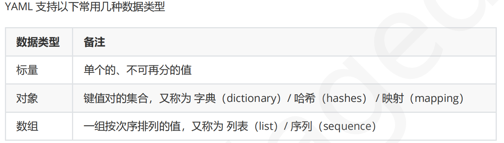

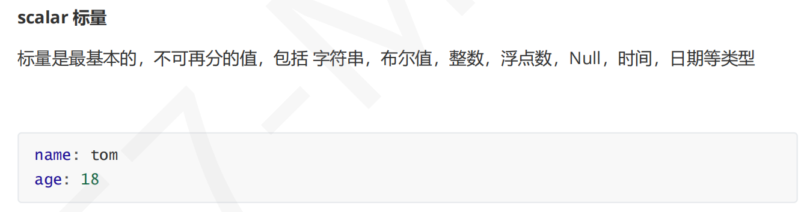

**字典**

```bash
#单行写法
cat: { name: tom, age: 18 }

cat:
 name: tom
 age: 18
```

**List** **列表**

```bash
magedu: [linux,golang,python]
magedu:
  - linux
  - golang
  - python
```

**多种数据结构综合使用**

```bash
name: linux-magedu
student: 40
teacher: 3
date: [1,3,5]
student_list: [ { name: tom, age: 16, gender: M }, { name: jerry, age: 18,
gender: F }]
teacher_list: 
 - {name: wang, age: 40, gender: M}
 - {name: zhang, age: 40, gender: M}
```

#### 2.4.2playbook构成

playbook 是由一个或多个 “play” 组成的列表。playbook 的主要功能在于，将多个 play 组织在一个playbook 文件中，让多台预定义的主机按照 playbook 中编排的内容来完成一系列复杂的功能。

一个 playbook **至少要包含 name 和 tasks 两部份**

https://docs.ansible.com/ansible/latest/reference_appendices/playbooks_keywords.html#playbook-keywords

```bash
#remote_user 可以全局指定，也可以在特定 task 中指定,默认是在远程主机上以 root 身份执行，默认不写此项，切换用户执行需要先完成登录校验或者用 -k 选项手动输入ssh 密码
- hosts: group1 #指定主机分组
 gather_facts: no #不收集主机信息
 remote_user: tom #远程执行用户
 tasks: #task 列表
   - name: task1 #task 名称,此 task 以 tom 身份认行
     shell: id #具体执行的模块 和参数
    
   - name: task2 #task 名称,此 task 以 jerry 身份连接主机执行
     shell: id #具体执行的模块 和参数     
     remote_user: jerry 
      
   - name: task3 #task 名称,此 task 以 jerry 身份运行 sudo 到root 执行
     shell: id #具体执行的模块 和参数     
     remote_user: jerry 
     sudo: yes
      
   - name: task4 #task 名称,此 task 以 jerry 身份运行 sudo 到tom 执行
     shell: id #具体执行的模块 和参数     
     remote_user: jerry 
     sudo: yes   
     sudo_user: tom
```

```bash
#task 两种定义方式
#action: module arguments
#module: arguments
#如果是 shell 模块或 command 模块，后面是跟命令，而不是 key=val 写法
- hosts: group1 #指定主机分组
 gather_facts: no #不收集主机信息
 tasks: #task 列表
    - name: task1 #task 名称
     action: shell id #具体执行的模块和参数，执行shell 模块，参数是
id
 - name: task2 #task 名称
 command: id #具体执行的模块和参数，执行 command 模块，参数是 id
  
 - name: task3 #task 名称
     debug: msg="task3" #非 shell,非 command 模块，后面是 key=val 格式
```

#### 2.4.3playbook常用命令

**语法检查执行**

```bash
#语法检查
[root@ubuntu ~]# ansible-playbook --syntax-check hello.yaml

#模拟执行,只检测可能会发生的改变，但不真正执行操作
[root@ubuntu ~]# ansible-playbook -C hello.yaml

#只在指定主机上执行
[root@ubuntu ~]# ansible-playbook -C hello.yaml -l 10.0.0.150

#显示详细内容，包括执行结果
[root@ubuntu ~]# ansible-playbook -C hello.yaml -l 10.0.0.150 -vv
```

**列出playbook信息**

```bash
#列出所有主机
[root@ubuntu ~]# ansible-playbook hello.yaml --list-hosts

#列出所有tag
[root@ubuntu ~]# ansible-playbook hello.yaml --list-tags

#列出所有 task
[root@ubuntu ~]# ansible-playbook hello.yaml --list-tasks
```

**ansible-vault** **文档加解密命令**

```bash
#子命令
create #新建加密文件
decrypt #去掉加密文件密码 
edit #编辑
view #查看
encrypt #加密文件
rekey #修改口令
```

```bash
#创建新文件
[root@ubuntu ~]# ansible-vault create test2.yaml
New Vault password: 
Confirm New Vault password:
```

#### 2.4.4Playbook 案例

```bash
[root@ubuntu ~]# cat /etc/ansible/hosts
[rocky]
10.0.0.150
10.0.0.213
[rocky:vars]
ansible_ssh_password='123456'
[ubuntu]
10.0.0.206
[ubuntu:vars]
ansible_ssh_password='123456'

[root@ubuntu ~]# cat mysql_user.yaml 
--- #create mysql group and user
- hosts: rocky,ubuntu
 gather_facts: no
 tasks:
  
   - name: create group
     group: name=mysql system=yes gid=306
     
   - name: create user
     user: name=mysql system=yes group=mysql uid=306 shell=/sbin/nologin 
home=/data/mysql create_home=no

#指定主机执行
[root@ubuntu ~]# ansible-playbook -l 10.0.0.150 mysql_user.yaml
```

##### 安装nginx

```bash
[root@ubuntu ~]# cat install_nginx.yaml 
--- #install nginx
- hosts: rocky
 gather_facts: no
 tasks:
    - name: install nginx
      yum:
       name: nginx
       state: present
    - name: set page
      copy:
       src: ./test.html
       dest: /usr/share/nginx/html/index.html
    - name: start service
      service: name=nginx state=started enabled=yes
      
#执行
[root@ubuntu ~]# ansible-playbook -l 10.0.0.213 ./install_nginx.yaml
```

升级版

```bash
[root@ubuntu ~]# cat nginx_v2/install_nginx_v2.yaml 
--- #install nginx -v2
- hosts: rocky
 gather_facts: no
 tasks:
    - name: install nginx
     yum: name=nginx state=present
    - name: config file
     copy: src=/root/nginx_v2/linux.magedu.com.conf dest=/etc/nginx/conf.d/
    - name: create dir
     file: path=/usr/share/nginx/html/linux.magedu.com/ state=directory 
owner=nginx group=nginx   
    - name: set page
     copy: src=/root/nginx_v2/index.html 
dest=/usr/share/nginx/html/linux.magedu.com/ owner=nginx group=nginx
      
    - name: start service
      service: name=nginx state=restarted enabled=yes
```

```bash
#域名配置文件
[root@ubuntu ~]# cat nginx_v2/linux.magedu.com.conf 
server{
   listen 80;
   server_name linux.magedu.com;
   root /usr/share/nginx/html/linux.magedu.com;
}
#主页文件
[root@rocky86 0207]# cat index.html 
[root@ubuntu ~]# cat nginx_v2/index.html 
<h1>this page from ansible linux.magedu.com</h1>
[root@ubuntu ~]# ansible-playbook -l 10.0.0.213 ./nginx_v2/install_nginx_v2.yaml
#修改本地 hosts 文件
[root@ubuntu ~]# echo '10.0.0.213 linux.magedu.com' >> /etc/hosts
#测试
[root@ubuntu ~]# curl linux.magedu.com
<h1>this page from ansible linux.magedu.com</h1>
```

#### 2.4.5Playbook 中的 nofify 和 handlers

Handlers 本质上也是 task list，也定义了一系列的 task，每个 task 中同样调用指定模块执行操作，只不过 Handlers 中定义的 task，不会主动执行，需要配合 notify，让 notify 通知相应的 Handers 中的task，该 task 才会执行，而且，Handers 中的 task，是在 playbook的 tasks 中所有的 task 都执行完成之后才调用，这样是为了避免多次触发同一个 Hander 导致多次调用。

notify 配合 handlers，可以实现在特定条件下触发某些操作，特别适用于类似于服务重启，重载等场景。

注意

**如果多个 task 通知了相同的 handlers， 此 handlers 仅会在所有 task 结束后运行一 次。**

**只有 notify 对应的 task 发生改变了才会通知 handlers， 没有改变则不会触发 handlers**

**handlers 是在所有前面的 tasks 都成功执行才会执行，如果前面任何一个 task 失败，会导致handler 跳过执行**

```bash
[root@ubuntu ~]# cat nginx_v2/notify.yaml 
--- #install nginx -v2
- hosts: rocky
 gather_facts: no
 tasks:
    - name: config file
     copy: src=/root/nginx_v2/linux.magedu.com.conf dest=/etc/nginx/conf.d/
     notify: restart service #当配置文件发生了变化时，通知重启服务
 handlers: #handlers中的操作，要等到所有 task 执行完成之后才会被调用，而且对于同一个handler,多个notify,也只会执行一次
    - name: restart service
      service: name=nginx state=restarted
  
  
#测试，文件没有发生变化，没有被调用
[root@ubuntu ~]# ansible-playbook -l 10.0.0.213 nginx_v2/notify.yaml
```

一个 task 中可以调用多个 handler，但多处调用同一个 handler，该 handler 只会执行一次

**force_handlers** **强制执行** **handlers**

注意：force_handlers 是以整个 playbook 的角度来理解的，在 playbook 中，如果有 task 执行失败，那整个 playbook 也执行失败，**即使有部份 task 执行成功，这部份 task 对应的 handlers 也不会被执行，force_handlers 保证的是己成功执行的 task 对应的 handlers 一定会被执行。**

```bash
[root@ubuntu ~]# cat force_handlers-v4.yaml
--- #force_handlers-v4
- hosts: localhost
  gather_facts: no
  force_handlers: yes
```

#### 2.4.6忽略错误 ignore_erros

在同一个 playbook中，如果一个 task 出错，则默认不会再继续执行后续的其它 task，利用ignore_errors: yes 可以忽略此 task 的错误，继续执行其它 task，此项也可以配置为全局选项。

```bash
   - name: task-2
     shell: echoooo "task-2"
     ignore_errors: yes #忽略此 task 错误
```

#### 2.4.7Playbook 中的 tags

默认情况下， Ansible 在执行一个 playbook 时，会执行 playbook 中所有的任务在 playbook 文件中，可以利用 tags 组件，为特定 task 指定标签，当在执行 playbook 时，可以只执行特定 tags 的 task，而非整个 playbook 文件。

可以一个 task 对应多个 tag，也可以多个 task 对应同一个 tag

tags 主要用于调试环境

```bash
[root@ubuntu ~]# cat tags.yaml 
--- #tags
- hosts: 127.0.0.1
 gather_facts: no
 tasks:
    - name: task-1-tag1-tag11
      shell: echo "task-1"
      tags: [tag1,tag11]
    - name: task-2-tag1-tag2
      shell: echo "task-2"
      tags: [tag1,tag2]
    - name: task-3-tag3
      shell: echo "task-3"
      tags: [tag3]
    - name: task-4-no-tags
      shell: echo "task-4"
```


```bash
#列出所有 tags
[root@ubuntu ~]# ansible-playbook tags.yaml --list-tags

#执行特定 tags
[root@ubuntu ~]# ansible-playbook tags.yaml -t tag1
[root@ubuntu ~]# ansible-playbook tags.yaml -t tag1,tag2

#跳过特定tag
[root@ubuntu ~]# ansible-playbook tags.yaml --skip-tags tag1
[root@ubuntu ~]# ansible-playbook tags.yaml --skip-tags tag1,tag2,tag3

#不执行任何任务
[root@ubuntu ~]# ansible-playbook tags.yaml --skip-tags all

#只执行没有 tag 的 task
[root@ubuntu ~]# ansible-playbook tags.yaml -t untagged

#只执行有 tag 的 task
[root@ubuntu ~]# ansible-playbook tags.yaml -t tagged
```

#### 2.4.8Playbook 中的变量

##### 2.4.8.1使用 setup 模块中的变量

在命令行下，可以通过指定 setup 模块的方式获取目标主机信息

在 playbook 中，**可以使用 gather_facts 选项来获得目标主机的信息**，该选项默认是 yes ，每次执行都需要消耗一定的资源和时间，在不需要时可以禁用该项来加快 playbook 的执行效率，另外，目标主机的信息也可以保存在本地做缓存，以便在频繁执行时减少资源消耗。

在 ansible-playbook 中，facts 信息收集默认是开启的，**如果不需要**，则要在 playbook 中显式指定，**关闭后执行性能更好**

```bash
[root@ubuntu ~]# ansible 127.0.0.1 -m setup
```

```bash
var1=value
var2: value
#范例
http_port=80
ssh_port: 22
```

```bash
[root@ubuntu ~]# cat facts-v1.yaml 
--- #get facts
- hosts: rocky
 gather_facts: yes
 tasks:
   - name: show-facts
     debug: msg={{ ansible_facts }}
   - name: show-facts-hostname
     debug: msg={{ ansible_hostname }}
   - name: show-facts-ipv4-A
     debug: msg={{ ansible_facts["eth0"]["ipv4"]["address"] }}--{{ 
ansible_facts.eth0.ipv4.address }}
   - name: show-facts-ipv4-B
     debug: msg={{ ansible_eth0["ipv4"]["address"] }}--{{ 
ansible_eth0.ipv4.address }}
   - name: show-facts-ipv4-C
     debug: msg={{ ansible_default_ipv4["address"] }}--{{ 
ansible_default_ipv4.address }}
#多种写法
{{ ansible_facts["eth0"]["ipv4"]["address"] }}
{{ ansible_facts.eth0.ipv4.address }}
{{ ansible_eth0["ipv4"]["address"] }}
{{ ansible_eth0.ipv4.address }}
{{ ansible_default_ipv4["address"] }}
{{ ansible_default_ipv4.address }}
#分组内的主机网卡名称要保持一致
[root@ubuntu ~]# ansible-playbook facts-v1.yaml
```

如果需要收集远程主机的信息，那么合理的配置 facts 信息的本地缓存策略，也能加速性能

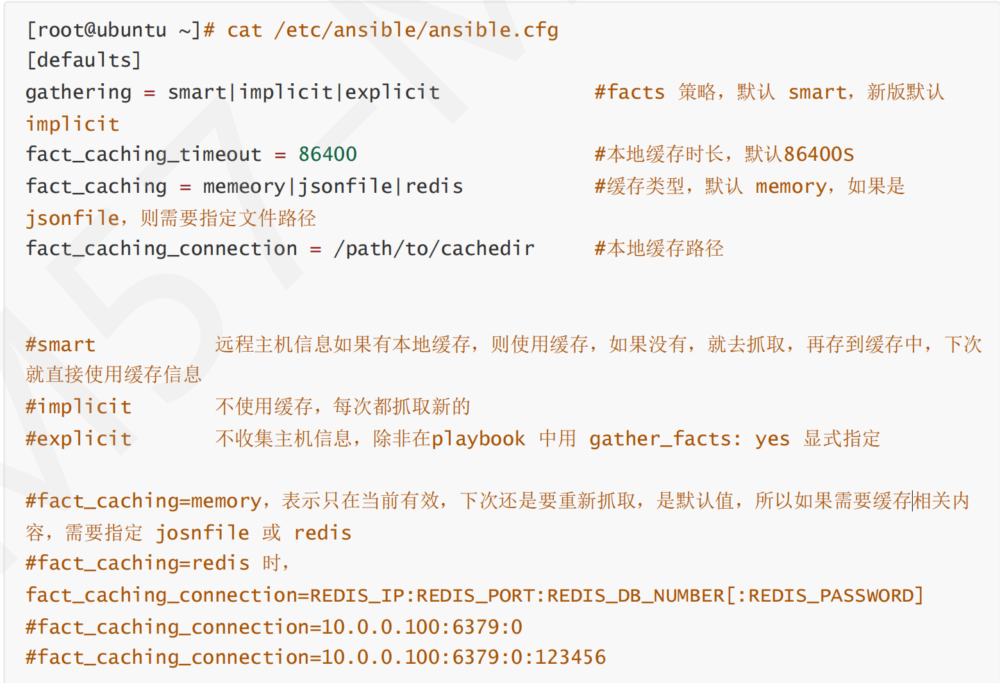

```bash
#配置 facts 信息本地缓存
[root@ubuntu ~]# cat /etc/ansible/ansible.cfg
gathering=smart
fact_caching=jsonfile
fact_caching_connection=/tmp/ansible-facts/
fact_caching_timeout=30
[root@ubuntu ~]# cat facts.yaml 
--- #get facts
- hosts: rocky
 tasks:
   - name: show-facts
     debug: msg={{ ansible_hostname }}
[root@ubuntu ~]# ansible-playbook facts.yaml
#缓存了当前主机的相关信息
[root@ubuntu ~]# tree /tmp/ansible-facts/
/tmp/ansible-facts/
├── 10.0.0.150
└── 10.0.0.213
```

##### 2.4.8.2在命令行中定义变量

```bash
[root@ubuntu ~]# cat var1.yaml 
--- #var1
- hosts: rocky
 gather_facts: no
 tasks:
   - name: show-val
     debug: msg={{ uname }}--{{ age }}
  
   - name: notify
     shell: echo "123"
     notify: handler-1
     handlers:
   - name: handler-1
     debug: msg={{ gender }}  
```

```bash
#直接在命令行中指定     
[root@ubuntu ~]# ansible-playbook -e uname=tom -e age=18 -e gender=M var1.yaml
#多个变量一次定义
[root@ubuntu ~]# ansible-playbook -e "uname=tom age=18 gender=M" var1.yaml
```

```bash
#文件前面要加 @
[root@ubuntu ~]# ansible-playbook -e "@/root/var.txt" var1.yaml
```

##### 2.4.8.3在 playbook 文件中定义变量

在 playbook 文件中定义的变量，只能在当前 playbook 中使用，属于私有变量

```bash
#命令行中变量的优先级最高，会替换文件中的变量
- hosts: rocky86
 gather_facts: no
 vars:
   uname: tom
   age: 20
   gender: F
```

##### 在单独文件中定义变量

##### 在主机清单中定义变量

##### 在项目目录中定义变量

##### 2.4.8.4register 注册变量

在 playbook 中可以使用 register 将捕获命令的输出保存在临时变量中，方便后续调用此变量。

```bash
[root@ubuntu 0209]#cat var8.yaml 
--- # vars8.yaml
- hosts: 10.0.0.166
  gather_facts: no
  tasks:
    - name: register
      shell: hostname
      register: hostname_rs
```

### 2.5Ansible 中的 Templates

狭义来讲，就是一个特定后缀的文本文件，在使用时，可以根据此文件，将部份关健内容进行替换，生成新的文件，以达到在不同主机中，使用不同配置的作用，其中的逻辑部份或动态代码，用 jinja2 来实现。

Jinja2 是 Python下一个被广泛应用的模版引擎，他的设计思想来源于 Django 的模板引擎，并扩展了其语法和一系列强大的功能。

```bash
[root@rocky86 0209]# cat test-1.yaml 
--- #template-test1
- hosts: group1
 gather_facts: yes
 vars:
   var1: 'abcd'
   var2: 3
   var3: 3.14
 tasks:
    - name: template-task-1
     template: src=test-1.j2 dest=/tmp/ansible-test-1.txt
[root@ubuntu 0622]# cat templates/test-1.j2
string------{{ var1 }}---{{ var1*3 }}

int---------{{ var2 }}---{{ var2+10 }}---{{ var2-10 }}---{{ var2*10 }}---{{ var2/10 }}---{{ var2//10 }}---{{ var2**2 }}

float-------{{ var3 }}---{{ var3+10 }}---{{ var3-10 }}---{{ var3*10 }}---{{ var3/10 }}---{{ var3//10 }}---{{ var3**2 }}

facts-------{{ ansible_default_ipv4.address }}
```

```bash
#执行
[root@ubuntu 0622]# ansible-playbook test-1.yaml

#查看远程主机
[root@rocky ~]# cat /tmp/ansible-test-1.txt 
string------abcd---abcdabcdabcd

int---------3---13----7---30---0.3---0---9

float-------3.14---13.14----6.859999999999999---31.400000000000002---0.314---0.0---9.8596

facts-------10.0.0.213
```

#### for和if

```bash
[root@ubuntu 0622]# cat test-2.yaml 
--- #template-test2
- hosts: rocky
 gather_facts: no
 vars:
   var1: 'abcd'
   var2: 3
   var3: 3.14
   var4: 
      - tom
      - jerry
  
   var5: [ {name: tom, age: 123},{name: jerry, age: 456} ]
   var6:
      - {id: 1, ip: 1.1.1.1, port: 11, master: 1}
      - {id: 2, ip: 2.2.2.2, port: 22, master: 0, node: slave-2}
      - {id: 3, ip: 3.3.3.3, port: 33, master: 0, node: slave-3}
 tasks:
    - name: template-task-2
     template: src=test-2.j2 dest=/tmp/ansible-test-2.txt
```

```bash
[root@ubuntu 0622]# cat templates/test-2.j2 

var1 is abcd

===========================

var1 is not abcd

var1 is abcd

===========================

var2 > 3

var2 == 3

var2 < 3

============================

---{{ i }}---{{ i+10 }}

============================

---{{ i }}

===========================

---{{ i.name }}---{{ i.age }}

============================

---{{ i.ip }}:{{ i.port }}----masterslave----node-{{ i.node }} 

#执行
[root@ubuntu 0622]# ansible-playbook test-2.yaml
```

**for** **循环嵌套**

```bash
[root@ubuntu 0622]# cat for.yaml
--- #template-for
- hosts: rocky
 gather_facts: no
 vars:
   var1: [ [zhang,wang,ma],[linux,golang,python] ]
   var2:
      - [tom,jerry]
      - [cat,mouse]
   var3: 
      - {id: 1, stu: [stu-1,stu-2,stu-3]}
      - {id: 2, stu: [stu-a,stu-b,stu-c]}
 tasks:
    - name: template-task-for
     template: src=for.j2 dest=/tmp/ansible-for.txt
```

```bash
[root@ubuntu 0622]# cat templates/for.j2 


--{{ j }}

===================



--{{ j }}

===================


---{{ i.id }}

------{{ j }}

===================


#执行
[root@ubuntu 0622]# ansible-playbook for.yaml
```

### 2.6Ansible 中的流程控制

在 ansible 的 task 中，如果要重复执行相同的模块，则可以使用循环的方式来实现

#### 2.6.1loop (with_items) 迭代

对于迭代项的引用，要使用内置变量 item 来引用，这是固定写法。

迭代元素使用 with_items 来锚定列表，列表中可以是单项元素，也可以是字典。

从 ansible2.5 以后的版本中，使用 loop 来代替 with_items。

例子：

```bash
[root@ubuntu ~]# cat loop-1.yaml 
--- #loop-v1
- hosts: 10.0.0.166
 gather_facts: no
 tasks:
   - name: with_items-task
     debug: msg={{ item }}
     with_items:
      - tom
      - jerry
      - spike
   - name: loop-task
     debug: msg={{ item.name }}--{{ item.age }}
     loop: [ {name: tom, age: 10},{name: jerry, age: 20},{name: spike, age: 30}]
```

```bash
[root@ubuntu ~]# cat loop-2.yaml 
--- #loop-v1
- hosts: 10.0.0.166
 gather_facts: no
  
 tasks:
   - name: create-group
     group: name={{ item }} state=present
     with_items: [ g1,g2,g3 ]
   - name: create-user
     user: name={{ item.name }} group={{ item.group }} state=present
     loop: [ {name: user1, group: g1},{name: user2, group: g2},{name: user3, group: g3} ]
```

```bash
[root@ubuntu ~]# ansible-playbook loop-2.yaml

TASK [create-group] 
*******************************************************************************
changed: [10.0.0.166] => (item=g1)
changed: [10.0.0.166] => (item=g2)
changed: [10.0.0.166] => (item=g3)
TASK [create-user] 
********************************************************************************
changed: [10.0.0.166] => (item={'name': 'user1', 'group': 'g1'})
changed: [10.0.0.166] => (item={'name': 'user2', 'group': 'g2'})
changed: [10.0.0.166] => (item={'name': 'user3', 'group': 'g3'})
PLAY RECAP 
********************************************************************************
********
10.0.0.166 : ok=2    changed=2    unreachable=0    failed=0    skipped=0   
rescued=0    ignored=0
```

#### 2.6.2until 循环

使用 until 也可以控制一个 task 重复执行，until 后面的值或表达式为 true 的时候，才退出重试，即在task 没有获得预期值的情况下，会一直重复执行，直到得到预期结果。

until 默认重试三次，每次重试之间间隔 5S，可自定义修改。

```bash
#远程文件中的内容不是123，则会重试3次
[root@ubuntu ~]# cat until.yaml
--- #until
- hosts: 10.0.0.166
 gather_facts: no
 tasks:
   - shell: cat /tmp/ansible-until
     register: rs
     until: rs.stdout=="123"
```

#### 2.6.3with_lines 逐行处理

with_lines 可以将一条命令的执行结果逐行调用同一个 task 进行处理

```bash
[root@ubuntu ~]# cat with_line.yaml 
--- #with_lines
- hosts: localhost
 gather_facts: no
 tasks:
   - name: with_lines-1
     debug: msg={{ item }}
     with_lines: cat /etc/fstab
```

#### 2.6.4条件判断 when

```bash
[root@ubuntu ~]# cat when.yaml 
--- #when
- hosts: 10.0.0.166:10.0.0.184
  #gather_facts: yes
 tasks:
   - name: redhat-yum-task
     yum: name=httpd state=present
     when: ansible_distribution_file_variety == "RedHat"
   - name: debian-apt-task
     apt: name=apache2 state=present update_cache=yes
     when: ansible_distribution_file_variety=="Debian"
```

**fail_when** **取反**

与when相反，一般不用

#### 2.6.5block 分组

使用 block 可以对 task 任务进行分组，将多个 task 任务放到一个 block 下，可以在写一个 when 判断的情况下调用多个 task 任务

```bash
[root@ubuntu ~]# cat block-1.yaml
--- #block-1
- hosts: localhost
 tasks:
   - name: task-1
     debug: msg=task-1
     when: ansible_distribution_file_variety == 'RedHat'
   - name: task-2
     debug: msg=task-2
     when: ansible_distribution_file_variety == 'RedHat'
     
#使用分组写法，一个block 中可以有多个task
[root@ubuntu ~]# cat block-2.yaml 
--- #block-2
- hosts: localhost
 tasks:
   - block:
      - debug: msg=task-1
      - debug: msg=task-2
     when: ansible_distribution_file_variety == 'RedHat'
```

#### 2.6.6changed_when

只有在 task 的执行结果返回状态为 changed 的时候，我们才认为该 task 是真实执行了，在远程主机上产生了数据变化，但是在 ansible 中，不是所有模块都具有幂等性，对于某些不会产生数据变化的 task ，ansible 也会给出 changed 输出，我们可以使用 changed_when 来避免这一情况。

**changed_when: false**

```bash
#对于此 playbook，task-1 不会在远程主机上产生任何变化，task-2 总会产生变化，但每次执行，都会
产生 changed 的提示
[root@ubuntu ~]# cat changed_when-1.yaml
--- #changed-when-1
- hosts: localhost
 tasks:
   - name: task-1
     shell: id
   - name: task-2
     file: path=/tmp/changed-when state=touch


#对于确定不会发生 change 的 task,可以使用 changed_when 来关闭changed 提示
[root@ubuntu ~]# cat changed_when-2.yaml
--- #changed-when-2
- hosts: localhost
  tasks:
   - name: task-1
     shell: id
     changed_when: false
   - name: task-2
     file: path=/tmp/changed-when state=touch
```

#### 2.6.7滚动执行

默认情况下， ansible 从上到下执行，如果一个 playbook 中有多个 task，在有多台远程主机的情况下，需要在所有远程主机上执行完当前的 task 之后才执行下一个 task，**如果主机过多，或者需要执行的task 比较消耗时间，则会导致所有主机都处于一个执行中状态**。

**默认是从上往下执行，先在 A,B,C 三台主机上执行 Task-1，再在三台主机上执行 Task-2**

滚动执行，深度优先

```bash
[root@ubuntu ~]# cat serial.yaml 
--- #forks
- hosts: group1
  serial: 1 #每次在一台机上执行完所有task，可以写成百分比,如 "20%" 先执行 20% 的主机
```

#### 2.6.8委派执行

**利用委派执行可以在非指定的主机上执行 task**

```bash
[root@ubuntu ~]# cat delegate-2.yaml
--- #delegate-1
- hosts: rocky
  tasks:
   - name: task-1
     shell: hostname -I
     delegate_to: localhost #委派给当前主机执行
     register: rs
   - name: task-2
     debug: msg={{ rs.stdout }}


ok: [10.0.0.150] => {
    "msg": "10.0.0.208 "
}
ok: [10.0.0.213] => {
    "msg": "10.0.0.208 "
}
```

```bash
tasks:
   - name: task-1
     debug: msg=task-1
     delegate_to: localhost
     run_once: true                #只执行一次
```

#### 2.6.9**修改环境变量**

### 2.7Yaml 文件互相调用

利用 include 或 include_tasks 可以在某个 task 中调用其它的只有 task 内容的 yaml 文件，include 在2.16 版本之后被弃用，建议使用 include_tasks 来实现包含。**include_tasks 一次只能引用一个 yaml 文件**

```bash
#正确写法
[root@ubuntu ~]# cat a-1.yaml
--- #a-1.yaml
- hosts: localhost
 tasks:
   - name: task-1
     debug: msg=task-1
   - name: task-2
     include_tasks: file=b.yaml
   - name: task-3
     include_tasks: file=c.yaml
```

##### import_playbook 合并多个 playbook 文件

import_playbook 可以将多个包含完整内容的 yaml 文件交由一个 yaml 统一调用

```bash
[root@ubuntu ~]# cat main.yaml 
- import_playbook: task1.yaml
- import_playbook: task2.yaml
```

### 2.8Ansible 中的 Role

#### 2.8.1Role的组成

role(角色) 用来实现代码的组织管理功能，将实现各种不同功能的 playook 文件，变量文件，模板文件，handlers 文件根据约定，分别放置在不同的目录，分门别类的管理起来，使其看起来更像一个项目，其主要用来解决多文件之间的相互包含，引用，组合等问题，将各个功能模块进行拆分，使其原子化，要实现一个大型复杂需求时，再用 include 指令来引用不同的功能。

**角色一般用于基于主机构建服务的场景中，但也可以是用于构建守护进程等场景中，复杂的场景中，建议使用 roles，代码复用度高。**

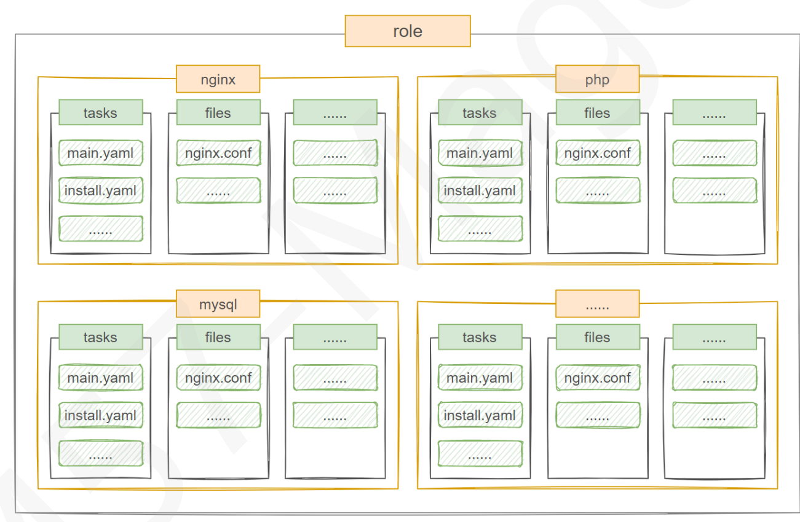

**默认roles存放路径**

```bash
/root/.ansible/roles
/usr/share/ansible/roles
/etc/ansible/roles
```

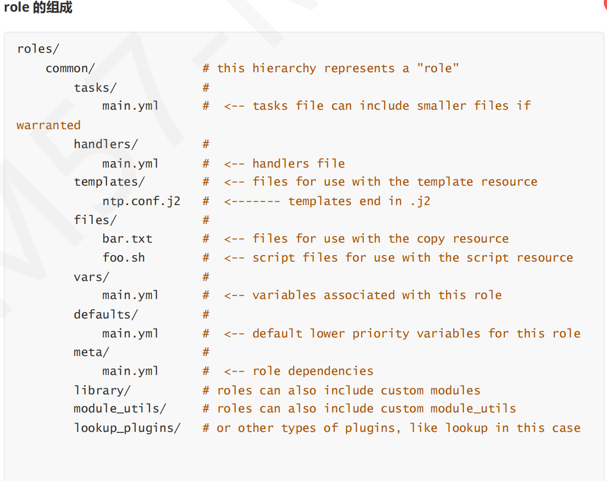

**role** **的目录结构**

**tasks** 任务文件目录，至少有一个名为 main.yaml 文件，该文件通过 include 来引用目录下的其它文件

**files** 该 role 使用过程中要用到的文件，比如安装包，比如 copy 要用到的文件

**vars** 变量文件目录，至少有一个名为 main.yaml 的文件，该文件通过 include 来引用目录下的其它文件

**templates** 模板文件目录，如果没有特别指定，则在该role 中其它文件要引用模板文件都默认存放在此目录

**handlers** 触发器目录，至少要有一个名为main.yaml的文件，该文件通过include 来引用目录下的其它文件

**default** 在该 role 中会用到的默认变量，此处的变量优先级比 vars 中的变量优先级更高

**meta** 额外信息需要用到的一些数据，至少有一个名为 main.yaml 的文件，该文件通过 include 来引用目录下的其它文件

#### 2.8.2在 playbook 中调用 role

```bash
---
- hosts: websrvs
 remote_user: root
 roles:
   - mysql
   - memcached
   - nginx
```

```bash
---
- hosts: websrvs
 remote_user: root
 roles:
   - role: mysql
     var1: 123
   - {role: memecached, var1: 456}
```

```bash
---
- hosts: websrvs
 remote_user: root
 roles:
   - role: mysql
     var1: 123
     when: ansible_distribution_major_version == '7'
     
   - {role: mysql, var1: 456, when: ansible_distribution_major_version == '7'}
```

#### 2.8.3用 role 实现 LNMP

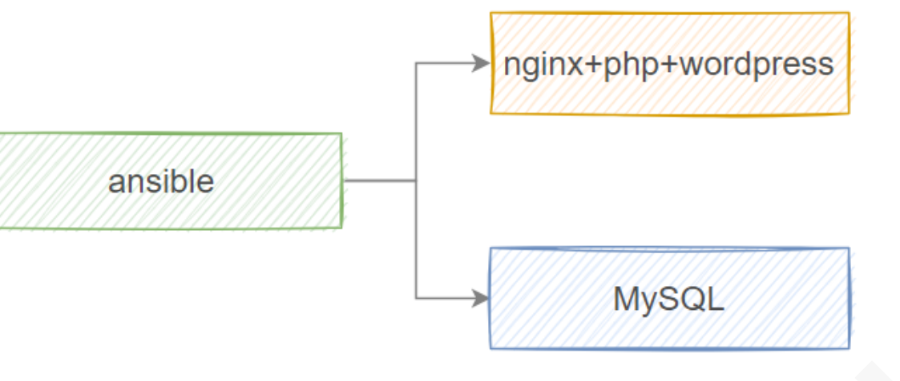

```bash
#创建目录
[root@ubuntu ~]# mkdir -pv 
roles/{mysql,nginx,php,service,wordpress}/{tasks,files,templates}
[root@ubuntu ~]# tree roles/
roles/
├── mysql
│   ├── files
│   ├── tasks
│   └── templates
├── nginx
│   ├── files
│   ├── tasks
│   └── templates
├── php
│   ├── files
│   ├── tasks
│   └── templates
├── service
│   ├── files
│   ├── tasks
│   └── templates
└── wordpress
   ├── files
   ├── tasks
   └── templates
```

### 2.9ansible-galaxy

ansible-galaxy 用来管理官方在云端提供的 role

```bash
https://galaxy.ansible.com/
```

相关配置项

```bash
[root@ubuntu ~]# cat /etc/ansible/ansible.cfg | grep galaxy
[galaxy]
```

列出所有本地 role

```bash
[root@ubuntu ~]# ansible-galaxy list
# /etc/ansible/roles
```

```bash
#搜索与 redis 相关的 role
[root@ubuntu ~]# ansible-galaxy search redis

#查看 galaxy role 相关信息
[root@ubuntu ~]# ansible-galaxy info davidwittman.redis
```

安装 redis

这里的安装是指将相关的 role 文件从服务器上下载到本地，执行还要另外调用 ansible-playbook

```bash
[root@ubuntu ~]# ansible-galaxy install davidwittman.redis
```

### 2.10Ansible Tower

Ansible Tower 是一个图形化基于 WEB 的任务调度，复杂服务部署，IT自动化的一个管理平台，属于发布配置管理系统，支持 Api 及界面操作，基于 Django 编写。Tower 允许对用户进行权限控制，即使某用户不能传送某 SSH 凭证，你也可以通过 Tower 来对该用户共享该凭证。我们可以通过图形化界面来管理 Inventory，也可以对各种各样的云资源做同步。Tower可以记录所有 job 的日志，也可以与LDAP 集成，并且拥有强大的可浏览的 REST API。Tower 也提供了命令行工具，可以与 Jenkins 轻松集成。

但是 ansible tower 是商业产品，仅适用于 redhat 企业版 Linux 中。

```bash
https://releases.ansible.com/ansible-tower/
```

官方文档

```bash
https://docs.ansible.com/ansible-tower/3.8.4/html/
https://docs.ansible.com/ansible-tower/latest/html/userguide/index.html
```

### 2.11公有云中的批量管理

公有云中有也有以 Web 界面提供的批量管理主机的功能。

以阿里云为例，在 ECS 实例列表菜单页面，可以点击 “批量管理” 导航进入该功能。

## 3.企业级调度器LVS


## 4.Linux 虚拟化技术 KVM

### 4.1虚拟化基础

**什么是虚拟化**

**虚拟化（Virtualization）是一种资源分配和管理技术，是将计算机的各种实体资源,比如CPU、内存、磁 盘空间、网络适配器等，进行抽象转换后虚拟的设备**,可以实现灵活地分割、组合为一个或多个计算机配 置环境，并还支持重新分割、重新组合，以达到最大化合理利用物理资源的目的。

参考资料:   https://www.vmware.com/cn/solutions/virtualization.html

**虚拟化优势**

更高的工作负载移动性、更高的性 能和资源可用性、自动化运维 - 这些都是虚拟化的优势。虚拟化技术可以使 IT 部门更轻松地进行管理以 及降低拥有成本和运维成本

**虚拟化类型**

服务器虚拟化：服务器虚拟化支持在**单个物理服务器**上运行**多个操作系统**,每个操作系统作为虚拟机独立运行。

网络虚拟化：通过软件定义网络(Software Defined Network，SDN)，即网络的创建不再依赖于物理设备，如公有云 厂商支持用户自己通过配置界面创建新的网络，在 KVM、docker、kubernetes、openstack等虚拟化 技术中都使用到了网络虚拟化。

桌面虚拟化：将用户的桌面环境（包括操作系统、应用程序和数据）托管在数据中心的服务器上，用户可以通过网络访问这个虚拟桌面，这种方式常见于VDI（Virtual Desktop Infrastructure，虚拟桌面基础架构）等解决方案。

应用虚拟化：将软件应用通过网络实现虚拟化，比如 office 365,钉钉,企业微信

存储虚拟化：将存储用软件虚拟化实现, 如 SAN/NAS(NFS/Samba)/GlusterFS/ceph等

容器虚技术：当前比较火的虚拟化技术，典型代表: Docker、Podman、Linux Container(LXC)、Pouch

**Hypervisor**


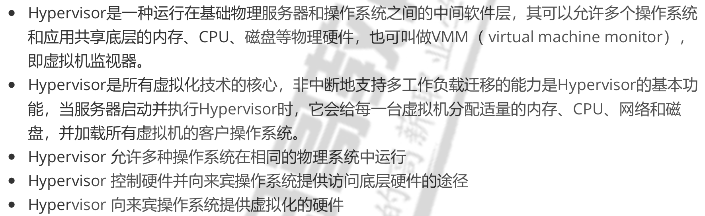

类型 I : 裸金属型

直接运行到物理机的Hypervisor上，这种架构搭建的虚拟化环境称为裸机虚拟化环境(Bare-Metal  Hardware

类型 II : 宿主型  即需要运行在具有虚拟化功能的操作系统上的Hypervisor，构建的是主机虚拟化环境(Hosted  Virtualization)

**虚拟化技术分类**

模拟器/软件仿真，如安卓模拟器

全虚拟机化 full virtualization / 本地虚拟化 native virtualization：软件辅助的全虚拟化 & 硬件辅助的全虚拟化

软件辅助的全虚拟化：Vmware Workstation

**KVM 是硬件辅助的虚拟化技术 主要负责比较繁琐的 CPU 和内存虚拟化**，而 Qemu 则负责 I/O 虚拟化，两者合作各自发挥自身的功能

半虚拟化 para virtualization

### 4.2KVM架构和部署

#### 4.2.1KVM架构

KVM 是基于虚拟化扩展（Intel VT 或者 AMD-V）的 X86 硬件的开源的 Linux 原生的全虚拟化解决方 案。KVM 中，虚拟机被实现为常规的 Linux 进程，由标准 Linux 调度程序进行调度；虚机的每个虚拟  CPU 被实现为一个常规的 Linux 进程。这使得 KVM 能够使用 Linux 内核的已有功能。

但是，KVM 本身不执行任何硬件模拟，需要客户空间程序通过 /dev/kvm 接口设置一个客户机虚拟服务 器的地址空间，向它提供模拟的 I/O，并将它的视频显示映射回宿主的显示屏。目前这个应用程序使用  QEMU。


KVM： 初始化CPU硬件,打开虚拟机模式,负责CPU,内存,中断控制器,时钟. 由内核模块kvm_xxx.ko 实现，工作于hypervisor，设备/dev/kvm，是一个字符设备，在用户空间可通过ioctl()系统调用来 完成VM创建、启动，为VM分配内存、读写VCPU的寄存器、向VCPU注入中断、时钟等管理功能

QEMU进程：工作于用户空间，主要用于实现模拟IO设备,如显卡，网卡，硬盘等， qemu-kvm进 程：工作于用户空间，用于实现一个虚拟机实例

Libvirt：提供统一API，守护进程libvirtd和相关工具，如:virsh，virt-manager等

##### KVM 集中管理与控制

KVM是运行在单机的系统，需要其它软件实现跨主机的统一的管理。常见的虚拟化管理平台如下： http://www.Linux-kvm.org/page/Management_Tools

oVirt 功能强大，是Redhat虚拟化管理平台RHEV的开源版本。 http://www.ovirt.org/ WebVirtMgr  https://www.webvirtmgr.net virt-manager的Web模式的替代品 OpenStack 最主流的开源虚拟化管理平台

#### 4.2.2宿主机环境准备

CPU开启虚拟化

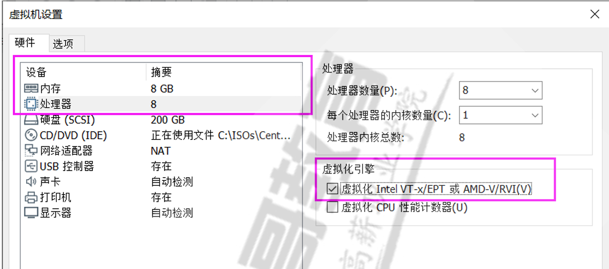

验证开启虚拟化

```bash
grep -Em 1  "vmx|svm" /proc/cpuinfo 
#Intel CPU 对应 vmx
 #AMD  CPU 对应 svm 

#查看AMD主机的内核模块
[root@centos8 ~]#lscpu|grep svm
[root@centos8 ~]#lsmod |grep kvm
[root@centos8 ~]#ll /dev/kvm
```

#### 4.2.3libvirt 包功能及KVM安装

libvirt 程序包是一个与虚拟机监控程序相独立的虚拟化应用程序接口，它可以与操作系统的一系列虚拟 化性能进行交互

libvirt 程序包提供： 一个稳定的通用层来安全地管理主机上的虚拟机。 一个管理本地系统和连网主机的通用接口。

在虚拟机监控程序支持的情况下，部署、创建、修改、监测、控制、迁移以及停止虚拟机操作都需要这 些API。尽管 libvirt 可同时访问多个主机，但 API 只限于单节点操作

**libvirt 结构图**

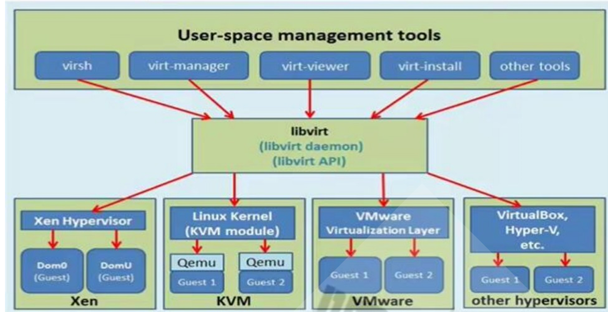

**安装KVM相关包**

官方文档:  https://ubuntu.com/server/docs/virtualization-libvirt

```bash
[root@ubuntu2204 ~]#apt -y install cpu-checker
 [root@ubuntu2004 ~]#apt -y install cpu-checker
 #如果CPU不支持会如下提示，是否有开启虚拟化
[root@ubuntu2004 ~]#kvm-ok

[root@ubuntu2004 ~]#apt update
 [root@ubuntu2204 ~]#apt -y install qemu-kvm virt-manager libvirt-daemon-system
 [root@ubuntu1804 ~]#ip a
```

CentOS 安装 KVM

```bash
[root@centos8 ~]#yum -y install qemu-kvm  libvirt   virt-manager virt-install 
virt-viewer
 [root@centos8 ~]#systemctl start --now libvirtd
 
 #CentOS 8 还提供基于Web的虚拟机管理方式
[root@centos8 ~]#yum -y install cockpit  cockpit-machines
[root@centos8 ~]#systemctl  enable --now cockpit.socket
#打开浏览器，访问以下地址：
https://centos8主机:9090

```

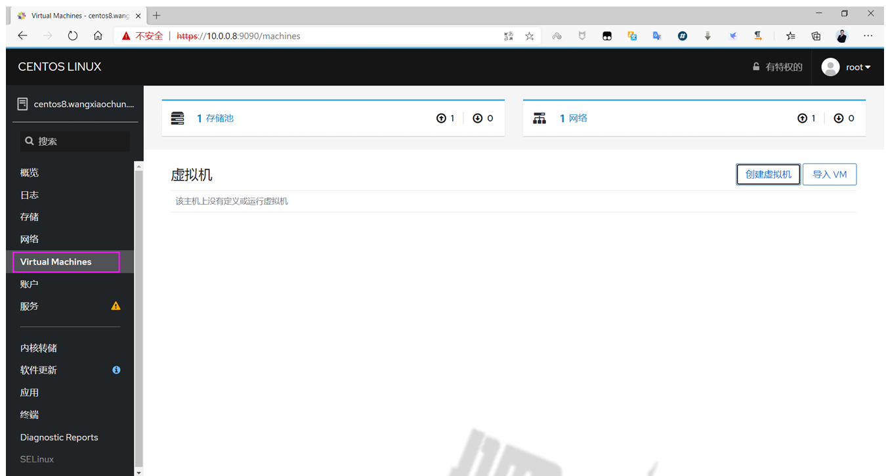

图形化工具 virt-manager

```bash
[root@centos8 ~]#export DISPLAY=10.0.0.1:0.0
 [root@centos8 ~]#virt-manager 
[root@centos8 ~]#libGL error: No matching fbConfigs or visuals found
 libGL error: failed to load driver: swrast
 
#如果出现乱码，设置语言
[root@ubuntu2204 ~]#localectl set-locale LANG=en_US.UTF-8;exit
```

默认网络配置

```bash
#安装完虚拟工具后,会自动生成一个 virbr0 网卡,类似于Vmware workstation 生成的VMnet8 网卡,充当虚拟机的 NAT 网卡
[root@centos8 ~]#ip a
[root@centos8 ~]#grep -R  192.168.122.1 /etc/libvirt/*

[root@centos8 ~]#cat /etc/libvirt/qemu/networks/default.xml

[root@centos8 ~]#nmcli connection show virbr0
```

Ubuntu 网络配置

```bash
[root@ubuntu1804 ~]#ip a
[root@ubuntu1804 ~]#brctl show

[root@ubuntu1804 ~]#cat /etc/libvirt/qemu/networks/default.xml 
```

#### 4.2.4准备安装系统的ISO相关文件

```bash
[root@centos8 ~]#mkdir -pv /data/isos/
 [root@centos8 ~]#ls /data/isos/
 CentOS-7-x86_64-Minimal-2009.iso
 CentOS-8.2.2004-x86_64-minimal.iso
```

#### 4.2.5AMD CPU 创建虚拟机时的故障排错

AMD CPU 使用virt-manager 或 virt-install 在创建虚拟机可能会出错,用下面方法解决

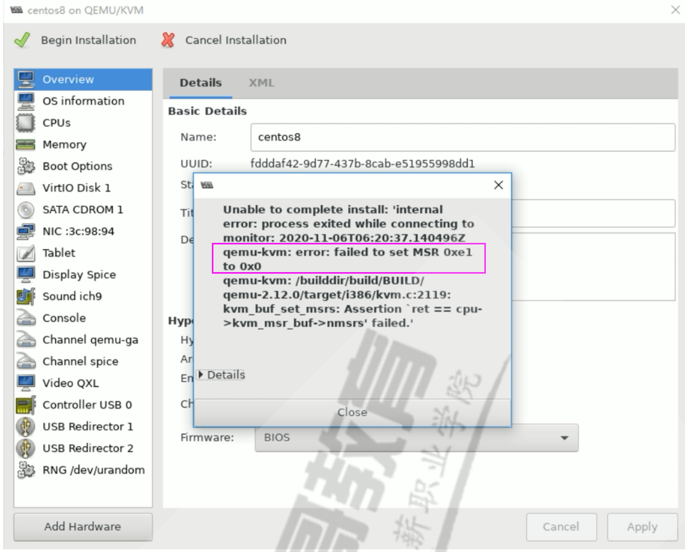

```bash
[root@centos8 ~]#virt-install --virt-type kvm --name centos7 --ram 1024 --vcpus 2--cdrom=/data/isos/CentOS-7-x86_64-Minimal-2009.iso --disk  path=/var/lib/libvirt/images/centos7.qcow2 --network network=default  --graphics  vnc,listen=0.0.0.0 --noautoconsole
```

故障修复方法

```bash
#修复以上故障
[root@centos8 ~]# tee /etc/modprobe.d/qemu-system-x86.conf << EOF
 > options kvm ignore_msrs=1
 > EOF
 options kvm ignore_msrs=1
 [root@centos8 ~]#reboot

```

### 4.3创建虚拟机（安装过程看安装文档）

使用 virt-manager 创建虚拟机

```bash
[root@centos8 ~]#export DISPLAY=10.0.0.1:0.0
[root@centos8 ~]#virt-manager 
```


......


#### 使用 virt-install 创建虚拟机

虽然使用virt-manager 可以方便的管理虚拟机,但如果需要批量进行虚拟机的创建管理,命令行工具virt install 更加方便和适合

**virt-install 命令创建虚拟机**

利用 qemu-img命令创建虚拟磁盘  注意: qemu-img create 一定要确认对应路径下没有此文件,如果存在将覆盖原文件

```bash
[root@centos8 ~]#qemu-img  create -f qcow2 /var/lib/libvirt/images/centos7.qcow2 20G

#观察文件虚拟磁盘大小,比较用virt-manager创建的虚拟机磁盘文件大小
[root@centos8 ~]#ll -h /var/lib/libvirt/images/centos7.qcow2
```

**利用 osinfo-query命令查看支持的OS版本**

```bash
[root@ubuntu2004 ~]#apt install libosinfo-bin
[root@ubuntu2004 ~]#osinfo-query os |grep -i rhel
#查看支持的OS
[root@centos8 ~]#osinfo-query os| grep centos
```

**创建虚拟机使用光盘启动并手动安装**

```bash
#创建默认NAT模式的虚拟机,并不自动打开virt-viewer连接console,需要手动打开virt-manager 连
接,并手动安装系统
[root@centos8 ~]#virt-install --virt-type kvm --name centos7 --ram 1024 --vcpus 2--cdrom=/data/isos/CentOS-7-x86_64-Minimal-2009.iso --disk path=/var/lib/libvirt/images/centos7.qcow2 --network network=default  --graphics vnc,listen=0.0.0.0 --noautoconsole --os-variant=centos7.0
[root@centos8 ~]#export DISPLAY=10.0.0.1:0.0
[root@centos8 ~]#virt-manager

#安装过程略
#示例：使用桥接网络
```

**验证宿主机进程**

#### 基于现有虚拟机磁盘为模版创建新的虚拟机

利用virt-manager实现

利用virt-install实现

利用virt-clone克隆实现

### 4.4管理虚拟机

使用半虚拟化驱动 virtio

半虚拟化驱动virtio的工作原理

为了提高内存、硬盘、网络的性能，需要支持半虚拟化

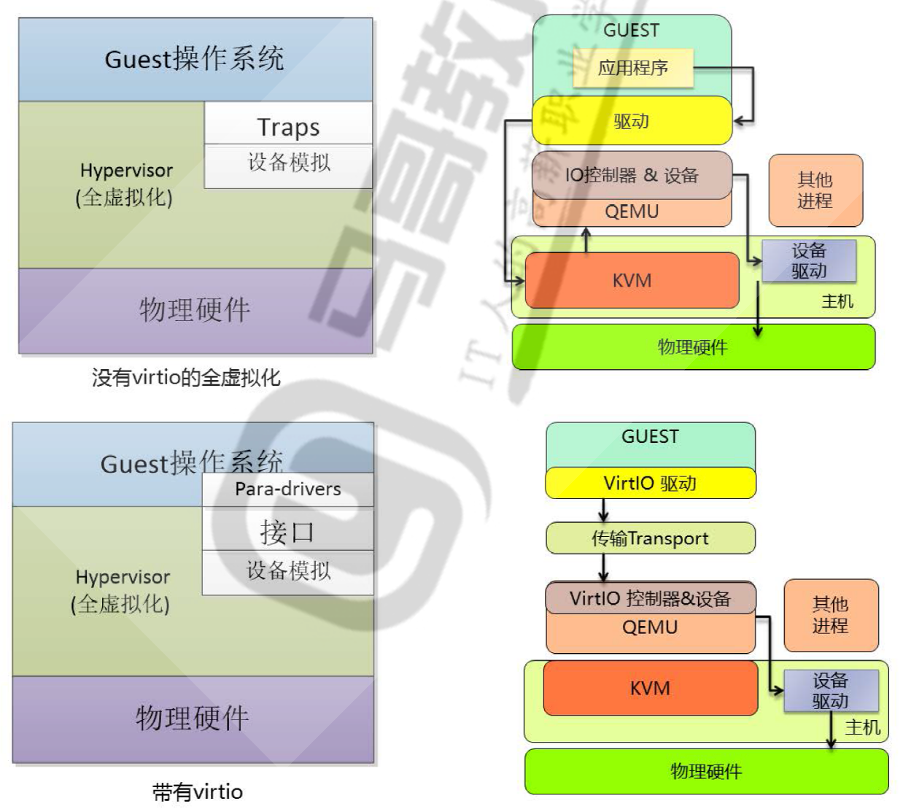

virtio 是一种 I/O 半虚拟化解决方案，是一套通用 I/O  设备虚拟化的程序，是对半虚拟化 Hypervisor 中 的一组通用 I/O  设备的抽象，提供了一套上层应用与各 Hypervisor   虚拟化设备（KVM，Xen， VMware等）之间的通信框架和编程接口，减少跨平台所带来的兼容性问题，大大提高驱动程序开发效 率，Windows  系统需要单独安装virtio驱 动，Linux系统自带virtio驱动。

### 4.5存储管理

### 4.6网络管理

## 5.堡垒机和jumpserver

堡垒机 

由于跳板机的不足，更多的组织需要更先进、更好的安全技术,来实现运维操作管理和安全。 

堡垒机开始以独立的产品形态被广泛部署，有效降低了运维操作风险，使得运维操作管理变得更简单、 更安全。 

堡垒机能满足角色管理与授权审批、信息资源访问控制、操作记录和审计、系统变更和维护控制要求， 并生成一些统计报表配合管理规范，从而不断提升IT内控的合规性。

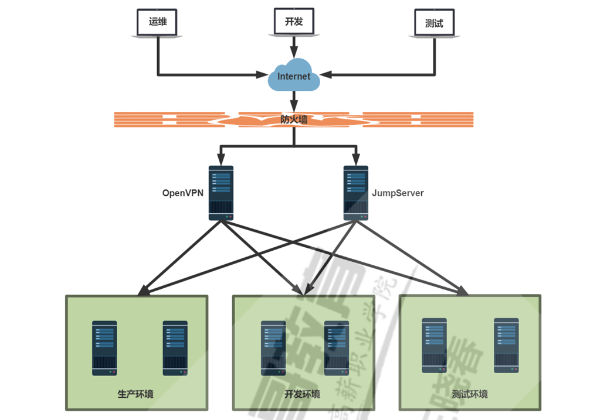

**优势**

开源: 零门槛，线上快速获取和安装 

分布式: 轻松支持大规模并发访问； 

无插件: 仅需浏览器，极致的 Web Terminal 使用体验 

多云支持: 一套系统，同时管理不同云上面的资产 

云端存储: 审计录像云端存储，永不丢失 

多租户: 一套系统，多个子公司和部门同时使用

**功能列表**

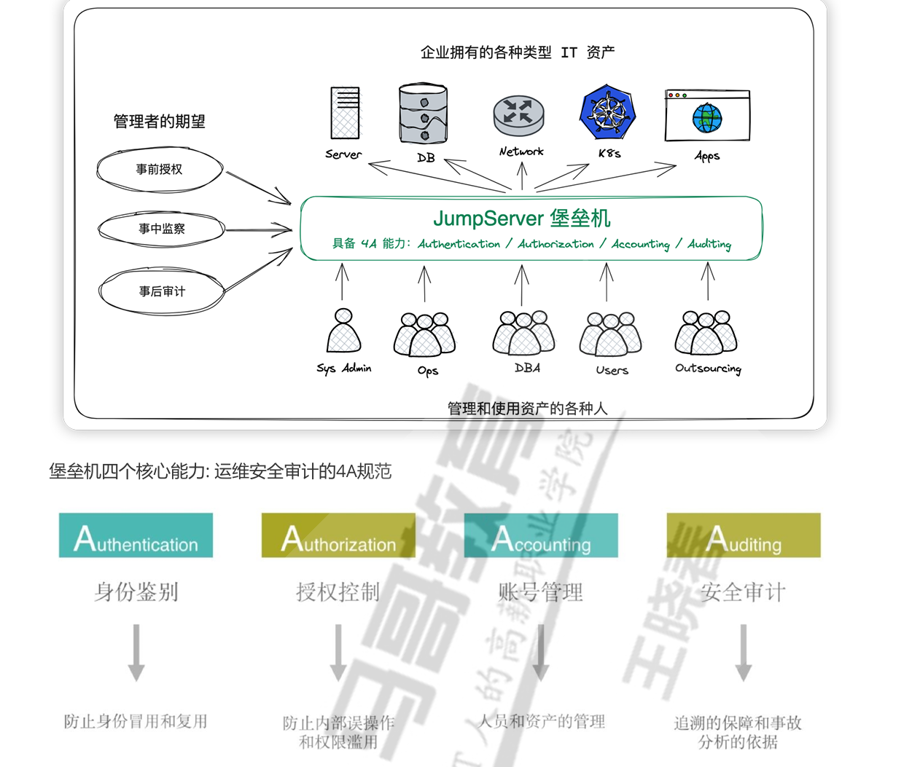

**JumpServer 组成**

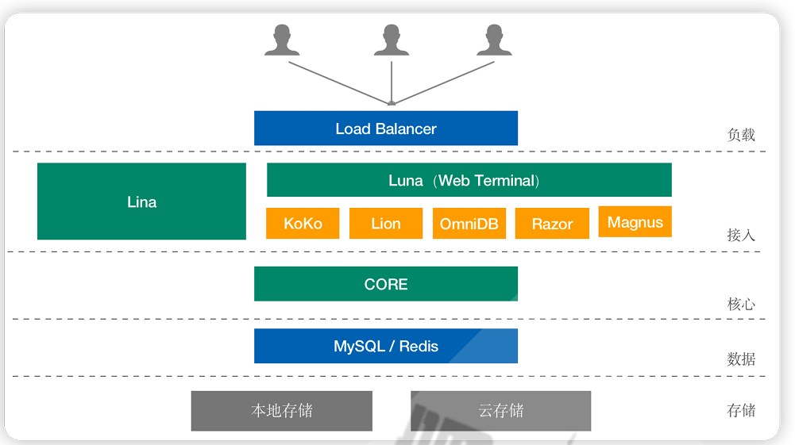

### 1.1JumpServer 安装

官方说明 https://docs.jumpserver.org/zh/master/install/setup_by_fast/

手动部署: 按组件逐个实现

极速部署: 资产数量不多，或者测试体验的用户请使用本脚本快速部署

容器部署: 基于 docker 和docker-compose 实现

分布式部署: 适用大型环境

#### 1.1.1基于 Docker 部署

官方文档:  https://github.com/jumpserver/Dockerfile/tree/master/allinone 

https://docs.jumpserver.org/zh/master/install/docker_install/

#### 1.1.2安装mysql服务

基于Jumpserver-v3.8.1 支持MySQL8.0 ,但默认MySQL8.0验证插件是caching_sha2_password，不符 合要求，需要修改为mysql_native_password

```bash
create database jumpserver default charset 'utf8';
 create user 'jumpserver'@'%' identified by 'nu4x599Wq7u0Bn8EABh3J91G';
 grant all on jumpserver.* to 'jumpserver'@'%';
 flush privileges;
```

注意： 基于Jumpserver-v3.8.1 支持MySQL8.0 ,但默认MySQL8.0验证插件是caching_sha2_password，不符 合要求，需要修改为mysql_native_password

**在宿主机准备MySQL配置文件(可选)**

**启动 MySQL 容器**

**验证 MySQL**

#### 1.1.3安装 Redis 服务

官方说明 https://docs.jumpserver.org/zh/master/install/prod/distributed_04/

外置 Redis 要求 Redis 版本大于等于 6.0 

注意:不支持redis7.0

```bash
[root@ubuntu2204 ~]#docker run -d -p 6379:6379 --name redis --restart always  
redis:6.2.14

[root@ubuntu2004 ~]#yum  -y install redis
[root@ubuntu2004 ~]#redis-cli -h 10.0.0.8
```

#### 1.1.4部署 JumpServer

**生成 key 和 token**

```bash
https://github.com/jumpserver/Dockerfile/tree/master/allinone
 https://docs.jumpserver.org/zh/master/install/docker_install/   #用docker安装
```

需要先生成 key 和 token


**运行容器**

JumpServer v3.8.1 版

```bash
[root@ubuntu2204 ~]#docker run --name jms_all -d \-p 80:80 \-p 2222:2222 \-p 30000-30100:30000-30100 \-e SECRET_KEY=HuMa1pnvbjrLeiBEJTUoQfBwPMrsZYlL6jpik46Hcib4PHMldx \-e BOOTSTRAP_TOKEN=2wqN3fWeB4KaSLTMoyK5JgSylkS2z9 \-e LOG_LEVEL=ERROR \-e DB_HOST=10.0.0.201 \-e DB_PORT=3306 \-e DB_USER=jumpserver \-e DB_PASSWORD=123456 \-e DB_NAME=jumpserver \-e REDIS_HOST=10.0.0.201 \-e REDIS_PORT=6379 \-e REDIS_PASSWORD='' \--privileged=true \-v /opt/jumpserver/core/data:/opt/jumpserver/data \-v /opt/jumpserver/koko/data:/opt/koko/data \-v /opt/jumpserver/lion/data:/opt/lion/data \-v /opt/jumpserver/magnus/data:/opt/magnus/data \-v /opt/jumpserver/kael/data:/opt/kael/data \-v /opt/jumpserver/chen/data:/opt/chen/data \-v /opt/jumpserver/web/log:/var/log/nginx \jumpserver/jms_all:v3.8.1
```

**验证是否成功**

```bash
#查看jumpserver-v3.4.3日志确认成功
[root@ubuntu2204 ~]#docker logs -f jms_all
```

**查看 MySQL 中生成相关表**

```bash
[root@centos8 ~]#docker exec -it mysql sh
```

##### 基于自定义网络利用Docker部署 JumpServer

##### Docker-Compose 部署

```bash
https://github.com/jumpserver/Dockerfile/blob/master/allinone/docker-compose.yml
```

##### 官方脚本一键安装

```bash
https://docs.jumpserver.org/zh/v3/installation/setup_linux_standalone/online_install/
```

### 1.2JumpServer 常见功能

官方文档: https://docs.jumpserver.org/zh/master/

#### 1.2.1登录并初始化配置

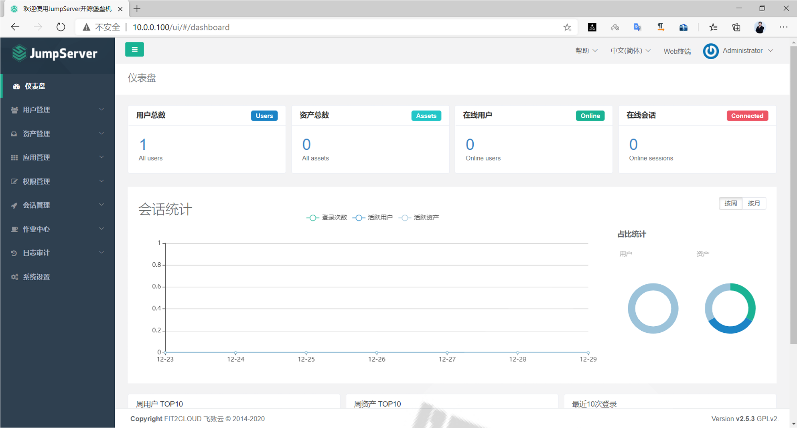